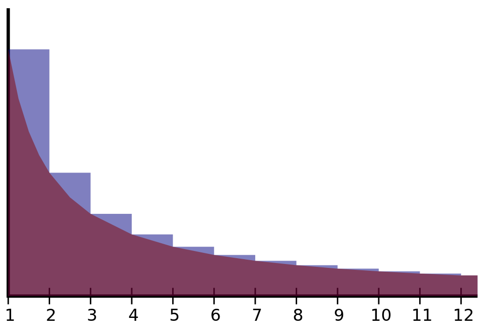
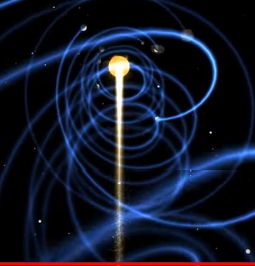
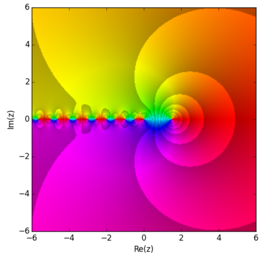

---
output:
  pdf_document: default
  html_document: default
---
# On the unicity and location of the orbits homeomorphic to the zeta function: defining conditions for infinite non-trivial zeros from holomorphic spirals. 
### Unicity and location of the zeta spirals define conditions for non-trivial zeros 
*Felipe Coelho Argolo*$^{1}$  
Universidade Federal de São Paulo  
email: felipe.c.argolo @protonmail.com; @hotmail.com; @gmail.com  

## Abstract
The zeta function is defined as the analytic continuation of the Dirichlet series $\zeta(s)=\sum_{1}^{\infty}\frac{1}{n^{s}}, Re(s) > 1$. Riemann hypothesized that besides the trivial zeros, located at the even negative integers of s$(\Re(s)=-2n; n=1,2,3,4,...)$, all other zeros would be images of $Re(s)=\frac{1}{2}+\theta i$.

We define homeomorphisms $M$ between values of $\zeta(s)$ and the set $S$ of spiraled involuted orbits $S$. $M$ defines a bijections between orbits and lines with fixed $Re(s)$ parallel to the imaginary axis. 

For infinite non-trivial zeros, we demonstrate that the $\epsilon$ distance to the spiral's attractor must converge to 0 at unique periodic rate. 

It has previously been show that there are infinitely many non-trivial zeros along the critical line, $Re(s)=1/2$.   

The identity between the Euler-Mascheroni constant, the harmonic series and the natural logarithm identifies the spiral $R$ containing the target orbits $s=1/2 + \theta i$ as the only element of $S$ satisfying the conditions.  
  
The value of $Re(s_{non_trivial})=\frac{1}{2}$ is a direct consequence of the Hausdorff–Young inequality, reflecting the cardinal inequality between rational numbers in the harmonic series and uncountably infinite real numbers in the natural logarithm $C(\mathbb{Q}) = C(\mathbb{N}) = \aleph \neq C(\mathbb{R}) = 2 \aleph$.
 
We examine axiomatic systems under which the conclusion holds and give geometrical demonstrations for other previously described identities.  

*Keywords*: Riemann hypothesis, zeta function, non-trivial zeros; 

\pagebreak

## Introduction

The zeta function is defined as the analytic continuation of the Dirichlet series $\zeta(s)=\sum_{1}^{\infty}\frac{1}{n^{s}}, Re(s) > 1$. Riemann hypothesized that besides the trivial zeros, located at the even negative integers of s$(\Re(s)=-2n; n=1,2,3,4,...)$, all other zeros would be images of $R(s)=\frac{1}{2}+\theta i$.

## Homeomorphisms of $\zeta$

### $S$ Spirals

Define bijective mappings $M$ of the set $Z = \zeta(s)$ in the complex plane to the set $S$ of spirals. 

Each spiral $R$ is a subset of $S$ whose elements are involutes $(C_{a}(C + Im(s)))$ of circles $(C cos(\theta), C sin(\theta))$ with radius identical to other elements in $R$ according to the real part of $s$ $C_(s)=Re(s)$. Constant values of $Re(s)$ define lines parallel to the imaginary axis.

The holomorphism of objects homeomorphic to these have been demonstrated in Davis solution for the analytic continuation of the Theodorus Spiral. Also in evaluation of Archimedean Zeta Integrals.

The Borel–Carathéodory theorem demonstrates that if this function is analytic on a closed disc of radius $R$ centered at the origin, it is bounded by its real part. This is the case for the critical strip, $0<Re(s)<1$. Therefore, in the critical strip, there is always a real number M bounding the involutions $f(x)$ generating $R$.   

We define subsets of $R_{Re(s)}$ of $S$ for complex numbers $s$ with identical $Re(s)=c$ as a function $f$ of $s$. The orbits with constant real part $c$, $R_{c}$:
$$S = R_{c}(s_{s}) = \{f: c + \theta i|c \in Re(s) \}$$  

We can parameterize the equations as:    
$$X(\theta) = c(cos \theta + (\theta) sin(\theta)),$$  
$$Y(\theta) = c(sin \theta - (\theta) cos(\theta))$$  

Given the tangential angle, $\phi(\theta)$.

Similar geometrical objects have been examined in complex analysis (e.g. Theodorus Spiral and Archimedean Zeta Integrals).  

The arcs's lengths of the circular converges to a value given by the integral of the involutes of the circle with radius $c$:
$$c \int_{0}^{\theta} \sqrt{1+\theta^2} d\theta$$
$$=\frac{1}{2}c(\theta \sqrt{1+\theta^2} + sinh^{-1}\theta)$$  
$$=\frac{1}{2}c(\theta \sqrt{1+\theta^2} + ln(\theta + \sqrt{1+\theta^2}))$$
Which is our **first identity**.  
The curvature:  
$$\kappa(\theta)=\frac{2+\theta}{r (1+\theta^2)^{3/2}}$$

Each element of $R$ corresponds to an observations of an infinite rotating orbit towards an attractor (singularity) at subsequent time steps, which become smooth as $t \rightarrow +\infty$ and $\epsilon \rightarrow 0$. 

A point moves with uniform acceleration along the spiral while the spiral corresponds to the locations over time of a point moving away from a fixed point with a constant speed along a line that rotates with constant angular velocity.$^11$

**Lemma 1: For real values in the critical strip, involutions define bijections for sets of $\zeta(s)$ with identical real values**  

From the definition of operations in the complex plane, involutions $\vec{C_{\theta}}(s)=\vec{C_{0}}(s)+ \theta \vec{c'(s)}$ use $c'(s)$ as the unit normal for $\vec{C(0)}$.
Hence, increasing values of $\theta$ in $Im(s)=\theta i$ defines unique images of parallel spirals in $S$.  

## Conditions for infinite non-trivial zeros

Next lemmas describe the conditions for a set of orbits containing infinite images of $\zeta(s)=0, s \in \not{Tr}{\zeta_{0}}$ .

**Lemma 2: The elements of the unique set of orbits with images containing the infinite non-trivial zeros are the spiral $R_{0}$ asymptoptically approaching the real line as $n \rightarrow \infty$ at a specific rate.**  

**Lemma 3: Mertens' third theorem provide the asymptoptic limit for the corvegence rate values associated with this set R_{0} of unique orbits.**

In the set $S$ of spirals $R$, consider a potentially non empty subset $S'$ of curves whose involutions define arcs constinously rotated towards the non-trivial values of $Re(\zeta(s))=0$. That is, tho
se with real part not in the set of negative even intergers $s \in \not{Tr}{\zeta_{0}} \rightarrow Re(s) \notin Tr_{\zeta_{0}}, Re(Tr_{\zeta_{0}}) = -2n, n =1,2,3,4,...$.  
plex sequences. 

It was proved by Franz Mertens that, if the series 
${ \sum _{n=0}^{\infty }a_{n}} \sum _{{n=0}}^{\infty }a_{n}$ converges to A and ${\sum _{n=0}^{\infty }b_{n}} \sum _{{n=0}}^{\infty }b_{n}$ converges to B, and at least one of them converges absolutely, then their Cauchy product converges to AB.

## Orbits with real parts equal to one half 

**Theorem for unicity and location of non-tr
Harmonic series = discrete vectorial (grid ~ cardinality) sum with $1/n$ rate 

### Mertens' theorem
Let (an)n >= 0 and (bn) n>= 0 be real or complex sequences. It was proved by Franz Mertens that, if the series 
${ \sum _{n=0}^{\infty }a_{n}} \sum _{{n=0}}^{\infty }a_{n}$ converges to A and ${\sum _{n=0}^{\infty }b_{n}} \sum _{{n=0}}^{\infty }b_{n}$ converges to B, and at least one of them converges absolutely, then their Cauchy product converges to AB.

## Orbits with real parts equal to one half 

**Theorem for unicity and location of non-trivial zeros: Among the orbits associated with $Re(\zeta(s))=0$, the ones containing zeros not in the trivial period $(Re(s)=-2n, n \in \mathbb{N})$ are the images of $zeta(s), Re(s) = \frac{1}{2}$.**
  
The argument is as follows:

The value of $Re(s_{non_trivial})=\frac{1}{2}$ is a direct consequence of the Hausdorff–Young inequality, reflecting the cardinal inequality between rational numbers in the harmonic series and uncountably infinite real numbers in the natural logarithm $C(\mathbb{Q}) = C(\mathbb{N}) = \aleph \neq C(\mathbb{R}) = 2 \aleph$.  

@ Hadamard three-lines theorem
@ Hadamard three-circles theorem

The spiral converges towards the unique attractor fixed at $Re(\zeta{s})=0$. The total rotation angle is defined by the second moment when $s \rightarrow \infty$. The identity between the Euler-Maschero
https://www.wolframalpha.com/input/?i=zeta+of+(1%2F2+%2B+theta*i)
https://www.wolframalpha.com/input/?i=zeta+of+(1+%2B+2theta*i)
https://www.wolframalpha.com/input/?i=laurent+series+of+(zeta+of+(1+%2B+2theta*i))

As said, the second moment is related to the scaping velocity by the length of the spiraled arc, which has converging series or analytical extension: 
$$L=\frac{1}{n^{2Re(s)}}$$ 
$$= \zeta(2Re(s))$$.  

If the resulting vector $\vec{v_{s}}$ makes angle $\theta + \frac{\pi}{2}$ with the origin of the real axis, then 
$$Im(\vec{v_{s}})=\vec{v_{s}}*cos(\theta)i$$
Since we are considering zeros at the real axis, the projection on the real axis is $cos(\theta+ \frac{\pi}{2})$, the opposite of $sin \theta$. Diagram:

Identites:
$$Re(\vec{v_{s}})=\vec{v_{s}}*-sin(\theta)$$.  
$$Im(\vec{v_{s}})=\vec{v_{s}}*cos(\theta)i$$

$$s = \vec{v_{s}}*-sin(\theta) + \vec{v_{s}}*cos(\theta)$$

The projection $Re(s)$ will be 0 when:

$$s = \vec{v_{s}}*-sin(\theta) + \vec{v_{s}}*cos(\theta)$$
  
which is $s(cos(\theta)-sin(\theta))$ or
$(\frac{1}{2} - \frac{i}{2}) e^{-i\theta} s + (\frac{1}{2} + \frac{i}{2}) e^{i \theta} s$ or
$$s = \sqrt(2) \vec{s} sin(\pi/4 - \theta)$$
$$= \sqrt(2) \vec{s} -sin(\theta)$$
$$= \sqrt(2) Re(s)$$
$$Re(s) = \frac{s}{\sqrt(2)}$$

Taking the derivatives with respect to Re(s) and Im(s):
$$\frac{d}{da} \frac{a+bi}{\sqrt(2)} = 1/\sqrt(2)$$
$$\frac{d}{db} \frac{a+bi}{\sqrt(2)} = 1/\sqrt(2)$$

Notice roots in $$\theta = \pi n - \frac{3\pi}{4}$$ n in $Z$.

  
The first moment is $M_{1}$. If the $n_{th}$ line segment length is given by $\frac{1}{n^{s}}$, we evaluate the moment around the real axis by the sum the distances $M_{1} = \sum_{1}^{\infty}\frac{1}{n^{s}}$.  

When $\zeta(s)$ approaches 0, that the vectorial sum approaches the center of the real axis. This is equal to rotate the object enough to cancel its projection on the real axis. 
 
The first moment is $M_{1}$. If the $n_{th}$ line segment length is given by $\frac{1}{n^{s}}$, we evaluate the moment around the real axis by the sum the distances $M_{1} = \sum_{1}^{\infty}\frac{1}{n^{s}}$.  

Consider the series $\zeta(s), Re(s)=2, Im(s)=0$.
The corresponding segmented object's length converges to:  
$$\zeta(2)=\sum_{n= 1}^{\infty}\frac{1}{n^{2}}$$  
$$=\frac{1}{1^{2}}+\frac{1}{2^{2}}+\frac{1}{3^{2}}+...$$
$$\zeta(2)=\frac{\pi^{2}}{6}$$  
The identity by Euler which solved the Basel problem.  

We shall now consider our series with imaginary numbers:  
$$\zeta(s)=\sum_{n= 1}^{\infty}\frac{1}{n^{s}}, Re(s)>1,Im(s)\neq 0$$  

Consider if the imaginary part of the previous series, $\zeta(2)$, was  $Im(s)=\frac{\pi}{3}i$, then:  
$$\zeta(2 + \frac{pi}{3})=\sum_{n= 1}^{\infty}\frac{1}{n^{2+\frac{\pi}{3}i}}$$
$$=\sum_{n= 1}^{\infty}\frac{1}{n^{2}}*\frac{1}{n^{\frac{\pi}{3}i}}$$

By the definition, this is the dot product ani constant, the harmonic series and the natural logarithm identifies the spiral with orbits $s=1/2 + \theta i$ as the only element of $S_{0}$.  
  
The value of $Re(s_{non-trivial})=\frac{1}{2}$ is a direct consequence of cardinal inequality between rational numbers in the harmonic series $C(\mathbb{Q}) = C(\mathbb{N})= \aleph$) and uncountably infinite real numbers.

It could also be demonstrated from Kolmogorov axioms by defining the characteristic function of probability functions defined after elements of $S$.   

For a distribution of mass or probability on a bounded interval, the collection of all the moments (of all orders, from 0 to $\infty$) uniquely determines the distribution (Hausdorff moment problem).

There are three named classical moment problems: the Hamburger moment problem in which the support of $\mu$ is allowed to be the whole real line; the Stieltjes moment problem, for $[0,\infty)$; and the Hausdorff moment problem for a bounded interval, which without loss of generality may be taken as [0, 1].
The uniqueness of $\mu$ in the Hausdorff moment problem follows from the Weierstrass approximation theorem, which states that polynomials are dense under the uniform norm in the space of continuous functions on [0, 1]. For the problem on an infinite interval, uniqueness is a more delicate question; see Carleman's condition, Krein's condition and Akhiezer (1965).

Laurent Series is applicable in bounded intervals.

These are involutions using line segments parallel to the imaginary axis. The arc's length is parameterized as:  
$$\vec{X} = \vec{C_{\kappa}} = \vec{c}(\theta) - \frac{\vec{c}'(\theta)}{|\vec{c}'(\theta)|} \int_{\kappa}a^{\theta}|\vec{c}'(\omega)|d\omega$$  
The integral over $s$ represents the length of the free part of the string in the interval $[0,t]$ and the vector prior to that is the tangent unitvector.  :   
$$C_{a}(s) = \int_{R^d}^{} Re(y)Im(x-y)ds$$  
$$=\int_{R^d}^{} Re(x-y)Im(y)dy$$  

## Axiomatic basis and geometrical intuitions

We examine axiomatic systems under which the conclusion holds and give geometrical demonstrations for other previously described identities.  

This is a lower bound for obtaining new prime numbers on N by infinitesimal subtractions between sets with cardinality $2^\mathbb{N_{0}}$ and $\mathbb{N}$.  
If the attractor is unique, the principal component converges to a constant, the Euler Mascheroni, which happens to be the case.  

The first and the second moments of $f(s), s=\frac{1}{2}+\theta i$ are associated with the orbit containing the non-trivial zeros of $\zeta$ through the angle of the arc drawn towards an attractor at the center of a spiral.

As a consequence of polar coordinate operations defined by the product $i$ as ortoghonal rotatiom, the second moment at $\zeta(s_{n}),M_{2},$ has a derivative with respect to $Im(s)$ which equals to double of the derivative at the previous moment. $2 \frac{d}{dx} \zeta (Re(s_{n-1}) + \frac{\pi}{2} Im(s_{n-1})$. 

The spiral's arc is the convolution of line segments by $\theta$ and should compensate their second moments$M_{2}$ for the rotations to be centered on the imaginary axis.  

## Assumptions

We outline a proof based on quasiprobability functions in the $C^0$ complex vector space and its nondegenerate quadradic form (Clifford algebra $Cl_{C}=0$). 

Quasiprobability functions behave as probability functions, although Kolmogorov axioms I and III are relaxed, allowing for negative probabilities. Therefore, $\sigma$-additivity might be also violated for subsets of events $E_{i}$, when $$P(\cup{E_{i}})<0$$.  

Consider the length of a line segment composed by summing infinite line segments, each of them smaller than the previous.

Consider the infinite series defined by $\zeta(s)$ for $Re(s)>1$.  
$$\zeta(s)=\sum_{n= 1}^{\infty}\frac{1}{n^{s}}, Re(s)>1, Im(s)=0$$
This is the composite size length of infinite line segments (or vectors), each of them smaller than the previous by a ratio of $\frac{\frac{1}{(n+1)^{s}}}{\frac{1}{n^{s}}}= \frac{n^{s}}{(n+1)^{s}}$.  

A physical analogy could be drawn to that of an infinitely sectioned fish rod. As if we started with $l_{1}=\frac{1}{1^{s}}$ and added progressively smaller pieces $(l_{2}=\frac{1}{1^{s}}+\frac{1}{2^{s}}), (l_{3}=\frac{1}{1^{s}}+\frac{1}{2^{s}}+\frac{1}{3^{s}},l_{4}=...)$ to its end.  

The total length asymptotically approaches $\zeta(s)$. 

Notice that $\zeta(s)$ geometrically describes a related spiral, obtained with the $n$ sucessive cross products $Re(s) \times Im(s)$ for $\lim_{n\rightarrow\infty}$. $Re(s)$ is a real number and $Re(s)$ lies in the complex space.  

## Quasiprobability function

### Intuition

Consider the scneraio of the infinitely sectioned fish rod described above being bent, by being pulled ortogonally to a given attractor. Whe the total segment is deformed, each line forms the same angle $\theta$ with the next one according to the cross product described above.
 

Consider the orbit formed by the last point in each segment in a spiral towards the attractor. 

The vectorial decomposition of the spiral is $z_{s_{n}}=z_{s_{n-1}}+z_{s_{n-2}}+...+z_{s_{1}}$. 

### Events

Consider each orbit as an event. We define the probability of $s$ the value $\zeta(s)$ according to the analytic continuation:
$$\zeta{(s)} = 2^s \pi^{s-1} \sin{\left(\frac{\pi s}{2}\right)} \Gamma{(1-s)} \zeta{(1-s)}$$  
The probability associated with an event E is $E(Re(\zeta(s)))$ which is the projection of $\zeta(s)$ over the real axis. This quantity is different, but related to $Re(s)$.  

Ploting the vectors converging to the spiral is the same as  $z_{s_{n}}=z_{s_{n-1}}+z_{s_{n-2}}+...+z_{s_{1}}$.  

This spiral can be seen as the orbit $S$ spiraling outside of the attractor with scape velocity $\vec{v}$ given by the Hamiltonian of the system and its respective conjugate momentum. For circular polar coordinates, the angular momentum.  

If the $n_{th}$ line segment length is given by $\frac{1}{n^{s}}$, we evaluate the first moment $M_{1}$ relative to the real axis by the sum $M_{1} = \sum_{1}^{\infty}\frac{1}{n^{Re(s)}}$.

The real vectors have a total length that equals to the first moment, $M_{1}$, $L = M_{1} = \zeta(Re(s))$.  

Also, consider the second moment (angular momentum), $M_{2}$, given by squaring the length of each line segment $M_{2}=\sum_{i}^{\infty}Re(s_{i})^2$

Each orbit is defined by the cross products of progressively smaller vectors rotated by the same angle with a smaller magnitude.  

#### Uniqueness of orbits

Every involution on an odd number of elements has at least one fixed point.

Considering the scape velocity scenario previously described, the angle spiraled out of the attractor is the one associated with the angular momentum:  
1.  Each real value of $Re(s)$ results in a different value of $M_{1}$, given by $\zeta(Re(s))$.  
2.  The second moment then converges to:$\lim_{n \rightarrow \infty} M_{2} = \sum_{n=1}^{}(\frac{1}{n^{Re(s)}})^{2} = \zeta(2Re(s))$.  
The first and the second moment determine a unique ratio for each pair $\zeta(2Re(s))$ and $\zeta(Re(s))$. Every $Re(s)$ determines a unique family of orbits. 

We hereby show that the scenario in which $Re(s)=\frac{1}{2}$ is the one containing non-trivial zeta zeros.   

### Non-trivial zeros of zeta

When $\zeta(s)$ approaches 0, the vectorial sum approaches the center of the real axis. This is equal to rotate the object enough to cancel its projection on the real axis. 

In that case, the spiral has its center on 0. The value $(Im(\zeta(s))$ as the projection of a vector $\vec{v_{s}}$ onto the imaginary axis.

The cross product $Re(\zeta(s)) \times Im(\zeta(s))$ defines the converging spiral. The related second moment is related to the scaping velocity by the length of the spiralad arch $(L)$, which converges to $\zeta(s)$.  

#### 

https://www.wolframalpha.com/input/?i=zeta+of+(1%2F2+%2B+theta*i)
https://www.wolframalpha.com/input/?i=zeta+of+(1+%2B+2theta*i)
https://www.wolframalpha.com/input/?i=laurent+series+of+(zeta+of+(1+%2B+2theta*i))

As said, the second moment is related to the scaping velocity by the length of the spiraled arc, which has converging series or analytical extension: 
$$L=\frac{1}{n^{2Re(s)}}$$ 
$$= \zeta(2Re(s))$$.  

If the resulting vector $\vec{v_{s}}$ makes angle $\theta + \frac{\pi}{2}$ with the origin of the real axis, then 
$$Im(\vec{v_{s}})=\vec{v_{s}}*cos(\theta)i$$
Since we are considering zeros at the real axis, the projection on the real axis is $cos(\theta+ \frac{\pi}{2})$, the opposite of $sin \theta$. Diagram:

Identites:
$$Re(\vec{v_{s}})=\vec{v_{s}}*-sin(\theta)$$.  
$$Im(\vec{v_{s}})=\vec{v_{s}}*cos(\theta)i$$

$$s = \vec{v_{s}}*-sin(\theta) + \vec{v_{s}}*cos(\theta)$$

The projection $Re(s)$ will be 0 when:

$$s = \vec{v_{s}}*-sin(\theta) + \vec{v_{s}}*cos(\theta)$$
  
which is $s(cos(\theta)-sin(\theta))$ or
$(\frac{1}{2} - \frac{i}{2}) e^{-i\theta} s + (\frac{1}{2} + \frac{i}{2}) e^{i \theta} s$ or
$$s = \sqrt(2) \vec{s} sin(\pi/4 - \theta)$$
$$= \sqrt(2) \vec{s} -sin(\theta)$$
$$= \sqrt(2) Re(s)$$
$$Re(s) = \frac{s}{\sqrt(2)}$$

Taking the derivatives with respect to Re(s) and Im(s):
$$\frac{d}{da} \frac{a+bi}{\sqrt(2)} = 1/\sqrt(2)$$
$$\frac{d}{db} \frac{a+bi}{\sqrt(2)} = 1/\sqrt(2)$$

Notice roots in $$\theta = \pi n - \frac{3\pi}{4}$$ n in $Z$.

  
The first moment is $M_{1}$. If the $n_{th}$ line segment length is given by $\frac{1}{n^{s}}$, we evaluate the moment around the real axis by the sum the distances $M_{1} = \sum_{1}^{\infty}\frac{1}{n^{s}}$.  

When $\zeta(s)$ approaches 0, that the vectorial sum approaches the center of the real axis. This is equal to rotate the object enough to cancel its projection on the real axis. 
 
The first moment is $M_{1}$. If the $n_{th}$ line segment length is given by $\frac{1}{n^{s}}$, we evaluate the moment around the real axis by the sum the distances $M_{1} = \sum_{1}^{\infty}\frac{1}{n^{s}}$.  

Consider the series $\zeta(s), Re(s)=2, Im(s)=0$.
The corresponding segmented object's length converges to:  
$$\zeta(2)=\sum_{n= 1}^{\infty}\frac{1}{n^{2}}$$  
$$=\frac{1}{1^{2}}+\frac{1}{2^{2}}+\frac{1}{3^{2}}+...$$
$$\zeta(2)=\frac{\pi^{2}}{6}$$  
The identity by Euler which solved the Basel problem.  

We shall now consider our series with imaginary numbers:  
$$\zeta(s)=\sum_{n= 1}^{\infty}\frac{1}{n^{s}}, Re(s)>1,Im(s)\neq 0$$  

Consider if the imaginary part of the previous series, $\zeta(2)$, was  $Im(s)=\frac{\pi}{3}i$, then:  
$$\zeta(2 + \frac{pi}{3})=\sum_{n= 1}^{\infty}\frac{1}{n^{2+\frac{\pi}{3}i}}$$
$$=\sum_{n= 1}^{\infty}\frac{1}{n^{2}}*\frac{1}{n^{\frac{\pi}{3}i}}$$

By the definition, this is the dot product among vectors with lengths determined by the generating series $\zeta(2)$ and $\zeta(\frac{\pi}{3}i)$.  

$$\zeta(2 + \frac{\pi}{3}) = \vec{\zeta(2)} \cdot \vec{\zeta(\frac{\pi}{3}i)} = \mid \zeta(2)\mid \mid\zeta(\frac{\pi}{3}i)\mid cos(\theta) $$

The value of $$\zeta(a+bi)$$ converges to the dot product of vectors due to the sum $a+bi$ in the exponent turning the expression into a product of perpendicular vectors:  
$$\zeta(a+bi) = \sum_{1}^{\infty}\frac{1}{n^{a+bi}}$$
$$=\sum_{1}^{\infty}\frac{1}{n^{a}}\frac{1}{n^{bi}}$$
$\vec{\zeta(a)}$, superposing the real axis and magnitude $\sum_{1}^{\infty}\frac{1}{n^{a}}$, and perpendicular to $\vec{\zeta(bi)}$, superposing the imaginary axis with magnitude $\sum_{1}^{\infty}\frac{1}{n^{bi}}$.  

Through vector addition, the next segment form and angle $\theta$ with the continuation of the previous one. The fist segment crosses the origin with angle $\theta$ 

$$z = e^{\theta i} \rightarrow = cos(\theta) + sin(\theta)i$$
$z_{s_{n}}=z_{s_{n-1}}+z_{s_{n-2}}+...+z_{s_{1}}$ 

Each rod is uniquely determined by its momentums. The second momentum is:
$M_{2} = \sum_{1}^{\infty}(\frac{1}{n^{s}})^{2}$. Each $Re(s)$ determines a family of rods. We hereby show that the scenario in which $Re(s)=\frac{1}{2}$ is the one containing non-trivial zeta zeros.  

### Non-trivial zeros

Assume the line along $Re(s)=\frac{1}{2}$ defines the atractor of an envelope defined by the orbits of $\zeta$ in the critical strip $0<s<1$ as a function of $s$. 
It follows that this spiral is the one in which rotations from the vectorial decompostion cancel. 

The second moment $M_{2}$(e.g: moment of inertia) of the spiral formed by $\zeta(s)$ is then given by the generating series $$\zeta(2s)=\sum_{1}^{\infty}\frac{1}{n^2s}$$.

The trivial orbits intersecting the real axis are the ones in which the second moment increases by an equal factor to its angle of rotation.

These are given by $\zeta(-2ks), k=1,2,4,...$, as a direct consequence of  
the trivial period for $\sin{(\frac{\pi s}{2})}$ in the analytic continuation.
$\zeta{(s)} = 2^s \pi^{s-1} \sin{\left(\frac{\pi s}{2}\right)} \Gamma{(1-s)} \zeta{(1-s)}$  

Although this is only definable for the analytic continuation, the intuition holds for the series. We could also show that multiplying $s$ by negative multiples of 2 is the same as:
$$s=-(a+bi) \rightarrow 2s=2k*-(a+bi)$$. 
$$\sum_{1}{\infty}\frac{1}{n^2a}*\frac{1}{n^2bi}$$

For $Re(s)>1$ it is easy to visualize that large dimensions of $Re(s)$ result in orbits with large segments which do not rotate enough to turn the opposite way. The analytical continuation project those orbits symmetrically, emerging with associated angles in the left quadrants. 

The operation changes the dot product by squaring both parts at each weigthed product of ortogonal parts. 
$$\vec{s'}^{2}=\vec{Re(s)}^2+\vec{Im(s)}^2$$
Hence, the mapping
$$f : \zeta(s) \rightarrow \zeta(2s), Re(s)<0, Im(s)=0$$.
preserves the angle $\theta$ with the center $\zeta(-2s)$ when the geodesics of the system have no null curvature.  

### Riemann Hypothesis

The next (non-trivial) zeros are supposed to be related to the $\zeta$ function when $Re(s)=\frac{1}{2}$ and several seemenly related identities have been shown. 

Excluding the trivial zeros, $\zeta(s)=0$ only when $0<s<1$. The envelope of spirals centered at the orbit $\zeta(\frac{1}{2}+bi)$ is called critical strip. 

The orbit $\zeta(\frac{1}{2}+bi)$ is the vectorial decomposition of the orbit, or the sum of rod segments.   
$$\sum_{1}^{\infty}\frac{1}{n^{(\frac{1}{2}+bi)}}$$  

How to find the adequate orbit? 
In order for extra zeros to happen in the orbit, the net vectorial sum projection on the real axis must be 0.

Consider $s$ along the interval $S = 0 < 1/2+bi < 1$. No rotation, $Im(s)=0$, is associated with the divergent series:
$$\frac{1}{\sqrt 1}+\frac{1}{\sqrt 2}+\frac{1}{\sqrt 3}+\frac{1}{\sqrt 4}+\frac{1}{\sqrt 5}+\frac{1}{\sqrt 6}+...$$
This is the sum of line segments with lenghts $\sum_{1}{\infty}\frac{1}{sqrt{n}}$.
And the analytic continuation of $\zeta$, which would reflect the first moment related to the real axis:
$$\zeta(1/2)=-(\sqrt{2}+1)\sqrt{\frac{2}{\pi}}
\int_0^\infty\frac{\sqrt{x}\ \text{d}x}{\text{cosh}^2\ x}$$
$$\sim-1.46035450880958$$

The second moment of the line segments is: 
$$M_{2}=\sum_{1}^{\infty}\frac{1}{{n^{\frac{1}{2}}}}^{2}$$
$$=\sum_{1}{\infty}\frac{1}{n}$$
Therefore, the $M_{2}$ associated with 0 rotation is that of is the diverging harmonic series. Its truncation (harmonic number) can be expressed analytically as:

$$H = \gamma + \psi(n+1)$$ 
where $\gamma$ is the Euler-Mascheroni constant and $\psi(x)$ is the logarithmic derivative of the gamma function. The digamma,
$$\frac{d}{ds}ln{\Gamma(s)}$$
$$=\frac{\Gamma(s)'}{\Gamma(s)}$$

$\gamma$ is the pole of first order, its principal value exists and is equal to the Euler–Mascheroni constant, the limit of $-ln (n) + \sum_{k=1}^{n}1/k$ as $n$ increases to infinity.
Also,
$$\gamma = \int_{0}^{\infty} (-\frac{1}{x} + \frac{1}{floor(x)}) dx$$
And
$$\psi(s+1) = \psi(s)+\frac{1}{s}$$
$$=\frac{\Gamma(s)'}{\Gamma(s)}+\frac{1}{s}$$

Notice that the moment of inertia $M_{2}$ for large values of s given by:
$$M_{2} \sim H = \gamma + \psi(s+1)$$
Where $\gamma$ is limit of an integral and $\psi(s+1)=\psi(s)+\frac{1}{s}$ :
$$= \int_{0}^{s} (-\frac{1}{s} + \frac{1}{floor(s)}) ds + \frac{d}{ds}ln{\Gamma(s)} + 1/s$$
Taking the derivative of the second moment with respect to $s$
$$\frac{d}{ds} ln(x) = 1/x, \frac{d}{dx} x^{-1} =  \frac{-1}{x^2} \rightarrow$$
$$=  \frac{d}{ds}\int_{0}^{s}(-\frac{1}{s} + \frac{1}{floor(s)}) + \frac{d^2}{ds}ln{\Gamma(s)} + \frac{d}{ds}\frac{1}{s}$$
The second derivative of the $\Gamma$ function is the first derivative of $\psi(s)$. Its Laurent series at $s=0$ and $\infty$:
$$1/s^2+ \pi^2/6 + s\psi(s)''+\frac{\pi^2s^2}{30}+ O(s^3)$$
$$1/s + 1/2s^2 + 1/6x^3 - 1/30s^5 + O((1/x)^6)$$

For $s \sim 0$:
$$M_{2} \sim  (-\frac{1}{s} + \frac{1}{floor(s)}) + 1/s^2+ \pi^2/6 + s\psi(s)''+\frac{\pi^2s^2}{30}+ O(s^3) - 1/s^2$$
$$= (-\frac{1}{s} + \frac{1}{floor(s)}) + \pi^2/6 + s\psi(s)''+\frac{\pi^2s^2}{30}+ O(s^3)$$
For $s \sim \infty$:
$$M_{2} \sim  (-\frac{1}{s} + \frac{1}{floor(s)}) + 1/s + 1/2s^2 + 1/6x^3 - 1/30s^5 + O((1/x)^6) - 1/s^2$$
$$ =  (-\frac{1}{s} + \frac{1}{floor(s)}) + 1/s + 1/6x^3 - 1/30s^5 + O((1/x)^6)$$

---  

$$= (-\frac{1}{s} + \frac{1}{floor(s)}) + \frac{d}{ds} \frac{1}{\Gamma(s)} - s^{-2}$$

$$= (-\frac{1}{s} + \frac{1}{floor(s)}) + \frac{d}{ds} \frac{1}{\Gamma(s)}  - s^{-2}$$

$$= \int_{0}^{s} (-\frac{1}{s} + \frac{1}{floor(s)}) dx + \psi(s) + \frac{1}{s}$$
The value is given by the logarithmic derivative of the gamma function until that moment $$psi(s)$$ added with s-1$\frac{1}{s}$

Hence, the moment is given 

The digamma is the derivative logarithmic of the gamma function. Considering products of successive rotations, the gamma function continues the factorials to real and complex numbers. 

This shows that $$M_{2}$$ can be approximated by a linear combination of a constant $(\gamma)$ and

Each value of $s$ determine unique moments for the line segments. 
Considering the dot products,

For the atractor of an orbit to be centered at zero, the second moment totally compensate the rotation by vectorial sums.
$$M_{2}(s)=\sum_{1}^{\infty} \frac{1}{{n^{\frac{1}{2}}}}^{2}$$

components must be co-periodic. The line segments should decrease their size  
*First moment* The second moment must increase periodically at a spefic rate. 

Consider the 

$$\zeta(s)=\sum_{1}{\infty}\frac{1}{n^s}$$
$$\zeta(2s)=\sum_{1}^{\infty}\frac{1}{n^2s}$$.

$\zeta(0) = \frac{-1}{2}$.

The non-trivial zeros. The $Im(s)=$ Consider that a hypothetical fish rod is being pull.

1. G. H. Hardy, “Sur les zéros de la function $\zeta$(s) de Riemann,” C. R. Acad. Sci. Paris, 158, 1012–1014 (1914).
2. H. M. Bui, B. Conrey, and M. P. Young, “More than 41% of the zeros of the zeta function are on the critical line,” Acta Arith., 150,
35–64 (2011).
3. X. Gourdon, “The $10^13$ first zeros of the Riemann zeta function and zeros computation at very large height,” http:// num-
bers.computation.free.fr (2004).
4. A. LaurincikasD. Siauciunas. On Zeros of Periodic Zeta Functions. Ukrainian Mathematical Journal. November 2013, Volume 65, Issue 6, pp 953–958
Gourdon, Xavier (2004), The 1013 first zeros of the Riemann Zeta function, and zeros computation at very large height.
5. The Cycle Problem:An Intriguing Periodicity to the Zeros of the Riemann Zeta Function. David D. Baughdbaugh@rice.edu.https://arxiv.org/pdf/0712.0934.pdf
6. Dirac, P. A. M. (1942). "Bakerian Lecture. The Physical Interpretation of Quantum Mechanics". Proceedings of the Royal Society A: Mathematical, Physical and Engineering Sciences. 180 (980): 1–39. 
7. A. Bershadskii Hidden Periodicity and Chaos in the Sequence of Prime Numbers
Advances in Mathematical Physics. Volume 2011, Article ID 519178, 8 pages
http://dx.doi.org/10.1155/2011/519178
8. Zagier, D. (1990), "A one-sentence proof that every prime p === 1 (mod 4) is a sum of two squares", American Mathematical Monthly, 97 (2): 144, doi:10.2307/2323918, MR 1041893.
https://people.math.ethz.ch/~waldvoge/Papers/theopaper.pdf
9. Analytic Continuation of the Thedorus Spiral. Jorg Waldvogem, ETH Zurich. https://people.math.ethz.ch/~waldvoge/Papers/theopaper.pdf
10. Archimedean Zeta Integrals. Paul Garrett. http://www-users.math.umn.edu/~Garrett/m/v/ky_overheads.pdf
11. Mikhail Gaichenkov comment on Sloane, N. J. A. (ed.). "Sequence  A091154". The On-Line Encyclopedia of Integer Sequences. OEIS Foundation.