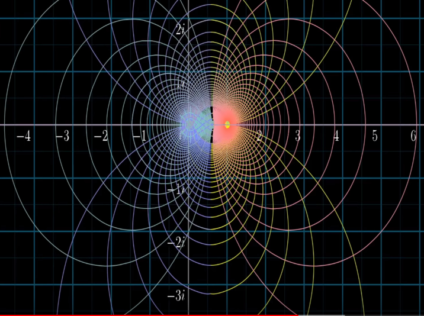
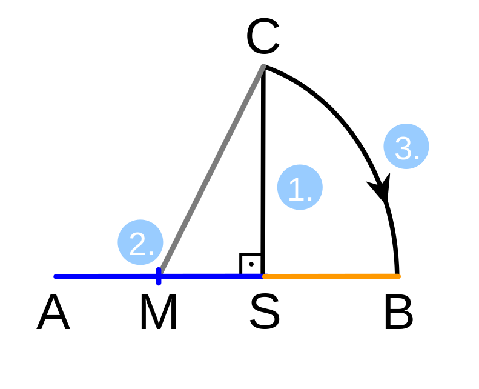
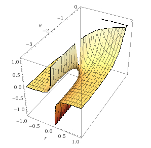
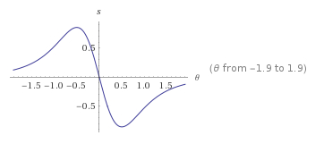
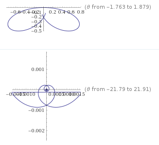

---
output:
  pdf_document: default
  html_document: default
---
# Defining conditions for infinite non-trivial zeros in the zeta function after symmetries of the complex projective line
### Symmetries of non-trivial zeta zeros 
*Felipe Coelho Argolo*$^{1}$  
Universidade Federal da Bahia, Universidade Federal de São Paulo  
email: felipe.c.argolo @protonmail.com; @protonmail.com; @gmail.com  

## Abstract

The zeta function is defined as the analytic continuation of the Dirichlet series $\zeta(s) = \sum_{1}^{\infty}\frac{1}{n^{s}}, Re(s) > 1$. Riemann hypothesized that besides the trivial zeros, located at the even negative integers of s $(\Re(s)=-2n; n=1,2,3,4,...)$, all other zeros would be images of $s$ where $Re(s)=\frac{1}{2}$.

Complex analysis on homeomorphisms of $\zeta$ yielded several advances. Solutions for rotations obtained with cosmological models yield poles related to $Re(\not Tr_{0})$, the non-trivial zeros. We review methods by Fesenko and Zagier. Nevertheless, a formal proof seems elusively connected with divisibility and primes in number theory.  

Using geometrical identities, points of vector operations defined in the $\zeta$ function are maped to four collinear points. We define conditions for consecutive permutations of locations and study symmetries of its torsion elements, invariants in projective geometry. Specifically, we use a type of Möbius transformation, fractional linear ones, the six cross-ratios possible among four collinear points.  

In this manner, we obtain a solution with unique sets of fixed points for the stabilizers: $\{0,1,\infty\}$, $\{\phi_{-},\phi_{+}\}$ and $\{-1,\frac{1}{2},2\}$. The later is the orbit of the harmonic cross-ratio, where $\frac{1}{2}$ is the fixed point of the 2-cycle with linear fractional transform $1-\lambda$, which fixes permutations in the point corresponding to the real part of $s$. Hence, defining the critical line $Re(s)=\frac{1}{2}$ as the location of $Re(\not Tr_{0})$.  

*Keywords*: Riemann hypothesis, zeta function, non-trivial zeros, group theory, Möbius transformation, harmonic cross-ratio; 

\pagebreak

## Introduction

The zeta function is defined as the analytic continuation of the Dirichlet series $\zeta(s)=\sum_{1}^{\infty}\frac{1}{n^{s}}, Re(s) > 1$. Riemann hypothesized that besides the trivial zeros, located at the even negative integers of s$(\Re(s)=-2n; n=1,2,3,4,...)$, all other zeros would be images of $Re(s)=\frac{1}{2}$.

$$\zeta(s) = \frac{\Gamma(1-s)}{2\pi i} \oint_{\gamma} \frac{u^{s-1}}{e^{-u} -1}$$
Complex analysis on homeomorphisms of $\zeta$ yielded several advances. Solutions for the rotation quantities obtained from cosmological models yield poles identifiable with $Re(\not {Tr_{0}}$, the non-trivial zeros. We review methods to identify unique poles using complex analysis, mainly the studies by Zagier and Fasenko.  

We show that the critical line's location is actually a direct consequence of preserving connectedness in an infinite lattice generated by the sets and functions occuring in the definition of $\zeta$. Ultimately, a problem solved through 
quotients of modular groups or percolation theory. We show relations to percolation threshold probability and subgroups  maping symmetries of $\{0,1,\infty\} \subset P^{1}(C)$, where $P^{1}(C)$ is the complex projective line.   

Further discussion ilustrate known identities with peculiar geometrical meaning under the proposed homeomorphisms.   

\pagebreak

## Geometrical identities from the non-trivial zeros

Using geometrical identities, vector operations defined in the $\zeta$ function are maped to four collinear points. We define conditions for $s$ in the occurence of $\not Tr_{0}$ and obtain the real value $Re(s)$ studying symmetries in torsion elements, invariants in projective geometry. 

### Geometrical identities among real and imaginary projections in rotated vectors

Consider the complex representation of $\zeta(s) : Re(\zeta(s)) + Im(\zeta(s)), Re(s) \in \mathbb{R}, Im(s) = \theta i$ and the grid formed its the analytic continuation.  

  Consider the following geometrical construction illustrated in the diagram.   

1. Draw a line segment AS and construct off the point S a segment SC perpendicular to AS and with the same length as AS.
2. Bisect AS with M.  
2. Draw a circular arc around M with radius MC intersecting AS extension. 

Then, $\frac{AS}{SB} = \phi$, the golden ratio. Also, $2MS / SB = \phi$.
This is a trivial construction with a rule and a compass providing the golden mean.
Take M as the origin. Then take the line parallel to SC intersecting M as the imaginary axis and AS extension as the real axis. Notice that triangle MCS would define $\vec{s=MC}$ real projection $Re_{(MC)}$, while B defines the arc of $sine(\hat M)$.

Consider vectors from the origin: $\vec{a}$, to equivalent to MB, and $\vec{b} = \vec{a} e^{\hat M i}$, equivalent to its rotation to reach C.  
$$CS = 2MS = sin(\hat M)$$
$$Im(MC) = Im(MB e^{\hat M i})$$

We get the thid lemma,  
**Lemma 3: For the real projection of a complex vector $\vec{a}$ rotated by $\theta$ to be equal to the real projection of the resultant vector, the ratio between its parts is $\frac{2 Re(\vec{a}e^{\theta i})}{ Re(\vec{a}) - Re(\vec{a}e^{\theta i})} = \phi, \phi = \frac{1}{2}\pm \frac{\sqrt{5}}{2}$**  

## Symmetries on infinite paths

**Gedankenexperiment**: The result of the infinite vectorial operations equivalent to the infinite series should periodically be $0$ at the critical line. We can mirror the previous example by taking $\phi$ as the ratio between the vector $\vec{a}$ and its real projection part after rotations.

We study projective general linear groups to find the fixed points determining the unique real value in the argument of $\zeta(s)$, $Re(s)$, related to the images of the non-trivial zeros. For that, we evaluate which simmetries makes the real part a fixed point considering the geometrical idendities and analytic bounds.    

For the final projection be equal to 0, $cos(\theta) = 0, \theta = \frac{\pi}{2}$.
From Lemma 3,  
$$\frac{2 Re(\vec{a}e^{\frac{\pi}{2} i})}{ Re(\vec{a}) - Re(\vec{a}e^{\frac{\pi}{2} i})}$$
$$=i - 1$$
$$Re(\vec{a}) = -1, Im(\vec{a}) = i$$

Consider the period of the trivial zeros, $P_{2} = 2$.

Consider zero, $P_{0} = 0$, the unit $P_{1} = 1$ and $\P_{\infty} = infty$ at projective line, $CP^1$ (Riemmann sphere).
Consider the ratio in Lemma 3, parameterized by $\phi$.  Taken to Cartesian coordinates, the solution for the construction includes $-\phi$. Let's consider $P_{\phi} = \phi$ and $P_{-\phi} = -\phi$.

Consider the set of $\zeta$ values for a fixed real part. For instance, consider the subset of sets containing $\zeta$ with real values mapped to the non-trivial zeros. Its real part could also be mapped to the coordinates, parameterized on the x axis as $P_{\tau}$.

@$P_{-1}$ 

Consider an infinite curve with periodicity on the origin related to the prime numbers. We need identify the fixed point for our vector $P_{\tau}$.  

In our axis, $P_{\tau} = 1-x$, which makes our target the fixed point stabilized by the 2-cycle $1-z$ in the fractional transformations.

## Möbius transformation and cross-ratios 

Specifically, we use Möbius transformation, the six cross-ratios possible among four points.  

The exceptional orbits corresponding to fixed points on the Riemann sphere under the action of the symmetric group $S_{3}$. In this manner, we obtain a solution with unique sets of fixed points for the stabilizers: $\{0,1,\infty\}$, $\{\phi_{-},\phi_{+}\}$ and $\{-1,\frac{1}{2},2\}$. The later is the orbit of the harmonic cross-ratio, where $\frac{1}{2}$ is the fixed point of the 2-cycle with linear fractional transform $1-\lambda$. This parameterizes $Re(\zeta(s))$, hence defining the critical line $Re(s)=\frac{1}{2}$ as the location of $Re(\not Tr_{0})$.  

Hence, $Re(s)=1/2$

\pagebreak

---

\pagebreak

---

## A probabilistical apporach via percolation theory

Ultimately, the problem could also be solved through percolation theory. Assignining measures to the grid in the mesh formed by $\zeta$, one could demonstrate that the half integer value is associated with the threshold probability of the infinitely connected graph after simmilar simmetries. 

This approach also allows one to define probability density functions and its moments, cumulants and characteristics. Mappings are useful to uniquely identify a distribution, as it is done in the Central Limit Theorem.

The value of $Re(\not Tr_{})=\frac{1}{2}$ is a direct consequence of topology preservation of the sets under operations and sets defined in the $zeta$. Ultimately, the Hausdorff–Young inequality reflects the cardinal inequality between rational numbers in the harmonic series and uncountably infinite real numbers in the natural logarithm $C(\mathbb{Q}) = C(\mathbb{N}) = \aleph \neq C(\mathbb{R}) = 2 \aleph$. 

This is based on Perseval's theorem on the unitary characteristic of the Fourier transform or its generalized version, the Plancharel theorem.

## Identities and visualizations

---
\pagebreak

Unfinished

\pagebreak

### Analytically defining poles through Archimedean fibres.

For $Re(s)$ in the critical strip, define bijective mappings $M$ of the set $Z = \zeta(s)$ in the complex plane to the superset $S$ of orbits $a \in A$. A generalized analysis approach by construction of an adelic zeta integral with curves and archimedean fibers has been conducted by Fesenko.  

We define homeomorphisms $M$ between values of $\zeta(s)$ and the sets of orbits $A$ under the action of group $C$ with multiplication. $M$ defines bijections between orbits and lines with fixed values of $Re(s)$ in $\zeta(s)$, parallel to the imaginary axis.  

This is similar to Zagier approach of constructing invariant functions on the upper half-plane and looking for eigenvalues, which yields the orbit $R ~ \frac{1}{2} + \theta i$ as a candidate solution. 

The holomorphism of subsets of arcs/fibers defined by $a$ have been demonstrated in Davis solution for the analytic continuation of the Theodorus Spiral. Also in evaluation of Archimedean Zeta Integrals.  

We define subsets after s in $R(s)$ for complex numbers $s$ with identical $Re(s)=c$ as a function $f$ of $s$. The orbits with constant real part $c$, $R_{c}$:
$$R_{c}(s_{s}) = \{f: c + \theta i|c \in Re(s) \}$$  

We can parameterize the equations as:    
$$X(\theta) = c(cos \theta + (\theta) sin(\theta)),$$  
$$Y(\theta) = c(sin \theta - (\theta) cos(\theta))$$  

Given the tangential angle, $\phi(\theta)$.

### Derivatives of arc displacement with respect to its length

Altough the problem of finding Lorenz Attractors have been long solved for special context in physics, it has not been subject to analysis until recently.$^14$ A superset of these geometrical objects have been examined in complex analysis, including Theodorus Spiral, Archimedean Zeta Integrals and Lipschitz curves. Analysis of localy convergent values in Laurent series have successfully been used to solve equations on Lorenz Attractors. $^15$  

The holomorphic manifold defined above describes the curve's lengths of the circular involute converging to a value given by the integral of the involutes of the circle with radius $c$ and constant rotating angle $\theta$ according to $\zeta$ arguments. $^16$
For Archimedean spirals assuming polar coordinates as described above, the length of the arc $\theta$ is given by the integral $\sqrt{1-\theta^2}$ along the interval $[0,\theta]$:  
This approach is an alternative application of Fesenko's and Zagier's general framework for studying poles in the Riemann $\zeta$ function after the Cauchy principal value of the zeta integral.   
Our **first identity** is:  
$$L = c \int_{0}^{\theta} \sqrt{1+\theta^2} d\theta$$

$$=\frac{1}{2}c(\theta \sqrt{1+\theta^2} + sinh^{-1}\theta)$$  
$$=\frac{1}{2}c(\theta \sqrt{1+\theta^2} + ln(\theta + \sqrt{1+\theta^2}))$$
One may define space curvature corresponding to the Lorenz attactor after $c$ and $\theta$:
$$\kappa(\theta,c)=\frac{2+\theta}{c (1+\theta^2)^{3/2}}$$

Each element in $a$ corresponds to an observation of in an infinite rotating orbit periodically towards an attractor (singularity) at successive time steps.  
The spiral corresponds to the locations over time of a point moving away from a fixed point with a constant speed along a line that rotates with constant angular velocity.$^11$  

**Lemma 1: For real values in the critical strip $0 < Re(s) < 1$, arcs define bijections for sets of $\zeta(s)$ with identical real values**  

From the definition of operations in the complex plane, involutions $\vec{C_{\theta}}(s)=\vec{C_{0}}(s)+ \theta \vec{c'(s)}$ use $c'(s)$ as the unit normal for $\vec{C(0)}$.
Hence, increasing values of $\theta$ in $Im(s)=\theta i$ defines unique images of parallel archimedean spirals in $S$.  

\pagebreak

## Outlining locations for infinite non-trivial zeros

For infinite non-trivial zeros, it has been demonstrated by evaluating Cauchy principal values that the $\epsilon$ distance to the spiral's attractor must converge at unique periodic rate defined by $\gamma$, the Euler-Mascheroni constant.  

Next lemmas describe the conditions for a set of orbits containing infinite images of $\zeta(s)=0, s \in \not{Tr}{\zeta_{0}}$ .

**Lemma 2: The elements of the unique set of orbits with images containing the infinite non-trivial zeros are the arc $a_{0}$ asymptoptically approaching the real line as $\theta \rightarrow \infty$ at a specific rate related to $Re(s)$**  
Take the converging length $L$ of the arc in $a$: 
$$L = c \int_{0}^{\theta} \sqrt{1+\theta^2} d\theta$$

Considering that the Lagrangian is symmetrical for rotations, we may obtain displacement derivatives to locate Lorenz attractors for an orbit. Again, these could be alternatively done with zeta integrals.  
We evaluate the derivative of the length with respect to $\theta$. 
$$\omega = \frac{\delta}{\delta \theta} L $$
$$= c \sqrt{1+\theta^2} + sinh^{-1}$$  

Now, evaluate the changes in $\omega$ after $c$.
$$\alpha=\frac{\delta}{\delta c}\omega$$
$$=\frac{\delta}{\delta c} c \sqrt{1 + \theta^2} + sinh^{-1}$$
$$=\sqrt{1+\theta^2}$$
This derivative determines changes in the $\omega$ mappings after each real part in zeta.  

The problem is then equivalent to that of predicting a cosmological equations of state for the cosmological fluid $^13$ . Specifically, finding the attractor with periodicity for $\zeta(s)=0$ as $\lim Im(s) \rightarrow \infty$ and $Re(s) \neq -2n, n=1,2,3,4,...$.  

Considering that the Lagrangian is symmetrical for rotations, calculate a higher order derivatives, called jerk ($3_{th}$order) and snap ($4_{th}$).$^13$ This is allowed due to surface smoothness (infinite diferentiable attribute). In general relativity formulations, quantities changing orbits according to the density and angular momentum of a singularity.   

Specifically, we may calculate values of $\theta$ when the $4_{th}$ order snap makes $Re(\zeta)=0$ converge to 0 periodically through arcs (check **identity 1**).  

$$\frac{d^4}{d\theta}^4 (\frac{1}{2} (\theta \sqrt{1 + \theta^2} + sinh^{-1}(\theta)))=$$

The snap is odd and achieves min. and max. global values at $\theta \in \{\frac{1}{2},-\frac{1}{2}\}$.

These poles define the $Re(s)$ of elements in $A$ whose orbits define the poles associated Riemann Zeta zeros. The first module is the real part of $\zeta$ in Riemann's conjecture.  
$$= -\frac{3 \theta}{{(\theta^2 + 1)}^{5/2}}$$  

The snap has unique extrema, which are ploted below along with the arcs generated in polar coordinates. 
  

  

By evaluating the orbits after the global extrema of $\theta$ maximizing the snap, we find several geometrically intuitive identities. They are used to study intrinsic angular momentum (spin) and certai solutions for field equations in general relativity. The Lorenz solutions are equivalent to the ones describing time simmetries of angular momentum in white and black holes.  

### Defining the real part of complex numbers determining non-trivial zeros of the $\zeta$ function

Although several informative poles seem to be connected to the non-trivial zeros, a formal proof seems elusively connected with number theory and properties of primes.  

We show that the critical line's location is actually a direct consequence of preserving connectedness in an infinite lattice generated by the sets and functions occuring in the definition of $\zeta$. 

\pagebreak

\pagebreak

1. G. H. Hardy, “Sur les zéros de la function $\zeta$(s) de Riemann,” C. R. Acad. Sci. Paris, 158, 1012–1014 (1914).
2. H. M. Bui, B. Conrey, and M. P. Young, “More than 41% of the zeros of the zeta function are on the critical line,” Acta Arith., 150,
35–64 (2011).
3. X. Gourdon, “The $10^13$ first zeros of the Riemann zeta function and zeros computation at very large height,” http:// num-
bers.computation.free.fr (2004).
4. A. LaurincikasD. Siauciunas. On Zeros of Periodic Zeta Functions. Ukrainian Mathematical Journal. November 2013, Volume 65, Issue 6, pp 953–958
Gourdon, Xavier (2004), The 1013 first zeros of the Riemann Zeta function, and zeros computation at very large height.
5. The Cycle Problem:An Intriguing Periodicity to the Zeros of the Riemann Zeta Function. David D. Baughdbaugh@rice.edu.https://arxiv.org/pdf/0712.0934.pdf
6. Dirac, P. A. M. (1942). "Bakerian Lecture. The Physical Interpretation of Quantum Mechanics". Proceedings of the Royal Society A: Mathematical, Physical and Engineering Sciences. 180 (980): 1–39. 
7. A. Bershadskii Hidden Periodicity and Chaos in the Sequence of Prime Numbers
Advances in Mathematical Physics. Volume 2011, Article ID 519178, 8 pages
http://dx.doi.org/10.1155/2011/519178
8. Zagier, D. (1990), "A one-sentence proof that every prime p === 1 (mod 4) is a sum of two squares", American Mathematical Monthly, 97 (2): 144, doi:10.2307/2323918, MR 1041893.
https://people.math.ethz.ch/~waldvoge/Papers/theopaper.pdf
9. Analytic Continuation of the Thedorus Spiral. Jorg Waldvogem, ETH Zurich. https://people.math.ethz.ch/~waldvoge/Papers/theopaper.pdf
10. Archimedean Zeta Integrals. Paul Garrett. http://www-users.math.umn.edu/~Garrett/m/v/ky_overheads.pdf
11. Mikhail Gaichenkov comment on Sloane, N. J. A. (ed.). "Sequence  A091154". The On-Line Encyclopedia of Integer Sequences. OEIS Foundation.
12. http://mathworld.wolfram.com/RiemannZetaFunction.html
13. Matt Visser. Jerk, snap, and the cosmological equation of state. https://arxiv.org/pdf/gr-qc/0309109.pdf
periodically
14. Webb, Trefethen. Computing complex singularities of differential equations with Chebfun. https://www.dpmms.cam.ac.uk/~mdw42/webb2013computing.pdf
15. Divakar Viswanath Somez Shutoglu. Complex Singularities and the Lorenz Attractor. July 30, 2009.
16. Fesenko, Ivan (2010), "Analysis on arithmetic schemes. II", Journal of K-theory, 5 (3): 437–557, doi:10.1017/is010004028jkt103
17. Exact bond percolation thresholds in two dimensions. https://arxiv.org/pdf/cond-mat/0610813.pdf. https://arxiv.org/pdf/cond-mat/0610813.pdf
18. Bui Quang Tuan. Cut the knot. https://www.cut-the-knot.org/do_you_know/BuiGoldenRatio2.shtml
19. Chandrasekharan, K. (1985). Elliptic Functions. Grundlehren der mathematischen Wissenschaften. 281. Springer-Verlag. p. 120. ISBN 3-540-15295-4. Zbl 0575.33001.