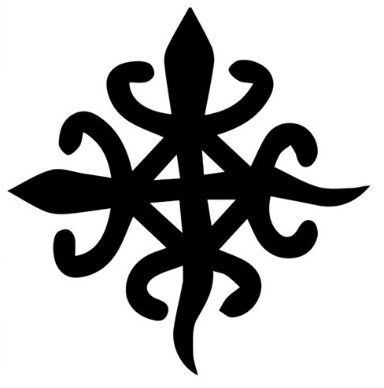
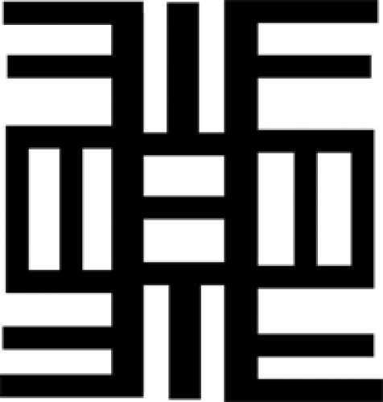
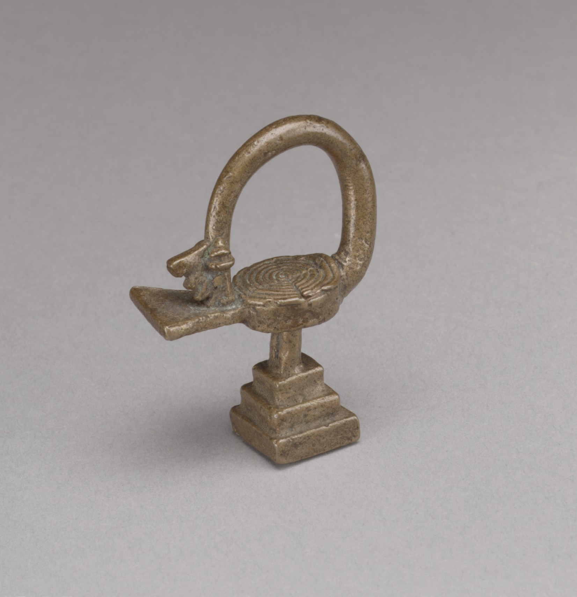

---
output:
  pdf_document: default
  html_document: default
---
  

\pagebreak

\begin{center}

\textbf{Inference in Science and Machine Learning}  

\vspace{5cm}

Philosophy and applications with statistics and probability.  

\vspace{5cm}

Felipe Coelho Argolo  
felipe.c.argolo@protonmail.com   

\vspace{2cm}

Londres, 8 de Julho de 2020  

\href{http://www.leanpub.com/fargolo}{Página oficial: https://www.leanpub.com/fargolo}  

\vspace{2cm}

Volume 1  
Second edition  

\end{center}

\pagebreak

## Preface  

---  

 
*Remember that all models are wrong; the practical question is how wrong do they have to be to not be useful*  
*George Box & Norman R. Draper, Empirical Model-Building and Response Surfaces*  

---  

When we entered the 21st century, the terms * artificial intelligence *, * quantitative analysis *, * machine learning *, * big data * and * data science * gained strong notoriety in due to unprecedented results in practical application problems. Technical advances in natural language processing, computer vision and other fields were quickly implemented by engineers and researchers in finance, industry and science.
These solutions use statistical-probabilistic models to model empirical measures. A systematic study of the formalism and tools involved is voluminous (see List of * Recommended readings *).

*Quod est inferius est sicut quod est superius. Et quod est superius est sicut quod est inferius, ad perpetranda miracula rei unius.*  
* "What is inferior is like what is superior. And what is superior is like what is inferior, perpetuating the miracles of one thing. *
[^1]  

[^1]:Emerald tablet. Translation from http://webapp1.dlib.indiana.edu/newton/mss/dipl/ALCH00017 Isaac Newton. "Keynes MS. 28". The Chymistry of Isaac Newton. Ed. William R. Newman. June 2010. Accessed June 2020
This text introduces topics in philosophy, statistics and probability used in scientific research.
The topics of machine learning and artificial intelligence are linked to the methods learned.   

## Preface to the second edition 

Approximately one year has passed since the launch of the 1st edition. Some important changes have been incorporated.

** Julia ** has been included as an alternative language to ** R **. It is a language with a smaller community, but very promising. In addition to offering faster execution speed, it offers a more concise syntax for the examples. 

A compilation with different applications of the concepts exemplified in the chapters is now available for both languages in a cookbook.   

I got in touch with the work of Richard McElreath (Statistical Rethinking), which resulted in positive results: Chapter 1 includes a second perspective (maximum entropy) for the use of normal distribution in natural sciences. Chapter 4 has been restructured to include a more general approach to the study of causality with targeted graphs, using the ** dagitty ** package / software. Chapter 6 has excerpts related to the choice of priors and performance evaluation.   

In the first edition, Ron Eglash's work in ethnomathematics influenced the use of green and yellow colors, associated with Orumla and the Yoruba divination, which uses binary numbers. One of the problems in the first version was to find titles that synthesized each chapter. Finding the Adinkras and the concepts they represent was a fortuitous event.  

Adinkras are symbols of Akan, incorporating abstractions linked to their names, forms and also to elements of culture, as popular sayings.

\pagebreak  

## Introduction   

**Adinkras**  

The Adinkras, like the bird that illustrates the cover (Sankofa), are symbols in Akan culture. They represent specific concepts and popular knowledge, connected to their form. Theoretical physicists have also adopted the name for graphs representing the formal rules that govern particles in supersymmetric gravity models.
   
1 . **ADINKRA HENE** (Adinkra Leader / King)  
Bases in descriptive statistics and the normal distribution  

  

Formed by concentric circles, it is related to the inspiration and creation of the other Adrinkras.
Basic intuitions are introduced in descriptive statistics and probability, linked to elementary concepts of physics. Starting from the study of Archimedes on levers, ways to describe samples and random variables using basic intuitions. It also addresses the relationship between empirical sciences and normal distribution.

2 . **DWENNIMMEN** (Ram Horns)  
Hypothesis testing  

  

It represents the vision of two sheep fighting. The Sheep Horns symbolize strength and humility, as sheep fight fiercely against other pairs and predators, but accept death.
The identity of science is strongly linked to the judicious use of experiments to test hypotheses. They make room for failure.
The * second chapter * accompanies Charles Darwin in the Galapagos. Darwin waited 20 years between the conception of the theory and its publication. He worked tirelessly to investigate whether his impressions were not false. This chapter illustrates how the hypothetical-deductive rationale works to study scientific hypotheses. The Student's * t * test is applied to compare bird beaks in Galápagos.  

3 . **FUNTUNFUNEFU-DENKYEMFUNEFU** (Siamese crocodiles)  
Correlations and comparisons.  

  

The crocodiles that share a stomach. They symbolize unity and cooperation. The * third chapter * highlights relationships between measures.
We will learn linear correlations (Pearson's $ \ rho $) and effect size (* Cohen's D *). Nonparametric alternatives are also introduced: Spearman's $ \ rho $ and Mann-Whitney U test).
We use regression to make predictions using * closed forms *. Analyzing the model equations analytically, we found a unique estimate for the parameters involved.

4 . **AKOMA NTOSO**(Linked Hearts)  
Multivariate analysis, causal models, confounders, reduction of dimensions and structural equations.     

  

Connected hearts symbolize mutual understanding and agreement. With many variables (multivariate analysis), graphs are the basic abstraction for relating concepts. We studied multiple regression and how to deal with covariates according to a causal diagram. The * fourth chapter * introduces a formal implementation of the comprehensive philosophical paradigm for ** causality **. Collinearity, confounders, mediation and moderation.
We also talked about reducing dimensions and latent measures, with factor analysis, principal component analysis (PCA) and structural equations (SEM).

5 . **NEA ONNIM NO SUA A, OHU**  
Neural networks  

  

"He who does not know can know through learning". The * fifth chapter * introduces neural networks, which start from several simple, empty units, processing inputs to learn patterns. We started with the biological inspiration of artificial neurons and the first intelligent machine in history: the * Mark I Perceptron *. We coded a virtual Mark I, which uses a new way of estimating parameters: * gradient descent *. Instead of using a closed formula, we use derivatives to 'walk' towards the minimum progressively.

Neural networks expand the power of a neuron with multiple nodes to build complex predictive systems. Deep networks include successive layers, allowing sequential transformations to solve more general classes of problems. We understand how neurons can propagate errors to others, optimizing gradients in conjunction with the * backpropagation * mechanism. We will also encode a neural network, Mark II.

6 . **SANKOFA** (San - Back; Ko - Go; Fa - Search, get)  
Modelos Bayesianos   

  

Adikra is about returning to the past and learning from it. The proverb says "There is nothing wrong with learning from the past". Bayesian models incorporate prior information (* prior *) in their formulation. The * sixth chapter * discusses the supposed clash between the ** frequency ** and ** bayesian ** probability schools. The context is given by alternatives to the hypothetical deductive method: Carnap demonstrates the difficulty of refutations, Feyerabend proposes an epistemological anarchy supported by historical facts and W. van Quine paints an interlaced system for theories, hypotheses and observations. We reiterate some previous examples using Stan for Bayesian inference.
We explored a third way of estimating parameters. Without closed formulas, we use the power of stochastic simulations (* Markov Chain Monte Carlo *).
  

\pagebreak

## Summary

Chapter 1 - ADINKRAHENE - Center and dispersion
 
  * Center and dispersion
* Mean and variance
  * Normal distribution
  * Experimental science and the central limit theorem
  * Moments

Chapter 2 - DWENNIMMEN (Strength and humility) - Deductive hypothetical method and Darwin's finches

  * Birds in the Galapagos
  * Hypothetical-deductive method and hypothesis tests
    * P-value
    * Student t distribution and t test

Chapter 3 - FUNTUNFUNEFU-DENKYEMFUNEFU (United crocodiles) - About associations

  * Prelude: Who needs the p-value?
  * Effect size: Cohen's D
  * Linear correlations
    * Pearson's $ \ rho $ correlation coefficient
    * Predictions with linear regression
  * Correlations and non-parametric tests
    * Spearman's $ \ rho $
    * Mann Whitney U test

Chapter 4 - AKOMA NTOSO (Connected hearts) - Multivariate analysis, graphs and causal inference

  * Multiple regression
    * Collinearity
  * Graphs and causal trajectories
    * Mediation and moderation
    * Factor analysis
    * Structural equations
    
Chapter 5 - NEA ONNIM NO SUA A, OHU (He who does not know can know by learning) - Neurons

  * Logistic regression
  * An artificial neuron: The perceptron
    * History and implementation from scratch: Mark I
  * Neural Networks and Deep learning (multiple layers)
  * Gradient Descent
  * Backpropagation

Chapter 6 - SANKOFA (Return and search) - Context and Bayesian inference

  * Odds
    * Frequentists and Bayesians
  * Many scientific methods: Feyerabend, Carnap and Quine
  * Bayesian inference
    * Bayes' theorem
    * Intuitions: prior, likelihood, posterior and marginal probabilities
    * Comparison of samples with normal distribution
    * Linear correlation
  * Markov Chain Monte Carlo Estimators and Methods
    * Closed solutions, Gradient Descent and MCMC
    
\pagebreak

## Prerequisites

All examples can be reproduced using free software.  

###Recommended reading:

Philosophy and scientific dissemination

* Surely You're Joking, Mr. Feynman
* The Demon-Haunted World - Carl Sagan
* The logic of scientific research - K. Popper
* The structure of scientific revolutions - Thomas Kuhn
* Against the Method - Paul Feyerabend
* Two dogmas of empiricism - Willard van Quine
* Stanford Encyclopedia of Philosophy - https://plato.stanford.edu/
* The Open Handbook of Formal Epistemology - https://jonathanweisberg.org/post/open-handbook/

Neurosciences

* Principles of neural science - Eric Kandel

Mathematics / Computing

* Collection '* Fundamentals of elementary mathematics *'
* Statistical Rethinking. A Bayesian Course with Examples in R and Stan, Richard McElreath.
* Biostatistics without secrets. Annibal Muniz.
* What is mathematics - Courant & Robbins
* Better Explained (https://betterexplained.com/)
* http://material.curso-r.com/
* R Graphics Cookbook
* R Hell
* Learn you a Haskell for Great Good
* Layered Grammar of Graphics - Hadley Wickham.
* Algorithms unlocked
* Online: Statsexchange, stackoverflow, mathexchange, cross-validated.
 
Machine Learning

* An Introduction to Statistical Learning: with Applications in R
* Neural Networks and Learning Machines - Simon Haykin
* Stanford (computer vision): http://cs231n.stanford.edu/
* Oxford 2015 (Deep learning): (https://www.youtube.com/watch?v=dV80NAlEins&list=PLE6Wd9FR--EfW8dtjAuPoTuPcqmOV53Fu)

\pagebreak

**Thanks**

My family, Suzana, Paulo, Isaac and Chris. Friends Gabriel, Guilherme, Pedro, Wei.

To the teachers: Carla Daltro, Anibal Neto, Lucas Quarantini, Luis Correia, Rodrigo Bressan, Ary Gadelha.

To colleagues Fatori, Luccas, Macedo, Walter, Rafael, Sato, Hiroshi, Lais, Luci, Davi, n3k00n3 (Fernando), Loli (Lorena).

For comments, criticisms, suggestions, or just say * hi *: felipe.c.argolo@protonmail.com.  

\pagebreak
