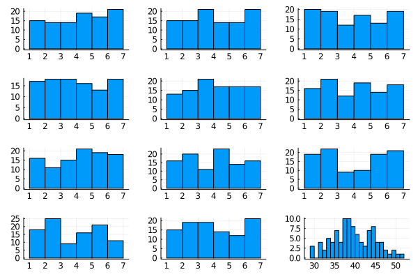

---  
output:
  pdf_document: default
  html_document: default
---  


# Chapter 1: Center and dispersion

## Introduction

In the opening chapter, we will get in touch with the basic elements of our journey. ADINKRAHENE is made of three concentric circles and this chapter has three parts.
  
First, we start from the physical concept of *moments* and learn about the center and dispersion of distributions and samples. We introduce **R** to calculate mean and variance.

Then, we will study the natural relationship between the normal distribution and the *t* distribution, which are related. The adoption of normal distribution in scientific works is quite popular. To understand the reasons, the Central Limit Theorem and the concept of entropy are fundamental. We use the language **Julia**. 

The third part presents data visualization with a grammar graphics and has examples in both languages.  

\pagebreak  

## Part 1 - Center, dispersion, mean and variance  

  

### A brief dive into physics: Moments  
[^13]  

The physical concept of moment was originally conceived by Archimedes. Although he did not invent the lever, he described the mathematical principles behind it. 
In *On the Equilibrium of Planes*, Archimedes declares that *Magnitudes are in balance when at a distance reciprocally proportional to their weights.*  


This is the well-known law of the lever. Given a foothold and a plan on it, we apply force anywhere on the plan. The resulting moment (torque) is the result of multiplying the physical quantity $(F)$ by the distance to a fixed point $(d)$.
$M = F*d$ 

Assuming a constant force, the further away from the a fixed point, the greater the resulting moment. Thereafter, physicists extended the concept to other domains. For example, an object containing parts with opposite charges $-q$ and $+q$ separated by a distance $d$ has an analogous moment (electric dipole moment):
$M = q*d$
In general, *we speak of moments when multiplying a physical quantity by a distance *.

\pagebreak

#### Resulting moment 


In the case of the lever, we saw that each force applied to the object is associated with a moment (torque). We know that gravity acts on each piece with mass making up the whole. We can then calculate the resulting moment by adding the moments of all $N$ points. Let $F_{i}$ be the function describing the force in each i-th:
$$M = \sum_{i=1}^{N} F_{i}d_{i}$$

A system, like the bird resting on the finger, is in equilibrium when the sum of the moments in relation to the fixed point is zero. For electrical charges, the system is nonpolar when the moment is zero. In the figure below, we see how the $CO_{2}$ molecule is nonpolar, while the water molecule is polar: 

  

The moments described above are expressions of the *first moment*, since the quantity is multiplied by the distance with exponent 1: $d = d^{1}$.

We can calculate other moments by exponentiating the spatial component (distance). We will now study moments of mass of a one-dimensional object:  

The **moment zero** of mass for an object is $M_{0} = \sum_{i=1}^{N} m_{i}d_{i}^{0}$. Since $d^{0}=1$, we have $M_{0} = \sum_{i=1}^{N} m_{i}$, which is simply the sum of the masses of all points. The zero moment is the **total mass**.

$$M_{0} = m$$

The **first moment** of mass for an object is $M_{1} = \sum_{i=1}^{N} m_{i}d_{i}^{1}$ and determines the **center of mass** in relation to the $d$ dimension. It is the point on which the bird on the photo is balanced.

$$M_{1} = C_{m}$$

The **second moment** of mass is $M_{2} = \sum_{i=1}^{N} m_{i}d_{i}^{2}$ and is the **moment of inertia** . Corresponds to the system's resistance to rotations. Note that the terms $d_{i}^{2}$ would be present in the area of a circle with a center identical to the object and a radius equal to the distance to the center: $\pi d^{2}$. The total resistance to rotation is analogous to the resistance offered by the rays of these imaginary circles [^14].


The nth moment is given by $$M_{n} = \sum_{i=1}^{N} m_{i}d_{i}^{n}$$.

[^13]:Pappus of Alexandria, Synagoge, Book VIII

[^14]: https://physics.stackexchange.com/a/371165/218274

### Generalizing moments 

We calculate some moments for physical objects (moment zero: total mass, first moment: center of mass, second moment: moment of inertia).
We can generalize the concept and calculate moments of abstract entities, such as random variables. **The good news is: we've done this before!** 

Let $f(x)$ be the function that describes a probability distribution for the variable,  

Just as the **moment zero** represents the sum of the contribution of each point to the mass (total mass), here it represents the sum of the possible probabilities, the total probability (1).  

The **first moment** corresponds to the center of mass in static mechanics. For probabilities, it is the center, the **average**.  

The **second moment** corresponds to the inertial moment and it is the **variance**. 
The normalized **third** and **fourth** moments report asymmetries *(skewness)* and fat tails *(kurtosis)*.
  

Formally, let $d(x,x_{0})$ be the distance to the center $x_{0}$ reference $(x-x_{0})$, the nth moment $\mu_{n}$ is defined by:  

$$\mu_{n}= \int_{-\infty}^{\infty} d(x,x_{0})^{n}f(x)dx$$  

The above integral corresponds to the continuous version of the sum of discrete parts presented before for a physical quantity, such as mass: $M_{n} = \sum_{i=1}^{N}d_{i}^{n}m_{i}$  

**Moment zero**:$$\mu_{0}= \int_{-\infty}^{\infty} d(x,x_{0})^{0}f(x)dx$$
The sum of all probabilities of a distribution must add up to 1.
$$= \int_{-\infty}^{\infty} f(x)dx = 1$$.
**First moment**: $\mu_{1}= \int_{-\infty}^{\infty} d(x,x_{0})f(x)dx$, assuming center at 0 $(x_{0}=0)$, we have the average, $$ \mu_{1} = \int_{-\infty}^{\infty} xf(x)dx$$, also called expected value $E[X]$. It extends the intuition of adding all the measures and dividing them by the number of observations. We use an integral to add the infinitesimal possibilities for $f(x)$.    

**Second moment**: $$\mu_{2}= \int_{-\infty}^{\infty} d(x,x_{0})^{2}f(x)dx$$. The sum of the squares of the deviations, our variance, $$\sigma^{2} = E[(x-\mu)^{2}]$$. 

\pagebreak  

## Computers

<div style="text-align: right"> Master Foo and the Shell Tools[^1] </div>

---

*A Unix novice came to Master Foo and said: “I am confused. Is it not the Unix way that every program should concentrate on one thing and do it well?”

Master Foo nodded.

The novice continued: “Isn't it also the Unix way that the wheel should not be reinvented?”

Master Foo nodded again.

“Why, then, are there several tools with similar capabilities in text processing: sed, awk and Perl? With which one can I best practice the Unix way?”

Master Foo asked the novice: “If you have a text file, what tool would you use to produce a copy with a few words in it replaced by strings of your choosing?”

The novice frowned and said: “Perl's regexps would be excessive for so simple a task. I do not know awk, and I have been writing sed scripts in the last few weeks. As I have some experience with sed, at the moment I would prefer it. But if the job only needed to be done once rather than repeatedly, a text editor would suffice.”

Master Foo nodded and replied: “When you are hungry, eat; when you are thirsty, drink; when you are tired, sleep.”

Upon hearing this, the novice was enlightened.*

[^1]: http://catb.org/esr/writings/unix-koans/shell-tools.html

\pagebreak


Throughout the text, we will use examples with software. Computers are useful for speeding up the calculations necessary for our purposes.

For millennia, man has used instruments, such as abacuses and tables, to perform extensive and accurate operations involving large numbers. Faced with a problem or operations to be computed, these mechanisms automate parts of the process due to the way they were built. The main difference from these tools to today's computers is that our machines can be programmed to do arbitrary computations.

Ada Lovelace (*10 December 1815 - 27 November 1852*) was the first to discover this possibility. Studying Charles Babbage's Analytical Machine, Ada devised a way of performing computations for which the machine was not originally designed. The program calculated the Bernoulli numbers. Arguably, changing the structure of simpler machines also involves reprogramming them.

Machines from that time weighed tons and were much slower. The advancing years have made technology more accessible, to the point of enabling high-powered, low-cost personal computers. In addition, instead of complex mechanical operations, we can use programming languages that translate English-based commands into machine instructions.

The programs presented here are written in R and Julia. They are languages aimed at statistical computing, having useful tools. Being 'high-level' languages, we have no cognitive overhead with memory and hardware handling for the programmer. Abstraction of physical details, such as CPU registers, is done automatically by the interpreter. The data visualization ecosystem has power and flexibility. The community of both grows fast, with large bases of support. Both support functional, object-oriented and imperative styles.  

---  

#### R

Download and installation instructions can be found at:
https://cloud.r-project.org/
On Windows, the process usually consists of clicking on the installation executable and agreeing to the prompts.
For Linux, it involves adding CRAN to the list of repositories and downloading the *r-base* package or the source / tarball directly from the website.

#### Rstudio

With R installed, I recommend using the RStudio development environment (https://www.rstudio.com/) to get some facilities. Among them: *vim* shortcuts, editor with syntax highlighting, autocomplete, real-time rendering of plots and animations, visualization of datasets, development environment, logs, markup languages support, such as Markdown, RMarkdown and Latex. [^2]

[^2]: This text is written in Markdown and the source code can be found at https://github.com/fargolo/stat-learn

---  

## Mean and Variance

We can define the function of the mean for a vector of numbers, given by (1) sum divided by (2) size of the vector:  

```r
     > mean_vec <- function (x) {
       sum (x) / length (x)
     }
     > mean_vec (b) # Previously defined by b <- c (2.2, 4.4, 5.5)
     [1] 4.033333
```

sum (x) returns the sum of all elements of the vector x. length (x) returns the size (number of cells) of the vector x. 

As previously described, the mean is a measure of central tendency for a set of observations. It is the closest point to all the others.  

#### Many ways to calculate variance

We can also calculate a measure related to how far our values deviate from the center. 

First, we calculate a distance between each element x and the average of $\mu$ observations. The notion of distance implies that it must be a positive value. Assuming that x and $\mu$ are measured in an ordered space, we can use the module of the difference between the values: $\|x -  \mu\|$. Also, we can use the difference square: $d_{i} = (x_{i} -  \mu)^{2}.$   

The $\sigma^{2}$ variance of the observations is a measure of the dispersion of the entire sample.
To calculate $\sigma^{2}$, we add all the distances $d_{i}$ and divide the result by $n-1$.  

```r
    >var_2 <- function(x) sum((x - mean(x))^2) / (length(x) - 1) 
    >var_2 (b)
    [1] 2.823333
```
Being proportional to the distances from the mean, the variance $\sigma^{2}$ tends to be greater when the values are very different from each other: 

```r
    >c <- c(100,200,1,45,-24)
    >var_2(c)
    [1] 7966.3

```

Another measure of dispersion, given in the original units of the observed measure, is the standard deviation $\sigma$, given by the root of the variance $\sigma^{2}$. 

```r
    >var_2(b) %>% sqrt
    [1] 1.680278
```

The division by $(n-1)$ instead of $n$ is a correction applied in order not to underestimate the population value of the variance ($\frac{\sum_{1}^{n}(x - \mu)^2}{n}$) when we used a sample ($\frac{\sum_{1}^{n}(x - \mu)^2}{n-1}$).  

### Vectors, loops and recursions

Previously, we defined the function to calculate variance as:  

```r
    >var_2 <- function(x) sum((x - mean(x))^2) / (length(x) - 1)
```

This is only possible because R automatically applies functions to vectors.
Thus, the expression *(x - mean(x))^2* subtracts the average of each element of the vector x.
Usually, it is necessary to use recursive structures for this.
The for loop defines a sequence of defined size n and repeats a block of commands n times.
If we want to print numbers between 1 and 10:

```r
    >for (i in 1:10) print(i)  
    [1] 1
    [1] 2
    [1] 3
    (...)
    [1] 8
    [1] 9
    [1] 10
```

The instruction evaluates print (i) for values i = 1,2,3 .., 10 repeatedly.
Let's rewrite our function to calculate variance $\sigma^{2}$ using a loop. We can define a loop with the size of the vector x and square the difference in each element.
Like this,

```r
     var_3 <- function (x) {
       # empty vector to store distances
       accumulator <- numeric ()
       # loop starts at 1 goes up to the given vector size
       for (i in 1: length (x))
       # calculates and stores distances.
     accumulator [i] <- (x [i] - mean (x)) ^ 2
     #calculate media
       return (sum (accumulator) / (length (x) - 1))
     }
```

Both definitions have the same result as the native implementation: 

```r
    > var(b)
    [1] 2.823333
    > var_2(b)
    [1] 2.823333
    > var_3(b)
    [1] 2.823333
```

Yet, one way to manipulate many elements is through high-order functions. These functions are given other functions as arguments. An example is the map function from lib purrr. We define a function for the distance, $f(x) = (x- \mu)^{2}$, and apply it to all elements. Only then do we add the results and divide by n-1.  

```r
     > y_mean <- mean (a)
     # Apply distance function and store values
     > sq_dists <- purrr :: map_dbl (.f = function (x) (x - y_mean) ^ 2,
     .x = a)
     # Sums distances and divides by n-1
     > sum (sq_dists) / (length (a) - 1)}
```  

When using the pipe, the period character (.) Refers to the value provided as input by the previous pipe. Thus, sum (.), In the following example, adds the values passed by the *map* function.
Our function can be written: 

```r
    var_4 <- function(arg){
    y_mean <- mean(arg)
    purrr::map_dbl(.f = function(y) (y - y_mean)^2, .x = arg) %>%
    sum(.)/(length(arg) - 1) }
    > var_4(b)
    [1] 2.823333
```

\pagebreak

### Exercises  

1. What is the difference between compiled and interpreted languages?
2. A program written in R can be written in any other language. Is this statement true? Why?
3. Name 3 resources that an IDE provides the programmer.
4. Change the RStudio background theme to a dark color (less light for the eyes :)).
5. Apply the sd, mean and var functions to normal random samples of n = 10, 30, 100 and 300. The rnorm (n, mean, sd) function can help. Compare the values of the source distribution with those obtained.
6. *UnLISP it!* Transform the following expressions, replacing nested parentheses with the pipe operator (%>%) when deemed convenient:
  *> round (mean (c (10, 2, 3)))
  *> round (mean (rnorm (n = ceiling (runif (1,0,10)))))
  *> paste ("a", seq (1: max (sample (1:10))))
  *> round (nrow (iris) + exp (1), digits = ceiling (runif (1,0,10)))
7. Using the code for the functions var_2 (vectorized), var_3 (for loop) and var_4 (high-order function map)
  * Write the corresponding functions (sd_2, sd_3, sd_4) for standard deviation and compare with the standard function of R (sd). Tip: Just apply square root to the final value previously returned!
8. Using the iris dataset
  * Select only those examples with a petal size greater than 4.
  * Select the 10 largest copies. Suppose the size is given by the average of the 4 measurements provided.
  * Calculate the mean and standard deviation for two measurements in each species.
  * Make a scatterplot between two measurements
    * Add colors according to the species
    * Add the text label to one of the points
    * Change titles (main, x and y axes, legend)
    * Change the background theme. Tip: try lib *ggthemes* themes
9. Using loops, write a function that returns an approximation of $e$.
  * Remember that $e = \lim_{n \rightarrow \infty} (1+\frac{1}{n})^n$.

\pagebreak

---  

## Part 2 - The normal distribution and a curious theorem

In empirical studies, it is common to assume that measures of a random variable come from a population with a normal distribution. Next, we will study the behavior of this probabilistic function.

Abraham de Moivre (26 May 1667 - 27 November 1754), without lacking funding for studies and research, provided secondary services. Among them, probability calculations for clients in gambling. In 1733, de Moivre realized that the probabilities of a binomial distribution, such as the $(p(cara) = p(coroa) = 0.5)$ coin flip, approach a smooth (continuous) curve as the number of events increases.


Bernoulli's distribution describes the possibility of two events, such as the coin toss. Taking the different values of heads (0) and crowns (1), the observation is $1$ with probability $p$ and $0$ otherwise $(1-p)$.
For an honest currency, we have a uniform probabilistic distribution over the domain, $X={0,1}$:  $P(1) = P(0) = 0.5$.

If we add Bernoulli distributions, we obtain the binomial distribution. Each observation is a set of releases. Taking $p=0.5$, more frequent results are similar numbers of heads (0) and crowns (1).

For $n = 10$, it is much more likely to get a number of heads close to 5 (center of the curves) than a result with 9 or 10 equal throws. It is possible to demonstrate that increasing the value of n causes the distribution to approach the following continuous curve:


De Moivre noted that the distribution of binomials with many launches approached that of a smooth function.
He sought an approximation in terms of the exponential function [natural] $e^x$.

But what are the parameters of the curve?

First, de Moivre deduced the solution to the $(p = \frac{1}{2})$ currency problem. The following general expression describes the probability $P(x)$ corresponding to the curve we are looking for, known as *Gaussian*.

$$f(x) = \frac{1}{\sqrt{2\pi}}e^{-\frac{x^{2}}{2}}$$

Where $e$ is Euler number $(e\sim 2.72…)$.

---  

The value $\frac{1}{\sqrt{2\pi}}$ appears as a normalizer for evaluating the function as a probability density (The integral of $-\infty$ a $+\infty$ must be 1). The value $\pi$ arises from the Gaussian integral for $e^{-x^{2}}$ and results from the fact that $2\pi i$ is a period of the function $e^{x}$:
$$\int_{-\infty}^{+\infty} e^{-x^{2}}dx = \sqrt{\pi}$$ 

---  


**Intuitions**
The definition has a constant factor $\frac{1}{\sqrt{2\pi}}$ (approximately 0.4), multiplying the exponential result in the format $e^{-x}$.
In Julia, we can define the function and observe the probability associated with some points around the maximum ($f(0)=0.4$):

```julia
mgauss(x) = 0.4*exp((-1)*(x^2)/2)
mgauss(-2), mgauss(-1), mgauss(0) , mgauss(1) , mgauss(2)
    (0.054134113294645084, 0.2426122638850534, 
    0.4, 0.2426122638850534, 0.054134113294645084)
```

Then, obtain some values in the range $[-5,5]$ and plot them, giving rise to the previous Gaussian curve.

```julia
using Plots
gauss_values = map(mgauss,-5:0.1:5) 
plot(gauss_values,xaxis=("Gaussian"),leg=false)
```

We observe how the distribution occurs from the equation.

Since $x^{2}$ returns only positive values, $-x^{2}$ always returns negative ones. The function returns values between 0 and 1 exponentiating $(e \sim 2.718...)$ to a negative quadratic factor $(y \sim 0.4*e^{-x^{2}/2})$.

We also noticed that values close to the center $(x \sim \mu = 0)$ cause the exponent to approach 0, maximizing our function: $f(0) = 0.4 * e{-x^{2}/2} = 0.4 * e^{0} = 0.4)$. The obtained value (0.4) corresponds to the top of the curve in the graph above (pink line).

We observed the curve symmetrically approaching the maximum at values close to 0.

This directly reflects the fact that values close to the average are more likely and extreme values less likely. Strictly speaking, the probability for any value among the possible infinites is zero.

It is possible to evaluate the probability of any event related to the interval between points $a$ and $b$ by the integral of $f(x)$ over the interval $[a,b]$:
$$P(A_{a,b})= \int_{a}^{b}{f(x)dx}$$

For example, an event ($A$) related to 'values less than or equal to zero' on a scale is in the range $[-\infty,0]$:
$$P(A) = \int_{-\infty}^{0}{f(x)dx}$$

The quadratic term makes the distribution symmetrical for values opposite to the mean. $P(A) = P(-A)$. As we calculated $f(2)$ before, we know that: $f(-2) = f(2) = 0.05$ for $\mu = 0$. It is also likely to find values two units larger or two units smaller than the average. These points are marked by a blue line in the figure.

We can work with normal curves with centers (average $\mu$) shifted to the left ($\mu$ <0) or to the right ($\mu$> 0), subtracting the term from $x$ in our exponent. In addition, different variances ($\sigma^{2}$) reflect the frequency of values far from the average and how far from it they are. Visually, it determines the size of the bell base in the illustration (Figure 3).

We use the notation $N \sim (\mu, \sigma^{2})$ to describe a Gaussian distribution with average $\mu$ and $\sigma^{2}$ arbitrary variance:

$$f(x) = \frac{1}{\sqrt{2\pi\sigma^{2}}}e^{ -\frac{(x-\mu)^{2}}{2\sigma^{2}}}$$


#### Why do we use The Normal Distribution?

Are large binomial distributions and currencies so important? The launches are an example of a larger class of phenomena. Each result series is made up of many almost identical events (individual launches).

#### Entropy

In the natural sciences, we rarely know in advance the mechanisms by which observations are generated. Consequently, we do not know the probabilistic distribution that they obey. A fair dice has equivalent probabilities among the possible values (uniform distribution). A rigged dice tends to fall more frequently at certain values (peaks and valleys).
As we saw earlier, we can describe a distribution through the relationships between possible values and the center. These are the *moments*. The first moment reflects the relative position of the center (mean), while the second reflects the dispersion of the values (variance). Knowing the natural source mechanism would allow specifying distributions directly, however we need to face the limitations of the real world.  

*If we only know the center (mean) and the dispersion (variance) of a distribution, what is the most conservative guess possible?*  

Considering real numbers (domain in $[-\infty,+\infty]$), the normal distribution is that with maximum entropy in relation to the others. Roughly speaking, this means that it is the description using less information when compared to any other distribution obeying these restrictions (defined mean and variance). 

Gaussian is the one that introduces less extra information in relation to possible true distributions. By the *Maximum Entropy Principle* , it best describes observations a priori, when we only have an idea of the mean and variance. This is a reasonable justification for adopting Gaussians as tools.  

---  

The proof is reasonably complex, involving calculus of variations to optimize the expression:
$$H(x) = -\int_{-\infty}^{+\infty}p(x) -\text{log}\ p(x) dx$$ 

---  

#### The Central Limit Theorem

Another connection between normal distribution and the natural sciences is the central limit theorem.
If we add many distributions from the same family, the resulting distribution approaches a normal one. Without much explanation, we assumed that this was true for coins.
Some examples may help to gain intuition. When rolling a 6-sided fair dice, we have a probability of $\frac{1}{6}$ in each result.


A uniform discrete distribution, where $P(1) = P(2) = P(3) = P(4) = P(5) = P(6)$ is defined for natural numbers between 1 and 6: $X \sim U_{discr}(1, 6).$

The average for many launches, or expected value, is given by:
$E(X) = E(U(1,6)) = (1+6) / 2 = 3.5$

Let's do a virtual experiment using 100 rolls of 11 dice.

---  

#### Julia  

Download and installation instructions can be found at:
https://julialang.org/
For Linux, it involves downloading the binary / source code / tarball directly from the website.

#### IDE  

With Julia installed, I recommend using the Juno development environment (http://docs.junolab.org/stable/) to get some facilities. Among them: shortcuts, editor with syntax highlighting, autocomplete, real time rendering of animations and plots, visualization of datasets, development environment, logs, support for markup languages. 

---
The following Julia code generates the data and visualizations we need:  

```julia
using Distributions, Plots, StatsPlots
dice_fun(x) = rand(DiscreteUniform(1,6),x)
data_mat = [dice_fun(100) for _ in 1:11]
p1 = map(x->histogram(x,bins=6,legend=false),data_mat)
p2 = histogram(sum(data_mat,dims=1),bins=30,legend=false)
plot(p1...,p2,layout=(4,3))
```
\pagebreak



We note that the bars are distributed at very similar heights in the first 11 cells. The expected frequency for each value is ~ 1/6 of the total 100 launches. $Freq (X_{i}) \sim \frac{1}{6}*100 \sim 16.66$
Something interesting happens with the sum of the distributions (bottom right).  

The expected value is, as intuition says, the sum of the expected values in each sample:
$E(X) = \sum_{i=1}^{11} E(U_{i} \sim (1,6)) = 11*3.5 = 38.5$

The value 38.5 corresponds approximately to the center of the resulting distribution (Figure 2, lower right corner)
The similarity with the normal curve is remarkable, with less frequent extreme values and symmetrically removed from the average (expected value), which defines the maximum value.  

It is possible to prove that the sum of many distributions from the same family converges to the normal distribution in any case. As long as they are independent. This result is called the Central Limit Theorem. The formal proof can be consulted elsewhere, [^6] but we will return to it.
This result is of subtle importance for the study of natural phenomena through experiments.

[^6]: Yuval Filmus. 2010. Two Proofs of the Central Limit Theorem http://www.cs.toronto.edu/~yuvalf/CLT.pdf . It takes place showing the convergence of moments between soma and Gaussian, a concept that we will understand in the next chapter.


Many objects of interest to scientists are manifestations of phenomena involving multiple elements. A trivial example is the color of human skin. A considerable part depends on the number of inherited genes related to melanin. They behave in an additive manner.
Thus, each extra gene variant can contribute to the final color with X units on the scale to measure pigmentation.

The color of an individual will be influenced by the sum of these distributions, which is analogous to the mathematics described for data entry.


We can compare groups regarding final phenotypic measurements (skin color) without knowing details about the relationships between each gene and its mechanisms of expression and regulation.

The final melanin distribution comes from the sum of similar individual distributions and will tend to be normal. As we have seen, the same is true of any underlying distributions: if they are gamma, uniform or Poisson, the distribution of the sum will still tend to be normal.

Figure 2 shows the sum of uniform distributions for honest data, showing that it is close to a normal one.

$X \sim U_{1}(1,6) + U_{2}(1,6) + … + U_{11}(1,6) = X \sim N(38.5,\sigma^{2})$

Let's see the same process for another family of distributions, gamma:

$X \sim \gamma_{1}(\alpha, \beta) + ... + \gamma_{n}(\alpha, \beta) = X \sim N(\mu',\sigma')$

For large values of n:

```julia
gamma_fun (x) = rand (Gamma (1), x)
data_mat = [gamma_fun (100) for _ in 1:11]
data_mat <- cbind (data_mat, rowSums (data_mat))
append! (data_mat, sum (data_mat, dims = 1))
p1 = map (x-> histogram (x, legend = false), data_mat)
p2 = histogram (sum (data_mat, dims = 1), bins = 30, legend = false)
plot (p1 ..., p2, layout = (4,3))
```

! [Sum of samples (n = 100) from 11 gamma distributions. The result is in the bottom right cell. Probability density function for gamma distribution: $f(x)=1 / \ Gamma (\ alpha) *\beta\ alpha* x \ alpha -1* e - \ beta x$, with $\ alpha = \ beta = 1$] (images / chap1-gammasum-j.png)


Again, we find that the sum starts to be symmetrical around the average, with the shape of bells (broad base).
Many observable phenomena in our universe are naturally composed of multiple similar elements. Especially in biological systems, there is redundancy of components and an object of interest to scientists is a result of the combination of many underlying variables.

\ pagebreak

### Exercises

1. Regarding the normal distribution for a random variable, it is true (more than one possibility):
    * a. The sum of the probabilities of all possible values is 1.
        * i. $\int_{-\infty}^{+\infty} f(x) dx= 1.$
    * b. It is symmetrical in relation to fashion.
    * c. The expected value is given by 1 / $\sigma\sqrt{2\pi}$..
    * d. 95% of the values are close to the average.
    * and. Extreme values are unlikely.
    * f. It is uniquely determined by $\sigma^{2}$ variance and average $\mu$.
    * g. It is continuous and differentiable.
    * h. Small samples result in t distributions.

2. Using the command “? Distributions” access some distributions available in the base library of R.
    * a. Plot the histogram of the sum of 100 distributions $X^{2}$ (rchisq function; use n = 60).
    * B. Do the same procedure for 100 distributions of another family and size of your choice.
    * c. Obtain the skewness and kurtosis values for these distributions. A standard normal distribution $(\sigma^{2}=1;\mu=0)$ has skewness (asymmetry) of 0 and kurtosis (frequency of the most extreme values) of 3. Which ones do you find?
    * d. Name two natural phenomena whose statistical distribution is known and which is the corresponding distribution.

\pagebreak

---  

**Final notes on the Central Limit Theorem** 

We can better understand the central limit theorem. The information provided by the moments is valuable: a probability function is fully defined by its moments.
The Central Limit Theorem, which we talked about earlier, is proven to show equivalence between moments of the normal curve and the sum of *n* identical distributions through other tools.

We can create a *Moment generating function*, $M_{X}(t)=E[e^{tX}]$ where t is a fixed value. We call it that, because its polynomial form via Taylor expansion corresponds to a series that contains all the moments $M_{n}$: $1+tX+\frac{t^{2}M_{2}}{2!}+\frac{t^{3}M_{3}}{3!}+...$, since $\frac{d{e^x}}{dx} = e^x$ and the order derivative $n$ multiplies the order $n-1$:  
$$e^{x}= \sum_{n=0}^{\infty}{\frac{x^{n}}{n!}} = 1+x+{ \frac{x^{2}}{2!}}+{ \frac{x^{3}}{3!}} +...$$


$$E[M_{X}(t)]=1+tE[X]+\frac{t^{2}E[X^{2}]}{2!}+\frac{t^{3}E[X^{3}]}{3!}+...$$
$$=1+tM_{1}+\frac{t^{2}M_{2}}{2!}+\frac{t^{3}M_{3}}{3!}+...$$

The *Characteristic function* is the Fourier transform of the density function, associating values with periodic components in the imaginary plane. It involves multiplying t by the unit in the definition of the moment generating function $M_{X}(t)=E[e^{tX}] , \phi_{X}(t) = M_{X}(it) = E[e^{itX}]$. It is possible to use the characteristic function to show that the moments in the sum of similar distributions converge to the moments of a Gaussian distribution. That is: $\phi_{\sum{X_{n}}}(t) \sim \phi_{N(\mu,\sigma)}(t)$ for similar $X_{n}$ [^15].  

[^15]:The first tests assumed $X_{n}$ identical, but more general versions were demonstrated. Two Proofs of the Central Limit Theorem, Yuval Filmus, 2010. http://www.cs.toronto.edu/~yuvalf/CLT.pdf

---

\pagebreak

##Part 3 - Graphics grammar    

Bertin [^3] outlined this approach, which consists of mapping data characteristics to visual elements following a consistent syntax.

One of the prominent tools in the R ecosystem is *ggplot**. It provides a very powerful and flexible syntax for plotting visualizations. The secret lies in its design, which uses graphics grammar (* *G* *rammar of* *G * *raphics * *Plot* *). Lib ggplot implements a layered grammar, allowing overlays for complex graphics. The Julia implementation is at* *Gadfly*.

[^3]: Wilkinson L. The grammar of graphics. InHandbook of Computational Statistics 2012 (pp. 375-414). Springer, Berlin, Heidelberg. Bertin, J. (1983), Semiology of Graphics, Madison, WI: University of Wisconsin Press.   

```r
    >library(ggplot2)
    >ggplot(data=iris,aes(y=Petal.Length,x=Species,color=Species))+
      geom_point()
```

To illustrate the flexibility of the library, note that changing only the geometric object (geom), we obtain a different graph, keeping data and relationships (mappings) the same:  

```r
    >ggplot(data=iris,aes(y=Petal.Length,x=Species,color=Species))+
     geom_boxplot()
```


The above figures are known as boxplots. The center corresponds to the median (50th percentile), the borders correspond to the 25th (lower) and 75th (upper) percentiles. The wires, known as “whiskers”, extend up to 1.5 * IQR (where IQR = 75th percentile - 25th percentile).
It is possible to add layers and they can overwrite information from previous layers. This makes the syntax of ggplot highly modular. Next, we overlap points and boxplot: 

```r
    > ggplot (data = iris, aes (y = Petal.Length, x = Species, color = Species)) +
       geom_point (alpha = 0.4) + # layer 1
       geom_boxplot (alpha = 0) # layer 2
```


The *alpha* parameter regulates the transparency of objects. We place the boxplot with full transparency (alpha = 0), giving visibility to the points (alpha = 0.4). We added some degree of transparency so that overlapping dots are darker than individual dots. We will add a third layer, which replaces the y-axis label for a Portuguese caption:

```r
     > ggplot (data = iris, aes (y = Petal.Length, x = Species, color = Species)) +
       geom_point (alpha = 0.4) + # layer 1
       geom_boxplot (alpha = 0) + # layer 2
       ylab ("Petal Size") # layer 3
```


Still, there are themes ready to change the overall style of the image:

```r
    > ggplot (data = iris, aes (y = Petal.Length, x = Species, color = Species)) +
      geom_point (alpha = 0.4) + # layer 1
      geom_boxplot (alpha = 0) + # layer 2
      ylab ("Petal Size") # layer 3
      theme_bw () # layer 4: theme
```
! [] (images / chap0-gg-five.png)

``` r
    > ggplot (data = iris, aes (y = Petal.Length, x = Species, color = Species)) +
      geom_point (alpha = 0.4) + # layer 1
      geom_boxplot (alpha = 0) + # layer 2
      ylab ("Petal Size") # layer 3
      theme_economist_white (gray_bg = F) # layer 4: theme
```
! [] (images / chap0-gg-six.png)


In Gadfly (Julia), the syntax is similar:

``` julia
julia> using Plots, Gadfly, RDatasets, ColorSchemes
julia> plot (iris,
    layer (y =: PetalLength, x =: Species, color =: Species,
      Geom.point, Geom.boxplot),
    Guide.ylabel ("Petal Size"))
```
Petals with density (`Geom.violin`) and Sepals in boxplot (`Geom.boxplot`).

``` julia
julia> plot (iris,
    layer (y =: PetalLength, x =: Species, color =: Species,
      Geom.violin),
    layer (y =: SepalLength, x =: Species, color =: Species,
      Geom.boxplot))
```

\pagebreak  

