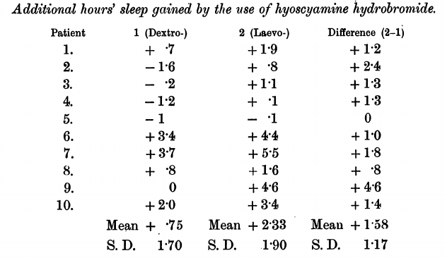

---
output:
  pdf_document: default
  html_document: default
---

  

# Chapter 2: Hypothetical-deductive method and Darwin's finches  
**Statistical tests and probabilistic distributions**

## Part 1 - Introduction

Charles Darwin observed that finch birds on the Galapagos islands had varieties of beak shape and size. His intuition about the origin of varieties from a common ancestor was one of the most scathing in “On the Origin of Species” (1859).

In this chapter, we will simulate data for a quantitative approach to the problem. We will study finch beak measurements in small samples from each island and make inferences about the populations of origin (different species).

  


\pagebreak

### Galapagos Islands

On his trip aboard the Beagle, Darwin described a group of birds that inhabit the Galapagos Islands, an archipelago located approximately 900 km off the coast of Ecuador (South America). The variety in beak sizes drew attention: *It is quite remarkable that an almost perfect gradation in the structure of this group can be traced in the shape of the beak, from one exceeding the dimensions of the largest of the big beak sparrows, to another differing little from the papa. blackberries.* [^4]

He noted that the variety of beaks was adapted to the diet of each group: fruits, nuts, insects. The pointed beak can eat fruit and aril from the seed of the cactus, while the short beak shatter the base of the cactus and eat its pulp.

Before the publication of The Origin of Species, the case of finches (the name of these birds) already contained an embryo of the natural selection process. In the second edition, in 1845, he speculated about a common ancestral group shaped by specific environments:

*(...) [when] seeing this gradation and diversity in structure in a small, closely related group of birds, it is possible to imagine that, from a few birds in this archipelago, a species was chosen and modified for certain purposes.* [^5]


[^4]: *“It is very remarkable that a nearly perfect gradation of structure in this one group can be traced in the form of the beak, from one exceeding in **dimensions** that of the **largest** gros-beak, to another **differing** but little from that of a warbler".*[^4] Tradução livre. The Voyage of the Beagle (1839).
[^5]: *“Seeing this gradation and diversity of structure in one small, intimately related group of birds, one might really fancy that from an original paucity of birds in this archipelago, one species had been  taken and modified for different ends.”[^5]*.Darwin, Charles (1845), Journal of researches into the natural history and geology of the countries visited during the voyage of H.M.S. Beagle round the world, under the Command of Capt. Fitz Roy, R.N (2nd. ed.), London: John Murray


### Doubts - Hypotheses and observations

Darwin took approximately 20 years between the initial iception of the idea (1838) and the publication of the work (1859). Aware that similar proposals were ridiculed, he was meticulous in defending his theory about the origin of species.  

Bird watching on the island was evidence, but it did not confirm the theory. Darwin then devised an investigation plan to test several different consequences of the theory. 
Geographic distribution, phenotypic variability (hybridization and cross-fertilization), variation under domination ... Would experiments in these areas obey predictions?  

The two decades were dedicated to contacting and interacting with specialists from different areas (from botany to the breeding of pigeons and rabbits). The accumulated evidence spoke strongly in favor of the Darwinian explanation, which described different fields in a comprehensive and simple model. The ant's job was to explore data and convince other scientists to accept the idea. This lasted until Alfred Wallace anticipated some of the most striking consequences in 1855, which Darwin had avoided attacking directly. ("On the Law which has Regulated the Introduction of New Species", Annals and Magazine of Natural History).

Charles Lyell was a geologist, a friend of Darwin's, and he was the one who strongly encouraged the publication of a solid exposition of the theory. The theory conceived in 1938 for the origin of species could be wrong, even though the Beagle's evidence was promising. The study of secondary hypotheses would clarify the veracity of the theory. The experimental confirmations provided security for a convincing defense.  

**Odds**  
It is interesting to note that the language used to denote differences is eminently quantitative (in the excerpt above: *dimensions*, *largest*, *differing*).  

Darwin observed the suitability of the beaks to the diet through his intuition, without taking measures.  
Visual inspection by a trained naturalist was able to detect these nuances. In his perception, there were a total of **3 species* *on 4 islands: 1 on Charles Island, 1 on Albemarle Island and 1 on James and Chatham Islands. Initially, he noticed that the birds were similar to those seen in Chile. Darwin collected 26 birds and took them back for an ornithologist to study in more detail. The expert (John Gould) suggested that the 26 birds represented 12 completely new species, a number that later rose to 25. Today, taxonomists suggest a number of* *15 species**.  

---

Like the naturalist, we will examine the differences for different groups. However, we will use statistics and probabilities (normal distribution and Student's t) to test hypotheses and make more accurate conclusions about the measures.

\pagebreak

### Falsifiability and hypotheses  

Philosophers of science study characteristics in the modus operandi of other scholars. What is there in common between the procedures employed by biologists and geologists? What distinguishes Charles Darwin and Paul Dirac from John Dee and Edward Kelley? What works in different areas of human knowledge?

We adopted the collective name of "sciences" for some areas of knowledge. In addition, we associate them with common characteristics in procedures and internal structure. Somehow, scientificity communicates credibility. In recent decades, philosophers have discussed the validity of the problem of demarcating science from pseudoscience and non-science. [^7]
In this chapter, we will stick to an older and arguably influential conceptual paradigm.

The hypothetical-deductive method was popularized in the 20th century as an identification flag associated with scientific work. A cycle that consists of formulating theories, designing experiments, testing falsifiable hypotheses, verifying results and repeating the process in an iterative way.

The rationale for using testable hypotheses is that valid propositions about a system contain information that helps to predict it. Thus, "it is sunny or not sunny tomorrow" is a useless proposition, while "it is sunny tomorrow" is a useful proposition. Note that "it is sunny tomorrow" is a testable (falsifiable) hypothesis, while "it is sunny or not sunny tomorrow" is a true hypothesis regardless of observations.  

Theophrastus (c. 371 – c. 287 BC) and Eudemus (400 BC) originally outlined *modus tollens*.  
 
1 . If the theory is true, fact X will happen,
2 . X did not happen, *soon* the theory is false.  

K. Popper was a leader in the revitalization of the hypothetical deductive method in the past century. For him, the difficulty in generating testable and falsifiable hypotheses signaled an evident weakness in theories. The freedom to test the veracity of theories is a hallmark of science as opposed to esoteric and / or authority-based practices.  
 
Popper severely attacked Karl Marx's dialectical materialism, as well as Charles Darwin's theory of evolution by natural selection and psychoanalysis.  

These branches of human knowledge encountered difficulties with the proposed demarcation criterion. Marx predicted that the revolution would happen in an industrialized nation, through the working class and other events that did not materialize. His followers used *ad-hoc* hypotheses to justify their observations while maintaining predictions made in the light of dialectical materialism.
Darwin's theory of evolution by natural selection was supported by many examples of impossible reproduction (e.g. recomposition of the evolutionary trajectory in fossils). Psychoanalysis has also suffered harsh criticism, due to the irrefutability of its central pillars.

As we will discuss in the following chapters, hypotheses are not essential in the scientist's life. However, falsifiable predictions are extremely useful to demonstrate the usefulness of a theory. A specialist has an extremely increased credibility when he / she usually makes guesses in uncertain situations and the same goes for scientific theorists.   

Hypothesis tests can be formalized through probabilities and statistics, which incorporate quantitative aspects. We calculate the probability associated with observations, considering the scenario of a hypothesis (falsifiable).
This rationale adapts robust mathematical tools to the hypothetical-deductive epistemological platform, being a dominant model of production in experimental sciences.  

[^7]:Massimo Pigliucci - Philosophy of Pseudoscience: Reconsidering the Demarcation Problem


#### Hypothesis tests  

We usually start from a base hypothesis, called null hypothesis, which describes the least interesting scenario, that is, the inexistence of the phenomena proposed by the scientist.  
It is common to compare two groups, A and B, as to the result of an intervention. The null hypothesis usually assumes that the groups present equal results.
We want to study the size of the bird beaks of islands A and B. The null natural hypothesis assumes that the species are the same: There is no difference between the beaks of birds of type A and B.  
We measure the beak of some birds in the two groups and calculate the probabilities of finding these measurements considering that A and B come from equal populations.
If the differences are large, the probability is very low. We reject our hypothesis and accept the alternative (there is a difference between A and B).  


Structuring the steps:

1. We define the null hypothesis ($H_{0}$) and at least one alternative hypothesis($H_{1}$).
  * $H_{0}$: Birds on islands A and B have beaks of equal size.
  * $H_{1}$: Birds have different sized beaks.

Then, we can do an experiment, collecting experimental measurements for the nozzle length. These measures, together with reasonable mathematical premises, allow us to speculate: what is the probability p of obtaining our observations considering equal distributions between A and B? That is, considering $H_{0}$ true, would our results be rare or common?

If p is less than a predefined threshold (conventionally, 0.05), we reject $H_{0}$. The probability is very small for $H_{0}$ to be true.

The domain of hypothetical-deductive procedures in the sciences has produced interesting results.
Especially in the work axis called by Thomas Kuhn "normal science", focused on accumulating evidence and testing hypotheses. The ideal of designing an impartial experiment, with the possibility of failure, sharpened the perception of researchers for the fallibility of ideas.
The degree of sophistication in reproducibility of procedures has been amplified.  

#### Note

*We use the lower limit of 0.05 as a criterion to reject the null hypothesis, which may seem arbitrary. And is. The p-values were interpreted according to their magnitude and statistics based on which they were calculated. It was Ronald Fisher, in Statistical Methods for Research Workers (1925), who proposed (and later popularized) the number: "The value for which $p = 0.05$, or 1 in 20, is 1.96 or nearly 2; it is convenient to take this point as a limit in judging whether a deviation ought to be considered significant or not. [^8] "*

[^8]: The value [of the z statistic on a normal curve] for which $p = 0.05$, or 1 in 20, is 1.96 or approximately 2; it is convenient to take this point as a limit when judging when a deviation should be considered significant or not.


## Part 2 - Darwins’s Finches and a parametric test

We will show how the individual contribution of genes with additive effects of uniform distribution results in approximately normal measurements for the birds' beaks.

We will simulate the beak measurements in 4 samples (n = 150) of birds.
The size of the beaks is given by the additive effect of many similar genes, so we expect their distribution to be normal by the Central Limit Theorem.

A copy of the gene adds x millimeters to the final size. The value of x is drawn from a random variable of uniform distribution, $X \sim U(0,1)$.
Birds have a fixed number of n of additive genes in each sample, drawn in the range between 80 and 100. The final measurement of the beaks is given by the sum of the effects of the n genes. This number is fixed for each population and varies between populations.

To simulate the data with the above conditions:

```julia
using Distributions , DataFrames , Random
Random.seed!(5)
n_birds = 150 # sample_size
genes_low = 80 # lower bound on number of genes
genes_hi = 100 # upper bound on numbe
n_islands = 4 #samples
# Function that adds uniform distributions (n = n_genes)
function unif_sum(n_genes)
          gene_samples = [rand(Uniform(0,1),100) for _ in 1:n_genes]
          effects_sums = sum(gene_samples)
          return effects_sums
        end
# Function to generate n_pop individuals with n_genes
function generate_pop(;n_pop,n_genes)
          pupulation = [unif_sum(n_genes) |> mean for _ in 1:n_pop]
        end
# Generate random samples with n_birds;
# n_genes of each island varies between genes_low genes_hi
galapagos_birds = map(x -> generate_pop(n_pop=n_birds, n_genes=x) ,
    rand( DiscreteUniform(genes_low,genes_hi), n_islands)) |> DataFrame
```

As expected, we found that the histogram of the final measurements is close to that of a Gaussian.

```julia
using StatsPlots
@df stack(galapagos_birds) groupedhist(:value, group = :variable,
      bar_position = :dodge,bins=50,title=("Darwin Finches"),
    xlabel="Beak Size",ylabel="Count",legend=false)
```


The random numbers generated using the suggested seed (`Random.seed!(5)`), line 4 of the code above) are similar to Darwin's assumption: 4 islands (samples) and three species (nozzle distributions). We noticed that there are two samples (purple, red) of very similar measures and two separate ones (green, blue).
Assuming that we measure the beaks of some birds, how do we know if the groups are different?

By calculating the differences between distributions, we can infer whether two samples have the same number of underlying genes! For this, we will use a rationale and some new tools.

\pagebreak

### Student's t test and t-distribution: A practical example

To statistically test whether the measurements are different, we will perform a t test to compare the groups.

The t distribution arises when we want to understand how unlikely our estimates ($\mu'$) are by assuming a hypothetical real average ($\mu$) of origin in an unknown normal distribution variable.

**Example**: We measured the beaks of 30 birds. We obtained a sample mean of $\mu'$ = 38 mm and a standard deviation of $\sigma'$ = 0.3 mm.
**Problem**: Assuming that the real average ($\mu$) of the population is 40 mm, what is the probability of obtaining $\mu'$ = 38 mm in a random sample, as happened in our experiment?
Understanding the inaccuracy of an average estimate was the main axis for the description of this distribution by William Gosset. Under the pseudonym Student, the statistician, who worked for the Guinness brewery, published in Biometrika (1908) the famous article *The probable error of a mean*.

To understand the inaccuracy, we need a measure of the dispersion of these measures.
We assume samples taken from a random variable with normal distribution with average $\mu$ and standard deviation $\sigma$. We can take *j* samples of size *n* and average these samples $\mu_{1}', \mu_{2}', ..., \mu_{j}'$. The sample averages $\mu'$ are estimates of the real average $\mu$.

What is the dispersion of the estimates $\mu_{1}', \mu_{2}', ..., \mu_{j}'$?

For a set of estimates $\mu_{1}', \mu_{2}', ..., \mu_{j}'$, we call **standard error of the mean* the population standard deviation $\sigma$ divided by the square root of the size of the sample family in question $(std. err. = \sigma/\sqrt{n})$.
Since we do not know the standard deviation in the population, we approximate it using the sample standard deviation $\sigma'$.

Student proposed using a quantity to estimate the probability of a $\mu'$ estimate given a hypothetical $\mu$ center.
This pivotal amount is the ratio between *(1)* distance from the estimates and the real average, $\mu'$ - $\mu$, and *(2)* the standard error.
The t statistic:

$$t = \frac{Z}{s}=(\mu'-\mu)/\frac{\sigma}{\sqrt{n}}$$

Thus, the t statistic for our example ($\mu$’= 38; $\mu$ = 40; n = 30; $\sigma$’ = 0.3) is:
$$t = \frac{(38-40)}{\frac{0.3}{\sqrt{30}}}$$
Student (Gosset) showed that this statistic follows a probabilistic distribution (Student's t) defined by:

$$f(t)={\frac {1}{{\sqrt {\nu }}\,\mathrm {B} ({\frac {1}{2}},{\frac {\nu }{2}})}}\left(1+{\frac {t^{2}}{\nu }}\right)^{\!-{\frac {\nu +1}{2}}}$$

B is the Beta function [^9] and v are degrees of freedom.
It has a density similar to that of the normal distribution, but with greater probabilities for extreme values. The parameter $\nu$ (degrees of freedom) expresses this characteristic. It is empirically estimated by the size of the samples used in the $\mu'$ estimate.
We associated a sample (size n) taken from a normal population (arbitrarily high size,$n \rightarrow \infty$) to a t distribution with $n-1$ degrees of freedom. In our example, $n=30$, so  $\nu = n-1 = 29$.

[^ 9]: The Beta function accepts two arguments $(x,y)$ and its result is the ratio is between (1) product of the functions $\Gamma(x) \Gamma(y)$ and (2) gamma function of the sum $\Gamma(x+y)$. The $\Gamma$ function generalizes the concept of factorials (product of the predecessors).


Higher values correspond to larger samples and bring the t-distribution closer to a normal distribution. In an extreme case, we have $n_{samples}=n_{pop}$ and the samples are identical to the source distribution.

Knowing the t-statistic (-36.51) and the degrees of freedom for our sample family ($\nu$ = 29), we can use the expression $f(t)$ to know the probability of obtaining our average 38 mm in a sample ( n = 30) if the population average is 40 mm.

For that, we add the probabilities of extreme values lower than the t-statistics provided.
$$\int_{-\infty}^{-36.51}f(t)dt$$

In julia, the native function *cdf* does the dirty work of calculating the integral:

```julia
using Distributions
cdf(TDist(29),-36.51)
    4.262182718504655e-2
```

This value reflects the probability of negative t values that are more extreme (smaller) than our ($t < -36.51$).

#### Two-tailed test

It seems to be our p-value, but it needs an adjustment: we want to know the probability associated with obtaining such extreme values in general, not restricting ourselves to extremely smaller values.

Since the distribution is symmetrical, the tail on the left (negatives) is identical to the tail on the right (positives). Extreme values (negative or positive) in relation to the average are twice as likely as negative extreme values.
We consider significant t-values much higher (right) or lower (left) than the average. So, our threshold must be robust to the possibility of extremes greater than the positive t symmetric statistic.

The value $t=36.51$ it would be the resultant statistic of a sample with symmetric mean (42 mm) in relation to the mean (40 mm). Remember that the original measurement was 38 mm.

$(t_{min}= -36.51; t_{max} = 36.51)$.
When making this adjustment, we call the two-tailed test.

Knowing the symmetry in the t-distribution, we can then use the following trick:

```julia
2*cdf(TDist(29),-36.51)
  8.52436543700931e-26
```

It is not possible to directly calculate the probabilities for t = 36.51, as Julia approximates the integral above $(p \sim 1 - 4.262^{-26}) \sim 1$.
```julia
cdf(TDist(29),36.51)
    1.0

```

#### Note

*A common misconception about the t distribution is that it describes small samples taken from a population with a normal distribution. Any sample taken from a normal distribution variable will, by definition, have a normal distribution, even though it is composed of 1 or 2 observations. What follows t-distribution is the pivotal amount described above.*

In section IX of the article, Student (Gosset) demonstrates how his insight can be used to test the effect of scopolamine isomers as a sleep inducer. [^10] Two samples are used (levos and hyoscyamine hydrobromide dextro).



Using data from 10 patients who used both substances and measures of the additional amount of observed hours of sleep, “Student” calculates: (1) the probability of the data assuming an average of 0 in each group and (2) the probability of the data assuming that the difference in means is 0.

The first procedure is identical to the one we performed with the nozzle measurement and is called a single sample t-test. Hypothetizing a value for the mean (e.g. $\mu_{bico}= 40 mm; \mu_{sono adicional}= 0 horas$), we calculate the probabilities of our estimate.

The second procedure is called the t-test of independent samples. We hypothesize a value for the difference in means between two populations $(\mu_{a}-\mu_{b}= 0)$ and calculate the probability of our estimate. Practical example: is there a difference in weight between the beaks of birds A and B?


[^10]:https://atmos.washington.edu/~robwood/teaching/451/student_in_biometrika_vol6_no1.pdf

\pagebreak

### Applications

Returning to our Galapagos example, we will do a t test of independent samples.

1. The measurements in A and B are samples of random variables with normal distribution.
2. We define the null hypothesis and at least one alternative hypothesis.
     * $H_{0}$: Birds from islands A and B have beaks of equal size.
     * $\mu_{a} - \mu_{b} = 0$
B. $H_{1}$: Birds have different sized beaks.

The procedure is similar to the previous one. We calculate an intermediate quantity that follows t-distribution using the sample estimate of the difference and associated standard error. So, we can speculate: how likely is it that someone will get our observations considering distributions of equal averages $(\mu_{a} = \mu_{b})$? This test infers the probability for the populations from which the samples came.

If p is less than an arbitrarily predefined threshold (conventionally, 0.05), we reject $H_{0}$ The probability of looking at the data is small if $H_{0}$ is true.
We obtain the p-value by adding the probability values corresponding to the differences obtained or more extreme values. If the difference between values is large, the value of the statistic will grow. This implies a low probability of observing those results if the samples were similar (coming from the same distribution).

\pagebreak

#### Student t test with Julia

We will compute a t test for 2 independent samples. The t statistic is calculated with some changes.
The degrees of freedom are added together and the standard error (dispersion of estimates) is balanced through the weighted average (by degrees of freedom, n-1) between samples.

$$t = \frac{ X_{1} - X_{2}}{\sigma_{pooled}\sqrt{\frac{1}{n_{1}} + \frac{1}{n_{2}}}}$$

$$\sigma_{pooled} = \sqrt{ \frac{(n_{1}-1)\sigma_{1}^{2}+(n_{2}-1)\sigma_{2}^{2}}{(n_{1}-1)+(n_{2}-1)}}$$


Considering $(n_{1}-1) + (n_{2}-1)$ degrees of freedom, we calculate the t-statistic and the corresponding p-value for our degrees of freedom. Using the samples created earlier, corresponding to the gray (A) and blue (B) bars, we will plot the histograms.

```julia
@df stack(galapagos_birds[:,[:x1,:x2]]) groupedhist(:value, group = :variable,
    bar_position = :dodge,bins=50,title=("Darwin Finches"),
    xlabel="Beak Size",ylabel="Count",legend=false)

```


```julia
# Ajustes nos dados
a = galapagos_birds[:,:x2]
b = galapagos_birds[:,:x4]
sd_a = std(a)
sd_b = std(b)
```

Here, instead of comparing the estimates of the t-distribution means for samples A and B.
We calculate the (1) Expected difference in the validity of the null hypothesis ($\mathit{diff}_{H_{0}} = 0)$, (2) estimate of the difference $(\mathit{diff} = \mu_{A}-\mu_{B})$, degrees of freedom (df) and balanced standard error $(se_{pooled})$ for the distribution of differences in means.

```julia
expected_diff = 0
mean_diff = mean(a) - mean(b)
6.963886183171148
len_a , len_b = length(a) , length(b)
# balanced degrees of freedom
df_pool = len_a + len_b - 2 
# balanced standard deviation
sd_pool  = sqrt(((len_a - 1) * sd_a^2 + (len_b - 1) * sd_b^2) / 
  df_pool) 
```
The t statistic corresponding to the observed difference, considering a t distribution with the parameters calculated above.

```julia
# Difference divided by standard error
# t-statistic  
t = (mean_diff - expected_diff) / 
      (sd_pool * sqrt(1/length(a) + 1/length(b))) 
```
P-value for two-tailed hypothesis (extreme results considering the possibility that the difference is greater or less than 0):

```julia
p = 2*cdf(TDist(df_pool),-abs(t))
```

Finally, adding the summary of the results (averages A and B, difference verified, resulting t-statistic, p-value):

```julia
results = Dict(
                "Mean Difference" =>mean_diff,
                "t"=>t,"p value" => p,
                "Mean in A" => mean(a),"Mean in B" => mean(b))
Dict{String,Float64} with 5 entries:
  "Mean Difference" => 0.46412
  "t"               => 16.7569
  "p value"         => 7.28163e-45
  "Mean in A"       => 42.9969
  "Mean in B"       => 42.5328
```

We obtained a significant p-value (p <0.001) using n = 150. The degrees of freedom are 149 (150 - 1) in each sample, with 298 in total.
We can automate the process in 1 line:

```julia
using HypothesisTests
UnequalVarianceTTest(a, b)
Two sample t-test (unequal variance)
------------------------------------
Population details:
    parameter of interest:   Mean difference
    value under h_0:         0
    point estimate:          0.4641197814036815
    95% confidence interval: (0.4096, 0.5186)

Test summary:
    outcome with 95% confidence: reject h_0
    two-sided p-value:           <1e-44

Details:
    number of observations:   [150,150]
    t-statistic:              16.756889937632724
    degrees of freedom:       297.5604548062057
    empirical standard error: 0.02769725069097449

```

The t-statistics and degrees of freedom presented by the implementation are identical to those found by performing the procedure step by step.
Instead of the exact value $(p=1.23^{-179})$, we received the information that $p < 1e^{-99}$.
Given the p-value obtained, we would conclude that the distribution of data as observed is unlikely if the null hypothesis $ H_ {0} $ is true that the difference between samples is 0

#### Report example

The estimated difference of beak mean  sizes among samples A and B was significantly (p<0.05) different from zero (t = 47.28, df = 298)

|                 |Sample A | Sample B | valor p |
|-----------------|----------|-----------|---------|
| Mean ($\mu$)        | 43,52    | 41,99     | <0,001  |
| Std. Dev. ($\sigma$)   | 0,28     | 0,28      |         |


 

#### Note


\pagebreak

###Exercises

1. Using the simulated dataset in the chapter:
* a. Perform T test for each pair of samples
* B. Which tests have p <0.05?
    * i. Describe t-statistics, degrees of freedom and p-value.
        * 1. How are the degrees of freedom of the different tests?
        * 2. Were these values expected for our samples?
    * ii. Using ggplot, plot histograms for all pairs compared in just one panel. Hint: grid.arrange
    * iii. Plot boxplots for one of the comparisons.
    * iv. From the previous graphic, add a layer with transparent violin plots (geom_violin) (alpha = 0).
2. Using the iris dataset
    * a. Choose two species and two measures.
    * B. Perform t-tests for both measures
    * ç. Report the results in a table, including mean and standard deviation of both measurements in both species.
3. The data used by Student for scopolamine are included in the base library of R.
    * a. Examine the data by invoking “sleep”:> sleep
        * i. Plot histograms for measurements in both groups
        * ii. Run a t test assuming zero population mean ($\mu = 0$).
        * iii. Run a t test between samples, assuming the same average ($H_{0}:\mu_{1} = \mu_{2}$).
4. Generating the t distribution:
    * a. Simulate a set of many measures (suggestion: 100,000) from a normal distribution $(\mu = 0, \sigma = 1)$.
    * B. Take 200 samples of n = 30 and save the 200 averages (sample function).
    * ç. Divide the values by the standard error, $\frac{\sigma}{\sqrt{n}}$.
    * d. Take 200 samples from a t-distribution with 29 degrees of freedom (rt function)
    * and. Plot the superimposed histogram of the obtained distribution and the theoretical distribution

\pagebreak
