---
output:
  pdf_document: default
  html_document: default
---
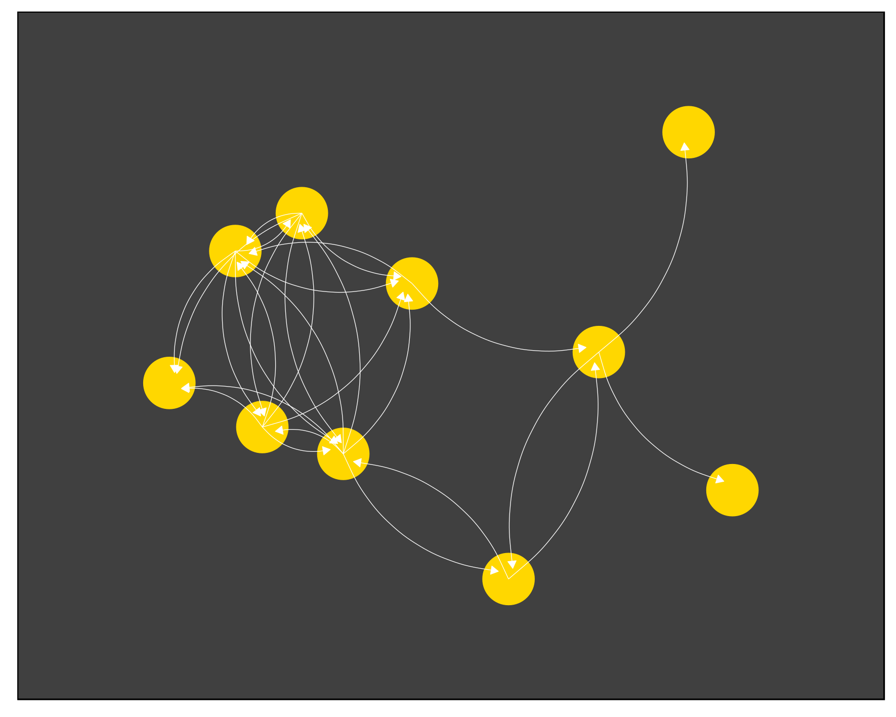

# Chapter 4: Multivariate analysis, graphs and causal inference 

## Introduction
In this chapter, we will incorporate constructs as a basis for studying a concept from the cradle of Western philosophy: *causality*. Aristotelian philosophy investigates material, formal, efficient and final causes. Causes express the idea of isolating relationships between factors. Most definitions involve *effects* that depend, even partially, on previous *causes*. Causal relationships *explain* the evolution of systems under certain conditions.
Up to this point, we have applied mathematical modeling for one or two random variables. Different procedures were used for correlation, comparison and regression. In this chapter, we will deal with multivariate analysis. Causal diagrams and bias control, mediation, moderation, multiple regression, principal component analysis and factor analysis.   

\pagebreak 

## Graphs and causal trajectories  

We can use the following diagrams to illustrate a simple linear regression:  
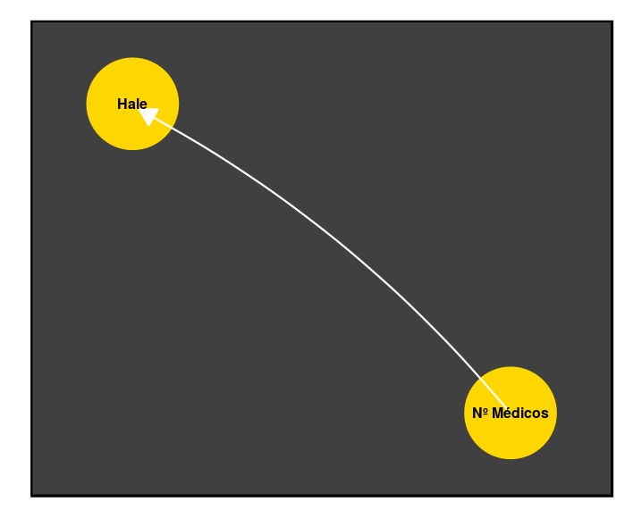  
Or multiple with two predictors:  
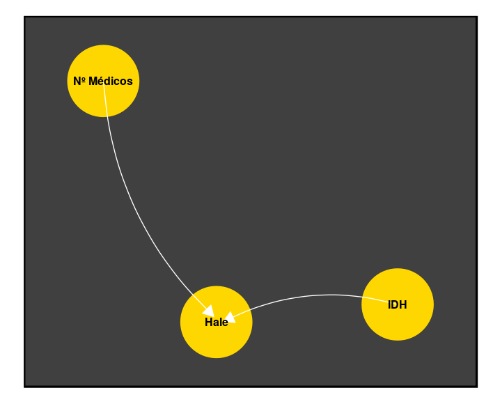  

It is easy to relate *nodes to variables* and *connections to relations* described by the estimated equations. Formally, we treat these abstractions as **graphs**. The field started to be treated by Euler in 1736. We call the points nodes, or vertices, and the connections of edges (*edges*). Each edge connects two nodes.
The concept was used to solve the problem of Königsberg bridges. Given a series of bridges connecting different parts of the city, how to make a route that crosses each one only once?  

  

\pagebreak

Euler showed that it was impossible. Note that we don't use distances. We only describe how elements are connected. We can tie several structures together. The graphs above, for example, are directed and have linked equations.

The equations and procedures we used previously are solutions equivalent to graphical representations. It is possible to generalize the idea, using diagrams to treat mathematically formulations of scientific theories.  

### Graphs and causal trajectories

*"The ideal method of science is the study of the direct influence of one condition on another in experiments in which all other possible causes of variation are eliminated.", Sewall Wright, Correlation and Causation, 1921*  

The little-known origin of this field lies in the work of a geneticist, Sewall Wright. He assumed that the correlation between variables is the result of the influence of many causal trajectories. Then, he proposed a way to measure the influence of each trajectory on a target variable.


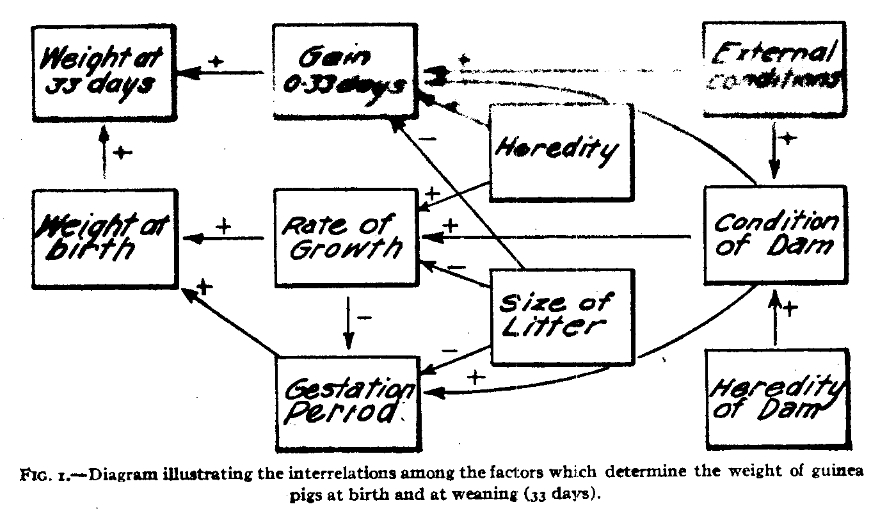

Using directed graphs (connections have a source and a destination), it is possible to link the notions of correlation and regression in order to illustrate causal paths between linear relationships. Sewall started using only acyclic graphs (without trajectories returning to the same point of origin) directed, DAGs, under restricted conditions.  

Decades later, the field was extrapolated to other, more general scenarios. In particular, the boom in the availability of computing power in the 1960s and 1970s drove the emergence of different estimators for parameters in these models.
It is expected that the number of parameters will increase according to the complexity.  

Valuable work was done by Judea Pearl to unify the approaches. Pearl showed that many *frameworks* are special situations of structural equation models. He wrote comprehensive texts aligning applied mathematics to an epistemological basis.
Especially noteworthy is the concept of *counterfactual*. To estimate a causal effect, we imagine what the conditions would be in a scenario with no action by the causal agent. Pearl conducts a careful logical-semantic study of definitions in an attempt to build a coherent system of empirical research.
 

#### Examining covariates with causal models

Causal models based on graphs assume unidirectional effects. This precludes the accurate description of many cases. On the other hand, parsimonious use is a valuable tool for making causal inferences.
The following DAG analyzes the quality of a beer. It depends on water, hops (hops) and malt. We want to understand how the composition of solid ingredients (hops & malt) interferes with the final purity, evaluated by the absence of pesticides. We have data from some local factories. The water concentration in each city also varies, which directly interferes with the final purity of the beer. In addition, water is used to water the soil with hops and malt, also indirectly interfering in the outcome.    

---  

**Note**  William Gosset developed the t test while working on beer production.  

---  

\pagebreak


```r
library(dagitty)
library(ggdag)

# Example in basic syntax
dag_o <- dagitty("dag{A <- B}")
# dagify used for plots
dagified <- dagify(Quality ~ Water + HopsMalt, 
                   HopsMalt ~ Soil,Soil ~ Water,
                   exposure = "HopsMalt",
                   outcome = "Quality")
p1 <- ggdag(dagified) + theme_dag_blank()
p1
```  

Tracing a DAG allows you to examine the possible paths through which information flows and, thus, make inferences. In a practical way, we want to:

1 . Test whether the proposed causal model is compatible with the observations.
2 . Estimate the effect by conditioning it to the appropriate covariates.
  

The graph implies some *conditional independence*. This means that, if it is correct, some variables will be independent.  
```r
impliedConditionalIndependencies(dagified)
#HopsMalt _||_ Water | Soil
#Quality _||_ Soil | HopsMalt, Water
```
The notation `A _||_ B | C, D, E, F...` indicates that A must be independent of B, if we condition the effect estimate to the covariables C, D, E, F ... "Conditioning a" means to include the covariate in the descriptive model. The simplest form is through multiple regression.  

## Multiple regression

In simple linear models, we calculate parameters for an intercept $\beta_{0}$, straight slope $\beta_{1}$ and variance of errors $\sigma^{2}_\epsilon$. For example, we examine the purity of beer as a function of the purity of solid ingredients.  

$$y_{i} = \beta_{0} + \beta_{1}x_{i} + \epsilon$$  
$$\text{beer}_{i} = \beta_{0} + \beta_{1}\text{HopsMalt}_{i} + \epsilon$$

In *multiple linear regression*, we introduce one more predictor variable, such as water and soil purity:  

$$\text{beer}_{i} = \beta_{0} + \beta_{1}\text{HopsMalt}_{i} + \beta_{2}\text{Water}_{i} + \epsilon$$

In general, we have two goals:
**(1)** improve the model's performance by adding pertinent information; 
**(2)** examine the relationships considering multiple variables.  

The first objective is intuitively obvious, however we need to be careful with information redundancy. Specifically, there is an almost inevitable trade-off between complexity and robustness of the model. Adding variables or using more flexible relationship classes means giving freedom to overfitting the data (**overfitting **). That is, our model will learn idiosyncrasies about the available data (WHO and World Bank datasets) and not about the relationship between abstractions (e.g. healthy life expectancy). We will see in another chapter how to mitigate this problem.
  


Another objective for multiple regression is to examine the modifying effect of the added variables. In particular, it is common to include auxiliary variables to correct estimates.  

Example: we want to estimate a parameter $\beta_{1}$ for the relationship between height and weight. We adjust a model: $Altura = \beta_{0}+\beta_{1}*Peso+\epsilon$. However, we know that the height and average weight of men is greater than that of women. When examining the relationship between height and weight, we can include the variable *gender* in the model, $Altura = \beta_{0}+\beta_{1}*Peso+\beta_{2}*Sexo+\epsilon$.  
Our estimate of $\beta_{1}$ is modified to take into account the effects of sex.[^21]  

However, including all covariates in a single model would result in inadequate effect estimates. The coefficients can even show relations with the opposite direction in the presence of wrong conditionals: negative, when the real effect is positive.
Strict use of confounding control in multivariate analysis avoids misinterpretation of coefficients. This is done by selecting the set of adjustments respecting the adopted diagram.  


We will see a formalization of this concept below, with a general platform to examine many specific variables and procedures for calculating effects and cases such as mediation and moderation.
  

[^ 21]: Sex is a dichotomous variable (male / female). We usually encode them in binary form (0/1; e.g.: male = 1 / female = 0). Thus, a male subject will have the height estimate increased in $\beta_{2}*1$, while females will have this term zeroed $\beta_{2}*0$. We call this trick *dummy coding*.

#### Conditional independence 

Returning to the example, the following conditional independence is implied by the DAG:  

```r
impliedConditionalIndependencies(dagified)
#HopsMalt _||_ Water | Soil
#Quality _||_ Soil | HopsMalt, Water
```

We can simulate the data and test the independence:  

```r  
beer_data <- simulateSEM(dagified,b.lower = 0.20,b.upper=0.25)
# HopsMalt _||_ Water | Soil
lm(HopsMalt ~ Water + Soil,beer_data)
# Quality _||_ Soil | HopsMalt, Water
lm(Quality ~ Soil + HopsMalt + Water,beer_data)
```  
It is expected that the estimate of the effect (coefficient) will be close to zero (no association) since we condition it to the indicated covariates. We see that this happens for the example:  

```r
#(...)
#Coefficients:
#(Intercept)        Water         Soil  
#    0.03709      0.02105      0.28069  

#(...)
#Coefficients:
#(Intercept)         Soil     HopsMalt  
#    0.05652      0.08347      0.15118  
```
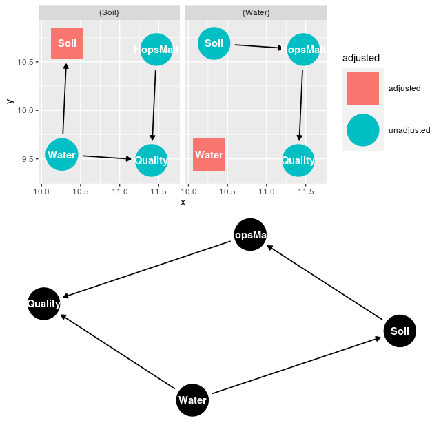  

#### Adjusted estimate (effect) of effect   

Once we accept the DAG as appropriate, we can use it as a reference for calculating unbiased estimates. This means that we are adjusting the final value according to the ways in which the information can flow in the examined covariates.  

The `adjustmentSets` function returns which sets of covariates we can include to obtain unbiased estimates. The function `ggdag_adjustment_set` visually tells us which paths we are closing when conditioning a group of covariates. Sometimes (as in the example), we have alternative sets:  

```r
p2 <- ggdag_adjustment_set(dagified,exposure="HopsMalt",outcome="Quality")
multiplot(p1,p2)
adjustmentSets(dagified)
# { Water }
# { Soil }
```
One requires conditioning to the water and the other requires conditioning to the soil. The plotted graphs indicate the flow of information in each set of adjustments. We can report the values for one of the paths or for both paths.

We can imagine a new factor, which interferes with the final purity and also that of the solid ingredients.  

```r
dagified2 <- dagify(Quality ~ Water + HopsMalt + A, 
                   HopsMalt ~ Soil + A , Soil ~ Water,
                   exposure = "HopsMalt",
                   outcome = "Quality")
                   
p3 <- ggdag(dagified2)  + theme_dag_blank()
p4 <- ggdag_adjustment_set(dagified2,exposure="HopsMalt",outcome="Quality")
multiplot(p4,p3)
```  

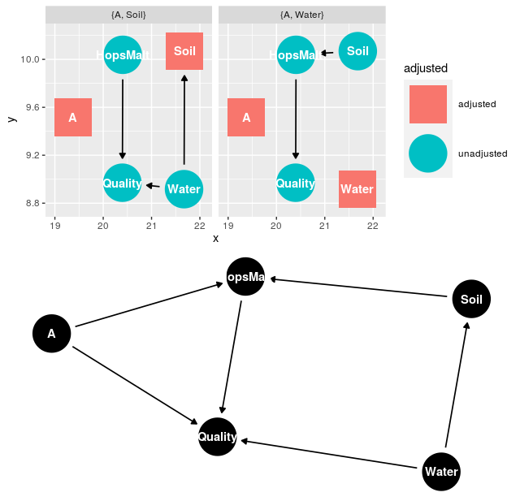  

Now, we should test the following conditions:  

```r
beer_data2 <- simulateSEM(dagified2,b.lower = 0.20,b.upper=0.25)
#A _||_ Soil
lm(A ~ Soil,beer_data2)
#A _||_ Water
lm(A ~ Water,beer_data2)
#HopsMalt _||_ Water | Soil
lm(HopsMalt ~ Water + Soil,beer_data2)
#Quality _||_ Soil | A, HopsMalt, Water
lm(Quality ~ Soil + A,beer_data2)
```

The adjustment possibilities for unbiased estimation are:  
```r
adjustmentSets(dagified2)
# { A, Water }
lm(Quality ~ HopsMalt + Water + A,beer_data2)
# { A, Soil }
lm(Quality ~ HopsMalt + Soil + A,beer_data2)
```

We usually translate the procedures above stating that the estimate for *"the relationship between X and Y is controlled for confounders [A, B and C]"*. At this point, it is obvious that linguistic simplification is dangerous. **It is recommended that confounders be mitigated experimentally (e.g. randomization).**
The lack of caution in translating mathematical abstractions into natural language is responsible for the unfair reputation of statistics as a tool for mistakes.
Just as the p-value is misinterpreted many times, "control for confounders" "is nothing more than the adjustment of estimates considering a causal model.
Although all premises and procedures are strictly adhered to, the use of targeted acyclic graphs (DAGs) is limited to describe certain phenomena and is vulnerable. Dawid AP. Beware of the DAG !. InCausality: objectives and assessment 2010 Feb 18 (pp. 59-86)  


#### Collinearity

If the predictor variables are highly correlated, it is possible that we are providing redundant information to the model.
This may be necessary to estimate effects correctly, but it can also be harmful. In particular, it can prevent the calculation of coefficients (non-identifiable model) or increase complexity without adding information. 

The VIF *Variance inflation factor* is an indicator that helps to understand the influence of collinearity in the estimates.  


**VIF**

The intuition here is that if the variables are closely related $X_{1} \sim X_{2}$, the values of $\beta$ estimated in $Y = \beta_{1}X_{1} + \beta_{2}X_{2} + ...$ they will not be unique. For example, we could exchange $\beta_{1}$ per $\beta_{2}$ and the solution would remain largely unchanged. VIF estimates collinearity in relation to the combination of other predictors used.      
   
To calculate the VIF for a $ X '$ predictor, we adjust a new regression, in which the response variable is $X'$ and the predictors are the other predictor variables. The VIF is given by:$\frac{1}{1-R^{2}}$, being $R^{2}$ the regression determination coefficient, as we calculated before.
High VIF values reflect values of $R^2$ high, that is: the linear combination of other variables would explain the predictor variable in question very well.
There is no canonical rule, but VIF> 10 ($R^{2} = 0.9$) and VIF> 5($R^{2} = 0.8$)   

The **vif** function of the *car* package implements the procedure. We adjusted a multiple linear regression for the length of the sepals in the *iris* dataset from 3 other variables. We can verify that there is collinearity ($VIF_{pet.leng.}\sim 15.1$, $VIF_{pet.wid.}\sim 14.2$) between width and length of the petal. On the other hand, collinearity with the sepal length is low ($VIF_{pet.wid.} \sim 1.3$). 
 
```r
    >car::vif(lm(Sepal.Length ~ Petal.Length + Petal.Width + Sepal.Width,    
        data=iris))
    Petal.Length  Petal.Width  Sepal.Width 
       15.097572    14.234335     1.270815 
```

If there is high collinearity and we are only looking for predictive power, removing one of the predictors to eliminate redundancy can be beneficial. As always, visual inspection helps.  

```r
    >pairs(iris[,1:4])
```
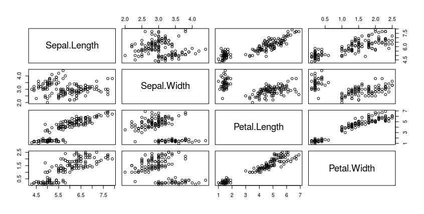

As we can see, using two non-collinear predictor variables (multiple regression) increases the model's performance in relation to simple regression
 $(R^{2} \sim 0.84\enskip vs\enskip R^{2} = 0.76)$.  

```r
    >lm(Sepal.Length ~ Petal.Length,    
    +         data=iris) %>% summary    

    (...)
    Multiple R-squared:   0.76,	Adjusted R-squared:  0.7583 
    F-statistic: 468.6 on 1 and 148 DF,  p-value: < 2.2e-16    

    >lm(Sepal.Length ~ Petal.Length + Sepal.Width,    
    +         data=iris) %>% summary    
    (...)
    Multiple R-squared:  0.8402,	Adjusted R-squared:  0.838 
    F-statistic: 386.4 on 2 and 147 DF,  p-value: < 2.2e-16
```
\pagebreak

#### Mediation and Moderation

**Mediation**

A curious idea is that one variable may be mediating the action of another on an outcome. A classic example is the relationship between smoking and cancer. We know that there is a harmful action due to the temperature of the inhaled air, as well as the chemical components absorbed.
In mediation models, we try to quantify the portion that is explained by intermediate variables. For this, we use the following procedure:  

**1.** Verify plausibility of relationships individually through regression models between variables of interest.
We adjusted 3 models:
*(1)* independent variable and target variable $(Y \sim X_{1}\beta_{1})$,  
*(2)* mediator variable and target variable $(Y \sim X_{2}\beta_{2})$,  
*(3)* independent variable and mediating variable $(X_{2} \sim X_{1}\beta_{3})$. 

The direct effect of the independent variable on the target variable is quantified $\beta_{1}$.

**2.** Check for changes obtained by introducing the mediator variable.
We fit a fourth model *(4)*, with the linear combination of independent variable and mediating variable. We then absorb the difference between the new $(\beta_{1}')$ coefficient of $X_{1}$ and the old one $(\beta_{1})$ $Y = X_{1}\beta_{1}' + X_{2}\beta_{4}$.  

If mediation exists, it is expected that the coefficient $\beta_{1}'$ is not significant or has a very small magnitude in relation to the coefficient of the direct effect $\beta_{1}$.  

Following the suggested example, it is expected that there is a relationship between smoking and cancer. Furthermore, it is expected that the inclusion of a mediator (e.g. nicotine concentration) explains part of the effect, reducing the coefficient of $X_{1}$. The following diagram expresses the idea contained in the desired process.  

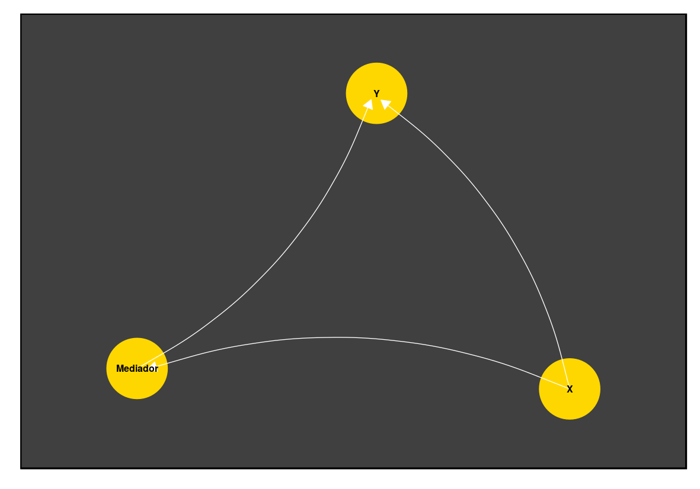  

The diagram below illustrates steps strictly.
The 3 regressions for checking assumptions are in the upper section and the multiple regression in the lower sector. Error terms have been suppressed. Estimates for the relationship between $X_{1}$ and $Y$ are $\hat{\beta_{1}}$ and $\hat{\beta_{1}}'$ highlighted in the equations. The behavior of these parameters defines the conclusions about the mediation model.  
  
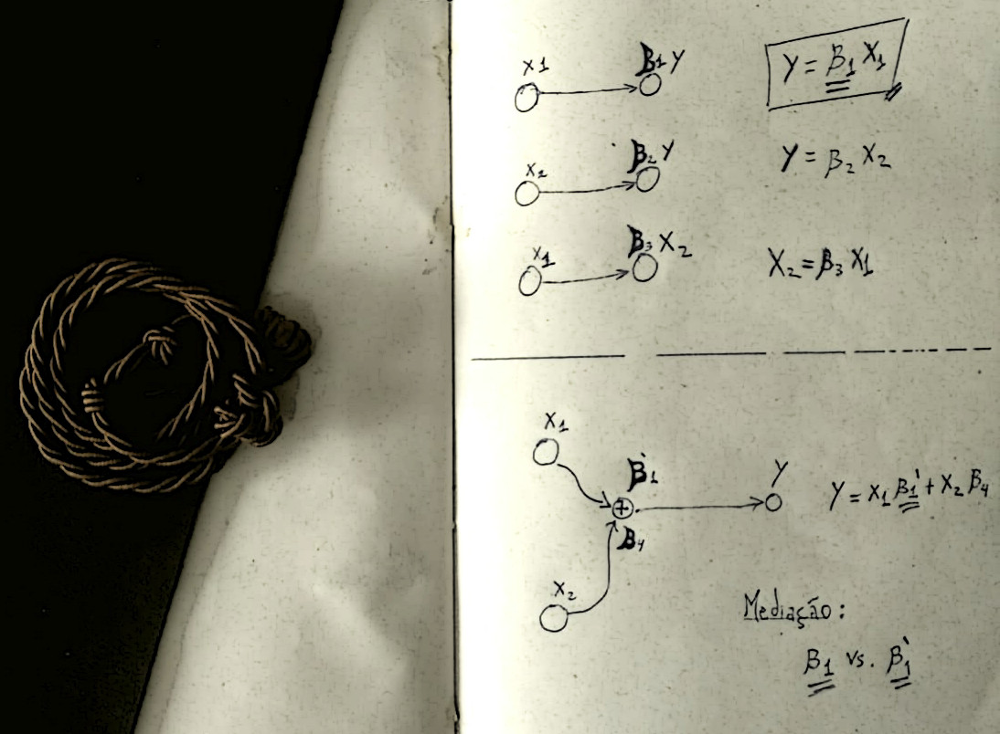

---

There is no guarantee that real systems will behave according to the estimated parameters. We used multiple regression to estimate the partial effect attributed to the gauges, but the removal of these factors in the real phenomenon can result in changes in the system not predicted by the model.
Certainty would depend on a fairly accurate description of the phenomenon by regressions $(R^2 \sim 1)$, which is rarely verified outside of simpler physical phenomena.   

Therefore, it is recommended that adjustments are made in the experimental phase. In our example, this would involve controlling the concentration of absorbed nicotine *in vivo*. Obviously, ethical reasons and limited resources often preclude direct manipulation of the object of study. Methods such as the one described, although fragile, allow the study of interactions and causal relationships. However, increased attention is needed when making conclusions and, especially, when translating them into natural language.  

---  

In R:  

```r
    >fit_yx1 <- lm(y ~ x1, data)    
    >fit_yx2 <- lm(y ~ x2, data)  
    # Mediation
    >fit_yx1x2 <- lm(y ~ y1 + y2)    
    >summary(fit_yx1)
    (...)
    >summary(fit_yx2)
    (...)
    >summary(fit_yx1x2)
    (...)
```
The numerical difference between $\beta_{x_{1}}$ is the magnitude of the indirect effect (* Ind. Effect *). We can use an estimate of standard error to derive an associated t-statistic and p-value (Sobel test). Using CRAN libs:
Using the dataset `bh1996`, with measures on leadership, well-being and hours of work.The question is: does the leadership climate mediate the relationship between working hours and well-being?   

```r
    >library(bda)
    >library(multilevel) # dataset bh1996
    >data(bh1996)
    
    # LEAD : Leadership climate
    # WBEING : Welfare
    # HRS : Work hours
    
    
    >sobel(pred=bh1996$HRS,med=bh1996$LEAD,out=bh1996$WBEING)
    $`Mod1: Y~X`
                   Estimate  Std. Error   t value     Pr(>|t|)
    (Intercept)  3.51693620 0.052902697  66.47934 0.000000e+00
    pred        -0.06523285 0.004590274 -14.21110 3.078129e-45    
    $`Mod2: Y~X+M`
                   Estimate Std. Error   t value      Pr(>|t|)
    (Intercept)  1.86832973 0.06413083  29.13310 1.024201e-176
    pred        -0.04311316 0.00421918 -10.21837  2.382257e-24
    med          0.48386196 0.01242129  38.95426 4.967825e-302    
    $`Mod3: M~X`
                   Estimate  Std. Error   t value     Pr(>|t|)
    (Intercept)  3.40718349 0.045154735  75.45573 0.000000e+00
    pred        -0.04571488 0.003917997 -11.66792 3.488366e-31    

    $Indirect.Effect
    [1] -0.02211969    
    $SE
    [1] 0.001978985    
    (...)

    >mediation.test(iv = bh1996$HRS,mv = bh1996$LEAD,dv = bh1996$WBEING)
                    Sobel        Aroian       Goodman
    z.value -1.117729e+01 -1.117391e+01 -1.118067e+01
    p.value  5.267356e-29  5.471647e-29  5.070460e-29
    # Aroian e Goodman são outros testes para o parâmetro de efeito indireto
```

\pagebreak

**Moderation and Interactions**

Models including moderation terms are those that include **interaction** between variables. Using the jargon of causal inference, it is the same as an effect modifier. As we discussed earlier, the relationship between smoking and cancer can be explained by intermediate factors, such as the concentration of nicotine and the presence of genetic variants of risk.
We can assume that the concentration of nicotine inhaled daily has an independent effect. Likewise, a genetic configuration has a causal effect in itself.  

$$Risk = Nicotina*\beta_{1} + Genes_{(+)}\beta_{2}$$

n moderation, we add a term to our linear combination. It is a coefficient for multiplication between independent variables.

$$Risk = Nicotina*\beta_{1} + Genes_{(+)}\beta_{2} + Nicotina*Genes_{(+)}\beta_{3}$$
Is *smoking* **and* *having* risk genes * different from combining the effect of both separately?  
 
This is one of the few cases where it is easier to observe the algebraic aspect beforehand. We are multiplying the predictor values $X_{1}$ and $X_{2}$. If both make the same sense ($+$ or $-$), the interaction will have a positive effect. Otherwise, negative. Still, we see that the magnitudes are multiplied. The coefficient $\beta_{3}$ quantifies this multiplication in relation to the effect in $y$,either by changing the direction ($\beta_{3}$ negative) or scaling the absolute value.  

$$y = X_{1}*\beta_{1} + X_{2}*\beta{2} + X_{1}X_{2}\beta_{3}$$

The relationship of $y$ in relation to each predictor, it ceases to be linear. As we can verify by analyzing the partial derivatives. For $\frac{d}{dx_{1}}$:  

$$\frac{d}{dx_{1}}(y) = \frac{d}{dx_{1}}(x_{1}\beta_{1} + x_{2}\beta_{2} + x_{1}x_{2}\beta_{3})$$
The second term does not depend on $X_{1}$, so:  
$$\frac{d}{dx_{1}}(y) = \frac{d}{dx_{1}}(\beta_{1} + x_{2}\beta_{3})$$
The slope (* slope *), which was previously a constant (straight line) $\beta_{1}$ starts to have an added term, which is the multiplication of the estimated constant $\beta_{3}$ by the value of $x_{2}$. So we have a different inclination for each moderator value!  

These details make the coefficients interpretable difficult. Typically, heuristics, such as centering data around the mean, are used to simplify the context.  

\pagebreak


#### Latent measures and factor analysis

Consider the problem of measuring something inaccessible through secondary means.For example, the concept of *quality of life* is easily conceivable, although it is not linked to a tangible measure, such as *height* or *femur size*.
A number of methods have been developed to deal with the task of estimating *latent variables*. In particular, these models are very popular with psychometrists. We can apply latent variable models for many contexts.
   

This is done when we use correct answers in a test formulated by experts to quantify a skill. * Item Response Theory * is used in tests such as ENEM (Brazil), SAT and GRE (USA). We relate the skill estimate $(\theta)$ with the probability of hitting (1) or wrong (0).  

Personality traits can also be studied in this way. We can assign a person's $F$ of a person through his score on a battery of tests $X_{1},X_{2},X_{3},...$ related to this attribute. 

Be the items:

1.I like to be with other people (1 to 7)
2.I usually talk to strangers (1 to 7)
3.I usually express my opinions (1 to 7)
4.I am considered a communicative person (1 to 7)

An individual's score will be a sequence of 4 numbers. A very extroverted individual can score (7,7,6,7) and an introvert (2,3,2,1). We can think that the series of measures is influenced by a construct (extroversion).
  

Factor analysis starts from the premise that **covariance** in direct measures is the result of **latent influences shared** by the items. So, we can estimate a parameter $\lambda$ for the relationship between each item and the latent trait $F$. For this, we will use the covariance matrix.  

The values of $\lambda$ quantify the relationship between items and latent factors and serve, for example, to select items more related to the target traits in a psychometric instrument.  

As in linear regression, the model describes each measure as a combination of individual scores for latent factors $F$ multiplied by the weight for the item $\lambda _{Item 1}$ and errors.  
The measure of the item $1$ to $i$ -th subject considering $n$ latent factors $F_{n}$ is:  
$$x_{1,i} = \sum_{1}{n}F_{i}\lambda _{n} + \epsilon$$. 

Thus, we speak of more than one latent construct. Instead of working with a big latent factor (extroversion), we can link the four items above to two less specific concepts: "sociability" and "expressiveness".  

The value of the 4 items for the $n$-th subject, considering two latent factors, with weights $\lambda_{i}, \lambda _{i}$ is:  

$$x_{1,n} = F_{1,n}\lambda _{1} + F_{2,n}\lambda _{1}' + \epsilon$$
$$x_{2,n} = F_{1,n}\lambda _{2} + F_{2,n}\lambda _{2}' + \epsilon$$
$$x_{3,n} = F_{1,n}\lambda _{3} + F_{2,n}\lambda _{3}' + \epsilon$$
$$x_{4,n} = F_{1,n}\lambda _{4} + F_{2,n}\lambda _{4}' + \epsilon$$

We can see that the matrix $\Lambda$ will have 8 elements, with 4 pesos for the factor $F_{2}$. Knowing the two latent scores of each subject, it would be possible to reconstruct the observations with some degree of loss. Note that we express any item with only two parameters ($F_{1}$ e $F_{2}$). The information in our dataset could then be condensed into $[nx4]$ dimensions for $[nx2]$.

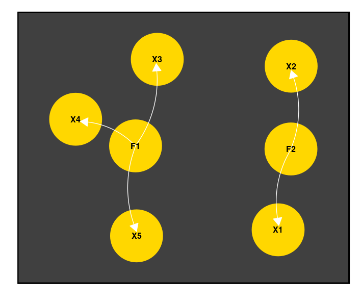

To estimate the above parameters, we assume that the variance of **each item has an intrinsic variance and a shared variance, which is determined by the latent factors**.
We used a covariance matrix between the items to estimate the weights of the latent factors. In addition, we estimated parameters related to the matrix diagonal (variances).
In our example, we would have a dimension matrix $[4x4]$.  

$$CovMat_{x} = \begin{pmatrix} 
. & . & . & .  \\ 
. & . & . & .  \\ 
. & . & . & .  \\ 
. & . & . & .  \end{pmatrix}$$

As we saw in chapter 2, each value is given by:  

$$Cov(X,X')=\sum_{i=1}^{N}(x_{i}-\mu_{x})(x_{i}'-\mu_{x'})$$  

The diagonal reflects the covariance of a variable with itself, the variance:


$$Cov(X,X)=\sum_{i=1}^{N}(x_{i}-\mu_{x})(x_{i}-\mu_{x})$$
$$=\sum_{i=1}^{N}(x_{i}-\mu_{x})^2$$
$$=Var(X)$$

For example, the covariance matrix for *iris*:  
```r
    > cov(iris[,1:4])
                 Sepal.Length Sepal.Width Petal.Length Petal.Width
    Sepal.Length    0.6856935  -0.0424340    1.2743154   0.5162707
    Sepal.Width    -0.0424340   0.1899794   -0.3296564  -0.1216394
    Petal.Length    1.2743154  -0.3296564    3.1162779   1.2956094
    Petal.Width     0.5162707  -0.1216394    1.2956094   0.5810063
    > var(iris[,1])
    [1] 0.6856935
```
Using matrix notation, either $X$ a matrix with $m=4$ columns of $n=150$ observations, the covariance matrix $Cov_{4 x 4}$ is:

$$Cov(X') = X'^{T}X'\frac{1}{n} = X'^{T}X'\frac{1}{150}$$
$X'$ is the matrix whose values were centralized by the average $x' = x - \mu$. So the product of $X$ by the transpose returns in each element $x_{ij}$ the value $\sum_{i}^{n}(x_{i}-\mu_{i})(x_{j}-\mu_{j})$. Easy to implement manually:  

```r    
    > iris2$Sepal.Length <- iris$Sepal.Length - mean(iris$Sepal.Length)
    > iris2$Sepal.Width <- iris$Sepal.Width - mean(iris$Sepal.Width)
    > iris2$Petal.Length <- iris$Petal.Length - mean(iris$Petal.Length)
    > iris2$Petal.Width <- iris$Petal.Width - mean(iris$Petal.Width
    > (t(as.matrix(iris2[,1:4])) %*% as.matrix(iris2[,1:4]))*1/150
                 Sepal.Length Sepal.Width Petal.Length Petal.Width
    Sepal.Length   0.68112222 -0.04215111    1.2658200   0.5128289
    Sepal.Width   -0.04215111  0.18871289   -0.3274587  -0.1208284
    Petal.Length   1.26582000 -0.32745867    3.0955027   1.2869720
    Petal.Width    0.51282889 -0.12082844    1.2869720   0.5771329

```

Based on the principles outlined, the solution desired by us is such that:

1. The covariance between measures is explained by combinations of shared latent variables. 

2.The data will be explained by a lower rank matrix. In our case:
 $\Lambda_{[n\times m]}, m < 4$.  

3. For each observation, we will have a latent score value of $F_{i}$ for each factor. The final value of an item is given by the individual contribution of each factor plus an individual variance. As we saw:  
$$x_{1,i} = \sum_{1}{n}F_{i}\lambda _{n} + \epsilon$$.

4. Each factor has an intrinsic variance, which we will estimate by adding a diagonal matrix $\psi$ to our weight matrix.

We estimate the parameters to maximize the probabilities (* Max. Likelihood *) of the values observed in $X$ given the equations.     
$$L(X^{T}X\frac{1}{n} | \Lambda , \psi)$$   

We determine the cost function by knowing $\Lambda$ and $\psi$:  
$$C \sim \Lambda \Lambda^{T} + \psi$$  

On what $\psi$ is a diagonal matrix with the same rank as $\Lambda$. As we saw earlier, the diagonal contains the variances, so the parameters in $\psi$ regulate the variance portion of items governed by factors $\lambda$.We say that the diagonal in $\Lambda \Lambda^{T}$ contains **communalities** (intrinsic variance).  

The optimization process to minimize errors is more complex than that of linear regression. The possible estimators here are many, none of them with a simple analytical solution or guarantee of convergence.

#### Similarities between dimension reduction techniques: EFA, probabilistic PCA, PCA, Autoencoder.

We can take into account the previous solution without a $\psi$ linked diagonal matrix:

$$Cov \sim \Lambda \Lambda^{T}$$  

This formulation is equivalent to Principal Component Analysis (PCA). Here, our weights will also estimate intrinsic variance. It is a computationally inexpensive method to reduce dimensions while preserving information. Mathematically, the difference between PCA and EFA lies in the fact that the latter estimates separately parameters for shared covariance and individual variance. A little-known 'intermediate' technique is the probabilistic PCA (PPCA), in which we take into account a simpler diagonal matrix. 

$$Cov \sim \Lambda \Lambda^{T} + \sigma^{2}I$$  

That is: an identity matrix with noise introduced through only one parameter ($\sigma^{2}$).  

A curiosity is that the diagonal ends up influencing less with the increase in the rank of the matrices. So, the result of the above techniques converges in situations with high dimensionality ($n \rightarrow \infty$). A more complete discussion can be found elsewhere (see references).  

In summary:  

  

.
$$PCA: Cov \sim \Lambda \Lambda^{T}$$  
$$PPCA: Cov \sim \Lambda \Lambda^{T} + \sigma^{2}I$$  
$$EFA: Cov \sim \Lambda \Lambda^{T} + \psi$$  
(Here, we use $\sim$ not to call resemblance, but rather that we will maximize the likelihood of $Cov$ with an expression depending on the terms on the right)

Also, neural networks of the *autoencoder* type have a similar formulation. Specifically, an auto encoder with an inner layer and certain restrictions on the activation function is identical to the PCA. However, we can use **more** dimensions than the input, in addition to multiple layers and nonlinear functions. In this way, we increase the power of the generative model, as well as being more vulnerable to overfitting.   

We will return to the subject when the focus is on environment models, information compression, generative models and reduction of dimensions.   

**Number of factors**

We haven't touched on a crucial point: what is the optimal number of factors? Is it better to use a model that takes into account *extroversion* or one that uses *sociability* and *expressiveness*?  

We can explain covariance using an arbitrary number of latent factors. The tendency is to observe improvement in performance indicators under the penalty of saturation (e.g. overfitting, difficult interpretability). There are established procedures to balance the explanatory power with simplicity of the model.  

n general, a minimum number of factors are sought that maximize the explanatory power. Considering degrees of freedom($df$) and model errors (statistical $X^2$), two popular indices are RMSEA and CFI. As in the calculation of $R^2$,the rationale is to dimension errors, but here we penalize the number of parameters.
  

Another widely used metric is to observe the influence of each factor on the covariance matrix.

By multiplying a vector by a matrix, we change its magnitude and direction.
 

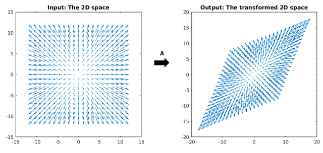

Vectors aligned with the matrix (e.g. those diagonal from the transformation above) only change in size after transformation.  

They are the eigenvectors of the matrix.  

One way of extracting factors is through the main axes. In this method, we decompose the original matrix into orthogonal vectors multiplied by scalars (auto-decomposition, *eigen / spectral decompositon*): eigenvalues and eigenvectors (axes).  

In general, the first axes have greater eigenvalues. There are several heuristics recommending methods for choosing numbers of factors by the size of the eigenvalues. One is to consider only eigenvalues greater than 1. Another is to consider the point on the curve where there is an apparent point of discontinuation ("knee").  

It is reasonable to think that eigenvectors associated with high eigenvalues capture a lot of information about the variance (individual and shared) of the items.
  

**Confirmatory factor analysis**

The processes described above are exploratory in nature. We seek the best fit for latent factors without first determining a structure. It is a good procedure for reducing dimensions and compressing information, however, if we want interpretability and scientific validity, there are some sensitive points.

Thinking about the elaboration of a scale to measure a personality trait, we return to Popper's argument (chapter 2) against inductivism. It is desirable that we have a previous model and testable hypotheses beforehand. Otherwise, it is easy to find a model offering a good fit in almost any case.
  

In confirmatory factor analysis, we make a direct restriction to the model. The parameters are predetermined based on a diagram (graph) expressed by the person who conducts the analysis. Thus, we can specify a relationship. In the diagram above, the first latent factor has loads in relation to items $X_{3},X_{4},X_{5}$ and the second factor with $X_{1},X_{2}$.  

In this case, the estimators will be a little more complex.

#### Structural equations

Structural equations are the *framework* covering any of the previous models, including graph topolologies and arbitrary relationships (e.g. non-parametric / probabilistic).  

Thus, we can draw a diagram of relationships between entities, declare relationships between measures and test the adequacy of the model. As we have seen, Judea Pearl sewed these quantitative methods on a coherent philosophical basis, making use of the concepts of counterfactual and hypothesis testing.
These models are useful in many fields to describe statistically multiple element relationships in a complex system. As always, we must be careful with the flexibility of the model. In particular, some recommended procedures are difficult to reconcile with a hypothetical-deductive basis (e.g. ad-hoc change of the model after observing modification indices).


#### Applications

The Big Five personality traits are constructs consistently found in the search for latent factors. They are: pleasantness, neuroticism, openness to experiences, conscientiousness, extraversion 

We will use data from https://openpsychometrics.org/. The BIG5 dataset has demographic data (age, gender, country) and 50 measurements on items from the International Personality Item Pool. The sample size is 19.719. We will do exploratory and confirmatory factor analysis through the **psych**, **sem** and **lavaan** packages. 

```r
   >system("wget http://openpsychometrics.org/_rawdata/BIG5.zip")
   (...)
   Resolving openpsychometrics.org (openpsychometrics.org)... 69.164.197.103
   Connecting to openpsychometrics.org (openpsychometrics.org)|69.164.197.103|:80... connected.
   (...)
   Saving to: ‘BIG5.zip’
   (...)
   2019-02-04 09:09:39 (624 KB/s) - ‘BIG5.zip’ saved [523351/523351]
   > system("unzip BIG5.zip")
   Archive:  BIG5.zip
   inflating: BIG5/codebook.txt       
   inflating: BIG5/data.csv      
   
   >library(psych)
   >library(lavaan)
   >library(sem)
   >bigf_data <- read.csv("BIG5/data.csv",sep = "\t")
   >names(bigf_data)
   [1] "race"    "age"     "engnat"  "gender"  "hand"   
   [6] "source"  "country" "E1"      "E2"      "E3"     
   [11] "E4"      "E5"      "E6"      "E7"      "E8"     
   [16] "E9"      "E10"     "N1"      "N2"      "N3"     
   [21] "N4"      "N5"      "N6"      "N7"      "N8"     
   [26] "N9"      "N10"     "A1"      "A2"      "A3"     
   [31] "A4"      "A5"      "A6"      "A7"      "A8"     
   [36] "A9"      "A10"     "C1"      "C2"      "C3"     
   [41] "C4"      "C5"      "C6"      "C7"      "C8"     
   [46] "C9"      "C10"     "O1"      "O2"      "O3"     
   [51] "O4"      "O5"      "O6"      "O7"      "O8"     
   [56] "O9"      "O10"    
```
Let's see what happens if we adjust a model with 5 latent factors:
  

```r
    >library(lavaan)
    >library(psych)
    >efa_big <- fa(bigf_data[,8:57],nfactors = 5)
    >efa_big
    (..)
    RMSEA index =  0.055  and the 90 % confidence intervals are  0.054 0.055
```
We observed a low value of RMSEA, which indicates a low magnitude of errors by degree of freedom. It is interesting to note that we do not indicate which items assess which factors (e.g. Items O1 and O2 are linked to opening up to experience). If the premises are correct, for each item, the solution found must indicate a high load in one factor and a low one in others.

That's what happens. Selecting estimates for three items in three groups. The factor with the highest load is marked with an asterisk.    

```r
    (...)
    Factor Analysis using method =  minres
    Call: fa(r = bigf_data[, 8:57], nfactors = 5)
    Standardized loadings (pattern matrix) based upon correlation matrix
          MR1   MR2   MR3   MR5   MR4   h2   u2 com
    E1   0.69*  0.04 -0.03 -0.01  0.00 0.46 0.54 1.0
    E2  -0.70* -0.08 -0.04  0.04  0.00 0.48 0.52 1.0
    E3   0.63* -0.17  0.16  0.09 -0.06 0.57 0.43 1.3
    (...)
    N1  -0.06  0.69*  0.10  0.05 -0.05 0.49 0.51 1.1
    N2   0.07 -0.50* -0.01 -0.09  0.05 0.26 0.74 1.1
    N3  -0.12  0.61*  0.20  0.10  0.01 0.43 0.57 1.3
    (...)
    A1   0.05  0.09 -0.44*  0.02 -0.07 0.20 0.80 1.2
    A2   0.28 -0.04  0.50* -0.05  0.06 0.41 0.59 1.6
    A3   0.17  0.27 -0.41* -0.15  0.10 0.27 0.73 2.6
    (...)
```
Extracting the solution:  

```r
    >efa_bigst <- structure.sem(efa_big) 
    >efa_bigst
           Path        Parameter Value
    [1,] "MR1->E1"   "F1E1"    NA   
    [2,] "MR1->E2"   "F1E2"    NA   
    [3,] "MR1->E3"   "F1E3"    NA   
    [4,] "MR1->E4"   "F1E4"    NA   
```
We have the factors (MR) and the nodes to which they are connected, discarding those of lesser magnitude / significance. We can adjust a confirmatory model from these specifications:

```r
    >big_sem <- sem(efa_bigst,S = cov(bigf_data[,8:57]),N = 19719)
    >summary(big_sem)
    (...)
    >sem.diagram(big_sem,main = "Big Five",e.size=0.05)
```
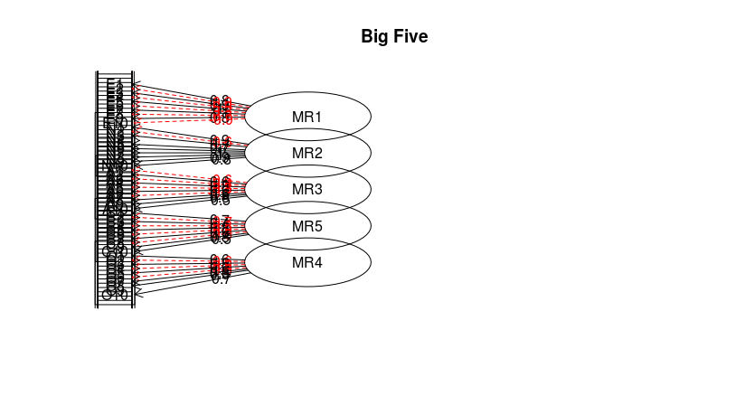

The lavaan package allows you to specify a larger family of models and is very popular for SEM in R. The syntax is:  

```r
    >model <- c(' 
    F1 =~ X1 + X2 + X3
    F2 =~ Y1 + Y2 + Y3')
    >lavaan (model,data,...)
```

#### References 

Wright, S. (1921). "Correlation and causation". J. Agricultural Research. 20: 557–585.

https://stats.stackexchange.com/questions/123063/is-there-any-good-reason-to-use-pca-instead-of-efa-also-can-pca-be-a-substitut
https://steemit.com/steemstem/@dexterdev/linear-transformations-a-20-sbd-coding-contest-announcement

\pagebreak

#### Exercises

1. Examine the VIF of the multiple regression used in the mediation process with database *bh1996*.
*Is there a collinearity between mediator and main predictor?
  
  
2.Examine the performance change (e.g. $R^{2}$) after inclusion of the mediator in the model.
   * If the mediator variable $M$ explain the same causal pathways as the predictor variable $X_{1}$, is this change expected to be big? Argue.  

3. Using data of your choice:
   * Adjust a simple linear regression
   * Add another predictor (multiple linear regression)
   * Check for collinearity
   * Check other assumptions by looking at auxiliary material **/ aux** (e.g. independence from errors with Durbin-Watson)
   * Test a mediation relationship using 3 variables  

4. Using the data *iris*:  
  * Choose two correlated measures and check if the species *moderates* the relationship between them. Remember: you must add an interaction term `var1 * var` to the regression formula.  
 * Perform **(1)** principal component analysis (PCA) and **(2)** exploratory factor analysis (EFA) for numerical variables.  
  * Extract **(1)** the projection of each observation in the first two components, $PC_{1}, PC_{2}$, and **(2)** the score generated from each factor. The `princomp` function returns an accessible object `$scores`. 
  * Check the correlation between both.  
  
\pagebreak
