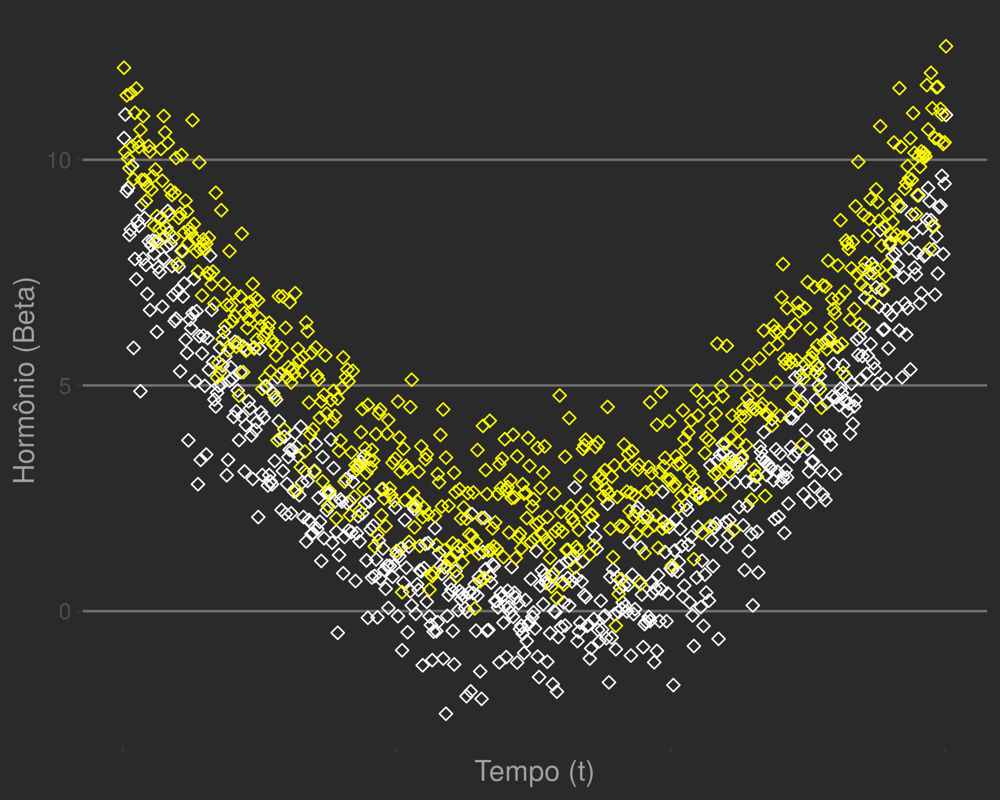
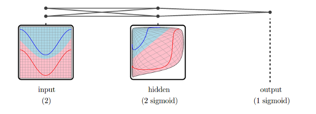

---
output:
  pdf_document: default
  html_document: default
---
  

# Chapter 5: Neurons

In March 2016, the AlphaGo software won over a Go master. Invented over 2,500 years ago, the game motivated advances in mathematics. Exist $2,08*10^{170}$ valid ways to arrange the pieces on the board. The Chinese polymath Shen Kuo (1031–1095) came to a close result $10^{172}$ centuries ago. It is worth remembering that the number of atoms in the observable universe is $10^{80}$.  

In the previous chapter, we learned basic formulations of a predictive model with regression. Here, we will know the first intelligent machine in history implementing a *perceptron*. It is capable of handling more dimensions (e.g. image processing). Closed solution estimators do not exist as in linear regression, so we use local information to 'walk' (*gradient descent*) towards a minimum.  

We will extend our toolbox to cover more complex, non-linear relationships. By chaining together simple neurons, we can learn complex signals without appealing to complex, intractable, or overly flexible functions.   

\pagebreak 

## Rosenblatt's perceptron 

Frank Rosenblatt (1928 - 1971) was born and died on July 11, but this is not the most curious fact of this psychologist's biography. He was responsible for the development of the first artificial neuron. In his words, the first non-biological object to recreate an organization of the external environment with meaning.

*It can tell the difference between a cat and a dog, although it wouldn't be able to tell whether the dog was to the left or right of the cat. Right now it is of no practical use, Dr. Rosenblatt conceded, but he said that one day it might be useful to send one into outer space to take in impressions for us. - New Yorker, December, 1958*[^22]  

The apparatus reproduced the understanding of the time about the functioning of a neuron. The body receives signals from dendrites and, after hidden processing, produces an output in the form of an electrical signal through the axon. The first mathematization would come from the McCulloch & Pitts model ("A Logical Calculus of the Ideas Immanent in Nervous Activity", 1943).  

  

  

In 1949, Donald Hebb described in his classic *The Organization of Behavior* a plausible mechanism for learning. Commonly expressed in the maxim "Cells that fire together wire together" (cells that fire together, connect to each other).  

In order to create a machine that could process inputs directly from the physical environment (eg light and sound), Rosenblatt conceived an elegant extension of the model in 1957 ("The Perceptron [*from Latin, percipio, to understand"*] - a perceiving and recognizing automaton. Report 85-460-1, Cornell Aeronautical Laboratory "). Composed of three parts: the S (sensory) system; the system A (association) and the system R (response).
The McChulloch & Pitts crude "logical" neuron was modified in order to process inputs by weights prior to output. Learning takes place by changing these weights.
 

  

Initially, the perceptron was simulated on an IBM 704 (also the cradle of the FORTRAN and LISP languages). Then, implemented as a physical device, named Mark I Perceptron. [^ 23] A more in-depth study was published by him in 1962 (Principles of neurodynamics).  


[^ 22]: He can tell a cat from a dog, even though he can't tell if the dog was on the cat's left or right. At the moment, it has no practical use, Dr. Rosenblatt admitted, but said that one day it could be useful to send an [apparatus] to space to capture impressions for us.
[^ 23]: Mark I is a title commonly used for the first version of a machine.


\pagebreak 

Rosenblatt starred in heated debates about artificial intelligence in the scientific community with Marvin Minsky, a friend of his adolescence. In 1969, Minsky and a mathematician (Seymour Papert) published a book centered on Perceptron (Perceptrons: An Introduction to Computational Geometry). In it, they proved that the artificial neuron was unable to solve non-linear XOR-type problems. For an eXclusive OR (OR eXclusive) problem, the neuron must fire on stimulus A or stimulus B, but not on both.  

The impact was devastating on the current optimism and a period of 10 years of very low production passed, known as the 'dark age' of connectionism. The resumption of artificial neurons took place only in the 1980s. Unfortunately, Rosenblatt died prematurely in 1972 in a boat accident, not seeing the revival of perceptrons.  

Knowing the origins of the model, it is curious that most courses introduce perceptrons from a purely mathematical point of view, pointing out the similarity with neurons as mere curiosity. On the contrary, inspiration in biological neurons and subsequent success in the assigned tasks speaks in favor of a fantastic case of success via reverse engineering.
  

\pagebreak

## Creating neurons

Mark I was created for visual recognition and can be considered a grandfather of computer vision.
It had a photosensitive input field of 20x20 (400) Cadmium Sulphide cells, the S units. When reacting with light, CdS emits an electron:
$$CdS + \gamma \rightarrow e^{-} + CdS^{+}$$

If the cell is activated, it sends the electronic signal to an intermediate unit A. The intermediate unit, in turn, transmits an electronic signal to the output. **The signal strength is regulated by previous successes** in order to adjust the signal for the correct classification. The physical apparatus mimics the mathematical model of the **classifier**.  

A luminous signal excites each field differently, activating cells according to the amount of light captured. Mathematically, we represent each light-sensitive neuron as a cell in the input matrix. 


The digit above ('$1$') is in an image with 14 x 14 pixels (196 values between: 1, black; and 0, white). These pixels can be stretched and viewed as a matrix $X$ of dimension $[196 x 1]$ with values between 0 and 1 in each element.
Let's simulate a similar image:  

```r
    >library(magrittr)
    >set.seed(2600)
    >my.image.data <- c(0,0,0,0,0,0,0,0,0,0,0,0,0,0,
                   0,0,0,0,1,.9,.6,1,0,0,0,0,0,0,
                   0,0,0,0,1,0,1,1,0,0,0,0,0,0,
                   0,0,0,0,0.9,0,1,1,0,0,0,0,0,0,
                   0,0,0,0,0,0,1,1,0,0,0,0,0,0,
                   0,0,0,0,0,0,1,1,0,0,0,0,0,0,
                   0,0,0,0,0,0,1,1,0,0,0,0,0,0,
                   0,0,0,0,0,0,.7,1,0,0,0,0,0,0,
                   0,0,0,0,0,0,1,1,0,0,0,0,0,0,
                   0,0,0,0,0,0,1,1,0,0,0,0,0,0,
                   0,0,0,0,0,0,1,.9,0,0,0,0,0,0,
                   0,0,0,0,0,0,0,0,0,0,0,0,0,0,
                   0,0,0,0,0,0,0,0,0,0,0,0,0,0,
                   0,0,0,0,0,0,0,0,0,0,0,0,0,0) %>% 
   matrix(.,14,14,byrow=T)
    > image(t(my.image.data[14:1,]), axes = FALSE, col = grey(seq(1, 0, length = 256)))
```


Here is our image [14x14]. The computer reads the values between 0 (white) and 1 (white), providing us with the corresponding visual signal in a color palette. Here we use 256 gray tones.   

In multiple linear regression, we calculate a weight $\beta_{i}$ for each variable. The rationale is similar: we weight each pixel by its respective weights $w_{i}$. In analogy, each image is an observation of 196 variables.  

## Classification  

In the linear regression task, the output should be a real number $Y \sim \beta * X$ with $X,Y \in \mathbb{R}$, such as the average number of professionals or life expectancy. We will use perceptron for another task, classification, in which the possibilities of exit are **categories**. That is, the output is *discretized*, usually in a binary set (e.g. $\{ -1,1\}$ or $\{ 0,1\}$) which signals belonging to the class.
In our notation, the neuron must fire (output $y=1$) if you recognize an object or remain at rest ($y=-1$) if not.  

Algebraically, it is a multiplication of the matrices between image $x_{j}$, of dimension $[196 x 1]$ by an array $W_{[196 X 1]}$ which brings *i* weights (**w ***eights*) estimated for each pixel for each class. This formulation is identical to that made in linear regression. For a discrete output, we force the result to +1 or -1 with an activation function $(\phi)$. O output linear $W^{T}X$ é transformado:  

$$y = \phi(W^{T}X)$$

Thus, the product $W^{T}X$ it must have a value proportional to the probability of activation: if the input belongs to the class, the result must be high.  

We will use the function *Heaviside step*:  
$$\phi(x)= \begin{cases}
  +1 \quad se \quad x \geq 0\\
  -1 \quad se \quad x < 0
  \end{cases}$$
  


In R:  
```r
    # Heaviside
    >phi_heavi <- function(x){ifelse(x >=0,1,-1)}
    # Starting weights based on normal distribution
    >my_weights <- rnorm(196)
    >w <- matrix(my_weights,196,1)
    # Multiplication using the operator %*%
    >as.vector(my.image.data) %*% w
    # Score
            [,1]
    [1,] -0.3794718
    # Activation function
    >as.vector(my.image.data) %*% w %>% phi_heavi
         [,1]
    [1,]   1
```

For the example above, our neuron with random weights was activated for the stimulus containing the '$7$'.
Initially, we established random weights from a normal distribution (`my_weights <- rnorm(...)`). 
The process of training the classifier is to observe the responses many examples of images $x_{i}$, changing the values of $W$ so that the highest scores are those of the correct classes. So, neuron just fires $y=1$ when faced with the proper stimulus.  

The training process is quite simple:
Be $x_{i_{j}}$ or $i$-th pixel of observation $j$. And $w_{0}$ the initial corresponding weight, the updated weight, $w'$ is:
$$w' = w_{0} + \Delta w$$  
On what $\Delta w$ indicates the magnitude and direction of the change in weight.
Let us accept, for now, the formula:
$$\Delta w_{i} = \eta (score{j} - output_{j}) x_{i}$$

On what $x_{i_{j}}$ is the value of $i$-th pixel, $w_{i}$ is the $i$-th weight and $\eta$ a constant called *learning rate*, which determines the size of the increments made by the algorithm. We will show the derivation of this equation below.  

\pagebreak

#### Auto MaRk I

Using the abstractions above, we coded our R perceptron, Auto MaRk I.
**Arguments:** Examples ($x$, real numbers vector) and expected states ($y$, shoot = 1 vs. do not fire = -1) must be the same size.
**Eta:** Number specifying learning constant.

Auto MaRK I initializes a random weight for each entry and, also in a random order, cycles through the examples updating the weights.  

```r
    >mark_i <- function(x, y, eta) {
      # initializes random weights of normal distribution
      w <- rnorm(dim(x)[2]) # number of weights = number of columns in x
      ypreds <- rep(0,dim(x)[1]) # initializes predictions at 0
         # Processes the observations in x at random
        for (i in sample(1:length(y),replace=F)) { 
          # prediction
          ypred <- sum(w * as.numeric(x[i, ])) %>% phi_heavi 
          # update em w
          delta_w <- eta * (y[i] - ypred) * as.numeric(x[i, ]) 
          #note: x[i,] will be multiplied as a matrix (dot product)
          w <- w + delta_w
          ypreds[i] <- ypred # save current prediction
        }
      print(paste("Weights: ",w))
      return(ypreds)
    }
```

We will test it for the proposed problem, separating *setosa* from *versicolor* flowers. Data preparation:  

```r
    >train_df <- iris[1:100, c(1, 2, 5)]    
    >train_df[, 4] <- -1
    >train_df[train_df[, 3] == "setosa", 4] <- 1    
    >names(train_df) <- c("s.len", "s.wid", "species","target")
    >head(train_df)
          s.len s.wid species target
    1   5.1   3.5  setosa      1
    2   4.9   3.0  setosa      1
    3   4.7   3.2  setosa      1
    4   4.6   3.1  setosa      1
    5   5.0   3.6  setosa      1
    6   5.4   3.9  setosa      1
    > train_df[60:65,]
       s.len s.wid    species target
    60   5.2   2.7 versicolor     -1
    61   5.0   2.0 versicolor     -1
    62   5.9   3.0 versicolor     -1
    63   6.0   2.2 versicolor     -1
    64   6.1   2.9 versicolor     -1
    65   5.6   2.9 versicolor     -1
    >x_features <- train_df[, c(1, 2)]
    >y_target <- train_df[, 4]
```
And then, we can activate it:  

```r
    >y_preds <- mark_i(x_features, y_target, 0.002)
    [1] "Weights:  -0.117938333229087" "Weights:  0.212055910242074" 
    > table(y_preds,train_df$target) # matriz de confusao
    y_preds -1  1
          -1 27  5
           1  23 45
    > y_preds
      [1]  1  1  1  1  1  1  1  1  1  1  1  1  1  1  1  1  1  1  1  1  1  1  1  1
     [25]  1  1  1  1  1  1  1  1  1  1  1  1  1  1  1  1  1 -1  1  1  1  1  1  1
     [49]  1  1 -1  1  1 -1  1 -1 -1  1  1  1 -1  1 -1  1  1  1  1  1  1  1 -1 -1
     [73]  1 -1 -1  1 -1 -1  1  1 -1  1 -1  1  1  1  1  1  1 -1  1  1 -1  1 -1  1
     [97] -1  1  1 -1
```
Using $\eta = 0.002$, we got $72 \%$ accuracy (correct classifications, diagonal in the confusion matrix). We can modify the learning rate. With $\eta = 0.05$, stay with $51\%$. With $\eta = 0.1$, we have $60\%$. Considerable accuracy compared to expected with guesswork. However, these solutions are not stable and repeated passages generate very different predictions. 

```r    
    > y_preds <- mark_i(x_features, y_target, 0.05)
      [1] "Weights:  -1.26323926081935" "Weights:  1.85983709987067"     
    > table(y_preds,train_df$target)  
    y_preds -1  1    
      -1 35 16    
      1  15 34
    
    > y_preds <- mark_i(x_features, y_target, 0.1)
      [1] "Weights:  -1.83248546552824" "Weights:  3.19075461158561"  
    > table(y_preds,train_df$target)    
    y_preds -1  1    
      -1 31 21    
      1  19 29
    
    > y_preds <- mark_i(x_features, y_target, 0.01)
    [1] "Weights:  -0.250410476080629"
    [2] "Weights:  0.447470183281492" 
    > table(y_preds,train_df$target)    
     y_preds -1  1    
    -1 25 27    
    1   25 23
```
What's "wrong" with our estimator?

During the exhibition, the following rule helped us, but it was not explained.  
$$\Delta w_{i} = \eta (score{j} - output_{j}) x_{i}$$

Before, we verified (Chap. 2) a closed solution to the regression problem, in which the best estimate for the slope of the line, $\beta$, could be calculated directly.
Perceptron updates its weights recursively, learning a little ($\Delta w_{i}$) with each example. A new stimulus determines how much (magnitude in $\Delta {w}$) and in what direction ($+$ or $-$) a weight must change to decrease errors.  


### Gradient Descent for Perceptron

When optimizing estimates, we focus on finding maximums or minimums for defined spaces. In general, these are surfaces describing the size of the errors as a function of the weights adopted by the model. Our goal is to find the *lowest* location. For very uneven surfaces, we accept a sufficiently *low* point.  

In linear regression, the space is known, it is possible to go to the lowest point directly. For other models, this is not so simple.   
$\Delta w_{i}$ can be obtained using the concept of *Gradient Descent*.
The process is like going down a hill *blindfolded*. We can only know the local inclination (difference between left foot and right foot). We can go down taking steps towards the lowest foot.
What we need then is the slope of the surface related to errors as a function of weights.  

Taking into account each $j$-th observation, we first define a loss function $L$ expressing the sum of errors in $n$ examples.   
$$L=\sum_{j}^{n}E(score_{j},output_{j})$$  
We will use the Euclidean distance between the desired score and the output for our error function. The desired score is the optimal response and the output is a product between weights and input:  
$$E = d_{eucl.}(score_{j},output_{j}) = (score_{j} - output_{j})^{2}$$

This function describes the surface in terms of errors using a quadratic relationship: erring upwards has the same weight as erring downwards and extreme errors are magnified ($x^{2}$) polynomially.  

The process involves implementing an error function between network results and a virtual space for optimal scores. The success of the training depends on a correspondence between the chosen distance function and the actual distance in the space in which the data was generated. We don't know if that reflects reality. In the example, each pixel reflects a signal from 0 to 255.
The figure below shows the correspondence between measurement values and visual scale.   
  

Intuition for sensitivity to light can be perceived in a continuous interval between total incidence of light (extreme values of white, measure: 255) and total absence (extreme values of black, measure: 0). Assuming that we can assign a label to each shade of gray and that this set is sortable by * clarity *, we say that there is isomorphism of order between the sets. This implies that the eulidian distance must work reasonably in our measurements as in real numbers $\mathbb{R}$.  

\pagebreak

It remains to be seen whether the projection of the observations is linearly separable. It is intuitive for human beings to know which problems will be separable: just imagine the task of differentiating types of images with a ruler on a black and white screen.  

*If the data are linearly separable*, the algorithm converges with a sufficient number of examples. Using *iris*, it would work to separate *setosa* flowers from another class, but we would not have good results separating virginica from versicolor.  

```r
    >ggplot(iris,aes(x=Sepal.Length,y=Sepal.Width,color=Species))+
    geom_point(shape=5)+ geom_abline(slope = 0.92,intercept = -1.9,color="mediumorchid1")+ 
    scale_colour_manual(values = c("yellow", "springgreen", "deepskyblue"))+
    theme_hc(style = "darkunica")
```


To find out the minimum $L$, we will find poles using partial derivatives. Or, its equivalent for functions of multiple variables (multidimensional spaces), the gradient ($\nabla$). 

For each observation $x_{j}$, the partial derivative of the loss function in relation to a weight $w_{i}$ expresses the rate of change in the global error as a function of that weight. 
$\frac{d}{dw_{i}}L(w_{i}) = \frac{d}{dw_{i}} \frac{1}{n}\sum_{j}{n}E(score_{j},output_{j})$ 

We then know whether to adjust the weight up or down, as well as the magnitude of the step. Algebraically, we will modify $w$ following the inverse of the gradient. The learning rate is a hyperparameter that artificially regulates the size of this step:  
$$\Delta w_{i} = - \eta \frac{dL}{dw_{i}}$$
$$= - \eta \frac{d}{dw_{i}}\frac{1}{n}\sum_{j}^{n}E(score_{j},output_{j})$$  
Remembering that the error is given by the Euclidean distance:  
$$= - \eta \frac{d}{dw_{i}}\frac{1}{n}\sum_{j}^{n}(score_{j} - output_{j})^{2}$$.  

We do $f(x) = (score_{j} - output_{j})$ e $g(x) = x^{2}$, so that
$$L = \frac{1}{n}\sum_{j}^{n} E(score_{j}, output_{j}) = (g \circ f)$$  
$$= \frac{1}{n}\sum_{j}^{n} (score_{j} - output_{j})^{2}$$  

We can solve $\frac{d}{dw_{i}}L$ applying the chain rule $$(g \circ f)' = (g'\circ f)f'$$ and the 'tumble rule' for derivatives of polynomials $(\frac{d}{dx}(x^{n})=nx^{n-1})$.  

So,
$$f' = \frac{d}{dw_{i}}(score_{j} - output_{j})$$
The output is given by the scalar product between weights $w_{j}$ and entries $x_{j}$:  
$$f'=\frac{d}{dw_{i}}(score_{j} - w_{j} \cdot x_{j})$$
The desired score does not depend on the weights, so the first derivative is 0.  $$f' = 0 - \frac{d}{dw_{i}} w_{j} \cdot x_{j}$$
$$=-\frac{d}{dw_{i}}\sum_{i,j}^{n} w_{i,j}*x_{i,j}$$
$$= =-\frac{d}{dw_{i}}(w_{0}*x_{0}+...+w_{i}*x_{i}+w_{n}*x_{n})$$  
Terms not dependent on $w_{i}$ are also zeroed and we are left with the first term of the sum:  
$$f'=- \frac{d}{dw_{i}} w_{i}x_{i}$$  
The function to be derived now describes a linear relationship (polynomial of degree 1) in $w_{i}$ and have:
$$f'= (-x_{i,j})$$

Knowing $f'$, we look for the other term in $(g \circ f)'$:
$$(g \circ f) = (score_{j} - output_{j})^{2-1}$$
$$(g'\circ f) = 2(score_{j} - output_{j})^{2-1}$$

$$= 2(score_{j} - output_{j})$$

Finally, the partial derivative of the loss function for the i-th weight $w_{i}$ is:

$$\frac{dL}{dw_{i}} = \sum_{j}^{n}\frac{d}{dw_{i}}(score_{j} - output_{j})^{2}$$.  
$$= \sum_{i,j}^{n} 2(score_{j} - w_{j} \cdot x_{j}) (-x_{i,j})$$

To simplify the expression and establish the size of the increments on the weights, we scale by a constant, given by $-\frac{1}{2} \eta_{0}$:  
$$-\frac{1}{2}*\eta_{0} \frac{dL}{dw_{i}}=-\frac{1}{2}\eta_{0}*2(score_{j} - output_{j}) (-x_{j})$$
$$\Delta w_{i} = \eta_{0} \sum_{j}^{n} (score_{j} - w \cdot x)(x_{j})$$
And $\eta_{0}$ is a [hyper] parameter that simplifies the equation and defines the size of the increments used.  


As we implemented in Auto MaRK I.  
```r
    (...)
    ypred <- sum(w * as.numeric(x[i, ])) %>% phi_heavi 
    delta_w <- eta * (y[i] - ypred) * as.numeric(x[i, ]) #<--------------------
    w <- w + delta_w
    (...)
```

We call $\eta$ hyperparameter. The choice of values for hyperparameters is one of the challenges in statistical learning. Repeating the learning with *iris*, let's test: 

```r
    > y_preds <- mark_i(x_features, y_target, 0.01)
    [1] "Weights:  -0.0153861618736636" "Weights:  0.0812191914731158"
    > table(y_preds,train_df$target)
      y_preds -1  1
          -1 25 27
          1  25 23    
    >  y_preds <- mark_i(x_features, y_target, 0.01)
    [1] "Weights:  -0.685141728446126" "Weights:  1.03174770234754"  
    > table(y_preds,train_df$target)
      y_preds -1  1
           -1 47 10
           1   3 40
    > y_preds <- mark_i(x_features, y_target, 0.01)
    [1] "Weights:  -0.193515893657872" "Weights:  0.180589056542887" 
    > table(y_preds,train_df$target)
      y_preds -1  1
           -1 19 37
           1  31 13
    > y_preds <- mark_i(x_features, y_target, 0.01)
    [1] "Weights:  -0.0672147799277951" "Weights:  0.115145797950982"  
    > table(y_preds,train_df$target)
      y_preds -1  1
           -1 45 12
           1   5 38
```

Using $\eta = 0.01$, we have $48\%$. However, running repeatedly returns very good ratings ($\text{Acc.} > 0.8$) or very bad. What is up?  

In general, large steps make fine adjustments impossible and may not converge, just as it is impossible for a large animal to explore a narrow valley.
Small fees take longer ($n$ observations) to reach a minimum. If the space is irregular, there is also a greater chance of reaching a secondary minimum instead of the bottom of the space. Just as a small animal travels the path more slowly and may have the illusion that it has reached lows quickly.  

A trivial way is to test many possible values and observe performance, however this is not feasible for large volumes of data and / or many parameters. There are several heuristic processes and algorithms for finding optimal values. We can also adjust parameters throughout the learning process or test different starting points.

A popular way to optimize training is to partition the dataset into pieces and present the partitions (epochs) repeatedly to the classifier or to accumulate epoch errors instead of individual examples. Thus, we calculate aggregate errors and avoid local minimums.
To avoid a lot of changes and to go in circles, we move for longer in only one direction before recalculating the route. Epochs can be recombined and / or resubmitted, artificially increasing the $n$ to calculate gradients.  

## Deep learning


**Intuition**

With learning through examples, we optimize our classifier (changing weights $W$) to minimize the loss gradually. One of the conditions for the * perceptron * above to work was the linear separability of classes in the examined space.
Some problems are more difficult, being separated by curves. Others are even more difficult, requiring many transformations and specific functions. An alternative is to use higher order polynomials. 
Rather than $Y \sim \beta_{0} + \beta_{1}X$, we can introduce terms with greater exponents in $X$: $$Y \sim \beta_{0} + \beta_{1}X + \beta_{2}X^{2} + \beta_{3}X^{3} + ...$$
Inclusion makes the function more flexible, which can be better suited to the data.
In linear regression, we adjust the angle and height of a fixed bar to reduce the distance to the points. With quadratic terms, it is possible to bend this bar in relation to the center, but the ends must go in the same direction. With cubic terms, this is made more flexible.
   


The introduction of polynomial terms of a higher order makes it considerably more difficult to optimize the estimates.  

A neuron *linearly sensitive* to input and equipped with a barrier (*thrsehold*) for firing is able to solve simpler classification problems. For more difficult problems, instead of implementing radically different and / or more complex processing cells, nature uses an ingenious device. Common neurons are chained together: simple calculations and local communication of the units make learning possible.  

The data is presented to the perceptrons on the front lines. The output of the first cells is used as input for neurons in the next layer.
Thus, we were able to implement suitable transformations (rotations, twists, scalings, folds) in sequence, so that complex abstractions can be captured.  

### Going Deep

The actual versions of most concepts created by humans are not identical to each other. In other words, there is no rigid set of rules for classifying most entities around us.
Many entities are different, but similar enough to belong to the same category.

  

All are naturally recognized as felines, but vary in size, color and proportion throughout the body. This is an interesting and ancient problem, best known in the idea of Platonic entities, which capture the essence of a concept.
Some contemporary philosophers take human abstractions as instances of a more generic concept: biological maps contained in neural networks. A brilliant exhibition is made by Paul Churchland in *Plato’s Camera*.
These maps are associated in a hierarchical way. Numerous patterns at lower levels and less of them at higher layers.
In the case of vision, superficial neurons pick up luminous points. The pattern of sensory activation captured on the strip and sent to the primary visual cortex is the first map, which is twisted and filtered up the path.
At higher levels, individual signals from sensitive cones of energy make up the color palette we perceive.  

  

Intermediate neurons have configurations that identify simple characteristics: eyes and subcomponents of the face. Finally, we have deeper layers, linked to complex abstractions and higher functions (e.g. language).


### Deducing surfaces

A classifier must capture this abstract structure from treatable mathematical models. To examine this aspect, let us use an example. The graph below represents thousands of samples with: (1) the natural daily testosterone curve (white) and the curves for measurements using anabolic steroids (yellow).

```r
    >normal <- (purrr::map(seq(-3,3,0.01), .f =function(x) x^2) %>% 
    as.numeric)+ rnorm(601)
    >over <-  (purrr::map(seq(-3,3,0.01), .f =function(x) x^2+2) %>% 
    as.numeric)+ rnorm(601)
    >horm_df <- data.frame(norm = normal, ov = over,time=1:601)
    >ggplot(data=horm_df,aes(y=norm,x=time))+
    >  geom_point(color="white",shape=5)+
    >  geom_point(data=horm_df,aes(y=over,x=time),color="yellow",shape=5)+
    >  ylab("Hormone (Beta)")+xlab("Time (t)")+
    >  scale_x_continuous(labels=NULL)+
    >  theme_hc(style="darkunica")
```




As hypothetical members of an athletic committee, our goal here is, given a sample, to find out if the athlete is on steroids.
When we experiment, there will normally be noise (errors) in the measurement and we will receive inaccurate measurements of the curve. Variations in that day's diet, urination, sweating, stress and other factors. We know that testosterone fluctuates daily following a curve.


For each measure, we have the time ($t$, horizontal axis) and the hormonal level ($\beta$, vertical axis). 


A very popular model for classifications is that of logistic regression. In it, we estimate probability for an event based on the probabilities of a sigmoid function. We have a probability (value between 0 and 1) defined by:
$$P(h,\beta) = \frac{1}{1+e^{-(i + t * h + \beta * y + \epsilon )}}$$
$\epsilon$ represents the error and i is a constant.

The equation seems strange, but it appears when we try to calculate probabilities from a linear combination of our parameters:
$$P(x) \sim i+t*x+\beta_{i}*y+\epsilon$$  
This allows the estimation process to be almost identical to that of linear regression, which is easily treatable.

In an R line:

```r
    >class_df <- class_df <- data.frame(measures=c(horm_df$norm,horm_df$ov),
    time=c(horm_df$time,horm_df$time),
    target=c(rep(0,601),rep(1,601)))
    >logist.fit <- glm(target ~ measures + time, family=binomial,data=class_df)
```

Another consequence is that a linear relationship makes the magnitude and meaning of these relationships interpretable. For example, a positive parameter (e.g. $\beta=0.241$) indicates that increases in  $\beta = -0.9517$) have the opposite effect. Many health risk assessments or finance credit assessments estimate probabilities based on the parameters of a logistic regression.
  

We use a *decision boundary* dependent on linear relationships. Technically, a hyperplane. A hyperplane divides the space into two parts. It is the plane generalization (zero curvature) for any dimensions. The hyperplane is a $n-1$ space in a $n$ dimensions space. The line is a two-dimensional hyperplane (our case), the traditional plane is a three-dimensional hyperplane. For higher dimensions, viewing is less simple.

For our nonlinear example, it would be difficult to capture the differences between doped athletes using just this equation.  


Above, a sigmoid neuron, which is equivalent to logistic regression. It is like the previous plan, but seen from above, we divided it into two regions for classification. Why? The linear classifier optimizes your responses taking into account only the absolute value of the hormonal measure. That is, values above a limit will be considered dopping, not considering time.  

The coefficient for the estimated time tends to be close to 0. When trying to divide the groups with a ruler, it is best to try a straight line parallel to the axis $x$.  
We can verify this directly through the parameters estimated in our regression model.
Changing this would make the dividing line inclined with respect to the x-axis, worsening the classification for low or high values.  

```r
    > summary(logist.fit)
         Call:
     glm(formula = target ~ measures + time, family = binomial, data = class_df)     
     Deviance Residuals: 
          Min        1Q    Median        3Q       Max  
     -1.93641  -1.02791  -0.07236   1.12396   1.63490       

     Coefficients:
                   Estimate Std. Error z value Pr(>|z|)    
     (Intercept) -9.439e-01  1.504e-01  -6.276 3.48e-10 ***
     measures     2.411e-01  2.186e-02  11.027  < 2e-16 ***
     time        -2.597e-05  3.621e-04  -0.072    0.943    
     ---
     Signif. codes:  0 ‘***’ 0.001 ‘**’ 0.01 ‘*’ 0.05 ‘.’ 0.1 ‘ ’ 1     

     (Dispersion parameter for binomial family taken to be 1)     

         Null deviance: 1666.3  on 1201  degrees of freedom
     Residual deviance: 1526.0  on 1199  degrees of freedom
     AIC: 1532     

     Number of Fisher Scoring iterations: 4
    > prob <- predict(logist.fit,type=c("response"))
    > class_df$prob <- prob
    > curve <- roc(target ~ prob, data = class_df)
    > curve
     Call:
     roc.formula(formula = target ~ prob, data = class_df)     

     Data: prob in 601 controls (target 0) < 601 cases (target 1).
     Area under the curve: 0.6964
```
### Who can help us?

We went back to neural networks to solve the problem. When we process the signal in stages, each layer modifies the data for the subsequent layers, transforming and filtering / shaping.

The intermediate layers allow for the gradual transformation of the signal, and the system gets it right using only two simple classifiers (sigmoids). In the example above, we have a layer of 2 neurons between the input and the output.
  



Now, the first layer (hidden) modifies the entry with two sigmoid units and the second layer can classify correctly using only one line, something that was impossible before.
In theory, this model can better capture the characteristics that generated the data (hormonal fluctuation throughout the day).  

### Neurons

Note that the diagram above resembles a neural network. This type of classifier was inspired by the microscopic organization of real neurons and its functioning is believed to be somewhat analogous. The convolutional neural networks architecture, state of the art in image recognition, was inspired by the visual cortex of mammals [^ 25].
Other bio inspired models (Spiking neural networks, LTSMs ...) present unprecedented performances for complex and poorly structured tasks, such as speech recognition and text translation.
The most accepted theory is that the neural machinery of animals was designed by evolutionary processes, such as natural selection. Thus, it presents colorful forms of complexity depending on the task performed.

[^25]: (https://www.ncbi.nlm.nih.gov/pmc/articles/PMC1557912/)  


As we can see, biological networks are complex, with up to tens of billions of parallel processing units connected. The highlighted zone has an isomorphic graph to that described in the text.

In deep (deep) face recognition models, surface layer neurons capture edges, angles and vertices, intermediate layers detect the presence of eyes, mouth, nose. Finally, layers at the end of the architecture decide whether it is a face or not and who it belongs to.

#### Efficiency and applications

We can formally demonstrate that a neural network with only one inner layer is capable of approximating any function. The proof is not there, since, in the end, what we do is create a lookup table for the input and output values using neurons.
In practice, it is difficult to obtain good performances. So difficult that neural networks have also been forgotten decades. If you run the model below, based on our example, you will see that accuracy is close to logistic regression. It takes some knowledge and time to fine tune the details.
It usually depends on the quality and quantity of the data. The boom came with the discovery of network topologies specifically good for certain tasks (e.g. LSTM for natural language, *Conv Nets* for computer vision).
In other words, modeling a neural network for unprecedented problems can be challenging.  

The following code shows how to implement a network with a similar topology using lib **caret**. We achieved 81% accuracy using 5 neurons.  

```r
    # Neural Net para o exemplo
    >library(caret)
    > class_df$time_sc <- scale(class_df$time)
    > nn_horm <- caret::train(x = class_df[,c(1,5)], y=factor(class_df$target),method="mlp")
    Multi-Layer Perceptron     

    1202 samples
       2 predictors
       2 classes: '0', '1'     

    No pre-processing
    Resampling: Bootstrapped (25 reps) 
    Summary of sample sizes: 1202, 1202, 1202, 1202, 1202, 1202, ... 
    Resampling results across tuning parameters:    

      size  Accuracy   Kappa    
      1     0.6488305  0.2948640
      3     0.8181583  0.6355261
      5     0.8198874  0.6393824    

    Accuracy was used to select the optimal model using the largest value.
    The final value used for the model was size = 5.
```
Neural networks spent some time forgotten, until some twists [^ 26] allowed the effective training of these networks. Algorithms to improve training, as well as economical or especially good architectures in certain tasks.
In addition, the use of graphics processors (GPU), designed for the linear algebra operations that we discussed (with matrices) allowed to train on a larger volume of data.

[^26]: (http://people.idsia.ch/~juergen/who-invented-backpropagation.html)


### Backpropagation

Backpropagation is a key process to enable the training of classifiers in deep learning. It is the concept of propagating gradients of the loss function along the network in order to update each node. Historically, it appeared in studies on control theory.

As we have seen, we can see the neural network as a sequence of plugged functions. Algebraically, if the first node is $q(x,y)$, the neuron $f$ that receives its output as input has value $f(q(x,y))$ or $f \circ q$.

**Example**  
Input neuron: $q(x,y) = 3x+2y$    
Second neuron: $f(z) = z^{2}$  
Final output: $f(q(x,y)) = q^{2} = (3x+2y)^{2}$  

At first glance complex functions will have gradients that are difficult to calculate. In addition, we have to calculate values for each neuron in different layers. *Backpropagation* uses the *chain rule* to calculate derivatives by layer. By linking sequences of elementary functions with a known derivative, we can achieve complex mappings and still calculate the gradient without much effort.
  

We can obtain the gradient of the loss function at the highest hierarchy node $(f)$, with respect to one of the input variables $(x)$ in the lowest hierarchy. The operation is computationally cheap, simply multiplying the partial derivatives of the errors in each part.


$$\frac{df}{dx}=\frac{df}{dq}\frac{dq}{dx}$$

It is possible to recursively calculate, therefore local and parallel, along the layers. Doing the same above to $df/dy$, we will have the values of $df/dx$ and $df/dy$ which is precisely our gradient in $f$.

```r
    # Double value (x, y) for inputs
     > x <- 1
     > y <- 3
     q <- 3 * x + 2 * y # first layer
     f <- q ^ 2 # second layer
     # Backprop - Changes in higher hierarchy
     # given by lower layer inputs
     dfdq <- 2 * q # derived from x ^ 2; variation of f as a function of q
     dqdx <- 3 # Derivative of 3x; variation of q as a function of x
     dqdy <- 2 # Derivative of 2x; variation of q as a function of y
     # Get gradient of f (x, y) by multiplying the partials
     dfdx = dfdq * dqdx
     dfdy = dfdq * dqdy
     grad = c (dfdx, dfdy)
     > grad
     [1] 24 16
```

Using this logic, we calculate the gradients for the error function and train the model.

We can then implement our neural network, Mark II.

#### Mark II

Our network will have an input perceptron with the same size as the input. However, we added an extra weight, which will correspond to an intercept. 

Note that 
$$y = w_{0} + w_{1}x_{1} + w_{2}x_{2}$$
is the same that 
$$y = 1*w_{0} + w_{1}x_{1} + w_{2}x_{2}$$

So, we add a weight $w_{0}$ and we also force an extra dimension in the input, which will always have value $1$. We call this trick of adding an intercept (*bias*) to *bias trick*. It helps to establish a baseline value for the output, facilitating convergence.   

```r
library(magrittr)
library(ggplot2)
set.seed(2600)

mark_ii <- function(x, y, eta, reps=1) {
  
  # initializes random weights of normal distribution
  w1 <- rnorm(n = (dim(x)[2]+1)) %>% as.matrix # number of weights = number of columns in x + bias

```

Then, neurons of the middle layer, two, each with two weights.  
```r
  w21 <- rnorm(2) %>% as.matrix 
  w22 <- rnorm(2) %>% as.matrix 
```
We reset the predictions and start the training loops. For the neural network, we need many examples of exposure, so we embedded in Mark II a parameter (reps) responsible for repeating the training process with the dataset.
Strictly speaking, it would be best to partition the dataset into smaller fragments for each epoch, but let's keep things simple.  

```r
  ypreds <- rep (0, dim (x) [1]) # initializes predictions at 0
   yerrors <- rep (0, dim (x) [1]) # initializes predictions at 0
  for (j in 1:reps){
    print(paste("This is training epoch:",j))
    print(paste("Current weights:",w1,w21,w21))
```

Predictions: the first layer adds the product of its weights through the entrance and the unit (*bias trick*). The neurons in the second layer add the product of their weights to the output. The final output is the sum of the outputs in the middle layer.  
```r
    # Processes x observations at random
    for (i in sample(1:length(y),replace=F)) { 
      # predicao
      ypred1 <- sum(w1 %*% c(as.numeric(x[i, ]),1))  
      
      ypred21 <- sum(w21 %*% as.numeric(ypred1))
      ypred22 <- sum(w22 %*% as.numeric(ypred1))
      
      out <- sum(ypred21,ypred22)
```


Now, the rules for updating the weights following derivations with chain rule. For intermediate neurons, we have:
$\frac{d}{dw_{21}}$ and $\frac{d}{dw_{21}}$ of $(target - (pred22 + pred21))^{2}$.  

$$\frac{d}{dw_{21}}(target - (pred22 + pred21))^{2}$$
Applying the chain rule and knowing that the prediction of the second neuron
 $W_{22}$ does not depend on the weights in $W_{21}$: 

$$=2(target - (pred22 + pred21))*\frac{d}{dw_{21}}(-1)(pred22 + pred21)$$
$$=2(target - (pred22 + pred21))*\frac{d}{dw_{21}}(-1)(w_{21}*ypred1)$$

Which is the derivative for the perceptron weights:    
$$=2(target - (pred22 + pred21))*(ypred1)(-1)$$

However, calculating the weights of $w_{1}$ as a function of the output requires a little more:  
$$\frac{d}{dw_{1}}(target - (pred22 + pred21))^{2}$$
$$=2(target - (pred22 + pred21))*\frac{d}{dw_{1}}(-1)(pred22 + pred21)$$

$$=2(target - (pred22 + pred21))*\frac{d}{dw_{1}}(-1)(\sum w_{22}\sum w_{1}x + \sum w_{21}\sum w_{1}x )$$

Using the derivative of sums and verifying that terms not related to $w_{1}$ rated only:  

$$2(target - (pred22 + pred21))*(-1)(\sum w_{22} x + \sum w_{21}x)$$

```r
      # update em w . Eta already set to 1/2 * eta
      delta_w22 <- eta * (-1) * (y[i] - (ypred21 + ypred22)) * ypred1
      delta_w21 <- eta * (-1) * (y[i] - (ypred21 + ypred22)) * ypred1 
      delta_w1 <- eta * (y[i] - (ypred21 + ypred22)) * -1 * 
        (sum(w21 %*% c(as.numeric(x[i,]),1)) + sum(w22 %*% c(as.numeric(x[i,]),1)))
        
      w1 <- w1 - delta_w1
      w21 <- w21 - delta_w21
      w22 <- w22 - delta_w22
      ypreds[i] <- out # current prediction save21
      yerrors[i] <- ypreds[i] - y[i]
    }
        print(paste("Mean squared error:", mean((yerrors)^2)))
  }
  return(ypreds)
}
```

So, we can test it in a dataset.  

```r
    >train_df <- iris[, c(1, 2, 3)]   
    >names(train_df) <- c("s.len", "s.wid", "p.len")
    >head(train_df)
    >train_df[60:65,]    

    >x_features <- train_df[, c(1, 2)]
    >y_target <- train_df[, 3]    

    # Good convergence
    >mark_ii_preds <- mark_ii(x = x_features,y = y_target,
                             eta=0.000001,reps = 40)
    [1] "This is training epoch: 1"
    [1] "Current weights: -0.45050790019773 -0.0197893400687895 -0.0197893400687895"
    [2] "Current weights: 0.150011803623929 2.13458518518008 2.13458518518008"      
    [3] "Current weights: 1.48235899015804 -0.0197893400687895 -0.0197893400687895" 
    [1] "Mean squared error: 1133.22204821886"
    (...)
    [1] "This is training epoch: 2"
    [1] "Current weights: -0.67126807499406 -0.0609395311239563 -0.0609395311239563"
    [2] "Current weights: -0.0707483711724013 2.09343499412492 2.09343499412492"    
    [3] "Current weights: 1.26159881536171 -0.0609395311239563 -0.0609395311239563" 
    [1] "Mean squared error: 176.747586724131"
    (...)
    [1] "This is training epoch: 4"
    [1] "Current weights: -0.791488817323548 -0.0700721883119202 -0.0700721883119202"
    [2] "Current weights: -0.19096911350189 2.08430233693696 2.08430233693696"       
    [3] "Current weights: 1.14137807303222 -0.0700721883119202 -0.0700721883119202"  
    [1] "Mean squared error: 7.32496712284895"
    [1] "This is training epoch: 5"
    [1] "Current weights: -0.805708526415977 -0.0705118739404967 -0.0705118739404967"
    [2] "Current weights: -0.205188822594319 2.08386265130838 2.08386265130838"      
    [3] "Current weights: 1.12715836393979 -0.0705118739404967 -0.0705118739404967"
    [1] "Mean squared error: 3.31246116798174"
    (...)
    [1] "Mean squared error: 2.50706426321967"
    (...)
    [1] "Mean squared error: 2.50638029884829"
    (...)
    [1] "Mean squared error: 2.50640582517322"
```
We can see the model converging as the weights stabilize and our measure of error falls. Using the $\eta$ above, the network tends to converge with correlation $\rho \sim 0.60$ between predictions and original data.  

```r
    >acc_data <- data.frame(y_preds=mark_ii_preds,
                           y_targs=y_target)    

    >acc_data$errors <- y_target - mark_ii_preds 
    >cor.test(acc_data$y_preds,acc_data$y_targs)    
    
    	Pearson's product-moment correlation    

    data:  acc_data$y_preds and acc_data$y_targs
    t = 8.9717, df = 148, p-value = 1.203e-15
    alternative hypothesis: true correlation is not equal to 0
    95 percent confidence interval:
     0.4788098 0.6883163
    sample estimates:
          cor 
    0.5935271 

    >ggplot(acc_data,aes(y=y_preds,x=y_targs,color=errors))+
      geom_point()+xlim(0,10)+ylim(0,10)+
      geom_abline(slope = 1,intercept = 0)
```


In a practical way, we do not need to calculate the gradients or the topology of the network (number of neurons, layers and how they are connected). Machine learning libraries automate parts of the process, offering rapid usability for many efficient classifiers. Using the lib `caret`:  

```r
    > library(caret)
    # https://topepo.github.io/caret/train-models-by-tag.html
    > train(x=x_features,y = y_target,method = "mlpWeightDecay")
        Multi-Layer Perceptron     

    150 samples
      2 predictors   

    No pre-processing
    Resampling: Bootstrapped (25 reps) 
    Summary of sample sizes: 150, 150, 150, 150, 150, 150, ... 
    Resampling results across tuning parameters:   

      size  decay  RMSE      Rsquared   MAE      
      1     0e+00  1.830946  0.3132915  1.5795672
      1     1e-04  1.831956  0.4041400  1.5641681
      1     1e-01  2.203828  0.5889224  1.9507964
      3     0e+00  1.035326  0.6731265  0.8242900
      3     1e-04  1.129702  0.6322950  0.8921468
      3     1e-01  2.230236  0.6531256  1.9114274
      5     0e+00  1.094755  0.6558700  0.8567348
      5     1e-04  1.121093  0.6523228  0.9007250
      5     1e-01  2.143342  0.6639255  1.7652741    

    RMSE was used to select the optimal model using the
     smallest value.
    The final values used for the model were size = 3 and decay = 0.
```
We have $R^2 \sim 0.673$ with 3 hidden units. Other architectures (e.g. define `method = "brnn"`) nclude nodes with different activation functions, as well as variations for the operation of other points. 

#### References

For a complete story about neural networks: J. Schmidhuber. Deep Learning in Neural Networks: An Overview. Neural Networks, 61, p 85–117, 2015. (Based on 2014 TR with 88 pages and 888 references, with PDF & LATEX source & complete public BIBTEX file).

http://web.csulb.edu/~cwallis/artificialn/History.htm
https://sebastianraschka.com/Articles/2015_singlelayer_neurons.html
https://rpubs.com/FaiHas/197581

\pagebreak

### Exercises

1. A camera is placed on the ceiling and we need to create an algorithm that determines whether the ball is on the left or right. Would a perceptron like the one presented be able to correctly learn how to indicate possession of the ball?

2. In biological neurons, we model activation as a function of the voltage in the neuronal membrane. What role models are there? See advanced free software for network simulation in Neural Ensemble (https://neuralensemble.org/projects/)
  

3. Redesign the learning algorithm (loop `for`) so that the learning rate $\eta$ be reduced to $\frac{\eta}{10}$ in the last examples.

4. Implement Mark I adapted to learn with epochs and gradient testing
 $\eta$ small.

5. Explore other neural network architectures using *caret*. 

\pagebreak  


