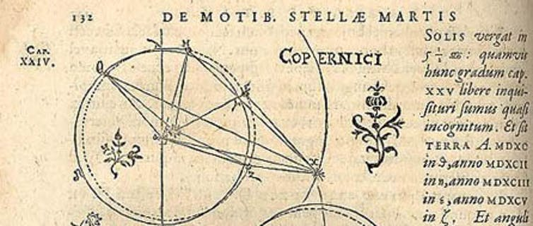
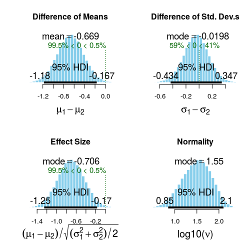
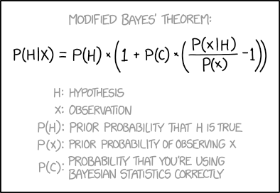
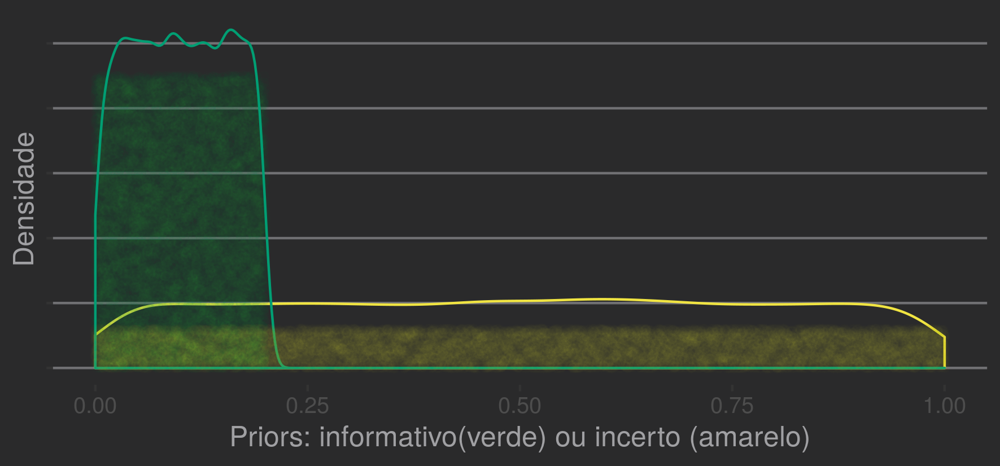
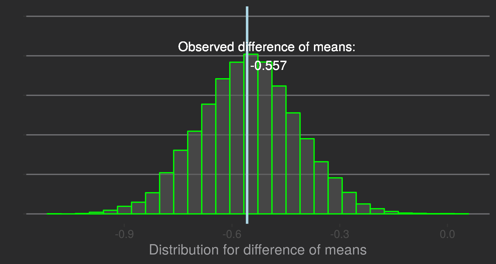
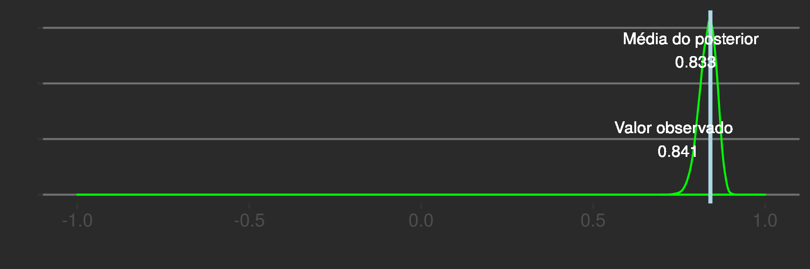
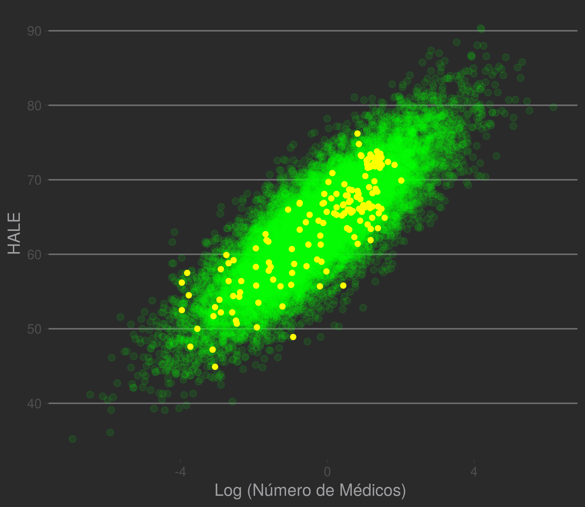
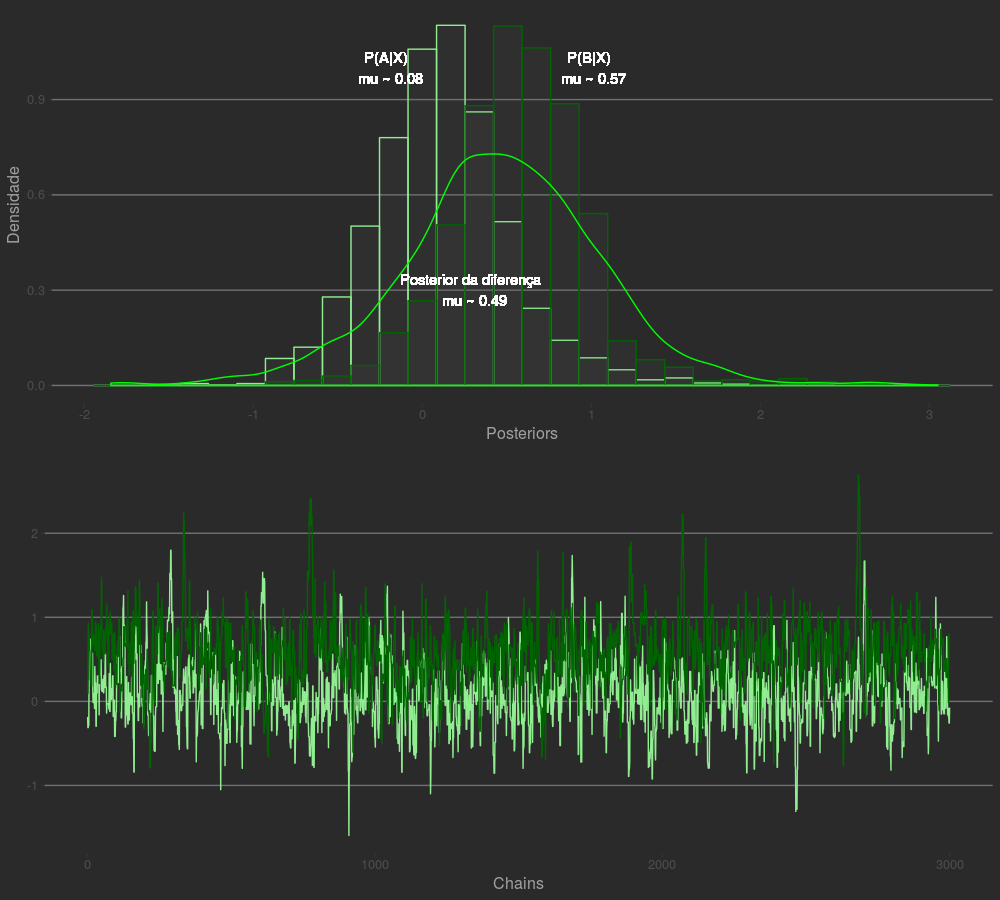

---
output:
  pdf_document: default
  html_document: default
---
# Chapter 6: Context and Bayesian Inference

## Odds
*"The probable is what happens most of the time"*, Aristotle, Rhetoric.  

A popularized probabilistic approach to applied mathematics is that of *Bayesian Inference*. The procedures presented above are usually called *frequencists*.
Often, the information obtained is almost identical, but the perspective changes considerably.     

In principle, we use different paths.  

**Frequentists and Bayesians**

Frequentist approaches place probabilities as approximations for scenarios with an infinite number of events. The examples visited in the first chapters often made this analogy.
 

To return to a trivial example: if we throw an honest coin endlessly, the proportion of * heads * tends to what value? For many drawings, the proportion tends to 0.5.
Simulation:
  
  ```r
    > set.seed(2600)
    > coin_t <- function(x) {
    sample(size=x,x=c(0,1), prob = c(0.5,0.5), replace = T) %>%
    (function(y) sum(y)/length(y))}
    > coin_t(3)
    [1] 0.6666667
    > coin_t(10)
    [1] 0.4
    > coin_t(30)
    [1] 0.5666667
    > coin_t(100)
    [1] 0.51
    > coin_t(1000)
    [1] 0.498
    > coin_t(100000)
    [1] 0.50098
    > coin_t(10000000)
    [1] 0.4999367
```  

The idea of infinite hypothetical populations or procedures is common.
The hypothetical-deductive method links theories to observations through falsifiable hypotheses. The most accepted conception, recently compiled by K. Popper, deals directly with probabilities as important entities for the natural sciences.
More than that, it illustrates the concept of calculating the plausibility of experimental results in the presence of a hypothesis under study.  

We calculate a probability associated with the occurrence of an observation. In the two sample t test (chapter 1), we define the null hypothesis as a function of the nozzle averages($\mu$) and other parameters ($\sigma$,$df$). $H_{0} : \mu_{amostra_{1}} = \mu_{amostra_{2}}$.  
The procedure of imagining the observed events as instances of a family of similar events is perfectly suited to Popperian precepts. It remains the common science bean and rice to test predictions of a given paradigm. The gradual refinement of a theory involves the accumulation of knowledge and testing of *auxiliary hypotheses* resulting from basic assumptions (*hard core* in the terminology of Imre Lakatos).  

Bayesian prisms instrumentalize probabilities as primitive beings, more basic notions related to *plausibility*, *degree of belief*, *expectation* for a given situation.
The key point is that we fail to guide the procedures aiming at a probability for the events.
The probabilities themselves become central entities. Specifically, how our beliefs about something change after observations.
  

In the case of birds:  

* Frequency inference *: Assuming the average difference between nozzle sizes is 0, what is the probability for my observations?
Being $H_0$ defined by $H_0 : \mu_{amostra_{1}} = \mu_{amostra_{2}}$, we want to know:  
$P(H_0) < 0,05$?  

*Bayesian inference*: What are the probabilities associated with the possible values for the difference between $\mu_{amostra_{1}}$ e $\mu_{amostra_{2}}$? Considering a model and data, what is the probabilistic distribution of $\mu_\mathit{diff_{1-2}}$   
$P(\mu_\mathit{diff_{1-2}}) = ?$  

In addition to intuitive constructs, a Bayesian platform offers two powerful features: sensitivity to prior information about a phenomenon (*priors*) and stochastic estimators (e.g. *Markov Chain Monte Carlo*). Thus, we can (1) make use of arbitrary information (e.g. an expert's intuition) and (2) reduce the dependence on analytical (closed) solutions for equations that describe the models.
  

---  

#### Bayesian epistemology?

Rather, we associate scenarios with hypotheses and estimate parameters (probabilities) to test them. The *parameters* now have a more central conceptual role.  

A parameter is a symbol, an approximation to an idea (*to*, "near", *metron*, "measure"). In the initial chapters, we use parameters for constructs that behave like numbers (e.g., there are elements that can be ordered by some notion of size and operations, such as sum and multiplication).
  

We estimate parameters($\mu_{\text{diff}}$ and p value) to test a hypothesis about the average difference between nozzle sizes in species A and B. In chapter 2, a parameter ($\beta$ and a p value) to test a hypothesis about the correlation between healthy life expectancy and number of doctors in a country. More than that, we use statistics to test hypotheses and calculate confidence intervals.
  
It is very difficult to understand the usefulness of the previous procedures without knowing the hypothetical-deductive north guiding them. The following excerpt is in *Data Analysis, A Bayesian Tutorial* (Sivia & Skilling, 2006), by Oxford professors: *"The masters, such as Fisher, Neyman and Pearson, provided a variety of different principles, which has merely resulted in a plethora of tests and procedures**without any clear underlying rationale **. This **lack of unifying principles** is, perhaps, at the heart of the shortcomings of the cook-book approach to statistics that students are often taught even today. "*  

We can even use probabilities obtained via Bayesian inference to continue testing hypotheses. However, it is convenient to introduce Bayesian tools to the thinking of philosophers who offered other alternatives[^27].  

[^27]:There is a more comprehensive research program in philosophy on Bayesian epistemology, but this is not our focus. [See The Open Handbook of Formal Epistemology](https://jonathanweisberg.org/post/open-handbook/)

## Many scientific methods: Feyerabend, Carnap and Quine

In the first chapter, we come into contact with the hypothetical-deductive method and falsifiability as a scientific demarcation criterion. Despite being dominant, this rationale has interesting vulnerabilities. We will better understand contrary arguments and alternative proposals through three 20th century philosophers. This is a convenient time, as we take the spotlight out of hypotheses.    

**Paul Feyerabend (1924 - 1994)**

Known for his unique personality and radical ideas, Paul Feyerabend, in *Against the Method* (1975), argues that much of the significant progress has taken place outside the scientific method.
   

Personal beliefs and biographical details are responsible for changes in our knowledge. More than that, using falsifiability and the hypothetical-deductive method would have made us reject heliocentrism and other key ideas for progress. In fact, Ptolemy's geocentric system (Earth in the center of the system) was more accurate (!) Than Copernicus (Sun in the center) using the same number of parameters for calculating the orbits. The Copernican model was closer to reality as understood today, but the intermediate stage of theoretical conception was 'worse' [^28].    

In addition to being less accurate, it was more complex in some ways, including more epicycles: auxiliary orbits used as a device for calculations. The Copernican Revolution only consolidated the paradigm shift with subsequent contributions from Tycho Brahe, Kepler, Galileo and Newton, about 1 century later.



[^28]: Stanley E. Babb, “Accuracy of Planetary Theories, Particularly for Mars”, Isis, Sep. 1977, pp. 426

Faced with the inconsistencies between a method and the inevitable unpredictability of the human endeavor to discover the Universe, Feyerabend proposes *epistemic anarchism* under the motto *"Anything goes"*('Anything goes'). That is, any resources are valid in an attempt to attack a problem or conceive a model of reality.  

It is tempting to think that, given the depth of the work, the defense of such a forceful posture is obviously an application of the precepts defended in the book as necessary to spread an idea. Other philosophers help us to conceive of a science not based on a hypothetical-deductive method in a less radical way.
  
\pagebreak

**Rudolph Carnap (1891 - 1970)**  

Carnap, from the Vienna Circle, also opposed Popper. In “Testability and Meaning” (1936-7), he argues that falsifiability is no different from verificationism. It involves testing each statement itself, a problem that [others] (https://en.wikipedia.org/wiki/Ludwig_Wittgenstein) also addressed.
  

In the face of unexpected results in an experiment, the automatic procedure for a scientist involves checking the integrity of the designed conditions. Check the sample composition, collection methods, loss mechanisms, exclusion and inclusion criteria, analysis premises. This is not intellectual dishonesty: they are minor, real and easily accessible factors that may have invalidated the basic theory. The same is true for techniques of analysis and conceptualization of constructs.
  

Taking care of these points is desirable and exposes the inevitable Achilles' heel of falsifiability.
It is impossible to refute a hypothesis / assertion in isolation. Each experimental or logical procedure involves the interdependence between the symbols used.  

**Willard van Orman Quine (1908 – 2000)**  

A philosophical school starts from the above problem. Duhem-Quine's thesis postulates that it is impossible to test any scientific hypothesis, since there are always premises accepted as truth.

In *‘The two dogmas of empiricism’*, Quine considers the propositions and logical relationships between them to be only one system, which can only be studied together.
The exercises illustrated in the previous volume tests the suitability of the data for the t distribution family. It also assumes that nozzle sizes are measurable using numbers and that these can be compared to values from other samples.  

A princípio, essas declarações parecem triviais. Entretanto, considerando os fatores humanos da ciência, a mudança de lentes é significativa. Discutivelmente, abordar um problema dessa maneira é historicamente mais frutífero. As contribuições mais contundentes são advindas de cientistas dedicados a estudar um contexto ou problema como um todo. É raro, talvez inédito, que um grupo testando hipóteses sem um eixo consistente tenha obtido avanços admiráveis.  

Freely estimating the parameters we speak of naturally is much more intuitive than adapting an idea to hypothetical-deductive procedures.
  
## Bayesian inference

In chapter 1, when doing a t test, we calculate the t statistic corresponding to the differences found and then the probability of obtaining equal or more extreme values.
It is possible to use Bayesian inference to analyze an identical situation. As mentioned before, we are not very interested in the p-value.
The question is *"What are the likely values for the difference between A and B?"*.

The probabilistic distribution obtained represents our beliefs in the plausibility of each value.


Using the BEST library and 30 observations taken from samples of normal distribution $(\mu_{a}=0; \mu_{b}=0.6; \sigma_{a} = \sigma_{b} = 1)$ normal.  

```r
    > library(ggthemes)
    > library(rstan)
    > library(reshape2)
    > library(BEST)
    > library(ggplot2)
    > options(mc.cores = parallel::detectCores() - 1)
    > set.seed(2600)
    > a <- rnorm(n = 30, sd = 1, mean = 0)
    > b <- rnorm(n = 30, sd = 1, mean = 0.6)

    # BEST
    > BESTout <- BESTmcmc(a, b)    

    ### BEST plots
    > par(mfrow=c(2,2))
    > sapply(c("mean", "sd", "effect", "nu"), function(p) plot(BESTout, which=p))
    > layout(1)
```


The distribution in the upper left corner corresponds to our estimates for possible values of the difference between A and B. We can use the average as a point estimate:$(\mathit{diff}_{\mu_{a}\mu_{b}}=-0.669)$. The range indicated as 95% HDI (High density interval) contains 95% of the distribution.
Its meaning is closer to the intuition of a probable region for the values than the classic confidence interval.
  

### Behind the curtains

Obviously, we will understand the art involved here. The flexibility and power of Bayesian models allows us to deal with a series of problems that are difficult to deal with otherwise. However, it is easy to fall into traps or run into difficulties during the process.

It is extremely important to understand the components involved in order not to make any major mistakes.
  



### The Bayes Theorem 

$$P(B\mid A)= \frac{P(A) \mid B)P(B)}{P(A)}, P(A)\neq 0$$
It is the famous form of the theorem and tells us about probabilities of subsequent / concurrent events.

It is usually presented to treat simple problems: *knowing the result of a positive medical test, how likely is the patient to have the disease?*. Bayes' theorem links the baseline probability of the disease to the probability of a subsequent positive test. Some pitfalls of intuition are broken: even if the test has good sensitivity (high probability of a positive result in the face of the disease), the probability will be low if the baseline chances are also.    
 
The theorem was conceived in a greater effort by the reverend (Thomas Bayes, 1701-1761) for a problem of inference. Interestingly, it is quite similar to what we will undertake.  
Suppose we assign a *p* probability($0 \leqslant p \leqslant 1$) for the launch of a coin with a *crown* result. By observing some results, we can calibrate our estimate.
We can start by assuming an honest currency $0.5$. With a high frequency of *crowns*, it is rational to increase our estimate of the value of *p*
 $(p \sim 1)$. Bayes demonstrated how to make these updates in the face of evidence.   

#### Intuition

The text of **An essay towards solving a Problem in the Doctrine of Chances (1973)** presents a series of demonstrations until reaching the statement:  
**Proposition 4** : *If there be two subesequent events be determined every day, and each day the probability of the 2nd [event] is $\frac{b}{N}$ and the probability of both $\frac{P}{N}$, and I am to receive N if both of the events happen the 1st day on which the 2nd does; I say, according to these conditions, the probability of my obtaining N is $\frac{P}{b}$. (...)*  

The style is a little complicated. With current notation:
Considering two subsequent events, *(1)* the probability of the second happening is $\frac{b}{N}$ ($P(A)$), *(2)* the likelihood of both of them happening is $\frac{P}{N}$ ($P(A \cap B$). *(3)* Knowing that the second happened, the probability that the first also happened is $\frac{P}{b}$.  $N$ is canceled and * (3) * is the ratio between *(2)* and *(1)*: 
 
$$P(B\mid A)= \frac{P(A \cap B)}{P(A)}, P(A)\neq 0$$  

Considering two events, **A** and **B**, the probability of B happening knowing that A happened ($P(B\mid A)$) is identical to the probability of A and B ($P(A \cap B)$) happen, normalized by the probability of A happening individually.  

By the definition of conditional probability, $P(A \cap B) = P(A \mid B) P(B)$ , so:  

$$P(B\mid A)= \frac{(A \mid B) \space P(B)}{P(A)}, P(A)\neq 0$$

Thus, we can estimate probabilities of events. In Bayesian inference, we use the theorem to estimate the probable values (probabilistic distribution) of a parameter $(\theta)$ in the face of observations ($X$).

$$P(\theta \mid X) = \frac{ P(X \mid \theta) \space P(\theta) }{P(X)}, P(X) \neq 0$$

#### Later
We call the first term, the parameter estimate after calibration by the observations $P(\theta \mid X)$, ** **posterior distribution** (*posterior distribution* translates well into Portuguese). All procedures are designed to calculate it and represent the distribution used in the final inferences.
For example, we want the subsequent distribution of values for the difference between A and B.   

#### Marginal probability
The denominator of the term on the right is the independent probability for the occurrence of the data ($P(X)$). It is used to normalize quantities and is called marginal probability / likelihood, **marginal likelihood**, or even model evidence, **model evidence**.  


#### Likelihood
The first term on the right, $P(X \mid \theta)$, called likelihood (**likelihood**) and determines the probability of occurrence of observations $P(X)$ given a parameter $\theta$.  
It is probably the most sensitive point in modeling, as it describes how the relationship between theoretical model and observations takes place. As discussed before, equations correspond to precise laws involving more than one construct. The mapping between $ P (X) $ observations and a parameter is given by the *likelihood function* (**likelihood function**) chosen, $f(\theta)$.  

Example: the number of immune fighting cells circulating in the blood is associated with an inflammatory response. The higher, the more likely an infection is to the doctor. But which law associates the number of cells (between $0$ and $10^5$) with the likelihood of infection?  
If the outcomes studied are binary ($y_{i} \in  \{ 0,1 \}$, e.g. positive or negative diagnosis), we can use a logistic relationship (see Chapter 4) to estimate probabilities as a function of observed variables ($X$) and parameter(s) $\theta$.  $$P(X \mid \theta) \sim f(X, \theta) : y_{i} = \frac{1}{1+e^{-(\theta * x_{i} + c)}}$$  
Other functions could be chosen (e.g. Heaviside step from the previous chapter). This depends on the phenomenon, the theory and the measures analyzed. 

#### Priors
How do we estimate the chances of infection before seeing the test results? Before the exam, we have some notion of how the parameter behaves.
It can be very precise or bring a lot of uncertainty. We call the baseline estimate $P(\theta)$ **prior** and appears in the expression multiplying the likelihood value.
In the language of probabilities, it is a distribution. Our previous beliefs may be uninformative (e.g. we do not examine the patient; uniform distribution over possible values) or quite defined (e.g. the patient is asymptomatic; distribution concentrated in the vicinity of 0).  

```r
    > a <- runif(10000)
    > b <- runif(10000, min = 0, max=0.2)
    > priors <- data.frame(uniform=a, low=b)
    > ggplot(priors)+
    geom_density(aes(x=uniform),color="#F0E442")+
    geom_jitter(aes(y=uniform*4.5,x=seq(0,0.2,length.out = 10000)),
    color="#009E73",alpha=0.015)+
    geom_density(aes(x=low),color="#009E73")+
    geom_jitter(aes(y=low*3,x=seq(0,1,length.out = 10000)),
    color="#F0E442",alpha=0.01)+ylab("Density")+
    xlab("Priors: informative (green) or uncertain (yellow)")+
    theme_hc(style="darkunica")+theme(axis.text.y=element_blank())

```



Knowing our constructs, we can then rewrite the procedures:  
$$\text{Posterior} = \frac{\text{Prob. of observations given by} f(X,\theta) * \text{Prior}}{\text{Prob. marginal for observations}}$$ 

To obtain the *posterior*, we multiply the probability given by the *likelihood function* by our previous estimates (*prior*) and normalize by the *marginal probability* of the observations.
  

Later narratives are constructed according to the distribution of *posterior*.  

---  

**Master Foo and the Recruiter**[^29]

A technical recruiter, upon discovering that the paths of Unix hackers were strange, sought to talk to Master Foo to learn about the Path. Master Foo met the recruit in the human resources offices of a large corporation.

The recruit said, “I have noticed that Unix hackers scorn or get nervous when I ask them how many years of experience they have in a new programming language. Why does it happen?"  

Master Foo got up and started walking through the office. The recruiter was intrigued, and asked "What are you doing"?

"I'm learning to walk", replied Mestre Foo.

“I saw you walking through the door,” the recruiter exclaimed, “and you're not tripping over your feet. Obviously, you know how to walk. ”

"Yes, but this floor is new to me" replied Master Foo.

Upon hearing this, the recruiter was enlightened.  

[^29]: http://www.catb.org/~esr/writings/unix-koans/recruiter.html  

---  

### Dear Stan

The implementations of the Bayesian models are made in Stan, a C ++ package specialized in Bayesian inference. The models are written in their own dialect, but the syntax is very similar to that of mathematical notation, so the translation of the chapter analyzes is straightforward.
We specify the model in an auxiliary file of extension *.stan*, which is manipulated by R packages for visualization and other utilities.  

**There and back again**  

We will reproduce in the Bayesian way two known examples: difference between means (analogous to the t test) and correlation.

Here, it is clear that the rationale is more direct than the previous one.

#### Comparing samples of normal distribution

Let us remember (chap. 1) that, to compare samples using the t test: (1) we assume normality in the data source; (2) we imagine the distribution of means normalized by standard error in similar hypothetical samples, taken from the same population; (3) we calculate the p-value by knowing the distribution (Student's t).

We can now obtain a later distribution for the difference between samples.
(1) We assume normality in the data source (likelihood function); (2) we provide our prior estimates (prior); (3) we update the values against the data and to obtain the latter.
  

We adopted the following parameterization:

Values observed in samples 1 and 2, vectors $N$ dimensions: $y_{1}, y_{2}$  
Unknown target parameters, the means in each sample and a common standard deviation: $\mu_{1}, \mu_{2}, \sigma$  
Priors assuming an average of 0 in both groups and a standard deviation of 1: $\mu_{1} \sim N(0,1), \mu_{2} \sim N(0,1), \sigma \sim N(1,1)$
Likelihood function, indicating that each observation is from a population with normal distribution: $y \sim N(\mu,\sigma)$ 

We also specify for Stan that it generates (1) values for the difference between the subsequent distributions of $\mu_{1}$ and $\mu_{2}$, $\mu_{\text{diff}}$ and (2) effect size with Cohen's D, dividing the value by the standard deviation.  

The code must be saved in a ".stan" file.  
```
data {
  int<lower=0> N;
  vector[N] y_1;
  vector[N] y_2;
}
parameters {
  real mu_1;
  real mu_2;
  real sigma;
}
model {
  //priors
  mu_1 ~ normal(0, 1);
  mu_2 ~ normal(0, 1);
  sigma ~ normal(1, 1);
 
  //likelihood - Likelihood
  for (n in 1:N){
    y_1[n] ~ normal(mu_1, sigma);
    y_2[n] ~ normal(mu_2, sigma);
  }
}
generated quantities{
  real mudiff;
  real cohenD;
 
  mudiff = mu_1 - mu_2;
  cohenD = mudiff/sigma;
}
```
 
So, let's start the analysis through the interface in R. We created a list with components homonymous to the variables of the Stan file (y_1: sample 1, y_2: sample 2, N: sample size).

```r
    > a <- rnorm(n = 100, sd = 1, mean = 0)
    > b <- rnorm(n = 100, sd = 1, mean = 0.6)
    > sample_data <- list(y_1=a,y_2=b,N=length(a))
    > fit <- rstan::stan(file="aux/bayes-t.stan",
           	data=sample_data,
           	iter=3000, warmup=100, chains = 6)
     SAMPLING FOR MODEL 'bayes-t' NOW (CHAIN 1).
     (...)
```
The above command will start the calculations. We will plot the later distributions of $\mu_{1}$, $\mu_{2}$and the difference between these ($\mu_{\text{diff}}$)

```r
    > obs_diff <- mean(a) - mean(b)
    > obs_diff
    [1] -0.5579295
    > posteriors <- extract(fit,par = c("mu_1","mu_2","mudiff"))
    > lapply(posteriors,mean)
    $mu_1
    [1] 0.07303457    

    $mu_2
    [1] 0.6261336    

    $mudiff
    [1] -0.553099
    > ggplot(data.frame(muDiff=posteriors$mudiff), aes(x=muDiff))+
       geom_histogram(alpha=0.6,color="green")+
       geom_vline(xintercept=obs_diff,
              	color="light blue",size=1)+ # line for observed difference
       xlab("Distribuição para diferença de médias")+ylab("")+ ylim(0,2500)+
       geom_text(label="Diferença observada:\n -0.557",
             	color="white",x=mean(muDiff)+0.05,y=2000)+
       theme_hc(style="darkunica")+
       theme(axis.text.y=element_blank())       	
```


The above distribution contains other information. We lost Student's elegant analytical estimate to test the hypothesis about a parameter (e.g.$H_{0}: \mu_{\text{diff}} = 0$). On the other hand, we have a global view of the entire estimated distribution for $\mu_{\text{diff}}$!  

--- 

#### Linear correlation  

We will reproduce the correlation analysis in Chapter 2, when we talk about health indicators. The important variables are the logarithm of the number of doctors and the healthy life expectancy (Health Adjusted Life Expectancy). The bank was created with name `uni_df`, containing the variables `log_docs` and `hale`.  

Systematizing our approach, we will choose **Priors:**
*Correlation* $\rho$: Let's assume that it is positive between the number of doctors and healthy life expectancy. We will indicate a low value (0.1) for this correlation.

$$N(0.1,1)$$  
*Averages and deviations* $\mu$ and $\sigma$: We don't have much of an average idea for the logarithm of the number of doctors. A slight inspection shows that the values are low in magnitude. We will indicate uninformative priors for $\mu_{\text{medicos}}, \sigma_{\text{medicos}}$ in the form of Gaussians with a mean of 0 and high deviations.
   
$$\mu_{\text{medicos}} \sim N(0, 2), \sigma_{\text{medicos}} \sim N(0, 10)$$  
A brief search on search engines suggests that an average $\mu_{\text{hale}}$ * 60 * years is a reasonable guess. Let's estimate the prior of the standard deviation $\sigma_{\text{hale}}$ in 5.  
$$\mu_{\text{hale}} \sim N(60, 3), \sigma_{\text{hale}} \sim N(5, 2)$$


**Likelihood function:** Our model for the data is that it is given through a normal bivariate distribution, with averages $\mu_{1},\mu_{2}$ and deviations $\sigma_{1},\sigma_{2}$. As we saw earlier, the definition for Pearson's coefficient between samples $X$ and $X'$ is
$$\rho_{XX'}= \frac{cov(X,X')}{\sigma_{X}\sigma_{X'}}$$
So, 
$$cov(X,X') = \sigma_{X}\sigma_{X'} * \rho_{XX'}$$  
We can then define the covariance matrix of our bivariate distribution:  
$$\text{Cov. Matrix} = \begin{pmatrix} 
\sigma_{1}^2 & \sigma_{1}\sigma_{2'} * \rho  \\ 
\sigma_{1}\sigma_{2'} * \rho & \sigma_{2}^2  \end{pmatrix}$$

Our code in Stan:

```
data {
	int<lower=1> N;
	vector[2] x[N];  
}

parameters {
	vector[2] mu;             
	real<lower=0> sigma[2];   
	real<lower=-1, upper=1> rho;  
}

transformed parameters {
	// Matriz de covariancias
	cov_matrix[2] cov = [[  	sigma[1] ^ 2   	, sigma[1] * sigma[2] * rho],
                     	[sigma[1] * sigma[2] * rho,   	sigma[2] ^ 2   	]];
}

model {
  // Priors
  sigma ~ normal(0,1);
  mu ~ normal(0.2, 1);
  
  // Likelihood - Bivariate normal
  x ~ multi_normal_lpdf(mu, cov);
    
}

generated quantities {
  // Samples with ordered pairs
  vector[2] x_rand;
  x_rand = multi_normal_rng(mu, cov);
}
```
And then we can start the estimates.  

```r
    # Stan doesn't accept missing values
    > c_cases <- uni_df[complete.cases(uni_df[,c(3,4)]),] 
    > vec_2 <- matrix(data = c(c_cases$hale,c_cases$log_docs),ncol = 2,nrow = 145)
    > health_data  <- list(N=nrow(c_cases),x = vec_2) 
    > fit <- rstan::stan(file="aux/corr-docs.stan",
           	data=health_data,
           	iter=3000, warmup=120, chains = 6)
    SAMPLING FOR MODEL 'corr-docs' NOW (CHAIN 1).
    (...)
```
And then, let's look at our later estimate for the value of $\rho$:  

```r
    > obs_rho <- cor.test(vec_2[,1],vec_2[,2])$estimate
    > posterior <- rstan::extract(fit,par = c("rho"))
    > ggplot(data.frame(rho=posterior$rho), aes(x=rho))+
       geom_density(alpha=0.6,color="green")+
       geom_vline(xintercept=obs_rho,
              	color="light blue",size=1)+ # line for observed difference
       xlab("")+ylab("")+ xlim(-1,1)+
       geom_text(label="Valor observado \n 0.841",
             	color="white",x=obs_rho-0.1, y = 5,
             	size=3)+
       geom_text(label="Média do posterior \n 0.833",
             	color="white",x=obs_rho-0.05, y = 13,
             	size=3)+
       theme_hc(style="darkunic")+
       theme(axis.text.y=element_blank()) 
```


We note that the later estimates for $\rho$ were reasonably distributed around the empirically calculated value in the sample. We can also observe in the distribution intervals with high probability density (HDI, High density intervals) or other purposes.  

```r
    > quantile(posterior$rho,probs = c(0.025,0.5,0.975))
         2.5%       50%     97.5% 
    0.7790645 0.8353651 0.8777544  
    > cor.test(vec_2[,1],vec_2[,2])$conf.int
    [1] 0.7854248 0.8828027
```  

HDI is often close to the confidence interval as traditionally calculated, but this is not guaranteed.
  
We can plot our random sample generated from the later and visually inspect how the sample values would be within the estimated probability.  

```r
    >x.rand = extract(fit, c("x_rand"))[[1]]
    >plot(uni_df[,c("log_docs","hale")], 
     	xlim=c(-5,5), ylim=c(20, 100), pch=16)
    >dataEllipse(x.rand, levels = c(0.75,0.95,0.99),
            	fill=T, plot.points = FALSE)
    > sample_data <- data.frame(x.rand)
    > names(sample_data) <- c("HALE","Logdocs")        	
    > ggplot(sample_data,aes(x=Logdocs,y=HALE))+
         geom_point(alpha=0.1,color="green",size=2)+
         xlab("Log (Number of doctors) ") + ylab("HALE")+
         geom_point(data=uni_df,aes(x=log_docs,y=hale),color="yellow")+
                theme_hc(style="darkunica")
```


You can experiment with different priors (families and parameters) watching how the final value changes.  

### Markov Chain Monte Carlo Estimators and Methods

In the above implementations, we start from the equation involving priors, likelihood and marginal probabilities.  
$$P(\theta \mid X) = \frac{ P(X \mid \theta) \space P(\theta) }{P(X)}, P(X) \neq 0$$
Using Stan, we inform priors, the likelihood function, observations and all the dirty work is done without further effort.
The estimate of $P(\theta \mid X)$ can be done in different ways.
One involves starting from a distribution $P(\kappa)$ and gradually minimize a measure of the difference (in general, the * Kullback-Leibler divergence *) between it and $P(\theta \mid X)$. Esses métodos (cálculo variacional,* Variational Bayesian methods*) involve analytical solutions for each model.
We will address another method: **Markov Chain Monte Carlo**.  

#### Not everyone who walks aimlessly is lost
[^30]  

**Closed solutions**   

When we talk about regression (Chap. 2), we estimate the straight slopes $\beta_{i}$. We used a *likelihood function* *, with the same meaning used here, defining the probability of the observations given a theoretical model.  

We obtained solutions that maximized this function *(maximum likelihood)*. For the case of linear regression, we point out closed solutions 
$$\text{Max log likelihood}(\beta_{0},\beta_{1},\sigma^{2})$$
$$=\text{Max log} \prod_{i=1}^{n} P(y_{i}|x_{i}; \beta_{0},\beta_{1},\sigma^{2})$$
For example, the slope ($\beta_{1}$) is  
$$\hat{\beta_{1}}=\frac{cov(XY)}{\sigma_{x}^{2}}$$  

**Gradient Descent**  

In chapter 4, we show another way of estimating parameters, analyzing a loss function. Using partial derivatives, we calculate the gradient, analogous to the *slope* of a surface in 3 dimensions. This was possible because we knew the derivatives in each node (neuron). The network consists of sequencing units in layers, so the chain rule works perfectly (*backpropagation*).  

$$(g \circ f)' = (g'\circ f)f'$$

**Markov Chain Monte Carlo**  

Markov Chain Monte Carlo (MCMC) estimators work to treat problems with no closed solution and in which we don't know gradients exactly.
Other forms of treatment exist. Here we cover an MCMC strategy called Metropolis-Hastings. To estimate our later, $P(\theta \mid X)$, we use an algorithm that allows us to obtain representative samples of $P(\theta \mid X)$. For this, the condition is that there is a function $f(x)$ proportional to the density of $P(\theta \mid X)$ and that we can calculate it.  

1 - We start with parameters in a state (e.g. $s_{0} : \beta_{0} = 0.1 , \beta_{1} = 0.2$) and analyze the function (e.g. $f: \text{log likelihood function}$) in that state ($f(s_{0})$) considering the parameters in $s_{0}$. 
2 - Next, we take a step in a random direction, changing the values of $\beta_{i}$. A widely used option is that of a Gaussian with a center in the previous state (* random walk *). We reassessed the state ($f(s_{1})$).  
2.1 - If it is more likely, $f(s_{1}) > f(s_{0})$, so $s_{1}$ it is accepted as a new starting point.
2.2 - If it is less likely, but close enough to the previous state, $f(s_{1}) - f(s_{0}) < \epsilon$, we also take $s_{1}$ as a starting point for the next random step.
2.3 - If he is less likely with a large margin,$f(s_{1}) - f(s_{0}) > \epsilon$, we reject $s_{1}$ and raffled off a new random state.  

The process moves towards more likely states, with some likelihood of visiting less likely states. If the function chosen is proportional to the density of the posterior, $f(x) \sim \text{dens}(P(\theta \mid X))$, the frequency of parameters in the sample of states visited,$s_{i}$, correspond to the latter. It is a common practice to discard the first iterations (*warm up*), as the values can be very representative of places with low density.


[^30]: All that is gold does not glitter,/*Not all those who wander are lost*; The old that is strong does not wither,/ Deep roots are not reached by the frost./From the ashes, a fire shall be woken,/A light from the shadows shall spring;/Renewed shall be blade that was broken,/The crownless again shall be king.  **J.R.R Tolkien. The Fellowship of the ring 1954,**

#### Equations

For practical purposes, we will work with an unknown parameter $\sigma^{2}=1$. 

The function $f$ proportional must be proportional to the density of the posterior.  

$$\text{Posterior} \propto \frac{\text{Prior} \times \text{Likelihood}}{\text{Prob. Marginal}}$$  

**Marginal odds**
It is the probability of the observations $P(X)$. They are constant in the process, serving only to normalize estimates, so:
$$\text{Posterior} \propto \text{Prior} \times \text{Likelihood}$$  

**Priors**  
Our prior is normal, with a mean of 0 and standard deviation 1, $P(\mu) \sim N(0,1)$.  

**Likelihood**
If the observations are independent, we only need to multiply the probability of each one.
We assume that the distribution of measures is normal, with a mean $\mu$ and deviation $\sigma^{2}$. and deviation $s_i$, the likelihood of observations $X$ considering the $\mu_{i}$ is:   
$$P(X | \mu_{i})=$$
$$\prod_{j=1}^{n} P(x_{j} | N( \mu_{i}, 1))=$$ 
$$\prod_{j=1}^{n} \frac{1}{\sqrt{2 \pi \sigma^{2}}} e^{-\frac{(x_{j} - \mu_{i})}{2}}$$

**Function proportional to posterior density**
Usaremos o $\text{log likelihood}$ for the advantages described above: product becomes a sum and we pass the interval $[0;1]$ for $[-\infty,0)$ (or $(0,+\infty]$ multiplying by $-1$).

$$\text{log(Posterior)} \propto log(\text{Prior} \times \text{Likelihood})$$  

$$f: L(s_{i}) = \text{log}(P(X | \mu_{i} , 1) \times N(0,1))$$
$$\text{log}(\prod_{j=1}^{n} P(x_{j} | N( \mu_{i} , 1)) \times N(0,1))=$$ 
$$\text{log}(\prod_{j=1}^{n} P(x_{j} | N( \mu_{i} , 1))) + \text{log}(N(0,1))=$$ 

The second term is a normal distribution with known mean and variance. We only need to use values transformed by logarithm.
The first term is [^31]:  
$$\sum_{j=1}^{n} \text{log}(P(x_{j} | N( \mu_{i} , 1)))=$$ 
$$=-\frac{n}{2}\text{log}({2\pi\sigma_{i}^{2}}) -
\frac{1}{2\sigma_{i}^{2}}\sum_{j=1}^{n}(x_{j} - \mu_{i})^{2}$$  


Finally, we can calculate for each state a value for the parameters $\mu_{i} , \sigma_{i}$, accept or reject them. 


[^31]: Deduction in https://www.statlect.com/fundamentals-of-statistics/normal-distribution-maximum-likelihood

#### Implementation

We will implement MCMC as a proof of concept to illustrate the convergence mechanism. For a real application with robust results, a few more efforts would be necessary. For example, the steps in our program will always be identical, the normalization of the values was done by hand for the sample and we use only one string to estimate the latter.

Stan uses a highly sophisticated version of MCMC, in which the evolution of the system is guided by a (Hamiltonian) function of the total energy. It is possible to observe a gradient and, as in physical phenomena, states with lower energy levels are more likely to be occupied (e.g. Boltzmann distribution in statistical mechanics).  

 
---  

Using the algorithm described above for the difference between means, we generate the samples `a` and `b`, $n=400$, of populations with averages $\mu_{a}=0 , \mu_{b}=0.6$, and normal distribution.  

```r
    >set.seed(2600)
    
    >n_obs <- 400
    >a <- rnorm(n=n_obs, sd =1, mean=0)
    >b <- rnorm(n=n_obs, sd=1, mean=0.6)
```
Let's define our likelihood function (using * -log * transformation):  

```r
    >likel <- function(n,x,mu,sigma){
      l_val <- (-n/2)*log(2*pi*sigma^2) - (1/2*sigma^2)*sum((x - mu)^2)
      return(-l_val) # multiplica(-1)
    }
```
Defining the role to provide $\text{log}(N(0,1))$. We will obtain the probabilities and their logarithm for a $n$ large, representative. This number will be normalized by the size of our sample to allow steps on a reasonable scale in the chain calculations.  

```r
    >log_norm <- function(n,mu,sigma){
      require(magrittr) # para o operador %>%
      # Trick to get ~ uniform distribution in [-Inf,+Inf]
      unif_dist <- 1/runif(n = n, min = -1,max = 1) 
      l_val <- dnorm(x=unif_dist,mean = 0,sd = 1, log=T) 
      l_val <- car::recode(l_val,"-Inf:-1000=-1000") %>% sum # recod. extreme values
      return(-l_val)
    }
```

And a loop to run the MCMC simulation:  

```r
      # MCMC chain
      >mc_chain <- function(obs,iter=4000,n_obs=length(obs)){
        # seeds and objects
        sample <- matrix(nrow = iter, ncol = 2)
        s1_mu <- rnorm(n=1,mean=0) # initial mean
        s_sigma <- 1 # variancia = 1
        s1_lik <- 2000
        for (i in 1:iter){
          # Salva estado
          s0_mu <- s1_mu
          s0_lik <- s1_lik
          
          # Take a step (random walk)
          s1_mu <- s1_mu + rnorm(n=1,mean = 0, sd=0.5)
          s1_lik <- likel(n=n_obs,x=obs,mu=s1_mu,sigma=s_sigma) + 
            # log do prior se baseian numa densidade de n=10000 e é normalizado por 1000 
            log_norm(n=10000,mu=0,sigma=1)/1000 
          
          # Rejects differences greater than 5, assuming the value in the previous state
          if(s1_lik - s0_lik > 5)  
            s1_mu <- s0_mu 
          sample[i,] <- c(s1_mu,s_sigma) # Save
        }
        return(sample[1001:iter,1]) # Discard the first 1000 samples (warm-up)
      }
```
We can then obtain our subsequent distributions for $\mu_{A}, \mu_{B}$ and for the difference. We will also visualize the evolution of states over time.  

```r
    >posterior_a <- mc_chain(obs = a,iter = 4000)
    >posterior_b <- mc_chain(obs = b,iter = 4000)
    >posteriors_data <- data.frame(post_a=posterior_a, post_b=posterior_b)
    >posts_plot <- ggplot(data = posteriors_data, aes(x=posterior_a)) +
       geom_histogram(aes(y=..density..),color = "light green", alpha=0.1) +
       geom_histogram(aes(x=posterior_b, y=..density..), alpha=0.1, color="dark green") +
       geom_density(aes(x=(posterior_b - posterior_a)), color="green") +
       xlab("Posteriors") + ylab("Densidade") +
       geom_text(label="P(A|X) \n mu ~ 0.08",color="white",x=-0.2,y=1)+
       geom_text(label="P(B|X) \n mu ~ 0.57",color="white",x=1,y=1)+
       geom_text(label="Difference later \n mu ~ 0.49",color="white",x=0.3,y=0.3)+
       theme_hc(style = "darkunica")
    >traces_plot <- ggplot(data=posteriors_data,
      aes(y=posterior_a,x=1:nrow(posteriors_data)))+
      geom_line(color="light green")+xlab("Chains")+ylab("")+
      geom_line(aes(y=posterior_b,x=1:nrow(posteriors_data)),
      color="dark green")+
      theme_hc(style="darkunica")
    > multiplot(posts_plot,traces_plot,cols = 1)
```


The top panel of the view highlights later distributions of A (light green) and B (dark green), as well as the difference. They reflect reasonably well the distributions of origin ($N(0,1) , N(0.6,1$) inferred from the data.
In the lower panel, we have the chains for A (lower average, with signal oscillating at a lower level) and B (higher average, with signal oscillating above). Although it is an illustrative model, the result looks good, with representative distributions. 

\pagebreak

### Exercises

1. Using Stan, implement linear regression for data of your choice. The *likelihood function* for observations can be a Gaussian whose mean is by the regression equation. The user guide should help. https://mc-stan.org/docs/2_18/stan-users-guide/linear-regression.html
   * Implement linear regression with more than one predictor.
   * Compare the mean of the posterior ones for the coefficients $\beta$ with the classic point estimate using `glm`.  


2. With the library `BEST` conduct the comparison of means of the final example, invoking the function `BESTmcmc` and specify the argument `numSavedSteps = 3000`.   
  * Extract the subsequent distributions, `mu1` and` mu2`, from the resulting object.
   * Get the difference between `mu1 - mu2` distributions and compare visually (density or histogram) with the posterior one that we generate through the handmade MCMC.  

3. Improve the MCMC simulation by modifying the `mc_chain` function.
   * Obtain the final sample for the later one by drawing values generated by 4 independent chains.
   * Make the size of the steps decrease linearly with the number of simulations elapsed.   

\pagebreak  

