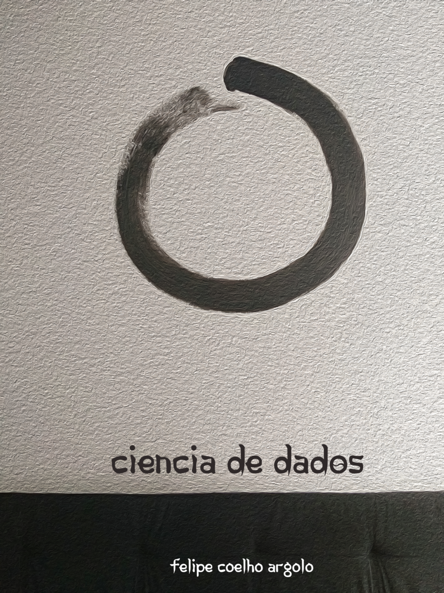

---
output:
  pdf_document: default
  html_document: default
---
  

\pagebreak

\begin{center}

\textbf{Ciência de dados}  

\vspace{5cm}

Filosofia e aplicações com software  

\vspace{5cm}

Felipe Coelho Argolo  
felipe.c.argolo@protonmail.com  

\vspace{2cm}

Londres, 18 de Junho de 2020  

\href{http://www.leanpub.com/fargolo}{Página oficial: https://http://www.leanpub.com/fargolo}  

\vspace{2cm}

Volume 1
Segunda Edição

\end{center}

\pagebreak

**Quod est inferius est sicut quod est superius. Et quod est superius est sicut quod est inferius, ad perpetranda miracula rei unius.**  
**"O que é inferior é como aquilo que é superior. E o que é superior é como aquilo que é inferior, perpetuando os milagres de uma coisa só.**
[^1]  

[^1]:Tábula Esmeralda. Tradução a partir de http://webapp1.dlib.indiana.edu/newton/mss/dipl/ALCH00017 Isaac Newton. "Keynes MS. 28". The Chymistry of Isaac Newton. Ed. William R. Newman. June 2010. Acessado em Junho de 2020   

## Prefácio à segunda edição  

Aproximadamente um ano se passou desde o lançamento da 1a. edição. Algumas modificações foram importantes foram incorporadas ao texto.  

A maior delas é a inclusão de **Julia** nos exemplos como uma linguagem alternativa a R.  

Além disso, o capítulo 3 foi reestruturado para mostrar uma abordagem mais geral do estudo de causalidade com grafos direcionados. O capítulo 5 foi aumentado para incluir detalhes no ajuste de modelos Bayesianos.  

O capítulo 6 adiciona análise de sistemas dinâmicos (séries temporais) ao livro.  

## Prefácio  

*Remember that all models are wrong; the practical question is how wrong do they have to be to not be useful*  
*George Box & Norman R. Draper, Empirical Model-Building and Response Surfaces* 

Nos últimos anos, os termos *inteligência artificial (artificial intelligence)*, *aprendizagem de máquina (machine learning)*, *big data* e *ciência de dados* ganharam forte notoriedade em virtude dos resultados inéditos em problemas de aplicação prática. Avanços em processamento de linguagem natural, visão computacional e algoritmos preditivos foram rapidamentes aplicados por engenheiros e pesquisadores em finanças, indústria e ciências.  
Uma descrição abrangente das técnicas desenvolvidas pode facilmente alcançar 1,000 páginas de texto sucinto, como o clássico *‘Deep Learning (Adaptive Computation and Machine Learning)’* de Goodfellow, Bengio and Courville. Outra obra de escopo e tamanho semelhante é a *“Neural networks and learning machines”*, de Simon Haykin. Inúmeros cursos online e videoaulas são produzidos e disponibilizados por instituições de prestígio (e.g. Curso integral da Oxford em Deep Learning: https://www.youtube.com/watch?v=PlhFWT7vAEw ).  

É comum que a abordagem seja '*bottom-up*'. Uma noção do campo é construída através de estudo focado em modelos: *time series*, *clustering*, *redes neurais*. Ou ainda, focado em ferramentas (e.g. R, Julia, Python, Stan, Matlab...). Funciona bem como roteiro natural em cursos de engenharia e ciências exatas.  

**De cima para baixo**  
Os modelos e ferramentas são contextualizados (*top-down*) na exploração de um roteiro com eixo em filosofia das ciências. As formulações surgem nas respostas a questões sobre fenômenos naturais de biologia (testes estatísticos), psicologia (análise fatorial), saúde pública/economia (correlação, regressão e causalidade) e neurociências (perceptron e redes neurais).  

O *primeiro capítulo* acompanhamos Charles Darwin em Galápagos. Darwin esperou 20 anos entre a concepção da teoria e sua publicação. Ele trabalhou incansavelmente para investigar se suas impressões não eram falsas. Este capítulo ilustra como o racional hipotético-dedutivo funciona para estudar hipóteses científicas. O teste *t* de Student é aplicado para comparação dos bicos de aves em Galápagos. Aborda a relação entre ciências empíricas, o teorema do limite central, a distribuição normal e a distribuição *t*.   

O *segundo capítulo* destaca o papel descritivo e preditivo de teorias. Além de testar hipóteses, criamos modelos para as relações entre medidas. Partindo dos estudos de Arquimedes sobre alavancas, aprenderemos correlações lineares ($\rho$ de Pearson) e tamanho de efeito (*D de Cohen*). Também são introduzidas alternativas não-paramétricas aos procedimentos ($\rho$ de Spearman e teste U de Mann-Whitney) anteriores.  
Usamos regressão para fazer predições e estimamos parâmetros usando *formas fechadas*, resolvendo analiticamente as equações do modelo.  

O *terceiro capítulo* introduz a implementação matemática do abrangente paradigma filosófico para **modelos causais**. Com muitas variáveis (análise multivariada), grafos são a abstração base para relacionarmos conceitos. Estudamos regressão múltipla e sobre como lidar com covariáveis segundo um diagrama causal. Colinearidade, confundidores, mediação e moderação. Para redução de dimensões e abordagem de medidas latentes, falaremos em análise fatorial, análise de componentes principais (PCA) e sua generalização em equações estruturais (SEM).   

O *quarto capítulo* introduz redes neurais. Começamos da inspiração biológica dos neurônios artificiais e da primeira máquina inteligente da história: o *Mark I Perceptron*. Codificamos um Mark I virtual, que usa uma nova forma de estimar parâmetros: *gradient descent*. Ao invés de usar uma fórmula fechada, usamos derivativas para 'caminhar' em direção ao mínimo progressivamente.  

Redes Neurais expandem o poder de um neurônio com múltiplos nodos para a construção de sistemas preditivos complexos. Redes profundas incluem camadas sucessivas, permitindo transformações em sequência para resolver classes mais gerais de problemas. Entendemos como os neurônios podem propagar erros aos outros, otimizando gradientes em conjunto com o mecanismo de *backpropagation*. Também codificaremos uma rede neural, Mark II.  

O *quinto capítulo* constrasta as duas principais escolas de interpretação da probabilidade: a **frequencista** e a **bayesiana**. O contexto é dado por alternativas ao método hipotético dedutivo: Carnap demonstra a dificuldade de refutações, Feyerabend propõe uma anarquia epistemológica amparada em fatos históricos e W. van Quine pinta um sistema entrelaçado para teorias, hipóteses e observações. Reabordamos alguns exemplos anteriores usando Stan para inferência bayesiana.  
Exploramos uma terceira forma de estimar parâmetros. Sem fórmulas fechadas, usamos o poder das simulações estocásticas (*Markov Chain Monte Carlo*).  

\pagebreak

## Sumário

Capítulo 0 - Ferramentas : programação com estatística básica   

* Computadores
* Julia : Curso rápido
  * Instalação, Julia e Atom/Juno
  * Tipos
  * Operadores úteis: = , |> 
  * Arrays, Matrizes e dataframes
  * Gramática dos gráficos e Gadfly
  * Funções
  * Vetores, loops e recursões: calculando a variância 

Capítulo 1 - Os pássaros de Darwin e o método hipotético dedutivo  

  * Pássaros em Galápagos
    * Distribuição normal
    * Ciência experimental e o Teorema do limite central
  * Método hipotético-dedutivo e Testes de hipótese
    * Valor p
    * Distribuição t de Student e teste t

Capítulo 2 - Sobre a natureza das relações

  * Prelúdio: Quem precisa do valor p?
  * Tamanho de efeito: D de Cohen
  * Correlações lineares
    * Coeficiente de correlação $\rho$ de Pearson
    * Predições com regressão linear
  * Correlações e testes não paramétricos
    * $\rho$ de Spearman
    * Teste U de Mann Whitney

Capítulo 3 - Análise multivariada, grafos e inferência causal 

  * Regressão múltipla
    * Colinearidade
  * Grafos e trajetórias causais
    * Mediação e moderação
    * Análise fatorial
    * Equações estruturais
    
Capítulo 4 - Neurônios

  * Regressão logística
  * Um neurônio artificial: O perceptron
    * História e implementação do zero : Mark I
  * Redes Neurais e Deep learning (múltiplas camadas)
  * Gradient Descent
  * Backpropagation

Capítulo 5 - Contexto e inferência Bayesiana  

  * Probabilidades
    * Frequencistas e Bayesianos
  * Muitos métdos científicos: Feyerabend, Carnap e Quine
  * Inferência Bayesiana
    * Teorema de Bayes
    * Intuições: prior, likelihood, posterior e probabilidades marginais
    * Comparação de amostras com distribuição normal
    * Correlação linear
  * Estimadores e Métodos Markov Chain Monte Carlo
    * Soluções fechadas, Gradient Descent e MCMC
    
Capítulo 6 - Sistemas dinâmicos e séries temporais  

\pagebreak

## Pré-requisitos

Rudimentos em probabilidade, estatística e cálculo são suficientes para compreender quase todos os exemplos. Os programas usam sintaxe semelhante à matemática apresentada no texto, então pouca familiaridade com programação não é uma barreira. O capítulo 0 é destinado a isso.  

Todos os exemplos podem ser reproduzidos usando software livre.  

### Leitura recomendada:

Filosofia e divulgação científica

* Surely You're Joking, Mr. Feynman
* O mundo assombrado pelos demônios - Carl Sagan
* A lógica da pesquisa científica - K. Popper
* A estrutura das revoluções científicas - Thomas Kuhn
* Contra o Método - Paul Feyerabend
* Dois dogmas do empiricismo - Willard van Quine
* Stanford Encyclopedia of Philosophy - https://plato.stanford.edu/
* The Open Handbook of Formal Epistemology - https://jonathanweisberg.org/post/open-handbook/

Neurociências  

* Principles of neural science - Eric Kandel

Matemática/computação  

* Coleção '*Fundamentos da matemática elementar*'
* Statistical Rethinking. A Bayesian Course with Examples in R and Stan
* Bioestatistica sem segredos. Annibal Muniz.  
* What is mathematics - Courant & Robbins
* Better Explained ( https://betterexplained.com/ )
* http://material.curso-r.com/
* R Graphics Cookbook
* R Inferno
* Learn you a Haskell for Great Good
* Layered Grammar of Graphics - Hadley Wickham.
* Algorithms unlocked
* Online: Statsexchange, stackoverflow, mathexchange, cross-validated.
 
Machine Learning  

* An Introduction to Statistical Learning: with Applications in R
* Neural Networks and Learning Machines - Simon Haykin
* Stanford (computer vision): http://cs231n.stanford.edu/
* Oxford 2015 (Deep learning): (https://www.youtube.com/watch?v=dV80NAlEins&list=PLE6Wd9FR--EfW8dtjAuPoTuPcqmOV53Fu) 

\pagebreak

**Agradecimentos**

Minha família, Suzana, Paulo, Isaac e Chris. Amigos Gabriel, Guilherme, Wei.  

Aos professores: Carla Daltro, Anibal Neto, Lucas Quarantini, Luis Correia, Rodrigo Bressan, Ary Gadelha.  

Aos colegas Fatori, Luccas, Macedo, Walter, Rafael, Sato, Hiroshi, Lais, Luci, Davi, n3k00n3 (Fernando), Loli (Lorena).

Para comentários, críticas, sugestões, ou simplesmente dizer *oi*: felipe.c.argolo@protonmail.com.  

\pagebreak
