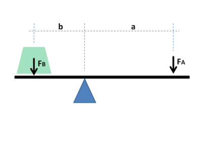
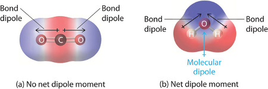
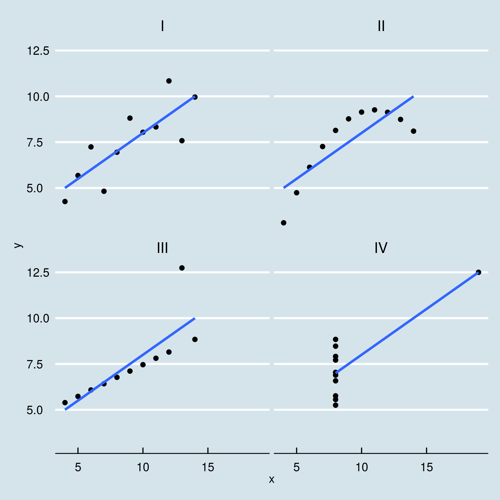
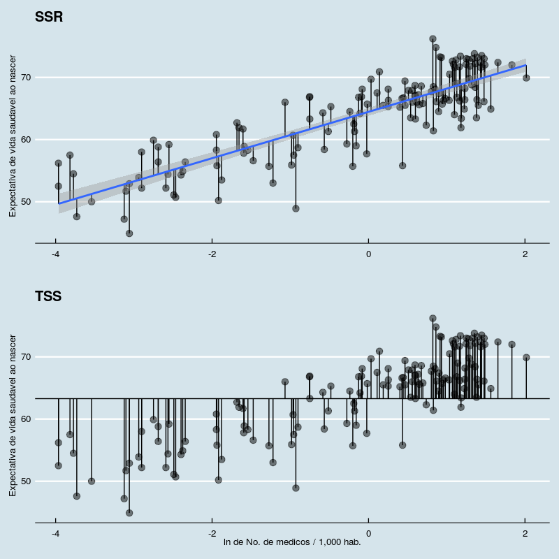
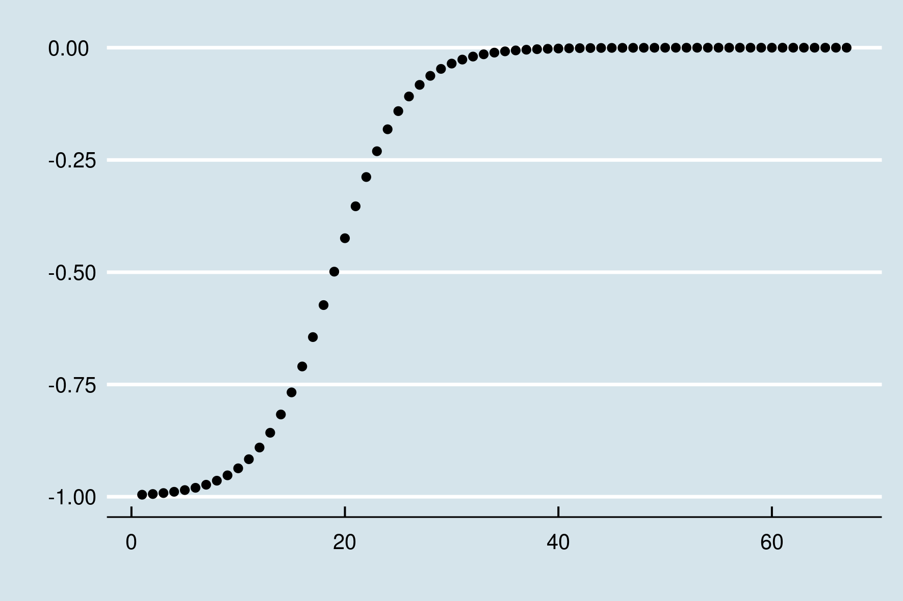

---
output:
  pdf_document: default
  html_document: default
---


# Capítulo 2 : Sobre a natureza das relações 

## Prelúdio: Quem precisa do valor p?

O racional apresentado no capítulo anterior é diretamente relacionado ao método hipotético-dedutivo e seus princípios filosóficos.  Apesar de adequado a este cenário, a interpretação do valor p não é muito intuitiva.  
Envolve *mensurar quão improváveis são as observações em um cenário hipotético na vigência da hipótese nula*.  
Sua tradução (errada) mais popular é de que representa *"a chance de o resultado deste estudo estar errado".*  

O arcabouço descrito no capítulo anterior é suficiente para produzir um trabalho científico críptico para leigos.   

Ao seguir receitas pré-definidas (formulação de $H_{0}$ e $H_{1}$, cálculo de estatísticas e valores p), um texto parece estar em conformação com os padrões acadêmicos, mesmo que a hipótese elementar em torno do objeto de pesquisa seja simplória. Assim, inadvertidamente, priorizamos a forma e relegamos a segundo plano o miolo de propostas científicas.  

Trabalhos de pouca originalidade recebem grande atenção pelo rigor por atributos quantitativos (e.g. tamanho amostral grande, valor p baixo), enquanto criativos e revolucionários experimentos menores levam anos ou décadas até atingirem a comunidade.  
Outro efeito colateral é a busca por valores p que rejeitem $H_{0}$, desprezando precedentes teóricos e premissas probabilísticas (múltiplos testes).  

A difícil interpretabilidade do valor p e as armadilhas frequentes envolvidas no processo de inferência levaram a comunidade científica a questionar a hegemonia desse parâmetro. Há uma presente tendência a abandonar o valor p e o limite $p<0.05$ como critérios canônicos.  

No próximo capítulo, vamos conhecer argumentos contundentes ao método hipotético dedutivo.  
Por enquanto, basta sabermos que é sempre vantajoso obter outras informações, complementares ou alternativas.     

Neste capítulos, vamos aprender a estimar (1) a magnitude da diferença entre duas amostras e (2) quão relacionados são valores pareados (e.g. peso e altura).  

## Tamanho de efeito

O tamanho de efeito nos ajuda a expressar magnitudes.  
Retomando o exemplo anterior, de que adianta uma diferença significativa entre o tamanho dos bicos dos pássaros, se ela for de 0.00001 mm?  

Ainda, existem casos em que estudos pequenos sugerem efeitos importantes, porém o tamanho amostral não fornece poder estatístico suficiente para rejeição da hipótese nula.  


Além de saber quão improvável é a diferença observada, é natural imaginarmos o quão grande ela é.  

Uma medida bastante popular é o *D de Cohen (Cohen's D)*.  

É um parâmetro que expressa a magnitude da diferença sem usar unidades de medida.  
Uma torcedora de futebol conta (feliz) a um amigo que seu time favorito venceu com placar de 4 $\times$ 1 (gols). Porém, esse amigo acompanha basquetebol e está acostumado a placares como 102 $\times$ 93 (cestas).  
Como é possível comparar gols com cestas? Qual vitória representa pontuações mais discrepantes: 4 $\times$ 1 ou 102 $\times$ 93?  

O problema aqui é que as pontuações se comportam de maneiras diferentes entre os esportes. O D de Cohen consiste em expressar essa diferença em desvios-padrão. Bastante simples:  
$$D_{cohen} = \frac{\mu_{1}-\mu_{2}}{\sigma_{pooled}}$$  

Usando a biblioteca *effects*, podemos calcular diretamente:   

```r
    library(effects)
    # O dataset galapagos_birds foi criado no capitulo 1
    >cohen.d(galapagos_birds$X1,galapagos_birds$X2)

    Cohen's d    

    d estimate: -5.460017 (large)
    95 percent confidence interval:
        lower     upper 1
    -5.954047 -4.965987 
```

Cohen propôs algumas faixas para classificar a magnitude desses efeitos:  

|         |  Pequeno  |  Médio  |  Grande  |	
|---------|-----------|---------|----------|
|Cohen's D|  0-0.2    | 0.2-0.5 | 0.5 - 0.8|

Assim, podemos atualizar nossos resultados anteriores, reportando também o tamanho de efeito da diferença e seu intervalo de confiança.  

## Correlações

Na empreitada científica, não nos atemos apenas a comparações. Um objetivo mais nobre é descrever exatamente como se dá a relação entre entidades estudadas.  

Como sabemos, existem muitas classes de funções para expressar relações entre variáveis/conjuntos. Nos capítulos anteriores, usamos algumas funções, como $y=\sqrt{x}$ e $y = e^{x}$.  

Diversas leis naturais tornaram-se particularmente conhecidas, como a relação entre força, massa e aceleração, elucidada por Newton:  
$$\vec{F}=m\vec{a}$$  
E a relação entre massa e energia para um objeto em repouso, descoberta por Einstein:  
$$E=mc^{2}; c^{2} \sim 8.988*10^{16} \frac{m^{2}}{s^2}$$  

As equações acima descrevem uma relação linear entre grandezas.  

### Relações lineares

Uma relação linear entre duas variáveis indica que elas estão correlacionadas em uma proporção constante para qualquer intervalo.

Isto é, valores maiores de massa correspondem a um aumento proporcional em energia. O valor de $c^{2}$ expressa essa proporção constante.  

**Exemplo:** uma molécula de água pesa aproximadamente $m_{H_{2}O} =2.992\times 10^{-23} g$. Portanto, a energia associada é $E_{H_{2}O} = 2.992\times 10^{-23}\times 8.988\times 10^{16} \sim 2.689^{-6}J$. Se triplicarmos o número de moléculas de água, o mesmo acontecerá com a energia associada: $E_{3H_{2}O} = 3\times E_{H_{2}O}$.  
 
Se a correlação é positiva, incrementos em $x$ serão proporcionais a incrementos em $y$. Se a correlação é negativa, incrementos em $x$ serão proporcionais a decréscimos em $y$.  

Num cenário perfeito, se sabemos que há uma relação linear entre variáveis,  precisamos de apenas duas observações para descobrir proporção entre elas. Esse problema é idêntico ao de encontrar a inclinaçaõ da reta que passa por dois pontos. É de fácil resolução usando técnicas elementares.  

```r
    >library(ggplot2)
    >ggplot()+
    geom_point(mapping=aes(x=1,y=2))+
    geom_point(mapping=aes(x=2,y=4))+
    xlim(0,3)+ylim(0,5)+
    theme_economist()
```


$y=\beta*x$  
$a=(1,2); b=(2,4) \rightarrow \beta = 2$  

```r
    >ggplot()+
    geom_point(mapping=aes(x=1,y=2))+
    geom_point(mapping=aes(x=2,y=4))+
    xlim(0,3)+ylim(0,5)+
    geom_abline(slope = 2)+
    theme_economist()
```


### Erros e aleatoriedade

Controlando fatores experimentais, as relações descritas são bastante precisas. Em um cenário sem atrito com superfícies e com o ar, os erros de medida obtidos com $\vec{F}=m\vec{a}$ são muito baixos.  
Entretanto, nem sempre isso é verdadeiro.  
Primeiro, podemos sofrer interferência de variáveis desconhecidas.

Imaginemos um conjunto de medidas antropométricas, com altura e peso e indivíduos.  
É esperado que a altura de um ser humano esteja relacionada com seu peso. Entretanto, outras características não medidas, como percentual de gordura total, podem interferir nos valores finais. Normalmente, tratamos essas flutuações como erros aleatórios[^11].

Podemos simular este cenário partindo de variáveis idênticas e adicionando ruído aleatório.
```r
    >set.seed(2600)
    >a <- seq(1:100)+rnorm(n=100,sd=3)
    >b <- seq(1:100)+rnorm(n=100,sd=3)

    >cor_data <- data.frame(a,b)
    >ggplot(cor_data,aes(x=a,y=b))+
    geom_point()+theme_economist()
```
  

O resultado sugere que há uma forte relação linear entre $x$ e $y$. Por outro lado, notamos que é impossível para uma reta cruzar todos os pontos. A seguir, vamos investigar como quantificar a correlação linear, assim como encontrar a reta que minimiza a distancia para todas as observações.  

Com essas ferramentas, podemos estender nossas inferências. Além de comparações, teremos noções sobre a magnitude de uma relação, assim como poderemos prever o valor esperado para novas observações.   

[^11]:A natureza da aleatoriedade é uma questão filosófica. Em última instância, podemos imaginar que seria possível explicar flutuações randômicas através de variáveis desconhecidas (*hidden variables*). Isso é verdade para a maioria dos fenômenos naturais. Entretanto, descobertas experimentais recentes em física quântica (*Bell's inequality experiment*) sugerem que variáveis ocultas não podem explicar a natureza probabilística das observações.  

### O coeficiente de correlação produto-momento de Pearson, ou, simplesmente, $\rho$ de Pearson.

O coeficiente de correlação $(\rho)$ de Pearson é um número real garantidamente[^12] entre -1 e 1. Expressa a magnitude e o sentido de uma relação linear, sendo -1 uma relação inversa perfeita e 1 uma relação direta perfeita.  

Para os dados que geramos, a correlação é quase perfeita: $\rho = 0.989$.  
O coeficiente possui *produto-momento* em seu nome, pois usa uma abstração originalmente empregada na física: o momento.  

[^12]: Inequalidade de Cauchy–Schwarz

\pagebreak


### Um breve mergulho na física: Momentos
[^13]

Para adquirir uma intuição sobre o coeficiente, é interessante resgatar o conceito físico de momento, originalmente concebido por Arquimedes. Embora não tenha inventado a alavanca, ele descreveu os princípios matemáticos por trás dela. 

Em *Sobre o equilíbrio dos planos*, Arquimedes declara que *Magnitudes ficam em equilíbrio quando em distância reciprocamente proporcional aos seus pesos.* 



Essa é a conhecida Lei da alavanca. Dado um ponto de apoio e um plano sobre ele, aplicamos uma força em qualquer local do plano. O momento (torque) resultante é o resultado da multiplicação da grandeza física $(F)$ pela distância até o ponto fixo $(d)$.  
$M = F*d$  

Supondo uma força constante, quanto mais nos afastamos do ponto fixo, maior o momento resultante. Posteriormente, os físicos  estenderam o conceito para outros domínios. Por exemplo, um objeto com cargas opostas $-q$ e $+q$ separados por uma distância $d$ possui momento (momento dipolar elétrico) análogo:
$M = q*d$  
De uma maneira geral, *falamos em momento ao multiplicarmos uma grandeza física por uma distância*. 

\pagebreak

#### Momento resultante 


No caso da alavanca, vimos que cada força aplicada sobre o objeto está associada a um momento(torque). Sabemos que a gravidade atua sobre cada pedaço com massa compondo o todo. Podemos então calcular o momento resultante somando os momentos de todos os $N$ pontos. Seja $F_{i}$ a função descrevendo a força em cada i-ésimo:
$$M = \sum_{i=1}^{N} F_{i}d_{i}$$  

Um sistema, como o pássaro apoiado sobre o dedo, está em equilíbrio quando a soma dos momentos em relação ao ponto fixo é zero. Para cargas elétricas, o sistema é apolar quando o momento é zero. Na figura abaixo, vemos como a molécula de $CO_{2}$ é apolar, enquanto a molécula de água é polar:  

  

Os momentos descritos acima são expressões do *primeiro momento*, uma vez que a grandeza é multiplicada pela distância com expoente 1: $d = d^{1}$. 

Podemos calcular outros momentos, exponenciando o componente espacial (distância). Vamos estudar agora momentos de massa de um objeto unidimensional:  

O **momento zero** de massa para um objeto é $M_{0} = \sum_{i=1}^{N} m_{i}d_{i}^{0}$. Como $d^{0}=1$, temos $M_{0} = \sum_{i=1}^{N} m_{i}$, que é simplesmente a soma das massas de todos os pontos. O momento zero é a **massa total**.  

$$M_{0} = m$$

O **primeiro momento** de massa para um objeto é $M_{1} = \sum_{i=1}^{N} m_{i}d_{i}^{1}$ e determina o **centro de massa** em relação à dimensão $d$. É o ponto em que está o dedo em que se equilibra o pássaro da foto.  

$$M_{1} = C_{m}$$

O **segundo momento** de massa é $M_{2} = \sum_{i=1}^{N} m_{i}d_{i}^{2}$ e é o **momento de inércia**. Corresponde à resistência do sistema a rotações. Perceba que os termos $d_{i}^{2}$ estariam presentes nas área de um círculo com centro idêntico ao do objeto e raio igual à distância para o centro: $\pi d^{2}$. A resistência total a rotação é análoga à resistência oferecida pelos raios destes círculos imaginários[^14].


O n-ésimo momento é dado por $$M_{n} = \sum_{i=1}^{N} m_{i}d_{i}^{n}$$.

[^13]:Pappus de Alexandria, Synagoge, Livro VIII
[^14]: https://physics.stackexchange.com/a/371165/218274

### Generalizando momentos 

Podemos generalizar ainda mais a abstração e calcular momentos de entidades abstratas, como variáveis aleatórias. **Melhor: já fizemos isso anteriormente!**  

Seja $f(x)$ a função que descreve uma distribuição de probabilidades para a variável,  

Assim como o **momento zero** representa a soma da contribuição de cada ponto para a massa (massa total), aqui ele representa a soma das probabilidades possíveis, a probabilidade total (1).  

O **primeiro momento** corresponde ao centro de massa na mecânica estática. Para probabilidades, é o centro, a **média**.    

O **segundo momento** corresponde ao momento inercial e é a **variância**.  
Os momentos **terceiro** e **quarto** normalizados informam sobre assimetrias *(skewness)* e peso de valores extremos *(kurtosis)*.  

Formalmente, seja $d(x,x_{0})$ o valor da distância ao centro $x_{0}$ de referência $(x-x_{0})$, o n-ésimo momento $\mu_{n}$ é definido por:  

$$\mu_{n}= \int_{-\infty}^{\infty} d(x,x_{0})^{n}f(x)dx$$  

A integral acima corresponde à versão contínua da soma de partes discretas apresentadas antes para uma grandeza física, como a massa: $M_{n} = \sum_{i=1}^{N}d_{i}^{n}m_{i}$  

**Momento zero**: $$\mu_{0}= \int_{-\infty}^{\infty} d(x,x_{0})^{0}f(x)dx$$ 
A soma de todas probabilidades de uma distribuição deve somar 1.  
$$= \int_{-\infty}^{\infty} f(x)dx = 1$$.   
**Primeiro momento**: $\mu_{1}= \int_{-\infty}^{\infty} d(x,x_{0})f(x)dx$ , supondo centro em 0 $(x_{0}=0)$, temos a média, $$ \mu_{1} = \int_{-\infty}^{\infty} xf(x)dx$$, também chamado valor esperado $E[X]$. Estende a intuição de somar as medidas e dividir pelo número de observações ao passo em que usamos uma integral para somar as infinitesimais possibilidades para $f(x)$.    

**Segundo momento**: $$\mu_{2}= \int_{-\infty}^{\infty} d(x,x_{0})^{2}f(x)dx$$. Como vimos no capítulo introdutório, a soma dos quadrados dos desvios, nossa variância, $$\sigma^{2} = E[(x-\mu)^{2}]$$.  

---

**Notas finais sobre o Teorema do Limite Central**

Podemos entender melhor o teorema do limite central. As informações fornecidas pelos momentos são valiosas: uma função de probabilidade é totalmente definida por seus momentos.  
O Teorema do Limite Central, de que falamos antes, é provado mostrado equivalência entre momentos da curva normal e da soma de *n* distribuições idênticas através de outras ferramentas.  
Podemos criar uma *Função geradora de momentos*, $M_{X}(t)=E[e^{tX}]$ em que t é um valor fixo. Chamamos ela assim, pois sua forma polinomial via expansão de Taylor corresponde à uma série que contém todos os momentos $M_{n}$:   $1+tX+\frac{t^{2}M_{2}}{2!}+\frac{t^{3}M_{3}}{3!}+...$, já que $\frac{d{e^x}}{dx} = e^x$ e a derivada de ordem $n$ multiplica a de ordem $n-1$:  
$$e^{x}= \sum_{n=0}^{\infty}{\frac{x^{n}}{n!}} = 1+x+{ \frac{x^{2}}{2!}}+{ \frac{x^{3}}{3!}} +...$$


$$E[M_{X}(t)]=1+tE[X]+\frac{t^{2}E[X^{2}]}{2!}+\frac{t^{3}E[X^{3}]}{3!}+...$$
$$=1+tM_{1}+\frac{t^{2}M_{2}}{2!}+\frac{t^{3}M_{3}}{3!}+...$$

A *Função característica* é a transformada de Fourier da função de densidade, associando valores a componentes periódicos no plano imaginário. Envolve multiplicar t pela unidade na definiçao da função geradora de momentos $M_{X}(t)=E[e^{tX}] , \phi_{X}(t) = M_{X}(it) = E[e^{itX}]$. É possível usar a função característica para mostrar que os momentos na soma de distribuições semelhantes convergem para os momentos de uma distribuição gaussiana. Isto é: $\phi_{\sum{X_{n}}}(t) \sim \phi_{N(\mu,\sigma)}(t)$ para $X_{n}$ semelhantes [^15].  


[^15]: As primeiras provas assumiam $X_{n}$ idênticas, porém versões mais gerais foram demonstradas. Two Proofs of the Central Limit Theorem, Yuval Filmus, 2010. http://www.cs.toronto.edu/~yuvalf/CLT.pdf

---

Com os conceitos adquiridos em mãos, é fácil entender o $\rho$ de Pearson.  

\pagebreak

### Calculando correlações lineares

A noção de **distância** ou **desvio** se repetiu muitas vezes.  
De fato, o coeficiente de correlação linear nasceu quando Francis Galton (1888) estudava numericamente dois problemas aparentemente distintos em antropometria [^16] :

1.  **Antropologia:** Se recuperássemos de um túmulo antigo apenas um osso da coxa (fêmur) de um indivíduo, o que podereríamos dizer sobre sua altura?
2.  **Ciência forense:** Com o intuito de identificar criminosos, o que pode ser dito sobre medidas diferentes de uma mesma pessoa?

Galton percebeu que, na verdade, estava lidando com o mesmo problema. Dadas medidas pareadas, $(x_{i},x_{i}')$, o que o desvio de $x_{i}$ informa sobre o desvio de $x_{i}'$?

O fêmur recuperado do esqueleto de um faraó é 5 cm maior que a média. Quão distante da média esperamos que seja sua altura? Ingenuamente, podemos pensar que se uma das medidas é 1% maior que a média, a outra também será 1% maior. Galton percebeu que havia um armadilha nesse pensamento.   

Apesar de haver uma relação entre as medidas, há também flutuações aleatórias: parte do desvio é resultante disso. Precisamos entender o grau de correlação pra fazer um bom palpite.  

Então, propôs um coeficiente mensurando a relação entre desvios de variáveis. Se tamanho do fêmur e altura estão muito relacionadas, um fêmur grande sugere indivíduo igualmente alto. Caso contrário (baixa correlação), um fêmur grande (desvio alto) não implica grande estatura.  

Para quantificar a relação, multiplicamos os desvios de cada par de medidas:  
$$Cov(X,X')=\sum_{i=1}^{N}(x_{i}-\mu_{x})(x_{i}'-\mu_{x'})$$
A expressão acima expressa a **covariância** entre $X$ e $X'$ e será útil em outros contextos. A expressão lembra o cálculo do primeiro momento, porém cada desvio é multiplicado pelo desvio correspondente da medida pareada. Daí o nome coeficiente de correlação *produto-momento*.  

Note que, se ambos os desvios concordam em sentido (sinal), o resultado da multiplicaçao será positivo. Pares consistentemente concordantes aumentam o valor da soma final. Se ambos os desvios discordam em sentido (sinal), o resultado será negativo. Pares consistentemente discordantes diminuem o valor da soma final.  

Assim, podemos ter variáveis altamente correlacionadas positiva ou negativamente, desde que o sentido da associação seja constante. Em contrapartida, se as medidas são ora discordantes e ora concordantes, os valores tendem a se anular na soma e o resultado se aproxima de zero.  

Observar apenas a covariância é perigoso, pois os valores dependem da unidade de medida e da dispersão dos dados. 

Calculamos o coeficiente de correlação de Pearson, normalizando[^17] a covariância ao dividí-la pelo produto dos desvios-padrão:
$$\rho_{XX'}= \frac{cov(X,X')}{\sigma_{X}\sigma_{X'}}$$
De forma extensa:  
$$\rho_{XX'}= \frac{\sum_{i=1}^{N}(x_{i}-\mu_{x})(x_{i}'-\mu_{x'})}{\sqrt{\sum_{i}^{N}(x_{i}-\mu_{x})^{2}}\sqrt{\sum_{i}^{N}(x_{i}'-\mu_{x'})^{2}}}$$
Uma boa notícia: $\rho$ segue uma distribuição conhecida, a distribuição t, com n-2 graus de liberdade. Podemos usar as ferramentas anteriores para testar hipóteses. 

[^16]: Francis Galton's account of the invention of correlation. Stephen M. Stigler. Statistical Science. 1989, Vol. 4, No. 2, 73-86.  
[^17]: Aqui, normalização tem o sentido de ajustar a escala das medidas. Não confundir com transformações para que os dados passem a ter distribuição gaussiana.  

### Exemplo prático

O exemplo a seguir foi um feliz achado. Na época, o governo brasileiro discutia a necessidade da ampliar número de médicos para melhorar a assistência à saúde. Alguns defendiam ser uma decisão acertada, enquanto outros advogavam que os investimentos deveriam ser feitos em outras áreas da saúde.  

Por curiosidade, acessei os dados da WHO (World Health Organization) e do banco mundial (World Bank) sobre quantidade de médicos por país e indicadores de saúde. Minha expectativa era encontrar pelo menos uma tímida relação entre indicadores. Mais do que isso, entender qual a localização do Brasil em relação a outros países. Fui surpreendido por uma forte correlação, que exploraremos a seguir.  

Adotamos países como unidade observacional com medidas $x$, o número de médicos 1,000 habitantes, e $y$, a expectativa de vida saudável ao nascer.  
Usando dados obtidos dos portais da WHO e do World Bank, plotamos os pontos no plano cartesiano.  

```r
    # http://apps.who.int/gho/data/view.main.HALEXv
    # https://data.worldbank.org/indicator/SH.MED.PHYS.ZS
    >library(magrittr)
    >library(ggplot2)
    >library(dplyr)    

    >worldbank_df <- read.csv("data/API_SH.MED.PHYS.ZS_DS2_en_csv_v2_10227587.csv",
                         	header = T,skip = 3)
    >colnames(worldbank_df)[1] <- "Country"    

    >worldbank_df$n_docs <- sapply(split(worldbank_df[,53:62], #lists of values
                                    	seq(nrow(worldbank_df))),
       	function(x) tail(x[!is.na(x)],1)) %>% #ultimos valores não nulos
      as.numeric    

    >who_df <- read.csv("data/who_lifeexpect.csv",skip=2)
    >who_df$hale <- who_df$X2016
    >uni_df <- left_join(worldbank_df[,c("Country","n_docs")],
                    	who_df[,c("Country","hale")],by="Country")    

    >ggplot(uni_df,aes(x=n_docs,y=hale))+
      geom_point(alpha=0.5,size=3) +
      xlab("No. de medicos / 1,000 hab.")+
      ylab("Expectativa de vida saudavel ao nascer")+
      theme_economist()
```


É evidente que o padrão não é aleatório. Visualmente, notamos que o valor da expectativa de vida aumenta com maior Nº de médicos. 
Ainda, notamos um aumento inicialmente rápido até atingir um platô. O padrão é semelhante ao de uma curva logarítmica.  

$y = log(x)$ ou $HALE = log(N_{médicos})$

Se essa hipótese for verdade, transformar o número de médicos usando função logaritmica tornará a relação linear com a variável transformada:  
Se $y = log (x)$, fazemos a substituição $x’ = log(x)$ para obtermos $y = x'$.  

Então a expectativa de vida se torna linearmente correlacionada ao logaritmo do número de médicos.  
```r
    >uni_df$log_docs <- log(uni_df$n_docs)
    >ggplot(uni_df,aes(x=log_docs,y=hale))+
      geom_point(alpha=0.5,size=3) +
      xlab("ln de No. de medicos / 1,000 hab.")+
      ylab("Expectativa de vida saudavel ao nascer")+
      theme_economist()
```
 

De fato, verificamos uma notável tendência linear para os pontos. 

Usando a implementação nativa em R para o coeficiente de Pearson:

```r
    >cor.test(uni_df$log_docs,uni_df$hale)
    Pearson's product-moment correlation
    data:  uni_df$log_docs and uni_df$hale
    t = 18.572, df = 143, p-value < 2.2e-16
    alternative hypothesis: true correlation is not equal to 0
    95 percent confidence interval: 0.7854248 0.8828027
    sample estimates:
      	cor
    0.8407869
```

A correlação linear obtida para nossa amostra de países é surpreendentemente grande, como sugeria a visualização $(\rho \sim 0.841)$.  

O valor p é baixo $(p<0.001)$ considerando a hipótese nula $H_{0}$ de $\rho=0$. Concluímos então que há uma relação linear significativa de forte magnitude entre o logaritmo do número de médicos e a expectativa de vida dos países em nossa amostra.  

É realmente curioso que exista uma relação matemática tão evidente entre construtos tenuamente conectados. O tempo médio que um organismo leva entre nascimento e morte e o número de profissionais atuantes. É virtualmente impossível explicitar cada relação causal por trás dessa relação, que se manifesta de forma robusta através da soma de muitos fatores relacionados.   

---

#### Nota

*É costumaz afirmar que não existe relação entre variáveis caso o coeficiente de relação não se mostre importante. Como vimos, esse indicador informa apenas sobre relações lineares entre variáveis. A visualização dos dados pode ser de grande ajuda na inferência sobre a natureza de relações.*  
*Dados com distribuições bastante diferentes podem resultar em coeficientes iguais, como mostra o clássico quarteto de Anscombe. As 4 amostras abaixo apresentam o mesmo coeficiente de correlação.*  


---

## Previsões

Agora, sabemos que é razoável assumir uma relação linear entre essas variáveis. Como dito antes, podemos então encontrar a reta que minimiza a distância para as observações. 

A equação que descreve essa reta nos informa o valor esperado para expectativa de vida dado o número de médicos. 

```r
    >uni_df$log_docs <- log(uni_df$n_docs)
    >ggplot(uni_df,aes(x=log_docs,y=hale))+
       geom_point(alpha=0.3,size=3) +  geom_smooth(method="lm")+
       geom_point(y=66.0,x=0.61626614,color="light green")+
       geom_text(y=64.5,x=0.61626614,label="Brasil",color="dark green")+
       geom_point(y=73.2,x=0.93177030,color="red")+
       geom_text(y=71.5,x=0.73177030,label="Canada",color="dark red")+
       geom_point(y=72.0,x=1.833381,color="blue")+
       geom_text(y=74.0,x=1.833381,label="Grécia",color="dark blue")+
       xlab("ln de No. de medicos / 1,000 hab.")+
       ylab("Expectativa de vida saudavel ao nascer")+
       theme_economist()
```
 

Vieses devem ser enderaçados antes de conclusões, mas o modelo é suficientemente interpretável para tomar decisões.  
Uma boa política pode comparar o valor de investimento por setores com outros países em condições semelhantes e resultados diferentes.  
Assumindo que realmente há uma relação linear, vemos que o Brasil está bastante próximo do esperado para o número de médicos[^18]. Caso a estratégia seja contratar mais pessoas, podemos nos espelhar em programas de países com mais médicos por habitante resultados correspondentes (e.g. Grécia).  
Se a estratégia for economizar com a folha de pagamentos e priorizar investimento em estrutura, podemos usar países com expectativa de vida alta para o número de profissionais esperado (e.g. Canada).  
  

[^18]: É praticamente consenso entre especialistas que o Brasil possui problema de distribuição de profissionais, com déficit de médicos em áreas mais pobres e pouco populosas.  


\pagebreak

## Predições com modelos lineares

Como adivinhar uma medida com base na outra? Considerando a relação linear descoberta anteriormente, podemos criar uma função que receba como input o valor de uma variável (número de médicos) e retorne como output o valor esperado para a expectativa de vida.  

Descobrir a equação que descreve esta função consiste em encontrar a reta que melhor se ajusta à nuvem de pontos, como na figura anterior.  

Para isso, calculamos a inclinação $(\beta_{1})$ e o ajuste vertical $(\beta_{0})$ que minimizam a soma das distâncias entre a reta e as observações. O termo $\epsilon$ corresponde aos erros, com distribuição normal de média 0 e desvio padrão $\sigma$.  
$$y_{i} = \beta_{0} + \beta_{1}x_{i} + \epsilon$$

Ajustamos o modelo usando a função lm(linear model) do R:  
```r
    # log_docs : x’ = log(x)
    >lm(hale ~ log_docs, data=uni_df) 
    
    Call:
    lm(formula = hale ~ log_docs, data = uni_df)    

    Coefficients:
    (Intercept)     log_docs  
          64.46         3.73 
```


Temos $\beta_{0} \sim 64.46$ e $\beta_{1} \sim 3.73$.  
Nossa estimativa para a expectativa de vida saudável "começa" em 64.46 anos e aumenta com o número de médicos no país. Especificamente, aumenta em 3.73 para cada unidade de nossa variável transformada $(log(x))$.  
Em nosso dataset, o Brasil possui 1.852 médicos/1,000 hab. Nossa predição então é:  
$\hat{y}_{Brasil}=log{1.852}*3.73 + 64.46 \sim 66.8$, o que está bastante próximo do número real(66).  

**Estimadores**

Existe mais de uma maneira de estimar esses parâmetros.  
Uma de particular interesse, que também servirá em outros contextos, é a de Maximum likelihood (máxima verossimilhança).   

Primeiro, determinamos uma função que descreve a probabilidade da observação na variável alvo $(y_{i})$ ocorrer dadas medidas das variáveis preditoras $(x_{i})$ e um conjunto de parâmetros $(\beta_{k})$.  

Podemos adotar como função de verossimilhança *(likelihood function)* para os valores $y_{i}$ uma distribuição de probabilidades gaussiana cuja média é dada pela reta $\mu_{yi} = \beta_{0} + \beta_{1}*x_{i}$. Assim, a probabilidade de cada valor $y_{i}$ é dada por uma gaussiana, de acordo com o desvio para o valor previsto pela reta.  

$$L \sim N(\mu_{yi},\sigma^{2})$$.  

Assumindo que as observações são independentes, a probabilidade do conjunto de observações é dada pelo produto delas.  

$$L=\prod_{i=1}^{n} P(y_{i}|x_{i}; \beta_{0},\beta_{1},\sigma^{2})$$

Subsitituindo os valores de $\mu$ para a gaussiana pelas previsões da reta:  
$$f(y_{i}) = \frac{1}{\sqrt{2\pi\sigma^{2}}}e^{-\frac{(y_{i}-\mu)^{2}}{2\sigma^{2}}}$$

$$L(\beta_{0},\beta_{1},\sigma^{2})=\prod_{i=1}^{n}\frac{1}{\sqrt{2\pi\sigma^{2}}}e^{-\frac{y_{i} - (\beta_{0}+\beta_{1}x_{i})^{2}}{2\sigma^{2}}}$$

Essa é nossa função de verossimilhança e expressa a probabilidade de observarmos as medidas $y_{i}$ dadas as medidas $x_{i}$ e considerando um conjunto de parâmetros $(\beta_{0},\beta_{1})$.  

O objetivo então é encontrar parâmetros que maximizem essa função. Por conveniência, aplicamos uma transformação logaritmica nesta função $(log \quad likelihood \quad function)$. Isso transforma nosso produtório em um somatório e passamos o contradomínio do intervalo $[0;1]$ para $[-\infty,0)$.  

$$\text{log likelihood}(\beta_{0},\beta_{1},\sigma^{2})=log\prod_{i=1}^{n} P(y_{i}|x_{i}; \beta_{0},\beta_{1},\sigma^{2})$$
$$=\sum_{i=1}^{n} log P(y_{i}|x_{i}; \beta_{0},\beta_{1},\sigma^{2})$$
$$=-\frac{n}{2}\text{log}({2\pi\sigma^{2}}) - \frac{1}{2\sigma^{2}}\sum_{i=1}^{n}(y_{i}-(\beta_{0} + \beta_{1}x_{i}))^{2}$$

Os parâmetros que maximizam a função de verossimilhança (max. likelihood, ML) são os mesmos que maximizam a o logaritmo da função de verossimilhança (log-likelihood).  

Introduzimos o racional do estimador ML pois ele será útil futuramente. Em verdade, é fácil entender as fórmulas fechadas para nossos parâmetros, pois apenas expressam as relações lineares exploradas [^19]:  

$\hat{\beta_{1}}$ expressa a magnitude da correlação entre $X$ e $Y$. É natural que seu valor seja a covariãncia normalizada pela variância do preditor.  
$$\hat{\beta_{1}}=\frac{cov(XY)}{\sigma_{x}^{2}}$$  

$\hat{\beta_{0}}$ é nosso intercepto, então é a diferença entre médias preditas e predições considerando o valor médio em X.  
$$\hat{\beta_{0}}=\mu_{y} - \hat{\beta_{1}}\mu_{x}$$  

Por fim, a variância dos erros $\hat{\sigma^{2}}$ é dada pelo quadrado dos desvios das predições em relação às medidas.  
$$\hat{\sigma^{2}} = \frac{1}{n} \sum_{i=1}^{n} (y_{i}-(\hat{\beta_{0}}+\hat{\beta_{1}}x_{i}))^{2}$$  

As soluções acima fornecem as melhores estimativas que podemos obter minimizando a distância da reta aos pontos.    
Devemos então nos preocupar em saber se o modelo linear encontrado é bom na predição dados.  


[^19]: Detalhes das deduções dos estimadores OLS and Max. Likelihood:   https://www.stat.cmu.edu/~cshalizi/mreg/15/lectures/05/lecture-05.pdf ; https://www.stat.cmu.edu/~cshalizi/mreg/15/lectures/06/lecture-06.pdf

\pagebreak

#### Avaliando performance

Existem diferentes parâmetros para avaliar a performance de um modelo. Boa parte da pesquisa em aprendizagem estatística hoje consiste em implementar heurísticas que levem a melhores indicadores de performance.  

Para regressão linear, o $R^{2}$ (coeficiente de determinação) é um coeficiente bastante usado. Expressa a proporção entre **(1)** variância explicada pelo modelo e **(2)** variação total. Chamamos de resíduo(ou erro) a diferença entre valores preditos e valores reais.  

**(1)** Para capturar a magnitude dos erros do modelo, somamos o quadrado de todos os resíduos *(sum of squared residuals, SSR)* em relaçã aos valores preditos. Sejam $y_{i}$ as observações e $\hat{y_{i}}$ as predições:  
$$SSR=\sum_{i=1}^{n} e_{i}^{2}=\sum_{i=1}^{n}(y_{i}-\hat{y_{i}})^{2}$$  

**(2)** A variabilidade total é quantificada pela soma do quadrado dos desvios em relação à média *(total sum of squares, TSS)*, um termo que vimos no cálculo da variância (segundo momento):
$$TSS=\sum_{i=1}^{n}(y_{i}-\mu_{y})^{2}$$  

Então a fração $\frac{SSR}{TSS}$ é a proporção desejada. Definimos $R^{2}$ como:
$$R^{2}=1 - \frac{SSR}{TSS}$$  

Uma visualização intuitiva de SSR e TSS:    
```r
    >source("aux/multiplot.R")
    >doc_lmfit <- lm(hale ~ log_docs, data=uni_df)
    >uni_df$preds[complete.cases(uni_df)] <- predict(doc_lmfit) 
    >uni_df$hale_mean <- mean(uni_df$hale,na.rm = T)
    >ssr_res <- ggplot(uni_df,aes(x=log_docs,y=hale))+
        geom_point(alpha=0.5,size=3) +
        geom_segment(aes(xend = log_docs, yend = preds)) +
        geom_smooth(method="lm")+
        xlab("")+
        ylab("Expectativa de vida saudavel ao nascer")+
        ggplot2::ggtitle("SSR") + theme_economist()
    
    >tss_res <- ggplot(uni_df,aes(x=log_docs,y=hale))+
        geom_point(alpha=0.5,size=3) +
        geom_segment(aes(xend = log_docs, yend = hale_mean)) +
        geom_abline(slope = 0,intercept = 63.28165)+
        xlab("ln de No. de medicos / 1,000 hab.")+
        ylab("Expectativa de vida saudavel ao nascer")+
        ggplot2::ggtitle("TSS")+theme_economist()
    
    >multiplot(ssr_res,tss_res)

```
 

Valores de $R^{2}$ próximos a 1 indicam soma de resíduos (SSR) similar a 0. Usar a reta como guia acumula erros quase nulos. Valores de $R^{2}$ próximos a 0 indicam $\frac{SSR}{TSS} \sim 1$ e as predições obtidas pelo modelo são tão boas quanto chutar a média para todos os casos.  

```r
    >lm(hale ~ log_docs, data=uni_df) %>% summary
    Call:
    lm(formula = hale ~ log_docs, data = uni_df)    

    Residuals:
         Min       1Q   Median       3Q      Max 
    -12.0964  -2.3988   0.3233   2.8229   8.6708     

    Coefficients:
                Estimate Std. Error t value Pr(>|t|)    
    (Intercept)  64.4613     0.3162  203.84   <2e-16 ***
    log_docs      3.7303     0.2009   18.57   <2e-16 ***
    ---
    Signif. codes:  
    0 ‘***’ 0.001 ‘**’ 0.01 ‘*’ 0.05 ‘.’ 0.1 ‘ ’ 1    

    Residual standard error: 3.779 on 143 degrees of freedom
      (119 observations deleted due to missingness)
    Multiple R-squared:  0.7069,	Adjusted R-squared:  0.7049 
    F-statistic: 344.9 on 1 and 143 DF,  p-value: < 2.2e-16
```

Para obter os valores preditos, usamos o método *predict*:     
```r
    >head(predict(doc_lmfit))
        
           2        3        4        7        8        9 
    59.90747 57.23226 65.39962 66.11533 69.54483 68.30608 
```

É possível também obter predições para novos valores especificando o argumento *newdata*. Para um país com 1.5 médicos/1,000 habitantes:
```r
    >predict(doc_lmfit,newdata = data.frame(log_docs=log(1.5)))
           1 
    65.97381 
``` 
#### Premissas

Existem alguns procedimentos auxiliares para checar possíveis falhas e pontos no modelo que precisam de atenção. Por exemplo, os resíduos podem ser assimétricos. Isso indica que o desempenho muda em diferentes intervalos (heteroscedacidade). Diferentes violações necessitam de atitudes diferentes, como tratar outliers ou mudar tipo do modelo.
Uma lista completa de premissas, junto aos códigos em R para testá-las, está disponível no material auxiliar (*lm-asssumptions.R*)

\pagebreak

## Correlações e testes não paramétricos

Verificamos minuciosamente análises envolvendo a distribuição normal, a distribuição t e relações lineares. Entretanto, muitas vezes as medidas não seguem uma distribuição definida. Assim, realizar inferências usando os **parâmetros** descritos $(\mu,\sigma, t...)$ nos levaria a conclusões erradas.  
Para lidar com distribuições arbitrárias, vamos abrir mão deles e conhecer ferramentas *não-paramétricas*: o coeficiente de correlação de ranks $\rho$ de Spearman e o teste U de Mann Whitney.  

### Ranks e o $\rho$ de Spearman

Relações lineares mantêm proporções constantes e aprendemos como quantificá-las. Por outro lado, duas variáveis podem ter relações de outros tipos, não lineares. Em especial, se as medidas apresentam valores muito extremos *(outliers)* um cálculo como o anterior sofre bastante com vieses.  
Uma simples solução para esse problema é ranquear os valores. Assim, os itens do conjunto são tratados pela sua posição em relação a outros itens, de forma independente dos valores associados. Exemplo:  
$$S = (1,3,89,89,39,209) \rightarrow S_{ranked} = (1,2,4,4,3,5)$$

O $\rho$ de Spearman é que o coeficiente produto-momento de Pearson aplicado aos ranks. Assim, medimos o grau em que duas variáveis aumentam (ou diminuem) em magnitude observando apenas a ordem das observações. Isto é: **maior que**, **igual** ou **menor que**. Especificamente, investigamos se há uma relação de *monotonicidade* entre elas.    

Para a relação (sigmoide), entre x e y abaixo:  
```r
    >set.seed(2600)
    >sig_data <- data.frame(y_vals = -(1 / (1 + exp(seq(-10,10,by =0.3) )*100 ) ),
                       x_vals = 1:67)
    >ggplot(sig_data,aes(x=x_vals,y=y_vals))+
    geom_point()+theme_economist()+xlab("")+ylab("")
```


O coeficiente de Pearson é $\rho \sim 0.850$[^20] :   
```r
    >cor.test(sig_data$y_vals,
    +          sig_data$x_vals)    

    	Pearson's product-moment
    	correlation    

    data:  sig_data$y_vals and +sig_data$x_vals
    t = 12.993, df = 65, p-value <
    2.2e-16
    alternative hypothesis: true correlation is not equal to 0
    95 percent confidence interval:
     0.7658181 0.9051711
    sample estimates:
          cor 
    0.8497162 
    
    >ggplot(sig_data,aes(x=x_vals,y=y_vals))+
      geom_point()+ geom_smooth(method="lm")+
      theme_economist()+xlab("")+ylab("")
```


Como a relação é perfeitamente monotônica, os pares ordenados $(x_{i},y_{i})$ sempre possuem o mesmo rank. O quinto valor mais alto em x é também o quinto valor mais alto em y. Portanto, o coeficiente de Spearman é 1:  

```r
    >cor.test(sig_data$y_vals,
    +          sig_data$x_vals,method = "spearman")    

    	Spearman's rank correlation rho    

    data:  sig_data$y_vals and sig_data$x_vals
    S = 0, p-value < 2.2e-16
    alternative hypothesis: true rho is not equal to 0
    sample estimates:
    rho 
      1 
```

O coeficiente $\rho$ de Spearman é preferível quando as medidas diferem bastante de uma distribuição normal. Também oferece robustez quando é necessário lidar com *outliers*.    

[^20]: Como observamos no gráfico, a correlação linear não é tão alta. O coeficiente se aproxima de 1 $\rho \sim 0.850$ pois os desvios superiores compensam simetricamente os inferiores. O exemplo reforça a importância de plotar os dados para um melhor entendimento (ver Quarteto de Anscombe). 


\pagebreak

## Teste U de Mann-Whitney

O teste U de Mann-Whitney faz uso da estatística U para fazer inferências. O racional é idêntico ao do teste t de Student.  
Estabelecemos hipótese nula $H_{0}$ e hipótese alternativa $H_{1}$.  
Então, calculamos a probabilidade de nossas observações acontecerem caso a hipótese nula seja verdadeira.  
Desta vez, usaremos a estatística U. Lembremos que a estatística t era calculada com base em parâmetros extraídos da amostra:  
$$t = Z/s=(\mu'-\mu)/\frac{\sigma}{\sqrt{n}}$$

A estatística U não depende de parâmetros, sendo calculada com base em cada observação.  

Primeiro, calculamos os ranks de cada medida $r_{i}$ unindo as observações das amostras A e B, de tamanhos amostrais $n_{a}$ e $n_{b}$ em apenas um conjunto $(N_{tot} = n_{a} + n_{b})$.  

Depois, separamos novamente as amostras e calculamos a soma dos ranks em cada grupo, chamadas $R_{a}$ e $R_{b}$.  
A estatística U é dada pela seguinte expressão: 

$$U_{a}= R_{a} - \frac{n_{a}(n_{a}+1)}{2}$$
$$U_{b}=R_{b} - \frac{n_{b}(n_{b}+1)}{2}$$

Usamos o menor valor de U para consultar a probabilidade (valor p) correspondente para a hipótese nula.  

O termo $\frac{n(n+1)}{2}$ corresponde à soma mínima dos ranks para a amostra.  
Os ranks são uma sequência regular $(1,2,3,...)$, de forma que a soma de todos os valores é idêntica à soma de uma progressão aritmética de N termos.  
$$\Sigma_{ranks}=\frac{N(N+1)}{2}$$  
Enquanto $R_{i}$ corresponde à soma dos ranks calculados com as duas amostras, o termo acima corresponderia à soma mínima dos ranks para uma amostra, caso os ranks ocupassem a sequência inicial $A=(1,2,3,4,...,n_{a})$ na amostra conjunta.  
A definição para o teste não é unânime na literatura, de forma que alguns autores e softwares (e.g. R) implementam o cálculo com a subtração acima e outros (e.g. S-PLUS) não o fazem.  
Em R, as funções **dwilcox(x,m,n)** e **pwilcox(q,m,n)** retornam a distribuição e a densidade cumulativa para a estatística U correspondente a amostras com tamanhos m e n.  **wilcox.test(x,y,...)** é a implementação base do teste de Mann Whitney. O teste de Mann Whitney é o teste de Wilcoxon de duas amostras.  

\pagebreak

### Exercícios

1. O coeficiente produto-momento de Pearson descreve quais tipos de relação?   
  * Ele é útil para modelar relações quadráticas entre variáveis?  
  * Citamos relações não lineares, como $E=mc^{2}$. Cite um outro exemplo de fenômeno natural de perfil não-linear em que o $\rho$ de Pearson não funciona.   
  
2. Crie uma função que calcula o n-ésimo momento para uma amostra:
  * `n_moment <- function(x,n) {sum((x- mean(x))^n)/length(x)}`
  * Calcule o valor de skewness. Como citado no capítulo, é o 3o momento normalizado [pelo 2o momento ao expoente 3/2].  $$\frac{\mu_{3}}{\mu_{2}^{3/2}}$$
  * Calcule o valor de kurtosis. Como citado, é o 4 momento noramlizado [pelo quadrado do 2o momento menos 3].  $$\frac{\mu_{4}}{\mu_{2}^{2} - 3}$$
  * Os valores podem ser conferidos com as implementações `e1071::skewness` e `e1071::kurtosis`  

3. Usando o dataset *iris*, compare as 4 variáveis numéricas (*Sepal/Petal* *Lenght/Width*) entre espécies (*Species*) usando teste t de Student e teste de U Mann Whitney. Em algum caso os métodos divergem quanto à rejeição da hipótese nula?   
  * Obtenha o tamanho de efeito (D de Cohen) para as diferenças.  

4. Usando o dataset *iris*:  
  * Faça um scatterplot entre duas medidas. A função `pairs` pode ajudar.    
    * Verifique se há correlação linear significativa entre as variáveis.  
    * Se existir, ajuste um modelo de regressão linear.  
    * Ajuste um modelo de regressão para cada espécie.  
    * Observe os valores de $R^{2}$ para cada modelo. Qual a sua impressão sobre as mudanças de performance?  
