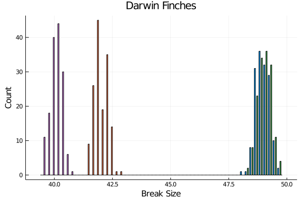
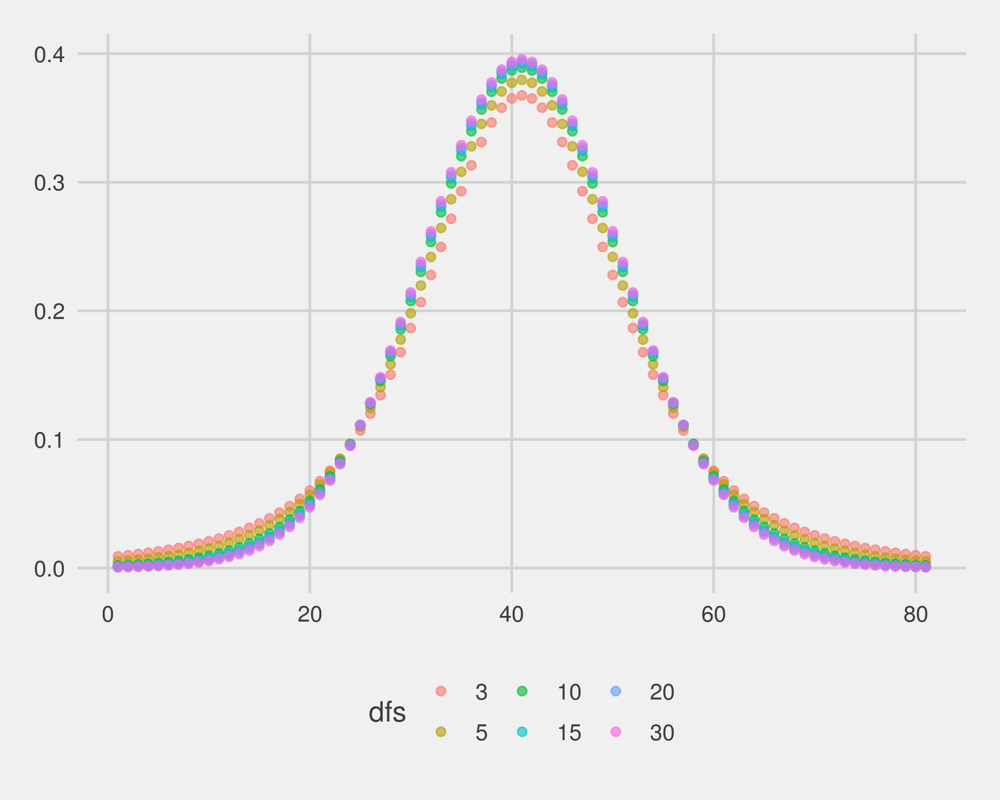
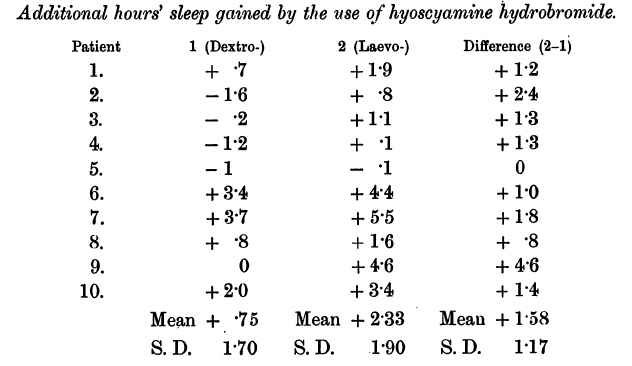
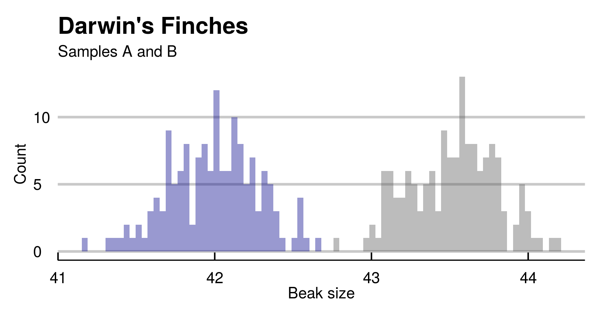

---
output:
  pdf_document: default
  html_document: default
---

  

# Capítulo 2 : Método hipotético-dedutivo e os tentilhões de Darwin  
**Testes estatísticos e distribuições probabilísticas**

## Parte 1 - Introdução

Charles Darwin observou que os pássaros tentilhões nas ilhas de Galápagos apresentavam variedades de formato e tamanho dos bicos. Sua intuição sobre a origem das variedades a partir de um ancestral comum foi um dos argumentos mais
contundentes em “On the Origin of Species” (1859).

Neste capítulo, simularemos dados para uma abordagem quantitativa do problema. Estudaremos medidas de bicos dos tentilhões em pequenas amostras de cada ilha e faremos inferências sobre as populações de origem (espécies diferentes).

  


\pagebreak

### Ilhas Galápagos

Em sua viagem a bordo do Beagle, Darwin descreveu um grupo de pássaros que habita as Ilhas Galápagos, arquipélago localizado a aproximadamente 900 km da costa do Equador (América do Sul). A variedade em tamanhos dos bicos chamou atenção: *É bastante notável que uma gradação quase perfeita na estrutura desse grupo possa ser traçada na forma do bico, desde um excedendo as dimensões do maior dos pardais bico-gordo, até outro diferindo pouco do papa-amoras.*[^4]

Ele observou que a variedade dos bicos era adaptada à dieta de cada grupo: frutas, nozes, insetos. Os de bico pontudo conseguem comer frutas e arilo da semente do cacto, enquanto os de bico curto estraçalham a base do cacto e comem sua polpa.

Antes da publicação de A origem das Espécies, o caso dos tentilhões (nome destas aves) já continha um embrião do processo de seleção natural. Na segunda edição, em 1845, ele especula sobre um grupo ancestral comum moldado por ambientes específicos:

*(...)[ao] ver esta gradação e diversidade em estrutura em um pequeno, intimamente relacionado grupo de pássaros, é possível imaginar que, a partir de poucos pássaros deste arquipélago, uma espécie foi escolhida e modificadas para certos fins.*[^5]


[^4]: *“It is very remarkable that a nearly perfect gradation of structure in this one group can be traced in the form of the beak, from one exceeding in **dimensions** that of the **largest** gros-beak, to another **differing** but little from that of a warbler".*[^4] Tradução livre. The Voyage of the Beagle (1839).
[^5]: *“Seeing this gradation and diversity of structure in one small, intimately related group of birds, one might really fancy that from an original paucity of birds in this archipelago, one species had been  taken and modified for different ends.”[^5]* Tradução livre. Darwin, Charles (1845), Journal of researches into the natural history and geology of the countries visited during the voyage of H.M.S. Beagle round the world, under the Command of Capt. Fitz Roy, R.N (2nd. ed.), London: John Murray


### Dúvidas - Hipóteses e observações

Darwin levou aproximadamente 20 anos entre a concepção inicial da ideia (1838) e a publicação da obra (1859). Ciente de que propostas semelhantes foram ridicularizadas, ele foi meticuloso na defesa de sua teoria sobre a origem das espécies.  

A observação dos pássaros na ilha era uma evidência, porém não confirmava a teoria. Darwin então traçou um plano de investigação para testar diversas consequências distintas da teoria.  
Distribuição geográfica, variabilidade fenotípica (hibridização e fertilização cruzada), variação sob domestição... Será que experimentos nessas áreas obedeceriam as predições?  

As duas décadas foram dedicadas a contatar e interagir com especialistas de diferentes áreas (da botânica à criação de pombos e coelhos). As evidências acumuladas falaram fortemente em favor da explicação darwiniana, que descrevia campos diferentes num modelo abrangente e simples. O trabalho de formiga consistia em explorar dados e em convencer outros cientistas a aceitarem a ideia. Isto durou até que Alfred Wallace antecipou algumas das consequências mais contundentes em 1855, as quais Darwin tinha evitado atacar diretamente. ("On the Law which has Regulated the Introduction of New Species", Annals and Magazine of Natural History).

Charles Lyell era um geologista, amigo de Darwin, e foi quem incentivou fortemente a publicação de uma exposição sólida da teoria. A teoria concebida 1938 para a origem das espécies poderia estar errada, ainda que as evidências do Beagle fossem promissoras. O estudo das hipóteses secundárias esclareceria a veracidade da teoria. As confirmações experimentais deram segurança para uma defesa convincente.  

**Probabilidades**  
É interessante notar que a linguagem usada para denotar diferenças é eminentemente quantitativa (no trecho acima: *dimensions*, *largest*, *differing*).  

Darwin observou a adequação dos bicos à dieta através de sua intuição, sem realizar medidas.  
A inspeção visual de um naturalista treinado foi capaz detectar essas nuances. Sob sua percepção, havia um total de **3 espécies** em 4 ilhas: 1 na Ilha Charles, 1 na Ilha Albemarle e 1 nas ilhas James e Chatham. Inicialmente, notou que os pássaros eram semelhantes àqueles vistos no Chile. Darwin coletou 26 pássaros e os levou de volta para que um ornitólogo os estudasse com mais detalhe. O especialista (John Gould) sugeriu que os 26 pássaros representavam 12 espécies completamente novas, número que posteriormente passou para 25. Hoje, os taxonomistas sugerem um número de **15 espécies**.  

---

Assim como o naturalista, examinaremos as diferenças para grupos distintos. Porém, usaremos estatística e probabilidades (distribuição normal e Student's t) para testar hipóteses e fazer conclusões mais acuradas sobre as medidas.

\pagebreak

### Falseabilidade e hipóteses  

Filósofos da ciência estudam características no modus operandi de outros estudiosos. O que há em comum entre os procedimentos empregados por biólogos e geólogos?  O que distingue Charles Darwin e Paul Dirac de John Dee e Edward Kelley? O que funciona em áreas distintas do conhecimento humano?

Adotamos a denominação coletiva de “ciências” para algumas áreas do conhecimento. Ainda, associamos a elas características em comum nos procedimentos e na estrutura interna. De alguma forma, cientificidade comunica credibilidade. Nas últimas décadas, filósofos discutiram a validade do problema de demarcar ciência de pseudociência e não-ciência.[^7]
Neste capítulo, vamos nos ater a um paradigma conceitual mais antigo e indiscutivelmente influente.

O método hipotético-dedutivo foi popularizado no século XX como uma bandeira de identificação associada ao trabalho científico. Um ciclo que consiste em formular teorias, desenhar experimentos, testar hipóteses falseáveis, verificar resultados e repetir o processo de forma iterativa.

O racional em usar hipóteses testáveis é de que proposições válidas sobre um sistema contém informações que ajudam a prevê-lo. Assim, "faz sol ou não faz sol amanhã" é uma proposição inútil, enquanto "faz sol amanhã" é uma proposição útil. Note que "faz sol amanhã" é uma hipótese testável (falseável), enquanto "faz sol ou não faz sol amanhã" é uma hipótese verdadeira independente das observações.  

Theophrastus(c. 371–c. 287 AC) e Eudemus(400 AC) originalmente delinearam o *modus tollens*.  
 
1 . Se a teoria é verdadeira, o fato X acontecerá,  
2 . X não aconteceu, *logo* a teoria é falsa.  

K. Popper foi um líder da revitalização do método hipotético dedutivo no século passado. Para ele, a dificuldade em gerar hipóteses testáveis e falseáveis sinalizava uma evidente fragilidade nas teorias. A liberdade para testar a veracidade de teorias é uma característica marcante da ciência em oposição a práticas esotéricas e/ou baseadas em autoridade.  
 
Popper atacou severamente o materialismo dialético de Karl Marx, assim como a teoria de evolução por seleção natural de Charles Darwin e a psicanálise.  

Estes ramos do conhecimento humano encontraram dificuldades com o critério de demarcação proposto. Marx previu que a revolução aconteceria em uma nação industrializada, através da classe operária e outros eventos que não se concretizaram. Seus seguidores usaram hipóteses *ad-hoc* para justificar as observações mantendo as previsões feitas à luz do materialismo dialético.  
A teoria da evolução por seleção natural de Darwin era amparada em muitos exemplos de reprodução impossível (e.g. recomposição da trajetória evolutiva em fósseis). A psicanálise também sofreu duras críticas, em virtude da irrefutabilidade de seus pilares centrais.

Como discutiremos nos próximos capítulos, hipóteses não são essenciais na vida do cientista. Entretanto, previsões falseáveis são extremamente úteis para evidenciar a utilidade de uma teoria. Um especialista tem sua credibilidade extremamente aumentada quando costuma acertar palpites em situações incertas e o mesmo vale para teoras científicas.   

Testes de hipóteses pode ser formalizados através de probabilidades e estatística, que incorporam aspectos quantitativos. Calculamos a probabilidade associada a observações, considerando o cenário de uma hipótese (falseável).  
Esse racional adequa ferramentas matemáticas robustas à plataforma epistemológica hipotético-dedutiva, sendo um modelo dominante de produção em ciências experimentais.  

[^7]:Massimo Pigliucci - Philosophy of Pseudoscience: Reconsidering the Demarcation Problem


#### Testes de hipótese  

Costumamos partir de uma hipótese base, chamada hipótese nula, que descreve o cenário menos interessante, isto é, a inexistência dos fenômenos propostos pelo cientista.  
É comum comparar dois grupos, A e B, quanto ao resultado de uma intervenção. A hipótese nula costuma assumir que os grupos apresentam resultados iguais.  
Queremos estudar o tamanho dos bicos de pássaros das ilhas A e B. A hipótese nula natural assume que as espécies são iguais: Não há diferença entre os bicos dos pássaros do tipo A e B.  
Medimos o bico de alguns pássaros dos dois grupos e calculamos a probabilidades de encontrarmos essas medidas considerando que A e B vêm de populações iguais.  
Se as diferenças forem grandes, a probabilidade é muito baixa. Rejeitamos nossa hipótese e aceitamos a alternativa (há diferença entre A e B).  


Estruturando os passos:

1. Definimos a hipótese nula ($H_{0}$) e pelo menos uma hipótese alternativa($H_{1}$).
  * $H_{0}$: Pássaros das ilhas A e B possuem bicos de tamanho igual.
  * $H_{1}$: Os pássaros possuem bicos de tamanho diferentes.

Então, podemos fazer um experimento, coletando medidas experimentais para o comprimento dos bicos. Essas medidas, junto a premissas matemáticas razoáveis, permitem especular: qual a probabilidade p de obter nossas observações considerando distribuições iguais entre A e B? Isto é, considerando $H_{0}$ verdade, nossos resultados seriam raros ou comuns?

Caso p seja menor que um limiar pré-definido (convencionalmente, 0.05), rejeitamos $H_{0}$. A probabilidade é muito pequena para $H_{0}$ ser verdade.

A domínio dos procedimentos hipotético-dedutivos nas ciências produziu resultados interessantes.
Especialmente no eixo de trabalho denominado por Thomas Kuhn de "ciência normal", focada no acúmulo de evidências e testagem de hipóteses. O ideal de desenhar um experimento imparcial, com possibilidade de fracasso, aguçou a percepção de pesquisadores para a falibidade de ideias.  
O grau de sofisticação em reprodutibilidade de procedimentos foi amplificada.  

#### Nota

*Usamos o limite inferior de 0.05 como critério para rejeitar a hipótese nula, o que pode parecer arbitrário. E é. Os valores p eram interpretados de acordo com sua magnitude e estatística com base em que foram calculados. Foi Ronald Fisher, em Statistical Methods for Research Workers (1925), quem propôs (e posteriormente popularizou) o número: "The value for which $p=0.05$, or 1 in 20, is 1.96 or nearly 2; it is convenient to take this point as a limit in judging whether a deviation ought to be considered significant or not.[^8]"*

[^8]: O valor [da estatística z em uma curva normal] para o qual $p=0.05$, ou 1 em 20, é de 1.96 ou aproximadamente 2; é conveniente pegar esse ponto como um limite ao julgar quando um desvio deve ser considerado significante ou não.


## Parte 2 - Darwins’s Finches e um teste paramétrico

Mostraremos como a contribuição individual de genes com efeitos aditivo de distribuição uniforme resulta em medidas aproximadamente normais para os bicos das aves.

Vamos simular as medidas de bicos em 4 amostras (n=150) de pássaros.
O tamanho dos bicos é dado pelo efeito aditivo de muitos genes semelhantes, portanto esperamos que sua distribuição seja normal pelo Teorema do Limite Central.

Uma cópia do gene adiciona x milímetros ao tamanho final. O valor de x é sorteado de uma variável aleatória de distribuição uniforme,  $X \sim U(0,1)$.
Pássaros têm um número fixo de n de genes aditivos em cada amostra, sorteado no intervalo entre 80 e 100. A medida final dos bicos é dada pela soma efeitos dos n genes. Esse número é fixo em cada população e varia entre populações.

Para simular os dados com as condições acima:

```julia
using Distributions , DataFrames , Random
Random.seed!(5)
n_birds = 150 # sample_size
genes_low = 80 # lower bound on number of genes
genes_hi = 100 # upper bound on numbe
n_islands = 4 #samples
# Função que soma distribuições uniformes (n=n_genes)
function unif_sum(n_genes)
          gene_samples = [rand(Uniform(0,1),100) for _ in 1:n_genes]
          effects_sums = sum(gene_samples)
          return effects_sums
        end
# Função para gerar n_pop indivíduos com n_genes
function generate_pop(;n_pop,n_genes)
          pupulation = [unif_sum(n_genes) |> mean for _ in 1:n_pop]
        end
# Gera amostras aleatórias com n_birds;
# n_genes de cada ilha varia entre genes_low genes_hi
galapagos_birds = map(x -> generate_pop(n_pop=n_birds, n_genes=x) ,
    rand( DiscreteUniform(genes_low,genes_hi), n_islands)) |> DataFrame
```

Como esperado, verificamos que o histograma das medidas finais se aproximam de uma gaussiana.

```julia
using StatsPlots
@df stack(galapagos_birds) groupedhist(:value, group = :variable,
      bar_position = :dodge,bins=50,title=("Darwin Finches"),
    xlabel="Break Size",ylabel="Count",legend=false)
```



Os números aleatórios gerados usando a semente sugerida (`Random.seed!(5)`), linha 4 do código acima) são semelhantes à suposição de Darwin: 4 ilhas (amostras) e três espécies (distribuições de bicos). Notamos que há duas amostras (roxo, vermelho) de medidas bastante parecidas e outras duas separadas (verde, azul).
Supondo que medimos os bicos de algumas aves, como saber se os grupos são diferentes?
Calculando as diferenças entre distribuições, podemos inferir se duas amostras têm o mesmo número de genes subjacentes! Para isso, usaremos um racional e algumas ferramentas novas.

\pagebreak

### Teste t e distribuição t de Student: Um exemplo prático

Para testar estatisticamente se as medidas são diferentes, executaremos um teste t para comparação dos grupos.

A distribuição t surge quando queremos entender quão improváveis são nossas estimativas ($\mu'$) supondo uma média real hipotética ($\mu$) de origem em uma variável de distribuição normal desconhecida.

**Exemplo**: Medimos os bicos de 30 pássaros. Obtivemos média amostral $\mu'$ = 38 mm e desvio-padrão $\sigma'$ = 0.3 mm.
**Problema**: Supondo que a média real ($\mu$) da população é de 40 mm, qual é a probabilidade de obtermos $\mu'$ = 38 mm em uma amostra aleatória, como aconteceu em nosso experimento?

Entender a imprecisão da estimativa de uma média foi o eixo principal para a descrição dessa distribuição por William Gosset. Sob o pseudônimo Student, o estatístico, que trabalhava para a fábrica de cerveja Guiness, publicou na Biometrika (1908) o famoso artigo *The probable error of a mean*.

Para entender a imprecisão, necessitamos de uma medida da dispersão dessas medidas.
Assumimos amostras retiradas de uma variável aleatória com distribuição normal com média $\mu$ e desvio-padrão $\sigma$.  Podemos retirar *j* amostras de tamanho *n* e calcular a média dessas amostras $\mu_{1}', \mu_{2}', ..., \mu_{j}'$. As médias amostrais $\mu'$ são estimativas da média real $\mu$.

Qual a dispersão das estimativas $\mu_{1}', \mu_{2}', ..., \mu_{j}'$?

Para um conjunto de estimativas $\mu_{1}', \mu_{2}', ..., \mu_{j}'$, chamamos de **erro padrão** (*standard error of the mean*) o desvio-padrão populacional $\sigma$ dividido pela raiz quadrada do tamanho da família de amostras em questão $(std. err. = \sigma/\sqrt{n})$.
Como não sabemos o desvio-padrão na população, aproximamos usando o valor do desvio-padrão $\sigma'$ amostral.

Student propôs o uso de uma quantidade para estimar a probabilidade de uma estimativa $\mu'$ dado um centro hipotético $\mu$.
Essa quantidade pivotal é a razão entre *(1)* distância das estimativas e média real, $\mu'$ - $\mu$, e *(2)* o erro padrão.
A estatística t:

$$t = \frac{Z}{s}=(\mu'-\mu)/\frac{\sigma}{\sqrt{n}}$$

Assim, a estatística t para nosso exemplo ($\mu$’=38; $\mu$= 40; n=30; $\sigma$’=0.3) é:
$$t = \frac{(38-40)}{\frac{0.3}{\sqrt{30}}}$$
Student (Gosset) mostrou que essa estatística segue uma distribuição probabilística (t de Student) definida por:

$$f(t)={\frac {1}{{\sqrt {\nu }}\,\mathrm {B} ({\frac {1}{2}},{\frac {\nu }{2}})}}\left(1+{\frac {t^{2}}{\nu }}\right)^{\!-{\frac {\nu +1}{2}}}$$

B é a função Beta[^9] e v são graus de liberdade.
Possui densidade parecida com a da distribuição normal, porém com probabilidades maiores para valores extremos. O parâmetro $\nu$ (graus de liberdade) expressa essa característica. Empiricamente é estimado pelo tamanho das amostras usadas na estimativa de $\mu'$.
Associamos uma amostra (tamanho n) retirada de uma população normal (tamanho arbitrariamente alto, $n \rightarrow \infty$) a uma distribuição t com $n-1$ graus de liberdade. Em nosso exemplo, $n=30$, então  $\nu = n-1 = 29$.

[^9]: A função Beta é aceita dois argumentos$(x,y)$ e seu resultado é a razão é entre (1) produto das funções $\Gamma(x) \Gamma(y)$ e (2) função gama da soma $\Gamma(x+y)$. A função $\Gamma$ generaliza o conceito de fatoriais (produto dos antecessores).



Maiores valores correspondem a amostras maiores e fazem com que a distribuição t se aproxime de uma distribuição normal. Em um caso extremo, temos $n_{samples}=n_{pop}$ e as amostras são idênticas à distribuição de origem.

Sabendo a estatística t (-36.51) e os graus de liberdade para nossa família de amostras ($\nu$ = 29), podemos usar a expressão $f(t)$ para saber a probabilidade de obtermos nossa média 38 mm numa amostra (n = 30) se a média populacional for de 40 mm.

Para tanto, somamos as probabilidades de valores extremos menores que a estatística t fornecida.
$$\int_{-\infty}^{-36.51}f(t)dt$$

Em julia, a função nativa *cdf* faz o trabalho sujo de calcular a integral:

```julia
using Distributions
cdf(TDist(29),-36.51)
    4.262182718504655e-2
```

Esse valor reflete a probabilidade de valores t negativos mais extremos (menores) que os nosso ($t < -36.51$).

#### Teste bicaudal

Parece ser nosso valor p, porém precisa de um ajuste: queremos saber a probabilidade associada a obter valores tão extremos em geral, não nos restringindo a valores extremamente menores.

Uma vez que a distribuição é simétrica, a cauda à esquerda (negativos) é idêntica à cauda à direita (positivos). Valores extremos (negativos ou positivos) em relação à média são duas vezes mais prováveis que valores negativamente extremos.
Consideramos significativos valores t muito maiores (direita) ou menores (esquerda) que a média. Então, nosso limiar deve ser robusto à possibilidade de extremos maiores que a estatística t simétrica positiva.

O valor $t=36.51$ seria a estatística resultante de uma amostra com média simétrica (42 mm) em relação à média (40 mm). Recorde-se de que a medida original foi 38 mm.

$(t_{min}= -36.51; t_{max} = 36.51)$.
Ao fazer esse ajuste, chamamos o teste de bicaudal.

Sabendo da simetria na distribuição t, podemos fazer então usar o seguinte truque:

```julia
2*cdf(TDist(29),-36.51)
  8.52436543700931e-26
```

Não é possível calcular diretamente as probabilidades para t = 36.51, pois Julia aproxima a integral acima $(p \sim 1 - 4.262^{-26}) \sim 1$.
```julia
cdf(TDist(29),36.51)
    1.0

```

#### Nota

*Uma percepção errônea comum sobre a distribuição t é de que ela descreve amostras pequenas retiradas de uma população com distribuição  normal. Qualquer amostra retirada de uma variável de distribuição normal terá, por definição, distribuição normal, ainda que seja composta por 1 ou 2 observações. O que segue distribuição t é a quantidade pivotal descrita acima.*

Na sessão IX do artigo, Student (Gosset) demonstra como seu insight pode ser usado para testar o efeito de isômeros da escopolamina como indutora do sono.[^10]  São usadas duas amostras (levo e dextro hidrobromido de hyoscyamina).



Usando dados de 10 pacientes que usaram ambas as substâncias e medidas da quantidade adicional de horas de sono observadas, “Student” calcula: (1) a probabilidade dos dados supondo média 0 em cada grupo e (2) a probabilidade dos dados supondo que a diferença das médias é 0.

O primeiro procedimento é idêntico ao que realizamos com a medida dos bicos e é chamado teste t de amostra única (*one sample t-test*). Hipotetizando um valor para a média (e.g. $\mu_{bico}= 40 mm; \mu_{sono adicional}= 0 horas$), calculamos as probabilidades de nossa estimativa.

O segundo procedimento é chamado de teste t de amostras independentes. Hipotetizamos um valor para diferença de médias entre duas populações $(\mu_{a}-\mu_{b}= 0)$ e calculamos a probabilidade de nossa estimativa. Exemplo prático: existe diferença de peso entre os bicos dos pássaros A e B?


[^10]:https://atmos.washington.edu/~robwood/teaching/451/student_in_biometrika_vol6_no1.pdf

\pagebreak

### Aplicações

Retornando ao nosso exemplo de Galápagos, faremos um teste t de amostras independentes.

1. As medidas em A e B são amostras de variáveis aleatórias com distribuição normal.
2. Definimos a hipótese nula e pelo menos uma hipótese alternativa.
    * $H_{0}$: Pássaros das ilhas A e B possuem bicos de tamanho igual.
    * $\mu_{a} - \mu_{b} = 0$
b. $H_{1}$: Os pássaros possuem bicos de tamanho diferentes.

O procedimento é semelhante ao anterior. Calculamos uma quantidade intermediária que segue distribuição t usando a estimativa amostral da diferença e erro padrão associado. Então, podemos especular: qual a probabilidade p de alguém obter nossas observações considerando distribuições de médias iguais $(\mu_{a} = \mu_{b})$? Esse teste infere a probabilidade para as populações de onde saíram as amostras.

Caso p seja menor que um limiar arbitrariamente pré-definido (convencionalmente, 0.05), rejeitamos $H_{0}$.A probabilidade de observarmos os dados é pequena se $H_{0}$ for verdade.
Obtemos o valor p somando os valores de probabilidades correspondentes às diferenças obtidas ou valores mais extremos. Caso a diferença entre valores seja grande, o valor da estatística crescerá. Isso implica uma baixa probabilidade de observar aqueles resultados se as amostras fossem semelhantes (vindas da mesma distribuição).

\pagebreak

#### Teste t de Student com Julia

Vamos computar um teste t para 2 amostras independentes. A estatística t é calculada com algumas mudanças.
Os graus de liberdade são somados e o erro padrão (dispersão das estimativas) é balanceado através da média ponderada (pelos graus de liberdade, n-1) entre amostras.

$$t = \frac{ X_{1} - X_{2}}{\sigma_{pooled}\sqrt{\frac{1}{n_{1}} + \frac{1}{n_{2}}}}$$

$$\sigma_{pooled} = \sqrt{ \frac{(n_{1}-1)\sigma_{1}^{2}+(n_{2}-1)\sigma_{2}^{2}}{(n_{1}-1)+(n_{2}-1)}}$$


Considerando $(n_{1}-1) + (n_{2}-1)$ graus de liberdade, calculamos a estatística t e o valor p correspondente para nossos graus de liberdade. Usando as amostras criadas anteriormente, correspondentes às  barras cinza (A) e azul(B), vamos plotar os histogramas.

```julia
@df stack(galapagos_birds[:,[:x1,:x2]]) groupedhist(:value, group = :variable,
    bar_position = :dodge,bins=50,title=("Darwin Finches"),
    xlabel="Break Size",ylabel="Count",legend=false)

```


```julia
# Ajustes nos dados
a = galapagos_birds[:,:x2]
b = galapagos_birds[:,:x4]
sd_a = std(a)
sd_b = std(b)
```

Aqui, ao invés de comparar as estimativas das médias de distribuição t para amostras A e B.
Calculamos a (1) Diferença esperada na vigência da hipótese nula ($\mathit{diff}_{H_{0}} = 0)$, (2) estimativa da diferença $(\mathit{diff} = \mu_{A}-\mu_{B})$, graus de liberdade (df) e erro padrão balanceado $(se_{pooled})$ para a distribuição das diferenças de médias.

```julia
expected_diff = 0
mean_diff = mean(a) - mean(b)
6.963886183171148
# graus de liberdade balanceados
df_pool = length(a) + length(b) - 2 
# desvio padrao balanceado
sd_pool  = sqrt(((length(a) - 1) * sd_a^2 + (length(b) - 1) * sd_b^2)/df_pool) 
```
A estatística t correspondente à diferença observada, considerando uma distribuição t com os parâmetros calculados acima.

```julia
    # Diferenca dividida por erro padrao
 # t-statistic  
t = (mean_diff - expected_diff)/ (sd_pool * sqrt(1/length(a) + 1/length(b))) 
```
Valor p para hipótese bicaudal (resultados extremos considerando a possibilidade de a diferença ser maior ou menor que 0):

```julia
p = 2*cdf(TDist(df_pool),-abs(t))
```

Finalmente, agregando o sumário dos resultados (médias A e B, diferença verificada, estatística t resultante, valor p):

```julia
results = Dict(
                "Mean Difference" =>mean_diff,
                "t"=>t,"p value" => p,
                "Mean in A" => mean(a),"Mean in B" => mean(b))
Dict{String,Float64} with 5 entries:
  "Mean Difference" => 0.46412
  "t"               => 16.7569
  "p value"         => 7.28163e-45
  "Mean in A"       => 42.9969
  "Mean in B"       => 42.5328
```

Obtivemos um valor p significativo (p < 0.001) usando n = 150. Os graus de liberdade são 149 (150 - 1) em cada amostra, sendo 298 ao total.
Podemos automatizar o processo em 1 linha:

```julia
using HypothesisTests
UnequalVarianceTTest(a, b)
Two sample t-test (unequal variance)
------------------------------------
Population details:
    parameter of interest:   Mean difference
    value under h_0:         0
    point estimate:          0.4641197814036815
    95% confidence interval: (0.4096, 0.5186)

Test summary:
    outcome with 95% confidence: reject h_0
    two-sided p-value:           <1e-44

Details:
    number of observations:   [150,150]
    t-statistic:              16.756889937632724
    degrees of freedom:       297.5604548062057
    empirical standard error: 0.02769725069097449

```

A estatística t e graus de liberdade apresentados pela implementação são idênticos aos que encontramos realizando o procedimento passo a passo.
Ao invés do valor exato $(p=1.23^{-179})$, recebemos a informação de que $p < 1e^{-99}$.
Diante do valor p obtido, concluiríamos que a distribuição dos dados como observada é improvável se for verdade a hipótese nula $H_{0}$ de que a diferença entre amostras é 0.

#### Exemplo de relatório

A diferença estimada entre tamanho médio dos bicos entre amostras A e B foi significativamente (p <0.05) diferente de 0 (t=47.28; df = 298).

|                 |Amostra A | Amostra B | valor p |
|-----------------|----------|-----------|---------|
| Média($\mu$)        | 43,52    | 41,99     | <0,001  |
| Desvio-padrão($\sigma$)| 0,28     | 0,28      |         |

#### Report example

The estimated difference of beak mean  sizes among samples A and B was significantly (p<0.05) different from zero (t = 47.28, df = 298)

|                 |Amostra A | Amostra B | valor p |
|-----------------|----------|-----------|---------|
| Mean ($\mu$)        | 43,52    | 41,99     | <0,001  |
| Std. Dev. ($\sigma$)   | 0,28     | 0,28      |         |


 

#### Nota


\pagebreak

### Exercícios

1. Usando o dataset simulado no capítulo:
* a. Execute teste T para cada par de amostras
* b. Quais testes apresentam p < 0.05?
    * i. Descreva estatística t, graus de liberdade e valor p.
        * 1. Como são os graus de liberdade dos diversos testes?
        * 2. Esses valores eram esperados para nossas amostras?
    * ii. Usando ggplot, plote histogramas para todos os pares comparados em apenas um painel. Dica: grid.arrange
    * iii. Plote boxplots para uma das comparações.
    * iv. A partir do gráfico anterior, adicione uma camada com violin plots (geom_violin) transparentes (alpha=0).
2. Usando o dataset iris
    * a. Escolha duas espécies e duas medidas.
    * b. Execute testes t para ambas as medidas
    * c. Reporte os resultados em uma tabela, incluindo média e desvio-padrão de ambas as medidas nas duas espécies.
3. Os dados usados por Student para escopolamina estão incluídas na biblioteca de base do R.
    * a. Examine os dados invocando “sleep”:  >sleep
        * i. Plote histogramas para as medidas em ambos os grupos
        * ii. Execute um teste t supondo média populacional zero ($\mu = 0$).
        * iii. Execute um teste t entre amostras, supondo a mesma média ($H_{0}:\mu_{1} = \mu_{2}$).
4. Gerando a distribuição t:
    * a. Simule um conjunto de muitas medidas (sugestão: 100,000) a partir de uma distribuição normal $(\mu = 0, \sigma = 1)$.
    * b. Retire 200 amostras de n=30 e salve as 200 médias (função sample).
    * c. Divida os valores por pelo erro padrão, $\frac{\sigma}{\sqrt{n}}$.
    * d. Retire 200 amostras de uma distribuição t com 29 graus de liberdade (função rt)
    * e. Plote o histograma superposto da distribuição obtida e da distribuição teórica

\pagebreak
