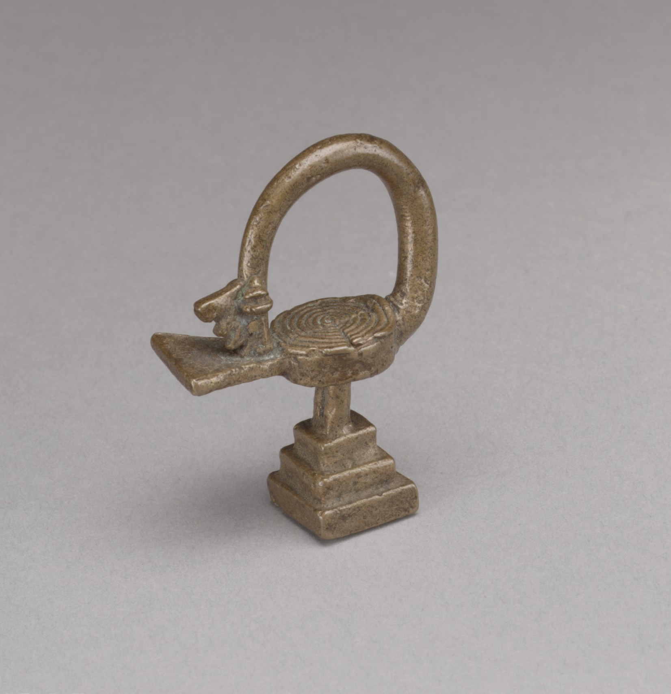

---
output:
  pdf_document: default
  html_document: default
---
  

\pagebreak

\begin{center}

\textbf{Inferência em Ciências e Aprendizagem de Máquina}  

\vspace{5cm}

Filosofia e aplicações com estatística e probabilidade.  

\vspace{5cm}

Felipe Coelho Argolo  
felipe.c.argolo@protonmail.com   

\vspace{2cm}

Londres, 8 de Julho de 2020  

\href{http://www.leanpub.com/fargolo}{Página oficial: https://www.leanpub.com/fargolo}  

\vspace{2cm}

Volume 1  
Segunda Edição  

\end{center}

\pagebreak

## Prefácio  

---  

*Lembre-se de que todos os modelos são errados\; a questão prática é quão errados eles precisam ser para não serem úteis*  
*Remember that all models are wrong; the practical question is how wrong do they have to be to not be useful*  
*George Box & Norman R. Draper, Empirical Model-Building and Response Surfaces*  

---  

Quando entramos no século XXI, os termos *inteligência artificial (artificial intelligence)*, *análise quantitativa (quantitative analysis)*, *aprendizagem de máquina (machine learning)*, *big data* e *ciência de dados* ganharam forte notoriedade em virtude de resultados inéditos em problemas de aplicação prática. Avanços técnicos em processamento de linguagem natural, visão computacional e outros campos foram rapidamentes implementados por engenheiros e pesquisadores em finanças, indústria e ciências.  
Estas soluções usam modelos estatístico-probabilísticos para modelar medidas empíricas. Um estudo sistemático do formalismo e das ferramentas envolvidas é volumoso (ver Lista de *Leituras recomentadas*). 

*Quod est inferius est sicut quod est superius. Et quod est superius est sicut quod est inferius, ad perpetranda miracula rei unius.*  
*"O que é inferior é como aquilo que é superior. E o que é superior é como aquilo que é inferior, perpetuando os milagres de uma coisa só.*
[^1]  

[^1]:Tábula Esmeralda. Tradução a partir de http://webapp1.dlib.indiana.edu/newton/mss/dipl/ALCH00017 Isaac Newton. "Keynes MS. 28". The Chymistry of Isaac Newton. Ed. William R. Newman. June 2010. Acessado em Junho de 2020   

Este texto introduz tópicos em filosofia, estatística e probabilidade usados na investigação científica. 
Os temas de aprendizagem de máquina e inteligência artificial estão ligados aos métodos aprendidos.   

## Prefácio à segunda edição  

Aproximadamente um ano se passou desde o lançamento da 1ª edição. Algumas modificações importantes foram incorporadas.  

**Julia** foi incluída como uma linguagem alternativa a **R**. É uma linguagem com uma comunidade menor, mas bastante promissora. Além de oferecer maior velocidade de execução, ela oferece uma sintaxe mais concisa para os exemplos. 

Um compilado com aplicações diversas dos conceitos exemplificados nos capítulos agora é disponibilizado para ambas as linguagens em um livro de receitas.     

Entrei em contato com o trabalho de Richard McElreath (Statistical Rethinking), o que resultou em frutos positivos: O capítulo 1 inclui uma segunda perspectiva (máxima entropia) para a utilização da distribuição normal em ciências naturais. O capítulo 4 foi restruturado para incluir uma abordagem mais geral do estudo de causalidade com grafos direcionados, usando o pacote/software **dagitty**. O capítulo 6 tem trechos relacionados à escolha de priors e avaliação de performance.   

Na primeira edição, o trabalho de Ron Eglash em etnomatemática influenciou no uso das cores verde e amarelo, associadas à Orumla e à divinação Iorubá, que usa números binários. Um dos problemas na primeira versão foi encontrar títulos que sintetizassem cada capítulo. Encontrar os Adinkras e os conceitos que eles representam foi um fortuito acontecimento.  

Os Adinkras são símbolos da Akan, incorporando abstrações ligadas a seus nomes, formas e também a elementos da cultura, como ditos populares.  

\pagebreak  

## Introdução   

**Adinkras**  

Os Adinkras, como a ave que ilustra a capa (Sankofa), são símbolos na cultura Akan. Eles representam conceitos e conhecimentos populares específicos, conectados à sua forma. Físicos teóricos também adotaram o nome para grafos representando as regras formais que regem partículas em modelo supersimétricos da gravidade.  
   
* Capítulo 1 - **ADINKRA HENE** (Adinkra Líder/Rei)  
Bases em estatística descritiva e a distribuição normal   

  

Formado por círculos concêntricos, é relacionado à inspiração e à criação dos outros Adrinkras.  
São introduzidas intuições básicas em estatística descritiva e probabilidade, ligadas a conceitos elementares da física. Partindo do estudos de Arquimedes sobre alavancas, formas de descrever amostras e variáveis aleatórias usando intuições básicas. Aborda também a relação entre ciências empíricas e a distribuição normal.  

* Capítulo 2 - **DWENNIMMEN** (Chifres de Carneiro)  
Testes de hipóteses   

  

Representa visão de dois carneiros lutando. O Chifres de Carneiro simbolizam força e humildade, pois carneiros lutam ferozmente contra outros pares e predadores, porém aceitam a morte.  
A identidade da ciência é fortemente ligada ao uso criterioso de experimentos para testar hipóteses. Elas abrem espaço para falhas.    
O *segundo capítulo* acompanha Charles Darwin em Galápagos. Darwin esperou 20 anos entre a concepção da teoria e sua publicação. Trabalhou incansavelmente para investigar se suas impressões não eram falsas. Este capítulo ilustra como o racional hipotético-dedutivo funciona para estudar hipóteses científicas. O teste *t* de Student é aplicado para comparação dos bicos de aves em Galápagos.  

* Capítulo 3 - **FUNTUNFUNEFU-DENKYEMFUNEFU** (Crocodilos siameses)  
Correlações e comparações.  

  

Os crocodilos que compartilham um estômago. Simbolizam unidade e cooperação. O *terceiro capítulo* destaca relações entre medidas.  
Aprenderemos correlações lineares ($\rho$ de Pearson) e tamanho de efeito (*D de Cohen*). Também são introduzidas alternativas não-paramétricas: $\rho$ de Spearman e teste U de Mann-Whitney).  
Usamos regressão para fazer predições usando *formas fechadas*. Resolvendo analiticamente as equações do modelo, encontramos uma estimativa única para os parâmetros envolvidos.   

* Capítulo 4 - **AKOMA NTOSO**(Corações ligados)  
Análise multivariada, modelos causais, confundidores, redução de dimensões e equações estruturais.     

  

Os corações conectados simbolizam concordância e entendimento mútuo. Com muitas variáveis (análise multivariada), grafos são a abstração base para relacionarmos conceitos. Estudamos regressão múltipla e sobre como lidar com covariáveis segundo um diagrama causal. O *quarto capítulo* introduz uma implementação formal do abrangente paradigma filosófico para **causalidade**. Colinearidade, confundidores, mediação e moderação. 
Também falamos sobre redução de dimensões e medidas latentes, com análise fatorial, análise de componentes principais (PCA) e equações estruturais (SEM).   

* Capítulo 5 - **NEA ONNIM NO SUA A, OHU**  
Redes neurais   

  

"Aquele que não conhece pode conhecer pela aprendizagem". O *quinto capítulo* introduz redes neurais, que parte de várias unidades simples e vazias, processando entradas para aprender padrões. Começamos da inspiração biológica dos neurônios artificiais e da primeira máquina inteligente da história: o *Mark I Perceptron*. Codificamos um Mark I virtual, que usa uma nova forma de estimar parâmetros: *gradient descent*. Ao invés de usar uma fórmula fechada, usamos derivativas para 'caminhar' em direção ao mínimo progressivamente.  

Redes Neurais expandem o poder de um neurônio com múltiplos nodos para a construção de sistemas preditivos complexos. Redes profundas incluem camadas sucessivas, permitindo transformações em sequência para resolver classes mais gerais de problemas. Entendemos como os neurônios podem propagar erros aos outros, otimizando gradientes em conjunto com o mecanismo de *backpropagation*. Também codificaremos uma rede neural, Mark II.  

* Capítulo 6 - **SANKOFA** (San - Voltar; Ko - Ir ; Fa - Procurar, pegar)  
Modelos Bayesianos   

  

O Adinkra está ligado a retornar ao passado e aprender com ele. O provérbio diz "Não há nada de errado em aprender com o passado". Modelos Bayesianos incorporam informações prévias (*prior*) em sua formulação.  O *sexto capítulo* discute o suposto embate entre as escolas de probabilidade **frequencista** e **bayesiana**. O contexto é dado por alternativas ao método hipotético dedutivo: Carnap demonstra a dificuldade de refutações, Feyerabend propõe uma anarquia epistemológica amparada em fatos históricos e W. van Quine pinta um sistema entrelaçado para teorias, hipóteses e observações. Reabordamos alguns exemplos anteriores usando Stan para inferência bayesiana.  
Exploramos uma terceira forma de estimar parâmetros. Sem fórmulas fechadas, usamos o poder das simulações estocásticas (*Markov Chain Monte Carlo*).  

\pagebreak

## Sumário

Capítulo 1 - ADINKRAHENE - Centro e dispersão    
 
  * Centro e dispersão
	* Média e variância
  * Distribuição normal
  * Ciência experimental e o Teorema do limite central
  * Momentos

Capítulo 2 - DWENNIMMEN (Força e humildade) - Método hipotético dedutivo e os tentilhões de Darwin 

  * Pássaros em Galápagos
  * Método hipotético-dedutivo e Testes de hipótese
    * Valor p
    * Distribuição t de Student e teste t

Capítulo 3 - FUNTUNFUNEFU-DENKYEMFUNEFU (Crocodilos unidos) - Sobre associações  

  * Prelúdio: Quem precisa do valor p?
  * Tamanho de efeito: D de Cohen
  * Correlações lineares
    * Coeficiente de correlação $\rho$ de Pearson
    * Predições com regressão linear
  * Correlações e testes não paramétricos
    * $\rho$ de Spearman
    * Teste U de Mann Whitney

Capítulo 4 - AKOMA NTOSO (Corações conectados) - Análise multivariada, grafos e inferência causal 

  * Regressão múltipla
    * Colinearidade
  * Grafos e trajetórias causais
    * Mediação e moderação
    * Análise fatorial
    * Equações estruturais
    
Capítulo 5 - NEA ONNIM NO SUA A, OHU (Aquele que não conhece pode conhecer pelo aprendizado) - Neurônios

  * Regressão logística
  * Um neurônio artificial: O perceptron
    * História e implementação do zero : Mark I
  * Redes Neurais e Deep learning (múltiplas camadas)
  * Gradient Descent
  * Backpropagation

Capítulo 6 - SANKOFA (Voltar e buscar) - Contexto e inferência Bayesiana  

  * Probabilidades
    * Frequencistas e Bayesianos
  * Muitos métdos científicos: Feyerabend, Carnap e Quine
  * Inferência Bayesiana
    * Teorema de Bayes
    * Intuições: prior, likelihood, posterior e probabilidades marginais
    * Comparação de amostras com distribuição normal
    * Correlação linear
  * Estimadores e Métodos Markov Chain Monte Carlo
    * Soluções fechadas, Gradient Descent e MCMC
    
\pagebreak

## Pré-requisitos

Todos os exemplos podem ser reproduzidos usando software livre.  

### Leitura recomendada:

Filosofia e divulgação científica

* Surely You're Joking, Mr. Feynman
* O mundo assombrado pelos demônios - Carl Sagan
* A lógica da pesquisa científica - K. Popper
* A estrutura das revoluções científicas - Thomas Kuhn
* Contra o Método - Paul Feyerabend
* Dois dogmas do empiricismo - Willard van Quine
* Stanford Encyclopedia of Philosophy - https://plato.stanford.edu/
* The Open Handbook of Formal Epistemology - https://jonathanweisberg.org/post/open-handbook/

Neurociências  

* Principles of neural science - Eric Kandel

Matemática/computação  

* Coleção '*Fundamentos da matemática elementar*'
* Statistical Rethinking. A Bayesian Course with Examples in R and Stan, Richard McElreath.
* Bioestatistica sem segredos. Annibal Muniz.
* What is mathematics - Courant & Robbins
* Better Explained ( https://betterexplained.com/ )
* http://material.curso-r.com/
* R Graphics Cookbook
* R Inferno
* Learn you a Haskell for Great Good
* Layered Grammar of Graphics - Hadley Wickham.
* Algorithms unlocked
* Online: Statsexchange, stackoverflow, mathexchange, cross-validated.
 
Machine Learning  

* An Introduction to Statistical Learning: with Applications in R
* Neural Networks and Learning Machines - Simon Haykin
* Stanford (computer vision): http://cs231n.stanford.edu/
* Oxford 2015 (Deep learning): (https://www.youtube.com/watch?v=dV80NAlEins&list=PLE6Wd9FR--EfW8dtjAuPoTuPcqmOV53Fu) 

\pagebreak

**Agradecimentos**

Minha família, Suzana, Paulo, Isaac e Chris. Amigos Pedro, Gabriel, Guilherme, Wei.  

Aos professores: Carla Daltro, Anibal Neto, Lucas Quarantini, Luis Correia, Rodrigo Bressan, Ary Gadelha.  

Aos colegas Fatori, Luccas, Macedo, Walter, Rafael, Sato, Hiroshi, Lais, Luci, Davi, n3k00n3 (Fernando), Loli (Lorena).

Para comentários, críticas, sugestões, ou simplesmente dizer *oi*: felipe.c.argolo@protonmail.com.  

\pagebreak
