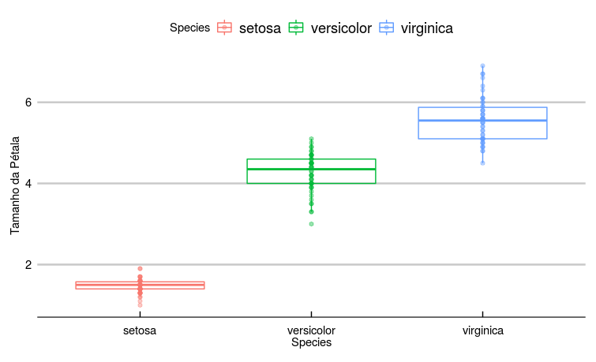

---  
output:
  pdf_document: default
  html_document: default
---  


# Capítulo 1 : Centro e dispersão

## Introdução 

No capítulo inicial, entraremos em contato com os elementos básicos de nossa jornada. O ADINKRAHENE é composto de três círculos concêntricos e este capítulo tem três partes.  

Primeiro, partimos do conceito físico de *momentos* e aprendemos sobre o centro e a dispersão de distribuições e amostras. Introduzimos **R** para calcular média e variância.  

Em seguida, estudaremos a relação natural entre a distribuição normal e a distribuição *t*, ligadas entre si. A adoção da distribuição normal em trabalhos científicos é bastante popular. Para entender os motivos, o Teorema do Limite Central e o conceito de entropia são fundamentais.  Usamos a linguagem **Julia**.  

A terceira parte apresenta visualização de dados com gramática dos gráficos e possui exemplos em ambas as linguagens.   

\pagebreak  

## Parte 1 - Centro, dispersão, média e variância  

  

### Um breve mergulho na física: Momentos  
[^13]  

O conceito físico de momento foi originalmente concebido por Arquimedes. Embora não tenha inventado a alavanca, ele descreveu os princípios matemáticos por trás dela.  

Em *Sobre o equilíbrio dos planos*, Arquimedes declara que *Magnitudes ficam em equilíbrio quando em distância reciprocamente proporcional aos seus pesos.*  


Essa é a conhecida Lei da alavanca. Dado um ponto de apoio e um plano sobre ele, aplicamos uma força em qualquer local do plano. O momento (torque) resultante é o resultado da multiplicação da grandeza física $(F)$ pela distância até o ponto fixo $(d)$.  
$M = F*d$  

Supondo uma força constante, quanto mais nos afastamos do ponto fixo, maior o momento resultante. Posteriormente, os físicos  estenderam o conceito para outros domínios. Por exemplo, um objeto com cargas opostas $-q$ e $+q$ separados por uma distância $d$ possui momento (momento dipolar elétrico) análogo:  
$M = q*d$  
De uma maneira geral, *falamos em momento ao multiplicarmos uma grandeza física por uma distância*. 

\pagebreak

#### Momento resultante 


No caso da alavanca, vimos que cada força aplicada sobre o objeto está associada a um momento(torque). Sabemos que a gravidade atua sobre cada pedaço com massa compondo o todo. Podemos então calcular o momento resultante somando os momentos de todos os $N$ pontos. Seja $F_{i}$ a função descrevendo a força em cada i-ésimo:
$$M = \sum_{i=1}^{N} F_{i}d_{i}$$  

Um sistema, como o pássaro apoiado sobre o dedo, está em equilíbrio quando a soma dos momentos em relação ao ponto fixo é zero. Para cargas elétricas, o sistema é apolar quando o momento é zero. Na figura abaixo, vemos como a molécula de $CO_{2}$ é apolar, enquanto a molécula de água é polar:  

  

Os momentos descritos acima são expressões do *primeiro momento*, uma vez que a grandeza é multiplicada pela distância com expoente 1: $d = d^{1}$. 

Podemos calcular outros momentos, exponenciando o componente espacial (distância). Vamos estudar agora momentos de massa de um objeto unidimensional:  

O **momento zero** de massa para um objeto é $M_{0} = \sum_{i=1}^{N} m_{i}d_{i}^{0}$. Como $d^{0}=1$, temos $M_{0} = \sum_{i=1}^{N} m_{i}$, que é simplesmente a soma das massas de todos os pontos. O momento zero é a **massa total**.  

$$M_{0} = m$$

O **primeiro momento** de massa para um objeto é $M_{1} = \sum_{i=1}^{N} m_{i}d_{i}^{1}$ e determina o **centro de massa** em relação à dimensão $d$. É o ponto em que está o dedo em que se equilibra o pássaro da foto.  

$$M_{1} = C_{m}$$

O **segundo momento** de massa é $M_{2} = \sum_{i=1}^{N} m_{i}d_{i}^{2}$ e é o **momento de inércia**. Corresponde à resistência do sistema a rotações. Perceba que os termos $d_{i}^{2}$ estariam presentes nas área de um círculo com centro idêntico ao do objeto e raio igual à distância para o centro: $\pi d^{2}$. A resistência total a rotação é análoga à resistência oferecida pelos raios destes círculos imaginários[^14].


O n-ésimo momento é dado por $$M_{n} = \sum_{i=1}^{N} m_{i}d_{i}^{n}$$.

[^13]:Pappus de Alexandria, Synagoge, Livro VIII
[^14]: https://physics.stackexchange.com/a/371165/218274 . Apesar de "momento de inércia" ser mais popular, "inércia rotacional" é um termo que reflete melhor a abstração.  

### Generalizando momentos 

Calculamos alguns momentos para objetos físicos (momento zero: massa total, primeiro momento: centro de massa, segundo momento: momento de inércia).  
Podemos generalizar o conceito e calcular momentos de entidades abstratas, como variáveis aleatórias. **Melhor: já fizemos isso anteriormente!**  

Seja $f(x)$ a função que descreve uma distribuição de probabilidades para a variável,  

Assim como o **momento zero** representa a soma da contribuição de cada ponto para a massa (massa total), aqui ele representa a soma das probabilidades possíveis, a probabilidade total (1).  

O **primeiro momento** corresponde ao centro de massa na mecânica estática. Para probabilidades, é o centro, a **média**.    

O **segundo momento** corresponde ao momento inercial e é a **variância**.  
Os momentos **terceiro** e **quarto** normalizados informam sobre assimetrias *(skewness)* e peso de valores extremos *(kurtosis)*.  

Formalmente, seja $d(x,x_{0})$ o valor da distância ao centro $x_{0}$ de referência $(x-x_{0})$, o n-ésimo momento $\mu_{n}$ é definido por:  

$$\mu_{n}= \int_{-\infty}^{\infty} d(x,x_{0})^{n}f(x)dx$$  

A integral acima corresponde à versão contínua da soma de partes discretas apresentadas antes para uma grandeza física, como a massa: $M_{n} = \sum_{i=1}^{N}d_{i}^{n}m_{i}$  

**Momento zero**: $$\mu_{0}= \int_{-\infty}^{\infty} d(x,x_{0})^{0}f(x)dx$$ 
A soma de todas probabilidades de uma distribuição deve somar 1.  
$$= \int_{-\infty}^{\infty} f(x)dx = 1$$.   
**Primeiro momento**: $\mu_{1}= \int_{-\infty}^{\infty} d(x,x_{0})f(x)dx$ , supondo centro em 0 $(x_{0}=0)$, temos a média, $$ \mu_{1} = \int_{-\infty}^{\infty} xf(x)dx$$, também chamado valor esperado $E[X]$. Estende a intuição de somar as medidas e dividir pelo número de observações ao passo em que usamos uma integral para somar as infinitesimais possibilidades para $f(x)$.    

**Segundo momento**: $$\mu_{2}= \int_{-\infty}^{\infty} d(x,x_{0})^{2}f(x)dx$$. A soma dos quadrados dos desvios, nossa variância, $$\sigma^{2} = E[(x-\mu)^{2}]$$.  

\pagebreak  

## Computadores

<div style="text-align: right"> Master Foo and the Shell Tools[^1] </div>

---

*Um aprendiz do caminho Unix veio ao Mestre Foo e disse: “Estou confuso. Não é o caminho
Unix que cada programa deve se concentrar em uma coisa e fazê-la bem?  
Mestre Foo assentiu.  
O aprendiz continuou: “Também não é do caminho Unix que a roda não deve ser reinventada?  
Mestre Foo assentiu novamente.  
“Então, por que existem diversas ferramentas com capacidades similares em processamento de texto: sed, awk e Perl? Com qual delas posso praticar melhor o caminho Unix?”  
Mestre Foo perguntou ao aprendiz: “Se você tem um arquivo de texto, qual ferramenta usaria para produzir uma cópia com algumas palavras trocadas por uma string de sua escolha?”  
O aprendiz torceu o nariz e disse: “As expressões regulares de Perl seriam um excesso para tarefa tão simples. Eu não conheço awk, e venho escrevendo scripts sed nas últimas semanas. Como tenho experiência com sed, eu preferiria ele no momento. Mas se o trabalho precisa ser feito apenas uma vez, um editor de textos funcionaria.”  
Mestre Foo assentiu e respondeu: “Quando você estiver com fome, coma; quando estiver com sede, beba; quando estiver cansado, durma.”  
E, ao ouvir isso, o aprendiz foi iluminado.*

[^1]: http://catb.org/esr/writings/unix-koans/shell-tools.html

\pagebreak


Ao longo do texto, usaremos exemplos com software. Computadores são úteis para acelerar os cálculos necessárias para nossos objetivos.

Há milênios, o homem usa instrumentos, como ábacos e tabelas, para fazer operações extensas e precisas envolvendo grandes números. Diante de um problema ou operações a serem computadas, esses mecanismos automatizam partes do processo devido à maneira como foram construídos. A principal diferença destas ferramentas para os computadores de hoje é que nossas máquinas podem ser programadas para fazer computações arbitrárias.

Ada Lovelace (*10 December 1815 – 27 November 1852*) foi a primeira a descobrir essa possibilidade. Estudando a Máquina Analítica de Charles Babbage, Ada concebeu uma maneira de realizar computações para as quais a máquina não havia sido desenhada originalmente. O programa concebido calculava os Números de Bernoulli. Discutivelmente, alterar a estrutura de máquinas mais simples também consiste em reprogramá-las.

Máquinas desse tempo pesavam toneladas e eram muito mais lentas. O avançar dos anos tornou a tecnologia mais acessível, ao ponto de possibilitar computadores pessoais de alta potência e baixo-custo. Além disso, ao invés de operações mecânicas complexas, podemos usar linguagens de programação que traduzem comandos baseados no inglês para instruções de máquina.

Os programas aqui apresentados são escritos em R e Julia. São linguagens voltadas à computação estatística, possuindo ferramentas úteis. Sendo linguagens de ‘alto nível’, não temos sobrecarga cognitiva no programador com manejo de memória e hardware no código. A abstração de detalhes físicos, como registradores da CPU, são feitas automaticamente pelo interpretador. O ecossistema para visualização de dados possui poder e flexibilidade. A comunidade de ambas cresce rápido, com bases grandes de suporte. Ambas suportam estilos funcional, orientado a objetos e imperativo.  

---  

#### R

Instruções para download e instalação podem ser encontradas em:
https://cloud.r-project.org/
Em Windows, o processo costuma consistir em clicar no executável de instalação e concordar com os prompts.
Para Linux, envolve adicionar o CRAN à lista de repositórios e baixar o pacote *r-base* ou o código-fonte/tarball diretamente do website.

#### Rstudio

Com o R instalado, recomendo o uso do ambiente de desenvolvimento RStudio ( https://www.rstudio.com/ ) para obter algumas facilidades. Entre elas: atalhos *vim*, editor com highlight de sintaxe, autocompletar, renderização em tempo real de animações e plots, visualização de datasets, ambiente de desenvolvimento, logs, suporte a markup languages, como Markdown, RMarkdown e Latex.[^2]

[^2]: Este texto é escrito em Markdown e o código-fonte pode ser encontrado em https://github.com/fargolo/stat-learn  

---  

## Média e Variância

Podemos definir a função da média para um vetor de números, dado pela (1) soma dividida pelo (2) tamanho do vetor:  

```r
    >mean_vec <- function(x){
      sum(x)/length(x)
    }
    >mean_vec(b) # Anteriormente definido por b <- c(2.2, 4.4, 5.5) 
    [1] 4.033333
```

sum(x) retorna a soma de todos os elementos do vetor x. length(x) retorna o tamanho (número de células) do vetor x.  

Como descrito anteriormente, a média é uma medida de tendência central para um conjunto de observações. É o ponto mais perto de todos os outros.  

#### Muitas formas de calcular a variância

Também podemos calcular uma medida relacionada ao quanto nossos valores se afastam do centro. 

Primeiro, calculamos uma distância entre cada elemento x e a média das observações $\mu$. A noção de distância implica que ela deve ser um valor positivo. Supondo que x e $\mu$ são medidas num espaço ordenado, podemos usa o módulo da diferença entre os valores: $\|x -  \mu\|$. Ainda, podemos usar o quadrado da diferença: $d_{i} = (x_{i} -  \mu)^{2}.$   

A variância $\sigma^{2}$ das observações é uma medida da dispersão de toda a amostra.  
Para calcular $\sigma^{2}$, somamos todas as distâncias $d_{i}$  e dividimos o resultado por $n-1$.  

```r
    >var_2 <- function(x) sum((x - mean(x))^2) / (length(x) - 1) 
    >var_2 (b)
    [1] 2.823333
```
Sendo proporcional às distâncias dos valores em relação à média, a variância $\sigma^{2}$ tende a ser maior quando os valores são muito distintos entre si:  

```r
    >c <- c(100,200,1,45,-24)
    >var_2(c)
    [1] 7966.3
```

Outra medida de dispersão, dada nas unidades originais da medida observada, é o desvio-padrão $\sigma$, dado pela raiz da variância $\sigma^{2}$.  

```r
    >var_2(b) %>% sqrt
    [1] 1.680278
```

A divisão por $(n-1)$ ao invés de $n$ é uma correção aplicada para não subestimarmos o valor populacional da variância ($\frac{\sum_{1}^{n}(x - \mu)^2}{n}$) quando usamos uma amostra ($\frac{\sum_{1}^{n}(x - \mu)^2}{n-1}$).  

### Vetores, loops e recursões

Anteriormente, definimos a função para calcular variância como:  

```r
    >var_2 <- function(x) sum((x - mean(x))^2) / (length(x) - 1)
```

Isso só é possível porque o R aplica funções a vetores de maneira automática. 
Assim, a expressão *(x - mean(x))^2* subtrai a média de cada elemento do vetor x.  
Normalmente, é necessário usar estruturas recursivas para isso. 
O laço for (for loop) define uma sequência de tamanho n definido e repete um bloco de comandos n vezes. 
Se queremos imprimir números entre 1 e 10:  

```r
    >for (i in 1:10) print(i)  
    [1] 1
    [1] 2
    [1] 3
    (...)
    [1] 8
    [1] 9
    [1] 10
```

A instrução avalia print(i) para valores i=1,2,3..,10 de forma repetida.  
Vamos reescrever nossa função para calcular variância $\sigma^{2}$ usando um loop. Podemos definir um loop com o tamanho do vetor x e calcular o quadrado da diferença em cada elemento.   
Assim,  

```r
    var_3 <- function(x){
      #vetor vazio para armazenar distâncias
      accumulator <- numeric() 
      # loop começa em 1 segue até o tamanho do vetor fornecido
      for (i in 1:length(x)) 
      # calcula e armazena distâncias.
    	accumulator[i] <- (x[i] - mean(x))^2 
    	#calcula media
      return (sum (accumulator) / (length(x) - 1) ) 
    }
```

Ambas definições apresentam o mesmo resultado que a implementação nativa:  

```r
    > var(b)
    [1] 2.823333
    > var_2(b)
    [1] 2.823333
    > var_3(b)
    [1] 2.823333
```

Ainda, uma maneira de manipular muitos elementos é através de funções de alta ordem. Estas funções recebem outras funções como argumentos. Um exemplo é a função map da lib purrr. Definimos uma função para a distância, $f(x) = (x - \mu)^{2}$, e aplicamos em todos os elementos. Só então, somamos os resultados e dividimos por n-1.  

```r
    >y_mean <- mean(a)
    # Aplica função de distâncias e armazena valores
    >sq_dists <- purrr::map_dbl(.f = function(x) (x - y_mean)^2, 
    .x = a)
    # Somaas distancias e divide por n-1
    >sum(sq_dists)/(length(a) - 1) }
```  

Quando usamos o pipe, o caractere de ponto (.) se refere ao valor fornecido como entrada pela pipe anterior. Assim, sum(.), no exemplo a seguir, soma os valores passados pela função *map*.  
Nossa função pode ser escrita:  

```r
    var_4 <- function(arg){
    y_mean <- mean(arg)
    purrr::map_dbl(.f = function(y) (y - y_mean)^2, .x = arg) %>%
    sum(.)/(length(arg) - 1) }
    > var_4(b)
    [1] 2.823333
```

\pagebreak

### Exercícios  

1. Qual a diferença entre linguagens compiladas e interpretadas?  
2. Um programa escrito em R pode ser escrito em qualquer outra linguagem. Está afirmação é verdadeira? Por quê?  
3. Cite 3 recursos que uma IDE fornece ao programador.   
4. Modifique o tema de fundo do RStudio para um de cor escura (menos luz para os olhos :) ).  
5. Aplique as funções sd, mean e var em amostras normais aleatórias de n = 10, 30, 100 e 300. A função rnorm (n,mean,sd) pode ajudar. Compare os valores da distribuição de origem com os obtidos.  
6. *UnLISP it!* Transforme as seguintes expressões, substituindo parênteses aninhados pelo operador pipe (%>%) quando julgar conveniente:
  * >round ( mean ( c(10 , 2, 3 ) ) )
  * >round (mean ( rnorm (n = ceiling (runif (1,0,10)))))
  * >paste("a",seq(1:max(sample(1:10))))
  * >round(nrow(iris) + exp(1), digits = ceiling(runif(1,0,10)))
7. Usando o código das funções var_2 (vetorizado), var_3 (for loop) e var_4 (função de alta ordem map)  
  * Escreva as funções correspondentes (sd_2, sd_3, sd_4) para desvio-padrão e compare com a função padrão do R (sd). Dica: Basta aplicar raiz quadrada ao valor final retornado anteriormente! 
8. Usando o dataset iris  
  * Selecione apenas os exemplos com tamanho de pétala maior que 4.
  * Selecione os 10 maiores exemplares. Suponha que o tamanho é dado pela média das 4 medidas fornecidas. 
  * Calcule a média e o desvio-padrão para duas medidas em cada espécie.
  * Faça um scatterplot entre duas medidas
    * Adicione cores de acordo com a espécie
    * Adicione o rótulo de texto a um dos pontos
    * Mude títulos (principal, eixos x e y, legenda)
    * Mude o tema de fundo. Dica: experimente os temas da lib *ggthemes*
9. Usando loops, escreva uma função que retorna uma aproximação de $e$. 
  * Lembre-se de que $e = \lim_{n \rightarrow \infty} (1+\frac{1}{n})^n$.  


\pagebreak

---  

## Parte 2 - A distribuição normal e um curioso teorema

Em trabalhos empíricos, é comum a suposição de que medidas de uma variável aleatória vêm de uma população com distribuição normal. A seguir, vamos estudar o comportamento dessa função probabilística.

Abraham de Moivre (26 May 1667 – 27 November 1754) , sem financiamento exclusivo para estudos e pesquisa, prestava serviços secundários. Entre eles, cálculos de probabilidades em jogos de azar para clientes. Em 1733, de Moivre percebeu que as probabilidades de uma distribuição binomial, como o lançamento de moedas $(p(cara) = p(coroa) = 0.5)$, aproximam-se de uma curva suave (contínua) à medida em que a quantidade de eventos aumenta.


A distribuição de Bernoulli descreve a possibilidade de dois eventos, como o lançamento de moedas. Tomando os valores dicretos de caras (0) e coroas (1), a observação é $1$ com probabilidade $p$ e $0$ caso contrário $(1-p)$.
Para uma moeda honesta, temos uma distribuição probablística uniforme sobre o domínio, $X={0,1}$:  $P(1) = P(0) = 0.5$.

Se somarmos distribuições de Bernoulli, obtemos a distribuição binomial. Cada observação é um conjunto de lançamentos. Tomando $p=0.5$, resultados mais frequentes são números parecidos de caras (0) e coroas (1).

Para $n = 10$, é muito mais provável obter um número de caras próximo a 5 (centro das curvas) que um resultado com 9 ou 10 lançamentos iguais. É possível demonstrar que aumentar o valor de n faz que com que a distribuição se aproxime da seguinte curva contínua:


De Moivre intuiu que a distribuição de binomiais com muitos lançamentos aproximava o de uma função suave.
Ele buscava uma aproximação em termos da função exponencial [natural] $e^x$.

Mas quais os parâmetros da curva?

Primeiro, de Moivre deduziu a solução para o problema das moedas $(p = \frac{1}{2})$. A seguinte expressão geral descreve a probabilidade $P(x)$ correspondente à curva que procuramos, conhecida como *gaussiana*.

$$f(x) = \frac{1}{\sqrt{2\pi}}e^{-\frac{x^{2}}{2}}$$

Em que $e$ é número de Euler $(e \sim 2.72…)$.

---  

O valor $\frac{1}{\sqrt{2\pi}}$ surge como normalizador para avaliarmos a função como densidade de probabilidade (A integral de $-\infty$ a $+\infty$ deve ser 1). O valor $\pi$ surge da integral de Gauss para $e^{-x^{2}}$ e decorre do fato de $2\pi i$ ser período da função $e^{x}$:
$$\int_{-\infty}^{+\infty} e^{-x^{2}}dx = \sqrt{\pi}$$   

---  


**Intuições**
A definição possui um fator constante $\frac{1}{\sqrt{2\pi}}$ (aproximadamente 0.4), multiplicando o resultado da exponencial no formato $e^{-x}$.
Em Julia, podemos definir a função e observar a probabilidade associada a alguns pontos em torno do máximo ($f(0)=0.4$):

```julia
mgauss(x) = 0.4*exp((-1)*(x^2)/2)
mgauss(-2), mgauss(-1), mgauss(0) , mgauss(1) , mgauss(2)
    (0.054134113294645084, 0.2426122638850534, 
    0.4, 0.2426122638850534, 0.054134113294645084)
```

Em seguida, obter alguns valores no intervalo $[-5,5]$ e plotá-los, dando origem à curva gaussiana anterior.

```julia
using Plots
gauss_values = map(mgauss,-5:0.1:5) 
plot(gauss_values,xaxis=("Gaussian"),leg=false)
```

Observamos como a distribuição se dá a partir da equação.

Já que $x^{2}$ retorna apenas valores positivos, $-x^{2}$ sempre retorna negativos. A função retorna valores entre 0 e 1 exponenciando $(e \sim 2.718...)$ a um fator negativo quadrático $(y \sim 0.4*e^{-x^{2}/2})$.

Notamos também que valores próximos ao centro $(x \sim \mu = 0)$ fazem com que o expoente se aproxime de 0, maximizando nossa função: $f(0) = 0.4 * e{-x^{2}/2} = 0.4 * e^{0} = 0.4)$. O valor obtido (0.4) corresponde ao topo da curva no gráfico acima (linha rosa).

Observamos a curva se aproximar simetricamente do máximo em valores próximos de 0.

Isso reflete diretamente o fato de que valores próximos à média serão mais prováveis e valores extremos menos prováveis. A rigor, a probabilidade para qualquer valor dentre os infinitos possíveis é zero.

É possível avaliar a probablidade de evento um relacionado ao intervalo entre os pontos $a$ e $b$ pela integral de $f(x)$ sobre o intervalo $[a,b]$:
$$P(A_{a,b})= \int_{a}^{b}{f(x)dx}$$

Por exemplo, um evento ($A$) relacionado a 'valores menores ou iguais a zero' em uma escala estão no intervalo $[-\infty,0]$:
$$P(A) = \int_{-\infty}^{0}{f(x)dx}$$

O termo quadrático torna a distribuição simétrica para valores opostos em relação à média. $P(A) = P(-A)$. Como calculamos $f(2)$ antes, sabemos que: $f(-2) = f(2) = 0.05$ para $\mu = 0$. É igualmente provável encontrar valores duas unidades maiores ou duas unidades menores que a média. Esses pontos estão marcados por uma linhas azuis na figura.

Podemos trabalhar com curvas normais com centros (média $\mu$) deslocados para a esquerda ($\mu$ < 0) ou para a direita ($\mu$ > 0), subtraindo o termo de $x$ em nosso expoente. Além disso, diferentes variâncias ($\sigma^{2}$) refletem a frequência de valores longe da média e o quão distante dela eles são. Visualmente, determina o tamanho da base do sino na ilustração (Figura 3).

Usamos a notação $N \sim (\mu, \sigma^{2})$ para descrever uma distribuição gaussiana com média $\mu$ e variância $\sigma^{2}$ arbitrárias:

$$f(x) = \frac{1}{\sqrt{2\pi\sigma^{2}}}e^{ -\frac{(x-\mu)^{2}}{2\sigma^{2}}}$$


#### Por que usamos a distribuição normal?   

Distribuições binomiais grandes e moedas são tão importantes? Os lançamentos são exemplo de uma classe maior de fenômenos. Cada série de resultados é composta por muitos eventos quase idênticos (lançamentos individuais).  

#### Entropia   

Em ciências naturais, raramente conhecemos de antemão os mecanismos pelos quais as observações são geradas. Consequentemente, não sabemos a distribuição probabilística que elas obedecem. Um dado justo tem probabilidades equivalentes entre os valores possíveis (distribuição uniforme). Um dado viciado tende a cair com mais frequência em determinados valores (picos e vales).  
Como vimos anteriormente, podemos descrever uma distribuição através das relações entre os valores possíveis e o centro. São os *momentos*. O primeiro momento reflete a posição relativa do centro (média), enquanto o segundo reflete a dispersão dos valores (variância). Conhecer o mecanismo natural de origem permitiria especificar distribuições diretamente, entretanto precisamos enfrentar as limitações do mundo real.   

*Se sabemos apenas o centro (média) e a dispersão (variância) de uma distribuição, qual o palpite mais conservador possível?*  

Considerando números reais (domínio em $[-\infty,+\infty]$), a distribuição normal é aquela com máxima entropia em relação às outras. A grosso modo, isso quer dizer que é a descrição usando menos informação quando comparada com qualquer outra distribuição obedecendo essas restrições (média e variância definidas).  

A Gaussiana é aquela que introduz menos informação extra em relação às possíveis distribuições verdadeiras. Pelo **Princípio da Máxima Entropia**, é a que melhor  descreve observações *a priori*, quando apenas temos idéia da média e da variância. Essa é uma justificativa razoável para adotarmos gaussianas como ferramentas.  

---  

A prova é razoavelmente complexa, envolvendo cálculo de variações para otimizar a expressão:  
$$H(x) = -\int_{-\infty}^{+\infty}p(x) -\text{log}\ p(x) dx$$  

---  

#### O Teorema do Limite Central

Outra ligação entre a distribuição normal e as ciências naturais se dá pelo teorema do limite central.  
Se somarmos muitas distribuições de uma mesma família, a distribuição resultante se aproxima de uma normal. Sem muitas explicações, assumimos que isso era verdade para moedas.  
Exemplos ajudam a ganhar intuição. Ao lançar um dado justo de 6 faces, temos probabilidade de $\frac{1}{6}$ em cada resultado.


Uma distribuição discreta uniforme, em que $P(1) = P(2) = P(3) = P(4) = P(5) = P(6)$ e definida para números naturais entre 1 e 6: $X \sim U_{discr}(1, 6).$

A média para muitos lançamentos, ou valor esperado, é dado por:
$E(X) = E(U(1,6)) = (1+6) / 2 = 3.5$

Vamos fazer um experimento virtual usando 100 lançamentos de 11 dados.

---  

#### Julia  

Instruções para download e instalação podem ser encontradas em:  
https://julialang.org/  
Para Linux, envolve baixar o binario/código-fonte/tarball diretamente do website.  

#### IDE  

Com Julia instalado, recomendo o uso do ambiente de desenvolvimento Juno ( http://docs.junolab.org/stable/ ) para obter algumas facilidades. Entre elas: atalhos, editor com highlight de sintaxe, autocompletar, renderização em tempo real de animações e plots, visualização de datasets, ambiente de desenvolvimento, logs, suporte a markup languages.  

---
O código em Julia a seguir gera os dados e as visualizações de que precisamos:  

```julia
using Distributions, Plots, StatsPlots
dice_fun(x) = rand(DiscreteUniform(1,6),x)
data_mat = [dice_fun(100) for _ in 1:11]
p1 = map(x->histogram(x,bins=6,legend=false),data_mat)
p2 = histogram(sum(data_mat,dims=1),bins=30,legend=false)
plot(p1...,p2,layout=(4,3))
```
\pagebreak


Notamos que as barras estão distribuídas com alturas bastante parecidas nas 11 primeiras células. A frequência esperada para cada valor é ~ 1/6 do total de 100 lançamentos. $Freq (X_{i}) \sim \frac{1}{6}*100 \sim 16.66$  
Algo interessante ocorre com a soma das distribuições (canto inferior direito).  

O valor esperado é, como diz a intuição, a soma dos valores esperados em cada amostra:
$E(X) = \sum_{i=1}^{11} E(U_{i} \sim (1,6)) = 11*3.5 = 38.5$

O valor 38.5 corresponde aproximadamente ao centro da distribuição resultante  (Figura 2, canto inferior direito)
É notável a semelhança com a curva normal, com valores extremos menos frequentes e simetricamente afastados da média (valor esperado), que define o valor máximo.  

É possível provar que a soma de muitas distribuições de uma mesma família converge para a distribuição normal em qualquer caso. Desde que estas sejam independentes. A esse resultado damos o nome de Teorema do Limite Central. A prova formal pode ser consultada em outro local, [^6] mas voltaremos a ela.
Este resultado tem uma sutil importância para o estudo dos fenômenos naturais através de experimentos.

[^6]: Yuval Filmus. 2010. Two Proofs of the Central Limit Theorem http://www.cs.toronto.edu/~yuvalf/CLT.pdf . Ela se dá mostrando a convergência de momentos entre a soma e gaussiana, um conceito que entenderemos no capítulo a seguir.


Muitos objetos de interesse para os cientistas são manifestações de fenômenos envolvendo múltiplos elementos. Um exemplo trivial está na cor da pele de seres humanos. Uma parte considerável depende do número de genes herdados relacionados à melanina. Eles se comportam de maneira aditiva.
Assim, cada variante de gene extra pode contribuir para a cor final com X unidades na escala para medir pigmentação.

A cor de um indivíduo será influenciada pela soma dessas distribuições, o que é análogo à matemática descrita para os lançamentos de dados.


Podemos comparar grupos quanto a medidas fenotípicas finais (cor da pele) sem saber detalhes sobre as relações entre cada gene e seus mecanismos de expressão e regulação.

A distribuição final de melanina vem da soma distribuições individuais semelhantes e tenderá a ser normal. Como vimos, o mesmo é válido para quaisquer distribuições subjacentes: se elas forem gama, uniformes ou de Poisson, a distribuição da soma ainda tenderá à normalidade.

A figura 2 mostra a soma de distribuições uniformes para dados honestos, evidenciando que esta se aproxima de uma normal.

$X \sim U_{1}(1,6) + U_{2}(1,6) + … + U_{11}(1,6) = X \sim N(38.5,\sigma^{2})$

Vamos visualizar o mesmo processo para uma outra família de distribuições, gamma:

$X \sim \gamma_{1}(\alpha, \beta) + ... + \gamma_{n}(\alpha, \beta) = X \sim N(\mu',\sigma')$

Para valores grandes de n:

```julia
gamma_fun(x) = rand(Gamma(1),x)
data_mat = [gamma_fun(100) for _ in 1:11]
data_mat <- cbind(data_mat,rowSums(data_mat))
append!(data_mat,sum(data_mat,dims=1))
p1 = map(x->histogram(x,legend=false),data_mat)
p2 = histogram(sum(data_mat,dims=1),bins=30,legend=false)
plot(p1...,p2,layout=(4,3))
```


Novamente, verificamos que a soma começa a ser simétrica em torno da média, com formato de sinos (base alargada).
Muitos fenômenos observáveis em nosso universo são naturalmente compostos por múltiplos elementos semelhantes. Especialmente em sistemas biológicos, há redundância de componentes e um objeto de interesse para cientistas é resultado da combinação de muitas variáveis subjacentes. 

\pagebreak

### Exercícios

1. Sobre a distribuição normal para uma variável aleatória, é verdadeiro (mais de uma possibilidade):
    * a.  A soma das probabilidades de todos os valores possíveis é 1.
        * i.  $\int_{-\infty}^{+\infty} f(x) dx= 1.$
    * b. É simétrica em relação à moda.
    * c. O valor esperado é dado por 1/$\sigma\sqrt{2\pi}$.
    * d. 95% dos valores estão próximos à média.
    * e. Valores extremos são improváveis.
    * f. É unicamente determinada por variância $\sigma^{2}$ e média $\mu$.
    * g. É contínua e diferenciável.
    * h. Amostras pequenas resultam em distribuições t.
2. Usando o comando “?Distributions” acesse algumas distribuições disponíveis na biblioteca de base do R.
    * a. Plote o histograma da soma de 100 distribuições $X^{2}$ (função rchisq; use n = 60).
    * b. Faça o mesmo procedimento para 100 distribuições de outra família e tamanho à sua escolha.
    * c. Obtenha os valores de skewness e kurtosis para essas distribuições. Uma distribuição normal padrão $(\sigma^{2}=1;\mu=0)$ possui skewness (assimetria) de 0 e kurtosis (frequência de valores mais extremos) de 3. Quais os encontrados por você?
    * d. Cite dois fenômenos naturais cuja distribuição estatística é conhecida e qual a distribuição correspondente.

\pagebreak

---  

**Notas finais sobre o Teorema do Limite Central**

Podemos entender melhor o teorema do limite central. As informações fornecidas pelos momentos são valiosas: uma função de probabilidade é totalmente definida por seus momentos.  
O Teorema do Limite Central, de que falamos antes, é provado mostrado equivalência entre momentos da curva normal e da soma de *n* distribuições idênticas através de outras ferramentas.  

Podemos criar uma *Função geradora de momentos*, $M_{X}(t)=E[e^{tX}]$ em que t é um valor fixo. Chamamos ela assim, pois sua forma polinomial via expansão de Taylor corresponde à uma série que contém todos os momentos $M_{n}$:   $1+tX+\frac{t^{2}M_{2}}{2!}+\frac{t^{3}M_{3}}{3!}+...$, já que $\frac{d{e^x}}{dx} = e^x$ e a derivada de ordem $n$ multiplica a de ordem $n-1$:  
$$e^{x}= \sum_{n=0}^{\infty}{\frac{x^{n}}{n!}} = 1+x+{ \frac{x^{2}}{2!}}+{ \frac{x^{3}}{3!}} +...$$


$$E[M_{X}(t)]=1+tE[X]+\frac{t^{2}E[X^{2}]}{2!}+\frac{t^{3}E[X^{3}]}{3!}+...$$
$$=1+tM_{1}+\frac{t^{2}M_{2}}{2!}+\frac{t^{3}M_{3}}{3!}+...$$

A *Função característica* é a transformada de Fourier da função de densidade, associando valores a componentes periódicos no plano imaginário. Envolve multiplicar t pela unidade na definiçao da função geradora de momentos $M_{X}(t)=E[e^{tX}] , \phi_{X}(t) = M_{X}(it) = E[e^{itX}]$. É possível usar a função característica para mostrar que os momentos na soma de distribuições semelhantes convergem para os momentos de uma distribuição gaussiana. Isto é: $\phi_{\sum{X_{n}}}(t) \sim \phi_{N(\mu,\sigma)}(t)$ para $X_{n}$ semelhantes [^15].  

[^15]: As primeiras provas assumiam $X_{n}$ idênticas, porém versões mais gerais foram demonstradas. Two Proofs of the Central Limit Theorem, Yuval Filmus, 2010. http://www.cs.toronto.edu/~yuvalf/CLT.pdf

---

\pagebreak

## Parte 3 - Gramática dos gráficos    

Bertin [^3] delineou essa abordagem, que consiste em mapear características dos dados a elementos visuais seguindo uma sintaxe consistente.   

Uma das ferramentas de destaque no ecossistema R é a **ggplot**. Ela provê uma sintaxe bastante poderosa e flexível para plotar visualizações. O segredo está em seu design, que utiliza gramática de gráficos (**G**rammar of **G**raphics**Plot**). A lib ggplot implementa uma gramática em camadas, possibilitando superposições para gráficos complexos. A implementação em Julia está no **Gadfly**.  

[^3]: Wilkinson L. The grammar of graphics. InHandbook of Computational Statistics 2012 (pp. 375-414). Springer, Berlin, Heidelberg. Bertin, J. (1983),Semiology of Graphics, Madison, WI: University of Wisconsin Press. 

Para usarmos o ggplot, podemos declarar (1) o dataframe usado, (2) a relação entre medidas e parâmetros estéticos e (3) objetos geométricos. Parâmetros opcionais podem ser usados, aumentando o número de camadas ou criando transformações.  

Assim, podemos plotar um histograma das medidas dos dois grupos com (1) dataset iris; (2) dimensão y: tamanho da pétala, cores:espécie, dimensão x: espécie; e (3) objeto geométrico: ponto.  

Assim, teremos pontos com a altura (dimensão y) correspondente à medida da pétala e separados ao longo do eixo x por espécies. O ggplot automaticamente discretiza o eixo x.   

```r
    >library(ggplot2)
    >ggplot(data=iris,aes(y=Petal.Length,x=Species,color=Species))+
      geom_point()
```

Para ilustrar a flexibilidade da biblioteca, note que mudando apenas o objeto geométrico (geom), obtemos um gráfico diferente, mantendo dados e relações (mappings) iguais :  

```r
    >ggplot(data=iris,aes(y=Petal.Length,x=Species,color=Species))+
     geom_boxplot()
```


As figuras acimas são conhecidas como boxplots. O centro correspondente à mediana (percentil 50), as bordas correspondem aos percentis 25 (inferior) e 75 (superior). Os fios, conhecidos como “bigodes”, estendem-se até 1,5* IQR (onde IQR = Percentil 75 - Percentil 25).  
É possível adicionar camadas e estas podem sobrescrever informação de camadas anteriores. Isso torna a sintaxe do ggplot altamente modular. A seguir, superpomos pontos e boxplot:  

```r
    >ggplot(data=iris,aes(y=Petal.Length,x=Species,color=Species))+
      geom_point(alpha=0.4)+ # camada 1
      geom_boxplot(alpha=0) # camada 2
```


O parâmetro *alpha* regula a transparência dos objetos. Colocamos os boxplot com transparência total (alpha=0), dando visibilidade aos pontos (alpha=0.4). Adicionamos algum grau de transparência para que pontos superpostos sejam mais escuros que pontos individuais. Adicionaremos uma terceira camada, que  substitui o rótulo do eixo y para uma legenda em português:  

```r
    >ggplot(data=iris,aes(y=Petal.Length,x=Species,color=Species))+
      geom_point(alpha=0.4)+ # camada 1
      geom_boxplot(alpha=0)+ # camada 2
      ylab("Tamanho da Pétala") # camada 3
```


Ainda, existem temas prontos para mudar o estilo geral da imagem:  

```r
    >ggplot(data=iris,aes(y=Petal.Length,x=Species,color=Species))+
      geom_point(alpha=0.4)+ # camada 1
      geom_boxplot(alpha=0)+ # camada 2
      ylab("Tamanho da Pétala") # camada 3  
      theme_bw() # camada 4: tema
```


```r
    >ggplot(data=iris,aes(y=Petal.Length,x=Species,color=Species))+
      geom_point(alpha=0.4)+ # camada 1
      geom_boxplot(alpha=0)+ # camada 2
      ylab("Tamanho da Pétala") # camada 3  
      theme_economist_white(gray_bg = F) # camada 4: tema
```



Em Gadfly (Julia), a sintaxe é parecida:  

```julia
julia>using Plots, Gadfly, RDatasets, ColorSchemes 
julia>plot(iris,
    layer(y=:PetalLength, x=:Species, color=:Species, 
      Geom.point, Geom.boxplot),
    Guide.ylabel("Tamanho da Pétala"))
```
Pétalas com densidade (`Geom.violin`) e Sépalas em boxplot (`Geom.boxplot`).  

```julia
julia>plot(iris,
    layer(y=:PetalLength, x=:Species, color=:Species,
      Geom.violin),
    layer(y=:SepalLength, x=:Species, color=:Species, 
      Geom.boxplot))
```
