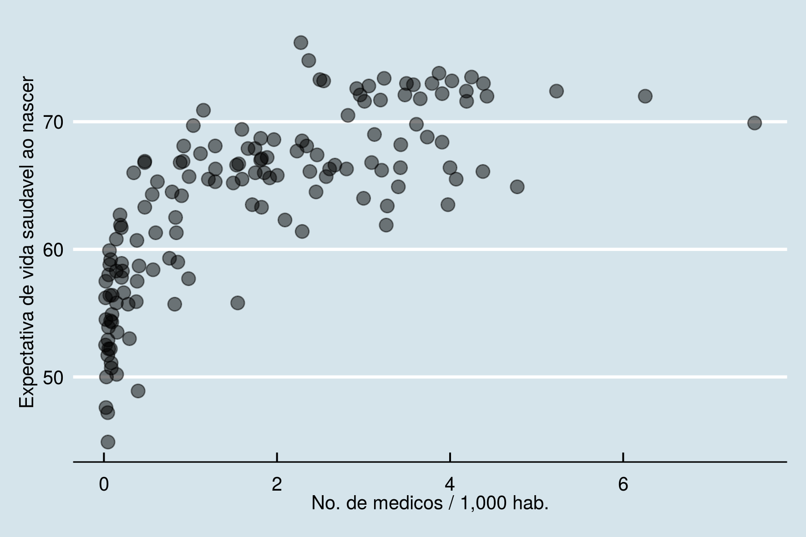

---
output:
  pdf_document: default
  html_document: default
---


  

# Capítulo 3 : Sobre associações  

## Prelúdio: *Hypotheses non fingo*?

*Eu ainda não fui capaz de descobrir a razão para essas propriedades da gravidade*, e não faço hipóteses. *Tudo aquilo que não é deduzido do fenômeno pode ser chamado de hipótese; e hipóteses, sejam metafísicas ou físicas, ou baseadas em qualidades ocultas, ou mecânicas, não têm lugar na filosofia experimental. Nesta filosofia, as proposições particulares são inferidas a partir do fenômeno, e então generalizadas por indução.*  

O racional apresentado no capítulo anterior é diretamente relacionado ao método hipotético-dedutivo e seus princípios filosóficos.  Apesar de adequado a este cenário, a interpretação do valor p não é muito intuitiva.  
Envolve *mensurar quão improváveis são as observações em um cenário hipotético na vigência da hipótese nula*.  
Sua tradução (errada) mais popular é de que representa *"a chance de o resultado deste estudo estar errado".*  

O arcabouço descrito no capítulo anterior é suficiente para produzir um trabalho científico críptico para leigos.   

Ao seguir receitas pré-definidas (formulação de $H_{0}$ e $H_{1}$, cálculo de estatísticas e valores p), um texto parece estar em conformação com os padrões acadêmicos, mesmo que a hipótese elementar em torno do objeto de pesquisa seja simplória. Assim, inadvertidamente, priorizamos a forma e relegamos a segundo plano o miolo de propostas científicas.  

Outro efeito colateral é a busca por valores p que rejeitem $H_{0}$, desprezando precedentes teóricos e premissas probabilísticas (múltiplos testes).  

A difícil interpretabilidade do valor p e as armadilhas frequentes envolvidas no processo de inferência levaram a comunidade científica a questionar a hegemonia desse parâmetro. Há uma presente tendência a abandonar o valor p e o limite $p<0.05$ como critérios canônicos.  

Vamos conhecer argumentos formais contra o método hipotético dedutivo nas ciências. Por enquanto, basta sabermos que é sempre vantajoso obter outras informações, complementares ou alternativas.     

Neste capítulo, vamos aprender a estimar (1) a magnitude da diferença entre duas amostras e (2) quão relacionados são valores pareados (e.g. peso e altura).  

---  

I have not as yet been able to discover the reason for these properties of gravity from phenomena, and I do not feign hypotheses. For whatever is not deduced from the phenomena must be called a hypothesis; and hypotheses, whether metaphysical or physical, or based on occult qualities, or mechanical, have no place in experimental philosophy. In this philosophy particular propositions are inferred from the phenomena, and afterwards rendered general by induction. *Isaac Newton (1726). Philosophiae Naturalis Principia Mathematica, General Scholium. Third edition, page 943 of I. Bernard Cohen and Anne Whitman's 1999 translation, University of California Press ISBN 0-520-08817-4, 974 pages.*  

---  

\pagebreak

## Tamanho de efeito

O tamanho de efeito nos ajuda a expressar magnitudes.  
Retomando o exemplo anterior, de que adianta uma diferença significativa entre o tamanho dos bicos dos pássaros, se ela for de 0.00001 mm?  

Ainda, existem casos em que estudos pequenos sugerem efeitos importantes, porém o tamanho amostral não fornece poder estatístico suficiente para rejeição da hipótese nula.  


Além de saber quão improvável é a diferença observada, é natural imaginarmos o quão grande ela é.  

Uma medida bastante popular é o *D de Cohen (Cohen's D)*.  

É um parâmetro que expressa a magnitude da diferença sem usar unidades de medida.  
Uma torcedora de futebol conta (feliz) a um amigo que seu time favorito venceu com placar de 4 $\times$ 1 (gols). Porém, esse amigo acompanha basquetebol e está acostumado a placares como 102 $\times$ 93 (cestas).  
Como é possível comparar gols com cestas? Qual vitória representa pontuações mais discrepantes: 4 $\times$ 1 ou 102 $\times$ 93?  

O problema aqui é que as pontuações se comportam de maneiras diferentes entre os esportes. Os placares no basquete possuem médias e dispersões muito maiores.  
O D de Cohen consiste em expressar essa diferença em desvios-padrão. Bastante simples:  
$$D_{cohen} = \frac{\mu_{1}-\mu_{2}}{\sigma_{pooled}}$$  

Usando a biblioteca *effects*, podemos calcular diretamente:   

```r
    library(effects)
    # O dataset galapagos_birds foi criado no capitulo 1
    >cohen.d(galapagos_birds$X1,galapagos_birds$X2)

    Cohen's d    

    d estimate: -5.460017 (large)
    95 percent confidence interval:
        lower     upper 1
    -5.954047 -4.965987 
```

Cohen propôs algumas faixas para classificar a magnitude desses efeitos:  

|         |  Pequeno  |  Médio  |  Grande  |	
|---------|-----------|---------|----------|
|Cohen's D|  0-0.2    | 0.2-0.5 | 0.5 - 0.8|

Assim, podemos atualizar nossos resultados anteriores, reportando também o tamanho de efeito da diferença e seu intervalo de confiança. Se as distribuições forem da mesma família, temos uma estimativa comparável entre contextos. 

## Correlações

Na empreitada científica, não nos atemos apenas a comparações. Um objetivo mais nobre é descrever exatamente como se dá a relação entre entidades estudadas.  

Como sabemos, existem muitas classes de funções para expressar relações entre variáveis/conjuntos. Nos capítulos anteriores, usamos algumas funções, como $y=\sqrt{x}$ e $y = e^{x}$.  

Diversas leis naturais tornaram-se particularmente conhecidas, como a relação entre força, massa e aceleração, elucidada por Newton:  
$$\vec{F}=m\vec{a}$$  
E a relação entre massa e energia para um objeto em repouso, descoberta por Einstein:  
$$E=mc^{2}; c^{2} \sim 8.988*10^{16} \frac{m^{2}}{s^2}$$  

As equações acima descrevem uma relação linear entre grandezas.  

### Relações lineares

Uma relação linear entre duas variáveis indica que elas estão correlacionadas em uma proporção constante para qualquer intervalo.

Isto é, valores maiores de massa correspondem a um aumento proporcional em energia. O valor de $c^{2}$ expressa essa proporção constante.  

**Exemplo:** uma molécula de água pesa aproximadamente $m_{H_{2}O} =2.992\times 10^{-23} g$. Portanto, a energia associada é $E_{H_{2}O} = 2.992\times 10^{-23}\times 8.988\times 10^{16} \sim 2.689^{-6}J$. Se triplicarmos o número de moléculas de água, o mesmo acontecerá com a energia associada: $E_{3H_{2}O} = 3\times E_{H_{2}O}$.  
 
Se a correlação é positiva, incrementos em $x$ serão proporcionais a incrementos em $y$. Se a correlação é negativa, incrementos em $x$ serão proporcionais a decréscimos em $y$.  

Num cenário perfeito, se sabemos que há uma relação linear entre variáveis,  precisamos de apenas duas observações para descobrir proporção entre elas. Esse problema é idêntico ao de encontrar a inclinaçaõ da reta que passa por dois pontos. É de fácil resolução usando técnicas elementares.  

```r
    >library(ggplot2)
    >ggplot()+
    geom_point(mapping=aes(x=1,y=2))+
    geom_point(mapping=aes(x=2,y=4))+
    xlim(0,3)+ylim(0,5)+
    theme_economist()
```


$y=\beta*x$  
$a=(1,2); b=(2,4) \rightarrow \beta = 2$  

```r
    >ggplot()+
    geom_point(mapping=aes(x=1,y=2))+
    geom_point(mapping=aes(x=2,y=4))+
    xlim(0,3)+ylim(0,5)+
    geom_abline(slope = 2)+
    theme_economist()
```


### Erros e aleatoriedade

Controlando fatores experimentais, as relações descritas são bastante precisas. Em um cenário sem atrito com superfícies e com o ar, os erros de medida obtidos com $\vec{F}=m\vec{a}$ são muito baixos.  
Entretanto, nem sempre isso é verdadeiro.  
Primeiro, podemos sofrer interferência de variáveis desconhecidas.

Imaginemos um conjunto de medidas antropométricas, como altura e peso de indivíduos.  
É esperado que a altura de um ser humano esteja relacionada com seu peso. Entretanto, outras características não medidas, como percentual de gordura total, podem interferir nos valores finais. Normalmente, tratamos essas flutuações como erros aleatórios[^11].

Podemos simular este cenário partindo de variáveis idênticas e adicionando ruído aleatório.
```r
    >set.seed(2600)
    >a <- seq(1:100)+rnorm(n=100,sd=3)
    >b <- seq(1:100)+rnorm(n=100,sd=3)

    >cor_data <- data.frame(a,b)
    >ggplot(cor_data,aes(x=a,y=b))+
    geom_point()+theme_economist()
```
  

O resultado sugere que há uma forte relação linear entre $x$ e $y$. Por outro lado, notamos que é impossível para uma reta cruzar todos os pontos. A seguir, vamos investigar como quantificar a correlação linear, assim como encontrar a reta que minimiza a distancia para todas as observações.  

Com essas ferramentas, podemos estender nossas inferências. Além de comparações, teremos noções sobre a magnitude de uma relação, assim como poderemos prever o valor esperado para novas observações.   

[^11]:A natureza da aleatoriedade é uma questão filosófica. Em última instância, podemos imaginar que seria possível explicar flutuações randômicas através de variáveis desconhecidas (*hidden variables*). Isso é verdade para a maioria dos fenômenos naturais. Entretanto, descobertas experimentais recentes em física quântica (*Bell's inequality experiment*) sugerem que variáveis ocultas não podem explicar a natureza probabilística das observações.  

### O coeficiente de correlação produto-momento de Pearson, ou, simplesmente, $\rho$ de Pearson.

O coeficiente de correlação $(\rho)$ de Pearson é um número real garantidamente[^12] entre -1 e 1. Expressa a magnitude e o sentido de uma relação linear, sendo -1 uma relação inversa perfeita e 1 uma relação direta perfeita.  

Para os dados que geramos, a correlação é quase perfeita: $\rho = 0.989$.  
O coeficiente possui *produto-momento* em seu nome, pois usa uma abstração originalmente empregada na física, que estudamos no capítulo anterior: o momento(torque). 

[^12]: Inequalidade de Cauchy–Schwarz

\pagebreak


### Calculando correlações lineares

A noção de **distância** ou **desvio** se repetiu muitas vezes.  
De fato, o coeficiente de correlação linear nasceu quando Francis Galton (1888) estudava numericamente dois problemas aparentemente distintos em antropometria [^16] :

1. **Anthropology:** If we recovered from an ancient tomb only one bone of an individual's thigh (femur), what could we say about its height?
2. **Forensic science:** In order to identify criminals, what can be said about different measures by the same person?

Galton realized that he was actually dealing with the same problem. Given paired measures, $(x_{i},x_{i}')$, what does the $x_{i}$ deviation tell you about the $x_{i}'$ deviation?

The femur recovered from a pharaoh's skeleton is 5 cm larger than the average. How far from the average do we expect your height to be? Naively, we can think that if one of the measures is 1% higher than the average, the other will also be 1% higher. Galton realized that there was a trap in that thought.   

Although there is a relationship between the measures, there are also random fluctuations: part of the deviation results from this. We need to understand the degree of correlation to make a good guess.  

Then, he proposed a coefficient measuring the relationship between deviations of variables. If femur size and height are closely related, a large femur suggests an equally tall individual. Otherwise (low correlation), a large femur (high deviation) does not imply great stature.  

To quantify the relationship, we multiply the deviations for each pair of measures:
$$Cov(X,X')=\sum_{i=1}^{N}(x_{i}-\mu_{x})(x_{i}'-\mu_{x'})$$
The above formula expresses **covariance** between $X$ and $X'$ and will be useful in other contexts. The expression resembles the calculation of the first moment, but each deviation is multiplied by the corresponding deviation of the paired measure. Hence the name product-moment correlation coefficient.  

Note that if both deviations agree in the direction (sign), the result of the multiplication will be positive. Consistently matching pairs increase the value of the final sum. If both deviations disagree in the direction (sign), the result will be negative. Consistently discordant pairs decrease the value of the final sum.  

Thus, we can have highly correlated variables positively or negatively, as long as the sense of the association is constant. On the other hand, if the measures are at times inconsistent and at other times concordant, the values tend to cancel each other out in the sum and the result approaches zero.  

Observing only the covariance is dangerous, as the values depend on the unit of measurement and data dispersion. 

We calculated Pearson's correlation coefficient, normalizing [^ 17] the covariance by dividing it by the product of standard deviations:
$$\rho_{XX'}= \frac{cov(X,X')}{\sigma_{X}\sigma_{X'}}$$
Extensively:  
$$\rho_{XX'}= \frac{\sum_{i=1}^{N}(x_{i}-\mu_{x})(x_{i}'-\mu_{x'})}{\sqrt{\sum_{i}^{N}(x_{i}-\mu_{x})^{2}}\sqrt{\sum_{i}^{N}(x_{i}'-\mu_{x'})^{2}}}$$
Uma boa notícia: $\rho$ follows a known distribution, the t distribution, with n-2 degrees of freedom. We can use the previous tools to test hypotheses.

[^16]: Francis Galton's account of the invention of correlation. Stephen M. Stigler. Statistical Science. 1989, Vol. 4, No. 2, 73-86.
[^17]: Here, normalization is meant to adjust the scale of the measurements. Do not confuse with transformations so that the data will have Gaussian distribution.

### Practical example

The following example was a happy find. At the time, the Brazilian government was discussing the need to increase the number of doctors to improve health care. Some argued that it was the right decision, while others advocated that investments should be made in other areas of health.  

Out of curiosity, I accessed the WHO (World Health Organization) and World Bank (World Bank) data on the number of doctors per country and health indicators. My expectation was to find at least a timid relationship between indicators. More than that, understand the location of Brazil in relation to other countries. I was surprised by a strong correlation, which we will explore next.  

We adopted countries as an observational unit with measures $x$, the number of doctors 1,000 inhabitants, and $y$, the expected life expectancy at birth.
Using data obtained from the WHO and World Bank portals, we plot the points on the Cartesian plane. 

```r
    # http://apps.who.int/gho/data/view.main.HALEXv
    # https://data.worldbank.org/indicator/SH.MED.PHYS.ZS
    >library(magrittr)
    >library(ggplot2)
    >library(dplyr)    

    >worldbank_df <- read.csv("data/API_SH.MED.PHYS.ZS_DS2_en_csv_v2_10227587.csv",
                         	header = T,skip = 3)
    >colnames(worldbank_df)[1] <- "Country"    

    >worldbank_df$n_docs <- sapply(split(worldbank_df[,53:62], #lists of values
                                    	seq(nrow(worldbank_df))),
       	function(x) tail(x[!is.na(x)],1)) %>% #last non-null values
      as.numeric    

    >who_df <- read.csv("data/who_lifeexpect.csv",skip=2)
    >who_df$hale <- who_df$X2016
    >uni_df <- left_join(worldbank_df[,c("Country","n_docs")],
                    	who_df[,c("Country","hale")],by="Country")    

    >ggplot(uni_df,aes(x=n_docs,y=hale))+
      geom_point(alpha=0.5,size=3) +
      xlab("No. of doctors / 1,000 inhab.")+
      ylab("Healthy life expectancy at birth")+
      theme_economist()
```


It is clear that the pattern is not random. Visually, we noticed that the value of life expectancy increases with a greater number of doctors.
Still, we noticed an initially rapid increase until it reached a plateau. The pattern is similar to that of a logarithmic curve.
  
$y = log (x)$ or $HALE = log(N_{médicos})$

If this hypothesis is true, transforming the number of doctors using a logarithmic function will make the relationship linear with the transformed variable:  
If $y = log (x)$, we do the replacement $x’ = log(x)$ to get $y = x'$.  

Then life expectancy becomes linearly correlated with the logarithm of the number of doctors.  
```r
    >uni_df$log_docs <- log(uni_df$n_docs)
    >ggplot(uni_df,aes(x=log_docs,y=hale))+
      geom_point(alpha=0.5,size=3) +
      xlab("ln No. of doctors / 1,000 inhab.")+
      ylab("Healthy life expectancy at birth")+
      theme_economist()
```
 

In fact, we see a notable linear trend for points. 

Using the native implementation in R for Pearson's coefficient:

```r
    >cor.test(uni_df$log_docs,uni_df$hale)
    Pearson's product-moment correlation
    data:  uni_df$log_docs and uni_df$hale
    t = 18.572, df = 143, p-value < 2.2e-16
    alternative hypothesis: true correlation is not equal to 0
    95 percent confidence interval: 0.7854248 0.8828027
    sample estimates:
      	cor
    0.8407869
```

The linear correlation obtained for our sample of countries is surprisingly large, as suggested by the visualization $(\rho \sim 0.841)$.  

The p value is low $(p<0.001)$ considering the null hypothesis $H_{0}$ of $\rho=0$. We conclude then that there is a significant linear relationship of strong magnitude between the logarithm of the number of doctors and the life expectancy of the countries in our sample.  

It is really curious that there is such an evident mathematical relationship between tenuously connected constructs. The average time that an organism takes between birth and death and the number of professionals working. It is virtually impossible to spell out each causal relationship behind that relationship, which manifests itself robustly through the sum of many related factors.   

---

#### Note

*It is customary to state that there is no relationship between variables if the relationship coefficient does not prove to be important. As we have seen, this indicator reports only on linear relationships between variables. Data visualization can be of great help in inferring the nature of relationships. *
*Data with very different distributions can result in equal coefficients, as shown by the classic Anscombe quartet. The 4 samples below show the same correlation coefficient.*  


---

##bForecasts

We now know that it is reasonable to assume a linear relationship between these variables. As stated before, we can then find the line that minimizes the distance for observations. 

The equation that describes this line tells us the expected value for life expectancy given the number of doctors. 

```r
    >uni_df$log_docs <- log(uni_df$n_docs)
    >ggplot(uni_df,aes(x=log_docs,y=hale))+
       geom_point(alpha=0.3,size=3) +  geom_smooth(method="lm")+
       geom_point(y=66.0,x=0.61626614,color="light green")+
       geom_text(y=64.5,x=0.61626614,label="Brazil",color="dark green")+
       geom_point(y=73.2,x=0.93177030,color="red")+
       geom_text(y=71.5,x=0.73177030,label="Canada",color="dark red")+
       geom_point(y=72.0,x=1.833381,color="blue")+
       geom_text(y=74.0,x=1.833381,label="Greece",color="dark blue")+
       xlab("ln No. of doctors / 1,000 inhab.")+
       ylab("Healthy life expectancy at birth")+
       theme_economist()
```
 

Biases must be addressed before conclusions are reached, but the model is sufficiently interpretable to make decisions. z
A good policy can compare the investment value by sectors with other countries under similar conditions and different results.
Assuming that there is really a linear relationship, we see that Brazil is quite close to what was expected for the number of doctors [^ 18]. If the strategy is to hire more people, we can look at programs in countries with more doctors per capita and positive results (e.g. Greece).
If the strategy is to save on payroll and prioritize investment in structure, we can use countries with high life expectancy for the expected number of professionals (e.g. Canada).  
  

[^ 18]: It is practically a consensus among specialists that Brazil has a problem with the distribution of professionals, with a shortage of doctors in poorer and less populated areas. 


\pagebreak

## Predictions with linear models

How to guess one measure based on the other? Considering the linear relationship previously discovered, we can create a function that receives as input the value of a variable (number of doctors) and returns the expected value for life expectancy as an output.  

Finding the equation that describes this function consists of finding the line that best fits the point cloud, as in the previous figure.  

For this, we calculate the slope $(\beta_{1})$ and the vertical adjustment $(\beta_{0})$ that minimize the sum of the distances between the line and the observations. The term $\epsilon$ corresponds to errors, with normal distribution of mean 0 and standard deviation $\sigma$.  
$$y_{i} = \beta_{0} + \beta_{1}x_{i} + \epsilon$$

We adjust the model using the R lm (linear model) function:  
```r
    # log_docs : x’ = log(x)
    >lm(hale ~ log_docs, data=uni_df) 
    
    Call:
    lm(formula = hale ~ log_docs, data = uni_df)    

    Coefficients:
    (Intercept)     log_docs  
          64.46         3.73 
```


We have $\beta_{0} \sim 64.46$ and $\beta_{1} \sim 3.73$.  
Our estimate for healthy life expectancy "starts" at 64.46 years and increases with the number of doctors in the country. Specifically, it increases by 3.73 for each unit of our transformed variable $(log(x))$.  
In our dataset, Brazil has 1,852 doctors / 1,000 inhabitants. Our prediction then is:  
$\hat{y}_{Brasil}=log{1.852}*3.73 + 64.46 \sim 66.8$, which is very close to the real number (66).  

**Estimators**

There is more than one way to estimate these parameters.
One of particular interest, which will also serve in other contexts, is that of Maximum likelihood.   

First, we determine a function that describes the probability of observation on the target variable $(y_{i})$ measurements of the predictor variables occur $(x_{i})$ and a set of parameters $(\beta_{k})$.  

 We can adopt as a likelihood function *(likelihood function)* for the values $y_{i}$ a Gaussian probability distribution whose mean is given by the line $\mu_{yi} = \beta_{0} + \beta_{1}*x_{i}$. Thus, the probability of each value $y_{i}$ is given by a Gaussian, according to the deviation to the value predicted by the line.

$$L \sim N(\mu_{yi},\sigma^{2})$$.  

Assuming that the observations are independent, the probability of the set of observations is given by their product.  

$$L=\prod_{i=1}^{n} P(y_{i}|x_{i}; \beta_{0},\beta_{1},\sigma^{2})$$

Replacing the values of $\mu$ for the Gaussian by the line's predictions:  
$$f(y_{i}) = \frac{1}{\sqrt{2\pi\sigma^{2}}}e^{-\frac{(y_{i}-\mu)^{2}}{2\sigma^{2}}}$$

$$L(\beta_{0},\beta_{1},\sigma^{2})=\prod_{i=1}^{n}\frac{1}{\sqrt{2\pi\sigma^{2}}}e^{-\frac{y_{i} - (\beta_{0}+\beta_{1}x_{i})^{2}}{2\sigma^{2}}}$$

This is our likelihood function and expresses the probability of observing the measures $y_{i}$ given the measures $x_{i}$ and considering a set of parameters $(\beta_{0},\beta_{1})$.  

The objective then is to find parameters that maximize this function. For convenience, we apply a logarithmic transformation to this function $(log \quad likelihood \quad function)$. This transforms our product into a summation and we pass the counterdomain of the interval $[0;1]$ for $[-\infty,0)$.  

$$\text{log likelihood}(\beta_{0},\beta_{1},\sigma^{2})=log\prod_{i=1}^{n} P(y_{i}|x_{i}; \beta_{0},\beta_{1},\sigma^{2})$$
$$=\sum_{i=1}^{n} log P(y_{i}|x_{i}; \beta_{0},\beta_{1},\sigma^{2})$$
$$=-\frac{n}{2}\text{log}({2\pi\sigma^{2}}) - \frac{1}{2\sigma^{2}}\sum_{i=1}^{n}(y_{i}-(\beta_{0} + \beta_{1}x_{i}))^{2}$$

The parameters that maximize the likelihood function (max. Likelihood, ML) are the same as those that maximize the logarithm of the likelihood function (log-likelihood).

We introduce the rationale of the ML estimator as it will be useful in the future. In fact, it is easy to understand the closed formulas for our parameters, as they only express the linear relationships explored [^19]: 

$\hat{\beta_{1}}$ expresses the magnitude of the correlation between $X$ and $Y$.It is natural that its value is the covariance normalized by the variance of the predictor.  
$$\hat{\beta_{1}}=\frac{cov(XY)}{\sigma_{x}^{2}}$$  

$\hat{\beta_{0}}$ is our intercept, so it's the difference between predicted averages and predictions considering the average value in X. 
$$\hat{\beta_{0}}=\mu_{y} - \hat{\beta_{1}}\mu_{x}$$  

Finally, the variance of errors $\hat{\sigma^{2}}$ is given by the square of the deviations from the predictions in relation to the measures.  
$$\hat{\sigma^{2}} = \frac{1}{n} \sum_{i=1}^{n} (y_{i}-(\hat{\beta_{0}}+\hat{\beta_{1}}x_{i}))^{2}$$  

The solutions above provide the best estimates we can obtain by minimizing the distance from the line to the points.
We must then be concerned with whether the linear model found is good in predicting the data.
  


[^19]: Detalhes das deduções dos estimadores OLS and Max. Likelihood:   https://www.stat.cmu.edu/~cshalizi/mreg/15/lectures/05/lecture-05.pdf ; https://www.stat.cmu.edu/~cshalizi/mreg/15/lectures/06/lecture-06.pdf

\pagebreak

#### Evaluating performance

There are different parameters to evaluate the performance of a model. In general, they seek to quantify how far the model results differ from ideal results.  

For linear regression, the $R^{2}$ (coefficient of determination) is a widely used coefficient. Express the proportion between **(1)** variance explained by the model and **(2)** total variation. We call residual (or error) the difference between predicted values and real values.  

**(1)** To capture the magnitude of model errors, we add the square of all residuals *(sum of squared residuals, SSR)* in relation to the predicted values. Be $y_{i}$ the observations and $\hat{y_{i}}$ predictions: 
$$SSR=\sum_{i=1}^{n} e_{i}^{2}=\sum_{i=1}^{n}(y_{i}-\hat{y_{i}})^{2}$$  

**(2)** The total variability is quantified by adding the squared deviations from the mean *(total sum of squares, TSS)*, a term we saw in the variance calculation (second moment):

$$TSS=\sum_{i=1}^{n}(y_{i}-\mu_{y})^{2}$$  

So the fraction $\frac{SSR}{TSS}$ is the desired proportion. We define $R^{2}$ like:
$$R^{2}=1 - \frac{SSR}{TSS}$$  

An intuitive view of SSR and TSS:    
```r
    >source("aux/multiplot.R")
    >doc_lmfit <- lm(hale ~ log_docs, data=uni_df)
    >uni_df$preds[complete.cases(uni_df)] <- predict(doc_lmfit) 
    >uni_df$hale_mean <- mean(uni_df$hale,na.rm = T)
    >ssr_res <- ggplot(uni_df,aes(x=log_docs,y=hale))+
        geom_point(alpha=0.5,size=3) +
        geom_segment(aes(xend = log_docs, yend = preds)) +
        geom_smooth(method="lm")+
        xlab("")+
        ylab("Healthy life expectancy at birth")+
        ggplot2::ggtitle("SSR") + theme_economist()
    
    >tss_res <- ggplot(uni_df,aes(x=log_docs,y=hale))+
        geom_point(alpha=0.5,size=3) +
        geom_segment(aes(xend = log_docs, yend = hale_mean)) +
        geom_abline(slope = 0,intercept = 63.28165)+
        xlab("ln No. of doctors / 1,000 inhab.")+
        ylab("Healthy life expectancy at birth")+
        ggplot2::ggtitle("TSS")+theme_economist()
    
    >multiplot(ssr_res,tss_res)

```
 

Values of $R^{2}$ close to 1 indicate residue sum (SSR) similar to 0. Using the line as a guide accumulates almost zero errors. Values of $R^{2}$ close to 0 indicate $\frac{SSR}{TSS} \sim 1$ and the predictions obtained by the model are as good as kicking the average for all cases. 

```r
    >lm(hale ~ log_docs, data=uni_df) %>% summary
    Call:
    lm(formula = hale ~ log_docs, data = uni_df)    

    Residuals:
         Min       1Q   Median       3Q      Max 
    -12.0964  -2.3988   0.3233   2.8229   8.6708     

    Coefficients:
                Estimate Std. Error t value Pr(>|t|)    
    (Intercept)  64.4613     0.3162  203.84   <2e-16 ***
    log_docs      3.7303     0.2009   18.57   <2e-16 ***
    ---
    Signif. codes:  
    0 ‘***’ 0.001 ‘**’ 0.01 ‘*’ 0.05 ‘.’ 0.1 ‘ ’ 1    

    Residual standard error: 3.779 on 143 degrees of freedom
      (119 observations deleted due to missingness)
    Multiple R-squared:  0.7069,	Adjusted R-squared:  0.7049 
    F-statistic: 344.9 on 1 and 143 DF,  p-value: < 2.2e-16
```

To obtain the predicted values, we use the *predict* method:     
```r
    >head(predict(doc_lmfit))
        
           2        3        4        7        8        9 
    59.90747 57.23226 65.39962 66.11533 69.54483 68.30608 
```

It is also possible to obtain predictions for new values by specifying the *newdata* argument. For a country with 1.5 doctors / 1,000 inhabitants:
```r
    >predict(doc_lmfit,newdata = data.frame(log_docs=log(1.5)))
           1 
    65.97381 
``` 
#### Assumptions

There are some auxiliary procedures to check for possible flaws and points in the model that need attention. For example, residues can be asymmetrical. This indicates that performance changes at different intervals (heteroscedacity). Different violations require different attitudes, such as treating outliers or changing the model type.
A complete list of premises, along with the R codes to test them, is available in the auxiliary material (*lm-asssumptions.R*)

\pagebreak

## Correlations and nonparametric tests

We thoroughly verified analyzes involving normal distribution, t distribution and linear relationships. However, measures often do not follow a defined distribution. Thus, making inferences using the ** parameters ** described $(\mu,\sigma, t...)$ nos levaria a conclusões erradas.  
Para lidar com distribuições arbitrárias, vamos abrir mão deles e conhecer ferramentas *não-paramétricas*: the rank correlation coefficient $\rho$ Spearman's test and Mann Whitney's U test.  

### Ranks and Spearman's $\rho$

Linear relationships maintain constant proportions and we learn how to quantify them. On the other hand, two variables can have relations of other types, non-linear. In particular, if the measures have very extreme values * (outliers) * a calculation like the previous one suffers a lot with biases.
A simple solution to this problem is to rank the values. Thus, the items in the set are treated by their position in relation to other items, regardless of the associated values. Example:  
$$S = (1,3,89,89,39,209) \rightarrow S_{ranked} = (1,2,4,4,3,5)$$

Spearman's $\rho$ is that Pearson's product-moment coefficient applied to ranks. Thus, we measure the degree to which two variables increase (or decrease) in magnitude by observing only the order of observations. That is: **greater than **, **equal** or **less than **. Specifically, we investigate whether there is a * monotonicity * relationship between them.   

For the (sigmoid) relationship, between x and y below:
  
```r
    >set.seed(2600)
    >sig_data <- data.frame(y_vals = -(1 / (1 + exp(seq(-10,10,by =0.3) )*100 ) ),
                       x_vals = 1:67)
    >ggplot(sig_data,aes(x=x_vals,y=y_vals))+
    geom_point()+theme_economist()+xlab("")+ylab("")
```


Pearson's coefficient is $\rho \sim 0.850$[^20] :   
```r
    >cor.test(sig_data$y_vals,
    +          sig_data$x_vals)    

    	Pearson's product-moment
    	correlation    

    data:  sig_data$y_vals and +sig_data$x_vals
    t = 12.993, df = 65, p-value <
    2.2e-16
    alternative hypothesis: true correlation is not equal to 0
    95 percent confidence interval:
     0.7658181 0.9051711
    sample estimates:
          cor 
    0.8497162 
    
    >ggplot(sig_data,aes(x=x_vals,y=y_vals))+
      geom_point()+ geom_smooth(method="lm")+
      theme_economist()+xlab("")+ylab("")
```


Since the relationship is perfectly monotonic, the ordered pairs $(x_ {i}, y_ {i})$ always have the same rank. The fifth highest value in x is also the fifth highest value in y. Therefore, Spearman's coefficient is 1:  

```r
    >cor.test(sig_data$y_vals,
    +          sig_data$x_vals,method = "spearman")    

    	Spearman's rank correlation rho    

    data:  sig_data$y_vals and sig_data$x_vals
    S = 0, p-value < 2.2e-16
    alternative hypothesis: true rho is not equal to 0
    sample estimates:
    rho 
      1 
```

O coeficiente $\rho$ de Spearman é preferível quando as medidas parecem diferir muito quanto à família da distribuição de origem. Especialmente, quando a média não parece corresponder bem ao centro das distribuições. Lembre-se que de o coeficiente de Pearson é baseado nos desvios em relação à média em ambas as amostras.    

[^20]: Como observamos no gráfico, a correlação linear não é tão alta. O coeficiente se aproxima de 1 $\rho \sim 0.850$ pois os desvios superiores compensam simetricamente os inferiores. O exemplo reforça a importância de plotar os dados para um melhor entendimento (ver Quarteto de Anscombe). 


\pagebreak

## Teste U de Mann-Whitney

O teste U de Mann-Whitney faz uso da estatística U para fazer inferências. O racional é idêntico ao do teste t de Student.  
Estabelecemos hipótese nula $H_{0}$ e hipótese alternativa $H_{1}$.  
Então, calculamos a probabilidade de nossas observações acontecerem caso a hipótese nula seja verdadeira.  
Desta vez, usaremos a estatística U. Lembremos que a estatística t era calculada com base em parâmetros extraídos da amostra:  
$$t = Z/s=(\mu'-\mu)/\frac{\sigma}{\sqrt{n}}$$

A estatística U não depende de parâmetros (e.g. $\mu$, $\sigma$), sendo calculada com base em cada observação.  

Primeiro, calculamos os ranks de cada medida $r_{i}$ unindo as observações das amostras A e B, de tamanhos amostrais $n_{a}$ e $n_{b}$ em apenas um conjunto $(N_{tot} = n_{a} + n_{b})$.  

Depois, separamos novamente as amostras e calculamos a soma dos ranks em cada grupo, chamadas $R_{a}$ e $R_{b}$.  
A estatística U é dada pela seguinte expressão: 

$$U_{a}= R_{a} - \frac{n_{a}(n_{a}+1)}{2}$$
$$U_{b}=R_{b} - \frac{n_{b}(n_{b}+1)}{2}$$

Usamos o menor valor de U para consultar a probabilidade (valor p) correspondente para a hipótese nula.  

O termo $\frac{n(n+1)}{2}$ corresponde à soma mínima dos ranks para a amostra.  
Os ranks são uma sequência regular $(1,2,3,...)$, de forma que a soma de todos os valores é idêntica à soma de uma progressão aritmética de N termos.  
$$\Sigma_{ranks}=\frac{N(N+1)}{2}$$  
Enquanto $R_{i}$ corresponde à soma dos ranks calculados com as duas amostras, o termo acima corresponderia à soma mínima dos ranks para uma amostra, caso os ranks ocupassem a sequência inicial $A=(1,2,3,4,...,n_{a})$ na amostra conjunta.  
A definição para o teste não é unânime na literatura, de forma que alguns autores e softwares (e.g. R) implementam o cálculo com a subtração acima e outros (e.g. S-PLUS) não o fazem.  
Em R, as funções **dwilcox(x,m,n)** e **pwilcox(q,m,n)** retornam a distribuição e a densidade cumulativa para a estatística U correspondente a amostras com tamanhos m e n.  **wilcox.test(x,y,...)** é a implementação base do teste de Mann Whitney. O teste de Mann Whitney é o teste de Wilcoxon de duas amostras.  

\pagebreak

### Exercícios

1. O coeficiente produto-momento de Pearson descreve quais tipos de relação?   
  * Ele é útil para modelar relações quadráticas entre variáveis?  
  * Citamos relações não lineares, como $E=mc^{2}$. Cite um outro exemplo de fenômeno natural de perfil não-linear em que o $\rho$ de Pearson não funciona.   
  
2. Crie uma função que calcula o n-ésimo momento para uma amostra:
  * `n_moment <- function(x,n) {sum((x- mean(x))^n)/length(x)}`
  * Calcule o valor de skewness. Como citado no capítulo, é o 3o momento normalizado [pelo 2o momento ao expoente 3/2].  $$\frac{\mu_{3}}{\mu_{2}^{3/2}}$$
  * Calcule o valor de kurtosis. Como citado, é o 4 momento noramlizado [pelo quadrado do 2o momento menos 3].  $$\frac{\mu_{4}}{\mu_{2}^{2} - 3}$$
  * Os valores podem ser conferidos com as implementações `e1071::skewness` e `e1071::kurtosis`  

3. Usando o dataset *iris*, compare as 4 variáveis numéricas (*Sepal/Petal* *Lenght/Width*) entre espécies (*Species*) usando teste t de Student e teste de U Mann Whitney. Em algum caso os métodos divergem quanto à rejeição da hipótese nula?   
  * Obtenha o tamanho de efeito (D de Cohen) para as diferenças.  

4. Usando o dataset *iris*:  
  * Faça um scatterplot entre duas medidas. A função `pairs` pode ajudar.    
    * Verifique se há correlação linear significativa entre as variáveis.  
    * Se existir, ajuste um modelo de regressão linear.  
    * Ajuste um modelo de regressão para cada espécie.  
    * Observe os valores de $R^{2}$ para cada modelo. Qual a sua impressão sobre as mudanças de performance?  
