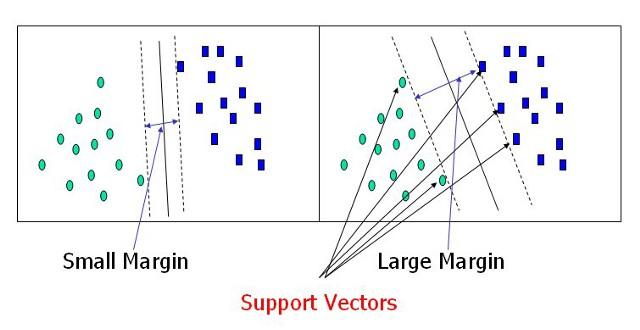
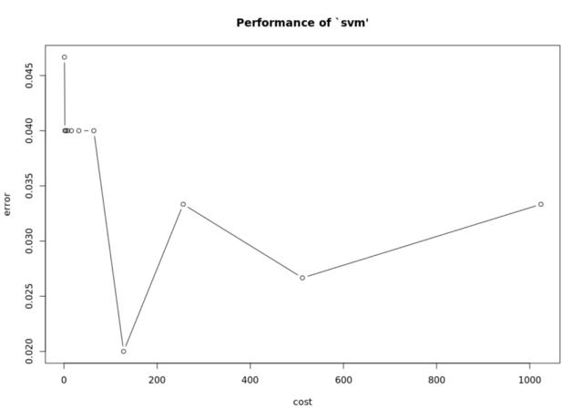

# SVM - Aplicações

Recuperando o exemplo anterior, temos um conjunto de dados (ex: uma imagem) e um classificador com pesos para esses dados. O classificador realiza operações (definidas pela função kernel) entre seus pesos e os dados para retornar scores.  
O maior dos scores deve apontar a classe correta (mecanismo de voto).  
Vimos que existem diversas formas de encontrar valores para os pesos que classifiquem corretamente as imagens (minimizem as perdas).  
Vimos como funcionam as operações com um kernel linear.  


Apresentamos benchmarks para tempos das funções dos pacotes **kernlab, e1071, klaR e svmpath** em diferentes datasets para uma mesma tarefa.


Os pacotes kernlab e e1071 parecem ser os mais rápidos (e1071 ligeramente na frente). A e1071 é um interface para o libsvm, library premiada (IJCNN 2001 Challenge) e escrita em C++, o que garante a melhor performance. O problema é que não há flexibilidade para mudar muito o kernel. Já o kernlab traz maior flexibilidade, mas seleção de modelos é limitada. Recomendo brincar com as quatro libs. Já que não vamos mexer no kernel, vamos com a função svm() do pacote e1071 em nome do minimalismo.

### Dados
Vamos usar o nosso conhecido *iris*.
```r
    >library(e1071)
    # O pacote caret facilita particionamento dos dados particionados
    >library(caret)
    >set.seed(2600)
    # Usa funcao createDataPartition do caret para gerar vetor com vasos sorteados na proporcao 4/5
    # A frequencia relativa de rótulos (Species) fica mantida
    >iris.tr.vec <- createDataPartition(y=iris$Species,p = 4/5,list=F)
    # Dataset de treino (4/5 da amostra)
    >iris.tr <- iris[iris.tr.vec,]
    # Dataset de teste (1/4 restantes)
    >iris.ts <- iris[-iris.tr.vec,]
```
Agora, temos um banco com 80% (4/5) dos dados para treinar a SVM e outro com 20% para testar. 

#### SVM com e1071

Vamos usar a função svm, especificando uma fórmula (“Species ~ .” significa Species como variável de classificação e as outras como input), o banco de dados e um custo (Constate C; falaremos mais sobre ela depois).

```r
    >svm.iris <- svm(Species ~ ., data=iris.tr, cost=100,  kernel="linear")
```
Agora, fazemos as predições:
```r
    >svm.pred <- predict(svm.iris,iris.ts)
    # Dispoe predicoes e valores no dataset de teste em uma tabela
    >agree.tab <- table(pred=svm.pred,true=iris.ts$Species)
    >agree.tab
    agree.tab
               true
    pred         setosa versicolor virginica
     setosa         10          0         0
     versicolor      0          9         3
     virginica       0          1         7
    # Usando classAgreement do proprio pacote e1071
    # Calculamos:
    # Percentual de acertos e Kappa (leva em conta acertos aleatorios)
    # Index de Rand e seu valor corrigido para acertos aleatórios.
    >classAgreement(agree.tab)
    $diag
    [1] 0.8666667    
    $kappa
    [1] 0.8    
    $rand
    [1] 0.8528736    
    $crand
    [1] 0.6590742
```

Os resultados valores foram bons. Classificamos corretamente ~86,7% das espécies com base em medidas das pétalas e sépalas em nossa amostra de teste.
Fica uma dúvida. Na hora de ajustar o SVM, escolhemos o parâmetro cost. O parâmetro cost é um valor associado a Regularização dos pesos durante o treinamento.  
Ele reflete o quanto queremos evitar classificar exemplos de forma errada. Um valor pequeno vai priorizar margens maiores, mesmo que isso implique mais classificações erradas. Um C maior vai resultar num ajuste classificação correta para outliers, ainda que com margens menores.



Os melhores valores para o hiperparâmetro C dependem da estrutura do seus dados.
Os autores do libsvm sugerem testar valores de C através de cross-validation. 

Uma maneira de testar valores ótimos é através de uma função embutida no e1071(**tune.svm**), que já faz uso do dataset inteiro com 10-fold cross validation. Essa alternativa (tune.svm) costuma trazer melhores resultados segundo os autores do e1071.

```r
    #Ajustando valores testaveis de entre 1 e 1024
    >tune.info <- tune.svm(Species~., data = iris, cost = 2^(0:10),kernel="linear")    

    #Sumario do tuning atraves de 10-fold-cross-validation
    >summary(tune.info)    

    Parameter tuning of ‘svm’:    

    - sampling method: 10-fold cross validation     

    - best parameters:
     cost
      128    

    - best performance: 0.01333333     

    - Detailed performance results:
       cost      error dispersion
    1     1 0.04000000 0.04661373
    2     2 0.03333333 0.03513642
    3     4 0.03333333 0.03513642
    4     8 0.04000000 0.04661373
    5    16 0.03333333 0.04714045
    6    32 0.04000000 0.04661373
    7    64 0.04000000 0.04661373
    8   128 0.01333333 0.02810913
    9   256 0.02000000 0.04499657
    10  512 0.01333333 0.02810913
    11 1024 0.01333333 0.02810913
    >plot(tune.info)
```


O tune.svm retornou, entre os valores, que os melhores parâmetros são cost = 128. Pelo gráfico, ainda é possível detectar zonas mais propícias e testar valores no intervalo. Podemos estabelecer esses parâmetros manualmente.

```r
>svm.opt <- svm(Species ~ .,data=iris.tr,cost=128,kernel="linear")
```

Ou invocar o objeto com $best.model (names(tune.info) para outros valores e objetos):

```r
    #Invocando melhor modelo.
    >tune.info$best.model
    Call:
    best.svm(x = Species ~ ., data = iris, cost = 2^(0:10), kernel = "linear")    
    

    Parameters:
       SVM-Type:  C-classification 
     SVM-Kernel:  linear 
           cost:  128 
          gamma:  0.25     

    Number of Support Vectors:  15
    #Fazendo predicoes
    >tune.pred <- predict(tune.info$best.model,iris)
    #Tabela de classificacoes predicoes vs. observacoes
    >agree.tune <- table(pred = tune.pred,true=iris$Species)
    >agree.tune
               true
    pred         setosa versicolor virginica
     setosa         50          0         0
     versicolor      0         48         1
     virginica       0          2        49
    #Observando concordancia das predicoes e observacoes
    >classAgreement(agree.tune)
    $diag
    [1] 0.98
    $kappa
    [1] 0.97
    $rand
    [1] 0.9739597
    $crand
    [1] 0.9410123
```

Está implementado nosso classificador de espécies com base no comprimento e largura de sépalas e pétalas. Agora, um biólogo em dúvida sobre a espécie de uma nova amostra pode usar nosso programa para classificar a planta usando suas medidas.
A mesma lógica serve para uso de SVM em outras áreas, como classificação de imagens e classificação de risco de créditos em instituições finaneiras.

Considerações
Algumas observações:
Alguns devem ter notado que o modelo ajustado pelo tune tem um parâmetro gamma além do parâmetro C. Normalmente, o parâmetro gamma pertence a outros kernels (e1071, pag.50). Mudar o parâmetro gamma não altera o desempenho de uma SVM com kernel linear. Imagino que seja um artefato da função tune por lidar com diversos kernels.
O paper a seguir sugere um caminho para implementação de SVMs para iniciantes (fazer Scaling dos dados sempre e dar preferência ao Kernel RBF). A Practical Guide to Support Vector Classification. Chih-Wei Hsu, Chih-Chung Chang, and Chih-Jen Lin. XXX XXX

Referências
Chih-Wei Hsu, Chih-Chung Chang, and Chih-Jen Lin. A Practical Guide to Support Vector Classification.
Karatzoglou et al. Support Vector Machines in R. Journal of Statistical Software. April 2006, Volume 15, Issue 9.
CS231n—Stanford University: Convolutional Neural Networks for Visual Recognition
Documentação dos pacotes e1071 e caret do R.

