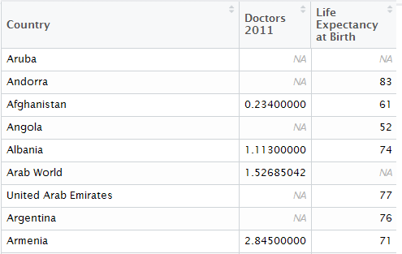
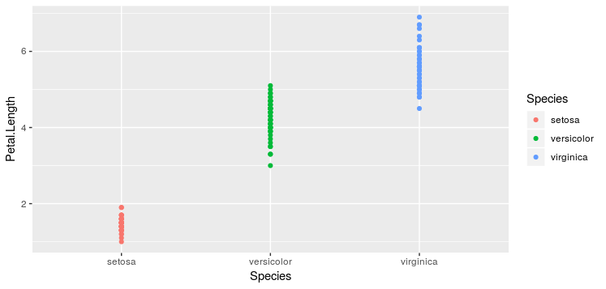
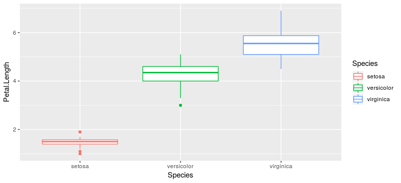
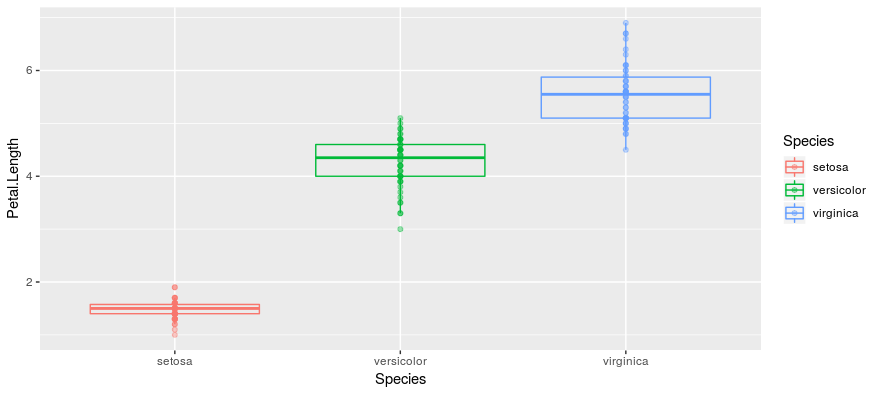
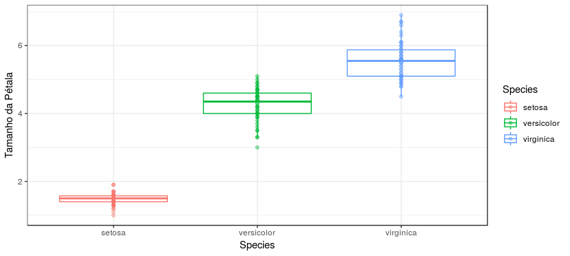
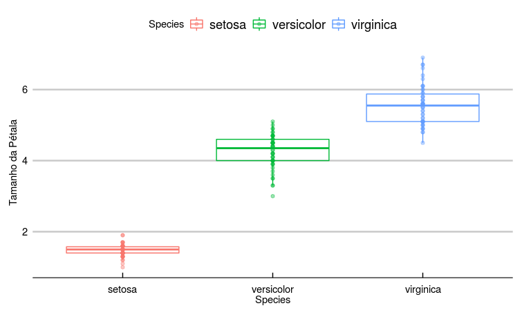

---
output:
  pdf_document: default
  html_document: default
---


# Capítulo 0 : Ferramentas

Programação com estatística básica

\pagebreak


<div style="text-align: right"> Master Foo and the Shell Tools[^1] </div>

---

*Um aprendiz do caminho Unix veio ao Mestre Foo e disse: “Estou confuso. Não é o caminh
Unix que cada programa deve se concentrar em uma coisa e fazê-la bem?  
Mestre Foo assentiu.  
O aprendiz continuou: “Também não é do caminho Unix que a roda não deve ser reinventada?  
Mestre Foo assentiu novamente.  
“Então, por que existem diversas ferramentas com capacidades similares em processamento de texto: sed, awk e Perl? Com qual delas posso praticar melhor o caminho Unix?”  
Mestre Foo perguntou ao aprendiz: “Se você tem um arquivo de texto, qual ferramenta usaria para produzir uma cópia com algumas palavras trocadas por uma string de sua escolha?”  
O aprendiz torceu o nariz e disse: “As expressões regulares de Perl seriam um excesso para tarefa tão simples. Eu não conheço awk, e venho escrevendo scripts sed nas últimas semanas. Como tenho experiência com sed, eu preferiria ele no momento. Mas se o trabalho precisa ser feito apenas uma vez, um editor de textos funcionaria.”  
Mestre Foo assentiu e respondeu: “Quando você estiver com fome, coma; quando estiver com sede, beba; quando estiver cansado, durma.”  
E, ao ouvir isso, o aprendiz foi iluminado.*

[^1]: http://catb.org/esr/writings/unix-koans/shell-tools.html

\pagebreak 

## Computadores

Ao longo do texto, usaremos exemplos com software. Computadores são úteis para acelerar os cálculos necessárias para nossos objetivos.  

Há milênios, o homem usa instrumentos, como ábacos e tabelas, para fazer operações extensas e precisas envolvendo grandes números. Dado um problema ou dado a ser computado, esses mecanismos automatizam partes do processo devido à maneira como foram construídos. A principal diferença destas ferramentas para os computadores de hoje é que nossas máquinas podem ser programadas para fazer computações arbitrárias.  

Ada Lovelace (*10 December 1815 – 27 November 1852*) foi a primeira a descobrir essa possibilidade. Estudando a Máquina Analítica de Charles Babbage, Ada concebeu uma maneira de realizar computações para as quais a máquina não havia sido desenhada originalmente. O programa concebido calculava os Números de Bernoulli. Discutivelmente, alterar a estrutura de máquinas mais simples também consiste em reprogramá-las.   

Máquinas desse tempo pesavam toneladas e eram muito mais lentas. O avançar dos anos tornou a tecnologia mais acessível, ao ponto de possibilitar computadores pessoais de alta potência e baixo-custo. Além disso, ao invés de operações mecânicas complexas, podemos usar linguagens de programação que traduzem comandos baseados no inglês para instruções de máquina. 

Os programas aqui apresentados são escritos em R e Stan. As duas têm código aberto, podendo ser obtidas, instaladas e usadas sem pagamentos. Sendo um texto didático, as implementações com software priorizam legibilidade. Os dois frameworks usam bibliotecas em C/C++/Fortran para otimizar computações e interface com GPU (graphic processing unit) para tratar matrizes.  

R será mais usada. É uma linguagem interpretada voltada à computação estatística, possuindo ferramentas úteis em sua biblioteca de base. Entre estas, funções para gerar e manipular distribuições probabilísticas. 

Sendo uma linguagem de ‘alto nível’, não temos sobrecarga cognitiva no programador com manejo de memória e hardware no código. A abstração de detalhes físicos, como registradores da CPU, são feitas automaticamente pelo interpretador. O ecossistema para visualização de dados possui poder e flexibilidade. A comunidade R cresce rápido e fluência nessa linguagem dá acesso a ferramentas muito diversas com bases grandes de suporte. Há suporte para estilo funcional e orientado a objetos.  

Stan é uma linguagem/plataforma de domínio específico bastante popular entre estatísticos bayesianos. Possui ferramentas poderosas (e.g: Variational inference, MCMC com NUTS e HMC) para lidar com distribuições probabilísticas e inferência nesse contexto.  

\pagebreak 

## R: Curso rápido

Códigos são importantes ao longo dos próximos capítulos para realizar cálculos, gerar dados  e visualizações.  
Felizmente, os programas que escreveremos são simples, de forma que não precisamos conhecer todos os recursos e características da linguagem R. Neste capítulo, entenderemos os instrumentos básicos para caminharmos.  
Veremos diversas maneiras de escrever um programa para calcular a variância $\sigma^{2}$ de um conjunto de medidas.   

### Instalação

#### R

Instruções para download e instalação podem ser encontradas em:  
https://cloud.r-project.org/  
Em Windows, o processo costuma consistir em clicar no executável de instalação e concordar com os prompts.   
Para Linux, envolve adicionar o CRAN à lista de repositórios e baixar o pacote *r-base* ou o código-fonte/tarball diretamente do website. 

#### Rstudio

Com o R instalado, recomendo o uso do ambiente de desenvolvimento RStudio ( https://www.rstudio.com/ ) para obter algumas facilidades. Entre elas: atalhos *vim*, editor com highlight de sintaxe, autocompletar, renderização em tempo real de animações e plots, visualização de datasets, ambiente de desenvolvimento, logs, suporte a markup languages, como Markdown, RMarkdown e Latex.[^2]

[^2]: Este texto é escrito em Markdown e o código-fonte pode ser encontrado em https://github.com/fargolo/stat-learn

### Tipos

Primeiro, vamos conhecer as entidades básicas do R. Lidamos rotineiramente com vetores, que são células contíguas contendo dados.  Os dados podem ser de tipos: lógico (verdadeiro/falso), caracteres, números inteiros, reais e complexos:  

"logical": a vector containing logical values  (TRUE/FALSE) 
"integer": a vector containing integer values  (1,2,3,4…,23,26...)  
"double": a vector containing real values (3.14…)  
"complex"a vector containing complex values (2 +2i)  
"character": a vector containing character values (“string”)  

Para saber o tipo de um objeto em R, use typeof(objeto). Podemos acessar elementos de um vetor pelo seu índice, independente do tipo. Declaramos dois vetores, character e double.   

```r
    >a <- c(“banana”, “terracota”, “pie”)  
    >b <- c(2.2, 4.4, 5.5)  
    > typeof(a)  
    [1] "character"  
    > typeof(b)
    [1] "double"
```

A função *combine*: c(arg1,arg1,...) combina argumentos em um vetor. Para nossas aplicações, vamos usar números reais (double) na maioria dos casos. Os tipos integer, double e complex fazem parte da classe dos números (*numeric*) 

```
    >class(b)
    [1] "numeric"
```
  
### Operadores  

Além dos operadores clássicos (+,-,/,-, ...), usamos constantemente dois operadores pouco comuns: O operador *“<-”* atribui o valor da expressão a sua direita ao objeto à sua esquerda. É preferível ao operador “=” para evitar confusão ao passar argumentos de funções e fazer comparações lógicas.  

```r
    >a <- 3
    >a
    [1] 3
```

O operador *“%>%”* da biblioteca **magrittr** fornece o resultado da expressão à sua esquerda como argumento para a expressão à sua direita. Evita aninhamento de expressões, tornando fluxos de computações mais legíveis.   
As expressões a seguir são equivalentes.  

```r
    >library(magrittr)
    >result <- 3 %>% exp %>% exp
    >result
    [1] 528491311
    >result == exp(exp(3))
    [1] TRUE
```
Onde $exp(a)= e^{a}, e \sim 2.72…$
A expressão  *“3 %>% exp %>% exp”* equivale a *“exp(exp(3))”*, ou $e^{e^3}$. Usando parênteses, partimos da última computação. Usando o pipe (%>%), começamos com a primeira operação. Para a maioria das abstrações, é uma boa maneira de encadear funções.  

Notem que para usar um recurso da biblioteca **magrittr**, carregamos usando o comando *library(magrittr)*.
Para instalar uma biblioteca do repositório oficial (CRAN), usamos o comando *install.packages("magrittr")*.

### Matrizes e data frames

R possui estruturas que ajudam a manipulação de dados estruturados como os que vemos comumente em ciências.  
A mais simples é a lista. Uma lista é um conjunto de objeto de quaisquer tipos. Podemos ter uma lista contendo vetores, doubles, matrizes e gráficos.  
 
```r
    >mlist <- list(a = c(1,5,6,7), b = c("a","b","c",”d”))
    >mlist
    $a
    [1] 1 5 6 7
    $b
    [1] "a" "b" "c" “d”
    >class(mlist)
    [1] "list"
```
    Podemos acessar estruturas internas da maioria dos objetos em R pelo nome usando o operador $:

```r
    >typeof(mlist$a)
    [1] "double"
    >typeof(mlist$b)
    [1] "character"
```
Outro tipo útil é composto pelas matrizes, que correspondem às matrizes da matemática, podendo também conter caracteres em suas células.  

```r
    >matrix(data=c(mlist$a,mlist$b),ncol=2)
           [,1] [,2]
    [1,] "1"  "a"
    [2,] "5"  "b"
    [3,] "6"  "c"
    [4,] "7"  "d"
```

Podemos conduzir multiplicação de matrizes facilmente.  

```r
    >mat_example <- matrix(c(.5,.25,.25,.5,0,.5,.25,.25,.5), nrow=3, byrow=TRUE)
    >mat_example
    	[,1] [,2] [,3]
    [1,] 0.50 0.25 0.25
    [2,] 0.50 0.00 0.50
    [3,] 0.25 0.25 0.50
    >mat_example %*% c(1,0,1)
        [,1]
    [1,] 0.75
    [2,] 1.00
    [3,] 0.75
```
Por fim, data.frames são extensões das matrizes:  

```r
    >mat_example %>% data.frame
           X1   X2   X3
    1 0.50 0.25 0.25
    2 0.50 0.00 0.50
    3 0.25 0.25 0.50
```

Data frames são os objetos mais comumente tratados em R e seguem o formato tidy.  

$\qquad$ *Cada variável corresponde a uma coluna.*  

$\qquad$ *Cada observação corresponde a uma linha.*  

$\qquad$ *Cada tipo de unidade observacional forma uma tabela.*  
  
Um exemplo visual torna as coisas mais fáceis. A seguir, temos uma variável categórica (País) e duas numéricas (Número de médicos por 1.000 habitantes em 2011 e Expectativa de vida ao nascer) em formato tidy:   



Note que cada linha corresponde a apenas um país (observação) e cada coluna representa uma variável. Se queremos ver a observação 9, vamos à linha correspondente e podemos encontrar os valores: “Armenia” (País), “2.845” (Médicos/1.000 hab. em 2011) e “71” (Expectativa de vida ao nascer).   

Para acessar o valor correspondente, usamos índices separados por vírgula. O primeiro espaço é reservado às linhas selecionadas e deve ser um vetor de números (linhas selecionadas) ou vetor com valores lógico do tamanho do dataset (valores com índices TRUE serão incluídos). O segundo espaço corresponde às colunas e deve conter índices numéricos ou nomes das variáveis.  

```r
    # primeiras 5 linhas com variaveis especies e sepal.length’  
    >iris[1:5,c("Species",'Sepal.Length')]
     Species Sepal.Length
    1  setosa      	5.1
    2  setosa      	4.9
    3  setosa      	4.7
    4  setosa      	4.6
    5  setosa      	5.0 
```

### Gramática dos gráficos e ggplot

Uma das ferramentas de destaque no ecossistema R é a **ggplot**. Ela provê uma sintaxe bastante poderosa e flexível para plotar visualizações. O segredo está em seu design, que utiliza gramática de gráficos (**G**rammar of **G**raphics**Plot**). 

Bertin [^3] delineou essa abordagem, que consiste em mapear características dos dados a elementos visuais seguindo uma sintaxe consistente. A lib ggplot implementa uma gramática em camadas, possibilitando superposições para gráficos complexos.  

[^3]: Bertin, J. (1983),Semiology of Graphics, Madison, WI: University of Wisconsin Press

```r
    >head(sleep)
     extra group ID
    1   0.7     1  1
    2  -1.6     1  2
    3  -0.2     1  3
```

Para usarmos o ggplot, podemos declarar (1) o dataframe usado, (2) a relação entre medidas e parâmetros estéticos e (3) objetos geométricos. Parâmetros opcionais podem ser usados, aumentando o número de camadas ou criando transformações.  

Assim, podemos plotar um histograma das medidas dos dois grupos com (1) dataset iris; (2) dimensão y: tamanho da pétala, cores:espécie, dimensão x: espécie; e (3) objeto geométrico: ponto.  

Assim, teremos pontos com a altura (dimensão y) correspondente à medida da pétala e separados ao longo do eixo x por espécies. O ggplot automaticamente discretiza o eixo x.   

```r
    >library(ggplot2)
    >ggplot(data=iris,aes(y=Petal.Length,x=Species,color=Species))+
      geom_point()
```

Para ilustrar a flexibilidade da biblioteca, note que mudando apenas o objeto geométrico (geom), obtemos um gráfico diferente, mantendo dados e relações (mappings) iguais :  

```r
    >ggplot(data=iris,aes(y=Petal.Length,x=Species,color=Species))+
     geom_boxplot()
```


As figuras acimas são conhecidas como boxplots. O centro correspondente à mediana (percentil 50), as bordas correspondem aos percentis 25 (inferior) e 75 (superior). Os fios, conhecidos como “bigodes”, estendem-se até 1,5* IQR (onde IQR = Percentil 75 - Percentil 25).  
É possível adicionar camadas e estas podem sobrescrever informação de camadas anteriores. Isso torna a sintaxe do ggplot altamente modular. A seguir, superpomos pontos e boxplot:  

```r
    >ggplot(data=iris,aes(y=Petal.Length,x=Species,color=Species))+
      geom_point(alpha=0.4)+ # camada 1
      geom_boxplot(alpha=0) # camada 2
```


O parâmetro *alpha* regula a transparência dos objetos. Colocamos os boxplot com transparência total (alpha=0), dando visibilidade aos pontos (alpha=0.4). Adicionamos algum grau de transparência para que pontos superpostos sejam mais escuros que pontos individuais. Adicionaremos uma terceira camada, que  substitui o rótulo do eixo y para uma legenda em português:  

```r
    >ggplot(data=iris,aes(y=Petal.Length,x=Species,color=Species))+
      geom_point(alpha=0.4)+ # camada 1
      geom_boxplot(alpha=0)+ # camada 2
      ylab("Tamanho da Pétala") # camada 3
```


Ainda, existem temas prontos para mudar o estilo geral da imagem:  

```r
    >ggplot(data=iris,aes(y=Petal.Length,x=Species,color=Species))+
      geom_point(alpha=0.4)+ # camada 1
      geom_boxplot(alpha=0)+ # camada 2
      ylab("Tamanho da Pétala") # camada 3  
      theme_bw() # camada 4: tema
```


```r
    >ggplot(data=iris,aes(y=Petal.Length,x=Species,color=Species))+
      geom_point(alpha=0.4)+ # camada 1
      geom_boxplot(alpha=0)+ # camada 2
      ylab("Tamanho da Pétala") # camada 3  
      theme_economist_white(gray_bg = F) # camada 4: tema
```


### Funções

Uma das formas de escrever programas é através de funções.  
Podemos declarar funções que (1) aceitam argumentos de entrada, (2) executam computações com esses argumentos e (3) devolvem resultados na saída.  

Assim, podemos criar a função soma2, que recebe dois argumentos numéricos e retorna a soma de ambos.  

```r
    >soma2 <- function(argumento1,argumento2){
      return(argumento1+argumento2)
    }
```

Ao invocarmos soma2 com os argumentos 2 e 5, recebemos soma2(argumento1=2, argumento2=5) = 2+5 = 7.  

```r
    >soma2(argumento1=2,argumento2=5)
    [1] 7
```

Podemos omitir o nome dos argumentos. Assim os objetos são passados na ordem de entrada.  

```r
    >soma2(2,3)
    [1] 5
```

Por padrão, o valor retornado é mostrado no console.   
R aceita em sua sintaxe que uma função seja argumento de outra numa mesma instrução:  

```r
    >soma2(2, soma2(3,2) )
    [1] 7
```

A expressão acima é equivalente a $(2 + (3+2)) = 7$.  
Podemos definir a função de média para um vetor de números, dado pela (1) soma dividida pelo (2) tamanho do vetor:  

```r
    >mean_vec <- function(x){
      sum(x)/length(x)
    }
    >mean_vec(b) # Anteriormente definido por b <- c(2.2, 4.4, 5.5) 
    [1] 4.033333
```

sum(x) retorna a soma de todos os elementos do vetor x. length(x) retorna o tamanho (número de células) do vetor x.  

A média é uma medida de tendência central para um conjunto de observações. É o ponto mais perto de todos os outros.  

## Muitas formas de calcular a variância

Também podemos calcular uma medida relacionada ao quanto nossos valores se afastam do centro. 

Primeiro, calculamos uma distância entre cada elemento x e a média das observações $\mu$. A noção de distância implica que ela deve ser um valor positivo. Supondo que x e $\mu$ são medidas num espaço ordenado, podemos usa o módulo da diferença entre os valores: $\|x -  \mu\|$. Ainda, podemos usar o quadrado da diferença: $d_{i} = (x_{i} -  \mu)^{2}.$   

A variância $\sigma^{2}$ das observações é uma medida da dispersão de toda a amostra.  
Para calcular $\sigma^{2}$, somamos todas as distâncias $d_{i}$  e dividimos o resultado por $n-1$.  

```r
    >var_2 <- function(x) sum((x - mean(x))^2) / (length(x) - 1) 
    >var_2 (b)
    [1] 2.823333
```
Sendo proporcional às distâncias dos valores em relação à média, a variância $\sigma^{2}$ tende a ser maior quando os valores são muito distintos entre si:  

```r
    >c <- c(100,200,1,45,-24)
    >var_2(c)
    [1] 7966.3
```

Outra medida de dispersão, dada nas unidades originais da medida observada, é o desvio-padrão $\sigma$, dado pela raiz da variância $\sigma^{2}$.  

```r
    >var_2(b) %>% sqrt
    [1] 1.680278
```

O R possui funções embutidas para muitas aplicações estatísticas: sd (desvio-padrão), var (variância), mean (média)... Em especial, temos funções prontas para trabalhar com diversas distribuições probabilísticas de variáveis aleatórias. Para sortear 10 números de uma distribuição normal:  

```r
    >rnorm(n=10, mean=0, sd=1)
     [1]  0.2874490  0.2931469  3.1897423  1.7445002  3.3998010 -0.1482911
     [7]  2.0257046 -0.6002109 -0.2840376 -0.7715565
```
Distribuição gamma.   

```r
    >rgamma(n=10, shape=1)
     [1] 1.1183441 1.2770135 1.0972053 1.4820536 2.3542620 0.8231831 0.5535210
     [8] 5.0481559 0.2853060 0.1623315
```
Exponencial:  

```r
    >rexp(n=10, rate = 1)
     [1] 0.31657586 0.26676766 0.02288276 0.92801416 0.44006133 0.05238540
     [7] 1.10213153 0.91931786 2.58807134 0.41825081
```

### Vetores, loops e recursões

Anteriormente, definimos a função para calcular variância como:  

```r
    >var_2 <- function(x) sum((x - mean(x))^2) / (length(x) - 1)
```

Isso só é possível porque o R aplica funções a vetores de maneira automática. 
Assim, a expressão *(x - mean(x))^2* subtrai a média de cada elemento do vetor x.  
Normalmente, é necessário usar estruturas recursivas para isso. 
O laço for (for loop) define uma sequência de tamanho n definido e repete um bloco de comandos n vezes. 
Se queremos imprimir números entre 1 e 10:  

```r
    >for (i in 1:10) print(i)  
    [1] 1
    [1] 2
    [1] 3
    [1] 4
    [1] 5
    [1] 6
    [1] 7
    [1] 8
    [1] 9
    [1] 10
```

A instrução avalia print(i) para valores i=1,2,3..,10 de forma repetida.  
Vamos reescrever nossa função para calcular variância $\sigma^{2}$ usando um loop. Podemos definir um loop com o tamanho do vetor x e calcular o quadrado da diferença em cada elemento.   
Assim,  

```r
    var_3 <- function(x){
      accumulator <- numeric() #armazena distâncias
      for (i in 1:length(x)) # loop começa em 1 segue até o tamanho do vetor
    	accumulator[i] <- (x[i] - mean(x))^2 # calcula e armazena distâncias.
      return (sum (accumulator) / (length(x) - 1) ) #calcula media
    }
```

Ambas definições apresentam o mesmo resultado que a implementação nativa do R:  

```r
    > var(b)
    [1] 2.823333
    > var_2(b)
    [1] 2.823333
    > var_3(b)
    [1] 2.823333
```

Ainda, uma maneira de manipular muitos elementos é através de funções de alta ordem. Estas funções recebem outras funções como argumentos. Um exemplo é a função map da lib purrr. Definimos uma função para a distância, $f(y) = (y - \mu)^{2}$, e aplicamos em todos os elementos. Só então, somamos os resultados e dividimos por n-1.  
Tudo pode ser feito em apenas um pipe:  

```r
    >map(.f = function(y) (y - mean(arg))^2, .x = arg) %>% # Define e aplica função 
	unlist(.) %>% sum(.)/(length(arg) - 1) # Soma as distancias e divide por n-1
```
Quando usamos o pipe, o caractere de ponto (.) se refere ao valor fornecido como entrada pela pipe anterior. Assim, sum(.), no exemplo, acima soma os valores passados pela função unlist(.), que por sua vez, transforma em vetor uma lista de valores passada pela função *map*.
Nossa função pode ser escrita:  

```r
    var_4 <- function(arg){
      purrr::map(.f = function(y) (y - mean(arg))^2, .x = arg) %>% 
    	unlist %>% sum(.)/(length(arg) - 1) 
    }
    > var_4(b)
    [1] 2.823333
```

\pagebreak

### Exercícios

1. Qual a diferença entre linguagens compiladas e interpretadas?  
2. Um programa escrito em R pode ser escrito em qualquer outra linguagem. Está afirmação é verdadeira? Por quê?  
3. Cite 3 recursos que uma IDE fornece ao programador.   
4. Modifique o tema de fundo do RStudio para um de cor escura (menos luz para os olhos :) ).  
5. Usando o operador *<-* , produza:   
  * Um vetor com componentes do tipo logical  
  * Dois vetores de 5 elementos do tipo double  
  * A soma dos elementos nos vetores do item b.  
  * A divisão entre elementos dos vetores do item b.   
  * Aplique as funções sd, mean e var em amostras normais aleatórias de n = 10, 30, 100 e 300. A função rnorm (n,mean,sd) pode ajudar. Compare os valores da distribuição de origem com os obtidos.  
7. *UnLISP it!* Transforme as seguintes expressões, substituindo parênteses aninhados pelo operador pipe (%>%) quando julgar conveniente:
  * >round ( mean ( c(10 , 2, 3 ) ) )
  * >round (mean ( rnorm (n = ceiling (runif (1,0,10)))))
  * >paste("a",seq(1:max(sample(1:10))))
  * >round(nrow(iris) + exp(1), digits = ceiling(runif(1,0,10)))
8. Usando o código das funções var_2 (vetorizado), var_3 (for loop) e var_4 (função de alta ordem map)  
  * Escreva as funções correspondentes (sd_2, sd_3, sd_4) para desvio-padrão e compare com a função padrão do R (sd). Dica: Basta aplicar raiz quadrada ao valor final retornado anteriormente! 
9. Usando o dataset iris  
  * Selecione apenas os exemplos com tamanho de pétala maior que 4.
  * Selecione os 10 maiores exemplares. Suponha que o tamanho é dado pela média das 4 medidas fornecidas. 
  * Calcule a média e o desvio-padrão para duas medidas em cada espécie.
  * Faça um scatterplot entre duas medidas
    * Adicione cores de acordo com a espécie
    * Adicione o rótulo de texto a um dos pontos
    * Mude títulos (principal, eixos x e y, legenda)
    * Mude o tema de fundo. Dica: experimente os temas da lib *ggthemes*
10. Usando loops, escreva uma função que retorna uma aproximação de $e$. 
  * Lembre-se de que $e = \lim_{n \rightarrow \infty} (1+\frac{1}{n})^n$.  


\pagebreak
