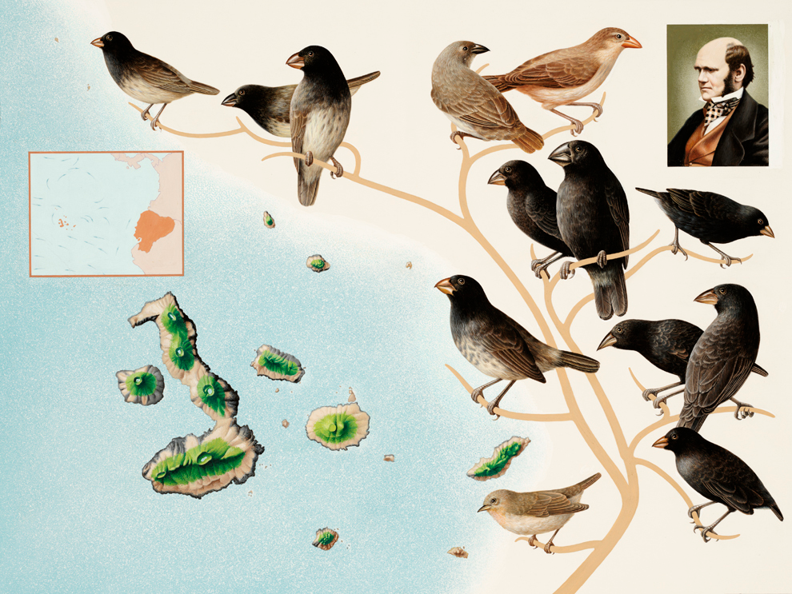
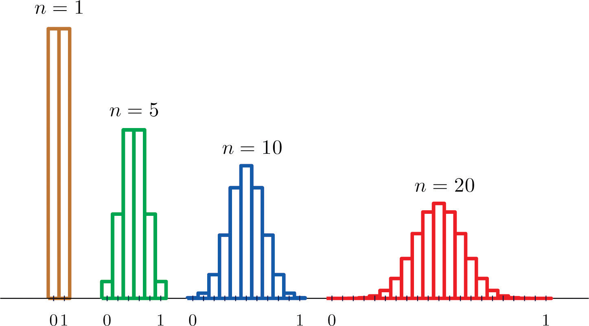
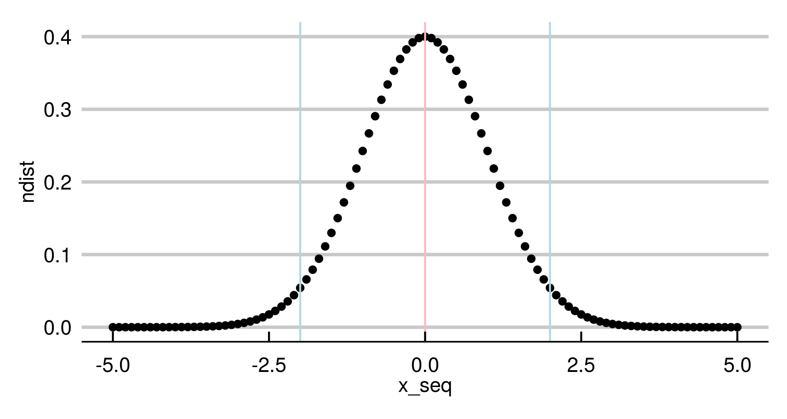
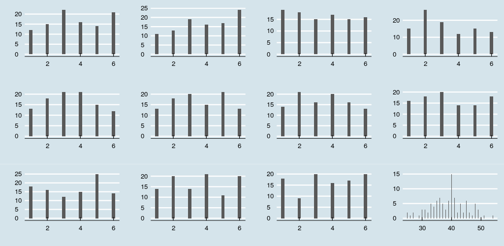
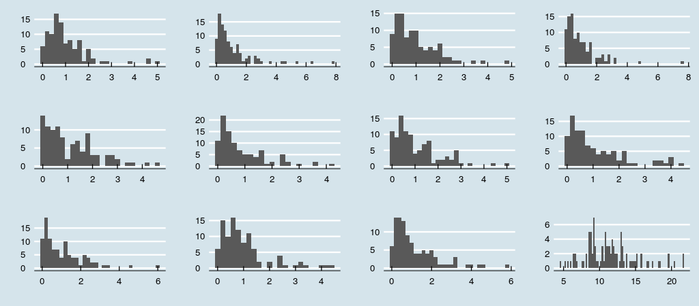
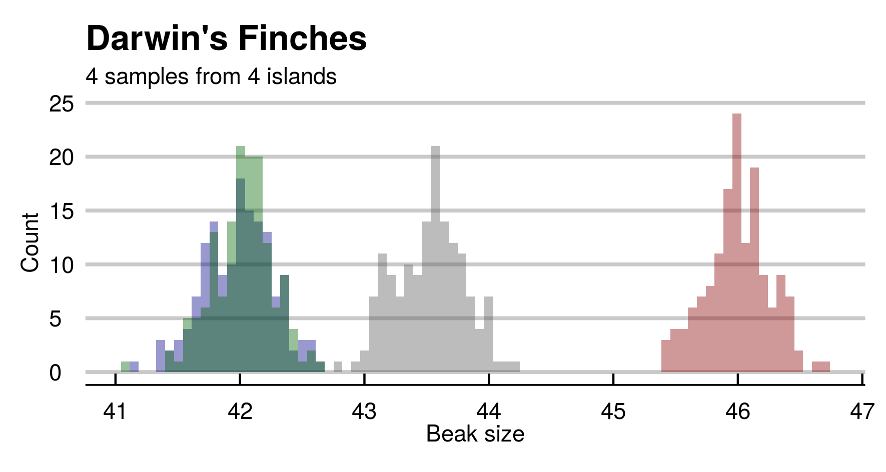
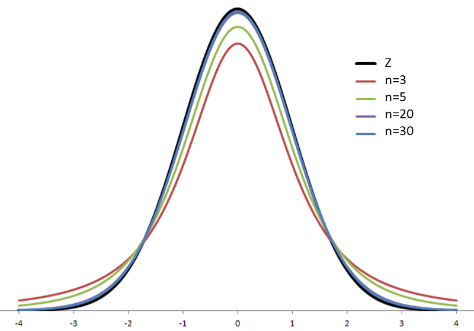

---
output:
  pdf_document: default
  html_document: default
---


# Capítulo 1 : Os pássaros de Darwin e o método hipotético-dedutivo.
**Testes estatísticos e distribuições probabilísticas**

## Parte 1 - Introdução

Charles Darwin observou que os pássaros fringilídeos nas ilhas de Galápagos apresentavam variedades de formato e tamanho dos bicos. Sua intuição sobre a origem das variedades a partir de um ancestral comum foi um dos argumentos mais 
contundentes do “On the Origin of Species” (1859).   

Estudamos a relação natural entre ciências empíricas e duas distribuições probabilísticas: a distribuição normal e a distribuição t, ligadas entre si.  A adoção da distribuição normal em trabalhos científicos é popular, porém os motivos são pouco entendidos. O Teorema do Limite Central é fundamental nesse contexto.  

Usamos as distribuições citadas para estudar as medidas dos bicos dos tentilhões em pequenas amostras de cada ilha e fazer inferências sobre as populações. O racional de testes de hipótese é introduzido.  


\pagebreak 

### Ilhas Galápagos

Em sua viagem pelo mundo a bordo do Beagle, Charles Darwin descreveu um grupo de pássaros que habita as Ilhas Galápagos, arquipélago localizado a aproximadamente 900 km da costa do Equador (América do Sul). A variedade em tamanhos dos bicos chamou atenção: *“It is very remarkable that a nearly perfect gradation of structure in this one group can be traced in the form of the beak, from one exceeding in **dimensions** that of the **largest** gros-beak, to another **differing** but little from that of a warbler".*[^4]  

Ele observou que a variedade dos bicos era adaptada à dieta de cada grupo: frutas, nozes, insetos. Os de bico pontudo conseguem comer frutas e arilo da semente do cacto, enquanto os de bico curto estraçalham a base do cacto e comem sua polpa. 

Antes da publicação de A origem das Espécies, o caso dos fringilíddeos (nome destas aves) já continha um embrião do processo de seleção natural. Na segunda edição, em 1845, ele especula sobre um grupo ancestral comum moldado por fins específicos:  

*“Seeing this gradation and diversity of structure in one small, intimately related group of birds, one might really fancy that from an original paucity of birds in this archipelago, one species had been  taken and modified for different ends.”[^5]* 

[^4]: *É bastante notável que uma gradação quase perfeita na estrutura desse grupo possa ser traçada na forma do bico, desde um excedendo as dimensões do maior dos pardais bico-gordo, até outro diferindo pouco do papa-amoras.* Tradução livre. The Voyage of the Beagle (1839). 
[^5]: *(...)[ao] ver esta gradação e diversidade em estrutura em um pequeno, intimamente relacionado grupo de pássaros, é possível imaginar que, a partir de poucos pássaros deste arquipélago, uma espécie foi escolhida e modificadas para certos fins.* Tradução livre. Darwin, Charles (1845), Journal of researches into the natural history and geology of the countries visited during the voyage of H.M.S. Beagle round the world, under the Command of Capt. Fitz Roy, R.N (2nd. ed.), London: John Murray 


### Dúvidas - Hipóteses e observações

Darwin levou aproximadamente 20 anos entre a concepção inicial da ideia (1838) e a publicação da obra (1859). Ciente de que propostas semelhantes foram ridicularizadas, ele foi meticuloso  na defesa de sua teoria sobre a origem das espécies.  

A observação dos pássaros na ilha era uma evidência, porém não confirmava a teoria. Darwin então traçou um plano de investigação para testar diversas consequências distintas da teoria.
Distribuição geográfica, variabilidade fenotípica (hibridização e fertilização cruzada), variação sob domestição... Será que experimentos nessas áreas obedeceriam as predições?  

As duas décadas foram dedicadas a contatar e interagir com especialistas de diferentes áreas (da botânica à criação de pombos e coelhos). As evidências acumuladas falaram fortemente em favor da explicação darwiniana, que descrevia campos diferentes num modelo abrangente e simples. O trabalho de formiga consistia em explorar dados e em convencer outros cientistas a aceitarem a ideia. Isto durou até que Alfred Wallace antecipando algumas das consequências mais contundentes em 1855, as quais Darwin evitou atacar diretamente. ("On the Law which has Regulated the Introduction of New Species", Annals and Magazine of Natural History).  

Charles Lyell era um geologista, amigo de Darwin, e foi quem incentivou fortemente a publicação de uma exposição sólida da teoria. A teoria concebida 1938 para a origem das espécies poderia estar errada, ainda que as evidências do Beagle fossem promissoras. O estudo das hipóteses secundárias esclareceria a veracidade da teoria. As confirmações experimentais deram segurança para uma defesa convincente.  

**Probabilidades**
É interessante notar que a linguagem usada para denotar diferenças é eminentemente quantitativa (no trecho acima: *dimensions*, *largest*, *differing*).

Darwin observou a adequação dos bicos à dieta através de sua intuição, sem realizar medidas. 
A inspeção visual de um naturalista treinado foi capaz detectar essas nuances. Sob sua percepção, havia um total de **3 espécies** em 4 ilhas: 1 na Ilha Charles, 1 na Ilha Albemarle e 1 nas ilhas James e Chatham. Inicialmente, notou que os pássaros eram semelhantes àqueles vistos no Chile. Darwin coletou 26 pássaros e os levou de volta para que um ornitólogo os estudasse com mais detalhe. O especialista (John Gould) sugeriu que os 26 pássaros representavam 12 espécies completamente novas, número que posteriormente passou para 25. Hoje, os taxonomistas sugerem um número de **15 espécies**.   

---  

Assim como o naturalista, estudaremos observaremos os bicos em busca de diferenças para grupos de pássaros de Galápagos. Porém, usaremos estatística e probabilidades (distribuição normal e Student's t) para testar hipóteses e fazer conclusões mais acuradas sobre as medidas.  

\pagebreak

### A distribuição normal e um curioso teorema

Em trabalhos empíricos, é comum a suposição de que medidas de uma variável aleatória vêm de uma população com distribuição normal. A seguir, vamos estudar o comportamento dessa função probabilística.

Abraham de Moivre (26 May 1667 – 27 November 1754) , sem financiamento exclusivo para estudos e pesquisa, prestava serviços secundários. Entre eles, cálculos de probabilidades em jogos de azar para clientes. Em 1733, de Moivre percebeu que as probabilidades de uma distribuição binomial, como o lançamento de moedas $(p(cara) = p(coroa) = 0.5)$, aproximam-se de uma curva suave (contínua) à medida em que a quantidade de eventos aumenta.  



A distribuição de Bernoulli descreve a possibilidade de dois eventos, como o lançamento de moedas. Tomando os valores dicretos de caras (0) e coroas (1), a observação é $1$ com probabilidade $p$ e $0$ caso contrário $(1-p)$.
Para uma moeda honesta, temos uma distribuição probablística uniforme sobre o domínio, $X={0,1}$:  $P(1) = P(0) = 0.5$. 

Se somarmos distribuições de Bernoulli, obtemos a distribuição binomial. Cada observação é um conjunto de lançamentos. Tomando $p=0.5$, resultados mais frequentes são números parecidos de caras (0) e coroas (1).   

Para $n = 10$, é muito mais provável obter um número de caras próximo a 5 (centro das curvas) que um resultado com 9 ou 10 lançamentos iguais. É possível demonstrar que aumentar o valor de n faz que com que a distribuição se aproxime da seguinte curva contínua:  



De Moivre intuiu que a distribuição de binomiais com muitos lançamentos aproximava o de uma função suave. 
Ele buscava uma aproximação em termos da função exponencial [natural] $e^x$.  

Mas quais os parâmetros da curva?  

Primeiro, de Moivre deduziu a solução para o problema das moedas $(p = \frac{1}{2})$. A seguinte expressão geral descreve a probabilidade $P(x)$ correspondente à curva que procuramos, conhecida como *gaussiana*.  

$$f(x) = \frac{1}{\sqrt{2\pi}}e^{-\frac{x^{2}}{2}}$$

Em que $e$ é número de Euler $(e \sim 2.72…)$.  

**Intuições**
A fórmula consiste em um fator, $\frac{1}{\sqrt{2\pi}}$ (aproximadamente 0.4), multiplicando o resultado da exponencial.  
Em R, podemos definir:  

```r
    >mgauss <- function(x) 0.4*exp((-1)*(x^2)/2)
```

Em seguida, obter valores no intervalo $[-5,5]$ e plotá-los, dando origem à curva gaussiana anterior.   

```r
    >library(ggplot2)
    >x_seq <- seq(-5,5,by = 0.1)
    >ndist <- purrr::map(.f=mgauss,.x=x_seq) %>% unlist
    >ggplot(data.frame(ndist,x_seq),aes(x=x_seq,y=ndist))+
     geom_point()+ ylab("")+xlab("")+
     geom_vline(xintercept = 2,color="light blue")+
     geom_vline(xintercept = -2,color="light blue")+
     geom_vline(xintercept = 0,color="light pink")+
     theme_economist_white(gray_bg = F)
```

Observamos como a distribuição se dá a partir da equação.  

Já que $x^{2}$ retorna apenas valores positivos, $-x^{2}$ sempre retorna negativos. Nossa função gera valores entre 0 e 1 exponenciando $(e \sim 2.718...)$ a um fator negativo quadrático $(y = 0.4*e^{-x^{2}/2})$.  

Notamos também que valores próximos ao centro $(x \sim \mu = 0)$ fazem com que o expoente de se aproxime de 0, maximizando nossa função: $f(0) = 0.4 * e{-x^{2}/2} = 0.4 * e^{0} = 0.4)$. O valor obtido (0.4) corresponde ao topo da curva no gráfico acima (linha rosa).  

Observamos a curva se aproximar simetricamente do máximo em valores próximos de 0.  

Isso reflete diretamente o fato de que valores próximos à média serão mais prováveis e valores extremos menos prováveis. A rigor, a probabilidade para qualquer valor dentre os infinitos possíveis é zero.  

É possível avaliar a probablidade de evento um relacionado ao intervalo entre os pontos $a$ e $b$ pela integral de $f(x)$ sobre o intervalo $[a,b]$:   
$$P(A_{a,b})= \int_{a}^{b}{f(x)dx}$$  

Por exemplo, um evento ($A$) relacionado a 'valores menores ou iguais a zero' em uma escala estão no intervalo $[-\infty,0]$:  
$$P(A) = \int_{-\infty}^{0}{f(x)dx}$$  

O termo quadrático torna a distribuição simétrica para valores opostos em relação à média. $P(A) = P(-A)$. Como calculamos $f(2)$ antes, sabemos que: $f(-2) = f(2) = 0.05$ para $\mu = 0$. É igualmente provável encontrar valores duas unidades maiores ou duas unidades menores que a média. Esses pontos estão marcados por uma linhas azuis na figura.  

Podemos trabalhar com curvas normais com centros (média $\mu$) deslocados para a esquerda ($\mu$ < 0) ou para a direita ($\mu$ > 0), subtraindo o termo de $x$ em nosso expoente. Além disso, diferentes variâncias ($\sigma^{2}$) refletem a frequência de valores longe da média e o quão distante dela eles são. Visualmente, determina o tamanho da base do sino na ilustração (Figura 3).  

Usamos a notação $N \sim (\mu, \sigma^{2})$ para descrever uma distribuição gaussiana com média $\mu$ e variância $\sigma^{2}$ arbitrárias:

$$f(x) = \frac{1}{\sqrt{2\pi\sigma^{2}}}e^{ -\frac{(x-\mu)^{2}}{2\sigma^{2}}}$$

---  

O valor $\frac{1}{\sqrt{2\pi}}$ surge como normalizador para avaliarmos a função como densidade de probabilidade (A integral de $-\infty$ a $+\infty$ deve ser 1). O valor $\pi$ surge da integral de Gauss para $e^-x^{2}$ e decorre do fato de $2\pi i$ ser período da função $e^{x}$:  
$$\int_{-\infty}^{+\infty} e^{-x^{2}}dx = \sqrt{\pi}$$  

---  

Poderíamos encontrar características desejáveis, como a simetria citada acima, em outras distribuições. 

*Então, por que usamos uma equação mais complexa?*  
Distribuições binomiais grandes e moedas são tão importantes? Os lançamentos são exemplo de uma classe maior de fenômenos. Cada série de resultados é composta por muitos eventos quase idênticos (lançamentos individuais).  


#### O Teorema do Limite Central

A razão é o Teorema do Limite Central.  

Se somarmos muitas distribuições de uma mesma família, a distribuição resultante se aproxima de uma normal. Sem muitas explicações, assumimos que isso era verdade para moedas.  
Exemplos ajudam a ganhar intuição. Ao lançar um dado justo de 6 faces, temos probabilidade de $\frac{1}{6}$ em cada resultado.  


Uma distribuição discreta uniforme, em que $P(1) = P(2) = P(3) = P(4) = P(5) = P(6)$ e definida para números naturais entre 1 e 6: $X \sim U_{discr}(1, 6).$  

A média para muitos lançamentos, ou valor esperado, é dado por:  
$E(X) = E(U(1,6)) = (1+6) / 2 = 3.5$  

Vamos fazer um experimento virtual usando 100 lançamentos de 11 dados.   

O código em R para a seguir gera os dados e as visualizações de que precisamos:  

```r
    >library(magrittr)
    >library(ggthemes)
    >library(ggplot2)
    >source("aux/multiplot.R")
    >set.seed(2600)
    >n_plots <- 12
    
    >dice_fun <- function(n){runif(n, min=0, max=6) %>% ceiling} # Random samples
    >data_mat <- replicate(n=n_plots-1,dice_fun(100)) # Replicate
    >data_mat <- cbind(data_mat,rowSums(data_mat)) # Sum
    
    >plot_list <- vector("list", n_plots) # Plot each distribution
    >plot_list <- apply(X=data_mat, MARGIN=2, FUN=function(x)
      ggplot(data.frame(obs=x),aes(x=obs)) +
    	geom_histogram(binwidth = 0.2)+
    	ylab("")+xlab("")+
    	theme_economist())
    
    >m_plot <- multiplot(plotlist = plot_list,cols=n_plots/3)
    # Multiplot function available at:
    # http://www.cookbook-r.com/Graphs/Multiple_graphs_on_one_page_(ggplot2)/
```
\pagebreak 



Notamos que as barras estão distribuídas com alturas bastante parecidas nas 11 primeiras células. A frequência esperada para cada valor é ~ 1/6 do total de 100 lançamentos. $Freq (X_{i}) \sim \frac{1}{6}*100 \sim 16.66$  
Algo interessante ocorre com a soma das distribuições (canto inferior direito).   

O valor esperado é, como diz a intuição, a soma dos valores esperados em cada amostra:  
$E(X) = \sum_{i=1}^{11} E(U_{i} \sim (1,6)) = 11*3.5 = 38.5$  

O valor 38.5 corresponde aproximadamente ao centro da distribuição resultante  (Figura 2, canto inferior direito)
Entretanto, a distribuição muda de forma! Sem muito esforço, é notável a semelhança com a curva normal, com valores extremos menos frequentes e simetricamente afastados da média (valor esperado), que define o valor máximo.  

É possível provar que a soma de muitas distribuições de uma mesma família converge para a distribuição normal em qualquer caso. Desde que estas sejam independentes. A esse resultado damos o nome de Teorema do Limite Central. A prova formal pode ser consultada em outro local, [^6] mas voltaremos a ela.   
Este resultado tem uma sutil importância para o estudo dos fenômenos naturais através de experimentos. 

[^6]: Yuval Filmus. 2010. Two Proofs of the Central Limit Theorem http://www.cs.toronto.edu/~yuvalf/CLT.pdf . Ela se dá mostrando a convergência de momentos entre a soma e gaussiana, um conceito que entenderemos no capítulo a seguir.

### Ciência experimental e o Teorema do Limite Central

Muitos objetos de interesse para os cientistas são manifestações de fenômenos envolvendo múltiplos elementos. Um exemplo trivial está na cor da pele de seres humanos. Uma parte considerável depende do número de genes herdados relacionados à melanina. Eles se comportam de maneira aditiva.  
Assim, cada variante de gene extra pode contribuir para a cor final com X unidades na escala para medir pigmentação.  
 
A cor de um indivíduo será influenciada pela soma dessas distribuições, o que é análogo à matemática descrita para os lançamentos de dados.  


Podemos comparar grupos quanto a medidas fenotípicas finais (cor da pele) sem saber detalhes sobre as relações entre cada gene e seus mecanismos de expressão e regulação. 

A distribuição final de melanina vem da soma distribuições individuais semelhantes e tenderá a ser normal.  

Como vimos, o mesmo é válido para quaisquer distribuições subjacentes: se elas forem gama, uniformes ou de Poisson, a distribuição da soma ainda tenderá à normalidade.  

A figura 2 mostra a soma de distribuições uniformes para dados honestos, evidenciando que esta se aproxima de uma normal.

$X \sim U_{1}(1,6) + U_{2}(1,6) + … + U_{11}(1,6) = X \sim N(38.5,\sigma^{2})$

Vamos visualizar o mesmo processo para uma outra família de distribuições, gamma:  

$X \sim \gamma_{1}(\alpha, \beta) + ... + \gamma_{n}(\alpha, \beta) = X \sim N(\mu',\sigma')$

Para valores grandes de n:
 
```r
    >gamma_fun <- function(n){rgamma(n,1)}
    >data_mat <- replicate(n=n_plots-1,gamma_fun(100))
    >data_mat <- cbind(data_mat,rowSums(data_mat))
    
    >plot_list <- vector("list", n_plots)
    >plot_list <- apply(X=data_mat, MARGIN=2, FUN=function(x)
      ggplot(data.frame(obs=x),aes(x=obs)) +
    	geom_histogram(binwidth = 0.2)+
    	ylab("")+xlab("")+
    	theme_economist())
    
    >m_plot <- multiplot(plotlist = plot_list,cols=n_plots/3)
```




Novamente, verificamos que a soma começa a ser simétrica em torno da média, com formato de sinos (base alargada). 
Muitos fenômenos observáveis em nosso universo são naturalmente compostos por múltiplos elementos semelhantes. Especialmente em sistemas biológicos, há redundância de componentes e um objeto de interesse para cientistas é resultado da combinação de muitas variáveis subjacentes. O teorema do limite central permite que utilizemos distribuições normais para uma grande variedade de problemas. Ainda que as distribuições subjacentes sejam desconhecidas, o efeito resultante de uma grande combinação terá distribuição gaussiana em muitos casos.  

A descoberta das equações que regem mecanismos de convergência em cenários probabilísticos foi uma grande evolução para as ciências experimentais.   

\pagebreak

### Exercícios

1. Sobre a distribuição normal para uma variável aleatória, é verdadeiro (mais de uma possibilidade):
    * a.  A soma da probabilidade de todos os valores possíveis é 1.
        * i.  $\int_{-\infty}^{+\infty} f(x) dx= 1.$  
    * b. É simétrica em relação à moda.
    * c. O valor esperado é dado por 1/$\sigma\sqrt{2\pi}$.
    * d. 95% dos valores estão próximos à média.
    * e. Valores extremos são improváveis.
    * f. É unicamente determinada por variância $\sigma^{2}$ e média $\mu$.
    * g. É contínua e diferenciável.
    * h. Amostras pequenas resultam em distribuições t.
2. Usando o comando “?Distributions” acesse algumas distribuições disponíveis na biblioteca de base do R.
    * a. Plote o histograma da soma de 100 distribuições $X^{2}$ (função rchisq; use n = 60).
    * b. Faça o mesmo procedimento para 100 distribuições de outra família e tamanho à sua escolha. 
    * c. Obtenha os valores de skewness e kurtosis para essas distribuições. Uma distribuição normal padrão $(\sigma^{2}=1;\mu=0)$ possui skewness (assimetria) de 0 e kurtosis (frequência de valores mais extremos) de 3. Quais os encontrados por você?
    * d. Cite dois fenômenos naturais cuja distribuição estatística é conhecida e qual a distribuição correspondente.

\pagebreak

## Parte 2 - Darwins’s Finches e um teste paramétrico

Mostraremos como a contribuição individual de genes com efeitos aditivo de distribuição uniforme resulta em medidas aproximadamente normais para os bicos das aves.  

Vamos simular as medidas de bicos em 4 amostras (n=150) de pássaros.  
O tamanho dos bicos é dado pelo efeito aditivo de muitos genes semelhantes, portanto esperamos que sua distribuição seja normal pelo Teorema do Limite Central.   

Uma cópia do gene adiciona x milímetros ao tamanho final. O valor de x é sorteado de uma variável aleatória de distribuição uniforme,  $X \sim U(0,1)$.  
Pássaros têm um número fixo de n de genes aditivos em cada amostra, sorteado no intervalo entre 80 e 100. A medida final dos bicos é dada pela soma efeitos dos n genes. Esse número é fixo em cada população e varia entre populações. 

Para simular os dados com as condições acima:

```r
    >library(magrittr)
    >library(ggthemes)
    >library(ggplot2)
    >set.seed(2600)
    
    >n_birds <- 150 # sample_size
    >genes_low <- 80 # lower bound on number of genes
    >genes <- 100 # upper bound on number of genes
    >n_islands <- 4 #samples
     
    >unif_sum <- function(genes){
    	replicate(n = genes,
              	expr = runif(100, min=0, max = 1)) %>%
    	rowSums
      }
    
    >generate_pop <- function(n_pop,n_genes){
      replicate(n=n_pop,
            	expr = unif_sum(n_genes) %>% mean)
      }
    
    
    >galapagos_birds <- purrr::map(.f = function(x) generate_pop(n_pop=n_birds,
                                                            	n_genes = x),
                              	.x = runif(n=n_islands, genes_low, genes) %>% ceiling) %>%
      unlist %>% matrix(nrow=n_birds,byrow=F) %>%
      data.frame
```

Como esperado, verificamos que o histograma das medidas finais se aproximam de uma gaussiana. 

```r
    >my_alpha <- 0.5
    >my_bins <- 50
    >ggplot(data=galapagos_birds,aes(x=X1))+
      geom_histogram(alpha=my_alpha,bins = my_bins)+
      geom_histogram(data=galapagos_birds,aes(x=X2),fill="dark blue",
                 	alpha=my_alpha,bins = my_bins)+
      geom_histogram(data=galapagos_birds,aes(x=X3),fill="dark red",
                 	alpha=my_alpha,bins = my_bins)+
      geom_histogram(data=galapagos_birds,aes(x=X4),fill="dark green",
                 	alpha=my_alpha,bins = my_bins)+
      xlab("Beak size")+ylab("Count")+
      ggtitle("Darwin's Finches",subtitle = "4 samples from 4 islands")+
      theme_economist_white(gray_bg = F)
```



Os números aleatórios gerados usando a semente sugerida (set.seed(2600), linha 4 do código acima) são semelhantes à suposição de Darwin: 4 ilhas (amostras) e três espécies (distribuições de bicos). Notamos que há duas amostras (verde, azul) de medidas bastante parecidas e outras duas separadas (cinza, vermelho).   
Supondo que medimos os bicos de algumas aves, como saber se os grupos são diferentes?  
Calculando as diferenças entre distribuições, podemos inferir se duas amostras têm o mesmo número de genes subjacentes! Para isso, usaremos um racional e algumas ferramentas novas.  

\pagebreak

### Testes de hipótese

Filósofos da ciência estudam características no modus operandi de outros estudiosos. O que há em comum entre os procedimentos empregados por biólogos e geólogos?  O que distingue Charles Darwin e Paul Dirac de John Dee e Edward Kelley? O que funciona em áreas distintas do conhecimento humano?   

Adotamos a denominação coletiva de “ciências” para algumas áreas do conhecimento. Ainda, associamos a elas características em comum nos procedimentos e na estrutura interna. De alguma forma, cientificidade comunica credibilidade. Nas últimas décadas, filósofos discutiram a validade do problema de demarcar ciência de pseudociência e não-ciência.[^7]
Neste capítulo, vamos nos ater a um paradigma conceitual mais antigo e indiscutivelmente influente. 

O método hipotético-dedutivo foi popularizado no século XX como uma bandeira de identificação associada ao trabalho científico. Um ciclo que consiste em formular teorias, desenhar experimentos, testar hipóteses falseáveis, verificar resultados e repetir o processo de forma iterativa.  

O racional em usar hipóteses testáveis é de que proposições válidas sobre um sistema contém informações que ajudam a prevê-lo. Assim, "faz sol ou não amanhã" é uma proposição inútil, enquanto "faz sol amanhã" é uma proposição útil. Note que "faz sol amanhã" é uma hipótese testável (falseável), enquanto "faz sol ou não amanhã" é uma hipótese verdadeira independente das observações.  

O exemplo é grosseiro, porém alguns ramos do conhecimento humano produziram hipóteses não-falseáveis. K. Popper, líder da revitalização do método hipotético dedutivo no século passado, atacou severamente o materialismo dialético de Karl Marx, assim como a teoria de evolução por seleção natural de Charles Darwin. Marx previu que a revolução aconteceria em uma nação industrializada através da classe operária e outros eventos que não se concretizaram. Seus seguidores usaram hipóteses *ad-hoc* para justificar a abservação. A teoria da evolução por seleção natural de Darwin era amparada em muitos exemplos de reprodução impossível (e.g. recomposição da trajetória evolutiva em fósseis). A psicanálise também sofreu duras críticas, em virtude da irrefutabilidade de seus pilares centrais.  

Para Popper, a dificuldade em gerar hipóteses testáveis e falseáveis sinalizava uma evidente fragilidade nas teorias, as quais não empregariam métodos científicos em seus avanços. 

Uma maneira de formalizar essa ideia, incorporando o uso de ferramentas quantitativas, é através de probabilidades. Calculamos a probabilidade associada a observações, considerando o cenário de uma hipótese (falseável).
Esse racional adequa ferramentas matemáticas robustas à plataforma epistemológica de Popper, sendo um modelo dominante de produção em ciências experimentais.

[^7]:Massimo Pigliucci - Philosophy of Pseudoscience: Reconsidering the Demarcation Problem

Em geral, os pesquisadores formulam uma hipótese base, chamada hipótese nula, que descreve o cenário menos interessante para o trabalho. Por exemplo, se estamos comparando dois grupos, A e B, quanto a uma intervenção, a hipótese nula costuma declarar que os grupos são iguais.  
Queremos estudar o tamanho dos bicos de pássaros das ilhas A e B. A hipótese nula natural é: Não há diferença entre os bicos dos pássaros do tipo A e B.  
Medimos o bico de alguns pássaros dos dois grupos e calculamos a probabilidades de encontrarmos essas medidas considerando que A e B são iguais. Se essa probabilidade for muito baixa, rejeitamos nossa hipótese.  

Estruturando os passos:

1. Definimos a hipótese nula ($H_{0}$) e pelo menos uma hipótese alternativa($H_{1}$).
  * $H_{0}$: Pássaros das ilhas A e B possuem bicos de tamanho igual.
  * $H_{1}$: Os pássaros possuem bicos de tamanho diferentes.

Então, podemos fazer um experimento, coletando medidas experimentais para o comprimento dos bicos. Essas medidas, junto a premissas matemáticas razoáveis, permitem especular: qual a probabilidade p de obter nossas observações considerando distribuições iguais entre A e B? Isto é, considerando $H_{0}$ verdade, nossos resultados seriam raros ou comuns? 

Caso p seja menor que um limiar pré-definido (convencionalmente, 0.05), rejeitamos $H_{0}$. A probabilidade é muito pequena para $H_{0}$ ser verdade.  

A domínio dos procedimentos hipotético-dedutivos nas ciências produziu resultados interessantes.  
Especialmente no eixo de trabalho denominado por Thomas Kuhn de "ciência normal", focada no acúmulo de evidências e testagem de hipóteses. O fantasma de desenhar um experimento imparcial com possibilidade de falha aguçou a percepção de pesquisadores para a falibidade de ideias.  
O grau de sofisticação em reprodutibilidade de procedimentos foi amplificada.  

#### Nota

*Usamos o limite inferior de 0.05 como critério para rejeitar a hipótese nula, o que pode parecer arbitrário. E é. Os valores p eram interpretados de acordo com sua magnitude e estatística com base em que foram calculados. Foi Ronald Fisher, em Statistical Methods for Research Workers (1925), quem propôs (e posteriormente popularizou) o número: "The value for which $p=0.05$, or 1 in 20, is 1.96 or nearly 2; it is convenient to take this point as a limit in judging whether a deviation ought to be considered significant or not.[^8]"*  

[^8]: O valor [da estatística z em uma curva normal] para o qual $p=0.05$, ou 1 em 20, é de 1.96 ou aproximadamente 2; é conveniente pegar esse ponto como um limite ao julgar quando um desvio deve ser considerado significante ou não.


### Teste t e distribuição t de Student: Um exemplo prático

Para testar estatisticamente se as medidas são diferentes, executaremos um teste t para comparação dos grupos. 

A distribuição t surge quando queremos entender quão improváveis são nossas estimativas ($\mu'$) supondo uma média real hipotética ($\mu$) de origem em uma variável de distribuição normal desconhecida. 

**Exemplo**: Medimos os bicos de 30 pássaros. Obtivemos média amostral $\mu'$ = 38 mm e desvio-padrão $\sigma'$ = 0.3 mm.  
**Problema**: Supondo que a média real ($\mu$) da população é de 40 mm, qual é a probabilidade de obtermos $\mu'$ = 38 mm em uma amostra aleatória, como aconteceu em nosso experimento?  

Entender a imprecisão da estimativa de uma média foi o eixo principal para a descrição dessa distribuição por William Gosset. Sob o pseudônimo Student, o estatístico, que trabalhava para a fábrica de cerveja Guiness, publicou na Biometrika (1908) o famoso artigo *The probable error of a mean*.   

Para entender a imprecisão, necessitamos de uma medida da dispersão dessas medidas.  
Assumimos amostras retiradas de uma variável aleatória com distribuição normal com média $\mu$ e desvio-padrão $\sigma$.  Podemos retirar *j* amostras de tamanho *n* e calcular a média dessas amostras $\mu_{1}', \mu_{2}', ..., \mu_{j}'$. As médias amostrais $\mu'$ são estimativas da média real $\mu$.   

Qual a dispersão das estimativas $\mu_{1}', \mu_{2}', ..., \mu_{j}'$? 

Para um conjunto de estimativas $\mu_{1}', \mu_{2}', ..., \mu_{j}'$, chamamos de **erro padrão** (*standard error of the mean*) o desvio-padrão populacional $\sigma$ dividido pela raiz quadrada do tamanho da família de amostras em questão $(std. err. = \sigma/\sqrt{n})$. 
Como não sabemos o desvio-padrão na população, aproximamos usando o valor do desvio-padrão $\sigma'$ amostral.

Student propôs o uso de uma quantidade para estimar a probabilidade de uma estimativa $\mu'$ dado um centro hipotético $\mu$.  
Essa quantidade pivotal é a razão entre *(1)* distância das estimativas e média real, $\mu'$ - $\mu$, e *(2)* o erro padrão.  
A estatística t:

$$t = \frac{Z}{s}=(\mu'-\mu)/\frac{\sigma}{\sqrt{n}}$$

Assim, a estatística t para nosso exemplo ($\mu$’=38; $\mu$= 40; n=30; $\sigma$’=0.3) é:
$$t = \frac{(38-40)}{\frac{0.3}{\sqrt{30}}}$$
Student (Gosset) mostrou que essa estatística segue uma distribuição probabilística (t de Student) definida por:

$$f(t)={\frac {1}{{\sqrt {\nu }}\,\mathrm {B} ({\frac {1}{2}},{\frac {\nu }{2}})}}\left(1+{\frac {t^{2}}{\nu }}\right)^{\!-{\frac {\nu +1}{2}}}$$

B é a função Beta[^9] e v são graus de liberdade. 
Possui densidade parecida com a da distribuição normal, porém com probabilidades maiores para valores extremos. O parâmetro $\nu$ (graus de liberdade) expressa essa característica. Empiricamente é estimado pelo tamanho das amostras usadas na estimativa de $\mu'$. 
Associamos uma amostra (tamanho n) retirada de uma população normal (tamanho arbitrariamente alto, $n \rightarrow \infty$) a uma distribuição t com $n-1$ graus de liberdade. Em nosso exemplo, $n=30$, então  $\nu = n-1 = 29$.

[^9]: A função Beta é aceita dois argumentos$(x,y)$ e seu resultado é a razão é entre (1) produto das funções $\Gamma(x) \Gamma(y)$ e (2) função gama da soma $\Gamma(x+y)$. A função $\Gamma$ generaliza o conceito de fatoriais (produto dos antecessores).



Maiores valores correspondem a amostras maiores e fazem com que a distribuição t se aproxime de uma distribuição normal. Em um caso extremo, temos $n_{samples}=n_{pop}$ e as amostras são idênticas à distribuição de origem. 

Sabendo a estatística t (-36.51) e os graus de liberdade para nossa família de amostras ($\nu$ = 29), podemos usar a expressão $f(t)$ para saber a probabilidade de obtermos nossa média 38 mm numa amostra (n = 30) se a média populacional for de 40 mm. 

Para tanto, somamos as probabilidades de valores extremos menores que a estatística t fornecida.  
$$\int_{-\infty}^{-36.51}f(t)dt$$

Em R, a função nativa *pt* faz o trabalho sujo: 

```
    >pt(-36.51, df = 29)
    [1] 4.262e-26
``` 

Esse valor reflete a probabilidade de valores t negativos mais extremos (menores) que os nosso ($t < -36.51$).  

#### Teste bicaudal 

Parece ser nosso valor p, porém precisa de um ajuste: queremos saber a probabilidade associada a obter valores tão extremos em geral, não nos restringindo a valores extremamente menores. 

Uma vez que a distribuição é simétrica, a cauda à esquerda (negativos) é idêntica à cauda à direita (positivos). Valores extremos (negativos ou positivos) em relação à média são duas vezes mais prováveis que valores negativamente extremos.  
Consideramos significativos valores t muito maiores (direita) ou menores (esquerda) que a média. Então, nosso limiar deve ser robusto à possibilidade de extremos maiores que a estatística t simétrica positiva.  

O valor $t=36.51$ seria a estatística resultante de uma amostra com média simétrica (42 mm) em relação à média (40 mm). Recorde-se de que a medida original foi 38 mm.  

$(t_{min}= -36.51; t_{max} = 36.51)$.  
Ao fazer esse ajuste, chamamos o teste de bicaudal.

Sabendo da simetria na distribuição t, podemos fazer então usar o seguinte truque:

```r
    > 2*pt(-36.51, df = 29)
    [1] 8.524e-26 # valor p 'bicaudal'
```

Não é possível calcular diretamente as probabilidades para t = 36.51, pois o R aproxima a integral acima $(p \sim 1 - 4.262^{-26}) \sim 1$.
```r
    > pt(36.51, df = 29)
    [1] 1
```

#### Nota

*Uma percepção errônea comum sobre a distribuição t é de que ela descreve amostras pequenas retiradas de uma população com distribuição  normal. Qualquer amostra retirada de uma variável de distribuição normal terá, por definição, distribuição normal, ainda que seja composta por 1 ou 2 observações. O que segue distribuição t é a quantidade pivotal descrita acima.*

Na sessão IX do artigo, Student (Gosset) demonstra como seu insight pode ser usado para testar o efeito de isômeros da escopolamina como indutora do sono.[^10]  São usadas duas amostras (levo e dextro hidrobromido de hyoscyamina).


Usando dados de 10 pacientes que usaram ambas as substâncias e medidas da quantidade adicional de horas de sono observadas, “Student” calcula: (1) a probabilidade dos dados supondo média 0 em cada grupo e (2) a probabilidade dos dados supondo que a diferença das médias é 0.

O primeiro procedimento é idêntico ao que realizamos com a medida dos bicos e é chamado teste t de amostra única (*one sample t-test*). Hipotetizando um valor para a média (e.g. $\mu_{bico}= 40 mm; \mu_{sono adicional}= 0 horas$), calculamos as probabilidades de nossa estimativa.   

O segundo procedimento é chamado de teste t de amostras independentes. Hipotetizamos um valor para diferença de médias entre duas populações $(\mu_{a}-\mu_{b}= 0)$ e calculamos a probabilidade de nossa estimativa. Exemplo prático: existe diferença de peso entre os bicos dos pássaros A e B?


[^10]:https://atmos.washington.edu/~robwood/teaching/451/student_in_biometrika_vol6_no1.pdf

\pagebreak

### Aplicações

Retornando ao nosso exemplo de Galápagos, faremos um teste t de amostras independentes.  

1. As medidas em A e B são amostras de variáveis aleatórias com distribuição normal. 
2. Definimos a hipótese nula e pelo menos uma hipótese alternativa.
    * $H_{0}$: Pássaros das ilhas A e B possuem bicos de tamanho igual.
    * $\mu_{a} - \mu_{b} = 0$
b. $H_{1}$: Os pássaros possuem bicos de tamanho diferentes.

O procedimento é semelhante ao anterior. Calculamos uma quantidade intermediária que segue distribuição t usando a estimativa amostral da diferença e erro padrão associado. Então, podemos especular: qual a probabilidade p de alguém obter nossas observações considerando distribuições de médias iguais $(\mu_{a} = \mu_{b})$? Esse teste infere a probabilidade para as populações de onde saíram as amostras. 

Caso p seja menor que um limiar arbitrariamente pré-definido (convencionalmente, 0.05), rejeitamos $H_{0}$.A probabilidade de observarmos os dados é pequena se $H_{0}$ for verdade.  
Obtemos o valor p somando os valores de probabilidades correspondentes às diferenças obtidas ou valores mais extremos. Caso a diferença entre valores seja grande, o valor da estatística crescerá. Isso implica uma baixa probabilidade de observar aqueles resultados se as amostras fossem semelhantes (vindas da mesma distribuição).  

\pagebreak

#### Teste t de Student com R 

Vamos computar um teste t para 2 amostras independentes. A estatística t é calculada com algumas mudanças.  
Os graus de liberdade são somados e o erro padrão (dispersão das estimativas) é balanceado através da média ponderada (pelos graus de liberdade, n-1) entre amostras.  

$$t = \frac{ X_{1} - X_{2}}{\sigma_{pooled}\sqrt{\frac{1}{n_{1}} + \frac{1}{n_{2}}}}$$

$$\sigma_{pooled} = \sqrt{ \frac{(n_{1}-1)\sigma_{1}^{2}+(n_{2}-1)\sigma_{2}^{2}}{(n_{1}-1)+(n_{2}-1)}}$$


Considerando $(n_{1}-1) + (n_{2}-1)$ graus de liberdade, calculamos a estatística t e o valor p correspondente para nossos graus de liberdade. Usando as amostras criadas anteriormente, correspondentes às  barras cinza (A) e azul(B), vamos plotar os histogramas.

```r
    >ggplot(data=galapagos_birds,aes(x=A))+
      geom_histogram(alpha=my_alpha,bins = my_bins)+
      geom_histogram(data=galapagos_birds,aes(x=B),fill="dark blue",
                 	alpha=my_alpha,bins = my_bins)+
      xlab("Beak size")+ylab("Count")+
      ggtitle("Darwin's Finches",subtitle = "Samples A and B")+
      theme_economist_white(gray_bg = F)
```


```r
    # Ajustes nos dados
    >a <- galapagos_birds$X1
    >b <- galapagos_birds$X2
    >sd_a <- sd(a) #desvio-padrao
    >sd_b <- sd(b)
```

Aqui, ao invés de comparar as estimativas das médias de distribuição t para amostras A e B.  
Calculamos a (1) Diferença esperada na vigência da hipótese nula ($\mathit{diff}_{H_{0}} = 0)$, (2) estimativa da diferença $(\mathit{diff} = \mu_{A}-\mu_{B})$, graus de liberdade (df) e erro padrão balanceado $(se_{pooled})$ para a distribuição das diferenças de médias.

```r 
    > expected_diff <- 0
    > mean_diff <- mean(a) - mean(b) #diferença de medias
     
    > df_pool <- length(a) + length(b) - 2 # graus de liberdade balanceados
    > sd_pool  <- sqrt(((length(a) - 1) * sd_a^2 + (length(b) - 1) * sd_b^2)/
                   	df_pool) # desvio padrao balanceado 
```
A estatística t correspondente à diferença observada, considerando uma distribuição t com os parâmetros calculados acima.

```r
    # Diferenca dividida por erro padrao
    > t   <- (mean_diff - expected_diff)/ (sd_pool * sqrt(1/length(a) + 1/length(b))) # t-statistic

```
Valor p para hipótese bicaudal (resultados extremos considerando a possibilidade de a diferença ser maior ou menor que 0): 

```r
    >p <- 2*pt(-abs(t), df = df_pool)
```

Finalmente, agregando o sumário dos resultados (médias A e B, diferença verificada, estatística t resultante, valor p):

```r
    >result <- c(mean_diff, t, p, mean(a), mean(b))
    >names(result) <- c("Difference of means", "t", "p-value","Mean A","Mean B")
    >result
    Difference of means       	t
       	1.533321e+00    	4.728513e+01
            	p-value          	Mean A          	Mean B
      	1.532661e-140    	4.352244e+01    	4.198912e+01
```

Obtivemos um valor p significativo (p < 0.001) usando n = 150. Os graus de liberdade são 149 (150 - 1) em cada amostra, sendo 298 ao total.  
Sendo uma linguagem voltada à estatatística, R possui em sua biblioteca de base uma função para automatizar o processo em 1 linha:

```r
    >t.test(a,b,var.equal = T)
    Two Sample t-test / data:  a and b
    t = 47.285, df = 298, p-value < 2.2e-16
    Alternative hypothesis: true difference in means is not equal to 0
    95 percent confidence interval:  1.469506 1.597136
    Sample estimates:
    mean of x mean of y
     43.52244  41.98912
```

Estatística t e graus de liberdade apresentados pela implementação nativa do R(t.test) são idênticos aos que encontramos realizando o procedimento passo a passo.  
Ao invés do valor exato $(p=1.53^{-140})$, recebemos a informação de que $p < 2.2^{-16}$.  
Diante do valor p obtido, concluiríamos que a distribuição dos dados como observada é improvável se for verdade a hipótese nula $H_{0}$ de que a diferença entre amostras é 0.   

#### Exemplo de relatório

A diferença estimada entre tamanho médio dos bicos entre amostras A e B foi significativamente (p <0.05) diferente de 0 (t=47.28; df = 298).

|                 |Amostra A | Amostra B | valor p |	
|-----------------|----------|-----------|---------|
| Média($\mu$)        | 43,52    | 41,99     | <0,001  |
| Desvio-padrão($\sigma$)| 0,28     | 0,28      |         |

#### Report example
 
The estimated difference of beak mean  sizes among samples A and B was significantly (p<0.05) different from zero (t = 47.28, df = 298)  

|                 |Amostra A | Amostra B | valor p |	
|-----------------|----------|-----------|---------|
| Mean ($\mu$)        | 43,52    | 41,99     | <0,001  |
| Std. Dev. ($\sigma$)   | 0,28     | 0,28      |         |


#### Nota


\pagebreak

### Exercícios

1. Usando o dataset simulado no capítulo:
* a. Execute teste T para cada par de amostras
* b. Quais testes apresentam p < 0.05?
    * i. Descreva estatística t, graus de liberdade e valor p.
        * 1. Como são os graus de liberdade dos diversos testes?
        * 2. Esses valores eram esperados para nossas amostras?
    * ii. Usando ggplot, plote histogramas para todos os pares comparados em apenas um painel. Dica: grid.arrange
    * iii. Plote boxplots para uma das comparações.
    * iv. A partir do gráfico anterior, adicione uma camada com violin plots (geom_violin) transparentes (alpha=0).
2. Usando o dataset iris
    * a. Escolha duas espécies e duas medidas.
    * b. Execute testes t para ambas as medidas
    * c. Reporte os resultados em uma tabela, incluindo média e desvio-padrão de ambas as medidas nas duas espécies.
3. Os dados usados por Student para escopolamina estão incluídas na biblioteca de base do R.
    * a. Examine os dados invocando “sleep”:  >sleep
        * i. Plote histogramas para as medidas em ambos os grupos
        * ii. Execute um teste t supondo média populacional zero ($\mu = 0$).
        * iii. Execute um teste t entre amostras, supondo a mesma média ($H_{0}:\mu_{1} = \mu_{2}$).
4. Gerando a distribuição t:
    * a. Simule um conjunto de muitas medidas (sugestão: 100,000) a partir de uma distribuição normal $(\mu = 0, \sigma = 1)$.
    * b. Retire 200 amostras de n=30 e salve as 200 médias (função sample).
    * c. Divida os valores por pelo erro padrão, $\frac{\sigma}{\sqrt{n}}$.
    * d. Retire 200 amostras de uma distribuição t com 29 graus de liberdade (função rt)
    * e. Plote o histograma superposto da distribuição obtida e da distribuição teórica
    
\pagebreak
