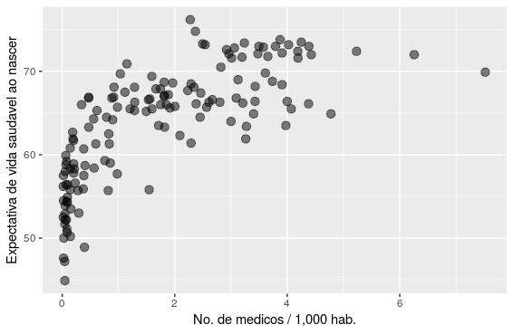

# Capítulo 2

## Sobre a natureza das relações 

## Prelúdio: Quem precisa do valor p?

O racional apresentado no capítulo anterior é diretamente relacionado ao método hipotético-dedutivo e seus princípios filosóficos.  
Apesar dos inúmeros avanços citados, a interpretação do valor p não é muito intuitiva.  
Envolve mensurar quão improváveis são as observações em um cenário hipotético na vigência da hipótese nula.  
Sua tradução (errada) mais popular é de que representa *"a chance de o resultado deste estudo estar errado".*  

O arcabouço descrito no capítulo anterior é suficiente para produzir um trabalho científico críptico para leigos.   

Ao seguir receitas pré-definidas (formulação de $H_{0}$ e $H_{1}$, cálculo de estatísticas e valores p), um texto parece estar em conformação com os padrões acadêmicos, mesmo que a hipótese elementar em torno do objeto de pesquisa seja simplória. Assim, inadvertidamente, priorizamos a forma e relegamos a segundo plano o miolo de propostas científicas.  

Trabalhos de pouca originalidade recebem grande atenção pelo rigor por atributos quantitativos (e.g. tamanho amostral grande, valor p baixo), enquanto criativos e revolucionários experimentos menores levam anos ou décadas até atingirem a comunidade.  
Outro efeito colateral é a busca por valores p que rejeitem $H_{0}$, desprezando precedentes teóricos e premissas probabilísticas (múltiplos testes).  

A difícil interpretabilidade do valor p e as armadilhas frequentes envolvidas no processo de inferência levaram a comunidade científica a questionar a hegemonia desse parâmetro. Há uma presente tendência a abandonar o valor p e o limite $p<0.05$ como critérios canônicos.  

No próximo capítulo, vamos conhecer argumentos contundentes ao método hipotético dedutivo.  
Por enquanto, basta sabermos que é sempre vantajoso obter outras informações, complementares ou alternativas.     

Neste capítulos, vamos aprender a estimar (1) a magnitude da diferença entre duas amostras e (2) quão relacionados são valores pareados (e.g. peso e altura).

## Tamanho de efeito

O tamanho de efeito nos ajuda a expressar magnitudes.  
Retomando o exemplo anterior, de que adianta uma diferença significativa entre o tamanho dos bicos dos pássaros, se ela for de 0.00001 mm?  

Ainda, existem casos em que estudos pequenos sugerem efeitos importantes, porém o tamanho amostral não fornece poder estatístico suficiente para rejeição da hipótese nula.  


Além de saber quão improvável é a diferença observada, é natural imaginarmos o quão grande ela é.  

Uma medida bastante popular é o *D de Cohen (Cohen's D)*.  

É um parâmetro que expressa a magnitude da diferença sem usar unidades de medida.  
Uma torcedora de futebol conta (feliz) a um amigo que seu time favorito venceu com placar de 4 *x* 1 (gols). Porém, esse amigo acompanha basquetebol e está acostumado a placares como 102 *x* 93 (cestas).  
Como é possível comparar gols com cestas? Qual vitória representa pontuações mais discrepantes: 4 *x* 1 ou 102 *x* 93?  

O problema aqui é que as pontuações se comportam de maneiras diferentes entre os esportes. O D de Cohen consiste em expressar essa diferença em desvios-padrão. Bastante simples:  
$$D_{cohen} = \frac{mu_{1}-mu_{2}}{\sigma_{pooled}}$$  

Usando a biblioteca *effects*, podemos calcular diretamente:   

```r
    library(effects)
    # O dataset galapagos_birds foi criado no capitulo 1
    >cohen.d(galapagos_birds$X1,galapagos_birds$X2)

    Cohen's d    

    d estimate: -5.460017 (large)
    95 percent confidence interval:
        lower     upper 1
    -5.954047 -4.965987 
```

Cohen propôs algumas faixas para classificar a magnitude desses efeitos:  

|         |  Pequeno  |  Médio  |  Grande  |	
|---------|-----------|---------|----------|
|Cohen's D|  0-0.2    | 0.2-0.5 | 0.5 - 0.8|

Assim, podemos atualizar nossos resultados anteriores, reportando também o tamanho de efeito da diferença e seu intervalo de confiança.  

## Correlações

Na empreitada científica, não nos atemos apenas a comparações. Um objetivo mais nobre é descrever exatamente como se dá a relação entre entidades estudadas.  

Como sabemos, existem muitas classes de funções para expressar relações entre variáveis/conjuntos. Nos capítulos anteriores, usamos algumas funções, como $y=\sqrt{x}$ e $y = e^{x}$.  

Diversas leis naturais tornaram-se particularmente conhecidas, como a relação entre força, massa e aceleração, elucidada por Newton:  
$$F=ma$$  
E a relação entre massa e energia para um objeto em repouso, descoberta por Einstein:  
$$E=mc^{2}; c^{2} \sim 8.988*10^{16} \frac{m^{2}}{s^2}$$  

As equações acima descreve uma relação linear entre grandezas.  

### Relações lineares

Uma relação linear entre duas variáveis indica que elas estão correlacionadas em uma proporção constante para qualquer intervalo.

Isto é, valores maiores de massa correspondem a um aumento proporcional em energia. O valor de $c^{2}$ expressa essa proporção constante.  

**Exemplo:** uma molécula de água pesa aproximadamente $m_{H_{2}O} =2.992×10^{-23} g$. Portanto, a energia associada é $E_{H_{2}O} = 2.992×10^{-23}*8.988*10^{16} \sim 2.689^{-6}J$. Se triplicarmos o número de moléculas de água, o mesmo acontecerá com a energia associada: $E_{3H_{2}O} = 3*E_{H_{2}O}$.  
 
Se a correlação é positiva, incrementos em $x$ serão proporcionais a incrementos em $y$. Se a correlação é negativa, incrementos em $x$ serão proporcionais a decréscimos em $y$.  

Num cenário perfeito, se sabemos que há uma relação linear entre variáveis,  precisamos de apenas duas observações para descobrir proporção entre elas. Esse problema é idêntico ao de encontrar a inclinaçaõ da reta que passa por dois pontos. É de fácil resolução usando técnicas elementares.  

```r
    library(ggplot2)
    ggplot()+
    geom_point(mapping=aes(x=1,y=2))+
    geom_point(mapping=aes(x=2,y=4))+
    xlim(0,3)+ylim(0,5)
```


$y=\beta*x$  
$a=(1,2); b=(2,4) \rightarrow \beta = 2$  

```r
    ggplot()+
    geom_point(mapping=aes(x=1,y=2))+
    geom_point(mapping=aes(x=2,y=4))+
    xlim(0,3)+ylim(0,5)+
        geom_abline(slope = 2)
```


### Erros e aleatoriedade

Controlando fatores experimentais, as relações descritas são bastante precisas. Em um cenário sem atrito com superfícies e com o ar, os erros de medida obtidos com $F=ma$ são muito baixos.  
Entretanto, nem sempre isso é verdadeiro.  
Primeiro, podemos sofrer interferência de variáveis desconhecidas.

Imaginemos um conjunto de medidas antropométricas, com altura e peso e indivíduos.  
É esperado que a altura de um ser humano esteja relacionada com seu peso. Entretanto, outras características não medidas, como percentual de gordura total, podem interferir nos valores finais. Normalmente, tratamos essas flutuações como erros aleatórios[^10].

Podemos simular este cenário partindo de variáveis idênticas e adicionando ruído aleatório.
```r
    set.seed(2600)
    a <- seq(1:100)+rnorm(n=100,sd=3)
    b <- seq(1:100)+rnorm(n=100,sd=3)

    cor_data <- data.frame(a,b)
    
    ggplot(cor_data,aes(x=a,y=b))+
    geom_point()
```
  

O resultado sugere que há uma forte relação linear entre $x$ e $y$. Por outro lado, notamos que é impossível para uma reta cruzar todos os pontos. A seguir, vamos investigar como quantificar a correlação linear, assim como encontrar a reta que minimiza a distancia para todas as observações.  

Com essas ferramentas, podemos estender nossas inferências. Além de comparações, teremos noções sobre a magnitude de uma relação, assim como poderemos prever o valor esperado para novas observações.   

[^10]:A natureza da aleatoriedade é uma questão filosófica. Em última instância, podemos imaginar que seria possível explicar flutuações randômicas através de variáveis desconhecidas (*hidden variables*). Isso é verdade para a maioria dos fenômenos naturais. Entretanto, descobertas experimentais recentes em física quântica (*Bell's inequality experiment*) sugerem que variáveis ocultas não podem explicar a natureza probabilística das observações.  

### O coeficiente de correlação produto-momento de Pearson, ou, simplesmente, $\rho$ de Pearson.

O coeficiente de correlação $(\rho)$ de Pearson é um número real garantidamente[^11] entre -1 e 1. Expressa a magnitude e o sentido de uma relação linear, sendo -1 uma relação inversa perfeita e 1 uma relação direta perfeita.  

Para os dados que geramos, a correlação é quase perfeita: $\rho = 0.989$.  
O coeficiente possui *produto-momento* em seu nome, pois usa uma abstração originalmente empregada na física: o momento.  

[^11]: Inequalidade de Cauchy–Schwarz

\pagebreak


### Um breve mergulho na física: Momentos
[^12]

Para adquirir uma intuição sobre o coeficiente, é interessante resgatar o conceito físico, originalmente descoberto por Arquimedes. Embora não tenha inventado a alavanca, ele descreveu os princípios matemáticos por trás dela. 

Em *Sobre o equilíbrio dos planos*, Arquimedes declara que *Magnitudes ficam em equilíbrio quando em distância reciprocamente proporcional aos seus pesos.* 


Essa é a conhecida Lei da alavanca. Dado um ponto de apoio e um plano sobre ele, aplicamos uma força em qualquer local do plano. O momento (torque) resultante é o resultado da multiplicação da grandeza física $(F)$ pela distância até o ponto fixo $(d)$.  
$M = F*d$  

Supondo uma força constante, quanto mais nos afastamos do ponto fixo, maior o momento resultante. Posteriormente, os físicos  estenderam o conceito para outros domínios. Por exemplo, um objeto com cargas opostas $-q$ e $+q$ separados por uma distância $d$ possui momento (momento dipolar elétrico) análogo:
$M = q*d$  
De uma maneira geral, falamos em momento ao multiplicarmos uma grandeza física por uma distância. 

#### Momento resultante 


No caso da alavanca, vimos que cada força aplicada sobre o objeto está associada a um momento(torque). Sabemos que a gravidade atua sobre cada pedaço com massa compondo o todo. Podemos então calcular o momento resultante somando os momentos de todos os $N$ pontos. Seja $F_{i}$ a função descrevendo a força em cada i-ésimo:
$$M = \sum_{i=1}^{N} F_{i}d_{i}$$  

Um sistema, como o pássaro apoiado sobre o dedo, está em equilíbrio quando a soma dos momentos em relação ao ponto fixo é zero. Para cargas elétricas, o sistema é apolar quando o momento é zero. Na figura abaixo, vemos como a molécula de $CO_{2}$ é apolar, enquanto a molécula de água é polar:  


Os momentos descritos acima são expressões do *primeiro momento*, uma vez que a grandeza é multiplicada pela distância com expoente 1: $d = d^{1}$. 

Podemos calcular outros momentos, exponenciando o componente espacial (distância). Vamos estudar agora momentos de massa de um objeto unidimensional:  
O **momento zero** de massa para um objeto é $M_{0} = \sum_{i=1}^{N} m_{i}d_{i}^{0}$. Como $d^{0}=1$, temos $M_{0} = \sum_{i=1}^{N} m_{i}$, que é simplesmente a soma das massas de todos os pontos. O momento zero é a massa total.  
O **primeiro momento** de massa para um objeto é $M_{1} = \sum_{i=1}^{N} m_{i}d_{i}^{1}$ e determina o centro de massa em relação à dimensão $d$.  
O **segundo momento** de massa é $M_{2} = \sum_{i=1}^{N} m_{i}d_{i}^{2}$ e é o momento de inércia. Corresponde à resistência do sistema a rotações[^13].
O n-ésimo momento $M_{n} = \sum_{i=1}^{N} m_{i}d_{i}^{2}$

[^12]:Pappus de Alexandria, Synagoge, Livro VIII
[^13]: Perceba que os termos $d_{i}^{2}$ estariam presentes nas área de um círculo com centro idêntico ao do objeto e raio igual à distância entre o centro: $\pi d^{2}$. https://physics.stackexchange.com/a/371165/218274

### Generalizando momentos 

Podemos generalizar ainda mais a abstração e calcular momentos de entidades abstratas, como variáveis aleatórias. **Melhor: já fizemos isso anteriormente!**  

Seja $f(x)$ a função que descreve uma distribuição de probabilidades para a variável,  
Assim como o **momento zero** representa a massa total, aqui ele representa a probabilidade total (1).  
O **primeiro momento**, correspondente ao centro de massa, é a **média**.  
O **segundo momento**, correspondente ao momento inercial, é a **variância**.  
Os momentos **terceiro** e **quarto** normalizados informam sobre assimetrias *(skewness)* e peso de valores extremos *(kurtosis)*.  

Formalmente, seja $d(x,x_{0})$ o valor da distância ao centro $x_{0}$ de referência $(x-x_{0})$, o n-ésimo momento $\mu_{n}$ é definido por:  

$$\mu_{n}= \int_{-\infty}^{\infty} d(x,x_{0})^{n}f(x)dx$$  

A integral acima corresponde à versão contínua da soma de partes discretas apresentadas antes para uma grandeza física, como a massa: $M_{n} = (\sum_{i=1}^{N}d_{i}^{n}m_{i})$  

**Momento zero**: $$\mu_{0}= \int_{-\infty}^{\infty} d(x,x_{0})^{0}f(x)dx = \int_{-\infty}^{\infty} f(x)dx = 1$$.   
**Primeiro momento**: $$\mu_{1}= \int_{-\infty}^{\infty} d(x,x_{0})f(x)dx$$ , supondo centro em 0 $(x_{0}=0)$, temos a média, $$ \mu_{1} = \int_{-\infty}^{\infty} xf(x)dx$$, também chamado valor esperado $E[X]$.  
**Segundo momento**: $$\mu_{2}= \int_{-\infty}^{\infty} d(x,x_{0})^{2}f(x)dx$$. Como vimos anteriormente, a soma dos quadrados dos desvios, nossa variância, $\sigma^{2} = E[(x-\mu)^{2}]$.  

Com os conceitos adquiridos em mãos, é fácil entender o $\rho$ de Pearson.  

### Calculando correlações lineares

A noção de **distância** ou **desvio** se repetiu muitas vezes.  
De fato, o coeficiente de correlação linear nasceu quando Francis Galton (1888) estudava numericamente dois problemas aparentemente distintos em antropometria [^14]:

1.  **Antropologia:** Se recuperássemos de um túmulo antigo apenas um osso da coxa (fêmur) de um indivíduo, o que podereríamos dizer sobre sua altura?
2.  **Ciência forense:** Com o intuito de identificar criminosos, o que pode ser dito sobre medidas diferentes de uma mesma pessoa?

Galton percebeu que, na verdade, estava lidando com o mesmo problema. Dadas medidas pareadas, $(x_{i},x_{i}')$, o que o desvio de $x_{i}$ informa sobre o desvio de $x_{i}'$?

O fêmur recuperado do esqueleto de um faraó é 5 cm maior que a média. Quão distante da média esperamos que seja sua altura? Ingenuamente, podemos pensar que se uma das medidas é 5% maior que a média, a outra também será 5% maior. Galton percebeu que havia um armadilha nesse pensamento.  
Apesar de haver uma relação entre as medidas, há também flutuações aleatórias: parte do desvio é resultante disso. Precisamos entender o grau de correlação pra fazer um bom palpite.  

Então, propôs um coeficiente mensurando a relação entre desvios de variáveis. Se tamanho do fêmur e altura estão muito relacionadas, um fêmur grande sugere indivíduo igualmente alto. Caso contrário (baixa correlação), um fêmur grande (desvio alto) não implica desvio grande estatura.  

Para quantificar a relação, multiplicamos os desvios de cada par de medidas:  
$$\sum_{i=1}^{N}(x_{i}-\mu_{x_{i}})(x_{i}'-\mu_{x_{i}'})$$
A expressão acima expressa a **covariância** entre $X$ e $X'$ e será útil em outros contextos. A expressão lembra o cálculo do primeiro momento, porém cada desvio é multiplicado pelo desvio correspondente da medida pareada. Daí o nome coeficiente de correlação *produto-momento*.  

O coeficiente de correlação de Pearson é a razão entre covariância e o produto dos desvios-padrão:
$$\rho_{XX'}= \frac{cov(X,X')}{\sigma_{X}\sigma_{X'}}$$
De forma extensa:  
$$\rho_{XX'}= \frac{\sum_{i=1}^{N}(x_{i}-\mu_{x_{i}})(x_{i}'-\mu_{x_{i}'})}{\sqrt{\sum_{i}^{N}(x_{i}-\mu_{x})^{2}}\sqrt{\sum_{i}^{N}(x_{i}'-\mu_{x'})^{2}}}$$
Uma boa notícia: $\rho$ segue uma distribuição conhecida, a distribuição t, com n-2 graus de liberdade. Podemos usar as ferramentas anteriores para testar hipóteses. 

[^14]: Francis Galton's account of the invention of correlation. Stephen M. Stigler. Statistical Science. 1989, Vol. 4, No. 2, 73-86.

### Exemplo prático

O exemplo a seguir foi um feliz achado. À época, o governo brasileiro discutia a necessidade da formação de médicos para melhorar a assistência à saúde. Por curiosidade, acessei os dados da WHO (World Health Organization) e do banco mundial (World Bank) sobre quantidade de médicos por país e indicadores de saúde. Minha expectativa era encontrar pelo menos uma tímida relação entre indicadores. Fui surpreendido por uma forte correlação, que exploraremos a seguir.  

Adotamos países como unidade observacional para $x$, o número de médicos 1,000 habitantes, e $y$, a expectativa de vida saudável ao nascer.  
Usando dados obtidos dos portais da WHO e do World Bank, plotamos os pontos no plano cartesiano.  

```r
    # http://apps.who.int/gho/data/view.main.HALEXv
    # https://data.worldbank.org/indicator/SH.MED.PHYS.ZS
    library(magrittr)
    library(ggplot2)
    library(dplyr)    

    worldbank_df <- read.csv("data/API_SH.MED.PHYS.ZS_DS2_en_csv_v2_10227587.csv",
                         	header = T,skip = 3)
    colnames(worldbank_df)[1] <- "Country"    

    worldbank_df$n_docs <- sapply(split(worldbank_df[,53:62], #lists of values
                                    	seq(nrow(worldbank_df))),
       	function(x) tail(x[!is.na(x)],1)) %>% #last non missing value
      as.numeric    

    who_df <- read.csv("data/who_lifeexpect.csv",skip=2)
    who_df$hale <- who_df$X2016
    uni_df <- left_join(worldbank_df[,c("Country","n_docs")],
                    	who_df[,c("Country","hale")],by="Country")    

    ggplot(uni_df,aes(x=n_docs,y=hale))+
      geom_point(alpha=0.5,size=3) +
      xlab("No. de medicos / 1,000 hab.")+
      ylab("Expectativa de vida saudavel ao nascer")
```


É evidente que o padrão não é aleatório. Visualmente, notamos que o valor da expectativa de vida aumenta com maior Nº de médicos. 
Ainda, notamos um aumento inicialmente rápido, com um platô em seguida. O padrão é semelhante ao de uma curva logarítmica.  

$y = log(x)$ ou $HALE = log(N_{médicos})$

Se isso for verdade, transformar o número de médicos usando função logaritmica tornará a relação linear. Se $y = log (x)$, fazemos a transformação $x’ = log(x)$ para obtermos $y = x'$.

Então y (expectativa de vida) se torna linearmente porcional a nossa variável transformada (logaritmo do número de médicos).
```r
    >uni_df$log_docs <- log(uni_df$n_docs)
    >ggplot(uni_df,aes(x=log_docs,y=hale))+
      geom_point(alpha=0.5,size=3) +
      xlab("ln de No. de medicos / 1,000 hab.")+
      ylab("Expectativa de vida saudavel ao nascer")
```


De fato, verificamos uma notável tendência linear para os pontos. 

Usando a implementação nativa em R para o coeficiente de Pearson:

```r
    > cor.test(uni_df$log_docs,uni_df$hale)
    Pearson's product-moment correlation
    data:  uni_df$log_docs and uni_df$hale
    t = 18.572, df = 143, p-value < 2.2e-16
    alternative hypothesis: true correlation is not equal to 0
    95 percent confidence interval: 0.7854248 0.8828027
    sample estimates:
      	cor
    0.8407869
```

A correlação linear obtida para nossa amostra de países é surpreendentemente grande, como sugeria a visualização $(\rho \sim 0.841)$.  

O valor p é baixo (p <0.001) considerando a hipótese nula $H_{0}$ de $\rho=0$. Concluímos então que há uma relação linear significativa de forte magnitude entre o logaritmo do número de médicos e a expectativa de vida dos países em nossa amostra.
