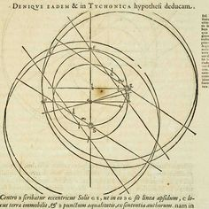
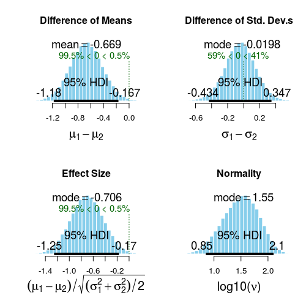
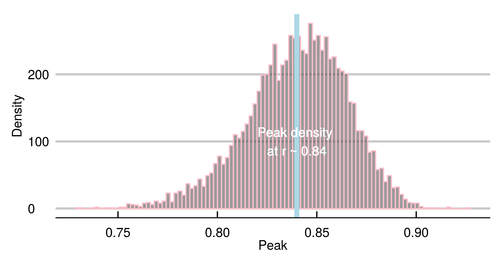

# Capítulo 3 : Contexto e Inferência Bayesiana (DRAFT)

@ Intuicao de cenários possíveis vs. Axiomatizacao de Kolmogorov  
@ AIC/BIC  

## Muitos métodos científicos: Feyerabend, Carnap e Quine

No primeiro capítulo, entramos em contato com o método hipotético-dedutivo e a falseabilidade como critério de demarcação científica. Apesar dominante, esse racional possui vulnerabilidades interessantes. Entenderemos melhor argumentos contrários e propostas alternativas através de três filósofos do século XX.  

**Feyerabend**  

Conhecido pela personalidade ímpar e por suas ideias radicais, Paul Feyerabend é notável por conceber o *anarquismo epistêmico*. Em sua obra mais proeminente, *Contra o Método*(1975), argumenta que boa parte dos avanços científicos significativos aconteceram fora do método.  

O autor destaca o fato de que as previsões do modelo heliocêntrico proposto por Galileo tinha previsões verificáveis piores que os antecessores. Além disso, fazia uso de abstrações mais complexas. Ainda assim, verificamos posteriormente que o Sol é o objeto mais massivo do sistema solar, ocupando um dos epicentros[^19].  

Sendo assim, os astrônomos contratados pela igreja à época estavam certos em dizer que o trabalho de Galileo era falso. Ratzinger deveria julgar se a Igreja se retratar quanto ao caso de Galileo (e se comprometer com a verdade) ou manter a postura (e assumir que o melhor que podemos fazer depende dos conhecimentos disponíveis.  



Feyerabend argumenta que outros fatores, especialmente idiossincrasias, detalhes biográficos, são responsáveis por mudanças significativas em nosso conhecimento.  

É tentador pensar que, dada a profundidade do trabalho, a defesa de uma postura tão contundente é obviamente uma aplicação dos preceitos defendidos no livro como necessários para disseminar uma ideia.  

[^19]: Hoje, sabemos que há uma interação de muitos corpos celestes. As órbitas são mais complexas, porém o sol continua sendo o atrator mais forte.  

\pagebreak

Mais que isso, que usar falsificabilidade e o método hipotético-dedutivo teriam nos feito rejeitar o heliocentrismo e outras ideias chave.  
De fato, Popper debateu por muito tempo sobre o status científico da teoria da evolução.  

**Carnap**  

Outro filósofo que contrapôs Popper de maneira brilhante e pouco conhecida foi Rudolf Carnap, do Círculo de Viena. Em  “Testability and Meaning” (1936-7), Carnap argumenta que falsificabilidade não difere verificacionismo. Envolve a testagem das sentenças em si, um problema que outros (https://en.wikipedia.org/wiki/Ludwig_Wittgenstein) também endereçaram.  

Diante de resultados inesperados em um experimento, o procedimento padrão do cientista envolve checar a integridade das condições desenhadas. Verificar a composição da amostra, os métodos de coleta, mecanismos de perda, critérios de exclusão e inclusão, premissas da análise.  

O cuidado com esses pontos é desejável e desnuda o inevitável calcanhar de Aquiles da falsificabilidade. É impossível obedecer às premissas necessárias para que todo o experimento produza o significado clamado por seus resultados. 

**Quine**  

Uma escola filosófica parte do problema acima. A tese de Duhem-Quine postula que é impossível testar qualquer hipótese científica, uma vez que sempre há premissas aceitas como verdade.

Em ‘Os dois dogmas do empiricismo’, Quine considera as proposições e as relações lógicas entre elas apenas um sistema, que só pode ser estudado em conjunto.
Os exercícios ilustrados no volume anterior testa a adequação dos dados à família de distribuições t. Também assume que níveis de glicemia são mensuráveis usando números e que estes podem ser comparados com valores em outras amostras.

A princípio, essas declarações parecem triviais. Entretanto, considerando os fatores humanos da ciência, a mudança de lentes é significativa. Abandonando o esquema de testagem de hipóteses como eixo, o valor p deixa de ter papel central na narrativa. Integra um conjunto de informações maior sobre os parâmetros examinados.

Discutivelmente, abordar um problema dessa maneira é historicamente mais frutífero. As contribuições mais contundentes são advindas de cientistas dedicados a estudar um contexto ou problema como um todo. É raro, talvez inédito, que um grupo operando de forma sistemática com o método hipotético-dedutivo tenha obtido avanços consistentes.

Por fim, estimar livremente os parâmetros de que falamos é muito mais intuitivo que adequar uma ideia ao racional procedural de testagem de hipóteses.
Teste de hipóteses: “Quero comparar A e B. As probabilidades de obter minhas observações supondo igualdade entre A e B são baixas o suficiente supor que A e B são, na verdade, diferentes?”

Inferência Bayesiana: “Quero comparar A e B. Como é a distribuição da diferença entre A e B considerando os dados e minhas ideias prévias sobre ela?”

## Bayes

Uma abordagem da matemática aplicada que tem se popularizado é o de inferência Bayesiana. Por princípio, partimos de um ponto diferente: não queremos testar hipóteses (ainda). Temos um modelo modelo teórico e incerteza sobre um parâmetro.  
Um parâmetro é um símbolo, uma aproximação (para,"resembling", meter,"measure") para uma ideia. Em geral, usamos parâmetros para representar algo que intuitivamente se comporta como número(e.g: existem elementos que podem ser ordenados por tamanho).  
Em uma prova de QI, a idade do indivíduo é uma medida. O tempo total de prova é uma medida, assim como a quantidade de questões acertadas. O valor de QI é uma parâmetro, um número real estimado a partir das medidas citadas.  
Inferência Bayesiana nos ajuda a estimar parâmetros. Ela usa a linguagem das probabilidades. Costumamos tratar parâmetros como distribuições. Isso é intuitivo para qualquer pessoa.
Alguém pergunta "que horas você chega no jantar?".  
A resposta "20:00" na verdade é uma estimativa pontual, porém sabemos que existe a chance de chegarmos 19:55 ou 20:05. Também sabemos que chegar 19:30 é improvável, o que também vale para 20:30.  
Trabalhamos com incertezas o tempo inteiro.  

### Bayesian estimation

Para a abordagem anterior, ao fazer um test t, calculamos a estatística t correspondente às diferenças encontradas e então a probabilidade de obter valores iguais ou mais extremos.  
Agora, faremos algo mais simples e intuitivo. Vamos estimar um parâmetro: a diferença entre os grupos. Na verdade, valores prováveis dela. Todas as inferências subsequentes serão derivadas da distribuição produzida por nosso procedimento.  
Novamente, usaremos 30 observações retiradas de amostras de distribuição normal $(\mu_{a}=0; \mu_{b}=0.6; \sigma_{a} = \sigma_{b} = 1)$ normais. Usando a library BEST, é possível usar inferência bayesiana para responder nossa pergunta (“Como é a distribuição da diferença entre A e B (…)?”). Aplicamos o estimado sobre as amostras A e B e, em seguida, plotamos as distribuições.  

```r
    >library(ggthemes)
    >library(rstan)
    >library(reshape2)
    >library(BEST)
    >library(ggplot2)
    >options(mc.cores = parallel::detectCores() - 1)
    >a <- rnorm(n = 30, sd = 1, mean = 0)
    >b <- rnorm(n = 30, sd = 1, mean = 0.6)

    # BEST
    >BESTout <- BESTmcmc(a, b)    

    ### BEST plots
    >par(mfrow=c(2,2))
    >sapply(c("mean", "sd", "effect", "nu"), function(p) plot(BESTout, which=p))
    >layout(1)
```


A distribuição no canto superior esquerdo corresponde à nossa estimativa da diferença entre A e B. Com ela, podemos fazer estimativas pontuais $(diff_{\mu_{a}\mu_{b}}=-0.669)$. O intervalo apontado como 95% HDI (High density interval) contém 95% da distribuição.  

### Por trás das cortinas

Obviamente, vamos entender como é possível estimar essas distribuições. A flexibilidade e o poder dos modelos bayesianos permite lidar com uma série de problemas dificilmente tratáveis sob outra perspectiva. Entretanto, é fácil cair em armadilhas ou esbarrar em dificuldades durante o processo.  

Nesse framework, lidamos com distribuições. É extremamente importante entender os componentes envolvidos para não cometer erros importantes.  


Então, seguindo o exercício anterior, precisamos especificar que consideramos as duas amostras vindo de distribuições t com médias $\mu_{1} e \mu_{2}$ e desvios-padrão idênticos, $\sigma_{a}= \sigma_{b}$.  
@ Teorema de Bayes:  posterior = Likelihood function x prior / evidence
@ Posterior para correlação
@ Posterior para diferença entre médias
@ Posterior para correlação

```r
    >sample_data <- list(y_1=a,y_2=b,N=length(a))
    >fit <- rstan::stan(file="aux/best.stan",
           	data=sample_data,
           	iter=3000, warmup=100, chains = 6)
```

```r
    >muDiff <- extract(fit, par='mudiff')$mudiff
    >means <- lapply(list(a,b), mean)
    >sample_diff <- diff(as.numeric(means))  # observed in data
    >ggplot(as.data.frame(muDiff),aes(x=muDiff))+
      geom_histogram(alpha=0.6,color="pink")+
      geom_vline(xintercept=-sample_diff,
             	color="light blue",size=2)+ # line for observed difference
      xlab("Difference of Means")+ylab("Frequency")+
      geom_text(label="Sample difference",
            	color="white",x=mean(muDiff),y=500)+
      theme_economist_white(gray_bg = F)
```


@Correlacao  

```r
    >fit <- rstan::stan(file="aux/corr-docs.stan",
           	data=uni_df,
           	iter=3000, warmup=100, chains = 6)
```
Ellipse:

```r
    >x.rand = extract(fit, c("x_rand"))[[1]]
    >plot(uni_df[,c("log_docs","hale")],
     	xlim=c(-5,5), ylim=c(20, 100), pch=16)
    >dataEllipse(x.rand, levels = c(0.75,0.95,0.99),
            	fill=T, plot.points = FALSE)
```


* Classificação
  * Regressão logística @ Numero de euler
  * Modelos hierárquicos
* Flexibilidade Bayesiana
  * Usando priors
  * O estimador Markov Chain Monte Carlo
  
\pagebreak