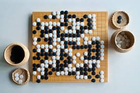
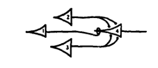
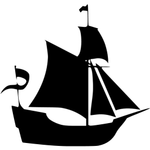
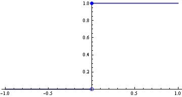
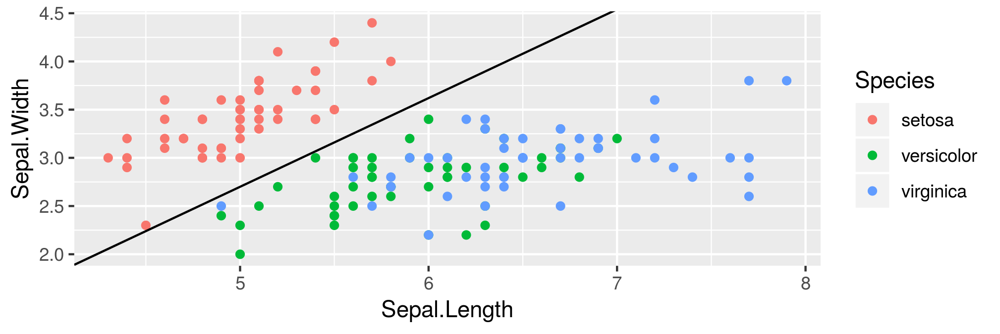
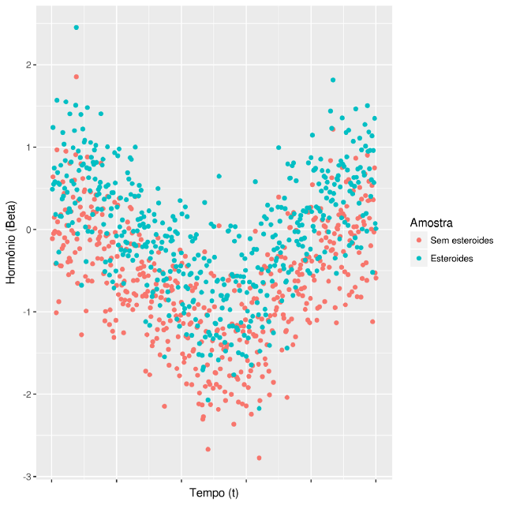
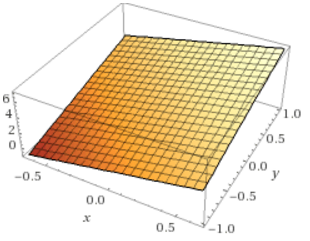
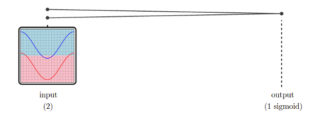
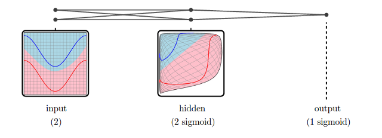
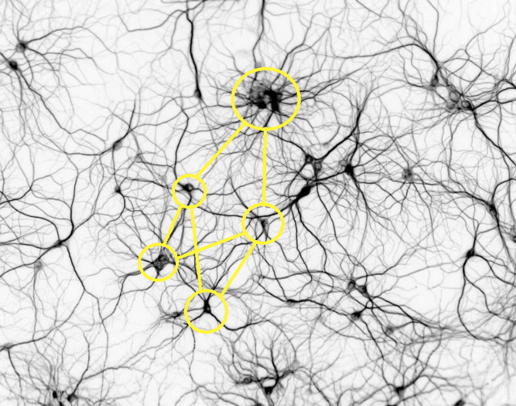

# Capítulo 3 : Neurônios

Em março de 2016, o software AlphaGo tornou-se o primeiro programa de computador a vencer um mestre de Go. O feito é difícil por se tratar de um jogo quase impossível de ser totalmente computado.  
Inventado há mais de 2,500 anos, motivou bastante em pesquisa em matemática. Existem $2,08*10^{170}$ maneiras válidas de dispor as peças no tabuleiro. O chinês polímata chinês Shen Kuo (1031–1095) chegou a um resultado próximo $10^{172}$ séculos atrás. Vale lembrar que o número de átomos no universo observável é de módicos $10^{80}$.  

No capítulo anterior, aprendemos uma formulação básica de modelo preditivo, a regressão linear simples. A seguir, estenderemos nosso leque de ferramentas para novas classes de relações, também incluindo mais informações na entrada de nossos modelos.   

Mais do que isso, conheceremos a primeira máquina inteligente da história.  



## O perceptron de Rosenblatt 

Frank Rosenblatt (1928 - 1971) nasceu e morreu em 11 de julho, mas esse não é o fato mais curioso da biografia deste psicólogo. Foi o responsável pelo desenvolvimento do primeiro neurônio artificial. Em suas palavras, o primeiro objeto não biológico a recriar uma organização do ambiente externo com significado.

*It can tell the difference between a cat and a dog, although it wouldn't be able to tell whether the dog was to the left or right of the cat. Right now it is of no practical use, Dr. Rosenblatt conceded, but he said that one day it might be useful to send one into outer space to take in impressions for us. - New Yorker, December, 1958*[^19]  

O aparato reproduzia o entendimento da época sobre o funcionamento de um neurônio. O corpo recebe sinais de dendritos e, após processamentos ocultos, produz um output na forma de sinal elétrico pelo axônio. A primeira matematização viria do modelo de McCulloch & Pitts ("A Logical Calculus of the Ideas Immanent in Nervous Activity", 1943).



Em 1949, Donald Hebb descreveu em seu clássico *The Organization of Behavior* um mecanismo plausível para a aprendizagem. Comumente expressa na máxima "Cells that fire together wire together" (células que disparam juntas, conectam-se entre si).  

Com o objetivo de criar uma máquina que pudesse processar inputs diretamente do ambiente físco (e.g. luz e som), Rosenblatt concebeu extensão elegante do modelo em 1957 ("The Perceptron[*do latim, percipio, compreender“*]--a perceiving and recognizing automaton. Report 85-460-1, Cornell Aeronautical Laboratory"). Composto de três partes: o sistema S (sensório); o sistema A (associação) e o sistema R (resposta).  
O neurônio "lógico" cru de McChulloch & Pitts foi modificado de maneira a processar inputs através de pesos antes da saída. A aprendizagem se dá pela modificação desses pesos. 

  

Inicialmente, o perceptron foi simulado em um IBM 704 (também berço das linguagens FORTRAN e LISP). Em seguida, implementado como um dispositivo físico, batizado de Mark I Perceptron.[^20] Um estudo mais profundo foi publicado por ele em 1962 (Principles of neurodynamics)

[^19]: Ele consegue diferenciar um gato de um cachorro, ainda que não seja capaz de dizer se o cachorro estava à esquerda ou à direita do gato. No momento, não tem uso prático, Dr. Rosenblatt admitiu, porém disse que um dia pode ser útil para enviar um [aparato] ao espaço para capturar impressões para nós.  
[^20]: Mark I é um título comumente utilizado para a primeira versão de uma máquina.

\pagebreak 

Rosenblatt protagonizava calorosos debates sobre inteligência artificial na comunidade científica junto a Marvin Minsky, um amigo da adolescência. Em 1969, Minsky e um matemático (Seymour Papert) publicaram um livro centrado no Perceptron.
(Perceptrons: An Introduction to Computational Geometry). Nele, provaram que o neurônio artificial era incapaz de resolver problemas não-lineares do tipo XOR. Para um problema eXclusive OR (OU eXclusivo) o neurônio deve disparar diante do estímulo A ou do estímulo B, porém não diante de ambos.  

O impacto foi devastador sobre o otimismo vigente e se passou um período de 10 anos de baixíssima produção, conhecido como idade das trevas do conexionismo. A retomada dos neurônios artificiais aconteceu somente na década de 80. Infelizmente, Rosenblatt morreu prematuramente em 1972 num acidente de barco, não presenciando o renascimento dos perceptrons.  

Sabendo das origens do modelo, é curioso que a maioria dos cursos introduzam perceptrons do ponto de vista puramente matemático, apontando a semelhança com neurônios como mera curiosidade. Pelo contrário, a inspiração em neurônios biológicos e posterior sucesso nas tarefas designadas fala em favor de um fantástico caso de sucesso para engenharia reversa.  
A Natureza, através de evolução por seleção natural, é a verdadeira mãe desse algoritmo.  

  

\pagebreak
 
## Criando neurônios

Mark I foi criado para reconhecimento visual, podendo ser considerado avô da visão computacional.  
Possuía um campo de entrada fotossensível de 20x20 (400) células de Sulfeto de Cádmio, as unidades S. Ao reagir com a luz, CdS emite um elétron:
$$CdS + \gamma \rightarrow e^{-} + CdS^{+}$$

Caso a célula seja ativada, envia o sinal eletrônico a uma unidade intermediária A. A unidade intermediária, por sua vez, transmite um sinal eletrônico à saída. A intensidade do sinal é regulada por sucessos prévios. Esse processo ficará mais claro com a implementação a seguir.

  

Imaginemos que a imagem acima tenha 10 pixels de altura e 10 de largura.  
Para simplificação, 10 x 10 pixels em preto e branco (100 pixels com valores entre 0,preto, e 255, branco). Esses pixels podem ser esticados e vistos como uma matriz x de dimensão $[100 x 1]$ com valores entre 0 e 255 em cada elemento.  
Vamos simular uma imagem deste tamanho gerando uma matriz de dimensão 10x10 com 100 valores naturais aleatórios (entre 0 e 255) no R:  

```r
    >set.seed(2600)
    >my.image.data <- sample(0:255,100,replace=T)
    >x <- matrix(my.image.data,10,10)
```


Eis a nossa imagem [10x10]. O computador lê os valores entre 0 (preto) e 255 (branco), dispondo para nós o sinal visual correspondente.  

Em nosso exemplo hipotético, o classificador precisa saber se uma imagem apresentada corresponde à de um navio ou não.  

Em regressão linear múltipla, calculamos um peso $\beta$ para cada variável. O racional aqui é parecido: ponderamos cada pixel por seus respectivos pesos. Em analogia, cada imagem é uma observação de 100 variáveis.  

O neurônio deve disparar (output $y=1$) caso seja um navio ou permanecer em repouso caso não seja ($y=-1$).  

Matematicamente, é uma multiplicação da matriz de valores da imagem $x_{i}$, de dimensão $[100 x 1]$ por uma matriz $W_{[100 X 1]}$ que traz pesos (weights) estimados para cada pixel para cada classe. Então, forçamos o resultado para +1 ou -1 com uma função de ativação $(\phi)$.  

$$y = \phi(W^{T}X)$$

Usaremos a função *Heaviside step*:  
$$\phi(x)= \begin{cases}
  +1 \quad se \quad x \geq 0\\
  -1 \quad se \quad x < 0
  \end{cases}$$
  


Em R:  
```r
    >phi_heavi <- function(x){ifelse(x >=0,1,-1)}
    # Iniciando pesos com base em distribuição normal
    # Dividi os valores por 100 para reduzir a magnitude dos numeros
    >my_weights <- rnorm(100)/100
    # Le pesos como matriz [100x1]
    >w <- matrix(my_weights,100,1)
    # Multiplicacao usando o operador %*%
    >as.vector(x)%*%w
    # Score
              [,1]
    [1,] -2.941668
    # Funcao de ativacao
    >as.vector(x)%*%w %>% phi_heavi
         [,1]
    [1,]   -1
```


Inicialmente, estabelecemos pesos aleatórios a partir de uma distribuição normal.  
Então, o objetivo é observar as respostas corretas em várias imagens e alterar os valores de $W$ para que os scores maiores sejam os das classes corretas.  

O processo de treino é bastante simples:  

$$w_{i}' = w_{i} + \Delta w_{i}$$
$$\Delta w_{i} = \eta (resposta_{i} - output_{i}) x_{i}$$

Em que $x_{i}$ é o valor do i-ésimo pixel, $w_{i}$ é o i-ésimo peso e $\eta$ uma constante chamada *taxa de aprendizagem* (learning rate), que determina o tamanho dos incrementos feitos pelo algoritmo. 
Notem que se a resposta desejada é idêntica ao output, então o peso $w_{i}$ é mantido intacto.  

Se os dados são linearmente separáveis, o algoritmo converge com um número suficiente de exemplos.  

Assim, funciona para separar flores *setosa* de outra classe, mas não teriamos bons resultados separando virginica de versicolor.  

```r
    >ggplot(iris,aes(x=Sepal.Length,y=Sepal.Width,color=Species))+
    geom_point()+ geom_abline(slope = 0.92,intercept = -1.9)
```


Codificando nosso perceptron conforme as equações acima:  

```r
    library(magrittr)
    >mark_i <- function(x, y, eta) {
      # inicializa pesos randomicos de distribuicao normal
      w <- rnorm(dim(x)[2]) # numero de pesos = numero de colunas em x
      ypreds <- rep(0,dim(x)[1]) # inicializa predicoes em 0
        # Processa as observacoes em x de forma aleatoria
        for (i in sample(1:length(y),replace=F)) { 
          # predicao
          ypred <- sum(w * as.numeric(x[i, ])) %>% phi_heavi 
          # update em w
          delta_w <- eta * (y[i] - ypred) * as.numeric(x[i, ]) 
          w <- w + delta_w
          ypreds[i] <- ypred # salva predicao atual
        }
      print(w)
      return(ypreds)
    }
```

Vamos testá-lo para o problema proposto, separando flores *setosa* de *versicolor*. Preparação de dados:  

```r
    >train_df <- iris[1:100, c(1, 2, 5)]    
    >train_df[, 4] <- -1
    >train_df[train_df[, 3] == "setosa", 4] <- 1    
    >names(train_df) <- c("s.len", "s.wid", "species","target")
    >head(train_df)
          s.len s.wid species target
    1   5.1   3.5  setosa      1
    2   4.9   3.0  setosa      1
    3   4.7   3.2  setosa      1
    4   4.6   3.1  setosa      1
    5   5.0   3.6  setosa      1
    6   5.4   3.9  setosa      1
    >x_features <- train_df[, c(1, 2)]
    >y_target <- train_df[, 4]
```
E então, podemos avaliar a performance:  

```r
    >y_preds <- mark_i(x_features, y_target, 0.002)
    [1] -0.2376040  0.4316401
    > table(y_preds,train_df$target)
    y_preds -1  1
         -1 19  1
         1  31 49
    > y_preds
      [1]  1  1  1  1  1  1  1  1  1  1  1  1  1  1  1  1  1  1  1  1  1  1  1  1
     [25]  1  1  1  1  1  1  1  1  1  1  1  1  1  1  1  1  1 -1  1  1  1  1  1  1
     [49]  1  1 -1  1  1 -1  1 -1 -1  1  1  1 -1  1 -1  1  1  1  1  1  1  1 -1 -1
     [73]  1 -1 -1  1 -1 -1  1  1 -1  1 -1  1  1  1  1  1  1 -1  1  1 -1  1 -1  1
     [97] -1  1  1 -1
```
Usando $\eta = 0.002$, obtivemos 68% de acurácia classificações corretas. Podemos modificar a taxa de aprendizagem. Com $\eta = 0.05$, aumentamos para 71% $\eta = 1$:  

```r
    > y_preds <- mark_i(x_features, y_target, 0.05)
    [1] -0.5927852  1.6776363 # pesos finais
    > table(y_preds,train_df$target)
    y_preds -1  1
         -1 37 16
         1  13 34
```

Chamamos $\eta$ de hiperparâmetro. A escolha de valores para hiperparâmetros é um dos desafios em aprendizagem estatística. Uma maneira trivial é testar muitos valores possíveis e observar o desempenho, entretanto isso não exequível para grandes volumes de dados e/ou muitos parâmetros. Existem diversos processos heurísticos e algoritmos para encontrar valores ótimos.  

Uma forma popular para otimizar o treinamento é particionar o dataset em pedaços e apresentar os particionamentos (epochs) repetidas vezes ao classificador ou acumular os erros de epochs ao invés de exemplos individuais.

\pagebreak

# Início de textos em construção.

\pagebreak

### Gradient Descent

O processo de atualização de pesos descrito acima é ineficiente. Podemos minimizar os erros de maneira mais inteligente

\pagebreak

## Deep learning


Intuições

Com o aprendizado através de exemplos, otimizamos otimizamos nosso classificador (mudando pesos W) para minimizar a perda, erro, usando aproximações(e.g: Adagrad). A função de perda é menor quando temos pontuações (votos) maiores para as classes certas.
SVMs têm bom desempenho em diversas estruturas de dados, especialmente quando a arquitetura é otimizada por um usuário experiente. Onde entram as redes neurais?


### Going Deep

As versões reais da maioria dos conceitos criados por seres humanos não são idênticas umas às outras. Em outras palavras, não existe um conjunto rígido de regras para classificarmos a maior parte das entidades ao nosso redor.
Muitas entidades são diferentes, porém similares o suficiente para pertencer a uma mesma categoria.


Todos são naturalmente reconhecidos como felinos, mas apresentam variações de tamanho, cor e proporção em todo o corpo. 

Esse é um problema interessante e antigo. Alguns filósofos acreditam que abstrações humanas são instâncias de um conceito mais genérico: mapas biológicos contidos em redes neuronais (Paul Churchland, Plato’s Camera).  
Esses mapas estão associados de forma hierarquizada. Numerosos padrões em níveis inferiores e um número menor em camadas superiores.  
No caso da visão, neurônios superficiais captam pontos luminosos. O padrão de ativação sensorial enviado ao córtex visual primário é o primeiro mapa, que é torcido e filtrado caminho cima.  


Neurônios intermediários possuem configurações que identificam características simples: olhos e subcomponentes da face. Por fim, temos camadas mais profundas, ligadas a abstrações.


### Deduzindo superfícies

Um classificador deve capturar essa estrutura abstrata a partir de modelos matemáticos tratáveis. Para examinarmos esse aspecto, usemos um exemplo. O gráfico abaixo representa milhares de amostras com: (1) a curva diária natural de um hormônio (em vermelho) e a curva sob uso de esteroides anabolizantes (azul).



Como hipotéticos membros de uma comitê atlético, nosso objetivo aqui é, dada uma amostra, saber se o atleta está sob efeito de esteroides.
Quando experimentamos, normalmente haverá ruídos (erros) na medida e receberemos medições imprecisas da curva. Variações na dieta daquele dia, micções, sudorese, stress e outros fatores.

Usamos o tempo (t, eixo horizontal) e nível hormonal ($\beta$, eixo vertical). 

Numa regressão logística simples, fazemos essa classificação com base nas probabilidades de uma função sigmoide. Temos uma probabilidade (valor entre 0 e 1).
$P(h,\beta) = 1/(1+exp-(i+t*h+\beta*y+\epsilon)).$
$\epsilon$ representa o erro e i é uma constante. 

Em uma linha de R:

$$logist.fit <- glm(type_dic ~ beta + tempo, family=binomial,data=inv.ds)$$

A vantagem de usar essa modelagem é que temos uma relação direta entre o inverso dessa função (P^(-1), “logito”) e a combinação linear dos nossos parâmetros:
$logit (P(x))=i+t*x+\beta*y+\epsilon$
Em outras palavras, o processo de estimação é parecido com o da regressão linear, que é facilmente tratável. Outra consequência é que assumimos que a distinção entre classes (com base no logito, log odds) pode ser dada por um limite. Este tem uma relação linear com nossas variáveis. Estimamos a magnitude e o sentido dessas relações pelos parâmetros da regressão.



Podemos imaginar que o log odds (z, eixo vertical) cresce linearmente com uma combinação de duas variaveis (x e y). Notem que a superfície definida pelo nossa equação/modelo é um plano. z = 3 + 3x + 2y. Plotado no Wolfram Alpha
Estimamos qual seria a posição na reta dada por aquela medida e usamos um limite de decisão (decision boundary) linear. Voltando ao nosso exemplo, seria difícil capturar as diferenças usando apenas esta estratégia.



Acima, um neurônio sigmoide, que equivale à regressão logística. É como o plano anterior, mas visto de cima, dividimos ele em duas regiões para classficação. http://colah.github.io/posts/2015-01-Visualizing-Representations/
Por que? O classificador linear otimiza suas respostas levando em conta apenas o valor absoluto da medida hormonal. Isto é, valores acima de um limite serão considerados dopping, não considerando horário. Matematicamente, o coeficiente para o tempo foi ajustado em 0. Mudar isso tornaria a reta divisória inclinada em relação ao eixo x, piorando a classificação.

Podemos verificar isso diretamente através dos parâmetros estimados em nosso modelo de regressão.

```r
> summary(logist.fit)
Call:  glm(formula = type_dic ~ beta + tempo, family = binomial, data = inv.ds)
Coefficients:
 (Intercept)     beta        tempo
-0.8752803   -3.6195723   -0.0001221 # Próximo a zero
Degrees of Freedom: 999 Total (i.e. Null);  997 Residual
Null Deviance:     1386
Residual Deviance: 774.4  AIC: 780.4
> prob=predict(logist.fit,type=c("response"))
> inv.ds$prob=prob
> curve <- roc(type_dic ~ prob, data = inv.ds)
> curve

Call:
 roc.formula(formula = type_dic ~ prob, data = inv.ds)
Data: prob in 500 controls (type_dic 0) < 500 cases (type_dic 1).
Area under the curve: 0.8767
```
### Quem poderá nos ajudar?

A solução é introduzir termos polinomiais de grau mais alto $(x^{2},x^{3}…)$, interações ou usar funções mais complexas. Aí corremos o risco de realizar sobre ajuste. Deixar o sinal dos confundir e fazer um modelo complexo que não funciona em novos exemplos.
E o que acontece se conectarmos classificadores simples hierarquicamente?

A resposta de uma unidade é usada como a entrada de outras. Quando processamos o sinal em etapas, cada camada modifica os dados para as camadas posteriores, transformando e filtrando/dando forma.

As camadas intermediárias permitem a transformação gradual do sinal, e o sistema acerta usando apenas dois classificadores simples (sigmoides). No exemplo acima, temos uma camada de 2 neurônios entre o input e o output.


Agora, a primeira camada (hidden) modifica a entrada com duas unidades sigmoides e a segunda camada pode classificar corretamente usando apenas uma reta, algo que era impossível antes.
Em tese, esse modelo pode capturar melhor as características que geraram os dados (flutuação hormonal ao longo do dia).

### Neurônios
Notem que o diagrama acima lembra uma rede neural. Esse tipo de classificador foi inspirado na organização microscópica de neurônios reais e acredita-se que seu funcionamento seja de alguma forma análogo. A arquitetura de redes convolucionais (convolutional neural networks), estado da arte em reconhecimento de imagens, foi inspirada no córtex visual de mamíferos (https://www.ncbi.nlm.nih.gov/pmc/articles/PMC1557912/).
Outros modelos bio inspirados (Spiking neural networks, LTSMs…) apresentam desempenhos inéditos para tarefas complexas e pouco estruturadas, como reconhecimento de voz e tradução de textos.
A teoria mais aceita é de que o maquinário neural dos animais foi desenhado por processos evolutivos, como a seleção natural. Assim, apresenta coloridas formas de complexidade a depender da tarefa desempenhada.



Como podemos ver, as redes biológicas são complexas, com até dezenas de bilhões de unidades de processamento paralelas conectadas. Zona destacada possui grafo isomorfo ao descrito no texto. Modificado de http://www.rzagabe.com/2014/11/03/an-introduction-to-artificial-neural-networks.html

Nos modelos profundos (deep) de reconhecimento de rosto, neurônios de camadas superficiais capturam bordas, ângulos e vértices, camadas intermediárias detectam presença de olhos, boca, nariz. Por fim, camadas ao final da arquitetura decidem se é um rosto ou não e a quem ele pertence.


Eficiência e aplicações

Podemos demonstrar formalmente que uma rede neural com apenas uma camada interna é capaz de aproximar qualquer função. A prova não é lá essas coisas, já que, no fundo o que fazemos é criar uma tabela de consulta (lookup table) para os valores de entrada e saída usando os neurônios.
Na prática, é difícil obter boas performances. Tão difícil que redes neurais passaram décadas esquecidas. Se você rodar o modelo abaixo, baseado no nosso exemplo, verá que a acurácia é próxima da regressão logística. É necessário algum conhecimento e tempo para afinar os detalhes.
Normalmente, depende da qualidade e da quantidade dos dados.

```r
# Neural Net para o exemplo
library(deepnet)
inv.ds$tempo.norm <- normalize(inv.ds$tempo)
deep.log.dbn <- dbn.dnn.train(
 x=as.matrix(inv.ds[,c("beta","tempo.norm")]),
 y=as.numeric(as.character(inv.ds$type_dic)),
 hidden = c(2), activationfun = "sigm",
 learningrate=2.65, momentum=0.85, learningrate_scale=1,
 output = "sigm", numepochs=3, batchsize= 11)
```

As redes neurais passaram algum tempo esquecidas, até que algumas reviravoltas (http://people.idsia.ch/~juergen/who-invented-backpropagation.html) permitiram o treinamento eficaz delas redes. Algoritmos para melhorar o treinamento, assim como arquiteturas econômicas ou especialmente boas em determinadas tarefas.
Além disso, o uso de processadores gráficos (GPU), desenhados para as operações de álgebra linear que discutimos (com matrizes) permitiu treinar em um volume maior de dados.

### Backpropagation

Uma vez que o texto é sobre deep leaning, precisamos falar de backpropagation .
Como vimos nas partes 1 e 2, o treinamento consiste em ajustar os pesos W do classificador (SVM) para minimizar a função que calcula nosso erro E.
Como alguém de olhos vendados em uma ladeira, podemos dar um passo e saber medir qual o efeito sobre a nossa altura (subimos ou descemos, + ou -), assim como a intensidade (magnitude numérica: 50cm ou 70 cm). A partir daí, definimos uma regra para movimentação.


Quando treinamos um único nodo (SVM), o nosso trabalho é como o de um cego tateando até descer ao lugar mais baixo. É possível seguir o caminho aos poucos. Com redes profundas, a entrada de um nodo depende da saída dos que se conectam a ele. O sistema é um pouco mais complexo.
Vamos usar derivadas. Ou seu equivalente para funções de múltiplas variáveis, gradiente. O gradiente é um vetor/lista com as derivadas parciais daquela função.
Matematicamente, queremos a derivada parcial da função de custo (f) com respeito às entradas. Como vimos, podemos encarar a rede neural como uma sequência de funções plugadas. Se o primeiro nó tem q(x,y), o segundo, f, tem valor f(q(x,y) ou f o q.

$q(x,y) = 3x+2y$ #camada inferior  
$f(z) = z^{2}$ #camada superior  
$f(q(x,y)) = q^{2} = (3x+2y)^{2}$ # input inferior para superior  


Podemos calcular o efeito de mudanças inter nodos com a regra de cadeia funções compostas. Isto é, podemos obter o gradiente de erro no nodo de hierarquia mais alta (f), com respeito a uma das variáveis de entrada (x) na hierarquia mais baixa. A operação é computacionalmente barata, bastando multiplicar as derivadas parciais dos erros em cada parte.

$$\frac{df}{dx}=\frac{df}{dq}\frac{dq}{dx}$$

É possível calcular de forma recursiva, portanto local e paralela, ao longo das camadas. Fazendo o mesmo acima para df/dy, teremos os valores de [df/dx ; df/dy] que é precisamente nosso gradiente.

```r
# Valor duplo (x,y) para inputs
x=1
y=3
q = 3*x + 2*y # primeira camada
f = q^2 # segunda camada
# Backprop - Mudanças em hierarquia superior
# dadas por entradas de camadas inferires
dfdq = 2*q # derivada de x^2 ; variação de f em função de q
dqdx = 3 # Derivada de 3x ; variação de q em função de x
dqdy = 2 # Derivada de 2x ; variação de q em função de y
# Obter gradiente de f(x,y) multiplicando as parciais
dfdx = dfdq*dqdx
dfdy = dfdq*dqdy
grad = c(dfdx,dfdy)
> grad
[1] 24 16
```

Usando essa lógica, calculamos os gradientes para a função de erro e treinamos o modelo.

Referência
 Para uma história completa: J. Schmidhuber. Deep Learning in Neural Networks: An Overview. Neural Networks, 61, p 85–117, 2015. (Based on 2014 TR with 88 pages and 888 references, with PDF & LATEX source & complete public BIBTEX file).


Recomendo esse paper aqui para uma abordagem mais profunda e definições formais com hiperplanos — Support Vector Machines in R ( Alexandros Karatzoglou, David Meyer, Kurt Hornik).

http://web.csulb.edu/~cwallis/artificialn/History.htm
https://sebastianraschka.com/Articles/2015_singlelayer_neurons.html
https://rpubs.com/FaiHas/197581

\pagebreak
