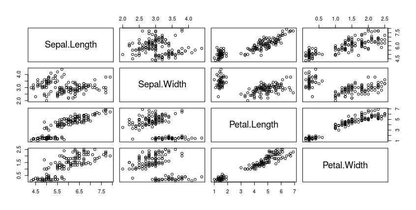
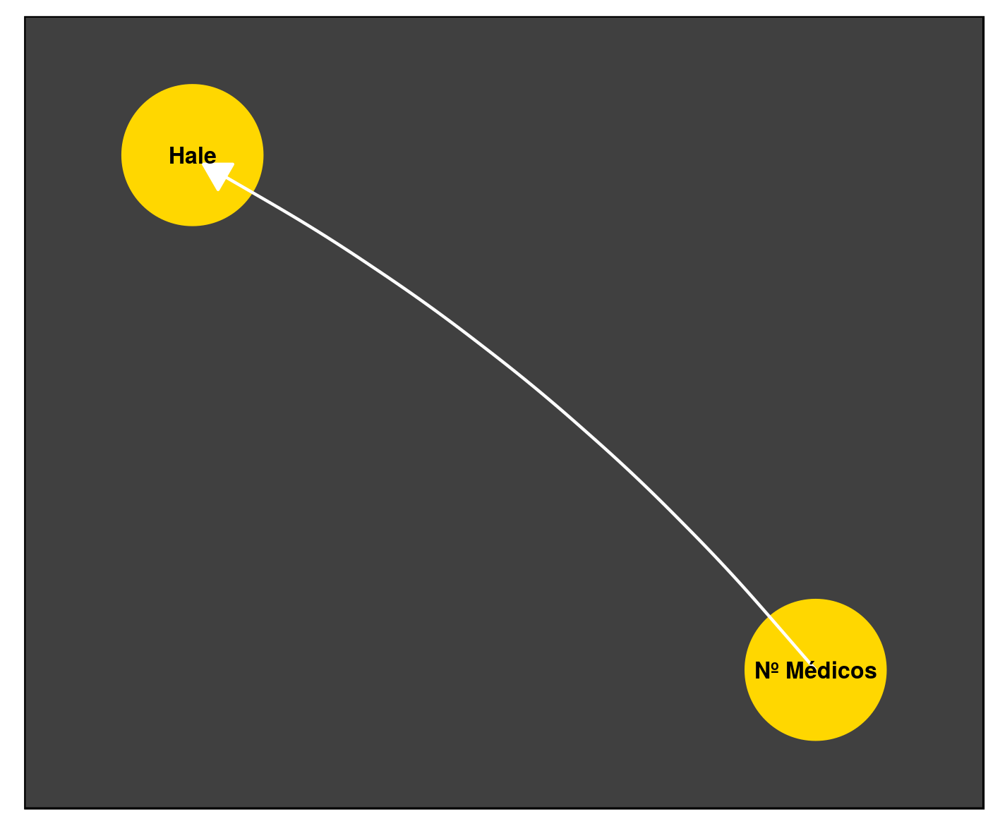
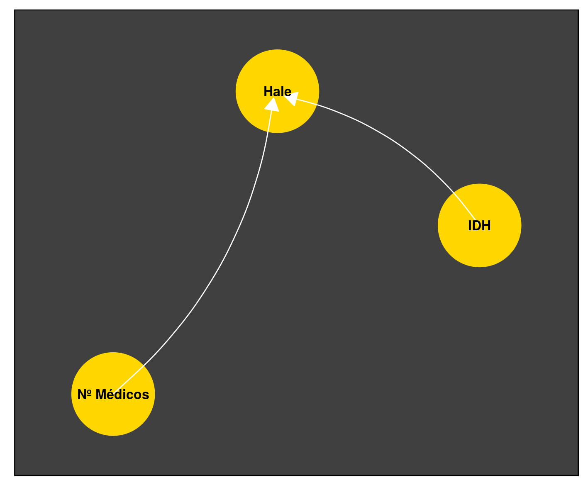
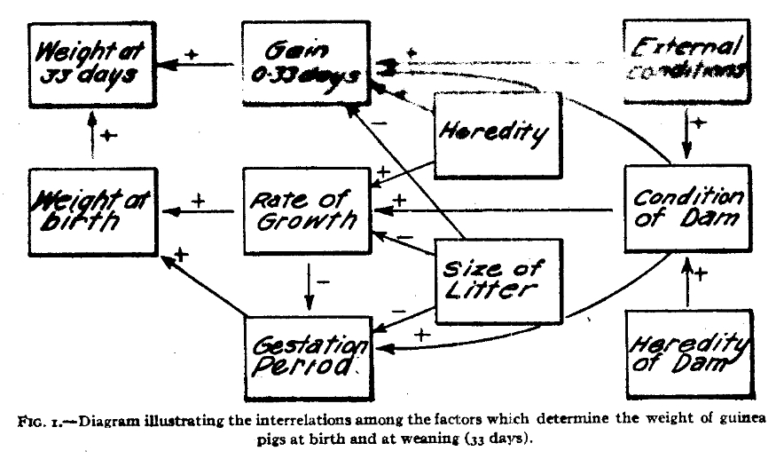
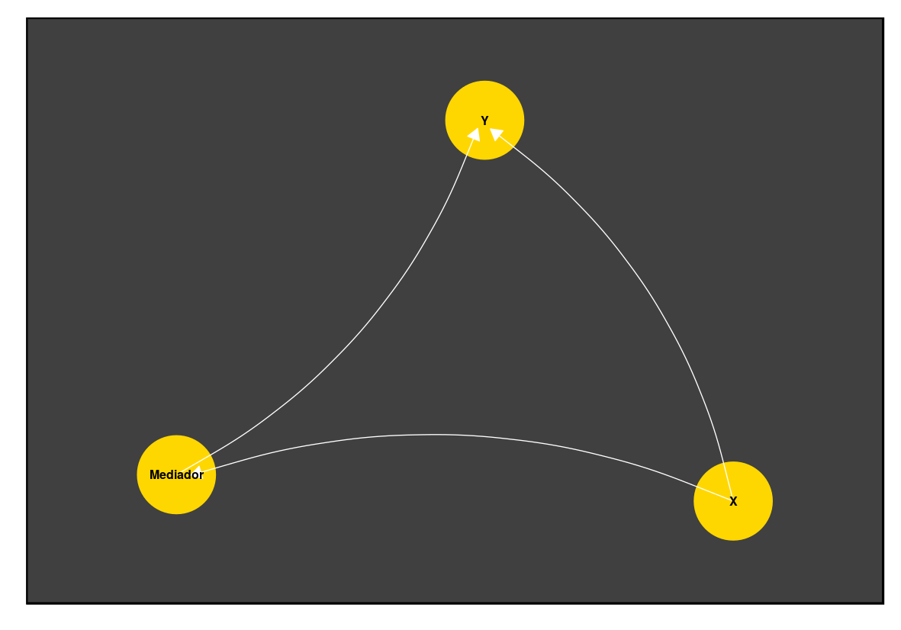
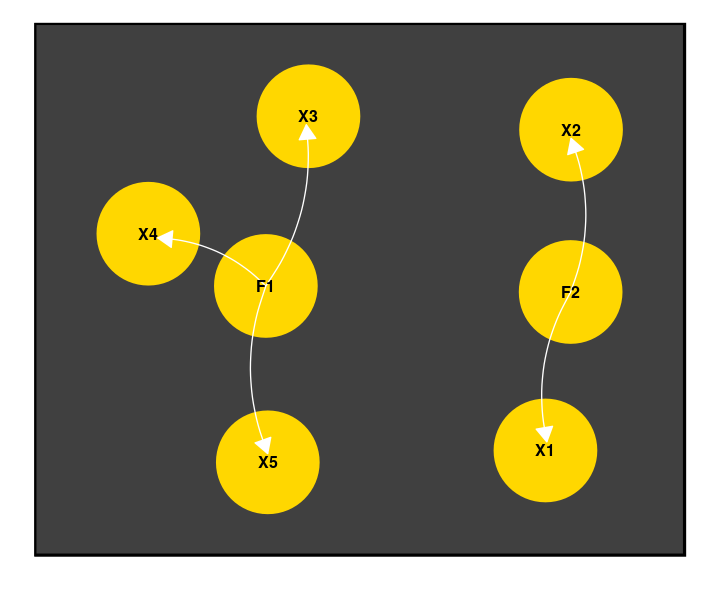
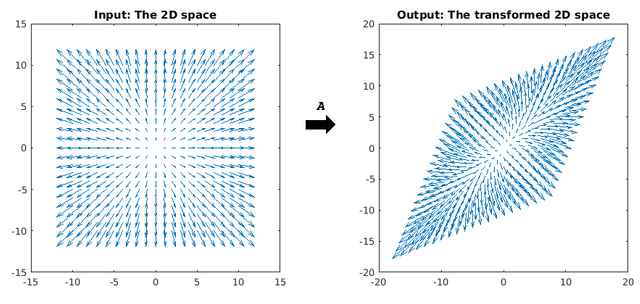
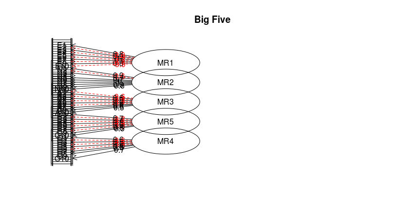

---
output:
  pdf_document: default
  html_document: default
---


# Capítulo 3 : Análise multivariada, grafos e inferência causal 

## Introdução
Neste capítulo, incorporaremos construtos como base para estudar um conceito do  berço da filosofia ocidental: *causalidade*. A filosofia Aristotélica investiga causas materiais, formais, eficientes e finais. Causas exprimem a ideia de isolar relações entre fatores. A maioria das definições envolvem *efeitos* que dependem, mesmo que parcialmente, de *causas* precedentes. Relações de causalidade *explicam* a evolução de sistemas em certas condições. Veremos discussões atuais sobre o conceito, em que a obra de Judea Pearl é importante.  
Até este ponto, aplicamos modelagem matemática para uma ou duas variáveis aleatórias. Procedimentos diferentes foram empregados para correlação, comparação e regressão. Neste capítulos conheceremos as técnicas de regressão múltipla, mediação, moderação, análise de componentes principais e análise fatorial.   

## Regressão múltipla

Nos modelos lineares simples, calculamos parâmetros para um intercepto $\beta_{0}$, inclinação da reta $\beta_{1}$ e variância dos erros $\sigma^{2}_\epsilon$. No exemplo apresentado, relacionamos o número de médicos ($n$) com a expectativa de vida saudável $hale$ em um país.

$$y_{i} = \beta_{0} + \beta_{1}x_{i} + \epsilon$$
$$hale_{i} = \beta_{0} + \beta_{1}n_{i} + \epsilon$$

Na *regressão linear múltipla*, introduzimos mais uma variável preditora. Em nosso exemplo, poderia ser o valor do IDH do país:

$$hale_{i} = \beta_{0} + \beta_{1}n_{i} + \beta_{2}IDH_{i}' + \epsilon$$

Em geral, temos dois objetivos:  
**(1)** melhorar a performance do modelo ao adicionar informações pertinentes; **(2)** examinar o efeito sobre as demais variáveis preditoras.  

O primeiro objetivo é intuitivamente óbvio, entretanto precisamos ter cuidado com redundância de informações. Especificamente, há uma troca quase inevitável entre complexidade e robustez do modelo. Acrescentar variáveis ou usar classes de relações mais flexíveis implica dar liberdade para um sobreajuste aos dados. Isto é, nosso modelo aprenderá idiossincrasias sobre os dados disponíveis (datasets WHO e World Bank) e não sobre a relação entre as abstrações (e.g.expectativa de vida saudável). Veremos nas próximas sessões como mitigar esse problema.  

Para o caso da regressão linear múltipla, podemos verificar se há colinearidade (relação linear) entre variáveis preditoras. Se as variáveis preditoras são altamente correlacionadas, é provável que estejamos fornecendo informações redundantes ao modelo, o que é nocivo. Existem alguns indicadores que podem ajudar a tomar essa decisão.  

Comumente, observamos o VIF *Variance inflation factor*.

**VIF**

A intuição aqui é de que se as variáveis são muito relacionadas $X_{1} \sim X_{2}$, os valores de $\beta$ estimados em $Y = \beta_{1}X_{1} + \beta_{2}X_{2} + ...$ não serão únicos. Por exemplo, poderíamos trocar $\beta_{1}$ por $\beta_{2}$ e a solução permaneceria praticamente inalterada. O VIF estima a colinearidade em relação à combinação de outros preditores usados.      
   
Para calcular o VIF referente a um preditor $X'$, ajustamos uma nova regressão, em que a variável resposta é $X'$ e as preditoras são as outras variáveis preditoras. O VIF é dado por: $\frac{1}{1-R^{2}}$, sendo $R^{2}$ o coeficiente de determinação da regressão, como calculamos antes.  
Valores de VIF altos refletem valores de $R^2$ altos, isto é: a combinação linear de outras variáveis explicaria muito bem a variável preditora em questão.
Não há regra canônica, porém VIF > 10 ($R^{2} = 0.9$) e VIF > 5($R^{2} = 0.8$) são citados como fronteiras indicando colinearidade inaceitável.  

A função **vif** do pacote *car* implementa o procedimento. Ajustamos uma regressão linear múltipla para o comprimento das sépalas no dataset *iris* a partir de outras 3 variáveis. Podemos verificar que há colinearidade ($VIF_{pet.leng.}\sim 15.1$, $VIF_{pet.wid.}\sim 14.2$) entre largura e comprimento da pétala. Por outro lado, a colinearidade com o comprimento da sépala é baixa ($VIF_{pet.wid.} \sim 1.3$). 
 
```r
    >car::vif(lm(Sepal.Length ~ Petal.Length + Petal.Width + Sepal.Width,    
        data=iris))
    Petal.Length  Petal.Width  Sepal.Width 
       15.097572    14.234335     1.270815 
```

Se há colinearidade, é recomendado remover um dos preditores para eliminar a redundância. Como sempre, a inspeção visual ajuda.  

```r
    >pairs(iris[,1:4])
```


Como podemos ver, usar duas variáveis preditoras (regressão múltipla) não colineares aumenta a performance do modelo em relação à regressão simples $(R^{2} \sim 0.84\enskip vs\enskip R^{2} = 0.76)$.  

```r
    >lm(Sepal.Length ~ Petal.Length,    
    +         data=iris) %>% summary    

    (...)
    Multiple R-squared:   0.76,	Adjusted R-squared:  0.7583 
    F-statistic: 468.6 on 1 and 148 DF,  p-value: < 2.2e-16    

    >lm(Sepal.Length ~ Petal.Length + Sepal.Width,    
    +         data=iris) %>% summary    
    (...)
    Multiple R-squared:  0.8402,	Adjusted R-squared:  0.838 
    F-statistic: 386.4 on 2 and 147 DF,  p-value: < 2.2e-16
```

Um outro objetivo para a regressão múltipla é examinar o efeito modificador das variáveis acrescentadas. Em especial, é comum incluir variáveis auxiliares para corrigir estimativas.  

Exemplo: queremos estimar um parâmetro $\beta_{1}$ para a relação entre altura e peso. Ajustamos um modelo: $Altura = \beta_{0}+\beta_{1}*Peso+\epsilon$. Entretanto, sabemos que a altura média de homens é maior que a de mulheres. Ao examinar a relação entre a altura e peso, podemos incluir a variável *sexo* no modelo,$Altura = \beta_{0}+\beta_{1}*Peso+\beta_{2}*Sexo+\epsilon$.  
Nossa estimativa de $\beta_{1}$ é modificada de maneira a levar em conta os efeitos do sexo.[^21]  

Veremos uma formalização desse conceito a seguir, com o procedimento para examinar mediação.  

[^21]: Sexo é uma variável dicotômica (macho/fêmea). Costumamos codificá-las de forma binária (0/1; e.g: macho = 1 / fêmea = 0). Assim, um sujeito macho terá a estimativa de altura acrescida em $\beta_{2}*1$, enquanto fêmeas terão este termo zerado $\beta_{2}*0$. Chamamos esse truque de *dummy coding*.

\pagebreak

---

Costumeiramente, traduzimos os procedimentos acima afirmando que a estimativa para *"a relação entre X e Y é controlada para confundidores [A, B e C]"*. A esse ponto, fica óbvio que a simplificação linguística é perigosa. A falta de cautela em traduzir abstrações matemáticas para linguagem natural é responsável pela injusta fama da estatística como ferramenta para enganos.  
Assim como o valor p é indevidamente interpretado muitas vezes, o "controle para confundidores"" nada mais é que o ajuste de estimativas selecionando outras variáveis arbitrariamente para uma combinação linear.  
O prejuízo é herdado por todas as disciplinas que usam métodos quantitativos. Pior, criamos a possibilidade para testar múltiplas combinações de confundidores. Nas mãos de alguém incauto ou mal intencionado, testes sucessivos têm grandes chances de alcançar resultados "significantes". De uma forma global, vemos uma série de verdades transitórias ventiladas na comunidade científica (e na mídia leiga), resultantes de análises mal conduzidas.  
Para inferências desse tipo, é recomendado que os confundidores sejam mitigados experimentalmente (e.g. randomização) sempre que possível e que premissas do modelo sejam respeitadas.  

---

\pagebreak 

## Grafos e trajetórias causais

Podemos usar os diagramas a seguir para ilustrar uma regressão linear simples:  
  
Ou múltipla com dois preditores:  
  

É fácil relacionar *nodos com variáveis* e *conexões com relações* descritas pelas equações estimadas. Formalmente, tratamos essas abstrações com o nome de **grafos**. O campo começou a ser tratado por Euler em 1736. Chamamos os pontos de nodos, ou vértices, e as ligações de arestas (*edges*). Cada aresta conecta dois nodos.  
O conceito foi usado para resolver o problema das pontes de Königsberg. Dada uma série de pontes conectando partes diferentes da cidade, fazer um percurso que cruzae cada uma apenas uma vez?  

  

\pagebreak

Euler mostrou que era impossível. Note que não usamos distâncias. Apenas descrevemos como elementos são conectados. Podemos atrelar diversas estruturas. Os grafos acima, por exemplo, são direcionamos e possuem equações vinculadas.  

As equações e procedimentos de que lançamos mão anteriormente são soluções equivalentes às representações gráficas. É possível generalizar a ideia, usando diagramas para tratar matematicamente formulações de teorias científicas.  

### Grafos e trajetórias causais

*"The ideal method of science is the study of the direct influence of one condition on another in experiments in which all other possible causes of variation are eliminated.", Sewall Wright, Correlation and Causation, 1921*  

A pouco conhecida origem deste campo está no trabalho de um geneticista, Sewall Wright. Ele assumiu que a correlação entre variáveis é resultante da influência de muitas trajetórias causais. Então, propôs uma forma de medir a influência de cada trajetória sobre uma variável-alvo.



Usando grafos direcionados (as conexões têm uma origem e um destino), é atrelar as noções de correlação e regressão de forma a ilustrar caminhos causais entre relações lineares. Sewall começou usando apenas grafos acíclicos (sem conexões levando ao ponto de origem do percurso) em condições restritas.  

Décadas depois, o campo foi extrapolado para outros cenários mais gerais. Em específico, o boom de disponibilidade de poder computacional nas décadas de 1960 e 1970 impulsionou o surgimento de estimadores diversos para parâmetros nesses modelos.  
É esperado que a quantidade de parâmetros cresça conforme a complexibilidade.  

Um trabalho valoroso foi feito por Judea Pearl para unificar as abordagens. Pearl mostrou que muitos *frameworks* são situações especiais de modelos de equação estrutural (SEM, structural equation models), os quais também englobam versões não paramétricas. Por exemplo, o sistema causal de Rubin é equivalente a SEM: todos os teoremas podem ser deduzidos usando algumas identidades entre as abordagens.  

Ele também escreveu textos compreensivos alinhando a matemática aplicada a uma base epistemológica.  
É especialmente digno de nota o conceito de *contrafactual*. Para estimar um efeito causal, imaginamos quais seriam as condições em um cenário sem ação do agente causal. Pearl conduz um cauteloso estudo logico-semântico das definições na tentativa de construir um sistema coerente de pesquisa empírica. Uma explicação completa foge do escopo do livro, entretanto conheceremos algumas aplicações.  

#### Mediação e Moderação

**Mediação**

Uma ideia curiosa é de que uma variável pode estar intermediando a ação de outra sobre um desfecho. Um exemplo clássico é a relação entre o hábito de fumar e câncer. Sabemos que existe uma ação nociva pela temperatura do ar inalado, assim como dos componentes químicos absorvidos.  
Em modelos de mediação, tentamos quantificar a porção que é explicada por uma variável intermediária. Para tanto, empregamos o seguinte procedimento:

**1.** Verificar plausibilidade de relações individualmente através modelos de regressão entre variáveis de interesse.
Ajustamos 3 modelos:  
*(1)* variável independente e variável alvo $(Y \sim X_{1}\beta_{1})$,  
*(2)* variável mediadora e variável alvo $(Y \sim X_{2}\beta_{2})$,  
*(3)* variável independente e variável mediadora $(X_{2} \sim X_{1}\beta_{3})$. 

O efeito direto da variável independente sobre a variável alvo é quantificado $\beta_{1}$.

**2.** Verificar mudanças obtidas pela introdução da variável mediadora.  
Ajustamos um quarto modelo *(4)*, com a combinação linear de variável independente e variável mediadora. Abservamos então a diferença entre o novo $(\beta_{1}')$ coeficiente de $X_{1}$ e o antigo $(\beta_{1})$ $Y = X_{1}\beta_{1}' + X_{2}\beta_{4}$.  

Caso exista mediação, espera-se que o coefiente $\beta_{1}'$ seja não significativo ou que possua magnitude bastante reduzida em relação ao coeficiente do efeito direto $\beta_{1}$.  

Seguindo o exemplo sugerido, espera-se que exista uma relação entre hábito de fumar e câncer. Ainda, espera-se que a inclusão de um mediador (e.g. concentração de nicotina) explique parte do efeito, reduzindo o coeficiente de $X_{1}$. O diagrama a seguir expressa a ideia contida no processo desejado.  

  

O diagrama abaixo ilustra passos rigorosamente.
As 3 regressões para checar premissas estão na sessão superior e a regressão múltipla no setor inferior. Foram suprimidos termos de erro. Estimativas para a relação entre $X_{1}$ e $Y$ são $\hat{\beta_{1}}$ e $\hat{\beta_{1}}'$ grifados nas equações. O comportamento desses parâmetros define as conclusões sobre o modelo de mediação.  
  


---

Não há garantias de que os sistemas reais se comportarão seguindos os parâmetros estimados. Usamos regressão múltipla para estimar o efeito parcial atribuído aos medidadores, porém a retirada desses fatores no fenômeno real pode resultar em alterações no sistema não previstas pelo modelo.  
A certeza dependeria de uma descrição bastante acurada do fenômeno pelas regressões $(R^2 \sim 1)$, o que raramente é verificado fora de fenômenos físicos mais simples.   

Portanto, é recomendável que ajustes sejam feitos na fase experimental. Em nosso exemplo, isso implicaria em controlar a concentração de nicotina absorvida *in vivo*. Obviamente, razões éticas e limitação de recursos precluem muitas vezes a manipulação direta do objeto de estudo. Métodos tais como o descrito, ainda que frágeis, permitem estudar interações e relações causais. Entretanto, é necessário atenção aumentada ao fazer conclusões e, especialmente, ao traduzí-las para linguagem natural.  

---  

Em R:  

```r
    >fit_yx1 <- lm(y ~ x1, data)    
    >fit_yx2 <- lm(y ~ x2, data)  
    # Mediation
    >fit_yx1x2 <- lm(y ~ y1 + y2)    
    >summary(fit_yx1)
    (...)
    >summary(fit_yx2)
    (...)
    >summary(fit_yx1x2)
    (...)
```
A diferença numérica entre valores de $\beta_{x_{1}}$ é a magnitude do efeito indireto (*Ind. Effect*). Podemos usar uma estimativa do erro padrão para derivar uma estatística t e um valor p associados (teste de Sobel). Usando libs do CRAN:  
Usando o dataset `bh1996`, com medidades sobre liderança, bem-estar e horas de trabalho.  
A pergunta é: clima de liderança media relação entre horas de trabalho e bem-estar?   

```r
    >library(bda)
    >library(multilevel) # dataset bh1996
    >data(bh1996)
    
    # LEAD : Clima de liderança
    # WBEING : Bem-estar
    # HRS : Horas de trabalho
    
    
    >sobel(pred=bh1996$HRS,med=bh1996$LEAD,out=bh1996$WBEING)
    $`Mod1: Y~X`
                   Estimate  Std. Error   t value     Pr(>|t|)
    (Intercept)  3.51693620 0.052902697  66.47934 0.000000e+00
    pred        -0.06523285 0.004590274 -14.21110 3.078129e-45    
    $`Mod2: Y~X+M`
                   Estimate Std. Error   t value      Pr(>|t|)
    (Intercept)  1.86832973 0.06413083  29.13310 1.024201e-176
    pred        -0.04311316 0.00421918 -10.21837  2.382257e-24
    med          0.48386196 0.01242129  38.95426 4.967825e-302    
    $`Mod3: M~X`
                   Estimate  Std. Error   t value     Pr(>|t|)
    (Intercept)  3.40718349 0.045154735  75.45573 0.000000e+00
    pred        -0.04571488 0.003917997 -11.66792 3.488366e-31    

    $Indirect.Effect
    [1] -0.02211969    
    $SE
    [1] 0.001978985    
    (...)

    >mediation.test(iv = bh1996$HRS,mv = bh1996$LEAD,dv = bh1996$WBEING)
                    Sobel        Aroian       Goodman
    z.value -1.117729e+01 -1.117391e+01 -1.118067e+01
    p.value  5.267356e-29  5.471647e-29  5.070460e-29
    # Aroian e Goodman são outros testes para o parâmetro de efeito indireto
```

\pagebreak

**Moderação e Interações**

Modelos incluindo termos de moderação são aqueles que incluem **interação** entre variáveis. Usando o jargão de inferência causal, é o mesmo que modificador de efeito (*effect-modifier*). Como discutimos antes, a relação entre hábito de fumar e câncer pode ser explicada por fatores intermediários, como a concentração de nicotina e presença de variantes genéticas de risco.  
Podemos supor que a concetração de nicotina inalada diariamente tenha um efeito independente. Igualmente, uma configuração genética tem efeito causal por si.  

$$Risk = Nicotina*\beta_{1} + Genes_{(+)}\beta_{2}$$

Em moderação, adicionamos um termo à nossa combinação linear. É um coeficiente para a multiplicação entre variáveis independentes.

$$Risk = Nicotina*\beta_{1} + Genes_{(+)}\beta_{2} + Nicotina*Genes_{(+)}\beta_{3}$$
Será que *fumar* **e** ter *genes de risco* é diferente da combinação do efeito de ambos em separado?  
 
Esse é um dos poucos casos em que é mais fácil observar o aspecto algébrico antes. Estamos multiplicando os valores de preditores $X_{1}$ e $X_{2}$. Se ambos tiverem mesmo sentido ($+$ ou $-$), a interação terá efeito positivo. Caso contrário, negativo. Ainda, vemos que as magnitudes são multiplicadas. O coeficiente $\beta_{3}$ quantifica essa multiplicação em relação ao efeito em $y$, seja alterando o sentido ($\beta_{3}$ negativo) ou escalando o valor absoluto.  

$$y = X_{1}*\beta_{1} + X_{2}*\beta{2} + X_{1}X_{2}\beta_{3}$$

A relação de $y$ em relação com cada preditor deixa de ser linear. Como podemos verificar analisando as derivadas parcials. Para $\frac{d}{dx_{1}}$:  

$$\frac{d}{dx_{1}}(y) = \frac{d}{dx_{1}}(x_{1}\beta_{1} + x_{2}\beta_{2} + x_{1}x_{2}\beta_{3})$$
O segundo termo não depende de $X_{1}$, então:  
$$\frac{d}{dx_{1}}(y) = \frac{d}{dx_{1}}(\beta_{1} + x_{2}\beta_{3})$$
A inclinação (*slope*), que antes era uma constante (linha reta) $\beta_{1}$ passa a ter um termo somado, que é a multiplicação da constante estimada $\beta_{3}$ pelo valor de $x_{2}$. Então temos inclinação diferente para cada valor de moderador!  

Esses detalhes tornam a interpretabilidade dos coeficientes difícil. Normalmente, são usadas heurísticas, como centralizar os dados em torno da média, para simplificar o contexto.  

\pagebreak

#### Medidas latentes e análise fatorial

Considere o problema de medir algo inacessível através de meios secundários.  
Por exemplo, o conceito de *qualidade de vida* é facilmente concebível, apesar de não estar atrelado a uma medida tangível, tal qual *altura* ou *tamanho do fêmur*.  
Uma série de métodos foi desenvolvida para lidar com a tarefa de estimar *variáveis latentes*. Em especial, esses modelos são muito populares entre psicometristas. Podemos aplicar modelos de variáveis latentes para muitos contextos.   

Isso é feito quando usamos respostas corretas em um teste formulado por especialistas para quantificar uma habilidade. A *Teoria de Resposta ao Item* é usada em testes como ENEM (Brasil), SAT e GRE (EUA). Relacionamos a estimativa de habilidade $(\theta)$ com a probabilidade de acertar (1) ou errar (0).  

Traços de personalidade também podem ser estudados dessa maneira. Podemos atribuir um grau de extroversão $F$ de uma pessoa através de sua pontuação em uma bateria de testes $X_{1},X_{2},X_{3},...$ relacionados a esse atributo.  

Sejam os items:  

1. Gosto de estar com outras pessoas (1 a 7)
2. Costumo conversar com desconhecidos (1 a 7)
3. Costumo expressar minhas opiniões (1 a 7)
4. Sou considerado(a) uma pessoa comunicativa (1 a 7)

A pontuação de um indivíduo será uma sequencia de 4 números. Um indivíduo muito extrovertido pode pontuar (7,7,6,7) e um introvertido (2,3,2,1). Podemos pensar que a série de medidas é influenciada por um construto (extroversão).  

Análise fatorial parte da premissa de que a **covariância** nas medidas diretas é fruto das **influências latentes compartilhadas** pelos items. Assim, podemos estimar um parâmetro $\lambda$ para a relação entre cada item e o traço latente $F$. Para isso, usaremos a matriz de covariâncias.  

Os valores de $\lambda$ quantificam a relação entre items e fatores latentes e servem, por exemplo, para selecionar items mais relacionados aos traços alvo em um instrumento psicométrico.  

Como na regressão linear, o modelo descreve cada medida como uma combinação entre score individual para fator latente $F$ multiplicado pelo peso para o item $\lambda _{Item 1}$ e erros.  
A medida do item $1$ para o $i$-ésimo sujeito considerando $n$ fatores latentes $F_{n}$ é:  
$$x_{1,i} = \sum_{1}{n}F_{i}\lambda _{n} + \epsilon$$. 

Assim, falamos em mais de um construto latente. Ao invés de trabalhar com um grande fator latente (extroversão), podemos ligar os quatro items anteriores a dois conceitos menos específicos: "sociabilidade" e "expressividade".  

O valor dos 4 itens para o $n$-ésimo sujeito, considerando dois fatores latentes, com pesos $\lambda_{i}, \lambda _{i}$ é:  

$$x_{1,n} = F_{1,n}\lambda _{1} + F_{2,n}\lambda _{1}' + \epsilon$$
$$x_{2,n} = F_{1,n}\lambda _{2} + F_{2,n}\lambda _{2}' + \epsilon$$
$$x_{3,n} = F_{1,n}\lambda _{3} + F_{2,n}\lambda _{3}' + \epsilon$$
$$x_{4,n} = F_{1,n}\lambda _{4} + F_{2,n}\lambda _{4}' + \epsilon$$

Podemos perceber que a matriz $\Lambda$ terá 8 elementos, com 4 pesos para o fator $F_{1}$ e 4 pesos para o fator $F_{2}$. Sabendo os dois scores latentes de cada sujeito, seria possível reconstruir as observações com algum grau de perda. Perceba que expressamos qualquer item com apenas dois parâmetros ($F_{1}$ e $F_{2}$). As informações em nosso dataset poderiam então então ser condensadas de $[nx4]$ dimensões para $[nx2]$.



Para estimar os parâmetros acima, supomos que a variância de **cada item possui uma variância intrínseca e uma variância compartilhada, que é determinada pelos fatores latentes**.
Usamos uma matriz de covariâncias entre os items para estimar os pesos dos fatores latentes. Além disso, estimamos parâmetros relacionados à diagonal da matriz (variâncias).  
Em nosso exemplo, teríamos uma matriz de dimensão $[4x4]$.  

$$CovMat_{x} = \begin{pmatrix} 
. & . & . & .  \\ 
. & . & . & .  \\ 
. & . & . & .  \\ 
. & . & . & .  \end{pmatrix}$$

Como vimos no capítulo 2, cada valor é dado por:  

$$Cov(X,X')=\sum_{i=1}^{N}(x_{i}-\mu_{x})(x_{i}'-\mu_{x'})$$  

A diagonal reflete a covariância de uma variável com ela mesma, a variância:

$$Cov(X,X)=\sum_{i=1}^{N}(x_{i}-\mu_{x})(x_{i}-\mu_{x})$$
$$=\sum_{i=1}^{N}(x_{i}-\mu_{x})^2$$
$$=Var(X)$$

Por exemplo, a matriz de covariâncias para o *iris*:  
```r
    > cov(iris[,1:4])
                 Sepal.Length Sepal.Width Petal.Length Petal.Width
    Sepal.Length    0.6856935  -0.0424340    1.2743154   0.5162707
    Sepal.Width    -0.0424340   0.1899794   -0.3296564  -0.1216394
    Petal.Length    1.2743154  -0.3296564    3.1162779   1.2956094
    Petal.Width     0.5162707  -0.1216394    1.2956094   0.5810063
    > var(iris[,1])
    [1] 0.6856935
```
Usando notação matricial, seja $X$ uma matriz com $m=4$ colunas de $n=150$ observações, a matriz de covariância $Cov_{4 x 4}$ é:

$$Cov(X') = X'^{T}X'\frac{1}{n} = X'^{T}X'\frac{1}{150}$$
$X'$ é a matriz cujos valores foram centralizados pela média $x' = x - \mu$. Assim o produto de $X$ pela transposta retorna em cada elemento $x_{ij}$ o valor $\sum_{i}^{n}(x_{i}-\mu_{i})(x_{j}-\mu_{j})$. Fácil implementar manualmente:  

```r    
    > iris2$Sepal.Length <- iris$Sepal.Length - mean(iris$Sepal.Length)
    > iris2$Sepal.Width <- iris$Sepal.Width - mean(iris$Sepal.Width)
    > iris2$Petal.Length <- iris$Petal.Length - mean(iris$Petal.Length)
    > iris2$Petal.Width <- iris$Petal.Width - mean(iris$Petal.Width
    > (t(as.matrix(iris2[,1:4])) %*% as.matrix(iris2[,1:4]))*1/150
                 Sepal.Length Sepal.Width Petal.Length Petal.Width
    Sepal.Length   0.68112222 -0.04215111    1.2658200   0.5128289
    Sepal.Width   -0.04215111  0.18871289   -0.3274587  -0.1208284
    Petal.Length   1.26582000 -0.32745867    3.0955027   1.2869720
    Petal.Width    0.51282889 -0.12082844    1.2869720   0.5771329

```

Com base nos princípios delineados, a solução desejada por nós é tal que:

1. A covariância entrem medidas é explicada por combinações de variáveis latentes compartilhadas.  

2. Os dados serão explicados por uma matriz de rank mais baixa. Em nosso caso: $\Lambda_{[n\times m]}, m < 4$.  

3. Para cada observação, teremos um valor de score latente $F_{i}$ para cada fator. O valor final de um item é dado pela contribuição individual de cada fator mais uma variância individual. Como vimos:  
$$x_{1,i} = \sum_{1}{n}F_{i}\lambda _{n} + \epsilon$$.

4. Cada fator possui uma variância intrínseca, a qual estimaremos somando uma matriz diagonal $\psi$ à nossa matriz de pesos.

Estimamos os parâmetros para maximizar as probabilidades (*Max. Likelihood*) dos valores observados em $X$ dadas as equações.     
$$L(X^{T}X\frac{1}{n} | \Lambda , \psi)$$   

Determinamos a função de custo conhecendo $\Lambda$ e $\psi$:  
$$C \sim \Lambda \Lambda^{T} + \psi$$  

Em que $\psi$ é uma matriz diagonal com mesmo rank que $\Lambda$. Como vimos anteriormente, a diagonal contém as variâncias, então os parâmetros em $\psi$ regulam a porção de variância dos items governadas por fatores $\lambda$. Dizemos que a diagonal em $\Lambda \Lambda^{T}$ contém as **communalities** (variância intrínseca).  

O processo de otimização para minimizar erros é mais complexo que o da regressão linear. Os estimadores possíveis aqui são muitos, nenhum deles com solução analítica simples ou garantia de convergência.

#### Semelhanças entre técnicas de redução de dimensões: EFA, PCA probabilístico, PCA, Autoencoder.

Podemos levar em consideração a solução anterior sem uma matriz diagonal $\psi$ atrelada:

$$Cov \sim \Lambda \Lambda^{T}$$  

Essa formulação é equivalente à análise de componente principal (Principal Component Analysis, PCA). Aqui, nossos pesos estimarão também a variância intrínseca. É um método computacionalmente barato para reduzir dimensões preservando informações. Matematicamente, a diferença entre PCA e EFA está no fato de o segundo estimar separadamente parâmetros para covariância compartilhada e variância individual. Uma técnica 'intermediária' pouco conhecida é o PCA probabilístico (PPCA), em que levamos em conta uma matriz diagonal mais simples. 

$$Cov \sim \Lambda \Lambda^{T} + \sigma^{2}I$$  

Isto é: uma matriz identidade com ruído introduzido através de apenas um parâmetro ($\sigma^{2}$).  

Uma curiosidade é que a diagonal acaba influindo menos com o aumento do rank das matrizes. Então, o resultado das técnicas acima converge em situações com alta dimensionalidade ($n \rightarrow \infty$). Uma discussão mais completa pode ser conferida em outro lugar (ver referências).  

Em sumário:  

  

.
$$PCA: Cov \sim \Lambda \Lambda^{T}$$  
$$PPCA: Cov \sim \Lambda \Lambda^{T} + \sigma^{2}I$$  
$$EFA: Cov \sim \Lambda \Lambda^{T} + \psi$$  
(Aqui, usamos $\sim$ não para denominar semelhança, mas sim que maximizaremos o likelihood de $Cov$ com uma expressão em função dos termos à direita)

Ainda, redes neurais do tipo *autoencoder* possuem formulação semelhante. Especificamente, um autoencoder com uma camada interna e certas restrições na função de ativação é idêntico ao PCA. Entretanto, podemos usar **mais** dimensões que o input, além de múltiplas camadas e funções não-lineares. Dessa maneira, incrementamos o poder do modelo generativo, assim como ficamos mais vulneráveis a sobreajuste.   

Voltaremos ao assunto quando o foco for modelos de ambiente, compressão de informação, modelos gerativos e redução de dimensões.   

**Número de fatores**

Não tocamos em um ponto crucial: qual o número ótimo de fatores? É melhor um modelo que leve em conta *extroversão* ou um que use *sociabilidade* e *expressividade*?  

Podemos explicar a covariância usando um número arbitrário de fatores latentes. A tendência é observarmos melhora nos indicadores de perfomance sob a pena de saturação (e.g.sobreajuste, interpretabilidade difícil). Existem procedimentos estabelecidos para balancear o poder explicativo com simplicidade do modelo.  

Em geral, busca-se um número mínimo de fatores que maximize o poder de explicação. Considerando graus de liberdade($df$) e erros do modelo (estatística $X^2$), dois índices populares são o RMSEA e o CFI. Assim como no cálculo de $R^2$, o racional é dimensionar erros, porém aqui penalizamos a quantidade de parâmetros.  

Outra métrica bastante utilizada é observar a influência de cada fator sobre a matriz de covariância.  

Ao multiplicarmos um vetor por uma matriz, mudamos sua magnitude e sua direção. 



Os vetores alinhados com a matriz (e.g. aqueles na diagonal da transformação acima) apenas mudam de tamanho após a transformação.  

São os autovetores da matriz.  

Uma das formas de extração de fatores é através dos eixos principais. Neste método, decompomos a matriz original em vetores ortogonais multiplicados por escalares (autodecomposição, *eigen/spectral decompositon*): autovalores e autovetores (eixos).  

Em geral, os primeiros eixos têm maior autovalores. Existem diversas heurísticas recomendando métodos para escolher números de fatores pelo tamanho dos autovalores. Uma delas é considerar apenas autovalores maiores que 1. Outra é considerar o ponto da curva em que há um aparente ponto de descontinuação ("joelho").  

É razoável pensar que autovetores associados a autovalores altos capturam muita informação sobre variância (individual e compartilhada) dos items.  

**Análise fatorial confirmatória**

Os processos descritos acima são exploratórios por natureza. Buscamos o melhor ajuste para fatores latentes sem antes determinar uma estrutura. É um bom procedimento para redução de dimensões e compressão de informação, porém, se desejamos interpretabilidade e validade científica, há alguns pontos sensíveis.  

Pensando na elaboração de uma escala para medir um traço de personalidade, retomamos o argumento de Popper (capítulo 2) contra o indutivismo. É desejável que tenhamos um modelo prévio e hipóteses testáveis de antemão. Do contrário, é fácil encontrar um modelo oferecendo bom ajuste em quase qualquer caso.  

Na análise fatorial confirmatória, fazemos uma restrição direta ao modelo. Os parâmetros são pré-determinados com base em diagrama (grafo) expresso por quem conduz a análise. Assim, podemos especificar uma relações. No diagrama acima, o primeiro fator latente possui cargas nas relações com items $X_{3},X_{4},X_{5}$ e o segundo fator com $X_{1},X_{2}$.  

Nesse caso, os estimadores serão um pouco mais complexos.

#### Equações estruturais

Equações estruturais são o *framework* abrangendo quaisquer dos modelos anteriores, incluindo topolologias de grafos e relações arbitrárias (e.g. não paramétrica/probabilísticas).  

Assim, podemos desenhar um diagrama de relações entre entidades, declarar relações entre medidas e testar adequação do modelo. Como vimos, Judea Pearl costurou esses métodos quantitativos com uma base filosófica coerente, fazendo uso dos conceitos de contrafatual e testagem de hipóteses.  
Esses modelos são úteis em muitos campos para descrever estatisticamente relações de elementos múltiplos num sistemas complexo. Como sempre, devemos ter cuidado com a flexibilidade do modelo. Em especial, alguns procedimentos recomendados são de difícil conciliação com uma base hipotético-dedutiva (e.g. mudança ad-hoc do modelo após observação de índices de modificação).

#### Aplicações

Os grande cinco (Big Five) traços de personalidade são construtos consistentemente encontrados na busca por fatores latentes. Eles são: agradabilidade, neuroticismo, abertura a experiencias, conscienciosidade, extroversão.  

Usaremos dados do https://openpsychometrics.org/ . O dataset BIG5 tem dados demográficos (idade, gênero, país) e 50 medições em items do International Personality Item Pool. O tamanho amostral é de 19,719. Faremos análise fatorial exploratória e confirmatória através dos pacotes **psych**, **sem** e **lavaan**. 

```r
   >system("wget http://openpsychometrics.org/_rawdata/BIG5.zip")
   (...)
   Resolving openpsychometrics.org (openpsychometrics.org)... 69.164.197.103
   Connecting to openpsychometrics.org (openpsychometrics.org)|69.164.197.103|:80... connected.
   (...)
   Saving to: ‘BIG5.zip’
   (...)
   2019-02-04 09:09:39 (624 KB/s) - ‘BIG5.zip’ saved [523351/523351]
   > system("unzip BIG5.zip")
   Archive:  BIG5.zip
   inflating: BIG5/codebook.txt       
   inflating: BIG5/data.csv      
   
   >library(psych)
   >library(lavaan)
   >library(sem)
   >bigf_data <- read.csv("BIG5/data.csv",sep = "\t")
   >names(bigf_data)
   [1] "race"    "age"     "engnat"  "gender"  "hand"   
   [6] "source"  "country" "E1"      "E2"      "E3"     
   [11] "E4"      "E5"      "E6"      "E7"      "E8"     
   [16] "E9"      "E10"     "N1"      "N2"      "N3"     
   [21] "N4"      "N5"      "N6"      "N7"      "N8"     
   [26] "N9"      "N10"     "A1"      "A2"      "A3"     
   [31] "A4"      "A5"      "A6"      "A7"      "A8"     
   [36] "A9"      "A10"     "C1"      "C2"      "C3"     
   [41] "C4"      "C5"      "C6"      "C7"      "C8"     
   [46] "C9"      "C10"     "O1"      "O2"      "O3"     
   [51] "O4"      "O5"      "O6"      "O7"      "O8"     
   [56] "O9"      "O10"    
```
Vamos verificar o que acontece se ajustarmos um modelo com 5 fatores latentes:  

```r
    >library(lavaan)
    >library(psych)
    >efa_big <- fa(bigf_data[,8:57],nfactors = 5)
    >efa_big
    (..)
    RMSEA index =  0.055  and the 90 % confidence intervals are  0.054 0.055
```
Observamos um valor baixo de RMSEA, o que indica baixa magnitude de erros por grau de liberdade.  É interessante notar que não termos indicamos quais items avaliam quais fatores (e.g. Items O1 e O2 estão atrelados à abertura a experiência). Se as premissas estiverem corretas, para cada item, a solução encontrada deve indicar alta carga em um fator e baixa em outros.  

É o que se verificar. Selecionando as estimativas para três items de três grupos. O fator com maior carga está marcado com um asterisco.    

```r
    (...)
    Factor Analysis using method =  minres
    Call: fa(r = bigf_data[, 8:57], nfactors = 5)
    Standardized loadings (pattern matrix) based upon correlation matrix
          MR1   MR2   MR3   MR5   MR4   h2   u2 com
    E1   0.69*  0.04 -0.03 -0.01  0.00 0.46 0.54 1.0
    E2  -0.70* -0.08 -0.04  0.04  0.00 0.48 0.52 1.0
    E3   0.63* -0.17  0.16  0.09 -0.06 0.57 0.43 1.3
    (...)
    N1  -0.06  0.69*  0.10  0.05 -0.05 0.49 0.51 1.1
    N2   0.07 -0.50* -0.01 -0.09  0.05 0.26 0.74 1.1
    N3  -0.12  0.61*  0.20  0.10  0.01 0.43 0.57 1.3
    (...)
    A1   0.05  0.09 -0.44*  0.02 -0.07 0.20 0.80 1.2
    A2   0.28 -0.04  0.50* -0.05  0.06 0.41 0.59 1.6
    A3   0.17  0.27 -0.41* -0.15  0.10 0.27 0.73 2.6
    (...)
```
Extraindo a solução:  

```r
    >efa_bigst <- structure.sem(efa_big) 
    >efa_bigst
           Path        Parameter Value
    [1,] "MR1->E1"   "F1E1"    NA   
    [2,] "MR1->E2"   "F1E2"    NA   
    [3,] "MR1->E3"   "F1E3"    NA   
    [4,] "MR1->E4"   "F1E4"    NA   
```
Temos os fatores (MR) e os nodos aos quais eles estão conectados, descartando aqueles de menor magnitude/significância. Podemos ajustar um modelo confirmatório a partir dessas especificações:

```r
    >big_sem <- sem(efa_bigst,S = cov(bigf_data[,8:57]),N = 19719)
    >summary(big_sem)
    (...)
    >sem.diagram(big_sem,main = "Big Five",e.size=0.05)
```


O pacote lavaan permite especificar uma família maior de modelos e é bastante popular para SEM em R. A sintaxe é:  

```r
    >model <- c(' 
    F1 =~ X1 + X2 + X3
    F2 =~ Y1 + Y2 + Y3')
    >lavaan (model,data,...)
```

#### Referências 

Wright, S. (1921). "Correlation and causation". J. Agricultural Research. 20: 557–585.

https://stats.stackexchange.com/questions/123063/is-there-any-good-reason-to-use-pca-instead-of-efa-also-can-pca-be-a-substitut
https://steemit.com/steemstem/@dexterdev/linear-transformations-a-20-sbd-coding-contest-announcement

\pagebreak

#### Exercícios

1. Examine o VIF da regressão múltipla usada no processo de mediação com banco de dados *bh1996*.  
  * Há colinearidade entre mediador e preditor principal?  
  
2. Examine a mudança de performance (e.g. $R^{2}$) após inclusão do mediador no modelo.  
  * Se a variável mediadora $M$ explicar as mesmas vias causais que a variável preditora $X_{1}$, é esperado que essa mudança seja grande? Discuta.  

3. Usando dados à sua escolha:  
  * Ajuste uma regressão linear simples  
  * Adicione outro preditor (regressão linear múltipla)  
  * Verifique se há colinearidade  
  * Cheque outras premissas observando o material auxiliar **/aux** (e.g. independência dos erros com Durbin-Watson)  
  * Teste uma relação de mediação usando 3 variáveis  

4. Usando os dados *iris*:  
  * Escolha duas medidas corelacionadas e vefique se a espécie *modera* a relação entre elas. Lembre-se: você deve adicionar um termo de interação `var1*var` na formula da regressão.  
  * Execute **(1)** análise de componentes principais (PCA) e **(2)** análise fatorial exploratória (EFA) para as variáveis numéricas.  
  * Extraia **(1)** a projeção de cada observação nos dois primeiros componentes, $PC_{1}, PC_{2}$, e **(2)** o score gerado a partir de cada fator. A função `princomp` retorna um objeto acessível `$scores`. 
  * Verifique a correlação entre ambos.  
  
\pagebreak
