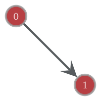
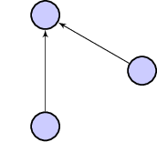

\pagebreak

# Início de textos em construção.

\pagebreak

# Capítulo 3 : Análise multivariada, grafos e inferência causal 

## Intrudução
Até este ponto, aplicamos modelagem matemática para uma ou duas variáveis aleatórias. Procedimentos diferentes foram empregados para correlação, comparação e regressão. Neste capítulo, incorporaremos novas medidas e construtos. Começamos expandindo a regressão linear simples. Em seguida, grafos serão introduzidos como abstração para um programa de pesquisa bastante popular para descrever relações causais.  

## Regressão múltipla

Nos modelos lineares simples, calculamos parâmetros para um intercepto $\beta_{0}$, inclinação da reta $\beta_{1}$ e variância dos erros $\sigma^{2}_\epsilon$. No exemplo apresentado, relacionamos o número de médicos ($n$) com a expectativa de vida saudável $hale$ em um país.

$$y_{i} = \beta_{0} + \beta_{1}x_{i} + \epsilon$$

Na *regressão linear múltipla*, introduzimos mais uma variável preditora. Em nosso exemplo, poderia ser o valor do IDH do país:

$$hale_{i} = \beta_{0} + \beta_{1}n_{i} + \beta_{2}IDH_{i}' + \epsilon$$

Em geral, temos dois objetivos:  
**(1)** melhorar a performance do modelo ao adicionar informações pertinentes;   **(2)** examinar o efeito sobre as demais variáveis preditoras.  

O primeiro objetivo é intuitivamente óbvio: ao fazer nossa predição, é preferível saber apenas o número de médicos ou também outras variáveis?  

Entretanto precisamos ter cuidado com redundância de informações. Especificamente, há uma troca quase inevitável entre complexidade e robustez do modelo. Acrescentar variáveis ou usar classes de relações mais flexíveis implica dar liberdade para um sobreajuste aos dados. Isto é, nosso modelo aprenderá idiossincrasias sobre o banco de dados disponível e não sobre a relação entre as abstrações. Veremos nas próximas sessões como mitigar esse problema.  
Para o caso da regressão linear múltipla, podemos verificar se há colinearidade (relação linear) entre variáveis preditoras. Se as variáveis preditoras são altamente correlacionadas, é provável que estejamos fornecendo informações redundantes ao modelo, o que é nocivo. Existem alguns indicadores que podem ajudar a tomar essa decisão.  
Comumente, observamos o VIF *Variance inflation factor*. 

Ele verifica se a variância do coeficiente $\beta$ estimado está sendo inflada por interferência de outros preditores.   
Para calcular o VIF referente a um preditor $X'$, ajustamos uma nova regressão, em que a variável resposta é $X'$ e as preditoras são as outras variáveis preditoras. O VIF é dado por: $\frac{1}{1-R^{2}}$, sendo $R^{2}$ o coeficiente de determinação da regressão, como calculamos antes. Valores de VIF altos refletem valores de $R^2$ altos, isto é: a combinação linear de outras variáveis explicariam muito bem (colinearidade) a variável alvo.
Não há regra canônica, porém VIF > 10 ($R^{2} = 0.9$) e VIF > 5($R^{2} = 0.8$) são citados como fronteiras indicando colinearidade inaceitável.  

A função **vif** do pacote *car* implementa o procedimento. Ajustamos uma regressão linear múltipla para o comprimento das sépalas no dataset *iris* a partir de outras 3 variáveis. Podemos verificar que há colinearidade ($VIF_{pet.leng.}\sim 15.1$, $VIF_{pet.wid.}\sim 14.2$) entre largura e comprimento da pétala. Por outro lado, a colinearidade com o comprimento da sépala é baixa ($VIF_{pet.wid.} \sim 1.3$). 
 
```r
    >car::vif(lm(Sepal.Length ~ Petal.Length + Petal.Width + Sepal.Width,    
        data=iris))
    Petal.Length  Petal.Width  Sepal.Width 
       15.097572    14.234335     1.270815 
```

Se há colinearidade, é recomendado remover um dos preditores para eliminar a redundância. Como sempre, a inspeção visual ajuda.  

```r
    >pairs(iris[,1:4])
```


Como podemos ver, usar duas variáveis preditoras (regressão múltipla) não colineares aumenta a performance do modelo em relação à regressão simples $(R^{2} \sim 0.84\enskip vs\enskip R^{2} = 0.76)$.  

```r
    >lm(Sepal.Length ~ Petal.Length,    
    +         data=iris) %>% summary    

    (...)
    Multiple R-squared:   0.76,	Adjusted R-squared:  0.7583 
    F-statistic: 468.6 on 1 and 148 DF,  p-value: < 2.2e-16    

    >lm(Sepal.Length ~ Petal.Length + Sepal.Width,    
    +         data=iris) %>% summary    
    (...)
    Multiple R-squared:  0.8402,	Adjusted R-squared:  0.838 
    F-statistic: 386.4 on 2 and 147 DF,  p-value: < 2.2e-16
```

Um outro objetivo para a regressão múltipla é examinar o efeito modificador das variáveis acrescentadas. Em especial, é comum incluir variáveis auxiliares para corrigir estimativas.  

Exemplo: queremos estimar um parâmetro $\beta_{1}$ para a relação entre altura e peso. Ajustamos um modelo: $Altura = \beta_{0}+\beta_{1}*Peso+\epsilon$. Entretanto, sabemos que a altura média de homens é maior que a de mulheres. Ao examinar a relação entre a altura e peso, podemos incluir a variável *sexo* no modelo,$Altura = \beta_{0}+\beta_{1}*Peso+\beta_{2}*Sexo+\epsilon$.  
Nossa estimativa de $\beta_{1}$ é modificada de maneira a levar em conta os efeitos do sexo.[^21]  

[^21]: Sexo é uma variável dicotômica (macho/fêmea). Costumamos codificá-las de forma binária (0/1; e.g: macho = 1 / fêmea = 0). Assim, um sujeito macho terá a estimativa de altura acrescida em $\beta_{2}*1$, enquanto fêmeas terão este termo zerado $\beta_{2}*0$. Chamamos esse truque de *dummy coding*.

\pagebreak

---

Costumeiramente, traduzimos os procedimentos acima afirmando que a estimativa para *"a relação entre X e Y é controlada para confundidores [A, B e C]"*. A esse ponto, fica óbvio que a simplificação linguística é perigosa. A falta de cautela em traduzir abstrações matemáticas para linguagem natural é responsável pela injusta fama da estatística como ferramenta para enganos.  
Assim como o valor p é indevidamente interpretado muitas vezes, o "controle para confundidores"" nada mais é que o ajuste de estimativas selecionando outras variáveis arbitrariamente para uma combinação linear.  
O prejuízo é herdado por todas as disciplinas que usam métodos quantitativos. Pior, criamos a possibilidade para testar múltiplas combinações de confundidores. Nas mãos de alguém incauto ou mal intencionado, testes sucessivos têm grandes chances de alcançar resultados "significantes". De uma forma global, vemos uma série de verdades transitórias ventiladas na comunidade científica (e na mídia leiga), resultantes de análises mal conduzidas.  
Para inferências desse tipo, é recomendado que os confundidores sejam mitigados experimentalmente (e.g. randomização) sempre que possível.  

---

\pagebreak 

## Equações estruturais

Podemos usar os diagramas a seguir para ilustrar uma regressão linear simples:  
  
Ou múltipla com dois preditores:  
  

É fácil relacionar nodos com variáveis e conexões com relações descritas pelas equações estimadas. Formalmente, tratamos essas abstrações de **grafos**. O campo começou a ser tratado por Euler em 1736. Chamamos os pontos de nodos, ou vértices, e as ligações de arestas (*edges*). Cada aresta conecta dois nodos.  
O conceito foi usado para resolver o problema das pontes de Königsberg. Dada uma série de pontes conectando partes diferentes da cidade, fazer um percurso que cruzae cada uma apenas uma vez?  

  

Euler mostrou que era impossível. Note que não usamos distâncias. Apenas descrevemos como elementos são conectados. Podemos atrelar diversas estruturas. Os grafos acima, por exemplo, são direcionamos e possuem equações vinculadas.  

As equações e procedimentos de que lançamos mão anteriormente são soluções equivalentes às representações gráficas. É possível generalizar a ideia, usando diagramas para tratar matematicamente formulações de teorias científicas.  

### Grafos e trajetórias causais

*"The ideal method of science is the study of the direct influence of one condition on another in experiments in which all other possible causes of variation are eliminated.", Sewall Wright, Correlation and Causation, 1921*  

A pouco conhecida origem deste campo está no trabalho de um geneticista, Sewall Wright. Ele assumiu que a correlação entre variáveis é resultante da influência de muitas trajetórias causais. Ele propôs uma forma de medir a influência de cada trajetória sobre uma variável-alvo.


Usando grafos direcionados (as conexões têm uma origem e um destino), é atrelar as noções de correlação e regressão de forma a ilustrar caminhos causais entre relações lineares. Sewall começou usando apenas grafos acíclicos (sem conexões levando ao ponto de origem do percurso) em condições restritas.  
Décadas depois, o campo foi extrapolado para outros cenários mais gerais. Em específico, o boom de disponibilidade de poder computacional nas décadas de 1960 e 1970 impulsionou o surgimento de estimadores diversos para parâmetros nesses modelos.  
É esperado que a quantidade de parâmetros cresça conforme a complexibilidade.  
Um trabalho valoroso foi feito por Judea Pearl para unificar as abordagens. Pearl mostrou que muitos *frameworks* são situações especiais de modelos de equação estrutural (SEM, structural equation models), os quais também englobam versões não paramétricas. Por exemplo, o sistema causal de Rubin é equivalente a SEM: todos os teoremas podem ser deduzidos usando algumas identidades entre as abordagens.  

Ele também escreveu textos compreensivos alinhando a matemática aplicada a uma base epistemológica.  
É especialmente digno de nota o conceito de *contrafactual*. Para estimar um efeito causal, imaginamos quais seriam as condições em um cenário sem ação do agente causal. Pearl conduz um cauteloso estudo logico-semântico das definições na tentativa de construir um sistema coerente de pesquisa empírica. Uma explicação completa foge do escopo do livro, entretanto conheceremos algumas aplicações.  

#### Mediação e Moderação

**Mediação**

Uma ideia curiosa é de que uma variável pode estar intermediando a ação de outra sobre um desfecho. Um exemplo clássico é a relação entre o hábito de fumar e câncer. Sabemos que existe uma ação nociva pela temperatura do ar inalado, assim como dos componentes químicos absorvidos.  
Em modelos de mediação, tentamos quantificar a porção que é explicada por uma variável intermediária. Para tanto, empregamos o seguinte procedimento:

**1.** Verificar plausibilidade de relações individualmente através modelos de regressão entre variáveis de interesse.
Ajustamos 3 modelos: *(1)* variável independente e variável alvo $(Y \sim X_{1}\beta_{1})$, *(2)* variável mediadora e variável alvo $(Y \sim X_{2}\beta_{2})$, *(3)* variável independente e variável mediadora $(X_{2} \sim X_{1}\beta_{3})$. 
O efeito direto da variável independente sobre a variável alvo é quantificado $\beta_{1}$.

**2.** Verificar mudanças obtidas pela introdução da variável mediadora.  
Ajustamos um quarto modelo, com a combinação linear de variável independente e variável mediadora. Abservamos então a diferença entre o novo$(\beta_{1}')$ coeficiente de $X_{1}$ e o antigo $(\beta_{1})$ $Y = X_{1}\beta_{1}' + X_{2}\beta_{4}$.  

Caso exista mediação, espera-se que o coefiente $\beta_{1}'$ seja não significativo ou que possua magnitude bastante reduzida em relação ao coeficiente do efeito direto $\beta_{1}$.  

Seguindo o exemplo sugerido, espera-se que exista uma relação entre hábito de fumar e câncer. Ainda, espera-se que a inclusão de um mediador (e.g. concentração de nicotina) explique parte do efeito, reduzindo o coeficiente de $X_{1}$.

O diagrama abaixo ilustra passos *1* (3 regressões, superior) e *2* (regressão múltipla, inferior). Podemos ver nosso modelo preditivo de regressão linear múltipla no nodo central, atribuindo pesos e aplicando o operador de soma às entradas. Foram suprimidos termos de erro.


---

Não há garantias de que os sistemas reais se comportarão seguindos os parâmetros estimados. Usamos regressão múltipla para estimar o efeito parcial atribuído aos medidadores, porém a retirada desses fatores no fenômeno real pode resultar em alterações no sistema não previstas pelo modelo.  
A certeza dependeria de uma descrição bastante acurada do fenômeno pelas regressões $(R^2 \sim 1)$, o que raramente é verificado fora de fenômenos físicos mais simples.   

Portanto, é recomendável que ajustes sejam feitos na etapa experimental. Em nosso exemplo, isso implicaria em controlar a concentração de nicotina absorvida *in vivo*. Obviamente, razões éticas e limitação de recursos precluem a manipulação direta do objeto de estudo. Métodos tais como o descrito, ainda que frágeis, permitem estudar interações e relações causais. Entretanto, é necessário atenção aumentada ao lidar com modelos mais complexos.  

---  

**Moderação**

Modelos incluindo termos de moderação são aqueles que incluem **interação** entre variáveis. Como discutimos antes, a relação entre hábito de fumar e câncer pode ser explicada por fatores intermediários, como a concentração de nicotina e presença de variantes genéticas de risco.  
Podemos supor que a concetração de nicotina inalada diariamente tenha um efeito independente. Igualmente, uma configuração genética tem efeito causal por si.  

$$Risk = Nicotina*\beta_{1} + Genes_{(+)}\beta_{2}$$

Em moderação, adicionamos um termo à nossa combinação linear. É um coeficiente para a multiplicação entre variáveis independentes.

$$Risk = Nicotina*\beta_{1} + Genes_{(+)}\beta_{2} + Nicotina*Genes_{(+)}\beta_{3}$$

Esse é um dos poucos casos em que é mais fácil observar o aspecto algébrico antes. Estamos multiplicando os valores de preditores $X_{1}$ e $X_{2}$. Se ambos tiverem mesmo sentido ($+$ ou $-$), a interação terá efeito positivo. Caso contrário, negativo. Ainda, vemos que as magnitudes são multiplicadas. O O coeficiente $\beta_{3}$ quantifica essa multiplicação em relação ao efeito em $y$, seja alterando o sentido ($\beta_{3}$ negativo) ou escalando o valor absoluto.  

$$y = X_{1}*\beta_{1} + X_{2}*\beta{2} + X_{1}X_{2}\beta_{3}$$

A inclinação de y em relação aos preditores deixa de ser linear. Como podemos verificar analisando as derivadas:  

$$\frac{d}{dx_{1}}(y) = \frac{d}{dx_{1}}(x_{1}\beta_{1} + x_{2}\beta_{2} + x_{1}x_{2}\beta_{3})$$
O segundo termo não depende de $X_{1}$, então:  
$$\frac{d}{dx_{1}}(y) = \frac{d}{dx_{1}}(\beta_{1} + x_{2}\beta_{3})$$
A inclinação (*slope*), que antes era uma constante (linha reta) $\beta_{1}$ passa a ter um termo somado, que é a multiplicação da constante estimada $\beta_{3}$ pelo valor de $x_{2}$. Então temos inclinação diferente para cada valor de moderador!  

Esses detalhes tornam a interpretabilidade dos coeficientes dificíl. Normalmente, são usadas heurísticas, como centralizar os dados em torno da média, simplificar o contexto.  

#### Análise fatorial
@EFA/CFA

Wright, S. (1921). "Correlation and causation". J. Agricultural Research. 20: 557–585.

\pagebreak
