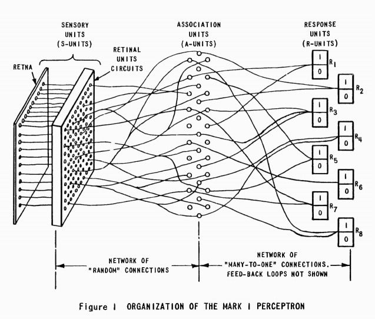
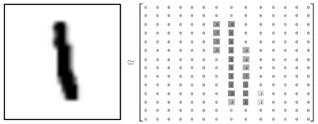
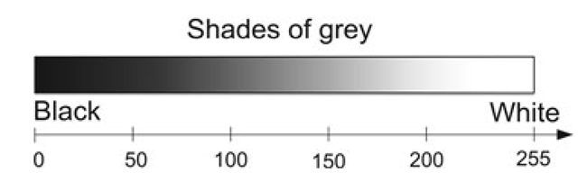
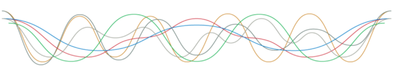
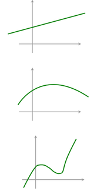
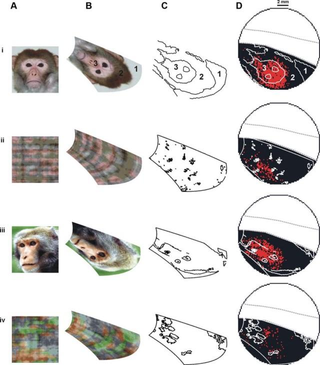
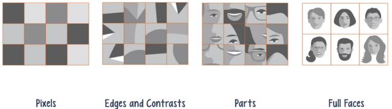
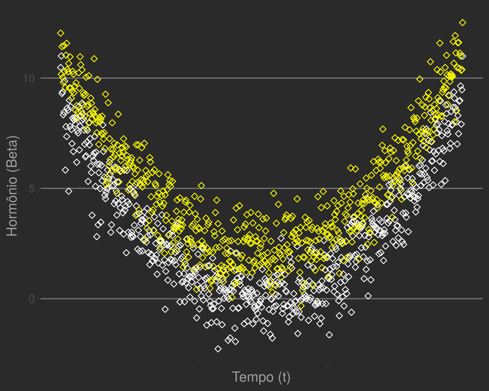
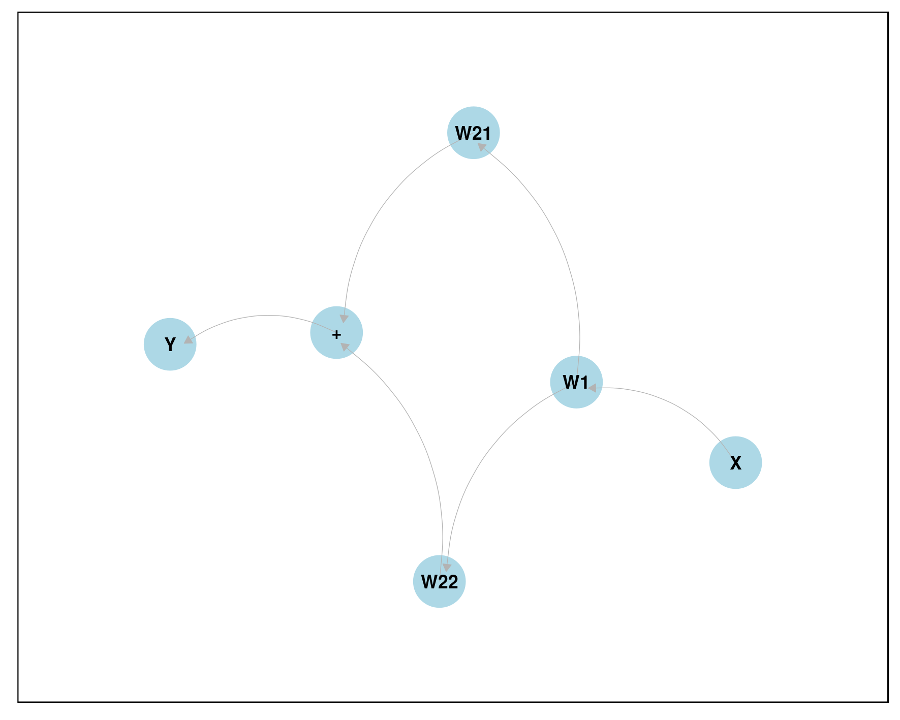
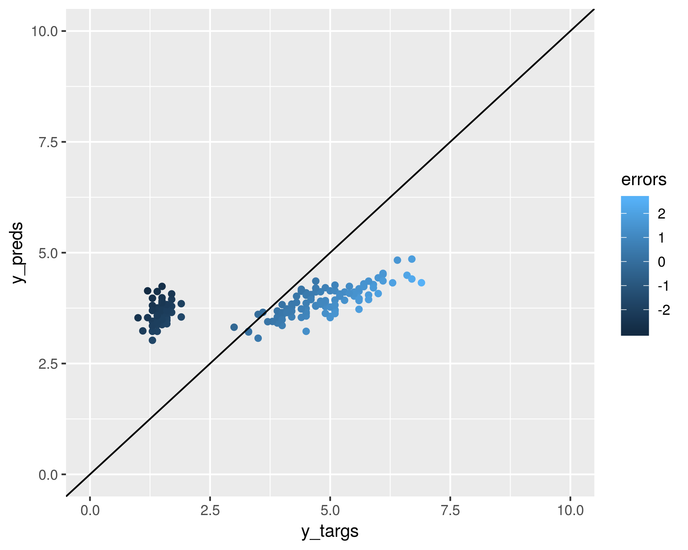

---
output:
  pdf_document: default
  html_document: default
---
  

# Capítulo 4 : Neurônios

Em março de 2016, o software AlphaGo venceu um mestre de Go. Inventado há mais de 2,500 anos, o jogo motivou avanços em matemática. Existem $2,08*10^{170}$ maneiras válidas de dispor as peças no tabuleiro. O polímata chinês Shen Kuo (1031–1095) chegou a um resultado próximo $10^{172}$ séculos atrás. Vale lembrar que o número de átomos no universo observável é de módicos $10^{80}$.  

No capítulo anterior, aprendemos formulações básicas de modelo preditivo com regressão. Aqui, conheceremos a primeira máquina inteligente da história implementando um *perceptron*. Ele é capaz de lidar com mais dimensões (e.g. processamento de imagens). Estimadores com solução fechada não existem como na regressão linear, então usamos informações locais para 'caminhar' (*gradient descent*) em direção a um mínimo.  

Estenderemos nossa caixa de ferramentas para abranger relações mais complexas, não lineares. Encadeando neurônios simples, podemos aprender sinais complexos sem apelar para funções complexas, intratáveis ou demasiadamente flexíveis.   

\pagebreak 

## O perceptron de Rosenblatt 

Frank Rosenblatt (1928 - 1971) nasceu e morreu em 11 de julho, mas esse não é o fato mais curioso da biografia deste psicólogo. Foi o responsável pelo desenvolvimento do primeiro neurônio artificial. Em suas palavras, o primeiro objeto não biológico a recriar uma organização do ambiente externo com significado.

*It can tell the difference between a cat and a dog, although it wouldn't be able to tell whether the dog was to the left or right of the cat. Right now it is of no practical use, Dr. Rosenblatt conceded, but he said that one day it might be useful to send one into outer space to take in impressions for us. - New Yorker, December, 1958*[^22]  

O aparato reproduzia o entendimento da época sobre o funcionamento de um neurônio. O corpo recebe sinais de dendritos e, após processamentos ocultos, produz um output na forma de sinal elétrico pelo axônio. A primeira matematização viria do modelo de McCulloch & Pitts ("A Logical Calculus of the Ideas Immanent in Nervous Activity", 1943).  

  

  

Em 1949, Donald Hebb descreveu em seu clássico *The Organization of Behavior* um mecanismo plausível para a aprendizagem. Comumente expressa na máxima "Cells that fire together wire together" (células que disparam juntas, conectam-se entre si).  

Com o objetivo de criar uma máquina que pudesse processar inputs diretamente do ambiente físco (e.g. luz e som), Rosenblatt concebeu uma extensão elegante do modelo em 1957 ("The Perceptron[*do latim, percipio, compreender“*] -- a perceiving and recognizing automaton. Report 85-460-1, Cornell Aeronautical Laboratory"). Composto de três partes: o sistema S (sensório); o sistema A (associação) e o sistema R (resposta).  
O neurônio "lógico" cru de McChulloch & Pitts foi modificado de maneira a processar inputs através de pesos antes da saída. A aprendizagem se dá pela modificação desses pesos. 

  

Inicialmente, o perceptron foi simulado em um IBM 704 (também berço das linguagens FORTRAN e LISP). Em seguida, implementado como um dispositivo físico, batizado de Mark I Perceptron.[^23] Um estudo mais profundo foi publicado por ele em 1962 (Principles of neurodynamics).  


[^22]: Ele consegue diferenciar um gato de um cachorro, ainda que não seja capaz de dizer se o cachorro estava à esquerda ou à direita do gato. No momento, não tem uso prático, Dr. Rosenblatt admitiu, porém disse que um dia pode ser útil para enviar um [aparato] ao espaço para capturar impressões para nós.  
[^23]: Mark I é um título comumente utilizado para a primeira versão de uma máquina.


\pagebreak 

Rosenblatt protagonizava calorosos debates sobre inteligência artificial na comunidade científica junto a Marvin Minsky, um amigo da adolescência. Em 1969, Minsky e um matemático (Seymour Papert) publicaram um livro centrado no Perceptron (Perceptrons: An Introduction to Computational Geometry). Nele, provaram que o neurônio artificial era incapaz de resolver problemas não-lineares do tipo XOR. Para um problema eXclusive OR (OU eXclusivo) o neurônio deve disparar diante do estímulo A ou do estímulo B, porém não diante de ambos.  

O impacto foi devastador sobre o otimismo vigente e se passou um período de 10 anos de baixíssima produção, conhecido como 'idade das trevas' do conexionismo. A retomada dos neurônios artificiais aconteceu somente na década de 80. Infelizmente, Rosenblatt morreu prematuramente em 1972 num acidente de barco, não presenciando o renascimento dos perceptrons.  

Sabendo das origens do modelo, é curioso que a maioria dos cursos introduzam perceptrons do ponto de vista puramente matemático, apontando a semelhança com neurônios como mera curiosidade. Pelo contrário, a inspiração em neurônios biológicos e posterior sucesso nas tarefas designadas fala em favor de um fantástico caso de sucesso via engenharia reversa.  

\pagebreak

## Criando neurônios

Mark I foi criado para reconhecimento visual, podendo ser considerado avô da visão computacional.  
Possuía um campo de entrada fotossensível de 20x20 (400) células de Sulfeto de Cádmio, as unidades S. Ao reagir com a luz, CdS emite um elétron:
$$CdS + \gamma \rightarrow e^{-} + CdS^{+}$$

Caso a célula seja ativada, envia o sinal eletrônico a uma unidade intermediária A. A unidade intermediária, por sua vez, transmite um sinal eletrônico à saída. **A intensidade do sinal é regulada por sucessos prévios** de maneira a ajustar o sinal para a classficação correta. O aparato físico mimetiza o modelo matemático do **classificador**.  

Um sinal luminioso excita cada campo de maneira diferente, ativando células de acordo com a quantidade de luz captada. Matematicamente, representamos cada neurônio sensível à luz como uma célula na matriz de entrada. 



O dígito acima ('$1$') está numa imagem com 14 x 14 pixels (196 valores entre: 1, preto; e 0, branco). Esses pixels podem ser esticados e vistos como uma matriz $X$ de dimensão $[196 x 1]$ com valores entre 0 e 1 em cada elemento.  
Vamos simular uma imagem semelhante:  

```r
    >library(magrittr)
    >set.seed(2600)
    >my.image.data <- c(0,0,0,0,0,0,0,0,0,0,0,0,0,0,
                   0,0,0,0,1,.9,.6,1,0,0,0,0,0,0,
                   0,0,0,0,1,0,1,1,0,0,0,0,0,0,
                   0,0,0,0,0.9,0,1,1,0,0,0,0,0,0,
                   0,0,0,0,0,0,1,1,0,0,0,0,0,0,
                   0,0,0,0,0,0,1,1,0,0,0,0,0,0,
                   0,0,0,0,0,0,1,1,0,0,0,0,0,0,
                   0,0,0,0,0,0,.7,1,0,0,0,0,0,0,
                   0,0,0,0,0,0,1,1,0,0,0,0,0,0,
                   0,0,0,0,0,0,1,1,0,0,0,0,0,0,
                   0,0,0,0,0,0,1,.9,0,0,0,0,0,0,
                   0,0,0,0,0,0,0,0,0,0,0,0,0,0,
                   0,0,0,0,0,0,0,0,0,0,0,0,0,0,
                   0,0,0,0,0,0,0,0,0,0,0,0,0,0) %>% 
   matrix(.,14,14,byrow=T)
    > image(t(my.image.data[14:1,]), axes = FALSE, col = grey(seq(1, 0, length = 256)))
```


Eis a nossa imagem [14x14]. O computador lê os valores entre 0 (branco) e 1 (branco), dispondo para nós o sinal visual correspondente numa paleta de cores.  Aqui usamos 256 tons cinza.   

Em regressão linear múltipla, calculamos um peso $\beta_{i}$ para cada variável. O racional é parecido: ponderamos cada pixel por seus respectivos pesos $w_{i}$. Em analogia, cada imagem é uma observação de 196 variáveis.  

## Classificação  

Na tarefa de regressão linear, o output deveria ser um número real $Y \sim \beta * X$ com $X,Y \in \mathbb{R}$, como o número médio de profissionais ou a expectativa de vida. Usaremos o perceptron para outra tarefa, a classificação, em que as possibilidades de saída são **categorias**. Isto é, o output é *discretizado*, geralmente num conjunto binário (e.g. $\{ -1,1\}$ ou $\{ 0,1\}$) que sinaliza pertencimento à classe.  
Em nossa notação, o neurônio deve disparar (output $y=1$) caso reconheça um objeto ou permanecer em repouso ($y=-1$) caso não seja.  

Algebricamente, é uma multiplicação da matrizes entre imagem $x_{j}$, de dimensão $[196 x 1]$ por uma matriz $W_{[196 X 1]}$ que traz *i* pesos (**w***eights*) estimados para cada pixel para cada classe. Essa formulação é idêntica àquela feita em regressão linear. Para uma saída discreta, forçamos o resultado para +1 ou -1 com uma função de ativação $(\phi)$. O output linear $W^{T}X$ é transformado:  

$$y = \phi(W^{T}X)$$

Assim, o produto $W^{T}X$ deve ter valor proporcional à probabilidade de ativação: se o input pertence à classe o resultado deve ser alto.  

Usaremos a função *Heaviside step*:  
$$\phi(x)= \begin{cases}
  +1 \quad se \quad x \geq 0\\
  -1 \quad se \quad x < 0
  \end{cases}$$
  


Em R:  
```r
    # Heaviside
    >phi_heavi <- function(x){ifelse(x >=0,1,-1)}
    # Iniciando pesos com base em distribuição normal
    >my_weights <- rnorm(196)
    >w <- matrix(my_weights,196,1)
    # Multiplicacao usando o operador %*%
    >as.vector(my.image.data) %*% w
    # Score
            [,1]
    [1,] -0.3794718
    # Funcao de ativacao
    >as.vector(my.image.data) %*% w %>% phi_heavi
         [,1]
    [1,]   1
```

Para o exemplo acima, nosso neurônio com pesos aleatórios foi ativado para o estímulo contendo o '$7$'.
Inicialmente, estabelecemos pesos aleatórios a partir de uma distribuição normal (`my_weights <- rnorm(...)`). 
O processo de treinar o classificador é observar as respostas muitos exemplos de imagens $x_{i}$, alterando os valores de $W$ para que os scores maiores sejam os das classes corretas. Assim, neurônio só dispara $y=1$ quando diante do estímulo adequado.  

O processo de treino é bastante simples:  
Seja $x_{i_{j}}$ o $i$-ésimo pixel da observação $j$. E $w_{0}$ o peso correspondente inicial, o peso atualizado, $w'$ é:
$$w' = w_{0} + \Delta w$$  
Em que $\Delta w$ indica o magnitude e o sentido da modicação no peso.  
Aceitemos, por enquanto, a fórmula:  
$$\Delta w_{i} = \eta (score{j} - output_{j}) x_{i}$$

Em que $x_{i_{j}}$ é o valor do $i$-ésimo pixel, $w_{i}$ é o $i$-ésimo peso e $\eta$ uma constante chamada *taxa de aprendizagem* (learning rate), que determina o tamanho dos incrementos feitos pelo algoritmo. Mostraremos a derivação dessa equação a seguir.  

\pagebreak

#### Auto MaRk I

Usando as abstrações acima, codificamos nosso perceptron em R, o Auto MaRk I.   
**Argumentos:** Exemplos ($x$, vetor de números reais) e estados esperados ($y$, disparar = 1 vs. não disparar = -1) devem ter mesmo tamanho.  
**Eta:** Número especificando constante de aprendizagem.

Auto MaRK I inicializa um peso aleatório para cada entrada e, também numa ordem aleatória, percorre os exemplos atualizando os pesos.  

```r
    >mark_i <- function(x, y, eta) {
      # inicializa pesos randomicos de distribuicao normal
      w <- rnorm(dim(x)[2]) # numero de pesos = numero de colunas em x
      ypreds <- rep(0,dim(x)[1]) # inicializa predicoes em 0
        # Processa as observacoes em x de forma aleatoria
        for (i in sample(1:length(y),replace=F)) { 
          # predicao
          ypred <- sum(w * as.numeric(x[i, ])) %>% phi_heavi 
          # update em w
          delta_w <- eta * (y[i] - ypred) * as.numeric(x[i, ]) 
          #nota: x[i,] sera multiplicado como matriz (dot product)
          w <- w + delta_w
          ypreds[i] <- ypred # salva predicao atual
        }
      print(paste("Weights: ",w))
      return(ypreds)
    }
```

Vamos testá-lo para o problema proposto, separando flores *setosa* de *versicolor*. Preparação de dados:  

```r
    >train_df <- iris[1:100, c(1, 2, 5)]    
    >train_df[, 4] <- -1
    >train_df[train_df[, 3] == "setosa", 4] <- 1    
    >names(train_df) <- c("s.len", "s.wid", "species","target")
    >head(train_df)
          s.len s.wid species target
    1   5.1   3.5  setosa      1
    2   4.9   3.0  setosa      1
    3   4.7   3.2  setosa      1
    4   4.6   3.1  setosa      1
    5   5.0   3.6  setosa      1
    6   5.4   3.9  setosa      1
    > train_df[60:65,]
       s.len s.wid    species target
    60   5.2   2.7 versicolor     -1
    61   5.0   2.0 versicolor     -1
    62   5.9   3.0 versicolor     -1
    63   6.0   2.2 versicolor     -1
    64   6.1   2.9 versicolor     -1
    65   5.6   2.9 versicolor     -1
    >x_features <- train_df[, c(1, 2)]
    >y_target <- train_df[, 4]
```
E então, podemos ativá-lo:  

```r
    >y_preds <- mark_i(x_features, y_target, 0.002)
    [1] "Weights:  -0.117938333229087" "Weights:  0.212055910242074" 
    > table(y_preds,train_df$target) # matriz de confusao
    y_preds -1  1
          -1 27  5
           1  23 45
    > y_preds
      [1]  1  1  1  1  1  1  1  1  1  1  1  1  1  1  1  1  1  1  1  1  1  1  1  1
     [25]  1  1  1  1  1  1  1  1  1  1  1  1  1  1  1  1  1 -1  1  1  1  1  1  1
     [49]  1  1 -1  1  1 -1  1 -1 -1  1  1  1 -1  1 -1  1  1  1  1  1  1  1 -1 -1
     [73]  1 -1 -1  1 -1 -1  1  1 -1  1 -1  1  1  1  1  1  1 -1  1  1 -1  1 -1  1
     [97] -1  1  1 -1
```
Usando $\eta = 0.002$, obtivemos $72 \%$ de acurácia (classificações corretas, diagonal na matriz de confusão). Podemos modificar a taxa de aprendizagem. Com $\eta = 0.05$, ficamos com $51\%$. Com $\eta = 0.1$, temos $60\%$. Uma acurácia considerável em relação ao esperado com adivinhação. Contudo, estas soluções não são estáveis e passagens repetidas geram predições muito diferentes. 

```r    
    > y_preds <- mark_i(x_features, y_target, 0.05)
      [1] "Weights:  -1.26323926081935" "Weights:  1.85983709987067"     
    > table(y_preds,train_df$target)  
    y_preds -1  1    
      -1 35 16    
      1  15 34
    
    > y_preds <- mark_i(x_features, y_target, 0.1)
      [1] "Weights:  -1.83248546552824" "Weights:  3.19075461158561"  
    > table(y_preds,train_df$target)    
    y_preds -1  1    
      -1 31 21    
      1  19 29
    
    > y_preds <- mark_i(x_features, y_target, 0.01)
    [1] "Weights:  -0.250410476080629"
    [2] "Weights:  0.447470183281492" 
    > table(y_preds,train_df$target)    
     y_preds -1  1    
    -1 25 27    
    1   25 23
```
O que há de "errado" com nosso estimador?  

Durante a exposição, a seguinte regra nos ajudou, mas não foi explicada.  
$$\Delta w_{i} = \eta (score{j} - output_{j}) x_{i}$$

Antes, verificamos (Cap. 2) uma solução fechada para o problema de regressão, em que a melhor estimativa para a inclinação da reta, $\beta$, poderia ser calculada diretamente.  
O perceptron atualiza seus pesos de maneira recursiva, aprendendo um pouco ($\Delta w_{i}$) com cada exemplo. Um novo estímulo determina quanto (magnitude em $\Delta {w}$) e em que direção ($+$ ou $-$) um peso deve mudar para diminuir erros.  


### Gradient Descent para o Perceptron

Ao otimizar estimativas, nos concentramos em encontrar máximos ou mínimos para espaços definidos. Em geral, estes são superfícies descrevendo o tamanho dos erros em função dos pesos adotados pelo modelo. O nosso objetivo é encontrar o local mais *baixo*. Para superfícies muito irregulares, aceitamos um ponto suficientemente *baixo*.  

Em regressão linear, o espaço é conhecido, é possível ir ao ponto mais baixo diretamente. Para outros modelos, isso não é tão simples.   
$\Delta w_{i}$ pode ser obtido usando o conceito de *Gradient Descent*.  
O processo é como descer uma ladeira *de olhos vendados*. Só podemos saber a inclinação local (diferença entre pé esquerdo e pé direito). Podemos descer dando passos sempre na direção do pé mais baixo.  
O que precisamos então é da inclinação da superfície relacionada aos erros em função dos pesos.  

Levando em conta cada $j$-ésima observação, primeiro definimos uma função de perda $L$ expressando a soma dos erros nos $n$ exemplos.   
$$L=\sum_{j}^{n}E(score_{j},output_{j})$$  
Usaremos para nossa função de erro a distância euclidiana entre score desejado e output. O score desejado é a resposta ótima e o output é um produto entre pesos e entrada:  
$$E = d_{eucl.}(score_{j},output_{j}) = (score_{j} - output_{j})^{2}$$

Essa função descreve a superfície em função dos erros usando uma relação quadrática: errar para cima tem o mesmo peso que errar para baixo e erros extremos são magnificados ($x^{2}$) polinomialmente.  

O processo envolve implementar uma função de erro entre resultados da rede e um espaço virtual de scores ótimos. O sucesso do treinamento depende de uma correspondência entre a função de distância escolhida e a distância real no espaço em que os dados foram gerados. Não sabemos se isso reflete a realidade. No exemplo, cada pixel reflete um sinal de 0 a 255.  
A figura abaixo mostra a correspondência entre valores da medida e escala visual.   
  

A intuição para sensibilidade à luz pode ser percebida num intervalo contínuo entre incidência total de luz (valores extremos de branco, medida: 255) e ausência total (valores extremos de preto, medida: 0). Supondo que podemos atribuir um rótulo a cada tom de cinza e que esse conjunto é ordenável pela *clareza*, dizemos que há isomorfismo de ordem entre os conjuntos. Isso implica que a distância eulidiana deve funcionar razoavelmente em nossas medidas como em números reais $\mathbb{R}$.  

\pagebreak

Resta saber se a projeção das observações é linearmente separável. É intuitivo para seres humanos saber quais problemas serão separáveis: basta imaginar a tarefa de diferenciar tipos de imagens com uma régua numa tela em preto e branco.  

*Se os dados são linearmente separáveis*, o algoritmo converge com um número suficiente de exemplos. Usando o *iris*, funcionaria para separar flores *setosa* de outra classe, mas não teriamos bons resultados separando virginica de versicolor.  

```r
    >ggplot(iris,aes(x=Sepal.Length,y=Sepal.Width,color=Species))+
    geom_point(shape=5)+ geom_abline(slope = 0.92,intercept = -1.9,color="mediumorchid1")+ 
    scale_colour_manual(values = c("yellow", "springgreen", "deepskyblue"))+
    theme_hc(style = "darkunica")
```


Para descobrir o valor mínimo de $L$, vamos encontrar polos através de derivadas parciais. Ou, seu equivalente para funções de múltiplas variáveis (espaços multidimensionais), o gradiente ($\nabla$). 

Para cada observação $x_{j}$, a derivada parcial da função de perda em relação a um peso $w_{i}$ expressa a taxa de variação no erro global em função daquele peso. 
$\frac{d}{dw_{i}}L(w_{i}) = \frac{d}{dw_{i}} \frac{1}{n}\sum_{j}{n}E(score_{j},output_{j})$ 

Sabemos então se devemos ajustar o peso para cima ou para baixo, assim com a magnitude do passo. Algebricamente, modificaremos $w$ seguindo o inverso do gradiente. A taxa de aprendizagem é um hiperparâmetro que regula artificialmente o tamanho desse passo:  
$$\Delta w_{i} = - \eta \frac{dL}{dw_{i}}$$
$$= - \eta \frac{d}{dw_{i}}\frac{1}{n}\sum_{j}^{n}E(score_{j},output_{j})$$  
Lembrando que o erro é dado pela distância euclidiana:  
$$= - \eta \frac{d}{dw_{i}}\frac{1}{n}\sum_{j}^{n}(score_{j} - output_{j})^{2}$$.  

Fazemos $f(x) = (score_{j} - output_{j})$ e $g(x) = x^{2}$, de maneira que
$$L = \frac{1}{n}\sum_{j}^{n} E(score_{j}, output_{j}) = (g \circ f)$$  
$$= \frac{1}{n}\sum_{j}^{n} (score_{j} - output_{j})^{2}$$  

Podemos resolver $\frac{d}{dw_{i}}L$ aplicando a regra de cadeia $$(g \circ f)' = (g'\circ f)f'$$ e a 'regra do tombo' para derivadas de polinômios $(\frac{d}{dx}(x^{n})=nx^{n-1})$.  

Então,
$$f' = \frac{d}{dw_{i}}(score_{j} - output_{j})$$
O output é dado pelo produto escalar entre pesos $w_{j}$ e entradas $x_{j}$:  
$$f'=\frac{d}{dw_{i}}(score_{j} - w_{j} \cdot x_{j})$$
O score desejado não depende dos pesos, portanto a primeira derivativa é 0.  
$$f' = 0 - \frac{d}{dw_{i}} w_{j} \cdot x_{j}$$
$$=-\frac{d}{dw_{i}}\sum_{i,j}^{n} w_{i,j}*x_{i,j}$$
$$= =-\frac{d}{dw_{i}}(w_{0}*x_{0}+...+w_{i}*x_{i}+w_{n}*x_{n})$$  
Os termos não dependentes de $w_{i}$ também são zerados e ficamos com o primeiro termo da soma:  
$$f'=- \frac{d}{dw_{i}} w_{i}x_{i}$$  
A função a ser derivada agora descreve uma relação linear (polinômio de grau 1) em $w_{i}$ e temos:
$$f'= (-x_{i,j})$$

Sabendo $f'$, buscamos o outro termo em $(g \circ f)'$:
$$(g \circ f) = (score_{j} - output_{j})^{2-1}$$
$$(g'\circ f) = 2(score_{j} - output_{j})^{2-1}$$

$$= 2(score_{j} - output_{j})$$

Por fim, a derivada parcial da função de perda para o i-ésimo peso $w_{i}$ é:

$$\frac{dL}{dw_{i}} = \sum_{j}^{n}\frac{d}{dw_{i}}(score_{j} - output_{j})^{2}$$.  
$$= \sum_{i,j}^{n} 2(score_{j} - w_{j} \cdot x_{j}) (-x_{i,j})$$

Para simplificar a expressão e estabelecer o tamanho dos incrementos sobre o pesos, escalamos por uma constante, dada por $-\frac{1}{2} \eta_{0}$:  
$$-\frac{1}{2}*\eta_{0} \frac{dL}{dw_{i}}=-\frac{1}{2}\eta_{0}*2(score_{j} - output_{j}) (-x_{j})$$
$$\Delta w_{i} = \eta_{0} \sum_{j}^{n} (score_{j} - w \cdot x)(x_{j})$$
E $\eta_{0}$ é um [hiper]parâmetro que simplifica a equação e define o tamanho dos incrementos usados.  


Como implementamos antes no Auto MaRK I.  
```r
    (...)
    ypred <- sum(w * as.numeric(x[i, ])) %>% phi_heavi 
    delta_w <- eta * (y[i] - ypred) * as.numeric(x[i, ]) #<--------------------
    w <- w + delta_w
    (...)
```

Chamamos $\eta$ de hiperparâmetro. A escolha de valores para hiperparâmetros é um dos desafios em aprendizagem estatística. Repetindo a aprendizagem com *iris*, vamos testar: 

```r
    > y_preds <- mark_i(x_features, y_target, 0.01)
    [1] "Weights:  -0.0153861618736636" "Weights:  0.0812191914731158"
    > table(y_preds,train_df$target)
      y_preds -1  1
          -1 25 27
          1  25 23    
    >  y_preds <- mark_i(x_features, y_target, 0.01)
    [1] "Weights:  -0.685141728446126" "Weights:  1.03174770234754"  
    > table(y_preds,train_df$target)
      y_preds -1  1
           -1 47 10
           1   3 40
    > y_preds <- mark_i(x_features, y_target, 0.01)
    [1] "Weights:  -0.193515893657872" "Weights:  0.180589056542887" 
    > table(y_preds,train_df$target)
      y_preds -1  1
           -1 19 37
           1  31 13
    > y_preds <- mark_i(x_features, y_target, 0.01)
    [1] "Weights:  -0.0672147799277951" "Weights:  0.115145797950982"  
    > table(y_preds,train_df$target)
      y_preds -1  1
           -1 45 12
           1   5 38
```

Usando $\eta = 0.01$, temos $48\%$. Entretanto, rodar repetidas vezes retorna classificações muito boas ($\text{Acc.} > 0.8$) ou muito ruins. O que se passa?  

Em geral, passos grandes impossibilitam ajustes finos e podem não convergir, assim como é impossível para um animal grande explorar um vale estreito.  
Taxas pequenas levam mais tempo ($n$ de observações) para atingir um mínimo. Se o espaço for irregular, também existem mais chances de se atingir um mínimo secundário ao invés do fundo do espaço. Assim como um animal pequeno percorre o caminho mais lentamente e pode ter a ilusão de que atingiu mínimos rapidamente.  

Uma maneira trivial é testar muitos valores possíveis e observar o desempenho, entretanto isso não é exequível para grandes volumes de dados e/ou muitos parâmetros. Existem diversos processos heurísticos e algoritmos para encontrar valores ótimos. Podemos também ajustar parâmetros ao longo do processo de aprendizagem ou testar pontos diferentes de partida.

Uma forma popular para otimizar o treinamento é particionar o dataset em pedaços e apresentar os particionamentos (epochs) repetidas vezes ao classificador ou acumular os erros de epochs ao invés de exemplos individuais. Assim, calculamos erros agregados e evitamos mínimos locais. 
Para evitar muitas alterações e andar em círculos, avançamos por mais tempo em apenas uma direção antes de recalcular a rota. Epochs podem ser recombinados e/ou reapresentados, aumentando artificialmente o $n$ para calcular gradientes.  

## Deep learning



**Intuições**

Com o aprendizado através de exemplos, otimizamos nosso classificador (mudando pesos $W$) para minimizar a perda gradualmente. Uma das condições para o *perceptron* acima funcionar foi a separabilidade linear das classes no espaço examinado.  
Aguns problemas são mais difíceis, sendo separados por curvas. Outros são ainda mais difíceis, exigindo muitas transformações e funções específicas. Uma alternativa é usar polinômios de ordem maior. 
Ao invés de $Y \sim \beta_{0} + \beta_{1}X$, podemos introduzir termos com expoentes maiores em $X$: $$Y \sim \beta_{0} + \beta_{1}X + \beta_{2}X^{2} + \beta_{3}X^{3} + ...$$
A inclusão flexibiliza a função, que pode se adequar melhor aos dados.  
Na regressão linear, ajustamos o ângulo e a altura de uma barra fixa para reduzir a distância até os pontos. Com termos quadráticos, é possível dobrar essa barra em relação ao centro, mas as pontas devem ir numa mesma direção. Com termos cúbicos, isso é flexibilizado.   



A introdução de termos polinomiais de ordem maior torna consideravelmente mais difícil a otimização das estimativas.  

Um neurônio *linearmente sensível* a input e dotado de uma barreira (*threhold*) para disparos é capaz de resolver problemas de classificação mais simples. Para problemas mais difíceis, ao invés de implementar células de processamento radicalmente diferentes e/ou mais complexas, a natureza usa um artifício engenhoso. Neurônios comuns são encadedados: cálculos simples e comunicação local das unidades possibilita a aprendizagem.  

Os dados são apresentados aos perceptrons na linha de frente. O output das primeiras células é usado como input para neurônios da próxima camada.  
Assim, conseguimos implementar transformações adequadas (rotações, torções, escalonamentos, dobras) em sequência, de maneira que abstrações complexas possam ser capturadas.  

### Going Deep

As versões reais da maioria dos conceitos criados por seres humanos não são idênticas umas às outras. Em outras palavras, não existe um conjunto rígido de regras para classificarmos a maior parte das entidades ao nosso redor.
Muitas entidades são diferentes, porém similares o suficiente para pertencer a uma mesma categoria.

  

Todos são naturalmente reconhecidos como felinos, mas apresentam variações de tamanho, cor e proporção em todo o corpo. Esse é um problema interessante e antigo, mais conhecido na ideia de entes platônicos, os quais capturam a essência de um conceito.  
Alguns filósofos contemporâneos tomam as abstrações humanas como instâncias de um conceito mais genérico: mapas biológicos contidos em redes neuronais. Uma brilhante exposição é feita por Paul Churchland em *Plato’s Camera*.  
Esses mapas estão associados de forma hierarquizada. Numerosos padrões em níveis inferiores e menos deles em camadas superiores.  
No caso da visão, neurônios superficiais captam pontos luminosos. O padrão de ativação sensorial captado na retira e enviado ao córtex visual primário é o primeiro mapa, que é torcido e filtrado caminho cima.  
Em níveis superiores, sinais individuais de cones sensíveis faixas de energia compõem a paleta de cores que percebemos.  

  

Neurônios intermediários possuem configurações que identificam características simples: olhos e subcomponentes da face. Por fim, temos camadas mais profundas, ligadas a abstrações complexas e funções superiores (e.g. linguagem).



### Deduzindo superfícies

Um classificador deve capturar essa estrutura abstrata a partir de modelos matemáticos tratáveis. Para examinarmos esse aspecto, usemos um exemplo. O gráfico abaixo representa milhares de amostras com: (1) a curva diária natural de testosterona (branco) e a curvas para medidas sob uso de esteroides anabolizantes (amarelo).

```r
    >normal <- (purrr::map(seq(-3,3,0.01), .f =function(x) x^2) %>% 
    as.numeric)+ rnorm(601)
    >over <-  (purrr::map(seq(-3,3,0.01), .f =function(x) x^2+2) %>% 
    as.numeric)+ rnorm(601)
    >horm_df <- data.frame(norm = normal, ov = over,time=1:601)
    >ggplot(data=horm_df,aes(y=norm,x=time))+
    >  geom_point(color="white",shape=5)+
    >  geom_point(data=horm_df,aes(y=over,x=time),color="yellow",shape=5)+
    >  ylab("Hormônio (Beta)")+xlab("Tempo (t)")+
    >  scale_x_continuous(labels=NULL)+
    >  theme_hc(style="darkunica")
```




Como hipotéticos membros de uma comitê atlético, nosso objetivo aqui é, dada uma amostra, saber se o atleta está sob efeito de esteroides.  
Quando experimentamos, normalmente haverá ruídos (erros) na medida e receberemos medições imprecisas da curva. Variações na dieta daquele dia, micções, sudorese, stress e outros fatores. Sabemos que a testosterona flutua diariamente seguindo uma curva.

Para cada medida, temos o tempo ($t$, eixo horizontal) e o nível hormonal ($\beta$, eixo vertical). 


Um modelo bastante popular para classificações é o de regressão logística. Nele, estimamos probabilidade para um evento com base nas probabilidades de uma função sigmoide. Temos uma probabilidade (valor entre 0 e 1) definida por:
$$P(h,\beta) = \frac{1}{1+e^{-(i + t * h + \beta * y + \epsilon )}}$$
$\epsilon$ representa o erro e i é uma constante. 

A equação parece estranha, mas aparece quando buscamos calcular probabilidades a partir de uma combinação linear dos nossos parâmetros:
$$P(x) \sim i+t*x+\beta_{i}*y+\epsilon$$  
Isso permite que o processo de estimação seja quase idêntico ao da regressão linear, que é facilmente tratável.  

Em uma linha de R:

```r
    >class_df <- class_df <- data.frame(measures=c(horm_df$norm,horm_df$ov),
    time=c(horm_df$time,horm_df$time),
    target=c(rep(0,601),rep(1,601)))
    >logist.fit <- glm(target ~ measures + time, family=binomial,data=class_df)
```

Outra consequência é de que uma relação linear torna magnitude e o sentido dessas relações interpretáveis. Por exemplo, um parâmetro positivo (e.g. $\beta=0.241$) indica que aumentos em $X$ aumentam a probabilidade de ativação e parâmetros negativos (e.g. $\beta = -0.9517$) têm efeito contrário.  
Muitas avaliações de risco em saúde ou avaliação de crédito em finanças estimam probabilidades com base nos parâmetros de uma regressão logística.  

Usamos um limite de decisão (*decision boundary*) dependente de relações lineares. Tecnicamente, um hiperplano. Um hiperplano divide o espaço em duas partes. É a generalização de plano (curvatura zero) para quaisquer dimensões. O hiperplano é um espaço de $n-1$ em um espaço $n$ dimensões. A reta é um hiperplano em duas dimensões (nosso caso), o plano tradicional é um hiperplano em 3 dimensões. Para dimensões mais altas, a visualização é menos simples.  

Para nosso exemplo não-linear, seria difícil capturar as diferenças entre atletas dopados usando apenas esta equação.  


Acima, um neurônio sigmoide, que equivale à regressão logística. É como o plano anterior, mas visto de cima, dividimos ele em duas regiões para classficação. Por que? O classificador linear otimiza suas respostas levando em conta apenas o valor absoluto da medida hormonal. Isto é, valores acima de um limite serão considerados dopping, não considerando horário.  

O coeficiente para o tempo estimado foi tende a ser próximo de 0. Ao tentar dividir os grupos com uma régua, o melhor é tentar uma reta paralela ao eixo $x$.  
Podemos verificar isso diretamente através dos parâmetros estimados em nosso modelo de regressão.  
Mudar isso tornaria a reta divisória inclinada em relação ao eixo x, piorando a classificação para valores baixos ou altos.  

```r
    > summary(logist.fit)
         Call:
     glm(formula = target ~ measures + time, family = binomial, data = class_df)     
     Deviance Residuals: 
          Min        1Q    Median        3Q       Max  
     -1.93641  -1.02791  -0.07236   1.12396   1.63490       

     Coefficients:
                   Estimate Std. Error z value Pr(>|z|)    
     (Intercept) -9.439e-01  1.504e-01  -6.276 3.48e-10 ***
     measures     2.411e-01  2.186e-02  11.027  < 2e-16 ***
     time        -2.597e-05  3.621e-04  -0.072    0.943    
     ---
     Signif. codes:  0 ‘***’ 0.001 ‘**’ 0.01 ‘*’ 0.05 ‘.’ 0.1 ‘ ’ 1     

     (Dispersion parameter for binomial family taken to be 1)     

         Null deviance: 1666.3  on 1201  degrees of freedom
     Residual deviance: 1526.0  on 1199  degrees of freedom
     AIC: 1532     

     Number of Fisher Scoring iterations: 4
    > prob <- predict(logist.fit,type=c("response"))
    > class_df$prob <- prob
    > curve <- roc(target ~ prob, data = class_df)
    > curve
     Call:
     roc.formula(formula = target ~ prob, data = class_df)     

     Data: prob in 601 controls (target 0) < 601 cases (target 1).
     Area under the curve: 0.6964
```
### Quem poderá nos ajudar?

Voltamos às redes neurais para resolver o problema. Quando processamos o sinal em etapas, cada camada modifica os dados para as camadas posteriores, transformando e filtrando/dando forma.  

As camadas intermediárias permitem a transformação gradual do sinal, e o sistema acerta usando apenas dois classificadores simples (sigmoides). No exemplo acima, temos uma camada de 2 neurônios entre o input e o output.  


Agora, a primeira camada (hidden) modifica a entrada com duas unidades sigmoides e a segunda camada pode classificar corretamente usando apenas uma reta, algo que era impossível antes.  
Em tese, esse modelo pode capturar melhor as características que geraram os dados (flutuação hormonal ao longo do dia).  

### Neurônios

Notem que o diagrama acima lembra uma rede neural. Esse tipo de classificador foi inspirado na organização microscópica de neurônios reais e acredita-se que seu funcionamento seja de alguma forma análogo. A arquitetura de redes convolucionais (convolutional neural networks), estado da arte em reconhecimento de imagens, foi inspirada no córtex visual de mamíferos[^25] .
Outros modelos bio inspirados (Spiking neural networks, LTSMs…) apresentam desempenhos inéditos para tarefas complexas e pouco estruturadas, como reconhecimento de voz e tradução de textos.
A teoria mais aceita é de que o maquinário neural dos animais foi desenhado por processos evolutivos, como a seleção natural. Assim, apresenta coloridas formas de complexidade a depender da tarefa desempenhada.

[^25]: (https://www.ncbi.nlm.nih.gov/pmc/articles/PMC1557912/)  


Como podemos ver, as redes biológicas são complexas, com até dezenas de bilhões de unidades de processamento paralelas conectadas. Zona destacada possui grafo isomorfo ao descrito no texto. 

Nos modelos profundos (deep) de reconhecimento de rosto, neurônios de camadas superficiais capturam bordas, ângulos e vértices, camadas intermediárias detectam presença de olhos, boca, nariz. Por fim, camadas ao final da arquitetura decidem se é um rosto ou não e a quem ele pertence.

#### Eficiência e aplicações

Podemos demonstrar formalmente que uma rede neural com apenas uma camada interna é capaz de aproximar qualquer função. A prova não é lá essas coisas, já que, no fundo o que fazemos é criar uma tabela de consulta (lookup table) para os valores de entrada e saída usando os neurônios.
Na prática, é difícil obter boas performances. Tão difícil que as redes neurais também passaram décadas esquecidas. Se você rodar o modelo abaixo, baseado no nosso exemplo, verá que a acurácia é próxima da regressão logística. É necessário algum conhecimento e tempo para afinar os detalhes.  
Normalmente, depende da qualidade e da quantidade dos dados. O boom veio com a descoberta de topologias de rede específicamente boas para certas tarefas (e.g. LSTM para linguagem natural, *Conv Nets* para visão computacional).  
Em outras palavras, modelar uma rede neural para problemas inéditos pode ser algo desafiador.  

O código a seguir mostra como implementar uma rede com topologia similar usando a lib **caret**. Conseguimos acurácia de 81% usando 5 neurônios.  

```r
    # Neural Net para o exemplo
    >library(caret)
    > class_df$time_sc <- scale(class_df$time)
    > nn_horm <- caret::train(x = class_df[,c(1,5)], y=factor(class_df$target),method="mlp")
    Multi-Layer Perceptron     

    1202 samples
       2 predictors
       2 classes: '0', '1'     

    No pre-processing
    Resampling: Bootstrapped (25 reps) 
    Summary of sample sizes: 1202, 1202, 1202, 1202, 1202, 1202, ... 
    Resampling results across tuning parameters:    

      size  Accuracy   Kappa    
      1     0.6488305  0.2948640
      3     0.8181583  0.6355261
      5     0.8198874  0.6393824    

    Accuracy was used to select the optimal model using the largest value.
    The final value used for the model was size = 5.
```
As redes neurais passaram algum tempo esquecidas, até que algumas reviravoltas [^26]  permitiram o treinamento eficaz dessas redes. Algoritmos para melhorar o treinamento, assim como arquiteturas econômicas ou especialmente boas em determinadas tarefas.
Além disso, o uso de processadores gráficos (GPU), desenhados para as operações de álgebra linear que discutimos (com matrizes) permitiu treinar em um volume maior de dados.

[^26]: (http://people.idsia.ch/~juergen/who-invented-backpropagation.html)


### Backpropagation

Backpropagation é um processo chave em para permitir o treinamento de classficadores em deep learning. É o conceito de propagar gradientes da função de perda ao longo da rede de maneira a atualizar cada nodo. Historicamente, surgiu nos estudos sobre teoria do controle.  

Como vimos, podemos encarar a rede neural como uma sequência de funções plugadas. Algebricamente, se o primeiro nodo é $q(x,y)$, o neurônio $f$ que recebe sua saída como input tem valor $f(q(x,y))$ ou $f \circ q$.

**Exemplo**  
Neurônio de input: $q(x,y) = 3x+2y$    
Segundo neurônio: $f(z) = z^{2}$  
Output final: $f(q(x,y)) = q^{2} = (3x+2y)^{2}$  

À primeira vista funções complexas vão possuir gradientes difíceis de calcular. Além disso, temos que calcular valores para cada neurônio em camadas diferentes. *Backpropagation* usa a *regra de cadeia* para calcular as derivadas por camada. Encadeando sequências de funções elementares com derivada conhecida, podemos atingir mapeamentos complexos e ainda assim calcular o gradiente sem muito esforço.  

Podemos obter o gradiente da função de perda no nodo de hierarquia mais alta $(f)$, com respeito a uma das variáveis de entrada $(x)$ na hierarquia mais baixa. A operação é computacionalmente barata, bastando multiplicar as derivadas parciais dos erros em cada parte.

$$\frac{df}{dx}=\frac{df}{dq}\frac{dq}{dx}$$

É possível calcular de forma recursiva, portanto local e paralela, ao longo das camadas. Fazendo o mesmo acima para $df/dy$, teremos os valores de $df/dx$ e $df/dy$ que é precisamente nosso gradiente em $f$.

```r
    # Valor duplo (x,y) para inputs
    >x <- 1
    >y <- 3
    q <- 3*x + 2*y # primeira camada
    f <- q^2 # segunda camada
    # Backprop - Mudanças em hierarquia superior
    # dadas por entradas de camadas inferires
    dfdq <- 2*q # derivada de x^2 ; variação de f em função de q
    dqdx <- 3 # Derivada de 3x ; variação de q em função de x
    dqdy <- 2 # Derivada de 2x ; variação de q em função de y
    # Obter gradiente de f(x,y) multiplicando as parciais
    dfdx = dfdq*dqdx
    dfdy = dfdq*dqdy
    grad = c(dfdx,dfdy)
    > grad
    [1] 24 16
```

Usando essa lógica, calculamos os gradientes para a função de erro e treinamos o modelo.

Podemos então implementar nossa rede neural, Mark II.  

#### Mark II

Nossa rede terá um perceptron de entrada com dimensão igual à do input. Entretanto, acrescentamos um peso a mais, que corresponderá a um intercepto. 

Note que 
$$y = w_{0} + w_{1}x_{1} + w_{2}x_{2}$$
é o mesmo que 
$$y = 1*w_{0} + w_{1}x_{1} + w_{2}x_{2}$$

Assim, adicionamos um peso $w_{0}$ e também forçamos uma dimensão a mais no input, que sempre terá valor $1$. Chamamos esse artifício de adicionar um intercepto (*bias*) de *bias trick*. Ajuda a estabelecer um valor basal para o output, facilitando a convergência.   

```r
library(magrittr)
library(ggplot2)
set.seed(2600)

mark_ii <- function(x, y, eta, reps=1) {
  
  # inicializa pesos randomicos de distribuicao normal
  w1 <- rnorm(n = (dim(x)[2]+1)) %>% as.matrix # numero de pesos = numero de colunas em x + bias
```

Em seguida, neurônios da camada intermediária, dois, cada um com dois pesos.  
```r
  w21 <- rnorm(2) %>% as.matrix 
  w22 <- rnorm(2) %>% as.matrix 
```
Zeramos as predições e iniciamos os loops de treinamento. Para a rede neural, precisamos de muitos exemplos de exposição, então embutimos em Mark II um parâmetro (reps) responsável por repetir o processo de treinamento com o dataset.  
A rigor o melhor seria particionar o dataset em fragmentos menores para cada epoch, mas vamos manter as coisas simples.  

```r
  ypreds <- rep(0,dim(x)[1]) # inicializa predicoes em 0
  yerrors <- rep(0,dim(x)[1]) # inicializa predicoes em 0
  for (j in 1:reps){
    print(paste("This is training epoch:",j))
    print(paste("Current weights:",w1,w21,w21))
```

Predições: a primeira camada soma o produto de seus pesos pela entrada e pela unidade (*bias trick*). Os neurônios da segunda camada somam o produto de seus pesos pelo output. O output final é a soma dos outputs na camada intermediária.  
```r
    # Processa as observacoes em x de forma aleatoria
    for (i in sample(1:length(y),replace=F)) { 
      # predicao
      ypred1 <- sum(w1 %*% c(as.numeric(x[i, ]),1))  
      
      ypred21 <- sum(w21 %*% as.numeric(ypred1))
      ypred22 <- sum(w22 %*% as.numeric(ypred1))
      
      out <- sum(ypred21,ypred22)
```


Agora, as regras de atualização dos pesos seguindo derivações com regra de cadeia. Para os neurônios intermediários, temos:
$\frac{d}{dw_{21}}$ e $\frac{d}{dw_{21}}$ de $(target - (pred22 + pred21))^{2}$.  

$$\frac{d}{dw_{21}}(target - (pred22 + pred21))^{2}$$
Aplicando a regra de cadeia e sabendo que a predição do segundo neurônio $W_{22}$não depende dos pesos em $W_{21}$: 

$$=2(target - (pred22 + pred21))*\frac{d}{dw_{21}}(-1)(pred22 + pred21)$$
$$=2(target - (pred22 + pred21))*\frac{d}{dw_{21}}(-1)(w_{21}*ypred1)$$

Que é a derivada para os pesos do perceptron:    
$$=2(target - (pred22 + pred21))*(ypred1)(-1)$$

Entretanto, calcular os pesos de $w_{1}$ em função da saída requer um pouco mais:  
$$\frac{d}{dw_{1}}(target - (pred22 + pred21))^{2}$$
$$=2(target - (pred22 + pred21))*\frac{d}{dw_{1}}(-1)(pred22 + pred21)$$

$$=2(target - (pred22 + pred21))*\frac{d}{dw_{1}}(-1)(\sum w_{22}\sum w_{1}x + \sum w_{21}\sum w_{1}x )$$

Usando a derivada de somas e verificando que os termos não relacionados ao $w_{1}$ avaliado somem:  

$$2(target - (pred22 + pred21))*(-1)(\sum w_{22} x + \sum w_{21}x)$$

```r
      # update em w . Eta ja ajustado para 1/2*eta
      delta_w22 <- eta * (-1) * (y[i] - (ypred21 + ypred22)) * ypred1
      delta_w21 <- eta * (-1) * (y[i] - (ypred21 + ypred22)) * ypred1 
      delta_w1 <- eta * (y[i] - (ypred21 + ypred22)) * -1 * 
        (sum(w21 %*% c(as.numeric(x[i,]),1)) + sum(w22 %*% c(as.numeric(x[i,]),1)))
        
      w1 <- w1 - delta_w1
      w21 <- w21 - delta_w21
      w22 <- w22 - delta_w22
      ypreds[i] <- out # salva predicao21 atual
      yerrors[i] <- ypreds[i] - y[i]
    }
        print(paste("Mean squared error:", mean((yerrors)^2)))
  }
  return(ypreds)
}
```

Então, podemos testá-lo em um dataset.  

```r
    >train_df <- iris[, c(1, 2, 3)]   
    >names(train_df) <- c("s.len", "s.wid", "p.len")
    >head(train_df)
    >train_df[60:65,]    

    >x_features <- train_df[, c(1, 2)]
    >y_target <- train_df[, 3]    

    # Convergencia boa
    >mark_ii_preds <- mark_ii(x = x_features,y = y_target,
                             eta=0.000001,reps = 40)
    [1] "This is training epoch: 1"
    [1] "Current weights: -0.45050790019773 -0.0197893400687895 -0.0197893400687895"
    [2] "Current weights: 0.150011803623929 2.13458518518008 2.13458518518008"      
    [3] "Current weights: 1.48235899015804 -0.0197893400687895 -0.0197893400687895" 
    [1] "Mean squared error: 1133.22204821886"
    (...)
    [1] "This is training epoch: 2"
    [1] "Current weights: -0.67126807499406 -0.0609395311239563 -0.0609395311239563"
    [2] "Current weights: -0.0707483711724013 2.09343499412492 2.09343499412492"    
    [3] "Current weights: 1.26159881536171 -0.0609395311239563 -0.0609395311239563" 
    [1] "Mean squared error: 176.747586724131"
    (...)
    [1] "This is training epoch: 4"
    [1] "Current weights: -0.791488817323548 -0.0700721883119202 -0.0700721883119202"
    [2] "Current weights: -0.19096911350189 2.08430233693696 2.08430233693696"       
    [3] "Current weights: 1.14137807303222 -0.0700721883119202 -0.0700721883119202"  
    [1] "Mean squared error: 7.32496712284895"
    [1] "This is training epoch: 5"
    [1] "Current weights: -0.805708526415977 -0.0705118739404967 -0.0705118739404967"
    [2] "Current weights: -0.205188822594319 2.08386265130838 2.08386265130838"      
    [3] "Current weights: 1.12715836393979 -0.0705118739404967 -0.0705118739404967"
    [1] "Mean squared error: 3.31246116798174"
    (...)
    [1] "Mean squared error: 2.50706426321967"
    (...)
    [1] "Mean squared error: 2.50638029884829"
    (...)
    [1] "Mean squared error: 2.50640582517322"
```
Podemos observar o modelo convergindo à medida em que os pesos se estabilizam e nossa medida de erro cai. Usando o $\eta$ acima, a rede costuma convergir com correlação $\rho \sim 0.60$ entre predições e dados originais.  

```r
    >acc_data <- data.frame(y_preds=mark_ii_preds,
                           y_targs=y_target)    

    >acc_data$errors <- y_target - mark_ii_preds 
    >cor.test(acc_data$y_preds,acc_data$y_targs)    
    
    	Pearson's product-moment correlation    

    data:  acc_data$y_preds and acc_data$y_targs
    t = 8.9717, df = 148, p-value = 1.203e-15
    alternative hypothesis: true correlation is not equal to 0
    95 percent confidence interval:
     0.4788098 0.6883163
    sample estimates:
          cor 
    0.5935271 

    >ggplot(acc_data,aes(y=y_preds,x=y_targs,color=errors))+
      geom_point()+xlim(0,10)+ylim(0,10)+
      geom_abline(slope = 1,intercept = 0)
```


De maneira prática, não precisamos calcular os gradientes ou a topologia da rede (número de  neurônios, camadas e como estão conectados). Bibliotecas voltadas à aprendizagem de máquina automatizam partes do processo, oferecendo rápida usabilidade para muitos classificadores eficientes. Usando a lib `caret`:  

```r
    > library(caret)
    # https://topepo.github.io/caret/train-models-by-tag.html
    > train(x=x_features,y = y_target,method = "mlpWeightDecay")
        Multi-Layer Perceptron     

    150 samples
      2 predictors   

    No pre-processing
    Resampling: Bootstrapped (25 reps) 
    Summary of sample sizes: 150, 150, 150, 150, 150, 150, ... 
    Resampling results across tuning parameters:   

      size  decay  RMSE      Rsquared   MAE      
      1     0e+00  1.830946  0.3132915  1.5795672
      1     1e-04  1.831956  0.4041400  1.5641681
      1     1e-01  2.203828  0.5889224  1.9507964
      3     0e+00  1.035326  0.6731265  0.8242900
      3     1e-04  1.129702  0.6322950  0.8921468
      3     1e-01  2.230236  0.6531256  1.9114274
      5     0e+00  1.094755  0.6558700  0.8567348
      5     1e-04  1.121093  0.6523228  0.9007250
      5     1e-01  2.143342  0.6639255  1.7652741    

    RMSE was used to select the optimal model using the
     smallest value.
    The final values used for the model were size = 3 and decay = 0.
```
Temos $R^2 \sim 0.673$ com 3 unidades escondidas. Outras arquiteturas (e.g. defina `method = "brnn"`) incluem nodos com funções de ativação diferente, assim como variações para o funcionamento de outros pontos. 

#### Referências

Para uma história completa sobre redes neurais: J. Schmidhuber. Deep Learning in Neural Networks: An Overview. Neural Networks, 61, p 85–117, 2015. (Based on 2014 TR with 88 pages and 888 references, with PDF & LATEX source & complete public BIBTEX file).

http://web.csulb.edu/~cwallis/artificialn/History.htm
https://sebastianraschka.com/Articles/2015_singlelayer_neurons.html
https://rpubs.com/FaiHas/197581

\pagebreak

### Exercícios

1. Uma câmera é posicionada no teto e precisamos criar um algoritmo que determine se a bolinha está do lado esquerdo ou direito. Um perceptron como o apresentado seria capaz de aprender corretamente como indicar posse de bola?  

2. Em neurônios biológicos, modelamos a ativação em função da voltagem na membrana neuronal. Quais modelos de função de ativação existem? Consulte softwares livres avançados para simulação de redes em Neural Ensemble ( https://neuralensemble.org/projects/ )  

3. Reformule o algoritmo de aprendizagem (loop `for`) para que a taxa de aprendizagem $\eta$ seja reduzida para $\frac{\eta}{10}$ nos últimos exemplos.  

4. Implemente Mark I adaptado para aprender com epochs e teste com gradiente $\eta$ pequeno.  

5. Explore outras arquiteturas de rede neural usando *caret*.  

\pagebreak

