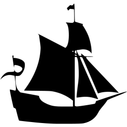
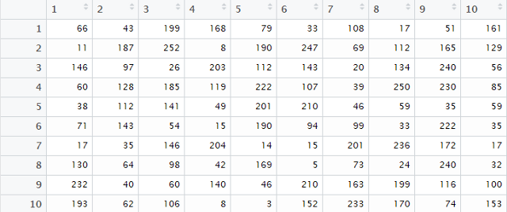
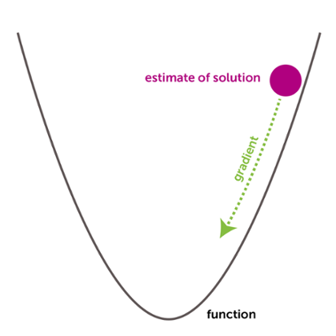
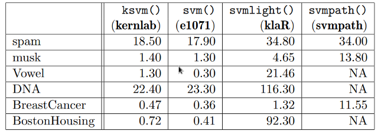
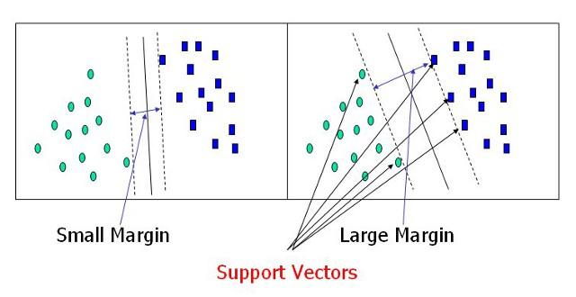
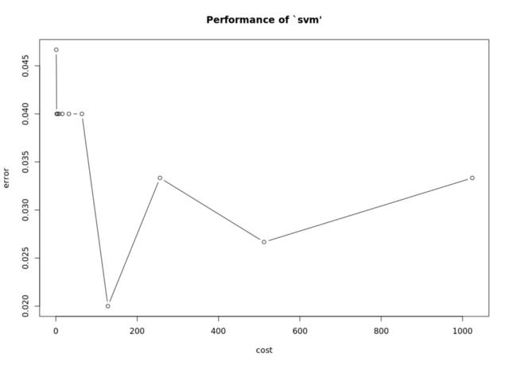
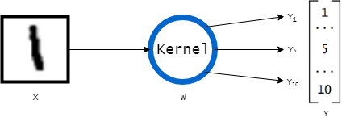
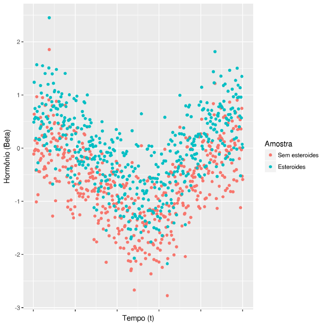

# DRAFT de Capítulo 4 - textos base retirados do blog
[^30]

Em 28 de Abril de 2016, o então CEO da Google (Sundar Pichai) publicou na carta (https://blog.google/inside-google/alphabet/this-years-founders-letter/) anual dos fundadores sua visão de futuro, compartilhando com acionistas e com o público os objetivos da companhia. O termo ‘machine learning’ foi usado 8 vezes, inclusive como responsável pelas principais inovações recentes, como Google Maps e Google Photos.  


“(…) our long-term investment in machine learning and AI. (…) It’s what has allowed us to build products that get better over time, making them increasingly useful and helpful.” Sundar Pichai, CEO,Google, 2016


Em março do mesmo ano, o Google DeepMind AlphaGo tornou-se o primeiro programa de computador a vencer um mestre de Go. O feito é difícil por tratar-se de um jogo quase impossível de ser totalmente computado. Existem $2,08*10^{170}$ maneiras válidas de dispor as peças no tabuleiro. Vale lembrar que o número de átomos no universo observável é de módicos $10^{80}$.

Inteligência artificial possui aplicações crescentes nas áreas de finanças, saúde, indústria, aviação e segurança. 

## Classificadores lineares

Um tipos mais simples de classificador é o linear.

Imaginemos que a imagem tenha 10 pixels de altura e 10 de largura.
Para simplificação, supomos que a foto acima possua 10 x 10 pixels em preto e branco (100 pixels com valores entre 0,preto, e 255, branco). Esses pixels podem ser esticados e vistos como uma matriz x de dimensão [100 x 1] com valores entre 0 e 255 em cada elemento.
Podemos simular uma imagem deste tamanho gerando uma matriz de dimensão 10x10 com 100 valores naturais aleatórios (entre 0 e 255) no R :

```r
#Garante que os valores no exemplo serao iguais aos seus, enviesando o gerador de dados aleatorios
set.seed(2600)
#Cria dados com 100 valores inteiros no intervalo [0,255] com reposicao
my.image.data <- sample(0:255,100,replace=T)
#Le como uma matrix [10x10]
x <- matrix(my.image.data,10,10)
```


Eis a nossa imagem [10x10]. O computador lê os valores entre 0 (preto) e 255 (branco), dispondo para nós o sinal visual correspondente.
Vamos supor que nosso classificador recebe imagens de uma câmera noturna no porto da cidade e que as imagens podem ser classificadas em 4(K) tipos: navio, morcego, golfinho ou submarino.
O classificador linear atribui scores para cada uma das 4 classes aplicando seus pesos em cada pixel da imagem.
Matematicamente, é uma multiplicação dessa matriz de valores de imagem x [100x1]por uma matriz W [100 X 4] que traz pesos (weights) estimados para cada pixel para os 4 scores. O resultado dessa multiplicação de matrizes são scores para cada classe K.
Vamos considerar que nossa ordem de rótulos é:
[navio, morcego, golfinho, submarino]

Em R:
```r
#Iniciando pesos com base em distribuição normal
#Dividi os valores por 100 para reduzir a magnitude dos numeros
my.weights <- rnorm(400)/100
#Le pesos como matriz [100x4]
w <- matrix(my.weights,100,4)
#Multiplicacao usando o operador %*%
as.vector(x)%*%w
#Resultado
         [,1]      [,2]      [,3]     [,4]
[1,] -0.4198168 -3.163685 -3.889999 19.54444
```

O classificador linear traz um valor de score para cada classe. A interpretação desses valores pode variar, mas vamos pensar, por enquanto, que nosso objetivo é que o maior score seja o da classe correta.
Em nosso exemplo:
[-0.4198168, -3.163685, -3.889999, 19.54444]

e lembrando que nossa ordem de classes é:
[navio, morcego, golfinho, submarino]
Entre os valores, o maior entre os quatro foi o quarto (19.54444), sugerindo o rótulo de submarino, que é errado.
O processo de aprendizado, consiste em expor o classificador a diversos exemplos X até que ele ajuste esses parâmetros W, apontando a classe K correta(navio, 1º elemento da matriz) com o score maior .
A imagem abaixo traz um diagrama dessa multiplicação.


Essa imagem traz um diagrama do processamento dos dados que resultam nos scores finais paras classes K: cat,dog,ship. Nesse caso, a classificação seria cachorro (437.9)
$K(x,y)=x^{T}y$

Nese caso, y indica os pesos (antes chamados de W nesse texto) e x^T a matriz com dados do exemplo. O uso de transposição ou não depende da forma escolhida para a matriz y ([nx1] ou [1 x n]).

Essa função é chamada kernel function e, no em nosso caso, é linear.
Para levar em conta uma constante b, usaremos um truque: ao adicionar o valor 1 ao final da imagem, a multiplicação dos pesos associados será constante. Assim podemos incluir estimativas do valor de b como pesos em W, que, quando multiplicados por 1, serão sempre as mesmas constantes.

```r
#Adiciona valor 1 ao vetor e armazena em x.vec. Agora temos 101 elementos
x.vec <- c(as.vector(x),1)
#Inicia pesos incluindo 4 valores extras para (uma constante para cada score)
my.weights<- rnorm(404)/100
#Leitura como matriz w de dimensao 101x4
w <- matrix(my.weights,101,4)
#Multiplicacao: (pixels da imagem + 1)* (Pesos do classificador)
x.vec%*%w
#Resultado
         [,1]      [,2]     [,3]     [,4]
[1,] -18.47206 -4.578708 15.71626 28.55935
```

Agora, nossos scores aleatórios são:
[-18.47206, -4.578708, 15.71626, 28.55935]
Ainda indicando submarino (4a posição) com maior score. Como transformar esses pesos em valores úteis?

Inicialmente, estabelecemos pesos aleatórios a partir de uma distribuição normal. Foi o que fizemos no R com a função rnorm.
Nosso objetivo agora é observar as respostas corretas em várias imagens e alterar os valores de W para que os scores maiores sejam os das classes corretas.
Esse aprendizado se dá através de uma função de perda L.

Support Vector Machine (SVM)
A função de perda quantifica o quão distante estamos dos pesos desejados. A SVM loss function que vamos usar é ajustada de forma que o score desejado deve ser maior que os outros por uma margem determinada delta $(\delta)$.

$L_{i}=\sum_{j diferente de y_{i}}^{} max(0,s_{j}-s_{y_{i}} + \delta$

Função de perda
A função max retorna 0 ou o valor à direita da vírgula, caso ele seja positivo. A soma L (loss) vai acumular perda se o score correto não estiver distante o suficiente $(\delta)$ dos deltas incorretos.
Implementando em R:

```r
loss <- function(x,w,cor.class){
 #Determina delta = 2, a distancia minima entre o maior score e os outros
 delta <- 2
 #Calcula scores multiplicando valores da imagem por pesos W
 scores <- x.vec%*%w
 #Score da classe correta fornecida pelo argumento da funcao
 correct.class.sc <- scores[cor.class]
 #Obtem numero de classes
 dimensions.class <- length(scores)
 #Perda inicial = 0 
 cur.loss <- 0
 #Loop para calcular a soma dos valores de max(0,~formula SVM)
 #A funcao max esta nas funcoes basicas (Base Package) do R
 for (i in 1:dimensions.class){
   if (i == cor.class){
     next
   }
   cur.loss <- cur.loss + max(0,scores[i] - correct.class.sc + delta)
 }
 #Retorna valor da perda
 return(cur.loss)
 }
```
E podemos testar os scores para cada classe invocando a função na forma loss(imagem,pesos,classe_correta):

```r
> loss(x,w,1)
[1] 101.1131
> loss(x,w,2)
[1] 57.43302
> loss(x,w,3)
[1] 14.84309
> loss(x,w,4)
[1] 0
```

Notem que se informamos que a classe correta é a 4, que tinha o maior score, a função retorna 0. Isto é , não há acréscimo de perda.
Agora, o objetivo é encontrar valores de W que minimizem L para todos os exemplos. Isso pode ser feito de maneira analítica, calculando o gradiente de L com cálculo diferencial, ou de maneira numérica, através de algoritmos.
Aos que têm alguma familiaridade com cálculo básico, o gradiente parte do mesmo conceito de derivativa, só que para funções n-dimensionais.
Para evitar erros de convergência, costuma-se comparar ambos valores. Na prática, estamos mexendo nos parâmetros W de forma a direcionar nossa função de perda L aos menores valores, descendo a montanha.  



Com os novos parâmetros W, podemos aplicar o classificador na imagem inédita x’’[10x10], obter os scores para predizer a classe dela, assim como uma nova função de perda.
Como dá para notar, mesmo num exemplo simplificado, treinar o classificador implica muitas computações de matrizes n-dimensionais . Por isso, precisamos de bastante poder computacional e machine learning só ganhou atenção recentemente, com o avanço do hardware apropriado.

You know nothing, Jon Snow
E no caso do Game of Thrones?
Aos invés de matrizes com uma dimensão para cada pixel[10x10], podemos usar matrizes com dimensões para dados do personagem:

No caso do modelo do A Song of Ice And Data, eles usaram dimensões como: “Idade”,”Casado ou não”;”Número de aparições no livro A Feast for Crows”.
-No caso de variáveis categóricas como o estado civil “Casado ou não”, codificamos 1 para presença e 0 para ausência (dummy coding).Assim, as estimativas de efeito podem ser feitas por categoria-
Um personagem de 34 anos, casado, que apareceu 3 vezes seria o vetor [34,1,3].
A função do núcleo (kernel) descrita anteriormente é linear e esses valores seriam multiplicados pela matriz de valores W, somados a b e resultariam em scores. Eles usaram um kernel polinomial:
$K(x,y)=(x'y+c)^{d}$

As funções kernel retornam sempre um produto interno entre dois pontos no espaço adequado. Além do linear do polinomial, temos outros: Gaussian Radial Basis Function (RBF) é um exemplo envolvendo exponenciação.

$$k(x,x')=exp(-\sigma{||x-x'||}^{2})$$

Agora, sabemos examinar um conjunto de imagens rotuladas, criar um classificador linear e treiná-lo (ajustar pesos W minimizando a função de perda L) para retornar um maior score nas as classificações corretas.

Testando as máquinas
O próximo passo é testar a utilidade de nosso modelo. De nada adianta treinar uma inteligência artificial com métodos sofisticados se ela não é capaz de classificar as fotos da maneira correta. Um caminho comum de fazer isso é separando os dados de maneira complementar. Podemos pegar um subconjunto com 4/5 dos dados para treinar o modelo e testar suas predições no 1/5 restante.
Existem outros algoritmos mais complexos para esta tarefa. O modelo do A Song of Ice And Data usou k fold cross-validation (k=10). Isso significa que os dados foram separados em 10 partes iguais. O modelo é treinado em 9 partes e testado na parte restante. Em seguida, é feito um rodízio para que cada subconjunto seja usado como amostra de teste uma vez.

Os resultados são:

Precision (Precisão) é a proproção de acertos entre os palpites feitos.
Recall (Mesmo que Sensibilidade) é definido como proporção de acertos entre os personagens que realmente morreram. F-Measure é uma média ponderada de Precisão e Sensibilidade.

Podemos notar que o modelo não foi tão bom em prever mortes. Dos palpites de morte feitos, cerca de metade (49%) estavam corretos. Por outro lado, 60% dos personagens mortos estavam na lista de palpites.
Visite o GitHub da equipe para interagir com os desenvolvedores. Eu postei uma issue e fui respondido rapidamente.
Referências:
CS231n - Stanford University: Convolutional Neural Networks for Visual Recognition
Karatzoglou et al. Support Vector Machines in R. Journal of Statistical Software. April 2006, Volume 15, Issue 9.

## SVM - Aplicações

Parte 2 - Aplicações

Recuperando o exemplo anterior, temos um conjunto de dados (ex: uma imagem) e um classificador com pesos para esses dados. O classificador realiza operações (definidas pela função kernel) entre seus pesos e os dados para retornar scores. O maior dos scores deve apontar a classe correta (mecanismo de voto). Vimos que existem diversas formas de encontrar valores para os pesos que classifiquem corretamente as imagens (minimizem as perdas).
Vimos como funcionam as operações com um kernel linear.
Não é de nosso interesse codificar uma SVM do zero a cada aplicação. Primeiro, se todos usarem ferramentas compatíveis, economizaremos tempo e aumentaremos a capacidade de comunicação com outros grupos na hora de reportar trabalhos. Além disso, podemos fazer aprimoramentos no software a longo prazo (otimização de algoritmos e interface de usuário). Por esses motivos, temos alguns pacotes disponíveis.


Graças ao movimento em torno do software livre e seus ideais, temos acesso a pacotes potentes desenvolvidos pela comunidade. 

Como prometido, veremos nesse texto a implementação de Support Vector Machines com pacotes populares no R. Recomendo esse paper aqui para uma abordagem mais profunda e definições formais com hiperplanos — Support Vector Machines in R ( Alexandros Karatzoglou, David Meyer, Kurt Hornik).

Qual pacote?
O paper acima traz uma comparação de recursos e benchmarks para tempos das funções dos pacotes **kernlab, e1071, klaR e svmpath** em diferentes datasets para uma mesma tarefa.



Benchmarks (Tempo em segundos). Os dados para os pacotes estão nas colunas.
Os pacotes kernlab e e1071 parecem ser os mais rápidos (e1071 ligeramente na frente). A e1071 é um interface para o libsvm , library premiada (IJCNN 2001 Challenge) e escrita em C++, o que garante a melhor performance. O problema é que não há flexibilidade para mudar muito o kernel. Já o kernlab traz maior flexibilidade, mas seleção de modelos é limitada. Recomendo brincar com as quatro libs. Já que não vamos mexer no kernel, vamos com a função svm() do pacote e1071 em nome do minimalismo.

### Dados
Vamos usar o famoso banco de dados iris. Usado por Ronald Fisher para demonstrar análise discriminante linear em 1936, já incluso no R.

```r
# pacote e1071 com a funcao svm
>library(e1071)
# O pacote caret tem varias utilidades em machine learning. Carreguei para aproveitar o gerador de dados particionados
>library(caret)
# Carregando nossos dados
>data(iris)

#Como antes, enviesamos gerador de numeros aleatorios para garantir resultados iguals na replicacao
>set.seed(50)
# Usa funcao createDataPartition do caret para gerar vetor com vasos sorteados na proporcao 4/5
# A frequencia relativa de rótulos (Species) fica mantida
>iris.tr.vec <- createDataPartition(y=iris$Species,p = 4/5,list=F)
# Carregando dataset de treino com casos sorteados (4/5 da amostra)
>iris.tr <- iris[iris.tr.vec,]
# Corregando dataset de teste com casos complementares (1/4 restantes)
>iris.ts <- iris[-iris.tr.vec,]
```
Agora, temos um banco com 80% (4/5) dos dados para treinar a SVM e outro com 20% para testar.s 

### SVM com e1071

Vamos usar a função svm, especificando uma fórmula (“Species ~ .” significa Species como variável de classificação e as outras como input), o banco de dados e um custo (Constate C; falaremos mais sobre ela depois).

```r
# Ajusta support vector machine em banco de treino (isis.tr)
>svm.iris <- svm(Species ~ ., data=iris.tr, cost=100,  kernel="linear")
#Se eu quisesse menos variaveis: svm(Species ~ Sepal.Length + Petal.Length,data=iris.ts,cost=100, kernel="linear")
Agora, fazemos as predições:
# Usa metodo predict para fazer predicoes em dataset de teste (iris.ts) usando nossa svm (svm.iris)
>svm.pred <- predict(svm.iris,iris.ts)
# Dispoe predicoes e valores no dataset de teste em uma tabela
>agree.tab <- table(pred=svm.pred,true=iris.ts$Species)
>agree.tab
agree.tab
           true
pred         setosa versicolor virginica
 setosa         10          0         0
 versicolor      0          9         1
 virginica       0          1         9
# Notem que as predicoes foram bastante parecidas, com apenas dois erros
# Usando classAgreement do proprio pacote e1071
# Calculamos:
# Percentual de acertos e Kappa (leva em conta acertos aleatorios)
# Index de Rand e seu valor corrigido para acertos aleatórios.
>classAgreement(agree.tab)
$diag
[1] 0.9333333
$kappa
[1] 0.9
$rand
[1] 0.9172414
$crand
[1] 0.8066667
```

Notem que os valores foram bons. Classificamos corretamente ~93% das espécies com base em medidas das pétalas e sépalas em nossa amostra de teste.
Fica uma dúvida. Na hora de ajustar o SVM, escolhemos o parâmetro cost. O parâmetro cost é um valor associado a Regularização dos pesos durante o treinamento (Constante C na formulação de Lagrange). Ele reflete o quanto queremos evitar classificar exemplos de forma errada. Um valor pequeno vai priorizar margens maiores, mesmo que isso implique mais classificações erradas. Um C maior vai resultar num ajuste classificação correta para outliers, ainda que com margens menores.



Os melhores valores para o hiperparâmetro C dependem da estrutura do seus dados.
Os autores do libsvm sugerem testar valores de C através de cross-validation. Em nosso dataset, mudar os valores de cost de 100 para 1, 10 ou 1000 gera algumas mudanças. Custos 100 e 1000 erraram menos.

```r
>svm.iris1 <- svm(Species ~ .,data=iris.tr,cost=1,kernel="linear")
>svm.iris10 <- svm(Species ~ .,data=iris.tr,cost=10,kernel="linear")
>svm.iris1000 <- svm(Species ~ .,data=iris.tr,cost=1000,kernel="linear")
#Repetir processo de predicao e avaliacao com predict,table e classAgreement como antes para cada modelo. Fica a cargo de voces ;)
```
Outra maneira é usar uma função embutida no e1071(tune.svm), que já faz uso do dataset inteiro com 10-fold cross validation. O mesmo usado pela equipe do A Song of Ice and Data. Essa alternativa (tune.svm) costuma trazer melhores resultados segundo os autores do e1071.

```r
#Ajustando valores testaveis de entre 1 e 1024
>tune.info <- tune.svm(Species~., data = iris, cost = 2^(0:10),kernel="linear")

#Sumario do tuning atraves de 10-fold-cross-validation
>summary(tune.info)
Parameter tuning of ‘svm’:
- sampling method: 10-fold cross validation
- best parameters:
cost
 128
- best performance: 0.02
- Detailed performance results:
  cost      error dispersion
1     1 0.04666667 0.04499657
2     2 0.04000000 0.04661373
3     4 0.04000000 0.04661373
4     8 0.04000000 0.04661373
5    16 0.04000000 0.04661373
6    32 0.04000000 0.04661373
7    64 0.04000000 0.04661373
8   128 0.02000000 0.03220306
9   256 0.03333333 0.05665577
10  512 0.02666667 0.04661373
11 1024 0.03333333 0.06478835
>plot(tune.info)
```


O tune.svm retornou, entre os valores, que os melhores parâmetros são cost = 128. Pelo gráfico, ainda é possível detectar zonas mais propícias e testar valores no intervalo. Podemos estabelecer esses parâmetros manualmente.

```r
>svm.opt <- svm(Species ~ .,data=iris.tr,cost=128,kernel="linear")
```

Ou invocar o objeto com $best.model (names(tune.info) para outros valores e objetos):

```r
#Invocando melhor modelo.
>tune.info$best.model
Call:
best.svm(x = Species ~ ., data = iris, cost = (2^(0:10)), kernel = "linear")


Parameters:
  SVM-Type:  C-classification
SVM-Kernel:  linear
      cost:  128
     gamma:  0.25

Number of Support Vectors:  15
#Fazendo predicoes
>tune.pred <- predict(tune.info$best.model,iris)
>tune.pred <- predict(tune.info$best.model,iris)
#Tabela de classificacoes predicoes vs. observacoes
>agree.tune <- table(pred = tune.pred,true=iris$Species)
>agree.tune
           true
pred         setosa versicolor virginica
 setosa         50          0         0
 versicolor      0         48         1
 virginica       0          2        49
#Observando concordancia das predicoes e observacoes
>classAgreement(agree.tune)
$diag
[1] 0.98
$kappa
[1] 0.97
$rand
[1] 0.9739597
$crand
[1] 0.9410123
```

Está implementado nosso classificador de espécies com base no comprimento e largura de sépalas e pétalas. Agora, um biólogo em dúvida sobre a espécie de uma nova amostra pode usar nosso programa para classificar a planta usando suas medidas.
A mesma lógica serve para uso de SVM em outras áreas, como classificação de imagens e classificação de risco de créditos em instituições finaneiras.

Considerações
Algumas observações:
Alguns devem ter notado que o modelo ajustado pelo tune tem um parâmetro gamma além do parâmetro C. Normalmente, o parâmetro gamma pertence a outros kernels (e1071, pag.50). Mudar o parâmetro gamma não altera o desempenho de uma SVM com kernel linear. Imagino que seja um artefato da função tune por lidar com diversos kernels.
O paper a seguir sugere um caminho para implementação de SVMs para iniciantes (fazer Scaling dos dados sempre e dar preferência ao Kernel RBF). A Practical Guide to Support Vector Classification. Chih-Wei Hsu, Chih-Chung Chang, and Chih-Jen Lin. XXX XXX

Referências
Chih-Wei Hsu, Chih-Chung Chang, and Chih-Jen Lin. A Practical Guide to Support Vector Classification.
Karatzoglou et al. Support Vector Machines in R. Journal of Statistical Software. April 2006, Volume 15, Issue 9.
CS231n—Stanford University: Convolutional Neural Networks for Visual Recognition
Documentação dos pacotes e1071 e caret do R.


## Parte 3 - Deep learning
Nos textos anteriores (1ª parte — link), mostramos o funcionamento de um classificador simples e usamos (link) um pacote popular para ilustrar a configuração, treinamento e avaliação do modelo (Support Vector Machine).
Um mal entendido envolvendo deep learning é de que produzimos uma caixa preta, útil porém inacessível. Vamos entender como funcionam redes profundas e de onde surge essa confusão.

### Revisão


Podemos representar imagens usando matrizes, como na figura acima. O monitor lê cada número e ativa o ponto brilhante correspondente na tela, criando a ilusão de imagens e filmes.
Implementamos um classificador simples (Support Vector Machine, SVM), que lê uma imagem, como o 1 acima, na forma de matriz. Usando uma função (kernel function), que aceita esse input e considera pesos internos (w), gerando scores empregados nas predições.


Esse kernel pode ser simples, com apenas combinações lineares, ou mais complexo, com outras funções (e.g. RBF).

Intuições
Com o aprendizado através de exemplos, otimizamos otimizamos nosso classificador (mudando pesos W) para minimizar a perda, erro, usando aproximações(e.g: Adagrad). A função de perda é menor quando temos pontuações (votos) maiores para as classes certas.
SVMs têm bom desempenho em diversas estruturas de dados, especialmente quando a arquitetura é otimizada por um usuário experiente. Onde entram as redes neurais?


### Going Deep

As versões reais da maioria dos conceitos criados por seres humanos não são idênticas umas às outras. Em outras palavras, não existe um conjunto rígido de regras para classificarmos a maior parte das entidades ao nosso redor.
Muitas entidades são diferentes, porém similares o suficiente para pertencer a uma mesma categoria.


Todos são naturalmente reconhecidos como felinos, mas apresentam variações de tamanho, cor e proporção em todo o corpo. 

Esse é um problema interessante e antigo. Alguns filósofos acreditam que abstrações humanas são instâncias de um conceito mais genérico: mapas biológicos contidos em redes neuronais (Paul Churchland, Plato’s Camera).
Esses mapas estão associados de forma hierarquizada. Numerosos padrões em níveis inferiores e um número menor em camadas superiores.
No caso da visão, neurônios superficiais captam pontos luminosos. O padrão de ativação sensorial enviado ao córtex visual primário é o primeiro mapa, que é torcido e filtrado caminho cima.


Neurônios intermediários possuem configurações que identificam características simples: olhos e subcomponentes da face. Por fim, temos camadas mais profundas, ligadas a abstrações.


### Deduzindo superfícies
Um classificador deve capturar essa estrutura abstrata a partir de modelos matemáticos tratáveis. Para examinarmos esse aspecto, usemos um exemplo. O gráfico abaixo representa milhares de amostras com: (1) a curva diária natural de um hormônio (em vermelho) e a curva sob uso de esteroides anabolizantes (azul).



Como hipotéticos membros de uma comitê atlético, nosso objetivo aqui é, dada uma amostra, saber se o atleta está sob efeito de esteroides.
Quando experimentamos, normalmente haverá ruídos (erros) na medida e receberemos medições imprecisas da curva. Variações na dieta daquele dia, micções, sudorese, stress e outros fatores.

Usamos o tempo (t, eixo horizontal) e nível hormonal ($\beta$, eixo vertical). 

Numa regressão logística simples, fazemos essa classificação com base nas probabilidades de uma função sigmoide. Temos uma probabilidade (valor entre 0 e 1).
$P(h,\beta) = 1/(1+exp-(i+t*h+\beta*y+\epsilon)).$
$\epsilon$ representa o erro e i é uma constante. 

Em uma linha de R:

$logist.fit <- glm(type_dic ~ beta + tempo,               family=binomial,data=inv.ds)$

A vantagem de usar essa modelagem é que temos uma relação direta entre o inverso dessa função (P^(-1), “logito”) e a combinação linear dos nossos parâmetros:
$logit (P(x))=i+t*x+\beta*y+\epsilon$
Em outras palavras, o processo de estimação é parecido com o da regressão linear, que é facilmente tratável. Outra consequência é que assumimos que a distinção entre classes (com base no logito, log odds) pode ser dada por um limite. Este tem uma relação linear com nossas variáveis. Estimamos a magnitude e o sentido dessas relações pelos parâmetros da regressão.


Podemos imaginar que o log odds (z, eixo vertical) cresce linearmente com uma combinação de duas variaveis (x e y). Notem que a superfície definida pelo nossa equação/modelo é um plano. z = 3 + 3x + 2y. Plotado no Wolfram Alpha
Estimamos qual seria a posição na reta dada por aquela medida e usamos um limite de decisão (decision boundary) linear. Voltando ao nosso exemplo, seria difícil capturar as diferenças usando apenas esta estratégia.


Acima, um neurônio sigmoide, que equivale à regressão logística. É como o plano anterior, mas visto de cima, dividimos ele em duas regiões para classficação. http://colah.github.io/posts/2015-01-Visualizing-Representations/
Por que? O classificador linear otimiza suas respostas levando em conta apenas o valor absoluto da medida hormonal. Isto é, valores acima de um limite serão considerados dopping, não considerando horário. Matematicamente, o coeficiente para o tempo foi ajustado em 0. Mudar isso tornaria a reta divisória inclinada em relação ao eixo x, piorando a classificação.

Podemos verificar isso diretamente através dos parâmetros estimados em nosso modelo de regressão.

```r
> summary(logist.fit)
Call:  glm(formula = type_dic ~ beta + tempo, family = binomial, data = inv.ds)
Coefficients:
 (Intercept)     beta        tempo
-0.8752803   -3.6195723   -0.0001221 # Próximo a zero
Degrees of Freedom: 999 Total (i.e. Null);  997 Residual
Null Deviance:     1386
Residual Deviance: 774.4  AIC: 780.4
> prob=predict(logist.fit,type=c("response"))
> inv.ds$prob=prob
> curve <- roc(type_dic ~ prob, data = inv.ds)
> curve

Call:
 roc.formula(formula = type_dic ~ prob, data = inv.ds)
Data: prob in 500 controls (type_dic 0) < 500 cases (type_dic 1).
Area under the curve: 0.8767
```
### Quem poderá nos ajudar?

A solução é introduzir termos polinomiais de grau mais alto $(x^{2},x^{3}…)$, interações ou usar funções mais complexas. Aí corremos o risco de realizar sobre ajuste. Deixar o sinal dos confundir e fazer um modelo complexo que não funciona em novos exemplos.
E o que acontece se conectarmos classificadores simples hierarquicamente?

A resposta de uma unidade é usada como a entrada de outras. Quando processamos o sinal em etapas, cada camada modifica os dados para as camadas posteriores, transformando e filtrando/dando forma.

As camadas intermediárias permitem a transformação gradual do sinal, e o sistema acerta usando apenas dois classificadores simples (sigmoides). No exemplo acima, temos uma camada de 2 neurônios entre o input e o output.


Agora, a primeira camada (hidden) modifica a entrada com duas unidades sigmoides e a segunda camada pode classificar corretamente usando apenas uma reta, algo que era impossível antes.
Em tese, esse modelo pode capturar melhor as características que geraram os dados (flutuação hormonal ao longo do dia).

Neurônios
Notem que o diagrama acima lembra uma rede neural. Esse tipo de classificador foi inspirado na organização microscópica de neurônios reais e acredita-se que seu funcionamento seja de alguma forma análogo. A arquitetura de redes convolucionais (convolutional neural networks), estado da arte em reconhecimento de imagens, foi inspirada no córtex visual de mamíferos (https://www.ncbi.nlm.nih.gov/pmc/articles/PMC1557912/).
Outros modelos bio inspirados (Spiking neural networks, LTSMs…) apresentam desempenhos inéditos para tarefas complexas e pouco estruturadas, como reconhecimento de voz e tradução de textos.
A teoria mais aceita é de que o maquinário neural dos animais foi desenhado por processos evolutivos, como a seleção natural. Assim, apresenta coloridas formas de complexidade a depender da tarefa desempenhada.


Como podemos ver, as redes biológicas são complexas, com até dezenas de bilhões de unidades de processamento paralelas conectadas. Zona destacada possui grafo isomorfo ao descrito no texto. Modificado de http://www.rzagabe.com/2014/11/03/an-introduction-to-artificial-neural-networks.html

Nos modelos profundos (deep) de reconhecimento de rosto, neurônios de camadas superficiais capturam bordas, ângulos e vértices, camadas intermediárias detectam presença de olhos, boca, nariz. Por fim, camadas ao final da arquitetura decidem se é um rosto ou não e a quem ele pertence.


Eficiência e aplicações

Podemos demonstrar formalmente que uma rede neural com apenas uma camada interna é capaz de aproximar qualquer função. A prova não é lá essas coisas, já que, no fundo o que fazemos é criar uma tabela de consulta (lookup table) para os valores de entrada e saída usando os neurônios.
Na prática, é difícil obter boas performances. Tão difícil que redes neurais passaram décadas esquecidas. Se você rodar o modelo abaixo, baseado no nosso exemplo, verá que a acurácia é próxima da regressão logística. É necessário algum conhecimento e tempo para afinar os detalhes.
Normalmente, depende da qualidade e da quantidade dos dados.

```r
# Neural Net para o exemplo
library(deepnet)
inv.ds$tempo.norm <- normalize(inv.ds$tempo)
deep.log.dbn <- dbn.dnn.train(
 x=as.matrix(inv.ds[,c("beta","tempo.norm")]),
 y=as.numeric(as.character(inv.ds$type_dic)),
 hidden = c(2), activationfun = "sigm",
 learningrate=2.65, momentum=0.85, learningrate_scale=1,
 output = "sigm", numepochs=3, batchsize= 11)
```

As redes neurais passaram algum tempo esquecidas, até que algumas reviravoltas (http://people.idsia.ch/~juergen/who-invented-backpropagation.html) permitiram o treinamento eficaz delas redes. Algoritmos para melhorar o treinamento, assim como arquiteturas econômicas ou especialmente boas em determinadas tarefas.
Além disso, o uso de processadores gráficos (GPU), desenhados para as operações de álgebra linear que discutimos (com matrizes) permitiu treinar em um volume maior de dados.

### Backpropagation

Uma vez que o texto é sobre deep leaning, precisamos falar de backpropagation .
Como vimos nas partes 1 e 2, o treinamento consiste em ajustar os pesos W do classificador (SVM) para minimizar a função que calcula nosso erro E.
Como alguém de olhos vendados em uma ladeira, podemos dar um passo e saber medir qual o efeito sobre a nossa altura (subimos ou descemos, + ou -), assim como a intensidade (magnitude numérica: 50cm ou 70 cm). A partir daí, definimos uma regra para movimentação.


Quando treinamos um único nodo (SVM), o nosso trabalho é como o de um cego tateando até descer ao lugar mais baixo. É possível seguir o caminho aos poucos. Com redes profundas, a entrada de um nodo depende da saída dos que se conectam a ele. O sistema é um pouco mais complexo.
Vamos usar derivadas. Ou seu equivalente para funções de múltiplas variáveis, gradiente. O gradiente é um vetor/lista com as derivadas parciais daquela função.
Matematicamente, queremos a derivada parcial da função de custo (f) com respeito às entradas. Como vimos, podemos encarar a rede neural como uma sequência de funções plugadas. Se o primeiro nó tem q(x,y), o segundo, f, tem valor f(q(x,y) ou f o q.

$q(x,y) = 3x+2y$ #camada inferior  
$f(z) = z^{2}$ #camada superior  
$f(q(x,y)) = q^{2} = (3x+2y)^{2}$ # input inferior para superior  


Podemos calcular o efeito de mudanças inter nodos com a regra de cadeia funções compostas. Isto é, podemos obter o gradiente de erro no nodo de hierarquia mais alta (f), com respeito a uma das variáveis de entrada (x) na hierarquia mais baixa. A operação é computacionalmente barata, bastando multiplicar as derivadas parciais dos erros em cada parte.

$$\frac{df}{dx}=\frac{df}{dq}\frac{dq}{dx}$$

É possível calcular de forma recursiva, portanto local e paralela, ao longo das camadas. Fazendo o mesmo acima para df/dy, teremos os valores de [df/dx ; df/dy] que é precisamente nosso gradiente.

```r
# Valor duplo (x,y) para inputs
x=1
y=3
q = 3*x + 2*y # primeira camada
f = q^2 # segunda camada
# Backprop - Mudanças em hierarquia superior
# dadas por entradas de camadas inferires
dfdq = 2*q # derivada de x^2 ; variação de f em função de q
dqdx = 3 # Derivada de 3x ; variação de q em função de x
dqdy = 2 # Derivada de 2x ; variação de q em função de y
# Obter gradiente de f(x,y) multiplicando as parciais
dfdx = dfdq*dqdx
dfdy = dfdq*dqdy
grad = c(dfdx,dfdy)
> grad
[1] 24 16
```

Usando essa lógica, calculamos os gradientes para a função de erro e treinamos o modelo.

Referência
 Para uma história completa: J. Schmidhuber. Deep Learning in Neural Networks: An Overview. Neural Networks, 61, p 85–117, 2015. (Based on 2014 TR with 88 pages and 888 references, with PDF & LATEX source & complete public BIBTEX file).
