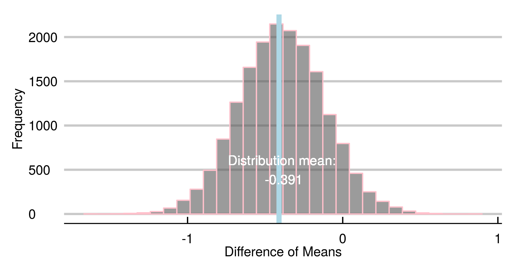

---
output:
  pdf_document: default
  html_document: default
---
# Capítulo 5 : Contexto e Inferência Bayesiana

## Probabilidades
*"O provável é aquilo que acontece na maioria das vezes"*, Aristóteles, Retórica.  

Uma abordagem probabilística da matemática aplicada que tem se popularizado é a de *Inferência Bayesiana*. Os procedimentos apresentados antes são usualmente chamados de *frequencistas*. 
Muitas vezes, a informação obtida é quase idêntica, mas a perspectiva muda de forma consideravel.     

Por princípio, usamos caminhos diferentes.  

**Frequencistas e Bayesianos**

Abordagens frequencistas situam probabilidades como aproximações para cenários com um número infinito de eventos. Os exemplos visitados nos primeiros capítulos muitas vezes faziam essa analogia. 

Retomando um exemplo trivial: se jogarmos uma moeda honesta infinitas vezes, a proporção de *caras* tende a que valor? Para muitos sorteios, a proporção tende a 0,5.  
Simulação:  
```r
    > set.seed(2600)
    > coin_t <- function(x) {
    sample(size=x,x=c(0,1), prob = c(0.5,0.5), replace = T) %>%
    (function(y) sum(y)/length(y))}
    > coin_t(3)
    [1] 0.6666667
    > coin_t(10)
    [1] 0.4
    > coin_t(30)
    [1] 0.5666667
    > coin_t(100)
    [1] 0.51
    > coin_t(1000)
    [1] 0.498
    > coin_t(100000)
    [1] 0.50098
    > coin_t(10000000)
    [1] 0.4999367
```  

É comum a ideia de populações ou procedimentos hipotéticos infinitos.  
O método hipotético-dedutivo relaciona teorias a observações através de hipóteses falseáveis. A concepção mais aceita, compilada recentemente por K. Popper, trata diretamente de probabilidades como entes importantes para as ciências naturais.  
Mais que isso, ilustra o conceito de calcular a plausibilidade de resultados experimentais na vigência de uma hipótese em estudo.  

Calculamos uma probabilidade associada à ocorrência de uma observação. No teste t para duas amostras (capítulo 1), definimos a hipótese nula em função das médias dos bicos($\mu$) e outros parâmetros ($\sigma$,$df$). $H_{0} : \mu_{amostra_{1}} = \mu_{amostra_{2}}$.  
O procedimento de imaginar os eventos observados como instâncias de uma família de eventos semelhantes se adequada perfeitamente a preceitos Popperianos. Continua sendo o feijão com arroz da ciência normal para testar previsões de um determinado paradigma. O refinamento gradual de uma teoria envolve o acúmulo de conhecimento e testagem de *hipóteses auxiliares* resultantes de premissas basilares (*hard core* na terminologia de Imre Lakatos).  

Prismas bayesianos instrumentalizam probabilidades como entes primitivos, noções mais básicas relacionadas a *plausibilidade*, *grau de crença*, *expectativa* para uma determinada situação. 
O ponto chave é de que deixamos de guiar os procedimentos objetivando uma probabilidade para os eventos.  
As probabilidades em si passam a ser entidades centrais. Especificamente, como nossas crenças sobre algo mudam após observações.  

No caso dos pássaros:  

*Inferência Frequencista*: Supondo que a diferença média entre tamanho dos bicos seja 0, qual a probabilidade para minhas observações?   
Sendo $H_0$ definida por $H_0 : \mu_{amostra_{1}} = \mu_{amostra_{2}}$, queremos saber:  
$P(H_0) < 0,05$?  

*Inferência Bayesiana*: Quais as probabilidades associadas aos valores possíveis para a diferença entre  $\mu_{amostra_{1}}$ e $\mu_{amostra_{2}}$? Considerando um modelo e os dados, qual a distribuição probabilística de $\mu_\mathit{diff_{1-2}}$   
$P(\mu_\mathit{diff_{1-2}}) = ?$  

Além de construtos intuitivos, uma plataforma bayesiana oferece dois recursos poderosos: sensibilidade a informações prévias sobre um fenomeno (*priors*) e estimadores estocásticos  (e.g.*Markov Chain Monte Carlo*). Assim, podemos (1) fazer uso de informações arbitrárias (e.g. intuição de um especialista) e (2) reduzir a dependência de soluções analíticas (fechadas) para equações que descrevem os modelos.  

---  

#### Epistemologia Bayesiana?

Antes, associamos cenários a hipóteses e estimamos parâmetros (probabilidades) para testá-las. Agora, os *parâmetros* têm um papel conceitual mais central.  

Um parâmetro é um símbolo, uma aproximação para uma ideia (*para*, "perto", *metron*, "medida"). Nos capítulos iniciais, usamos parâmetros para construtos que se comportam como números (e.g: existem elementos que podem ser ordenados por alguma noção de tamanho e operações, como soma e multiplicação).  

Estimamos um parâmetro que aproxima o valor concebido como o verdadeiro para a diferença média entre tamanho dos bicos nas espécies A e B. No capitulo 2, um parâmetro para a correlação entre expectativa de vida saudavel e número de médicos em um país. Mais do que isso, usamos estatísticas para testar hipóteses e calcular intervalos de confiança.  
Podemos usar probabilidades obtidas via inferência bayesiana para continuar testando hipóteses. Entretanto, usaremos paradigmas propostos por outros filósofos como pano de fundo para os procedimentos.[^27]

[^27]:Existe um programa de pesquisa mais abrangente em filosofia sobre epistemologia Bayesiana, mas este não é nosso foco.

## Muitos métodos científicos: Feyerabend, Carnap e Quine

No primeiro capítulo, entramos em contato com o método hipotético-dedutivo e a falseabilidade como critério de demarcação científica. Apesar de dominante, esse racional possui vulnerabilidades interessantes. Entenderemos melhor argumentos contrários e propostas alternativas através de três filósofos do século XX. Esse é um momento conveniente, uma vez que tiramos os holofotes das hipóteses.    

**Paul Feyerabend (1924 - 1994)**

Conhecido pela personalidade ímpar e por ideias radicais, Paul Feyerabend, em *Contra o Método*(1975), argumenta que boa parte dos avanços significativos aconteceram fora do método científico.   

Crenças pessoais e detalhes biográficos são responsáveis por mudanças em nosso conhecimento. Mais que isso, usar falsificabilidade e o método hipotético-dedutivo teriam nos feito rejeitar o heliocentrismo e outras ideias chave para o progresso. Na verdade, o sistema geocêntrico (Terra no centro do sistema) de Ptolomeu era mais acurado (!) que o de Copérnico (Sol ao centro) usando um mesmo número de parâmetros para cálculos das órbitas. O modelo copernicano estava mais próximo da realidade como entendida hoje, porém o estágio intermediário de concepção teórica era 'pior' [^28].    

Além de menos acurado, era mais complexo em alguns aspectos, incluindo mais epiciclos: órbitas auxiliares usadas como artifício para cálculos. A Revolução Copernicana somente consolidou a mudança de paradigma com contribuições subsequentes de de Tycho Brahe, Kepler, Galileo e Newton, cerca de 1 século depois.


[^28]: Stanley E. Babb, “Accuracy of Planetary Theories, Particularly for Mars”, Isis, Sep. 1977, pp. 426

Diante das incongruências entre um método e as inevitáveis imprevisibilidades da empreitada humana em conhecer o Universo, Feyerabend propõe o *anarquismo epistêmico* sob o mote *"Anything goes"* ('Vale tudo'). Isto é, quaisquer recursos são válidos na tentativa de atacar um problema ou conceber um modelo de realidade.  

É tentador pensar que, dada a profundidade do trabalho, a defesa de uma postura tão contundente é obviamente uma aplicação dos preceitos defendidos no livro como necessários para disseminar uma idéia. Outros filósofos nos ajudam a conceber uma ciência não pautada num método hipotético-dedutivo de maneira menos radical.  

\pagebreak

**Rudolph Carnap (1891 - 1970)**  

Carnap, do Círculo de Viena, também contrapôs Popper. Em  “Testability and Meaning” (1936-7), argumenta que falsificabilidade não difere de verificacionismo. Envolve a testagem de cada assertiva em si, um problema que [outros](https://en.wikipedia.org/wiki/Ludwig_Wittgenstein) também endereçaram.  

Diante de resultados inesperados em um experimento, o procedimento automático para um cientista envolve checar a integridade das condições desenhadas. Verificar a composição da amostra, os métodos de coleta, mecanismos de perda, critérios de exclusão e inclusão, premissas da análise. Isso não é desonestidade intelectual: são fatores menores reais e facilmente abordáveis que podem ter invalidado a teoria de base. O mesmo se dá para técnicas de análise e conceptualização de construtos.  

O cuidado com esses pontos é desejável e desnuda o inevitável calcanhar de Aquiles da falsificabilidade.  
É impossível refutar uma hipótese/assertiva de maneira isolada. Cada procedimento experimental ou lógico envolve a interdependência entre os símbolos usado.  

**Willard van Orman Quine (1908 – 2000)**  

Uma escola filosófica parte do problema acima. A tese de Duhem-Quine postula que é impossível testar qualquer hipótese científica, uma vez que sempre há premissas aceitas como verdade.

Em *‘Os dois dogmas do empiricismo’*, Quine considera as proposições e as relações lógicas entre elas apenas um sistema, que só pode ser estudado em conjunto.  
Os exercícios ilustrados no volume anterior testa a adequação dos dados à família de distribuições t. Também assume que tamanhos dos bicos são mensuráveis usando números e que estes podem ser comparados com valores de outras amostras.  

A princípio, essas declarações parecem triviais. Entretanto, considerando os fatores humanos da ciência, a mudança de lentes é significativa. Discutivelmente, abordar um problema dessa maneira é historicamente mais frutífero. As contribuições mais contundentes são advindas de cientistas dedicados a estudar um contexto ou problema como um todo. É raro, talvez inédito, que um grupo testando hipóteses sem um eixo consistente tenha obtido avanços admiráveis.  

Estimar livremente os parâmetros de que falamos naturalmente é muito mais intuitivo que adequar uma ideia aos procedimentos hipotético-dedutivos.  

### Bayesian estimation

No capítulo 1, ao fazer um teste t, calculamos a estatística t correspondente às diferenças encontradas e então a probabilidade de obter valores iguais ou mais extremos.    

É possível usar inferência bayesiana para analisar uma situação idêntica. Como aludido antes, não estamos muito interessados no valor p.  
A pergunta é *“Quais são os valores prováveis para a diferença entre A e B?”*.

A distribuição probabilística obtida representa nossas crenças na plausibilidade de cada valor.

Usando a library BEST e 30 observações retiradas de amostras de distribuição normal $(\mu_{a}=0; \mu_{b}=0.6; \sigma_{a} = \sigma_{b} = 1)$ normais.  

```r
    > library(ggthemes)
    > library(rstan)
    > library(reshape2)
    > library(BEST)
    > library(ggplot2)
    > options(mc.cores = parallel::detectCores() - 1)
    > set.seed(2600)
    > a <- rnorm(n = 30, sd = 1, mean = 0)
    > b <- rnorm(n = 30, sd = 1, mean = 0.6)

    # BEST
    > BESTout <- BESTmcmc(a, b)    

    ### BEST plots
    > par(mfrow=c(2,2))
    > sapply(c("mean", "sd", "effect", "nu"), function(p) plot(BESTout, which=p))
    > layout(1)
```


A distribuição no canto superior esquerdo corresponde às nossas estimativas para possíveis valores da diferença entre A e B. Podemos usar a média como estimativa pontual: $(\mathit{diff}_{\mu_{a}\mu_{b}}=-0.669)$. O intervalo apontado como 95% HDI (High density interval) contém 95% da distribuição.
Seu significado é mais próximo da intuição de uma região provável para os valores que o clássico intervalo de confiança.  

### Por trás das cortinas

Obviamente, vamos entender a arte envolvida aqui. A flexibilidade e o poder dos modelos bayesianos permite lidar com uma série de problemas dificilmente tratáveis de outra forma. Entretanto, é fácil cair em armadilhas ou esbarrar em dificuldades durante o processo.  

É extremamente importante entender os componentes envolvidos para não cometer erros importantes.  


### O Teorema do Bayes 

$$P(B\mid A)= \frac{(A \mid B)P(B)}{P(A)}, P(A)\neq 0$$
É a forma célebre do teorema e nos conta sobre probabilidades de eventos subsequentes/concorrentes.  

Costuma ser apresentado para tratar problemas simples: *sabendo o resultado de um teste médico positivo, qual a probabilidade de o paciente ter a doença?*. O teorema de Bayes relaciona a probabilidade basal da doença com a probabilidade um teste positivo subsequente. Algumas armadilhas da intuição são quebradas: ainda que o teste tenha boa sensibilidade (probabilidade alta de resultado positivo diante da doença), a probabilidade será baixa se as chances basais também forem.    
 
O teorema foi concebido num esforço maior do reverendo (Thomas Bayes, 1701-1761) para um problema de inferência. Curiosamente, ele é bastante semelhante ao que empreenderemos.  
Suponha que atribuímos uma probabilidade *p*($0 \leqslant p \leqslant 1$) para o lançamento de uma moeda com resultado *coroa*. Ao observar alguns resultados, podemos calibrar nossa estimativa. 
Podemos começar supondo uma moeda honesta $0.5$. Com uma frequência alta de *coroas*, é racional aumentar a nossa estimativa sobre o valor de *p* $(p \sim 1)$. Bayes demonstrou como fazer essas atualizações diante de evidência.   

#### Intuições

O texto de **An essay towards solving a Problem in the Doctrine of Chances (1973)** apresenta uma série de demonstrações até chegar ao enunciado:  
**Proposition 4** : *If there be two subesequent events be determined every day, and each day the probability of the 2nd [event] is $\frac{b}{N}$ and the probability of both $\frac{P}{N}$, and I am to receive N if both of the events happen the 1st day on which the 2nd does; I say, according to these conditions, the probability of my obtaining N is $\frac{P}{b}$. (...)*  

Os estilo é um pouco complicado. Com notação algébrica atual:   
Considerando dois eventos subsequentes, *(1)* a probabilidade do segundo acontecer é $\frac{b}{N}$ ($P(A)$), *(2)* a probabilidade de ambos acontecerem é $\frac{P}{N}$ ($P(A \cap B$). *(3)* Sabendo que o segundo aconteceu, a probabilidade de o primeiro também ter acontecido é $\frac{P}{b}$.  $N$ é cancelado e *(3)* é a razão entre *(2)* e *(1)*: 
 
$$P(B\mid A)= \frac{P(A \cap B)}{P(A)}, P(A)\neq 0$$  

Considerando dois eventos, **A** e **B**, a probabilidade de B acontecer sabendo que A aconteceu ($P(B\mid A)$) é idêntica à probabilidade de A e B ($P(A \cap B)$) acontecerem, normalizada pela probabilidade de A acontecer individualmente.  

Pela definição de probabilidade condicional, $P(A \cap B) = P(A \mid B) P(B)$ , então:  

$$P(B\mid A)= \frac{(A \mid B) \space P(B)}{P(A)}, P(A)\neq 0$$

Assim, podemos estimar probabilidades de eventos. Em inferência Bayesiana, empregamos o teorema para estimar os valores prováveis (distribuição probabilística) de um parâmetro $(\theta)$ diante de observações ($X$).

$$P(\theta \mid X) = \frac{ P(X \mid \theta) \space P(\theta) }{P(X)}, P(X) \neq 0$$

#### Posterior
Chamamos o primeiro termo, a estimativa do parâmetro após a calibração pelas observações $P(\theta \mid X)$, de **posterior**. Todos os procedimentos são desenhados para calculá-la e representa a distribuição usada nas inferências finais.  

#### Probabilidade marginal
O denominador do termo à direita é a probabilidade independente para a ocorrência dos dados ($P(X)$). É usada para normalizar as quantidades e chamada de probabilidade/verossimilhança marginal, **marginal likelihood**, ou ainda evidência do modelo, **model evidence**.  

#### Likelihood function
O primeiro termo à direita, $P(X \mid \theta)$, é a verossimilhança (**likelihood**) e determina a probabilidade de ocorrência das observações $P(X)$ dado um parâmetro $\theta$.  
Provavelmente, é o ponto mais sensível na modelagem, pois determina como se dá a relação entre modelo teórico e observações. Como discutido antes, equações descrevem leis envolvendo mais de um construto. O mapeamento entre observações $P(X)$ e um parâmetro  é dado pela *função de verossimilhança* (**likelihood function**) escolhida, $f(\theta)$.    
Exemplo: se os desfechos estudados são binários ($y_{i} \in  \{ 0,1 \}$, e.g. diagnóstico positivo ou negativo), podemos usar uma relação logística (ver Cap. 4) para estimar probabilidades em função de variáveis observadas ($X$) e parâmetro(s) $\theta$.  
$$P(X \mid \theta) \sim f(X, \theta) : y_{i} = \frac{1}{1+e^{-(\theta * x_{i} + c)}}$$  

#### Priors
Antes do experimento, temos alguma noção de como o parâmetro se comporta. Ela pode ser bem precisa ou trazer muita incerteza. Chamamos a estimativa basal $P(\theta)$ de **prior**.  
Na linguagem das probabilidades, ela é uma distribuição. Nossas crenças prévias podem ser pouco informativas (e.g. distribuição uniforme sobre os valores possíveis) ou bastante definidas (e.g. distribuição com pico acentuado em um valor provável).  

Conhecendo nossos construtos, podemos então reescrever os procedimentos:  
$\text{Posterior} = \frac{\text{Prob. de observações dada por} f(X,\theta) * \text{Prior}}{\text{Prob. marginal para observações}}$ 

Para obtermos o *posterior*, multiplicamos a probabilidade dada pela *função de verossimilhança* pelas nossas estimativas prévias (*prior*) e normalizamos pela *probabilidade marginal* das observações.  

As narrativas posteriores são construídas de acordo com a distribuição do *posterior*.  

---  

**Mestre Foo e o Recrutador**[^29]

Um recrutador técnico, ao descobrir que os caminhos dos hackers Unix lhe eran estrahos, procurou uma reunião com Mestre Foo para aprender sobre o Caminho. Mestre Foo encontrou o recruta nos escritórios de recursos humanos de uma grande corporação.  

O recruta disse, “Eu tenho observado que os hackers Unix desdenham ou ficam nervosos quando pergunto a eles quantos anos de experiência têm em uma linguagem de programação nova. Por que isso acontece?"  

Mestre Foo levantou e começou a caminhar pelo escritório. O recrutador ficou intrigado, e perguntou "O que está fazendo"?  

“Estou aprendendo a andar", replicou Mestre Foo.  

“Eu vi você entrar pela porta andando” o recrutador exclamou, “e você não está tropeçando em seus pés. Obviamente, você sabe como andar.”  

“Sim, mas este piso é novo para mim” replicou Mestre Foo.  

Ao ouvir isso, o recrutador foi iluminado.

[^29]: http://www.catb.org/~esr/writings/unix-koans/recruiter.html

---

### Dear Stan

As implementações dos modelos Bayesianos são feitas em Stan, um pacote em C++  especializado em inferência bayesiana. Os modelos são escritos num dialeto próprio (Stan), mas a sintaxe é bastante semelhante à da notação matemática, então a tradução das análises do capítulo é direta.  
Especificamos o modelo num arquivo auxiliar de extensão *.stan*, que é manipulado por pacotes em R para visualização e outras utilidades.  

**Lá e de volta outra vez**
Reproduziremos à maneira bayesiana dois exemplos conhecidos: diferença entre médias (análogo ao test t) e correlação.  
Seguindo o exercício anterior, precisamos especificar que consideramos as duas amostras vindo de distribuições t com médias $\mu_{1} e \mu_{2}$ e desvios-padrão idênticos, $\sigma_{a}= \sigma_{b}$.  
@ Posterior para diferença entre médias
@ Posterior para correlação

```
data {
  int<lower=0> N;
  vector[N] y_1;
  vector[N] y_2;
}
parameters {
  real mu_1;
  real mu_2;
  real sigma;
}
model {
  //priors
  mu_1 ~ normal(0, 1);
  mu_2 ~ normal(0, 1);
  sigma ~ normal(0, 1);
 
  //likelihood
  for (n in 1:N){
    y_1[n] ~ normal(mu_1, sigma);
    y_2[n] ~ normal(mu_2, sigma);
  }
}
generated quantities{
  real mudiff;
  real cohenD;
 
  mudiff = mu_1 - mu_2;
  cohenD = mudiff/sigma;
}
```


```r
    # a e b declaradas antes
    > sample_data <- list(y_1=a,y_2=b,N=length(a))
    > fit <- rstan::stan(file="aux/bayes-t.stan",
           	data=sample_data,
           	iter=3000, warmup=100, chains = 6)
```

```r
    > muDiff <- extract(fit, par='mudiff')$mudiff
    > mean(muDiff)
    > [1] -0.3910029
    > means <- lapply(list(a,b), mean)
    > sample_diff <- diff(as.numeric(means))  # observed in data
    > ggplot(as.data.frame(muDiff),aes(x=muDiff))+
       geom_histogram(alpha=0.6,color="pink")+
       geom_vline(xintercept=-sample_diff,
              	color="light blue",size=2)+ # line for observed difference
       xlab("Difference of Means")+ylab("Frequency")+
       geom_text(label="Distribution mean:\n -0.391",
             	color="white",x=mean(muDiff),y=500)+
       theme_economist_white(gray_bg = F)
```



@Correlacao  

```r
    >fit <- rstan::stan(file="aux/corr-docs.stan",
           	data=uni_df,
           	iter=3000, warmup=100, chains = 6)
```
Ellipse:

```r
    >x.rand = extract(fit, c("x_rand"))[[1]]
    >plot(uni_df[,c("log_docs","hale")],
     	xlim=c(-5,5), ylim=c(20, 100), pch=16)
    >dataEllipse(x.rand, levels = c(0.75,0.95,0.99),
            	fill=T, plot.points = FALSE)
```


* Classificação
  * Regressão logística @ Numero de euler
  * Modelos hierárquicos
* Flexibilidade Bayesiana
  * Usando priors
  * O estimador Markov Chain Monte Carlo
  
\pagebreak