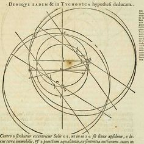
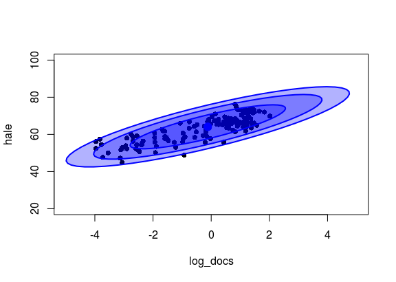

---
output:
  pdf_document: default
  html_document: default
---
\pagebreak

# Início dos textos em construção

\pagebreak

# Capítulo 5 : Contexto e Inferência Bayesiana

## Probabilidades 

Uma abordagem da matemática aplicada que tem se popularizado é o de Inferência Bayesiana. Os procedimentos anteriores são usualmente descritos como frequencistas.  

Ainda que a informação final de ambas (frequencista e bayesiana) possa convergir, a perspectiva muda radicalmente.   

Por princípio, partimos de um ponto diferente.  
Ao invés de usar probabilidades para testar hipóteses sobre *parâmetros*, modelamos os valores deles diretamente.  

Um parâmetro é um símbolo, uma aproximação para uma ideia (*para*, "perto", *metron*, "medida"). Em geral, usamos parâmetros para representar fenômenos que se comportam como números (e.g: existem elementos que podem ser ordenados por alguma noção de tamanho e estes podem ser somados e/ou multiplicados). Exemplos de parâmetros que podem ser estimados experimentalmente: capacidade ventilatória, altura média, IMC.  

O médico liga para confirmar uma consulta marcada: "(...) confirma às 20:00 ou vai se atrasar?".  
O horário de '20:00' é uma estimativa pontual, porém sabemos que existe a chance de chegarmos 19:55 ou 20:05.
Um frequencista responderia: "Confirmo. Diante do trânsito, posso atrasar. Porém, um atraso maior que 10 minutos é muito improvável (p < 0,05)".  
Um bayesiano responderia: "Confirmo. Diante do trâsito, é mais provável que eu chege entre 20:00 e 20:05."
Trabalhamos com incertezas o tempo inteiro. Inferência Bayesiana desvia da modelagem probabilística de hipóteses; o objetivo é modelagem direta das distribibuições dos parâmetros.  

Em abordagem frequencistas, visamos a probabilidade de uma hipótese que versa sobre os valores de algum parâmetro. No teste t para duas amostras, definimos a hipótese nula em função das médias ($\mu$) e outros parâmetros ($\sigma$,$df$).  $H_{0} : \mu_{amostra_{1}} > \mu_{amostra_{2}}$. Em abordagem bayesiana, estimamos diretamente as distribuições de $\mu_{amostra_{1}}$ e $\mu_{amostra_{2}}$ e podemos fazer inferências a partir delas.  

## Muitos métodos científicos: Feyerabend, Carnap e Quine

No primeiro capítulo, entramos em contato com o método hipotético-dedutivo e a falseabilidade como critério de demarcação científica. Apesar de dominante, esse racional possui vulnerabilidades interessantes. Entenderemos melhor argumentos contrários e propostas alternativas através de três filósofos do século XX. Esse é um momento conveniente, uma vez que tiramos os holofotes das hipóteses.    

**Paul Feyerabend (1924 - 1994)**

Conhecido pela personalidade ímpar e por ideias radicais, Paul Feyerabend, em *Contra o Método*(1975), argumenta que boa parte dos avanços significativos aconteceram fora do método científico.   

Crenças pessoais e detalhes biográficos são responsáveis por mudanças em nosso conhecimento. Mais que isso, usar falsificabilidade (como vimos no *Capítulo I* sobre K. Popper) e o método hipotético-dedutivo teriam nos feito rejeitar o heliocentrismo e outras ideias chave. Na verdade, o sistema geocêntrico (Terra no centro do sistema) de Ptolomeu era mais acurado (!) que o de Copérnico (Sol ao centro) usando um mesmo número de parâmetros para cálculos das órbitas. O sistema copernicano estava mais próximo da realidade como entendida hoje, porém o estágio intermediário de concepção teórica era 'pior' [^27].    

Além de menos acurado, era mais complexo em alguns aspectos, incluindo mais epiciclos. A Revolução Copernicana somente consolidou a mudança de paradigma com contribuições subsequentes de de Tycho Brahe, Kepler, Galileo e Newton, cerca de 1 século depois.



[^27]: Stanley E. Babb, “Accuracy of Planetary Theories, Particularly for Mars”, Isis, Sep. 1977, pp. 426

Diante das incongruências entre um método e as inevitáveis imprevisibilidades da empreitada humana em conhecer o Universo, Feyerabend propõe o *anarquismo epistêmico* sob o mote *"Anything goes"* ('Vale tudo'). Isto é, quaisquer recursos são válidos na tentativa e atacar um problema.  

É tentador pensar que, dada a profundidade do trabalho, a defesa de uma postura tão contundente é obviamente uma aplicação dos preceitos defendidos no livro como necessários para disseminar uma ideia. Outros filósofos nos ajudam a conceber uma ciência não pautada num método hipotético-dedutivo de maneira mais construtiva.  

\pagebreak

**Rudolph Carnap (1891 - 1970)**  

Carnap, do Círculo de Viena, também contrapôs Popper. Em  “Testability and Meaning” (1936-7), argumenta que falsificabilidade não difere de verificacionismo. Envolve a testagem de cada assertiva em si, um problema que [outros](https://en.wikipedia.org/wiki/Ludwig_Wittgenstein) também endereçaram.  

Diante de resultados inesperados em um experimento, o procedimento automático para um cientista envolve checar a integridade das condições desenhadas. Verificar a composição da amostra, os métodos de coleta, mecanismos de perda, critérios de exclusão e inclusão, premissas da análise. Isso não é desonestidade intelectual: são fatores menores reais e facilmente abordáveis que podem ter invalidado a teoria de base. O mesmo se dá para técnicas de análise e conceptualização de construtos.  

O cuidado com esses pontos é desejável e desnuda o inevitável calcanhar de Aquiles da falsificabilidade.  
É impossível refutar uma hipótese/assertiva de maneira isolada. Cada procedimento experimental ou lógico envolve a interdependência entre os símbolos usado.  

**Willard van Orman Quine (1908 – 2000)**  

Uma escola filosófica parte do problema acima. A tese de Duhem-Quine postula que é impossível testar qualquer hipótese científica, uma vez que sempre há premissas aceitas como verdade.

Em *‘Os dois dogmas do empiricismo’*, Quine considera as proposições e as relações lógicas entre elas apenas um sistema, que só pode ser estudado em conjunto.
Os exercícios ilustrados no volume anterior testa a adequação dos dados à família de distribuições t. Também assume que tamanhos dos bicos são mensuráveis usando números e que estes podem ser comparados com valores de outras amostras.  

A princípio, essas declarações parecem triviais. Entretanto, considerando os fatores humanos da ciência, a mudança de lentes é significativa. Abandonando o esquema de testagem de hipóteses como eixo, o *valor p* deixa de ter papel central na narrativa. Integra um conjunto de informações maior sobre os parâmetros examinados.  

Discutivelmente, abordar um problema dessa maneira é historicamente mais frutífero. As contribuições mais contundentes são advindas de cientistas dedicados a estudar um contexto ou problema como um todo. É raro, talvez inédito, que um grupo operando de forma sistemática com o método hipotético-dedutivo tenha obtido avanços consistentes.  

Estimar livremente os parâmetros de que falamos é muito mais intuitivo que adequar uma ideia aos procedimentos de testagem de hipóteses.

### Bayesian estimation

Para a abordagem anterior, ao fazer um test t, calculamos a estatística t correspondente às diferenças encontradas e então a probabilidade de obter valores iguais ou mais extremos.  
Agora, faremos algo mais simples e intuitivo. Vamos estimar um parâmetro: a diferença entre os grupos. Na verdade, valores prováveis dela. Todas as inferências subsequentes serão derivadas da distribuição produzida por nosso procedimento.  
Novamente, usaremos 30 observações retiradas de amostras de distribuição normal $(\mu_{a}=0; \mu_{b}=0.6; \sigma_{a} = \sigma_{b} = 1)$ normais. Usando a library BEST, é possível usar inferência bayesiana para responder nossa pergunta (“Como é a distribuição da diferença entre A e B (…)?”). Aplicamos o estimado sobre as amostras A e B e, em seguida, plotamos as distribuições.  

```r
    >library(ggthemes)
    >library(rstan)
    >library(reshape2)
    >library(BEST)
    >library(ggplot2)
    >options(mc.cores = parallel::detectCores() - 1)
    >a <- rnorm(n = 30, sd = 1, mean = 0)
    >b <- rnorm(n = 30, sd = 1, mean = 0.6)

    # BEST
    >BESTout <- BESTmcmc(a, b)    

    ### BEST plots
    >par(mfrow=c(2,2))
    >sapply(c("mean", "sd", "effect", "nu"), function(p) plot(BESTout, which=p))
    >layout(1)
```


A distribuição no canto superior esquerdo corresponde à nossa estimativa da diferença entre A e B. Com ela, podemos fazer estimativas pontuais $(diff_{\mu_{a}\mu_{b}}=-0.669)$. O intervalo apontado como 95% HDI (High density interval) contém 95% da distribuição.  

### Por trás das cortinas

Obviamente, vamos entender a arte permitindo estimar essas distribuições. A flexibilidade e o poder dos modelos bayesianos permite lidar com uma série de problemas dificilmente tratáveis de outra forma. Entretanto, é fácil cair em armadilhas ou esbarrar em dificuldades durante o processo.  

Nesse framework, lidamos com distribuições. É extremamente importante entender os componentes envolvidos para não cometer erros importantes.  


Então, seguindo o exercício anterior, precisamos especificar que consideramos as duas amostras vindo de distribuições t com médias $\mu_{1} e \mu_{2}$ e desvios-padrão idênticos, $\sigma_{a}= \sigma_{b}$.  
@ Teorema de Bayes:  posterior = Likelihood function x prior / evidence
@ Posterior para correlação
@ Posterior para diferença entre médias
@ Posterior para correlação

```r
    >sample_data <- list(y_1=a,y_2=b,N=length(a))
    >fit <- rstan::stan(file="aux/best.stan",
           	data=sample_data,
           	iter=3000, warmup=100, chains = 6)
```

```r
    >muDiff <- extract(fit, par='mudiff')$mudiff
    >means <- lapply(list(a,b), mean)
    >sample_diff <- diff(as.numeric(means))  # observed in data
    >ggplot(as.data.frame(muDiff),aes(x=muDiff))+
      geom_histogram(alpha=0.6,color="pink")+
      geom_vline(xintercept=-sample_diff,
             	color="light blue",size=2)+ # line for observed difference
      xlab("Difference of Means")+ylab("Frequency")+
      geom_text(label="Sample difference",
            	color="white",x=mean(muDiff),y=500)+
      theme_economist_white(gray_bg = F)
```


@Correlacao  

```r
    >fit <- rstan::stan(file="aux/corr-docs.stan",
           	data=uni_df,
           	iter=3000, warmup=100, chains = 6)
```
Ellipse:

```r
    >x.rand = extract(fit, c("x_rand"))[[1]]
    >plot(uni_df[,c("log_docs","hale")],
     	xlim=c(-5,5), ylim=c(20, 100), pch=16)
    >dataEllipse(x.rand, levels = c(0.75,0.95,0.99),
            	fill=T, plot.points = FALSE)
```


* Classificação
  * Regressão logística @ Numero de euler
  * Modelos hierárquicos
* Flexibilidade Bayesiana
  * Usando priors
  * O estimador Markov Chain Monte Carlo
  
\pagebreak