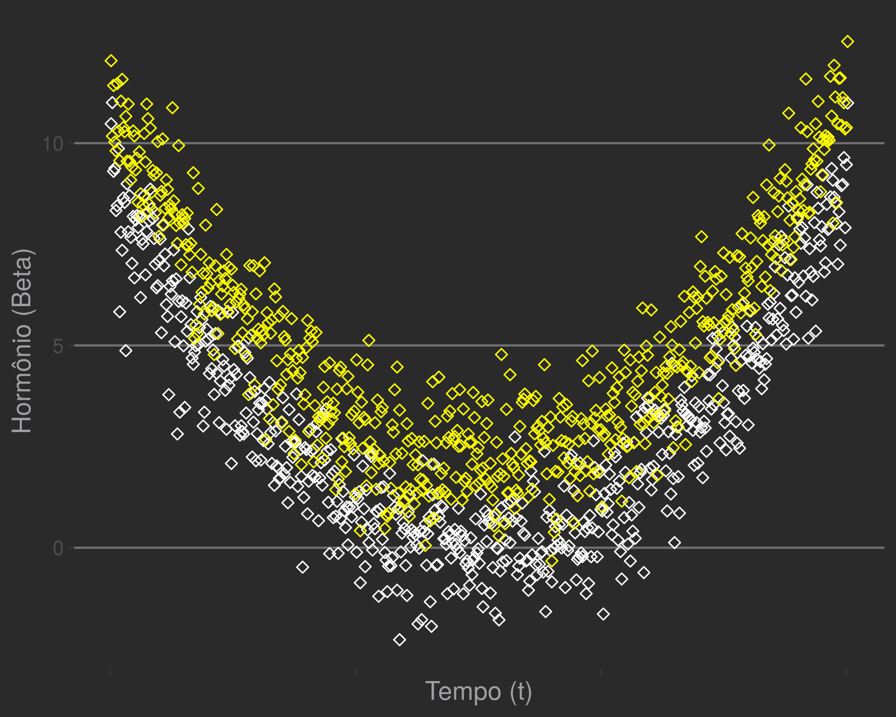
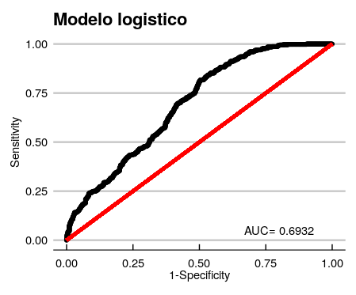
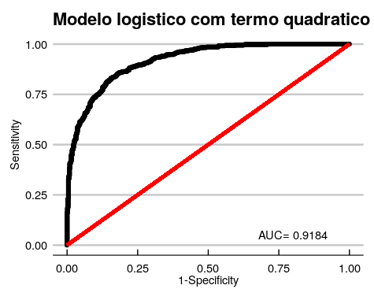
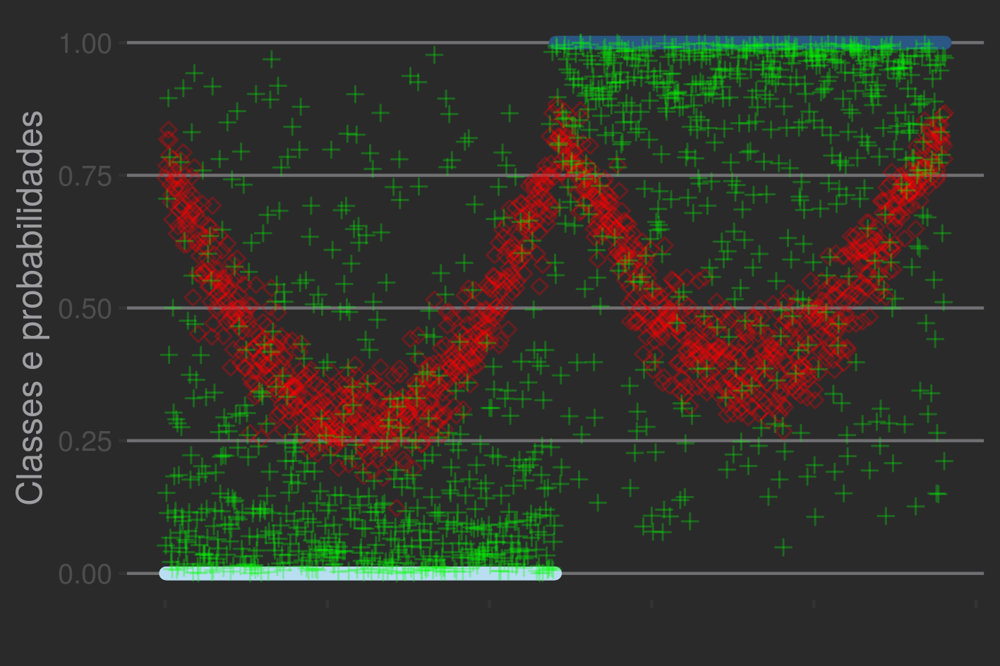

---
output:
  pdf_document: default
  html_document: default
---
# Capítulo 6 - Curvas: Funções elementares e séries temporais  

Nos primeiros capítulos (1-5), aprendemos relações lineares. Retas descritas por um coeficiente angular: coeficiente produto-momento de Pearson ($\rho$), regressão linear ($\beta$), perceptrons ($W$) ou redes neurais (múltiplos $W_{i}$) de ativação simples. Aprenderemos a escolher modelos um pouco mais sofisticados, naturalmente não lineares, para solução de problemas.   

## O caso das drogas ergogênicas

*Lembre:*
O gráfico a seguir, retirado do *Capítulo 4*, é baseado em observações biológicas e representa milhares de amostras com: (1) a curva diária natural de testosterona (branco) e uma suposta curva correspondente sob uso de esteroides anabolizantes (amarelo).



Anteriormente, diante de problemas não são separáveis linearmente, usamos transformações em sequência para atingir classificação satisfatória unicamente com pedaços lineares.  
Uma rede neural (Mark II) teve acurácia demonstrada para o problema com medida de flores (*iris*). Com redes neurais, fazemos ajustes graduais através de funções elementares e obtemos uma boa solução final. Entretanto, a convergência é lenta e necessitamos de muitas observações ou truques na apresentação dos dados (e.g. *epochs*). Vamos avançar um pouco, criando modelos cuidadosamente escolhidos para cada situação.  

**Em última instância, a adequação do modelo depende de uma simetria entre sua estrutura e aquela presente nos dados.** Quão melhor a intuição sobre as características dos dados, maior será a capacidade de escolher um modelo de melhor performance e menor fragilidade a erros (e.g. *overfitting*).  

Existem muitas maneiras de extrair *insights* sobre a estrutura dos dados. Por exemplo, as ideias podem vir de conhecimentos prévios sobre o fenômeno natural examinado. Acompanharemos o processo de chegar a um modelo final com base em visualizações e intuições espaciais sobre as medidas disponíveis.  

### Regressão quadrática e simetrias

Os modelos lineares expressam relações de natureza única entre variáveis. Considerando pares de observações entre duas variáveis (e.g. idade e altura), as magnitudes podem crescer com mesmo sentido (*'se A cresce, B também cresce'*, $\beta$ positivo) ou em sentido inverso (*'se A cresce, B decresce'*, $\beta$ negativo). Isso acontece em qualquer intervalo observado.  

Alguns fenômenos se apresentam de maneira diferente. As magnitudes podem crescer com sentido igual em determinado intervalo e de maneira diferente em outro. 


Observando a figura acima, notamos que níveis de testosterona *descrescem* com o tempo (sentidos inversos) a partir de 08:00 até atingirem um mímino por volta das 20:00. Passando deste ponto, passam a *crescer* com o avançar do tempo (sentidos iguais), até atingir um máximo.  

Podemos modelar essas simetrias usando termos *polinomiais* ($f(x) \sim x^n$). Em polinômios de ordem maior, os valores são multiplicados por si ($x \times x \times x \times x ...$). Há um efeito sobre a magnitude geral: quão mais longe do $0$, maior a taxa de aumento. Valores de entrada extremos possuem imagens com valores absolutos ainda mais extremos.  

Entretanto, o principal efeito é que temos a possibilidade de modelar diferentes simetrias, uma vez que o produto de dois números negativos é positivo (e.g. $-a \times -b = ab$). Assim, espelhamos imagens e podemos desenhar curvas de diversos tipos.  

As retas com inclinação positivas ($f(x) \sim \beta x$) e negativas ($f(x) \sim -\beta x$) que estudamos correspondem a polinômios de primeiro grau ($n=1$).  

Polinômios de ordem par ($n=2,4,6...$) correspondem a curvas simétricas em relação aos valores de $f(x)$, o eixo y: $f(x) = f(-x)$.  
A concavidade pode ser voltada para cima ($f(x) \sim \beta x^2, f(x) \sim \beta x^4, ...$) ou para baixo ($f(x) \sim -\beta x^2, f(x) \sim -\beta x^4, ...$) a depender do sinal do coeficiente.  

Polinômios de ordem ímpar ($n=1,3,5,7...$) correspondem a curvas simétricas em relação à origem: $f(-x) = -f(x)$. Podemos enxergá-las como extensões das retas[^1], uma vez que a relação entre magnitudes é igual em sentido para qualquer intervalo (*‘se A cresce, B decresce’*). A diferença é que, como exposto antes, entradas extremas terão valores de imagens ainda mais extremas.   

[^1]: Retas são 'curvas' com curvatura 0.

Para o caso da testosterona, se definirmos o tempo zero (eixo $x$) em 20:00, um polinômio de ordem par, como o modelo quadrático ($Y \sim X^2$, parábola) expressa perfeitamente a distribuição. O que seriam extremos negativos num modelo linear passam a ser extremos positivos num modelo quadrático, que decrescem em magnitude com o avançar do tempo. Quando atingimos $0$, os valores voltam a crescer.  

Simulação dos dados com cerca de 600 observações em cada classe (dopados e não dopados):  

```r
    >library(tidyr)
    >set.seed(2600)    
    >n_samp <- 601
    
    >normal <- (purrr::map(seq(-3,3,0.01), .f =function(x) x^2) %>%
                  as.numeric)+ rnorm(n_samp)
    >over <- (purrr::map(seq(-3,3,0.01), .f =function(x) x^2+2) %>%
                  as.numeric)+ rnorm(n_samp)
    >horm_df <- data.frame(norm = normal, ov = over,time=1:n_samp)    
    >horm_gat <- gather(data=horm_df,key="class",value="testost",norm,ov)
    >horm_gat$lab <-  car::recode(horm_gat$class,"'norm'=0;'ov'=1")
    >horm_gat$id <- 1:nrow(horm_gat)
    >head(horm_gat)
      time class   testost lab id
    1    1  norm  8.549492   0  1
    2    2  norm  9.090112   0  2
    3    3  norm 10.362759   0  3
    4    4  norm  8.801111   0  a4
    5    5  norm 10.896185   0  5
    6    6  norm  9.552046   0  6
```

Como verificado no *Capítulo 4*, não é possível dividir os grupos com uma reta. O problema não é linearmente separável, então a regressão logística será apenas parcialmente satisfatória.  
Usaremos a biblioteca *Deducer* para avaliar rapidamente a performance do modelo usando curva ROC.  
```r
    >library(Deducer)
    >library(ggplot2)
    >library(ggthemes)
    >reg_log <- glm(lab ~ testost + time, 
               data=horm_gat,family = binomial)
    >rocplot(reg_log)+theme_economist_white(gray_bg = F)+
          ggtitle("Modelo logistico")            
```


Observamos uma AUROC de de 0.693, o que é razoavelmente acurado. Examinando o modelo, notamos que a informação sobre tempo não é utilizada. O $\beta$ atribuído é bastante próximo de 0 ($\beta_{tempo} \sim 3 \times 10^{-5}$), refletindo a incapacidade do modelo linear em capturar as assimetrias que descrevemos antes. 
Atribuir um coeficiente positivo implicaria uma relação de sentidos iguais : tempos avançados corresponderiam a dosagens maiores. Atribuir um coeficiente negativo implicaria uma relação de sentidos opostos: tempos avançados corresponderiam a dosagens menores.  

```r
    >reg_log
    (...)
    Coefficients:
    (Intercept)      testost         time  
     -9.589e-01    2.374e-01    3.861e-05
    (...)
```
Como capturar as assimetrias no tempo? Uma solução é centralizar o tempo em na origem ($0$) e então usar um modelo quadrático.  

```r
    >horm_gat$time2 <- scale(horm_gat$time)
    >reg_log_quad <- glm(lab ~ testost + I(time2^2), 
               data=horm_gat,family = binomial)
    >rocplot(reg_log_quad)+theme_economist_white(gray_bg = F)+
          ggtitle("Modelo logistico com termo quadratico")
```


Agora, obtivemos uma classificação excelente ($\text{AUROC} > 0.9$).  
O que acontece é que o modelo simples, com termos lineares, usa apenas doses de testosterona como parâmetro. Medidas altas serão classficadas como doping sem levar em conta o horário da medida. O modelo quadrático leva em conta flutações no tempo, resultando em predições adequadas para as classes.  

```r
    >horm_gat$logis_pred <- predict(reg_log,type="response")
    >horm_gat$logis_pred_quad <- predict(reg_log_quad,type="response")
    >ggplot(data=horm_gat,aes(y=lab,color=lab,x=id))+
      geom_point()+
      ylab("Classes e probabilidades")+xlab("")+
      scale_x_continuous(labels=NULL)+
      theme_hc(style="darkunica")+
      geom_point(data=horm_gat,aes(y=logis_pred,x=id),
                 color="red",shape=5,alpha=0.3)+
      geom_point(data=horm_gat,aes(y=logis_pred_quad,x=id),
                 color="green",shape=3,alpha=0.4)+
      scale_color_continuous_tableau()+
      theme(legend.position = "none")
```
  

As probabilidades previstas pelo modelo linear (vermelho) flutuam com o tempo: observações perto dos horários de pico recebem alta probabilidade. Além disso, todas as previsões se concentram numa faixa nebulosa (entre 0.25 e 0.75).  

Por outro lado, as probabilidades previstas pelo modelo quadrático (verde) são acuradas. O modelo atribui valores próximos a 0 (azul claro, na inferior à esquerda) para medidas normais e próximos a 1 (azul escuro, na margem superior à direita) para medidas sob efeito de dopping.  


## Soma de efeitos e séries de Taylor  

### Regressões de alta ordem   

## Exponenciais e logaritmos 